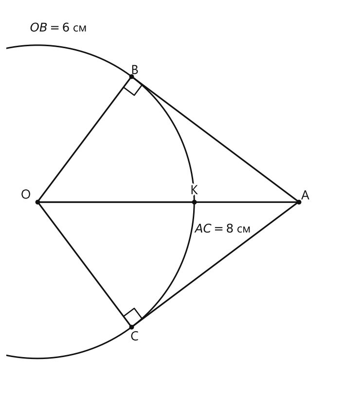
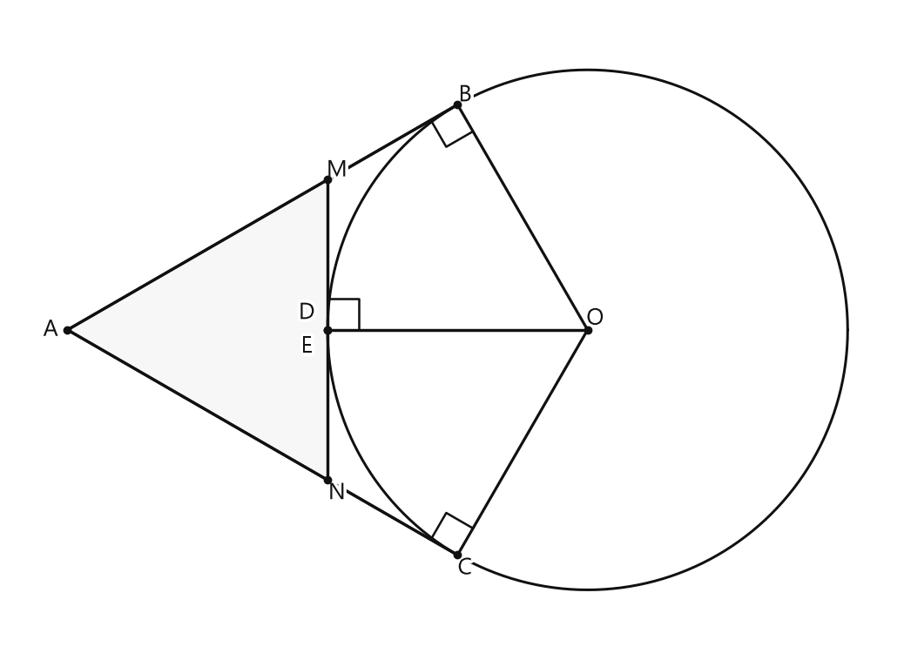
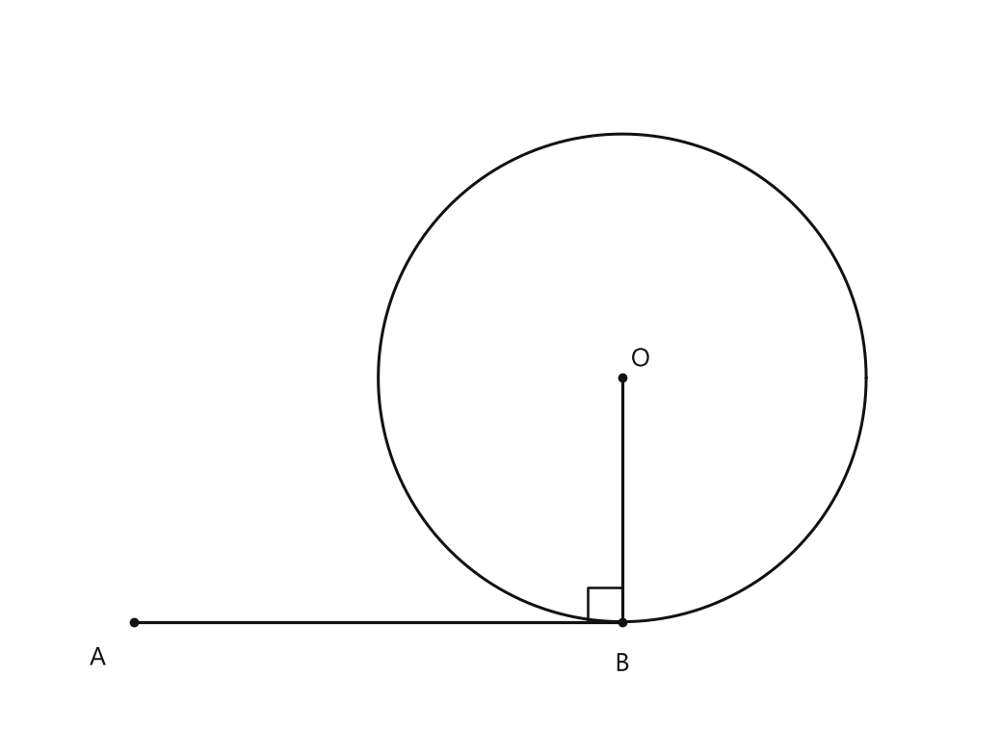
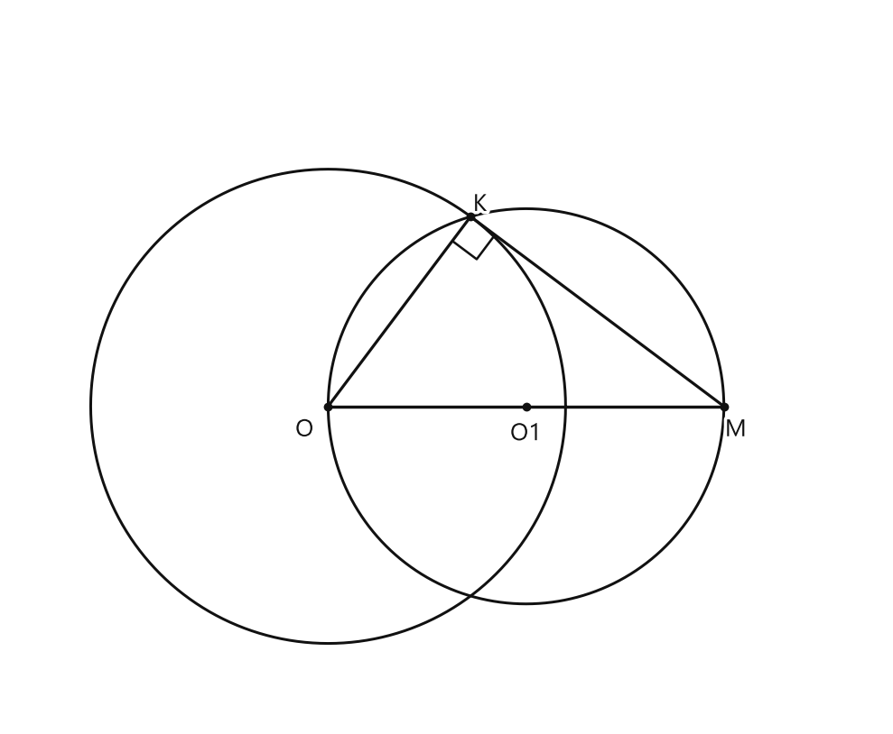

# Занятие 28. Касательная к окружности

**Раздел:** Глава 4. Окружность  
**Параграф учебника:** §25. Касательная к окружности  
**Страницы:** 167–173

## Цели занятия

После занятия ты умеешь:

- отличать касательную от секущей;
- применять свойство касательной и признак касательной;
- находить длины отрезков с помощью равенства касательных и теоремы Пифагора;
- находить углы в фигурах с касательными;
- решать задачи на окружность, вписанную в угол;
- строить касательную к окружности из точки, лежащей вне окружности.

Выбери блок своего уровня:

- **1–2 балла:** определения и перпендикулярность радиуса касательной;
- **3–4 балла:** длины касательных и прямоугольные треугольники;
- **5–6 баллов:** углы и окружность, вписанная в угол;
- **7–8 баллов:** комбинированные задачи;
- **9–10 баллов:** доказательства и построения.

---

## Теория к занятию

### 1. Окружность, круг и взаимное положение прямой и окружности

#### Простыми словами

Окружность — это граница фигуры, а круг — вся область внутри границы вместе с ней. Можно представить окружность как обод, а круг — как весь бублик.

Прямая и окружность могут иметь:

- ни одной общей точки;
- одну общую точку;
- две общие точки.

Если общая точка одна, прямая является касательной. Если общих точек две, прямая является секущей.

#### Определение

Окружность — это фигура, состоящая из всех точек плоскости, находящихся на одинаковом расстоянии от ее центра, которое равно радиусу окружности. Если расстояние от центра до точки больше радиуса окружности, то говорят, что точка находится вне окружности, а если меньше радиуса, то — внутри окружности. Все точки плоскости, находящиеся от центра окружности на расстоянии, меньшем или равном радиусу, образуют круг.

#### Определение

Прямая, проходящая через две точки окружности, называется секущей к окружности.

#### Определение

Прямая, которая имеет с окружностью только одну общую точку, называется касательной к окружности.

#### Формулы

Если $O$ — центр окружности, а $R$ — её радиус, то:

- точка на окружности: $OX=R$;
- точка внутри окружности: $OX<R$;
- точка вне окружности: $OX>R$.

#### Правила

- Одна общая точка — касательная.
- Две общие точки — секущая.
- Ни одной общей точки — прямая не пересекает окружность.
- Отрезок $OX$ является радиусом только тогда, когда точка $X$ лежит на окружности.

#### Ловушки

- Касательная имеет с окружностью только одну общую точку.
- Отрезок или луч касаются окружности только тогда, когда их точка касания принадлежит этому отрезку или лучу.
- Окружность и круг — разные фигуры: окружность является границей круга.

---

### 2. Признак касательной

#### Простыми словами

Чтобы доказать, что прямая является касательной, нужно:

- найти точку этой прямой, которая лежит на окружности;
- показать, что радиус, проведённый в эту точку, перпендикулярен прямой.

Получили точку окружности и угол $90^\circ$ — значит, касательная найдена. Геометрия принимает доказательства, а не догадки по рисунку.

#### Теорема (признак касательной)

Если прямая проходит через точку окружности и перпендикулярна радиусу, проведенному в эту точку, то она является касательной к окружности.

#### Формулы

Если прямая $l$ проходит через точку $K$ окружности и $OK\perp l$, то:

$$
l \text{ — касательная к окружности в точке } K.
$$

#### Алгоритм доказательства

1. Записать, что точка $K$ принадлежит окружности.
2. Указать, что $OK$ — радиус.
3. Доказать, что $OK\perp l$.
4. Сделать вывод по признаку касательной.

#### Ловушки

- Перпендикулярность должна быть именно в точке окружности.
- Недостаточно того, что прямая перпендикулярна радиусу. Она должна проходить через конец этого радиуса, лежащий на окружности.
- Фраза «по рисунку видно» доказательством не является. Рисунок иногда тоже умеет хитрить.

---

### 3. Свойство касательной

#### Простыми словами

Касательная касается окружности в одной точке. Если соединить эту точку с центром окружности, получится радиус, перпендикулярный касательной.

Поэтому треугольник, образованный центром, точкой касания и точкой на касательной, будет прямоугольным. А значит, можно применять теорему Пифагора.

#### Теорема (свойство касательной)

Касательная к окружности перпендикулярна радиусу, проведенному в точку касания.

#### Формулы

Если $AB$ — касательная в точке $B$, а $OB$ — радиус, то:

$$
OB\perp AB,
$$

поэтому треугольник $AOB$ прямоугольный.

По теореме Пифагора:

$$
AO^2=AB^2+OB^2.
$$

Если нужно найти катет $AB$, то:

$$
AB=\sqrt{AO^2-OB^2}.
$$

Если нужно найти катет $OB$, то:

$$
OB=\sqrt{AO^2-AB^2}.
$$

#### Правила

В прямоугольном треугольнике:

- гипотенуза лежит напротив прямого угла;
- гипотенуза длиннее каждого катета;
- квадрат гипотенузы равен сумме квадратов катетов;
- если ищем катет, из квадрата гипотенузы вычитаем квадрат другого катета.

#### Ловушки

- Радиус $OB$ перпендикулярен касательной $AB$ в точке $B$.
- Если ищем катет, используем разность квадратов.
- Например, $\sqrt{100}=10$, потому что $10^2=100$. Корень — это не деление числа на два, как бы ни хотелось сэкономить время.

---

### 4. Касательные, проведённые из одной точки

#### Простыми словами

Из одной внешней точки к окружности можно провести две касательные. Отрезки от этой точки до точек касания имеют одинаковую длину.

Если из точки $A$ проведены касательные $AB$ и $AC$, то можно сразу записать:

$$
AB=AC.
$$

Это равенство часто помогает найти периметр или неизвестный отрезок.

#### Теорема (о касательных, проведенных из одной точки)

Отрезки касательных, проведенных из одной точки к окружности (соединяющих данную точку и точку касания), равны между собой.

#### Формулы

Если $AB$ и $AC$ — касательные из точки $A$, то:

$$
AB=AC.
$$

Если из точки $M$ проведены касательные $MA$ и $MB$, то:

$$
MA=MB.
$$

#### Алгоритм

1. Найти точку, из которой проведены касательные.
2. Найти два отрезка, которые являются касательными из этой точки.
3. Приравнять их.
4. Использовать полученное равенство в периметре или уравнении.

#### Ловушки

- Равны отрезки касательных, проведённых из одной точки, до точек касания.
- Радиусы одной окружности тоже равны, но это уже другое свойство.
- Касательные из разных точек не обязаны иметь одинаковую длину.

---

### 5. Окружность, вписанная в угол

#### Простыми словами

Если окружность касается обеих сторон угла, она называется вписанной в угол.

Центр такой окружности лежит на биссектрисе угла. Почему? Точка на биссектрисе одинаково удалена от обеих сторон угла, а радиусы, проведённые к точкам касания, как раз являются такими расстояниями.

#### Определение

Если окружность касается сторон угла, то она называется вписанной в угол.

#### Теорема (свойство окружности, вписанной в угол)

Центр окружности, вписанной в угол, лежит на биссектрисе угла.

#### Формулы

Если окружность касается сторон угла с вершиной $A$, то её центр $O$ лежит на биссектрисе угла:

$$
\angle BAO=\angle OAC.
$$

Если точки касания на сторонах угла обозначены $B$ и $C$, то:

$$
AB=AC.
$$

Для треугольника $AMN$, в который вписана окружность:

$$
P_{AMN}=2AB.
$$

#### Правила

- Из одной точки к окружности отрезки касательных равны.
- Поэтому в периметре удобно объединять отрезки, выходящие из одной вершины.
- Центр окружности, вписанной в угол, нужно искать на биссектрисе этого угла.

#### Ловушки

- Биссектриса делит угол пополам, а не сторону.
- Равенство касательных относится к отрезкам от одной точки до точек касания.
- В формуле $P_{AMN}=2AB$ отрезок $AB$ должен быть касательной от вершины угла до точки касания.

---

### 6. Построение касательной из внешней точки

#### Простыми словами

Пусть дана окружность с центром $O$ и точка $M$ вне окружности. Нужно построить касательную, проходящую через $M$.

Сначала построим окружность с диаметром $MO$. Если точка $K$ лежит на этой окружности, то угол $MKO$ прямой, потому что он опирается на диаметр. Значит, $OK\perp MK$.

Точка $K$ лежит на данной окружности, поэтому по признаку касательной прямая $MK$ будет касательной.

#### Алгоритм построения

1. Соединить точку $M$ с центром окружности $O$.
2. Построить середину отрезка $MO$ и обозначить её $O_1$.
3. Построить окружность с центром $O_1$ и радиусом $O_1M$.
4. Отметить точку $K$ пересечения построенной окружности и данной окружности.
5. Провести прямую $MK$.
6. Прямая $MK$ — искомая касательная.

#### Обоснование

Угол $MKO$ — прямой, так как его вершина лежит на окружности и он опирается на диаметр.

Поэтому:

$$
OK\perp MK.
$$

Точка $K$ принадлежит данной окружности, значит, по признаку касательной прямая $MK$ является касательной.

#### Ловушки

- Центр вспомогательной окружности — середина отрезка $MO$.
- Её радиус равен $O_1M$.
- Из внешней точки обычно можно построить две касательные: второй вариант получится через вторую точку пересечения окружностей.
- Если точка находится внутри окружности, такую касательную через неё провести нельзя.

---

## Сводка формул «выучить наизусть»

Если $AB$ — касательная в точке $B$, а $OB$ — радиус, то:

$$
OB\perp AB.
$$

В прямоугольном треугольнике $AOB$:

$$
AO^2=AB^2+OB^2.
$$

Если $AB$ и $AC$ — касательные из точки $A$, то:

$$
AB=AC.
$$

Если окружность вписана в угол с вершиной $A$, то центр окружности лежит на биссектрисе:

$$
\angle BAO=\angle OAC.
$$

Для треугольника $AMN$ с вписанной окружностью:

$$
P_{AMN}=2AB.
$$

---

## Правила, которые нельзя путать

- **Касательная:** одна общая точка.
- **Секущая:** две общие точки.
- **Признак касательной:** перпендикулярность доказываем, чтобы получить касательную.
- **Свойство касательной:** если прямая уже касательная, радиус перпендикулярен ей.
- **Касательные из одной точки равны.**
- **Радиусы одной окружности равны.**
- **Центр окружности, вписанной в угол, лежит на биссектрисе.**

---

## Разбор ключевых заданий

### Р1. Длина касательной и отрезка до центра

**Условие.** Из точки $A$ к окружности с центром $O$ проведены две касательные $AB$ и $AC$, где $B$ и $C$ — точки касания. Известно, что $OB=6$ см, $AC=8$ см. На отрезке $AO$ взята точка $K$, причём $OK=OB$. Найдите $AK$.

Так как нужно использовать прямой угол и отрезок $AK$, схема содержит точки $A$, $O$, $K$, $B$, $C$ и отрезки $AB$, $AC$, $AO$, $OB$, $OC$, $OK.

<!--geo-figure-spec
{
  "needed": true,
  "kind": "plane",
  "caption": "Касательные $AB$ и $AC$ к окружности",
  "equal": true,
  "axis": false,
  "xlim": [
    -1.2,
    11.5
  ],
  "ylim": [
    -7.2,
    7.5
  ],
  "points": {
    "A": [
      10,
      0
    ],
    "O": [
      0,
      0
    ],
    "K": [
      6,
      0
    ],
    "B": [
      3.6,
      4.8
    ],
    "C": [
      3.6,
      -4.8
    ]
  },
  "segments": [
    [
      "A",
      "B"
    ],
    [
      "A",
      "C"
    ],
    [
      "A",
      "O"
    ],
    [
      "O",
      "B"
    ],
    [
      "O",
      "C"
    ],
    [
      "O",
      "K"
    ]
  ],
  "circles": [
    {
      "center": "O",
      "radius": 6
    }
  ],
  "labels": {
    "A": {
      "dx": 0.25,
      "dy": 0.22
    },
    "O": {
      "dx": -0.45,
      "dy": 0.25
    },
    "K": {
      "dx": 0,
      "dy": 0.42
    },
    "B": {
      "dx": 0.12,
      "dy": 0.22
    },
    "C": {
      "dx": 0.12,
      "dy": -0.38
    }
  },
  "right_angles": [
    {
      "vertex": "B",
      "from": "A",
      "to": "O"
    },
    {
      "vertex": "C",
      "from": "A",
      "to": "O"
    }
  ],
  "texts": [
    {
      "xy": [
        0.8,
        6.65
      ],
      "text": "$OB=6$ см"
    },
    {
      "xy": [
        7.1,
        -1.05
      ],
      "text": "$AC=8$ см"
    }
  ]
}
-->

*Касательные AB и AC к окружности*

**Решение.**

Точки $B$ и $C$ — точки касания, а $AB$ и $AC$ — касательные, проведённые из одной точки $A$.

По теореме о касательных:

$$
AB=AC.
$$

По условию $AC=8$ см, значит:

$$
AB=8\text{ см}.
$$

Радиус $OB$ проведён в точку касания $B$. По свойству касательной:

$$
OB\perp AB.
$$

Значит, треугольник $AOB$ прямоугольный, а $AO$ — его гипотенуза.

По теореме Пифагора:

$$
AO^2=AB^2+OB^2.
$$

Подставим известные длины:

$$
AO^2=8^2+6^2.
$$

$$
AO^2=64+36.
$$

$$
AO^2=100.
$$

Так как длина отрезка положительна:

$$
AO=10\text{ см}.
$$

По условию:

$$
OK=OB=6\text{ см}.
$$

Точка $K$ лежит на отрезке $AO$, поэтому весь отрезок $AO$ состоит из двух частей:

$$
AO=AK+KO.
$$

Отсюда:

$$
AK=AO-OK.
$$

$$
AK=10-6=4\text{ см}.
$$

**Ответ: $4$ см.**

Сначала нашли весь отрезок $AO$, а затем из него вычли $OK$. Иначе можно случайно найти не тот кусочек — геометрический «спойлер» без счастливого конца.

---

### Р2. Периметр треугольника с вписанной окружностью

**Условие.** В угол $A$ вписана окружность. Она касается сторон угла в точках $B$ и $C$, а стороны треугольника $AMN$ — в точках $D$ и $E$. Известно, что $AB=12$ см. Найдите периметр треугольника $AMN$.

<!--geo-figure-spec
{
  "needed": true,
  "kind": "plane",
  "caption": "Окружность в угле $A$ и треугольник $AMN$",
  "equal": true,
  "axis": false,
  "xlim": [
    -1.5,
    22
  ],
  "ylim": [
    -8.5,
    8.5
  ],
  "points": {
    "A": [
      0,
      0
    ],
    "M": [
      6.92820323,
      4
    ],
    "N": [
      6.92820323,
      -4
    ],
    "B": [
      10.39230485,
      6
    ],
    "C": [
      10.39230485,
      -6
    ],
    "D": [
      6.92820323,
      0
    ],
    "E": [
      6.92820323,
      0
    ],
    "O": [
      13.85640646,
      0
    ]
  },
  "segments": [
    [
      "A",
      "M"
    ],
    [
      "A",
      "N"
    ],
    [
      "M",
      "N"
    ],
    [
      "A",
      "B"
    ],
    [
      "A",
      "C"
    ],
    [
      "M",
      "B"
    ],
    [
      "N",
      "C"
    ],
    [
      "M",
      "D"
    ],
    [
      "N",
      "E"
    ],
    [
      "O",
      "B"
    ],
    [
      "O",
      "C"
    ],
    [
      "O",
      "D"
    ],
    [
      "O",
      "E"
    ]
  ],
  "polygons": [
    {
      "vertices": [
        "A",
        "M",
        "N"
      ],
      "fill": 0.03
    }
  ],
  "circles": [
    {
      "center": "O",
      "radius": 6.92820323
    }
  ],
  "labels": {
    "A": {
      "dx": -0.45,
      "dy": 0
    },
    "M": {
      "dx": 0.25,
      "dy": 0.25
    },
    "N": {
      "dx": 0.25,
      "dy": -0.35
    },
    "B": {
      "dx": 0.2,
      "dy": 0.25
    },
    "C": {
      "dx": 0.2,
      "dy": -0.35
    },
    "D": {
      "dx": -0.55,
      "dy": 0.45
    },
    "E": {
      "dx": -0.55,
      "dy": -0.45
    },
    "O": {
      "dx": 0.2,
      "dy": 0.3
    }
  },
  "right_angles": [
    {
      "vertex": "B",
      "from": "A",
      "to": "O"
    },
    {
      "vertex": "C",
      "from": "A",
      "to": "O"
    },
    {
      "vertex": "D",
      "from": "M",
      "to": "O"
    }
  ]
}
-->

*Окружность в угле A и треугольник AMN*

**Решение.**

Отрезки $AB$ и $AC$ — касательные, проведённые из одной точки $A$.

По теореме о касательных:

$$
AB=AC.
$$

По условию:

$$
AB=12\text{ см}.
$$

Значит:

$$
AC=12\text{ см}.
$$

Рассмотрим касательные из точки $M$:

$$
MD=MB.
$$

Рассмотрим касательные из точки $N$:

$$
NE=NC.
$$

Периметр треугольника равен:

$$
P_{AMN}=AM+MN+AN.
$$

Точка $D$ лежит на стороне $MN$, поэтому:

$$
MN=MD+DN.
$$

Точка $E$ лежит на стороне $MN$, поэтому в записи по рисунку:

$$
MN=MD+NE.
$$

Тогда:

$$
P_{AMN}=AM+MD+NE+AN.
$$

Сгруппируем отрезки, выходящие из вершин $M$ и $N$:

$$
P_{AMN}=(AM+MB)+(AN+NC).
$$

Каждая скобка — это сторона угла от вершины до другой точки касания:

$$
AM+MB=AB,
$$

$$
AN+NC=AC.
$$

Следовательно:

$$
P_{AMN}=AB+AC.
$$

Подставим длины:

$$
P_{AMN}=12+12=24\text{ см}.
$$

Можно запомнить короткую запись:

$$
P_{AMN}=2AB.
$$

Тогда:

$$
P_{AMN}=2\cdot12=24\text{ см}.
$$

**Ответ: $24$ см.**

---

### Р3. Угол между радиусом и касательной

**Условие.** Прямая $AB$ касается окружности в точке $B$. Центр окружности — точка $O$. Найдите угол $ABO$.

<!--geo-figure-spec
{
  "needed": true,
  "kind": "plane",
  "caption": "Касательная $AB$ и радиус $OB$",
  "equal": true,
  "axis": false,
  "xlim": [
    -1,
    7
  ],
  "ylim": [
    -1,
    5
  ],
  "points": {
    "A": [
      0,
      0
    ],
    "B": [
      4,
      0
    ],
    "O": [
      4,
      2
    ]
  },
  "segments": [
    [
      "A",
      "B"
    ],
    [
      "B",
      "O"
    ]
  ],
  "circles": [
    {
      "center": "O",
      "radius": 2
    }
  ],
  "labels": {
    "A": {
      "dx": -0.3,
      "dy": -0.3
    },
    "B": {
      "dx": 0,
      "dy": -0.35
    },
    "O": {
      "dx": 0.15,
      "dy": 0.15
    }
  },
  "right_angles": [
    {
      "vertex": "B",
      "from": "A",
      "to": "O"
    }
  ]
}
-->

*Касательная AB и радиус OB*

**Решение.**

Прямая $AB$ является касательной, а точка $B$ — точка касания.

Отрезок $OB$ — радиус, проведённый в точку касания.

По свойству касательной:

$$
OB\perp AB.
$$

Перпендикулярные прямые образуют прямой угол.

Поэтому:

$$
\angle ABO=90^\circ.
$$

**Ответ: $90^\circ$.**

---

### Р4. Угол в прямоугольном треугольнике

**Условие.** Прямая $AB$ касается окружности с центром $O$ в точке $B$. В треугольнике $AOB$ угол $AOB$ равен $60^\circ$. Найдите угол $BAO$.

**Решение.**

Смотри: $OB$ — радиус, проведённый в точку касания $B$.

Радиус, проведённый в точку касания, перпендикулярен касательной:

$$
AB\perp OB.
$$

Значит, угол между сторонами $AB$ и $OB$ прямой:

$$
\angle ABO=90^\circ.
$$

Сумма углов треугольника равна $180^\circ$:

$$
\angle BAO+\angle AOB+\angle ABO=180^\circ.
$$

Подставим известные значения:

$$
\angle BAO+60^\circ+90^\circ=180^\circ.
$$

Сложим известные углы:

$$
\angle BAO+150^\circ=180^\circ.
$$

Найдём неизвестный угол:

$$
\angle BAO=180^\circ-150^\circ.
$$

$$
\angle BAO=30^\circ.
$$

**Ответ: $30^\circ$.**

---

### Р5. Длина касательной

**Условие.** Из точки $A$ к окружности с центром $O$ проведена касательная $AB$. Известно, что $AO=13$ см, а радиус окружности $OB=5$ см. Найдите $AB$.

**Решение.**

Радиус $OB$ проведён в точку касания $B$.

По свойству касательной:

$$
OB\perp AB.
$$

Значит, треугольник $AOB$ прямоугольный.

Прямой угол находится при вершине $B$, поэтому сторона $AO$, лежащая напротив него, является гипотенузой.

По теореме Пифагора:

$$
AO^2=AB^2+OB^2.
$$

Выразим квадрат неизвестного отрезка $AB$:

$$
AB^2=AO^2-OB^2.
$$

Подставим данные:

$$
AB^2=13^2-5^2.
$$

$$
AB^2=169-25.
$$

$$
AB^2=144.
$$

Длина отрезка положительна, поэтому:

$$
AB=12\text{ см}.
$$

Минус здесь не подходит: длина отрезка не бывает отрицательной. Геометрия любит только положительные расстояния.

**Ответ: $12$ см.**

Проверим результат:

$$
12^2+5^2=144+25=169=13^2.
$$

Равенство выполняется.

---

### Р6. Угол между двумя касательными

**Условие.** Из точки $M$ к окружности проведены касательные $MA$ и $MB$, где $A$ и $B$ — точки касания. Центральный угол $\angle AOB=120^\circ$. Найдите угол $AMB$.

**Решение.**

Радиус $OA$ проведён в точку касания $A$, поэтому он перпендикулярен касательной $MA$:

$$
OA\perp MA.
$$

Значит:

$$
\angle OAM=90^\circ.
$$

Точно так же радиус $OB$ перпендикулярен касательной $MB$:

$$
OB\perp MB.
$$

Поэтому:

$$
\angle OBM=90^\circ.
$$

Рассмотрим четырёхугольник $AOBM$.

Сумма его углов равна $360^\circ$:

$$
\angle AOB+\angle OBM+\angle BMA+\angle MAO=360^\circ.
$$

Угол $\angle BMA$ — это тот же угол, что и $\angle AMB$.

Подставим известные значения:

$$
120^\circ+90^\circ+\angle AMB+90^\circ=360^\circ.
$$

Сложим известные углы:

$$
\angle AMB+300^\circ=360^\circ.
$$

Тогда:

$$
\angle AMB=360^\circ-300^\circ.
$$

$$
\angle AMB=60^\circ.
$$

Два прямых угла уже заняли половину оборота, а оставшиеся $120^\circ$ и искомый угол делят вторую половину. Вот и получились $60^\circ$.

**Ответ: $60^\circ$.**

---

### Р7. Признак касательной

**Условие.** Точка $K$ лежит на окружности с центром $O$. Прямая $l$ проходит через точку $K$. Известно, что $OK\perp l$. Докажите, что прямая $l$ является касательной к окружности.

**Решение.**

Точка $K$ лежит на окружности.

Значит, отрезок $OK$ является радиусом, проведённым в точку $K$.

По условию:

$$
OK\perp l.
$$

Таким образом, прямая $l$:

- проходит через точку окружности $K$;
- перпендикулярна радиусу $OK$, проведённому в эту точку.

По теореме-признаку касательной такая прямая является касательной:

$$
l \text{ является касательной к окружности}.
$$

**Ответ:** прямая $l$ — касательная к окружности в точке $K$.

---

### Р8. Построение касательной из внешней точки

**Условие.** Дана окружность с центром $O$ и точка $M$, лежащая вне окружности. Постройте касательную к окружности, проходящую через точку $M$.

<!--geo-figure-spec
{
  "needed": true,
  "kind": "plane",
  "caption": "Построение касательной $MK$",
  "equal": true,
  "axis": false,
  "xlim": [
    -4,
    7
  ],
  "ylim": [
    -4,
    5
  ],
  "points": {
    "O": [
      0,
      0
    ],
    "M": [
      5,
      0
    ],
    "K": [
      1.8,
      2.4
    ],
    "O1": [
      2.5,
      0
    ]
  },
  "segments": [
    [
      "M",
      "O"
    ],
    [
      "M",
      "K"
    ],
    [
      "O",
      "K"
    ],
    [
      "O1",
      "M"
    ],
    [
      "O1",
      "O"
    ]
  ],
  "circles": [
    {
      "center": "O",
      "radius": 3
    },
    {
      "center": "O1",
      "radius": 2.5
    }
  ],
  "labels": {
    "O": {
      "dx": -0.3,
      "dy": -0.3
    },
    "M": {
      "dx": 0.15,
      "dy": -0.3
    },
    "K": {
      "dx": 0.12,
      "dy": 0.15
    },
    "O1": {
      "dx": 0,
      "dy": -0.35
    }
  },
  "right_angles": [
    {
      "vertex": "K",
      "from": "M",
      "to": "O"
    }
  ]
}
-->

*Построение касательной MK*

**Построение.**

1. Соединим точку $M$ с центром окружности $O$.
2. Построим середину отрезка $MO$ и обозначим её $O_1$.
3. Проведём окружность с центром $O_1$ и радиусом $O_1M$.
4. Эта окружность проходит через точки $M$ и $O$, то есть $MO$ является её диаметром.
5. Одну из точек пересечения построенной окружности с данной окружностью обозначим буквой $K$.
6. Проведём прямую $MK$.

**Доказательство.**

Точка $K$ лежит на окружности, для которой $MO$ является диаметром.

Угол, опирающийся на диаметр, прямой:

$$
\angle MKO=90^\circ.
$$

Следовательно:

$$
MK\perp OK.
$$

Точка $K$ лежит на данной окружности, а $OK$ — радиус, проведённый в точку $K$.

Прямая $MK$ проходит через точку окружности $K$ и перпендикулярна радиусу $OK$.

По признаку касательной:

$$
MK \text{ является касательной к данной окружности}.
$$

**Ответ:** построенная прямая $MK$ — касательная к окружности в точке $K$.

---

### Р9. Доказательство касательной по двум углам

**Условие.** Точка $M$ лежит вне окружности с центром $O$, точка $K$ принадлежит окружности. Известно, что

$$
\angle KMO+\angle MOK=90^\circ.
$$

Докажите, что прямая $MK$ является касательной к окружности.

**Решение.**

Рассмотрим треугольник $MOK$.

В нём два угла в сумме дают $90^\circ$:

$$
\angle KMO+\angle MOK=90^\circ.
$$

Сумма углов треугольника равна $180^\circ$.

Значит, третий угол равен:

$$
\angle MKO=180^\circ-90^\circ.
$$

$$
\angle MKO=90^\circ.
$$

Следовательно:

$$
MK\perp OK.
$$

Точка $K$ принадлежит окружности, поэтому $OK$ — радиус, проведённый в точку $K$.

Прямая $MK$ проходит через точку окружности $K$ и перпендикулярна радиусу $OK$.

По признаку касательной:

$$
MK \text{ — касательная к окружности}.
$$

**Ответ:** прямая $MK$ является касательной к окружности в точке $K$.

---

## Короткая самопроверка

1. Сколько общих точек у касательной и окружности?  
2. Как расположен радиус к касательной в точке касания?  
3. Чему равны касательные, проведённые из одной точки?  
4. Где находится центр окружности, вписанной в угол?  
5. Как построить касательную из внешней точки?

### Ответы

1. Одна общая точка.  
2. Перпендикулярно.  
3. Они равны.  
4. На биссектрисе угла.  
5. Построить окружность с диаметром, соединяющим внешнюю точку и центр данной окружности; соединить внешнюю точку с точкой пересечения окружностей.

## Практические задания

Выбери свой уровень и решай только этот блок. В блоке должна закрепиться вся тема параграфа. Ответы не приводятся.

### Уровень 1–2 балла

**С1.** Какая прямая называется касательной к окружности?

1) Прямая, имеющая с окружностью две общие точки  
2) Прямая, имеющая с окружностью только одну общую точку  
3) Прямая, проходящая через центр окружности  
4) Прямая, не имеющая с окружностью общих точек  
5) Прямая, соединяющая две точки окружности

**С2.** Радиус окружности, проведённый в точку касания, равен $7$ см. Чему равен угол между этим радиусом и касательной?

1) $30^\circ$  
2) $45^\circ$  
3) $60^\circ$  
4) $90^\circ$  
5) $180^\circ$

**С3.** Прямая $AB$ касается окружности с центром $O$ в точке $B$. Какое утверждение верно?

1) $AB \parallel OB$  
2) $AB = OB$  
3) $AB \perp OB$  
4) $AB$ проходит через $O$  
5) $AB$ является диаметром окружности

**С4.** Точка $A$ находится вне окружности с центром $O$, а $AB$ — касательная, где $B$ — точка касания. Если $OA=13$ см и $OB=5$ см, найдите $AB$.

**С5.** Из точки $M$ к окружности проведены две касательные $MA$ и $MB$, где $A$ и $B$ — точки касания. Если $MA=9$ см, найдите $MB$.

**С6.** Из точки $A$ проведены две касательные к окружности: $AB$ и $AC$. Точки $B$ и $C$ — точки касания. Какое равенство верно?

1) $AB=OC$  
2) $AB=AC$  
3) $AB=BC$  
4) $AC=AO$  
5) $AB=AO$

**С7.** В точке $B$ окружности проведена касательная $l$. Радиус $OB$ образует с прямой $l$ угол $90^\circ$. Какой вывод можно сделать?

1) $l$ является секущей  
2) $l$ не пересекает окружность  
3) $l$ является касательной  
4) $OB$ является диаметром  
5) $O$ лежит на прямой $l$

**С8.** Из точки $A$ к окружности с центром $O$ проведена касательная $AB$, где $B$ — точка касания. Если $AB=12$ см и $OB=5$ см, найдите $AO$.

**С9.** Из точки $M$ к окружности проведены касательные $MA$ и $MB$. Если $MA=2x+1$ см, а $MB=9$ см, найдите $x$.

**С10.** Окружность касается двух сторон угла $A$. Какой линии принадлежит центр этой окружности?

1) Прямой, проходящей через вершину угла и перпендикулярной одной из его сторон  
2) Биссектрисе угла  
3) Любой стороне угла  
4) Диаметру окружности  
5) Касательной к окружности

**С11.** Прямая $l$ проходит через точку $B$ окружности с центром $O$. Известно, что $OB=6$ см и $OB\perp l$. Выберите верное утверждение.

1) Прямая $l$ — секущая  
2) Прямая $l$ — касательная  
3) Точка $B$ находится внутри окружности  
4) Прямая $l$ проходит через центр $O$  
5) Отрезок $OB$ является хордой

**С12.** Из точки $A$ к окружности проведены две касательные $AB$ и $AC$. Точки $B$ и $C$ — точки касания. Если $AB=3x-2$ см, а $AC=10$ см, найдите $x$.

**С13.** Выберите верное утверждение о касательной к окружности.

1) Касательная имеет с окружностью две общие точки.  
2) Касательная не имеет общих точек с окружностью.  
3) Касательная имеет с окружностью только одну общую точку.  
4) Касательная проходит через центр окружности.  
5) Касательная совпадает с радиусом.

**С14.** Радиус окружности, проведённый в точку касания, равен $7$ см. Чему равен угол между этим радиусом и касательной?

**С15.** Прямая проходит через точку окружности и перпендикулярна радиусу, проведённому в эту точку. Как называется эта прямая?

1) Диаметр  
2) Секущая  
3) Хорда  
4) Касательная  
5) Биссектриса

**С16.** Из точки $A$ к окружности проведены две касательные $AB$ и $AC$, где $B$ и $C$ — точки касания. Если $AB=9$ см, найдите $AC$.

**С17.** Укажите все верные утверждения.

1) Радиус, проведённый в точку касания, перпендикулярен касательной.  
2) Касательная имеет с окружностью только одну общую точку.  
3) Две касательные, проведённые из одной точки к окружности, имеют равные отрезки до точек касания.  
4) Секущая имеет с окружностью только одну общую точку.  
5) Центр окружности, вписанной в угол, лежит на биссектрисе этого угла.

**С18.** Касательная $AB$ касается окружности в точке $B$, а $O$ — центр окружности. Найдите $\angle ABO$, если $AB$ и $OB$ образуют прямой угол.

**С19.** Из точки $M$ проведены касательные $MA$ и $MB$ к окружности. Точки $A$ и $B$ — точки касания. Выберите верное равенство.

1) $MA=OB$  
2) $MA=MB$  
3) $MA=AB$  
4) $MB=OB$  
5) $MA+MB=AB$

**С20.** Касательная $AB$ к окружности с центром $O$ проведена в точке $B$. Запишите, какие отрезки или прямые должны быть перпендикулярны согласно свойству касательной.

**С21.** Окружность касается сторон угла $A$. Как называется такая окружность?

1) Описанная около угла  
2) Вписанная в угол  
3) Секущая угла  
4) Диаметральная  
5) Центральная

**С22.** Из точки $P$ к окружности проведены касательные $PA$ и $PB$. Точки $A$ и $B$ — точки касания. Если $PA=12$ см, найдите длину отрезка $PB$.

**С23.** Прямая $l$ проходит через точку $K$ окружности. Радиус $OK$ перпендикулярен прямой $l$. Выберите вывод, который следует из этих данных.

1) $l$ является диаметром окружности.  
2) $l$ является секущей окружности.  
3) $l$ является касательной к окружности.  
4) $K$ находится внутри окружности.  
5) $O$ лежит на прямой $l$.

**С24.** В угол $A$ вписана окружность с центром $O$. На какой линии лежит точка $O$?

1) На стороне угла $A$  
2) На внешней биссектрисе угла $A$  
3) На биссектрисе угла $A$  
4) На касательной к окружности  
5) На диаметре окружности

**С25.** Выберите верное утверждение о касательной к окружности.

1) Касательная имеет с окружностью две общие точки.  
2) Касательная имеет с окружностью только одну общую точку.  
3) Касательная не имеет общих точек с окружностью.  
4) Касательная проходит через центр окружности.  
5) Касательная совпадает с радиусом.

**С26.** Прямая $l$ проходит через точку $A$ окружности с центром $O$. Известно, что $OA \perp l$. Выберите верное утверждение.

1) $l$ — секущая.  
2) $l$ — диаметр.  
3) $l$ — касательная.  
4) $l$ не пересекает окружность.  
5) $l$ проходит через центр окружности.

**С27.** Радиус окружности, проведённый в точку касания, перпендикулярен касательной. Какова величина угла между радиусом и касательной?

1) $30^\circ$  
2) $45^\circ$  
3) $60^\circ$  
4) $90^\circ$  
5) $180^\circ$

**С28.** Из точки $A$ к окружности проведены две касательные $AB$ и $AC$, где $B$ и $C$ — точки касания. Если $AB=7$ см, найдите $AC$.

**С29.** Из точки $M$ к окружности проведены две касательные $MA$ и $MB$. Выберите верное равенство.

1) $MA=MO$  
2) $MB=MO$  
3) $MA=AB$  
4) $MA=MB$  
5) $AB=MO$

**С30.** Окружность с центром $O$ касается прямой $AB$ в точке $B$. Какой отрезок перпендикулярен прямой $AB$?

1) $OA$  
2) $OB$  
3) $AB$  
4) $AO$  
5) любой отрезок окружности

**С31.** Точка $A$ находится вне окружности с центром $O$. Отрезок $AB$ — касательная, $B$ — точка касания. Если $OA=13$ см, а радиус окружности $OB=5$ см, найдите $AB$.

**С32.** Прямая $m$ проходит через две точки $A$ и $B$ окружности. Как называется эта прямая?

1) Радиус  
2) Диаметр  
3) Касательная  
4) Секущая  
5) Биссектриса

**С33.** Окружность вписана в угол $A$. Центр окружности обозначен точкой $O$. На какой линии лежит точка $O$?

1) На стороне угла  
2) На биссектрисе угла  
3) На касательной к окружности  
4) На хорде окружности  
5) На внешней биссектрисе угла

**С34.** Из точки $P$ к окружности проведены касательные $PA$ и $PB$, где $A$ и $B$ — точки касания. Если $PB=11$ см, найдите длину отрезка $PA$.

**С35.** Прямая $l$ касается окружности с центром $O$ в точке $K$. Выберите все верные утверждения.

1) $OK\perp l$.  
2) $K$ принадлежит окружности.  
3) Прямая $l$ имеет с окружностью одну общую точку.  
4) $OK$ является касательной.  
5) $l$ проходит через центр $O$.

**С36.** Точка $A$ находится вне окружности с центром $O$. Через точку $B$ окружности проведена прямая $AB$, причём $AB\perp OB$. Выберите верное утверждение.

1) $AB$ — секущая.  
2) $AB$ — диаметр.  
3) $AB$ — касательная.  
4) $AB$ не пересекает окружность.  
5) $AB$ проходит через центр окружности.

### Уровень 3–4 балла

**С1.** Радиус окружности с центром в точке $O$ равен $5$ см. Прямая $AB$ касается окружности в точке $B$. Найдите величину угла $ABO$.

**С2.** Прямая $l$ проходит через точку $A$ окружности с центром в точке $O$. Известно, что $OA \perp l$. Является ли прямая $l$ касательной к окружности? Запишите ответ и укажите теорему, на основании которой он сделан.

**С3.** Из точки $A$ к окружности проведены две касательные $AB$ и $AC$, где $B$ и $C$ — точки касания. Длина отрезка $AB$ равна $9$ см. Найдите длину отрезка $AC$.

**С4.** Из точки $A$ к окружности с центром в точке $O$ проведена касательная $AB$, где $B$ — точка касания. Известно, что $OB=6$ см и $AB=8$ см. Найдите длину отрезка $AO$.

**С5.** Из точки $A$ к окружности с центром в точке $O$ проведены касательные $AB$ и $AC$, где $B$ и $C$ — точки касания. Известно, что $OB=5$ см и $AO=13$ см. Найдите длину отрезка $AB$.

**С6.** Касательная $AB$ касается окружности с центром в точке $O$ в точке $B$. Известно, что $\angle A=35^\circ$ в треугольнике $AOB$. Найдите величину угла $AOB$.

**С7.** Из точки $M$ к окружности проведены две касательные $MA$ и $MB$, где $A$ и $B$ — точки касания. Периметр треугольника $MAB$ равен $34$ см, а $AB=10$ см. Найдите длину каждого из отрезков $MA$ и $MB$.

**С8.** В угол $A$ вписана окружность, касающаяся его сторон в точках $B$ и $C$. Известно, что $AB=7$ см, $AC=11$ см и $BC=8$ см. Найдите периметр треугольника $ABC$.

**С9.** Окружность с центром в точке $O$ касается сторон угла $A$ в точках $B$ и $C$. Найдите величину угла $OAB$, если $\angle A=64^\circ$.

**С10.** В треугольнике $ABC$ окружность касается сторон $AB$ и $AC$. Центр окружности обозначен точкой $O$. Известно, что $\angle B=48^\circ$ и $\angle C=72^\circ$. Найдите величину угла $OAB$.

**С11.** Из точки $A$ к окружности проведены касательная $AB$ и секущая $AC$, проходящая через центр $O$ окружности. Известно, что $AB=12$ см, а $\angle BAC=60^\circ$. Найдите радиус окружности.

**С12.** Из точки $A$ к окружности с центром в точке $O$ проведены касательная $AB$ и секущая $AC$, проходящая через центр окружности. Длина отрезка $AO$ равна $10$ см, а радиус окружности равен $6$ см. Найдите длину отрезка $AB$.

**С13.** Выберите верное утверждение о касательной к окружности.

1) Прямая имеет с окружностью две общие точки.  
2) Прямая не имеет общих точек с окружностью.  
3) Прямая имеет с окружностью только одну общую точку.  
4) Прямая проходит через центр окружности.  
5) Прямая совпадает с диаметром окружности.

**С14.** Радиус окружности с центром в точке $O$ проведён в точку касания $K$. Касательная в точке $K$ обозначена прямой $l$. Найдите угол между лучом $OK$ и прямой $l$.

**С15.** Прямая $AB$ проходит через точку $B$ окружности с центром $O$. Известно, что $OB=7$ см и $OB\perp AB$. Объясните, почему прямая $AB$ является касательной к окружности.

**С16.** Из точки $A$ к окружности проведены две касательные $AB$ и $AC$, где $B$ и $C$ — точки касания. Длина отрезка $AB$ равна $11$ см. Найдите длину отрезка $AC$.

**С17.** Из точки $M$ к окружности с центром $O$ проведена касательная $MA$, где $A$ — точка касания. Известно, что $OA=9$ см, $OM=15$ см. Найдите длину отрезка $MA$.

**С18.** Из точки $P$ к окружности проведены касательные $PA$ и $PB$, где $A$ и $B$ — точки касания. Известно, что $PA=2x+3$ см, $PB=5x-9$ см. Найдите $x$.

**С19.** Касательная $AB$ касается окружности с центром $O$ в точке $B$. Угол между лучами $BA$ и $BO$ равен $90^\circ$. Найдите длину $AO$, если $AB=12$ см и $BO=5$ см.

**С20.** Из точки $A$ к окружности проведены две касательные $AB$ и $AC$, где $B$ и $C$ — точки касания. Известно, что $AB=AC=8$ см. Найдите периметр треугольника $ABC$, если $BC=10$ см.

**С21.** Окружность вписана в угол $ABC$ и касается его сторон в точках $M$ и $N$. Центр окружности обозначен точкой $O$. На какой линии лежит точка $O$?

1) На стороне $BM$  
2) На стороне $BN$  
3) На биссектрисе угла $ABC$  
4) На перпендикуляре к стороне $BC$  
5) На окружности

**С22.** Окружность с центром $O$ касается сторон угла $A$ в точках $M$ и $N$. Известно, что $AM=7$ см. Найдите длину отрезка $AN$.

**С23.** Постройте с помощью циркуля и линейки касательную к данной окружности с центром $O$ через точку $A$, лежащую вне окружности. Опишите последовательность построения. При этом радиус окружности равен $3$ см, а $AO=7$ см.

**С24.** Дана окружность с центром $O$ и радиусом $4$ см. Точка $A$ находится вне окружности, причём $AO=5$ см. Через точку $A$ проведена касательная, касающаяся окружности в точке $B$. Найдите длину отрезка $AB$.

**С25.** Радиус окружности с центром в точке $O$ равен $7$ см. Прямая $AB$ касается окружности в точке $B$. Найдите угол $OBA$.

**С26.** Из точки $A$ к окружности проведены две касательные $AB$ и $AC$, где $B$ и $C$ — точки касания. Известно, что $AB=13$ см. Найдите длину отрезка $AC$.

**С27.** Радиус окружности с центром в точке $O$ равен $6$ см, а расстояние от точки $A$ до центра окружности равно $10$ см. Из точки $A$ проведена касательная $AB$, где $B$ — точка касания. Найдите $AB$.

**С28.** Прямая $l$ проходит через точку $B$ окружности с центром в точке $O$. Известно, что $OB\perp l$. Определите взаимное положение прямой $l$ и окружности.

**С29.** Касательная $AB$ касается окружности с центром в точке $O$ в точке $B$. Угол между лучами $AO$ и $AB$ равен $38^\circ$. Найдите второй острый угол треугольника $AOB$.

**С30.** Из точки $M$ к окружности проведены касательные $MA$ и $MB$, где $A$ и $B$ — точки касания. Найдите периметр треугольника $MAB$, если $MA=MB=9$ см, а $AB=14$ см.

**С31.** Из точки $A$ к окружности с центром в точке $O$ проведена касательная $AB$, где $B$ — точка касания. Найдите $AO$, если $AB=12$ см, а радиус окружности $OB=5$ см.

**С32.** К окружности с центром в точке $O$ проведена касательная $AB$, где $B$ — точка касания. В треугольнике $AOB$ угол $A$ равен $30^\circ$, а $OB=6$ см. Найдите длину отрезка $AB$.

**С33.** Окружность касается сторон угла $A$ в точках $B$ и $C$. Известно, что $AB=11$ см. Найдите $AC$.

**С34.** Окружность вписана в угол $A$. Ее центр — точка $O$. Луч $AK$ является биссектрисой угла $A$. Определите, на какой линии расположена точка $O$ относительно угла $A$.

**С35.** Из точки $A$ к окружности проведены касательная $AB$ и секущая, пересекающая окружность в точках $C$ и $D$. Известно, что $AC=4$ см, $CD=5$ см, $AB=6$ см. Проверьте, могут ли такие данные соответствовать одной окружности, если использовать равенство $AB^2=AC\cdot AD$.

**С36.** Постройте с помощью циркуля и линейки касательную к данной окружности, проходящую через точку $A$, расположенную вне окружности. Опишите последовательность построения: соедините $A$ с центром окружности $O$, постройте середину отрезка $AO$, а затем используйте окружность с центром в этой середине.

### Уровень 5–6 баллов

**С1.** Окружность имеет центр $O$ и радиус $6$ см. Прямая $l$ проходит через точку $B$ окружности, причём $OB \perp l$. Определите, является ли прямая $l$ касательной к окружности.

**С2.** Из точки $A$, находящейся вне окружности с центром $O$, проведена касательная $AB$, где $B$ — точка касания. Найдите $AB$, если $AO=13$ см, а радиус окружности равен $5$ см.

**С3.** Из точки $M$ к окружности проведены две касательные $MA$ и $MB$, где $A$ и $B$ — точки касания. Найдите $MB$, если $MA=7{,}5$ см.

**С4.** Касательная $AB$ касается окружности с центром $O$ в точке $B$. Найдите угол $ABO$ и объясните, почему он имеет такую величину.

**С5.** Из точки $A$ к окружности проведены касательные $AB$ и $AC$, где $B$ и $C$ — точки касания. Найдите периметр треугольника $ABC$, если $AB=AC=9$ см и $BC=12$ см.

**С6.** Из точки $A$ к окружности с центром $O$ проведены касательные $AB$ и $AC$, где $B$ и $C$ — точки касания. Найдите величину угла $BAC$, если $\angle BOC=116^\circ$.

**С7.** Из точки $A$ к окружности проведены касательная $AB$ и секущая, проходящая через центр $O$ окружности. Касательная $AB$ образует с прямой $AO$ угол $60^\circ$, а $AB=6$ см. Найдите радиус и диаметр окружности.

**С8.** Окружность вписана в угол $A$. Она касается одной стороны угла в точке $B$, другой стороны — в точке $C$. Известно, что $AB=10$ см и $AC=14$ см. Найдите периметр треугольника $ABC$.

**С9.** Окружность с центром $P(0;0)$ имеет радиус $5$. Из точки $A(5;12)$ к окружности проведена касательная $AB$, где $B$ — точка касания. Найдите площадь треугольника $APB$.

**С10.** Точка $K$ лежит на окружности с центром $O$. Точка $M$ находится вне окружности. Известно, что $\angle KMO+\angle MOK=90^\circ$. Докажите, что прямая $MK$ является касательной к окружности.

**С11.** Постройте с помощью циркуля и линейки касательную к данной окружности из точки $A$, находящейся вне окружности. Обозначьте центр окружности буквой $O$, а точки касания — $B$ и $C$. Опишите последовательность построения.

**С12.** Дан треугольник $ABC$ со сторонами $AB=12$ см, $AC=15$ см и $BC=18$ см. Окружность касается сторон $AB$ и $AC$, а её центр $O$ лежит на стороне $BC$. Найдите длины отрезков $BO$ и $OC$.

**С13.** Из точки $A$ к окружности с центром $O$ проведена касательная $AB$, где $B$ — точка касания. Известно, что $OA=13$ см, а радиус окружности равен $5$ см. Найдите длину отрезка $AB$.

**С14.** Из точки $A$ к окружности с центром $O$ проведены касательные $AB$ и $AC$, где $B$ и $C$ — точки касания. Центральный угол $\angle BOC$ равен $120^\circ$. Найдите величину угла $\angle BAC$.

**С15.** Из точки $A$ к окружности с центром $O$ проведена касательная $AB$, где $B$ — точка касания. Известно, что $OA=13$ см, $OB=5$ см и $AB=12$ см. Найдите величину угла $\angle OAB$.

**С16.** В угол $A$ вписана окружность. Точки $M$ и $N$ — точки касания окружности со сторонами угла, причём $AM=AN=7$ см. Найдите периметр треугольника $AMN$.

**С17.** Окружность имеет центр $O$ и радиус $6$ см. Прямая $l$ проходит через точку $B$ окружности и перпендикулярна радиусу $OB$. Объясните, почему прямая $l$ является касательной к окружности.

**С18.** К окружности проведены касательная $AB$ и секущая $AC$, проходящая через центр $O$ окружности. Угол между касательной $AB$ и секущей $AC$ равен $30^\circ$, а $AB=6$ см. Найдите диаметр окружности.

**С19.** Из точки $A$ к окружности с центром $O$ проведены касательная $AB$ и секущая $AC$, причём секущая проходит на расстоянии $8$ см от центра окружности. Длина отрезка секущей внутри окружности равна $12$ см, а $AO=26$ см. Найдите длину отрезка $AB$.

**С20.** Окружность с центром $O$ касается сторон $AB$ и $AC$ треугольника $ABC$ в точках $K$ и $L$ соответственно. Известно, что $\angle B=56^\circ$ и $\angle C=74^\circ$. Найдите величину угла $\angle ALB$.

**С21.** Из точки $A$ к окружности проведены две касательные $AB$ и $AC$, где $B$ и $C$ — точки касания. Известно, что $AB=11$ см. Найдите длину отрезка $AC$ и объясните, какое свойство касательных использовано.

**С22.** На координатной плоскости задана окружность с центром $P(3;2)$ и радиусом $2$. Из точки $A(-2;0)$ к окружности проведена касательная $AB$, отличная от оси абсцисс, где $B$ — точка касания. Найдите площадь треугольника $APB$.

**С23.** Даны две различные точки $A$ и $B$. Найдите геометрическое место центров всех окружностей, проходящих через точки $A$ и $B$. Опишите это геометрическое место и укажите, как оно связано с отрезком $AB$.

**С24.** Дана прямая $l$ и отмеченная на ней точка $K$. С помощью циркуля и линейки постройте окружность радиуса $m$, касающуюся прямой $l$ в точке $K$.

**С25.** Дана окружность с центром $O$ и радиусом $7$ см. Прямая $l$ проходит через точку $B$ окружности, причём $OB\perp l$. Определите, является ли прямая $l$ касательной к окружности. Укажите точку касания.

**С26.** Из точки $A$, лежащей вне окружности с центром $O$, проведена касательная $AB$, где $B$ — точка касания. Найдите длину отрезка $AB$, если $AO=13$ см, а радиус окружности равен $5$ см.

**С27.** Из точки $A$ к окружности проведены две касательные $AB$ и $AC$, где $B$ и $C$ — точки касания. Найдите периметр треугольника $ABC$, если $AB=9$ см, а $BC=10$ см.

**С28.** К окружности с центром $O$ проведена касательная $AB$, где $B$ — точка касания. Найдите величину угла $AOB$, если $\angle BAO=35^\circ$.

**С29.** К окружности с центром $O$ из точки $A$ проведены касательная $AB$ и секущая $AC$, причём секущая проходит через центр $O$, а $B$ — точка касания. Найдите диаметр окружности, если $\angle BAC=30^\circ$, а $AB=6$ см.

**С30.** Окружность с центром $O$ вписана в угол $BAC$ и касается его сторон в точках $B$ и $C$. Найдите величину центрального угла $\angle BOC$, если $\angle BAC=64^\circ$.

### Уровень 7–8 баллов

**С1.** Из точки $A$, находящейся вне окружности с центром $O$ и радиусом $6$ см, проведены две касательные $AB$ и $AC$, где $B$ и $C$ — точки касания. Известно, что $AB=8$ см. Найдите $AO$ и длину отрезка $BC$.

**С2.** К окружности с центром $O$ проведена касательная $AB$, где $B$ — точка касания. Найдите длину $AB$, если $AO=13$ см, а радиус окружности равен $5$ см. Обоснуйте, какая теорема используется для составления вычислений.

**С3.** Из точки $M$ к окружности проведены касательные $MA$ и $MB$, где $A$ и $B$ — точки касания. Угол $AMB$ равен $64^\circ$. Найдите углы треугольника $AOB$, где $O$ — центр окружности.

**С4.** Из точки $K$ к окружности с центром $O$ проведены касательные $KA$ и $KB$. Радиус окружности равен $9$ см, а расстояние $KO$ равно $15$ см. Найдите периметр четырёхугольника $KAOB$.

**С5.** Прямая $l$ проходит через точку $T$ окружности с центром $O$. Известно, что $\angle OTL=90^\circ$, где $L$ — любая точка прямой $l$, отличная от $T$. Докажите, что прямая $l$ является касательной к окружности.

**С6.** Окружность с центром $O$ вписана в угол $BAC$ и касается его сторон $AB$ и $AC$ в точках $M$ и $N соответственно. Известно, что $AM=12$ см, $AN=12$ см, а $MN=10$ см. Найдите периметр треугольника $AMN$ и объясните, почему $OM=ON$.

**С7.** Окружность касается сторон угла $A$ в точках $B$ и $C$. Центр окружности $O$ соединён с вершиной угла $A$. Докажите, что прямая $AO$ является биссектрисой угла $A$. Если $\angle BAC=76^\circ$, найдите углы $BAO$ и $OAC$.

**С8.** В треугольнике $ABC$ окружность касается сторон $AB$ и $AC$ в точках $M$ и $N$, а также стороны $BC$ в точке $K$. Известно, что $AM=7$ см, $BM=5$ см и $CK=4$ см. Найдите длины сторон $AB$, $AC$ и $BC$.

**С9.** К окружности с центром $O$ из точки $A$ проведены касательная $AB$ и секущая $AC$, проходящая через центр окружности. Точка $C$ — ближайшая к точке $A$ точка пересечения секущей с окружностью, точка $D$ — вторая точка пересечения. Известно, что $AB=12$ см и $AC=9$ см. Найдите радиус окружности и длину отрезка $CD$.

**С10.** Окружность с центром $O$ касается стороны $AB$ треугольника $AOB$ в точке $K$. Точка $C$ лежит на отрезке $OB$, причём $BC=3$ см, $OC$ является радиусом окружности и $AK=6$ см. Найдите $OB$, $KB$ и площадь треугольника $AOB$.

**С11.** Точка $M$ находится вне окружности с центром $O$, а точка $K$ принадлежит окружности. Известно, что $MK=10$ см, $OK=6$ см, $OM=8$ см. Определите, является ли прямая $MK$ касательной к окружности. Ответ обоснуйте вычислениями.

**С12.** На координатной плоскости задана окружность с центром $O(2;3)$ и радиусом $3$. Точка $A(-2;6)$ находится вне окружности. Проведена касательная $AB$, отличная от горизонтальной прямой, где $B$ — точка касания. Найдите площадь треугольника $AOB$, если известно, что координаты точки $B$ имеют вид $\left(\frac{11}{5};\frac{21}{5}\right)$.

**С13.** Из точки $A$ к окружности с центром $O$ проведены две касательные $AB$ и $AC$, где $B$ и $C$ — точки касания. Известно, что $OA=13$ см, а радиус окружности равен $5$ см. Найдите длины отрезков $AB$ и $AC$. Обоснуйте равенство этих отрезков.

**С14.** Прямая $l$ проходит через точку $B$ окружности с центром $O$. Угол между лучом $BO$ и прямой $l$ равен $90^\circ$. Докажите, что прямая $l$ является касательной к окружности. Укажите точку касания.

**С15.** Из точки $M$ к окружности проведены касательные $MA$ и $MB$, где $A$ и $B$ — точки касания. Угол $AMB$ равен $64^\circ$. Найдите углы треугольника $AOB$, где $O$ — центр окружности.

**С16.** Касательная $AB$ к окружности с центром $O$ касается окружности в точке $B$. Известно, что $OA=25$ см и $OB=7$ см. Найдите длину отрезка $AB$.

**С17.** Из точки $P$ к окружности проведены касательная $PT$ и секущая, пересекающая окружность в точках $A$ и $B$. Прямая $AB$ проходит через центр окружности. Известно, что $PA=6$ см, а радиус окружности равен $5$ см. Найдите длину касательной $PT$.

**С18.** Окружность вписана в угол $BAC$ и касается его сторон в точках $M$ и $N$. Известно, что $AB=14$ см, $AC=18$ см, $BM=5$ см и $CN=7$ см. Найдите периметр треугольника $AMN$. Обоснуйте используемые равенства отрезков касательных.

**С19.** В треугольнике $ABC$ окружность касается сторон $AB$ и $AC$, а её центр $O$ лежит на биссектрисе угла $A$. Известно, что $\angle B=52^\circ$ и $\angle C=68^\circ$. Найдите угол между лучом $AO$ и стороной $AB$.

**С20.** Точка $M$ находится вне окружности с центром $O$, $K$ — точка окружности. Известно, что $\angle KMO=38^\circ$ и $\angle MOK=52^\circ$. Докажите, что прямая $MK$ является касательной к окружности.

**С21.** Из точки $A$ к окружности с центром $O$ проведены касательная $AB$ и секущая $ACD$, проходящая через центр окружности; $B$ — точка касания, а $C$ и $D$ — точки пересечения секущей с окружностью. Известно, что $AB=12$ см, $AC=8$ см. Найдите радиус окружности и длину отрезка $AD$.

**С22.** Окружность касается двух сторон угла $A$ в точках $B$ и $C$. Точка $K$ — середина отрезка $BC$, а $O$ — центр окружности. Известно, что $OB=6$ см и $OK=3$ см. Найдите длину отрезка $AK$, если $AB=10$ см. Учтите, что $AO$, $AK$ и биссектриса угла $A$ лежат на одной прямой.

**С23.** В прямоугольном треугольнике $ABC$ угол $C$ прямой, $AC=9$ см, $BC=12$ см. Окружность касается катета $AC$ в точке $K$ и гипотенузы $AB$ в точке $M$. Докажите, что расстояния от вершины $C$ до точек касания равны, и найдите длину каждого из этих отрезков.

**С24.** На координатной плоскости задана окружность с центром $O(2;3)$ и радиусом $3$. Точка $A(-2;6)$ лежит вне окружности. Проведена касательная $AB$, отличная от вертикальной прямой, где $B$ — точка касания. Найдите площадь треугольника $AOB$.

### Уровень 9–10 баллов

**С1.** На координатной плоскости задана окружность с центром $P(4;3)$ и радиусом $3$. Из точки $A(-2;-1)$ проведена касательная к окружности, отличная от прямой $AP$, и точка касания обозначена $B$. Найдите площадь треугольника $APB$.

**С2.** Из точки $M$, лежащей вне окружности с центром $O$, проведены касательные $MA$ и $MB$, где $A$ и $B$ — точки касания. Прямая $OM$ пересекает окружность в точках $C$ и $D$, причём $C$ лежит между $O$ и $M$. Докажите, что $MA^2=MC\cdot MD$.

**С3.** К окружности с центром $O$ из точки $A$ проведены касательная $AB$ и секущая $ACD$, проходящая через центр окружности; $B$ — точка касания, а $C$ и $D$ — точки пересечения секущей с окружностью. Известно, что $\angle BAC=30^\circ$ и $AB=6\sqrt3$ см. Найдите радиус окружности.

**С4.** В треугольнике $ABC$ стороны $AB=13$ см, $AC=14$ см, $BC=15$ см. Окружность касается сторон $AB$ и $AC$, а её центр лежит на стороне $BC$. Найдите длины отрезков, на которые центр окружности делит сторону $BC$.

**С5.** Окружность с центром $O$ вписана в угол $BAC$ и касается его сторон в точках $B$ и $C$. Прямая $BC$ пересекает биссектрису угла $A$ в точке $K$. Известно, что $AB=10$ см, $AC=17$ см, $OK=4$ см. Найдите длину отрезка $AK$.

**С6.** В треугольнике $ABC$ окружность касается сторон $AB$ и $AC$ в точках $M$ и $N$, а также стороны $BC$ в точке $K$. Известно, что $AB=13$ см, $AC=15$ см, $BC=14$ см. Найдите периметр треугольника $AMN$.

**С7.** Точка $K$ лежит на окружности с центром $O$, а точка $M$ находится вне окружности. Известно, что $\angle KMO+\angle MOK=90^\circ$. Докажите, что прямая $MK$ является касательной к окружности. Отдельно обоснуйте, почему точка $M$ действительно лежит вне окружности.

**С8.** Дана прямая $l$ и отмеченная на ней точка $K$. При помощи циркуля и линейки постройте окружность радиуса $R$, касающуюся прямой $l$ в точке $K$. Опишите построение и обоснуйте, почему построенная окружность единственна с выбранной стороны от прямой $l$.

**С9.** Даны угол $A$ и положительное число $R$. При помощи циркуля и линейки постройте окружность радиуса $R$, вписанную в данный угол. Опишите построение и докажите, что центр построенной окружности лежит на биссектрисе угла, а окружность касается обеих его сторон.

**С10.** Из точки $A$ к окружности проведены две касательные $AB$ и $AC$, где $B$ и $C$ — точки касания. Хорда $BC$ пересекает отрезок $AO$ в точке $K$. Известно, что $AB=AC=12$ см, $BC=10$ см. Найдите длину отрезка $AK$.

**С11.** Окружность задана уравнением $(x-2)^2+(y+1)^2=25$. Прямая, проходящая через точку $A(10;5)$, касается этой окружности в точке $B$. Найдите координаты точки $B$, если её абсцисса меньше абсциссы центра окружности.

**С12.** Из точки $A$ к окружности с центром $O$ проведены касательная $AB$ и секущая $ACD$, где $B$ — точка касания, а $C$ и $D$ — точки пересечения секущей с окружностью. Перпендикуляр из центра $O$ к секущей пересекает её в точке $K$. Известно, что $AK=9$ см, $CD=12$ см, $OK=5$ см. Найдите длину отрезка $AB$.

**С13.** На координатной плоскости задана окружность с центром $P(3;2)$ и радиусом $2$. Точка $A(-2;0)$ соединена с точкой касания $B$ касательной $AB$, не совпадающей с осью абсцисс. Найдите площадь треугольника $APB$.

**С14.** Дана окружность с центром $O$ и радиусом $4$ см, а также точка $A$, для которой $OA=10$ см. При помощи циркуля и линейки постройте обе касательные к окружности, проходящие через точку $A$. Опишите последовательность построения и обоснуйте, почему построенные прямые являются касательными.

**С15.** Дан угол $BAC$ и отмеченная внутри него точка $K$. Постройте при помощи циркуля и линейки окружность радиуса $3$ см, которая касается обеих сторон угла $BAC$, если расстояние от точки $K$ до каждой из сторон угла равно $3$ см. Укажите, как определить центр построенной окружности.

**С16.** Докажите, что геометрическим местом центров всех окружностей, проходящих через две данные различные точки $A$ и $B$, является прямая, перпендикулярная отрезку $AB$ и проходящая через его середину. Объясните, почему любая точка этой прямой, кроме точек $A$ и $B$, может быть центром такой окружности.

**С17.** В треугольнике $ABC$ длины сторон $AB=12$ см, $AC=15$ см и $BC=18$ см. Окружность касается сторон $AB$ и $AC$, а её центр лежит на стороне $BC$. Найдите длины отрезков, на которые центр окружности делит сторону $BC$.

**С18.** Из точки $A$ к окружности с центром $O$ проведены касательная $AB$ и секущая, пересекающая окружность по хорде длиной $10$ см. Расстояние от центра $O$ до секущей равно $12$ см, а $AO=15$ см. Найдите квадрат длины касательной $AB$.

## Чек-лист «ученик понял тему»

- Могу повторить определения и формулы параграфа своими словами и по учебнику.
- Решаю типовые задания своего уровня без подсказки.
- Вижу типичную ошибку и могу её объяснить.
