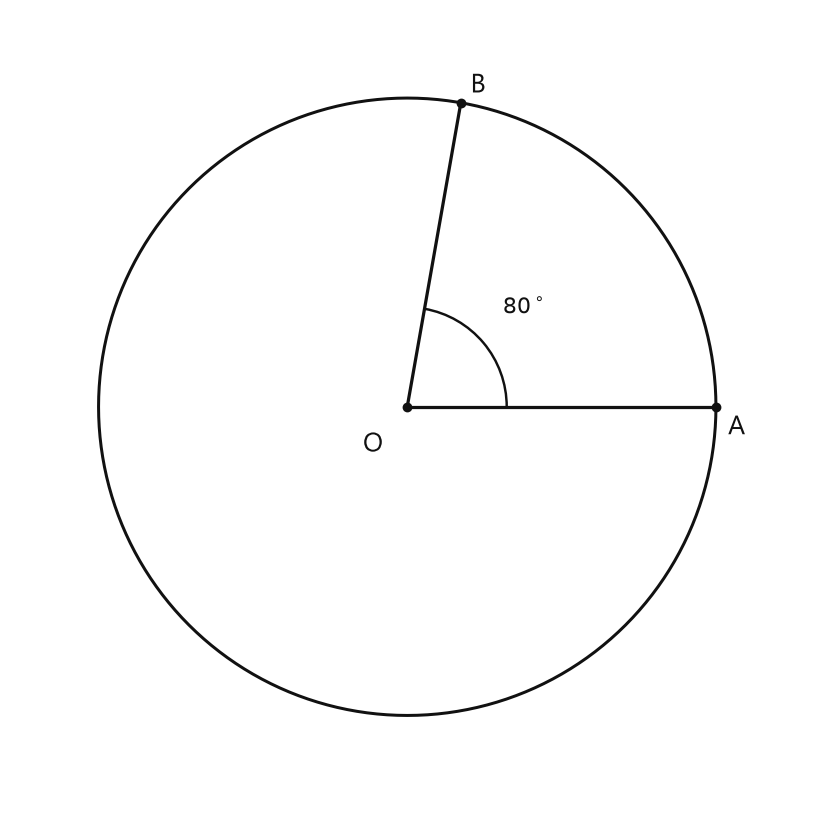
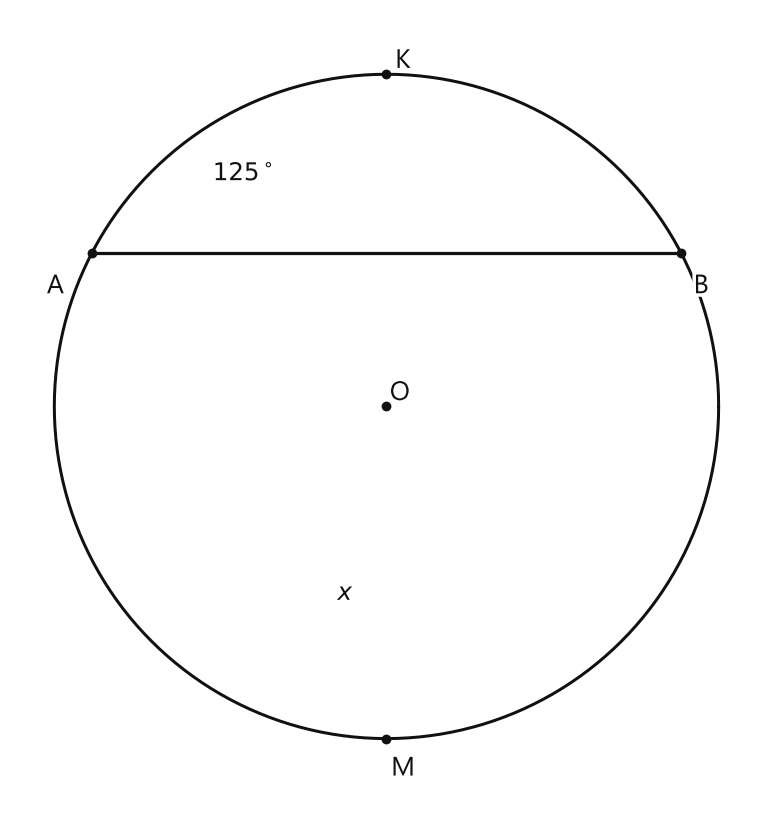
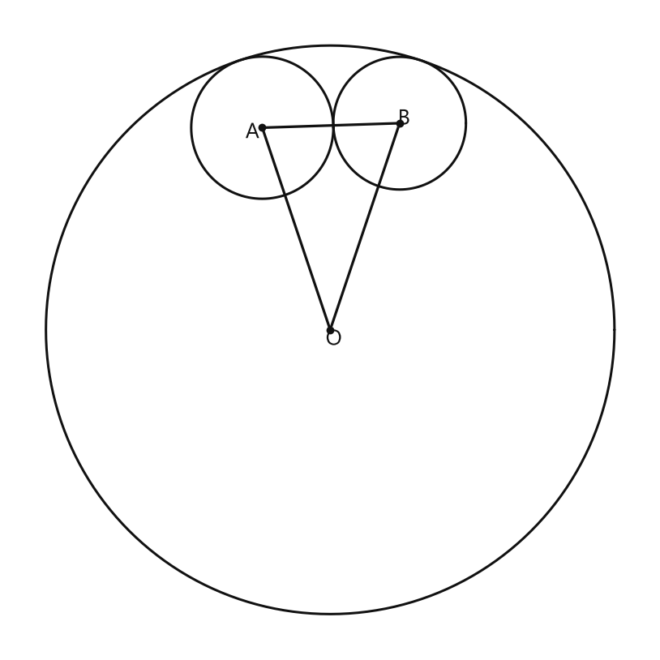

# Занятие 30. Центральный и вписанный углы

**Раздел:** Глава 4. Окружность  
**Параграф учебника:** §27. Центральный и вписанный углы  
**Страницы:** 180–181

## Цели занятия

После занятия ты сможешь:

- объяснять, какой угол называют центральным;
- находить градусную меру дуги по соответствующему центральному углу;
- находить неизвестную дугу, если две дуги дополняют друг друга до окружности;
- использовать факты о полной окружности и полуокружности;
- сравнивать дуги по их градусным мерам;
- применять свойства касающихся окружностей при нахождении периметра.

Выбирай блок своего уровня:

- **1–2 балла** — узнаю определения и основные факты;
- **3–4 балла** — нахожу меры дуг и углов;
- **5–6 баллов** — решаю задачи на дополнительные дуги и полуокружности;
- **7–8 баллов** — применяю свойства касающихся окружностей;
- **9–10 баллов** — объясняю решение и не путаю градусную меру с длиной дуги.

## Теория к занятию

### Центральный угол

#### Простыми словами

Смотри на вершину угла. Если она находится в центре окружности, угол называется центральным.

Например, в угле $AOB$ вершина — точка $O$. Если $O$ — центр окружности, то $\angle AOB$ — центральный угол.

#### Определение

**Центральным углом окружности называется угол, вершина которого находится в центре окружности.**

#### Правила

- Сначала найди вершину угла.
- Если вершина совпадает с центром окружности, угол центральный.
- Если вершина находится на окружности, это уже не центральный угол.

В записи $\angle AOB$ вершина всегда обозначается средней буквой — здесь это $O$.

#### Ловушки

- Размер угла сам по себе ничего не решает: даже большой угол может быть нецентральным.
- Вершина центрального угла должна находиться именно в центре окружности.
- Не перепутай центр окружности с точкой на окружности. Они могут быть рядом на рисунке, но это не одно и то же.

---

### Соответствующая дуга и её градусная мера

#### Простыми словами

Центральный угол «вырезает» на окружности дугу. Эта дуга называется соответствующей данному центральному углу.

У центрального угла и соответствующей ему дуги одинаковая градусная мера. Поэтому здесь не нужно делить на два: градусы идут один к одному.

#### Определение

**Дуга окружности, заключенная внутри центрального угла, и этот центральный угол называются соответствующими друг другу.**

**Градусной мерой дуги окружности называется градусная мера соответствующего ей центрального угла.**

#### Формулы

Если центральный угол равен $\alpha$, то градусная мера соответствующей дуги тоже равна $\alpha$:

$$m(\overset{\frown}{AB})=\angle AOB.$$

Например, если

$$\angle AOB=80^\circ,$$

то

$$m(\overset{\frown}{AB})=80^\circ.$$

Здесь:

- $\angle AOB$ — центральный угол;
- $\overset{\frown}{AB}$ — соответствующая дуга;
- $m(\overset{\frown}{AB})$ — градусная мера дуги.

#### Правила

- Центральный угол и соответствующая ему дуга имеют одинаковую градусную меру.
- Не дели градусную меру на два. Такое правило понадобится для другой темы, а здесь оно только запутает.
- Градусная мера дуги и длина дуги — разные величины.

#### Ловушки

- Дуга может иметь градусную меру $30^\circ$, а может иметь длину $30$ см. Это разные характеристики.
- Если центральный угол равен $210^\circ$, соответствующая дуга тоже равна $210^\circ$.
- Полный центральный угол соответствует всей окружности.

---

### Полная окружность, дополнительные дуги и полуокружность

#### Простыми словами

Полный оборот вокруг центра — это

$$360^\circ.$$

Если хорда соединяет две точки окружности, она делит окружность на две дуги. Вместе эти дуги образуют всю окружность, поэтому их градусные меры в сумме равны $360^\circ$.

Если хорда является диаметром, она делит окружность на две полуокружности. Каждая из них имеет градусную меру $180^\circ$.

#### Факты

**Полному центральному углу соответствует вся окружность. Поэтому окружность содержит $360^\circ$. Центральный угол и соответствующая ему дуга могут изменяться от $0^\circ$ до $360^\circ$.**

**Дуги $AKB$ и $AMB$ являются дополнительными (дополняют друг друга до окружности), поэтому сумма их градусных мер равна $360^\circ$.**

**Хорда $AB$ стягивает дугу $AMB$ и дугу $AKB$.**

**Диаметр $AB$ стягивает полуокружность $AKB$, которая равна $180^\circ$, так как ей соответствует центральный $\angle AOB$, который является развернутым.**

**Окружность и любая ее дуга характеризуются и длиной, и градусной мерой. Говорят «дуга окружности равна 6 см», также говорят «дуга окружности равна $30^\circ$».**

#### Формулы

Для двух дополнительных дуг:

$$m(\overset{\frown}{AKB})+m(\overset{\frown}{AMB})=360^\circ.$$

Если одна дуга равна $\alpha$, то вторая равна:

$$360^\circ-\alpha.$$

Для полуокружности:

$$m(\text{полуокружности})=180^\circ.$$

#### Алгоритм нахождения дополнительной дуги

1. Установи, что две дуги вместе образуют окружность.
2. Запиши их сумму:

   $$x+\alpha=360^\circ.$$

3. Вырази неизвестную дугу:

   $$x=360^\circ-\alpha.$$

4. Проверь результат: градусная мера дуги должна быть не меньше $0^\circ$ и не больше $360^\circ$.

#### Ловушки

- Для полной окружности используем $360^\circ$, а для полуокружности — $180^\circ$.
- Диаметр образует полуокружность, а не четверть окружности.
- Две дуги, стянутые одной хордой, не обязаны быть равными. Хорда одна, а дуги по разные стороны от неё могут иметь разные размеры.

---

### Равные и большие дуги

#### Простыми словами

Дуги сравнивают по их градусным мерам. У какой дуги больше градусов, та дуга и считается большей.

Если градусные меры одинаковы, дуги равны. Для дуг одной окружности это означает и равенство их длин.

#### Свойства

1. **Дуги одной окружности или равных окружностей называются равными, если равны их градусные меры.**
2. **Большей считается та дуга, которая имеет большую градусную меру.**
3. **Длина дуги прямо пропорциональна ее градусной мере.**
4. **Дуги одной окружности, имеющие равные градусные меры, равны по длине и наоборот.**

#### Формулы и правила

Если

$$m(\overset{\frown}{AB})=m(\overset{\frown}{CD}),$$

то дуги равны.

Если

$$m(\overset{\frown}{AB})>m(\overset{\frown}{CD}),$$

то дуга $\overset{\frown}{AB}$ больше дуги $\overset{\frown}{CD}$.

Для одной окружности:

$$m(\overset{\frown}{AB})=m(\overset{\frown}{CD}) \Longleftrightarrow l(\overset{\frown}{AB})=l(\overset{\frown}{CD}).$$

#### Ловушки

- По длине дуг можно сравнивать их градусные меры только при одинаковом радиусе окружности.
- Равные хорды нельзя без дополнительных условий сразу называть равными дугами.
- Градусная мера показывает часть полного оборота, а длина дуги измеряется в единицах длины. Градусы и сантиметры не меняются местами — у каждого своя работа.

---

### Касание окружностей и периметр треугольника

#### Простыми словами

В ключевой задаче окружности касаются друг друга, поэтому расстояния между их центрами можно найти по радиусам.

- При внутреннем касании меньшая окружность находится внутри большей. Расстояние между центрами равно разности радиусов.
- При внешнем касании окружности находятся снаружи друг друга. Расстояние между центрами равно сумме радиусов.

Полученные расстояния являются сторонами треугольника $ABO$. Затем для периметра складываем три стороны.

#### Правила

Если большая окружность имеет радиус $R$, а внутренняя окружность — радиус $r$, то при внутреннем касании:

$$\text{расстояние между центрами}=R-r.$$

Если две окружности радиусов $r_1$ и $r_2$ касаются внешним образом, то:

$$\text{расстояние между центрами}=r_1+r_2.$$

---

## Сводка формул «выучить наизусть»

$$m(\text{окружности})=360^\circ.$$

$$m(\text{полуокружности})=180^\circ.$$

$$m(\overset{\frown}{AB})=\angle AOB.$$

$$m(\overset{\frown}{AKB})+m(\overset{\frown}{AMB})=360^\circ.$$

$$m(\text{неизвестной дуги})=360^\circ-m(\text{известной дуги}).$$

При внутреннем касании окружностей:

$$d=R-r.$$

При внешнем касании окружностей:

$$d=r_1+r_2.$$

## Правила, которые нельзя путать

- Центральный угол имеет вершину в центре окружности.
- Соответствующая дуга и центральный угол имеют одинаковую градусную меру.
- Полная окружность — $360^\circ$.
- Полуокружность — $180^\circ$.
- Градусная мера дуги и длина дуги — разные величины.
- При внутреннем касании радиусы вычитают.
- При внешнем касании радиусы складывают.

## Разбор ключевых заданий

### Р1. Градусная мера соответствующей дуги

**Условие.** Центральный угол $AOB$ равен $80^\circ$. Найдите градусную меру соответствующей дуги $AB$.

<!--geo-figure-spec
{
  "needed": true,
  "kind": "plane",
  "caption": "Центральный угол $AOB=80^\\circ$ и соответствующая дуга $AB$",
  "equal": true,
  "axis": false,
  "xlim": [
    -2.3,
    2.3
  ],
  "ylim": [
    -2.3,
    2.3
  ],
  "points": {
    "O": [
      0,
      0
    ],
    "A": [
      1.8,
      0
    ],
    "B": [
      0.3126,
      1.7729
    ]
  },
  "segments": [
    [
      "O",
      "A"
    ],
    [
      "O",
      "B"
    ]
  ],
  "polygons": [],
  "circles": [
    {
      "center": "O",
      "radius": 1.8
    }
  ],
  "labels": {
    "O": {
      "dx": -0.2,
      "dy": -0.22
    },
    "A": {
      "dx": 0.12,
      "dy": -0.12
    },
    "B": {
      "dx": 0.1,
      "dy": 0.1
    }
  },
  "right_angles": [],
  "angle_marks": [
    {
      "vertex": "O",
      "from": "A",
      "to": "B",
      "text": "$80^\\circ$",
      "radius": 0.58
    }
  ],
  "texts": []
}
-->

*Центральный угол AOB=80^\circ и соответствующая дуга AB*

**Решение.**

1. Дуга $AB$ соответствует центральному углу $AOB$.
2. По определению их градусные меры равны:

   $$m(\overset{\frown}{AB})=\angle AOB.$$

3. Подставим значение угла:

   $$m(\overset{\frown}{AB})=80^\circ.$$

Делить на два не нужно: перед нами центральный угол, а не другой вид угла.

**Ответ: $80^\circ$.**

---

### Р2. Дуга по центральному углу

**Условие.** Центральный угол $COD$ равен $210^\circ$. Найдите градусную меру соответствующей дуги $CD$.

**Решение.**

1. Дуга $CD$ соответствует центральному углу $COD$.
2. По определению:

   $$m(\overset{\frown}{CD})=\angle COD.$$

3. Подставим значение:

   $$m(\overset{\frown}{CD})=210^\circ.$$

4. Проверим, что такая дуга возможна:

   $$210^\circ<360^\circ.$$

Значит, результат подходит.

**Ответ: $210^\circ$.**

*Типичная ошибка — начать делить на два. Здесь центральный угол и соответствующая дуга равны по градусной мере.*

---

### Р3. Дополнительные дуги

**Условие.** Хорда $AB$ стягивает две дуги: $\overset{\frown}{AKB}$ и $\overset{\frown}{AMB}$. Градусная мера дуги $\overset{\frown}{AKB}$ равна $125^\circ$. Найдите градусную меру дуги $\overset{\frown}{AMB}$.

<!--geo-figure-spec
{
  "needed": true,
  "kind": "plane",
  "caption": "Две дуги, стянутые хордой $AB$",
  "equal": true,
  "axis": false,
  "xlim": [
    -2.25,
    2.25
  ],
  "ylim": [
    -3.3,
    1.45
  ],
  "points": {
    "A": [
      -1.774,
      0
    ],
    "B": [
      1.774,
      0
    ],
    "K": [
      0,
      1.077
    ],
    "M": [
      0,
      -2.924
    ],
    "O": [
      0,
      -0.923
    ]
  },
  "segments": [
    [
      "A",
      "B"
    ]
  ],
  "polygons": [],
  "circles": [
    {
      "center": "O",
      "radius": 2
    }
  ],
  "labels": {
    "A": {
      "dx": -0.22,
      "dy": -0.2
    },
    "B": {
      "dx": 0.12,
      "dy": -0.2
    },
    "K": {
      "dx": 0.1,
      "dy": 0.08
    },
    "M": {
      "dx": 0.1,
      "dy": -0.18
    }
  },
  "right_angles": [],
  "angle_marks": [],
  "texts": [
    {
      "xy": [
        -0.85,
        0.48
      ],
      "text": "$125^\\circ$"
    },
    {
      "xy": [
        -0.25,
        -2.05
      ],
      "text": "$x$"
    }
  ]
}
-->

*Две дуги, стянутые хордой AB*

**Решение.**

1. Дуги $\overset{\frown}{AKB}$ и $\overset{\frown}{AMB}$ вместе образуют всю окружность.
2. Поэтому сумма их градусных мер равна $360^\circ$:

   $$m(\overset{\frown}{AKB})+m(\overset{\frown}{AMB})=360^\circ.$$

3. Обозначим неизвестную градусную меру через $x$:

   $$125^\circ+x=360^\circ.$$

4. Вычтем $125^\circ$ из обеих частей равенства:

   $$x=360^\circ-125^\circ.$$

5. Выполним вычитание:

   $$x=235^\circ.$$

6. Проверим результат:

   $$125^\circ+235^\circ=360^\circ.$$

**Ответ: $235^\circ$.**

---

### Р4. Полуокружность, стянутая диаметром

**Условие.** Диаметр $AB$ стягивает полуокружность $AKB$. Найдите её градусную меру.

**Решение.**

1. Диаметр делит окружность на две полуокружности.
2. Каждой полуокружности соответствует развернутый центральный угол.
3. Развёрнутый угол равен:

   $$180^\circ.$$

4. Поэтому градусная мера полуокружности равна:

   $$m(\overset{\frown}{AKB})=180^\circ.$$

**Ответ: $180^\circ$.**

*Диаметр даёт половину полного оборота: $360^\circ:2=180^\circ$. До $90^\circ$ здесь не доезжаем.*

---

### Р5. Сравнение дуг

**Условие.** Дуга $\overset{\frown}{AB}$ имеет градусную меру $70^\circ$, а дуга $\overset{\frown}{CD}$ — $110^\circ$. Какая дуга больше?

**Решение.**

1. Сравним градусные меры дуг:

   $$70^\circ<110^\circ.$$

2. По свойству большей является дуга с большей градусной мерой.
3. Значит,

   $$\overset{\frown}{CD}>\overset{\frown}{AB}.$$

**Ответ: дуга $\overset{\frown}{CD}$.**

### Р6. Гимнастика ума: три касающиеся окружности

**Условие.** Диаметр окружности с центром в точке $O$ равен $24$ см. Окружность с центром в точке $A$ касается первой окружности внутренним образом. Третья окружность с центром в точке $B$ касается первой окружности внутренним, а второй — внешним образом. Найдите периметр треугольника $ABO$.

<!--geo-figure-spec
{
  "needed": true,
  "kind": "plane",
  "caption": "Три касающиеся окружности с центрами $O$, $A$ и $B$",
  "equal": true,
  "axis": false,
  "xlim": [
    -13.5,
    13.5
  ],
  "ylim": [
    -13.5,
    13.5
  ],
  "points": {
    "O": [
      0,
      0
    ],
    "A": [
      -2.8666,
      8.5313
    ],
    "B": [
      2.9303,
      8.7209
    ]
  },
  "segments": [
    [
      "A",
      "O"
    ],
    [
      "O",
      "B"
    ],
    [
      "A",
      "B"
    ]
  ],
  "polygons": [],
  "circles": [
    {
      "center": "O",
      "radius": 12
    },
    {
      "center": "A",
      "radius": 3
    },
    {
      "center": "B",
      "radius": 2.8
    }
  ],
  "labels": {
    "O": {
      "dx": 0.15,
      "dy": -0.4
    },
    "A": {
      "dx": -0.42,
      "dy": -0.2
    },
    "B": {
      "dx": 0.18,
      "dy": 0.18
    }
  },
  "right_angles": [],
  "angle_marks": [],
  "texts": []
}
-->

*Три касающиеся окружности с центрами O, A и B*

**Дано:** радиус большой окружности равен $R$, радиус окружности с центром $A$ равен $r_A$, радиус окружности с центром $B$ равен $r_B$. Большая окружность имеет диаметр $24$ см.

**Решение.**

Сначала найдём радиус большой окружности. Радиус равен половине диаметра:

$$R=\frac{24}{2}=12\text{ см}.$$

При внутреннем касании окружностей расстояние между их центрами равно разности радиусов. Поэтому:

$$AO=R-r_A,$$

$$BO=R-r_B.$$

Теперь рассмотрим окружности с центрами $A$ и $B$. Они касаются внешним образом, значит, расстояние между их центрами равно сумме радиусов:

$$AB=r_A+r_B.$$

Периметр треугольника $ABO$ — это сумма длин его трёх сторон:

$$P=AO+OB+AB.$$

Подставим найденные выражения:

$$P=(R-r_A)+(R-r_B)+(r_A+r_B).$$

Раскроем скобки:

$$P=R-r_A+R-r_B+r_A+r_B.$$

Слагаемые с $r_A$ и $r_B$ уничтожаются:

$$-r_A+r_A=0,$$

$$-r_B+r_B=0.$$

Остаётся:

$$P=R+R=2R.$$

Подставим $R=12$ см:

$$P=2\cdot12=24\text{ см}.$$

Почему так получилось? При внутреннем касании радиусы вычитаются из $R$, а при внешнем касании складываются. Поэтому малые радиусы в периметре взаимно уничтожаются. Геометрический баланс — почти как весы, только с окружностями.

**Ответ: $24$ см.**

---

## Мини-проверка себя

1. Как называется угол с вершиной в центре окружности?
2. Чему равна градусная мера дуги, соответствующей углу $47^\circ$?
3. Чему равна вторая дуга, если первая равна $158^\circ$?
4. Чему равна полуокружность?
5. Что нужно сделать с радиусами при внутреннем касании окружностей?

**Ответы:**

1. Центральный угол.
2. $47^\circ$.
3. $202^\circ$.
4. $180^\circ$.
5. Вычесть радиусы.

## Практические задания

Выбери свой уровень и решай только этот блок. В блоке должна закрепиться вся тема параграфа. Ответы не приводятся.

### Уровень 1–2 балла

**С1.** Выберите центральный угол окружности, если точка $O$ — её центр.

1) $\angle ABC$  
2) $\angle AOB$  
3) $\angle BCA$  
4) $\angle BAC$  
5) $\angle ACB$

**С2.** Вершина угла $\angle AOB$ находится в центре окружности $O$. Как называется этот угол?

1) развернутый  
2) вписанный  
3) центральный  
4) прямой  
5) вертикальный

**С3.** Центральный угол окружности равен $40^\circ$. Чему равна градусная мера соответствующей ему дуги?

1) $20^\circ$  
2) $40^\circ$  
3) $80^\circ$  
4) $140^\circ$  
5) $320^\circ$

**С4.** Дуга окружности имеет градусную меру $75^\circ$. Чему равна градусная мера соответствующего ей центрального угла?

1) $37{,}5^\circ$  
2) $75^\circ$  
3) $105^\circ$  
4) $150^\circ$  
5) $285^\circ$

**С5.** Чему равна градусная мера полной окружности?

1) $90^\circ$  
2) $180^\circ$  
3) $270^\circ$  
4) $360^\circ$  
5) $720^\circ$

**С6.** Центральный угол, соответствующий дуге окружности, равен $120^\circ$. Найдите градусную меру дуги.

**С7.** Дуга окружности имеет градусную меру $150^\circ$. Найдите градусную меру соответствующего центрального угла.

**С8.** Две дуги одной окружности имеют градусные меры $65^\circ$ и $65^\circ$. Как называются эти дуги?

1) дополнительные  
2) равные  
3) полуокружности  
4) противоположные  
5) неравные

**С9.** Две дуги одной окружности имеют градусные меры $80^\circ$ и $120^\circ$. Какая дуга больше?

1) дуга $80^\circ$  
2) дуга $120^\circ$  
3) дуги равны  
4) определить невозможно  
5) обе дуги являются полуокружностями

**С10.** Дуга $AKB$ имеет градусную меру $110^\circ$, а дуга $AMB$ дополняет её до полной окружности. Найдите градусную меру дуги $AMB$.

**С11.** Диаметр $AB$ окружности с центром $O$ образует центральный угол $\angle AOB$. Выберите его градусную меру.

1) $45^\circ$  
2) $90^\circ$  
3) $120^\circ$  
4) $180^\circ$  
5) $360^\circ$

**С12.** Две дуги одной окружности имеют одинаковую длину. Градусная мера первой дуги равна $50^\circ$. Найдите градусную меру второй дуги.

**С13.** Какой из углов является центральным углом окружности с центром в точке $O$?

1) $\angle ABC$, где $B$ — точка окружности  
2) $\angle AOC$  
3) $\angle BAC$, где $A$ — точка окружности  
4) $\angle BCA$, где $C$ — точка окружности  
5) $\angle ABC$, где $A$ — центр окружности

**С14.** Центральный угол $\angle AOB$ имеет градусную меру $45^\circ$. Чему равна градусная мера соответствующей ему дуги $AB$?

1) $22{,}5^\circ$  
2) $45^\circ$  
3) $90^\circ$  
4) $135^\circ$  
5) $360^\circ$

**С15.** Дуга окружности имеет градусную меру $120^\circ$. Чему равна градусная мера соответствующего ей центрального угла?

1) $30^\circ$  
2) $60^\circ$  
3) $120^\circ$  
4) $180^\circ$  
5) $240^\circ$

**С16.** Две дуги одной окружности имеют градусные меры $70^\circ$ и $110^\circ$. Какая дуга является большей?

1) дуга с мерой $70^\circ$  
2) дуга с мерой $110^\circ$  
3) обе дуги равны  
4) определить невозможно  
5) дуга с мерой $180^\circ$

**С17.** Дуги $AKB$ и $AMB$ одной окружности являются дополнительными. Градусная мера дуги $AKB$ равна $140^\circ$. Найдите градусную меру дуги $AMB$.

1) $40^\circ$  
2) $140^\circ$  
3) $180^\circ$  
4) $220^\circ$  
5) $360^\circ$

**С18.** Дуга окружности имеет градусную меру $90^\circ$ и длину $6$ см. Какова длина дуги с градусной мерой $180^\circ$ этой же окружности?

1) $3$ см  
2) $6$ см  
3) $9$ см  
4) $12$ см  
5) $24$ см

**С19.** Длина дуги окружности с градусной мерой $60^\circ$ равна $4$ см. Найдите длину дуги с градусной мерой $120^\circ$ этой же окружности.

1) $2$ см  
2) $4$ см  
3) $6$ см  
4) $8$ см  
5) $12$ см

**С20.** Хорда $AB$ стягивает две дуги: $AKB$ и $AMB$. Градусная мера дуги $AKB$ равна $80^\circ$. Какова градусная мера дуги $AMB$?

1) $80^\circ$  
2) $100^\circ$  
3) $180^\circ$  
4) $280^\circ$  
5) $360^\circ$

**С21.** Диаметр $AB$ стягивает полуокружность $AKB$. Чему равна градусная мера дуги $AKB$?

1) $45^\circ$  
2) $90^\circ$  
3) $120^\circ$  
4) $180^\circ$  
5) $360^\circ$

**С22.** На окружности с центром в точке $O$ центральный угол $\angle AOB$ равен $150^\circ$. Чему равна градусная мера дуги $AB$, заключённой внутри этого угла?

1) $30^\circ$  
2) $75^\circ$  
3) $150^\circ$  
4) $210^\circ$  
5) $360^\circ$

**С23.** Дуги $AB$ и $CD$ одной окружности имеют одинаковые градусные меры. Выберите верное утверждение.

1) Дуга $AB$ в два раза длиннее дуги $CD$  
2) Дуга $CD$ в два раза длиннее дуги $AB$  
3) Дуги $AB$ и $CD$ равны по длине  
4) Дуги имеют разные градусные меры  
5) Длину дуг сравнить невозможно

**С24.** Центральный угол и соответствующая ему дуга могут иметь градусные меры в пределах

1) от $0^\circ$ до $90^\circ$  
2) от $0^\circ$ до $180^\circ$  
3) от $0^\circ$ до $270^\circ$  
4) от $0^\circ$ до $360^\circ$  
5) от $90^\circ$ до $360^\circ$

**С25.** Выберите центральный угол окружности:

1) угол с вершиной на окружности; 2) угол с вершиной в центре окружности; 3) угол с вершиной вне окружности; 4) развернутый угол; 5) угол, стороны которого являются хордами.

**С26.** Центр окружности находится в точке $O$. Какой из углов является центральным?

1) $\angle ABC$; 2) $\angle ACO$; 3) $\angle AOB$; 4) $\angle BAC$; 5) $\angle OBA$.

**С27.** Центральный угол равен $48^\circ$. Найдите градусную меру соответствующей ему дуги.

**С28.** Дуга окружности имеет градусную меру $125^\circ$. Чему равен соответствующий ей центральный угол?

**С29.** Центральный угол $\angle AOB$ равен $72^\circ$. Выберите градусную меру дуги $AB$, соответствующей этому углу:

1) $36^\circ$; 2) $72^\circ$; 3) $108^\circ$; 4) $180^\circ$; 5) $288^\circ$.

**С30.** Две дуги одной окружности имеют градусные меры $64^\circ$ и $64^\circ$. Выберите верное утверждение:

1) первая дуга больше второй; 2) вторая дуга больше первой; 3) дуги равны; 4) сумма мер дуг равна $360^\circ$; 5) одна дуга является диаметром.

**С31.** Градусная мера одной из двух дополнительных дуг равна $147^\circ$. Найдите градусную меру другой дуги.

**С32.** Хорда $AB$ стягивает две дополнительные дуги. Меньшая дуга имеет градусную меру $86^\circ$. Найдите градусную меру большей дуги.

**С33.** Диаметр $AB$ стягивает одну полуокружность. Выберите её градусную меру:

1) $90^\circ$; 2) $120^\circ$; 3) $180^\circ$; 4) $270^\circ$; 5) $360^\circ$.

**С34.** Дуга окружности имеет градусную меру $30^\circ$. Выберите верное утверждение:

1) соответствующий центральный угол равен $15^\circ$; 2) соответствующий центральный угол равен $30^\circ$; 3) соответствующий центральный угол равен $60^\circ$; 4) дуга является полуокружностью; 5) дуга составляет всю окружность.

**С35.** Две дуги одной окружности равны по длине. Выберите их градусные меры:

1) $40^\circ$ и $80^\circ$; 2) $75^\circ$ и $75^\circ$; 3) $110^\circ$ и $150^\circ$; 4) $90^\circ$ и $270^\circ$; 5) $120^\circ$ и $240^\circ$.

**С36.** Полный центральный угол окружности равен $360^\circ$. Градусная мера дуги $AB$ равна $215^\circ$. Найдите градусную меру дополнительной дуги $AB$.

### Уровень 3–4 балла

**С1.** Точка $O$ — центр окружности. Как называется угол с вершиной в точке $O$?

1) вписанный угол 2) центральный угол 3) развёрнутый угол 4) внешний угол 5) прямой угол

**С2.** Центральный угол, соответствующий дуге $AB$, равен $72^\circ$. Найдите градусную меру дуги $AB$.

**С3.** Градусная мера дуги $MN$ равна $135^\circ$. Чему равен соответствующий ей центральный угол?

**С4.** Две дуги одной окружности имеют градусные меры $48^\circ$ и $112^\circ$. Какая из дуг является большей и на сколько градусов?

**С5.** Дуги $AKB$ и $AMB$ одной окружности являются дополнительными. Градусная мера дуги $AKB$ равна $154^\circ$. Найдите градусную меру дуги $AMB$.

**С6.** Хорда $CD$ стягивает две дуги: $CKD$ и $CMD$. Градусная мера дуги $CKD$ равна $86^\circ$. Найдите градусную меру дуги $CMD$.

**С7.** Диаметр $AB$ делит окружность на две дуги. Найдите градусную меру каждой из этих дуг.

**С8.** Центральный угол $\angle AOB$ равен $125^\circ$, где $O$ — центр окружности. Найдите градусную меру дуги $AKB$, соответствующей этому углу.

**С9.** Дуги $AB$ и $CD$ одной окружности имеют равные градусные меры. Градусная мера дуги $AB$ равна $64^\circ$. Найдите градусную меру дуги $CD$.

**С10.** Длина дуги окружности, имеющей градусную меру $60^\circ$, равна $8$ см. Найдите длину дуги этой окружности, имеющей градусную меру $150^\circ$.

**С11.** Длина окружности равна $36$ см. Найдите длину дуги, градусная мера которой равна $80^\circ$.

**С12.** Дуга $AB$ одной окружности имеет градусную меру $90^\circ$ и длину $6$ см. Найдите длину дуги $CD$ этой же окружности, если её градусная мера равна $240^\circ$.

**С13.** Вершина угла $AOB$ находится в центре окружности в точке $O$. Как называется этот угол?

1) вписанный угол  
2) центральный угол  
3) развёрнутый угол  
4) смежный угол  
5) внешний угол

**С14.** Центральный угол, соответствующий дуге $AB$, равен $64^\circ$. Найдите градусную меру дуги $AB$.

1) $32^\circ$  
2) $64^\circ$  
3) $116^\circ$  
4) $296^\circ$  
5) $360^\circ$

**С15.** Дуга $MN$ имеет градусную меру $125^\circ$. Чему равна градусная мера соответствующего центрального угла?

1) $62{,}5^\circ$  
2) $125^\circ$  
3) $235^\circ$  
4) $250^\circ$  
5) $360^\circ$

**С16.** Дуги $AB$ и $CD$ одной окружности имеют градусные меры $48^\circ$ и $72^\circ$ соответственно. Какая дуга больше и на сколько градусов?

1) дуга $AB$ на $24^\circ$  
2) дуга $CD$ на $24^\circ$  
3) дуга $CD$ на $120^\circ$  
4) дуги равны  
5) дуга $AB$ на $120^\circ$

**С17.** Дуги $AKB$ и $AMB$ являются дополнительными и имеют градусные меры $138^\circ$ и $x^\circ$. Найдите $x$.

1) $42$  
2) $138$  
3) $180$  
4) $222$  
5) $360$

**С18.** Центральный угол, соответствующий дуге $PQ$, равен $180^\circ$. Какую часть окружности составляет дуга $PQ$?

1) $\dfrac{1}{6}$  
2) $\dfrac{1}{4}$  
3) $\dfrac{1}{3}$  
4) $\dfrac{1}{2}$  
5) $\dfrac{3}{4}$

**С19.** Центральный угол $AOB$ равен $96^\circ$. Найдите градусную меру дуги $AKB$, соответствующей этому углу.

**С20.** Дуга $CD$ имеет градусную меру $157^\circ$. Найдите градусную меру другой дуги $CAD$, которая вместе с дугой $CD$ образует полную окружность.

**С21.** Диаметр $AB$ делит окружность на две полуокружности. Найдите градусную меру каждой из этих полуокружностей.

**С22.** Длина дуги окружности, имеющей градусную меру $60^\circ$, равна $4$ см. Найдите длину дуги этой окружности, имеющей градусную меру $150^\circ$.

**С23.** Длина дуги окружности, имеющей градусную меру $90^\circ$, равна $7$ см. Найдите длину всей окружности.

**С24.** Дуги $AB$ и $CD$ одной окружности имеют одинаковую длину. Градусная мера дуги $AB$ равна $83^\circ$. Найдите градусную меру дуги $CD$.

**С25.** В окружности с центром $O$ центральный угол $\angle AOB$ равен $74^\circ$. Найдите градусную меру дуги $AB$, заключённой внутри этого угла.

**С26.** Градусная мера дуги $MN$ окружности равна $128^\circ$. Найдите градусную меру соответствующего ей центрального угла $\angle MON$.

**С27.** Центральный угол $\angle COD$ равен $146^\circ$. Найдите градусную меру дополнительной дуги $CD$, которая вместе с дугой, соответствующей углу $\angle COD$, составляет всю окружность.

**С28.** Дуга $AB$ окружности имеет градусную меру $95^\circ$. Найдите градусную меру другой дуги $ACB$, стянутой той же хордой $AB$.

**С29.** Диаметр $AB$ окружности с центром $O$ образует центральный угол $\angle AOB$. Найдите градусную меру каждой из двух полуокружностей, на которые диаметр $AB$ делит окружность.

**С30.** Центральный угол $\angle KOL$ равен $40^\circ$. Во сколько раз градусная мера всей окружности больше градусной меры дуги $KL$, соответствующей этому углу?

**С31.** Длина окружности равна $36\pi$ см. Найдите длину дуги, соответствующей центральному углу в $60^\circ$.

**С32.** Длина окружности равна $48$ см. Найдите длину дуги, соответствующей центральному углу в $90^\circ$.

**С33.** Длина дуги окружности равна $15$ см, а её градусная мера — $75^\circ$. Найдите длину всей окружности.

**С34.** Длина дуги окружности, соответствующей центральному углу в $120^\circ$, равна $14$ см. Найдите длину дуги, соответствующей центральному углу в $30^\circ$.

**С35.** Две дуги одной окружности имеют градусные меры $82^\circ$ и $82^\circ$. Сравните их длины и запишите вывод о равенстве этих дуг.

**С36.** Дуги $AB$ и $BC$ одной окружности имеют соответственно градусные меры $112^\circ$ и $68^\circ$. Найдите градусную меру дуги $AC$, не содержащей точку $B$, если дуги $AB$, $BC$ и $AC$ составляют всю окружность.

### Уровень 5–6 баллов

**С1.** Точка $O$ — центр окружности. Какой из перечисленных углов является центральным?

1) $\angle ABC$, если $B$ не является центром окружности  
2) $\angle AOC$  
3) $\angle BAC$, если $A$ лежит на окружности  
4) $\angle BCD$, если $C$ лежит на окружности  
5) $\angle ABC$, если $A$, $B$, $C$ лежат на окружности

**С2.** Центральный угол $\angle AOB$ равен $64^\circ$. Найдите градусную меру дуги $AB$, заключённой внутри этого угла.

**С3.** Дуга $MN$ имеет градусную меру $125^\circ$. Найдите градусную меру соответствующего ей центрального угла.

**С4.** Дуги $AKB$ и $AMB$ одной окружности являются дополнительными и имеют градусные меры $138^\circ$ и $x^\circ$ соответственно. Найдите $x$.

**С5.** Центральный угол, соответствующий дуге $CD$, равен $47^\circ$. Запишите градусную меру дуги $CD$.

**С6.** Диаметр $AB$ окружности с центром $O$ стягивает полуокружность $AKB$. Найдите градусную меру дуги $AKB$.

**С7.** Дуга $PQ$ одной окружности имеет градусную меру $72^\circ$, а дуга $RS$ — $108^\circ$. Какая из дуг имеет большую длину?

1) дуга $PQ$  
2) дуга $RS$  
3) длины дуг равны  
4) определить невозможно  
5) обе дуги имеют длину $180^\circ$

**С8.** Длина окружности равна $30$ см. Найдите длину дуги, градусная мера которой равна $60^\circ$.

**С9.** Длина окружности равна $48\pi$ см. Найдите длину дуги, соответствующей центральному углу в $90^\circ$. Ответ запишите в сантиметрах.

**С10.** Длина дуги $AB$ равна $7$ см, а её градусная мера — $35^\circ$. Найдите длину окружности.

**С11.** В окружности с центром $O$ центральные углы $\angle AOB$ и $\angle BOC$ равны соответственно $82^\circ$ и $118^\circ$. Точки $A$, $B$ и $C$ расположены на окружности, а дуги $AB$ и $BC$ не имеют общих внутренних точек. Найдите градусную меру дуги $AC$, проходящей через точку $B$.

**С12.** В окружности с центром $O$ диаметр $AB$ делит окружность на две полуокружности. Дуга $AKB$ имеет градусную меру $180^\circ$, а дуга $AMB$ — также $180^\circ$. На дуге $AKB$ точка $C$ такова, что дуга $AC$ имеет градусную меру $65^\circ$. Найдите градусную меру дуги $CB$.

**С13.** В окружности с центром $O$ центральный угол $\angle AOB$ равен $72^\circ$. Найдите градусную меру дуги $AB$, заключённой внутри этого угла.

**С14.** Градусная мера дуги $CD$ окружности равна $145^\circ$. Найдите градусную меру соответствующего ей центрального угла.

**С15.** Центральный угол $\angle MON$ равен $128^\circ$. Найдите градусную меру дополнительной дуги $MAN$, стянутой той же хордой $MN$.

**С16.** Хорда $AB$ окружности не является диаметром. Дуга $AKB$ имеет градусную меру $216^\circ$. Найдите градусную меру дуги $AMB$, дополнительной к дуге $AKB$.

**С17.** Выберите верное утверждение.

1) Полный центральный угол равен $180^\circ$  
2) Полуокружность имеет градусную меру $90^\circ$  
3) Полный центральный угол равен $360^\circ$  
4) Любая дуга окружности имеет градусную меру $720^\circ$  
5) Градусная мера дуги не связана с соответствующим центральным углом

**С18.** Дуги $AB$ и $CD$ одной окружности имеют соответственно градусные меры $84^\circ$ и $116^\circ$. Какая из дуг больше и на сколько градусов?

**С19.** В окружности проведены два центральных угла: $\angle AOB=94^\circ$ и $\angle COD=94^\circ$. Сравните дуги $AB$ и $CD$ по градусной мере и по длине.

**С20.** Длина дуги окружности, имеющей градусную меру $60^\circ$, равна $8$ см. Найдите длину дуги этой окружности, имеющей градусную меру $150^\circ$.

**С21.** Длина дуги окружности, имеющей градусную меру $45^\circ$, равна $6$ см. Найдите длину всей окружности.

**С22.** Длина окружности равна $36$ см. Найдите длину дуги, градусная мера которой равна $80^\circ$.

**С23.** В окружности с центром $O$ точки $A$, $B$ и $C$ расположены так, что центральные углы $\angle AOB=110^\circ$ и $\angle BOC=75^\circ$ являются соседними и не имеют общих внутренних точек. Найдите градусную меру дуги $AC$, проходящей через точку $B$.

**С24.** В окружности хорда $AB$ стягивает две дуги: дугу $AKB$ и дугу $AMB$. Градусная мера дуги $AKB$ на $40^\circ$ больше градусной меры дуги $AMB$. Найдите градусные меры обеих дуг.

**С25.** В окружности с центром $O$ центральный угол $\angle AOB$ равен $68^\circ$. Найдите градусную меру дуги $AB$, заключённой внутри этого угла.

**С26.** Дуги $AKB$ и $AMB$ одной окружности являются дополнительными. Градусная мера дуги $AKB$ равна $147^\circ$. Найдите градусную меру дуги $AMB$.

**С27.** Диаметр $AB$ окружности с центром $O$ стягивает полуокружность $ACB$. Найдите градусную меру дуги $ACB$ и центрального угла $\angle AOB$.

**С28.** В одной окружности градусные меры дуг $AB$ и $CD$ равны соответственно $54^\circ$ и $81^\circ$. Во сколько раз длина дуги $CD$ больше длины дуги $AB$?

**С29.** Центральный угол $\angle AOB$ на $24^\circ$ меньше центрального угла $\angle BOC$. Дуги $AB$ и $BC$ являются соседними и вместе образуют полуокружность. Найдите градусные меры этих дуг.

**С30.** Хорда $AB$ стягивает две дуги: $AKB$ и $AMB$. Градусная мера дуги $AKB$ в 3 раза меньше градусной меры дуги $AMB$. Найдите градусные меры обеих дуг.

### Уровень 7–8 баллов

**С1.** В окружности с центром $O$ центральный угол $\angle AOB$ равен $72^\circ$. Найдите градусную меру дуги $AB$, заключённой внутри этого угла.

**С2.** Градусная мера дуги $MN$ окружности равна $128^\circ$. Найдите градусную меру соответствующего ей центрального угла $\angle MON$, где $O$ — центр окружности.

**С3.** Центральные углы $\angle AOB$ и $\angle BOC$ имеют общую сторону $OB$, а их внутренние области не пересекаются. Их градусные меры равны $86^\circ$ и $134^\circ$. Найдите градусную меру дуги $AC$, расположенной внутри угла $AOC$.

**С4.** Хорда $AB$ разделяет окружность на две дуги, одна из которых имеет градусную меру $147^\circ$. Найдите градусную меру другой дуги $AB$.

**С5.** Диаметр $AC$ делит окружность на две полуокружности. На одной из них расположены точки $B$ и $D$, причём дуга $AB$ имеет градусную меру $58^\circ$, а дуга $DC$ — $76^\circ$. Найдите градусную меру дуги $BD$ этой полуокружности.

**С6.** В окружности с центром $O$ точки $A$, $B$ и $C$ расположены по порядку на одной дуге так, что $\angle AOB=3x+12^\circ$, $\angle BOC=2x+18^\circ$, а $\angle AOC=150^\circ$. Найдите $x$.

**С7.** В окружности с центром $O$ центральные углы $\angle AOB$ и $\angle BOC$ смежные, а лучи $OA$ и $OC$ являются противоположными. Градусная мера дуги $AB$ в два раза больше градусной меры дуги $BC$. Найдите градусные меры этих дуг.

**С8.** Длина дуги окружности равна $14$ см, а её градусная мера — $70^\circ$. Найдите длину дуги этой же окружности, градусная мера которой равна $225^\circ$.

**С9.** Дуга $AB$ окружности имеет градусную меру $96^\circ$ и длину $8$ см. Найдите длину дуги $AC$, если её градусная мера равна $144^\circ$. Точки $B$ и $C$ находятся на одной стороне от точки $A$ при движении по выбранному направлению окружности.

**С10.** В окружности с центром $O$ точки $A$, $B$, $C$ и $D$ расположены по порядку. Градусные меры дуг $AB$, $BC$ и $CD$ относятся как $2:3:4$, а дуга $DA$ имеет градусную меру $90^\circ$. Найдите градусные меры всех четырёх дуг.

**С11.** В окружности с центром $O$ точки $A$, $B$, $C$ расположены по порядку. Градусная мера дуги $AB$ на $36^\circ$ меньше градусной меры дуги $BC$, а центральный угол $\angle AOC$, соответствующий дуге $ABC$, равен $180^\circ$. Найдите градусные меры дуг $AB$ и $BC$.

**С12.** В окружности с центром $O$ диаметр $AC$ делит окружность на две полуокружности. На первой полуокружности точки $B$ и $D$ расположены по порядку от $A$ к $C$, причём градусные меры дуг $AB$, $BD$ и $DC$ относятся как $2:3:4$. На второй полуокружности расположена точка $E$, причём дуга $AE$ в три раза меньше дуги $EC$. Найдите градусные меры всех пяти дуг: $AB$, $BD$, $DC$, $AE$ и $EC$.

**С13.** Центральный угол $\angle AOB$ равен $74^\circ$. Найдите градусную меру дуги $AB$, заключённой внутри этого угла.

**С14.** Дуга $MN$ окружности имеет градусную меру $128^\circ$. Найдите градусную меру центрального угла $\angle MON$, соответствующего этой дуге.

**С15.** Дуги $AB$ и $CD$ одной окружности имеют градусные меры $86^\circ$ и $124^\circ$ соответственно. Какая из дуг является большей и на сколько градусов?

**С16.** Центральный угол $\angle AOB$ равен $3x+18^\circ$, а соответствующая ему дуга $AB$ имеет градусную меру $5x-22^\circ$. Найдите $x$ и градусную меру дуги $AB$.

**С17.** Две дополнительные дуги $AKB$ и $AMB$ одной окружности имеют градусные меры $(4x+16)^\circ$ и $(2x+20)^\circ$. Найдите $x$ и градусную меру каждой дуги.

**С18.** Хорда $AB$ делит окружность на дуги $AKB$ и $AMB$. Дуга $AKB$ имеет градусную меру $236^\circ$. Найдите градусную меру дуги $AMB$ и укажите, какая из двух дуг является меньшей.

**С19.** Диаметр $AB$ делит окружность с центром $O$ на две полуокружности. Одна из них проходит через точку $K$, а другая — через точку $M$. Найдите градусные меры дуг $AKB$ и $AMB$. Обоснуйте ответ.

**С20.** В окружности с центром $O$ центральные углы $\angle AOB=92^\circ$ и $\angle COD=92^\circ$. Докажите, что соответствующие им дуги $AB$ и $CD$ равны.

**С21.** В окружности с центром $O$ дуги $AB$ и $CD$ равны. Градусная мера дуги $AB$ равна $117^\circ$. Найдите градусную меру центрального угла $\angle COD$ и обоснуйте равенство дуг.

**С22.** Дуги $AB$, $BC$ и $CA$ последовательно составляют всю окружность. Их градусные меры относятся как $2:3:4$. Найдите градусную меру каждой дуги и соответствующего центрального угла.

**С23.** В окружности с центром $O$ точки $A$, $B$ и $C$ делят окружность на три последовательные дуги. Центральные углы $\angle AOB$ и $\angle BOC$ относятся как $4:5$, а дуга $CA$ имеет градусную меру $90^\circ$. Найдите градусные меры двух неизвестных дуг.

**С24.** В окружности с центром $O$ две хорды $AB$ и $CD$ стягивают соответственно меньшую дугу $AB$ и меньшую дугу $CD$. Известно, что градусная мера дуги $AB$ на $36^\circ$ больше градусной меры дуги $CD$, а сумма градусных мер этих дуг равна $164^\circ$. Найдите градусные меры обеих дуг и соответствующих им центральных углов.

### Уровень 9–10 баллов

**С1.** В окружности с центром $O$ точки $A$, $B$ и $C$ делят окружность на дуги $AB$, $BC$ и $CA$. Градусные меры дуг $AB$ и $BC$ относятся как $2:3$, а дуга $CA$ на $30^\circ$ больше дуги $AB$. Найдите градусную меру каждой из трёх дуг.

**С2.** Дуга $AB$ окружности имеет градусную меру $84^\circ$. Найдите градусную меру дуги, стянутой той же хордой $AB$, если она является дополнительной к дуге $AB$.

**С3.** В окружности с центром $O$ центральный угол $\angle AOB$ на $46^\circ$ меньше центрального угла $\angle BOC$. Дуги $AB$ и $BC$ соответствуют этим углам, а дуга $CA$ имеет градусную меру $176^\circ$. Найдите градусные меры углов $\angle AOB$ и $\angle BOC$.

**С4.** Длина дуги окружности, имеющей градусную меру $72^\circ$, равна $8$ см. Найдите длину дуги этой окружности, градусная мера которой равна $225^\circ$.

**С5.** В окружности точки $A$, $B$, $C$ и $D$ расположены в указанном порядке. Градусные меры дуг $AB$, $BC$, $CD$ и $DA$ образуют арифметическую прогрессию, причём дуга $AB$ на $18^\circ$ меньше дуги $CD$. Найдите градусную меру каждой дуги.

**С6.** В окружности с центром $O$ центральный угол $\angle AOB$ равен $124^\circ$. Точка $C$ лежит на меньшей дуге $AB$, а точка $D$ — на большей дуге $AB$. Найдите градусные меры дуг $AC$, $CB$, $AD$ и $DB$, если дуги $AC$ и $CB$ равны, а дуга $AD$ в три раза больше дуги $DB$.

**С7.** Дуга $AB$ окружности составляет $35%$ всей окружности. Найдите градусную меру дополнительной дуги, стянутой той же хордой $AB$.

**С8.** В окружности с центром $O$ точки $A$, $B$, $C$ и $D$ расположены последовательно. Центральные углы $\angle AOB$ и $\angle COD$ равны, а центральный угол $\angle BOC$ на $24^\circ$ больше каждого из них. Центральный угол $\angle DOA$ в два раза меньше угла $\angle BOC$. Найдите градусные меры всех четырёх центральных углов.

**С9.** Длина дуги окружности, имеющей градусную меру $144^\circ$, равна $18\pi$ см. Найдите длину окружности и длину дуги, имеющей градусную меру $40^\circ$.

**С10.** В окружности точки $A$, $B$ и $C$ расположены последовательно. Дуга $AB$ на $28^\circ$ больше дуги $BC$, а дуга $CA$ в два раза больше дуги $BC$. Найдите градусную меру дуги, соответствующей центральному углу $\angle AOC$, если этот угол является меньшим центральным углом.

**С11.** В окружности с центром $O$ проведены радиусы $OA$, $OB$, $OC$ и $OD$. Центральные углы $\angle AOB$, $\angle BOC$, $\angle COD$ и $\angle DOA$ относятся как $2:5:3:8$. Найдите градусную меру дуги, соответствующей углу $\angle BOC$, и сравните длины дуг, соответствующих углам $\angle AOB$ и $\angle COD$.

**С12.** В окружности хорда $AB$ стягивает две дуги: меньшую $AKB$ и большую $AMB$. Градусная мера дуги $AMB$ на $96^\circ$ больше градусной меры дуги $AKB$. Найдите градусные меры обеих дуг и определите, во сколько раз длина большей дуги больше длины меньшей.

**С13.** В окружности с центром $O$ точки $A$, $B$ и $C$ делят окружность на дуги $AB$, $BC$ и $CA$. Градусные меры дуг $AB$ и $BC$ относятся как $2:3$, а дуга $CA$ на $20^\circ$ больше дуги $AB$. Найдите градусные меры всех трёх дуг.

**С14.** Хорда $AB$ стягивает две дополнительные дуги $AKB$ и $AMB$. Дуга $AKB$ на $84^\circ$ меньше дуги $AMB$. Найдите градусную меру центрального угла, соответствующего меньшей дуге.

**С15.** В окружности с центром $O$ проведены радиусы $OA$, $OB$ и $OC$. Центральный угол $AOB$ равен $x^\circ$, угол $BOC$ равен $(2x+15)^\circ$, а угол $COA$ равен $(x+45)^\circ$. Точки $A$, $B$, $C$ расположены последовательно на окружности. Найдите градусные меры всех трёх центральных углов.

**С16.** Длина окружности равна $36\pi$ см. Дуга, соответствующая центральному углу $75^\circ$, имеет длину $l$ см. Найдите длину дуги, соответствующей центральному углу $210^\circ$, выразив ответ через $\pi$.

**С17.** В одной окружности дуга $AB$ имеет градусную меру $4x^\circ$, а дуга $BC$ — $(x+30)^\circ$. Дуга $AC$, не содержащая точку $B$, имеет градусную меру $150^\circ$. Точки $A$, $B$, $C$ расположены последовательно на окружности. Найдите $x$ и градусную меру дуги $AB$.

**С18.** Две равные окружности имеют радиусы по $12$ см. В первой окружности дуга соответствует центральному углу $135^\circ$, а во второй — центральному углу $225^\circ$. На сколько сантиметров длина второй дуги больше длины первой? Ответ выразите через $\pi$.

## Чек-лист «ученик понял тему»

- Могу повторить определения и формулы параграфа своими словами и по учебнику.
- Решаю типовые задания своего уровня без подсказки.
- Вижу типичную ошибку и могу её объяснить.
