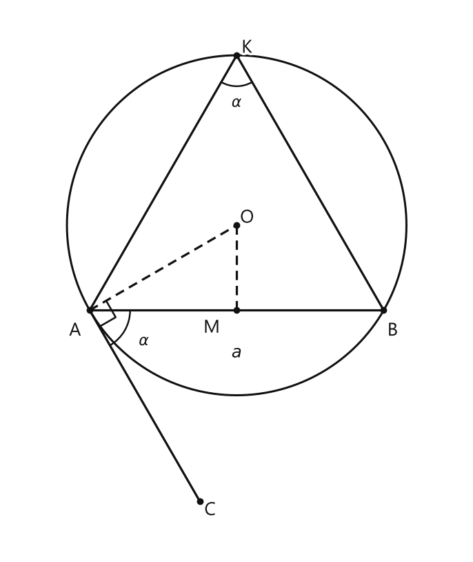
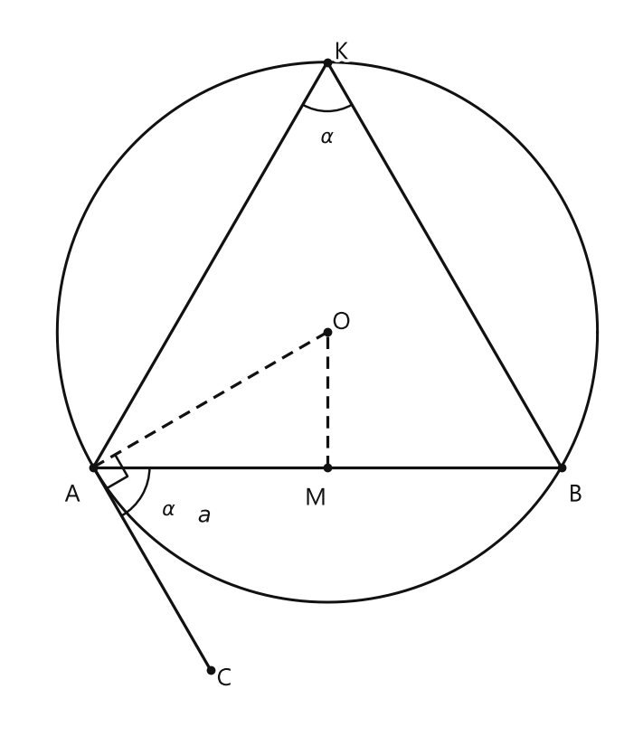

# Занятие 34. Об одном геометрическом месте точек

**Раздел:** Глава 4. Окружность  
**Параграф учебника:** §34. Об одном геометрическом месте точек  
**Страницы:** 199–199

## Цели занятия

К концу занятия ученик умеет:

- понимать, что такое геометрическое место точек;
- объяснять, почему точки, из которых отрезок виден под одним углом, лежат на дугах окружностей;
- строить дугу окружности по данному отрезку и углу;
- использовать свойства касательной, хорды и вписанного угла;
- строить треугольник по стороне, противолежащему углу и ещё одному элементу.

Выбери блок своего уровня:

- **1–2 балла:** понять определение и назвать искомое геометрическое место;
- **3–4 балла:** воспроизвести построение дуги;
- **5–6 баллов:** объяснить построение и доказательство;
- **7–8 баллов:** применить свойство к построению треугольника;
- **9–10 баллов:** самостоятельно обосновать построение и проверить результат.

## Теория к занятию

### 1. Геометрическое место точек

#### Простыми словами

Рассмотрим отрезок $AB$. Представим, что мы смотрим на него из разных точек плоскости.

Из каждой точки отрезок виден под некоторым углом. Нас интересуют все точки, из которых угол один и тот же и равен $\alpha$.

Если точка наблюдения — $K$, то условие записывается так:

$$\angle AKB=\alpha.$$

Все такие точки расположены не хаотично, а на двух дугах окружностей. Дуга по одну сторону от прямой $AB$ и такая же дуга по другую сторону — зеркальные отражения друг друга.

Концы $A$ и $B$ не входят в геометрическое место: в этих точках вершина угла совпала бы с концом отрезка.

#### Определение

**Геометрическим местом точек плоскости, из которых данный отрезок виден под углом $\alpha$, является объединение двух дуг окружностей: дуги $AKB$ и ей симметричной относительно прямой $AB$, за исключением концов этих дуг, то есть точек $A$ и $B$.**

Здесь точка $K$ лежит на дуге, если:

$$\angle AKB=\alpha.$$

### 2. Построение дуги окружности

#### Простыми словами

Дан отрезок $AB=a$ и угол $\alpha$. Нужно построить дугу, из каждой точки которой отрезок $AB$ виден под углом $\alpha$.

Смотри, отрезок $AB$ будет хордой искомой окружности. Центр окружности находится на серединном перпендикуляре к хорде $AB$, потому что центр одинаково удалён от точек $A$ и $B$.

Чтобы найти центр, используем касательную:

- в точке $A$ строим угол $\alpha$ между отрезком $AB$ и касательной;
- радиус, проведённый в точку касания, перпендикулярен касательной;
- значит, через $A$ проводим перпендикуляр к касательной;
- пересечение этой прямой с серединным перпендикуляром к $AB$ даст центр окружности.

Вот и весь секрет: касательная помогает добраться до центра. Геометрический «навигатор» работает без батареек.

#### Построение

Пусть дан отрезок $AB=a$ и угол $\alpha$.

1. Строим серединный перпендикуляр к отрезку $AB$. Обозначим его прямой $MO$.
2. В точке $A$ строим угол $\angle BAC=\alpha$.
3. Через точку $A$ проводим перпендикуляр к прямой $AC$.
4. Точку пересечения этого перпендикуляра с серединным перпендикуляром к $AB$ обозначаем $O$.
5. С центром $O$ и радиусом $OA$ проводим окружность.
6. Выделяем дугу $AKB$, на которой угол $\angle AKB$ равен $\alpha$.
7. Строим дугу, симметричную дуге $AKB$ относительно прямой $AB$.

Точки $A$ и $B$ в искомое геометрическое место не входят.

<!--geo-figure-spec
{
  "needed": true,
  "kind": "plane",
  "caption": "Построение дуги, из точек которой отрезок $AB$ виден под углом $\\alpha$",
  "equal": true,
  "axis": false,
  "xlim": [
    -1.1,
    5.1
  ],
  "ylim": [
    -3.3,
    4.1
  ],
  "points": {
    "A": [
      0,
      0
    ],
    "B": [
      4,
      0
    ],
    "M": [
      2,
      0
    ],
    "O": [
      2,
      1.1547
    ],
    "K": [
      2,
      3.4641
    ],
    "C": [
      1.5,
      -2.5981
    ]
  },
  "segments": [
    [
      "A",
      "B"
    ],
    {
      "points": [
        "M",
        "O"
      ],
      "dashed": true,
      "label": "",
      "t": 0.5
    },
    {
      "points": [
        "A",
        "C"
      ],
      "dashed": false,
      "label": "",
      "t": 0.5
    },
    {
      "points": [
        "A",
        "O"
      ],
      "dashed": true,
      "label": "",
      "t": 0.5
    },
    {
      "points": [
        "K",
        "A"
      ],
      "dashed": false,
      "label": "",
      "t": 0.5
    },
    {
      "points": [
        "K",
        "B"
      ],
      "dashed": false,
      "label": "",
      "t": 0.5
    }
  ],
  "polygons": [],
  "circles": [
    {
      "center": "O",
      "radius": 2.3094
    }
  ],
  "labels": {
    "A": {
      "dx": -0.2,
      "dy": -0.28
    },
    "B": {
      "dx": 0.12,
      "dy": -0.28
    },
    "M": {
      "dx": -0.34,
      "dy": -0.24
    },
    "O": {
      "dx": 0.14,
      "dy": 0.1
    },
    "K": {
      "dx": 0.14,
      "dy": 0.1
    },
    "C": {
      "dx": 0.14,
      "dy": -0.12
    }
  },
  "right_angles": [
    {
      "vertex": "A",
      "from": "O",
      "to": "C"
    }
  ],
  "angle_marks": [
    {
      "vertex": "A",
      "from": "B",
      "to": "C",
      "text": "$\\alpha$",
      "radius": 0.55
    },
    {
      "vertex": "K",
      "from": "A",
      "to": "B",
      "text": "$\\alpha$",
      "radius": 0.42
    }
  ],
  "texts": [
    {
      "xy": [
        2,
        -0.58
      ],
      "text": "$a$"
    }
  ]
}
-->

*Построение дуги, из точек которой отрезок AB виден под углом \alpha*

#### Теорема и свойства, используемые в доказательстве

- **Угол между касательной и хордой, выходящей из точки касания, равен вписанному углу, опирающемуся на ту же дугу.**
- **Радиус, проведённый в точку касания, перпендикулярен касательной.**
- **Центр окружности лежит на серединном перпендикуляре к хорде.**
- **Вписанный угол равен половине дуги, на которую он опирается.**

#### Доказательство

По построению прямая $OA$ перпендикулярна прямой $AC$:

$$OA\perp AC.$$

Значит, $AC$ — касательная к окружности с центром $O$ и радиусом $OA$.

По построению угол между касательной $AC$ и хордой $AB$ равен $\alpha$:

$$\angle BAC=\alpha.$$

По свойству угла между касательной и хордой:

$$\angle BAC=\frac12\widehat{AB}.$$

Вписанный угол $\angle AKB$ опирается на ту же дугу $AB$. Поэтому:

$$\angle AKB=\frac12\widehat{AB}.$$

Получаем:

$$\angle AKB=\angle BAC=\alpha.$$

Точка $K$ может быть любой точкой выбранной дуги $AKB$. Поэтому из каждой точки этой дуги отрезок $AB$ виден под углом $\alpha$.

Дуга по другую сторону отрезка $AB$ симметрична первой. При симметрии угол не изменяется, поэтому она обладает тем же свойством.

Значит, искомое геометрическое место состоит из двух дуг, а точки $A$ и $B$ из него исключаются.

#### Формулы

Для вписанного угла:

$$\angle AKB=\frac12\widehat{AB}.$$

Для угла между касательной и хордой:

$$\angle BAC=\frac12\widehat{AB}.$$

В этих формулах:

- $\angle AKB$ — вписанный угол;
- $\angle BAC$ — угол между касательной и хордой;
- $\widehat{AB}$ — величина дуги $AB$.

#### Правила

- Данный отрезок $AB$ является хордой искомой окружности.
- Центр окружности находится на серединном перпендикуляре к $AB$.
- Радиус, проведённый в точку касания, перпендикулярен касательной.
- После построения одной дуги нужно построить симметричную дугу по другую сторону от $AB$.
- Концы $A$ и $B$ исключаются.

#### Алгоритм

Чтобы построить дугу, из каждой точки которой отрезок $AB$ виден под углом $\alpha$:

1. Построить серединный перпендикуляр к $AB$.
2. В точке $A$ построить угол $\alpha$ между $AB$ и лучом $AC$.
3. Через $A$ провести перпендикуляр к $AC$.
4. Найти пересечение этой прямой с серединным перпендикуляром к $AB$.
5. Обозначить точку пересечения буквой $O$. Это центр окружности.
6. Провести окружность радиуса $OA$.
7. Взять нужную дугу $AKB$ и её симметричную дугу относительно $AB$.
8. Исключить точки $A$ и $B$.

#### Ловушки

- **Ловушка 1.** Через $A$ проводят перпендикуляр к $AB$. Нужно проводить перпендикуляр к касательной $AC$.
- **Ловушка 2.** Строят только одну дугу. Но геометрическое место находится по обе стороны от прямой $AB$.
- **Ловушка 3.** Включают точки $A$ и $B$. Эти точки нужно исключить.
- **Ловушка 4.** Путают вписанный угол с центральным. Вписанный угол равен половине дуги, на которую он опирается.

### 3. Построение треугольника с помощью геометрического места точек

#### Простыми словами

Пусть в треугольнике $ABC$ известны сторона $AB$ и противолежащий ей угол $\alpha$.

Противолежащий угол — это угол, вершина которого не лежит на стороне $AB$. В данном случае это угол $C$:

$$\angle ACB=\alpha.$$

Значит, вершина $C$ должна находиться в такой точке, из которой отрезок $AB$ виден под углом $\alpha$. Все возможные положения точки $C$ образуют построенное геометрическое место.

Если известен ещё один элемент треугольника, строим и второе условие. Пересечение двух геометрических мест даст положение вершины $C$.

#### Правило

Чтобы построить треугольник по стороне, противолежащему углу и ещё одному элементу:

1. построить геометрическое место вершин, из которых данная сторона видна под заданным углом;
2. построить второе геометрическое условие;
3. точка или точки пересечения дадут неизвестную вершину;
4. соединить найденную вершину с концами данной стороны.

#### Ловушки

- Угол должен быть **противолежащим** данной стороне.
- При построении могут появиться два симметричных решения.
- Если требуется выбрать один треугольник, нужно учитывать дополнительное условие.
- Вершина не может совпадать с концами данной стороны.

## Сводка формул «выучить наизусть»

$$\angle AKB=\frac12\widehat{AB}.$$

$$\angle BAC=\frac12\widehat{AB}.$$

Следовательно:

$$\angle AKB=\angle BAC.$$

Геометрическое место точек, из которых отрезок $AB$ виден под углом $\alpha$:

$$\text{две симметричные дуги окружностей без точек }A\text{ и }B.$$

## Правила, которые нельзя путать

- Серединный перпендикуляр к хорде проходит через центр окружности.
- Радиус к точке касания перпендикулярен касательной.
- Угол между касательной и хордой равен вписанному углу, опирающемуся на ту же дугу.
- Вписанный угол равен половине дуги, на которую он опирается.
- Искомое место — не вся окружность и не одна дуга, а две симметричные дуги без концов отрезка.

## Разбор ключевых заданий

### Р1. Найти геометрическое место точек

**Условие.** Дан отрезок $AB$. Найдите геометрическое место точек плоскости, из которых отрезок $AB$ виден под углом $\alpha$.

#### Решение

1. Возьмём точку $K$, из которой отрезок $AB$ виден под углом $\alpha$.
2. Запишем это условие:

$$\angle AKB=\alpha.$$

3. Угол $\angle AKB$ является вписанным углом.
4. Все точки, из которых одна и та же хорда видна под одним и тем же углом, лежат на дуге окружности.
5. По другую сторону от прямой $AB$ построена симметричная дуга.
6. Точки $A$ и $B$ исключаем: в них нельзя образовать угол с вершиной, отличной от концов отрезка.

#### Ответ

Геометрическим местом является объединение двух симметричных относительно прямой $AB$ дуг окружностей без точек $A$ и $B$.

---

### Р2. Построить дугу по отрезку и углу

**Условие.** Дан отрезок $AB=a$ и угол $\alpha$. Постройте дугу окружности, из каждой точки которой отрезок $AB$ виден под углом $\alpha$.

<!--geo-figure-spec
{
  "needed": true,
  "kind": "plane",
  "caption": "Построение дуги окружности по хорде $AB$ и углу $\\alpha$",
  "equal": true,
  "axis": false,
  "xlim": [
    -0.7,
    4.6
  ],
  "ylim": [
    -2.2,
    3.9
  ],
  "points": {
    "A": [
      0,
      0
    ],
    "B": [
      4,
      0
    ],
    "M": [
      2,
      0
    ],
    "O": [
      2,
      1.1547
    ],
    "K": [
      2,
      3.4641
    ],
    "C": [
      1,
      -1.7321
    ]
  },
  "segments": [
    [
      "A",
      "B"
    ],
    {
      "points": [
        "M",
        "O"
      ],
      "dashed": true,
      "label": "",
      "t": 0.5
    },
    [
      "A",
      "C"
    ],
    {
      "points": [
        "A",
        "O"
      ],
      "dashed": true,
      "label": "",
      "t": 0.5
    },
    [
      "K",
      "A"
    ],
    [
      "K",
      "B"
    ]
  ],
  "polygons": [],
  "circles": [
    {
      "center": "O",
      "radius": 2.3094
    }
  ],
  "labels": {
    "A": {
      "dx": -0.18,
      "dy": -0.24
    },
    "B": {
      "dx": 0.12,
      "dy": -0.24
    },
    "M": {
      "dx": -0.1,
      "dy": -0.27
    },
    "O": {
      "dx": 0.12,
      "dy": 0.08
    },
    "K": {
      "dx": 0.12,
      "dy": 0.08
    },
    "C": {
      "dx": 0.12,
      "dy": -0.08
    }
  },
  "right_angles": [
    {
      "vertex": "A",
      "from": "O",
      "to": "C"
    }
  ],
  "angle_marks": [
    {
      "vertex": "A",
      "from": "B",
      "to": "C",
      "text": "$\\alpha$",
      "radius": 0.48
    },
    {
      "vertex": "K",
      "from": "A",
      "to": "B",
      "text": "$\\alpha$",
      "radius": 0.42
    }
  ],
  "texts": [
    {
      "xy": [
        0.95,
        -0.42
      ],
      "text": "$a$"
    }
  ]
}
-->

*Построение дуги окружности по хорде AB и углу \alpha*

#### Решение

Дано:

- $AB=a$;
- $\angle BAC=\alpha$;
- $AB$ — хорда искомой окружности.

1. Строим серединный перпендикуляр к отрезку $AB$.
2. В точке $A$ строим угол:

$$\angle BAC=\alpha.$$

3. Через точку $A$ проводим перпендикуляр к прямой $AC$.
4. Точку пересечения этого перпендикуляра с серединным перпендикуляром к $AB$ обозначаем $O$.
5. Так как:

$$OA\perp AC,$$

прямая $AC$ является касательной к окружности с центром $O$ и радиусом $OA$.
6. Проводим окружность с центром $O$ и радиусом $OA$.
7. Выделяем дугу $AKB$, расположенную по одну сторону от прямой $AB$.
8. Строим дугу, симметричную дуге $AKB$ относительно прямой $AB$.
9. Исключаем точки $A$ и $B$.

Проверим построение.

Угол между касательной $AC$ и хордой $AB$ равен половине дуги $AB$:

$$\angle BAC=\frac12\widehat{AB}.$$

Вписанный угол $\angle AKB$ опирается на ту же дугу:

$$\angle AKB=\frac12\widehat{AB}.$$

Поэтому:

$$\angle AKB=\angle BAC=\alpha.$$

Построение выполнено верно. Касательная здесь не украшение, а главный путь к центру окружности.

#### Ответ

Построены две симметричные дуги окружностей, из каждой точки которых отрезок $AB$ виден под углом $\alpha$.

---

### Р3. Обосновать, почему центр лежит на серединном перпендикуляре

**Условие.** В искомой окружности отрезок $AB$ является хордой. Объясните, почему центр окружности лежит на серединном перпендикуляре к $AB$.

#### Решение

1. Пусть $O$ — центр окружности.
2. Отрезки $OA$ и $OB$ являются радиусами одной окружности.
3. Поэтому их длины равны:

$$OA=OB.$$

4. Значит, точка $O$ равноудалена от точек $A$ и $B$.
5. Геометрическим местом точек, равноудалённых от концов отрезка $AB$, является серединный перпендикуляр к этому отрезку.
6. Следовательно, точка $O$ лежит на серединном перпендикуляре к $AB$.

#### Ответ

Центр окружности лежит на серединном перпендикуляре к хорде $AB$, потому что $OA=OB$.

---

### Р4. Построить треугольник по стороне и противолежащему углу

**Условие.** Постройте треугольник $ABC$, если известны сторона $AB=a$ и противолежащий ей угол $\angle ACB=\gamma$.

#### Решение

Дано:

- сторона $AB=a$;
- угол:

$$\angle ACB=\gamma.$$

Точка $C$ должна находиться в таком месте, из которого отрезок $AB$ виден под углом $\gamma$.

1. Строим отрезок $AB=a$.
2. Строим геометрическое место точек, из которых отрезок $AB$ виден под углом $\gamma$.
3. Для этого строим серединный перпендикуляр к $AB$.
4. В точке $A$ строим угол между $AB$ и касательной, равный $\gamma$.
5. Через $A$ проводим перпендикуляр к построенной касательной.
6. Точку пересечения этой прямой с серединным перпендикуляром обозначаем $O$.
7. Проводим окружность с центром $O$ и радиусом $OA$.
8. Выделяем нужные дуги по обе стороны отрезка $AB$.
9. Выбираем точку $C$ на одной из дуг.
10. Соединяем точку $C$ с точками $A$ и $B$.

Тогда по построению:

$$\angle ACB=\gamma.$$

Если выбрать симметричную дугу, получится симметричный треугольник. Два решения здесь появляются не из-за ошибки, а из-за отражения относительно прямой $AB$.

#### Ответ

Треугольник $ABC$ построен: вершина $C$ выбирается на одной из дуг, из каждой точки которой отрезок $AB$ виден под углом $\gamma$.

---

### Р5. Найти угол в точке дуги

**Условие.** Отрезок $AB$ является хордой окружности. Дуга $AB$, на которую опирается вписанный угол $\angle AKB$, имеет величину $80^\circ$. Найдите $\angle AKB$.

#### Решение

1. Используем свойство вписанного угла:

$$\angle AKB=\frac12\widehat{AB}.$$

2. Величина дуги $AB$ равна $80^\circ$. Подставим это значение:

$$\angle AKB=\frac12\cdot80^\circ.$$

3. Выполним вычисление:

$$\angle AKB=40^\circ.$$

4. Проверим результат:

$$2\cdot40^\circ=80^\circ.$$

Получилась заданная величина дуги. Значит, вычисление выполнено верно.

#### Ответ: $40^\circ$.

## Практические задания

Выбери свой уровень и решай только этот блок. В блоке должна закрепиться вся тема параграфа. Ответы не приводятся.

### Уровень 1–2 балла

**С1.** Как называется множество всех точек плоскости, из которых данный отрезок виден под одним и тем же углом?

1) Геометрическое место точек  
2) Диаметр окружности  
3) Хорда окружности  
4) Касательная к окружности  
5) Центральная симметрия

**С2.** Данный отрезок обозначен $AB$. Из каждой точки некоторой дуги он виден под углом $\alpha$. Какой объект является этой дугой?

1) Дуга окружности  
2) Отрезок, параллельный $AB$  
3) Прямая, перпендикулярная $AB$  
4) Радиус окружности  
5) Диаметр окружности

**С3.** Геометрическое место точек, из которых отрезок $AB$ виден под углом $\alpha$, состоит из:

1) Двух симметричных дуг окружностей  
2) Одной прямой  
3) Двух отрезков, параллельных $AB$  
4) Только концов отрезка $AB$  
5) Одной окружности вместе с её центром

**С4.** Относительно какой прямой симметричны две дуги, образующие геометрическое место точек для отрезка $AB$?

1) Прямой $AB$  
2) Перпендикулярной биссектрисы отрезка $AB$  
3) Любой прямой, проходящей через $A$  
4) Прямой, проходящей через центр одной из окружностей  
5) Касательной к одной из дуг

**С5.** Концы данного отрезка $AB$ входят в геометрическое место точек, из которых отрезок виден под углом $\alpha$?

1) Да, оба входят  
2) Нет, оба исключаются  
3) Входит только точка $A$  
4) Входит только точка $B$  
5) Это зависит только от длины отрезка

**С6.** Какой угол рассматривают для точки $K$, из которой отрезок $AB$ виден под углом $\alpha$?

1) $\angle AKB$  
2) $\angle KAB$  
3) $\angle ABK$  
4) Угол между радиусами окружности  
5) Угол между двумя касательными

**С7.** Точка $K$ принадлежит одной из дуг геометрического места точек для отрезка $AB$. Какое равенство выполняется?

1) $\angle AKB=\alpha$  
2) $\angle AKB=2\alpha$  
3) $\angle AKB=90^\circ-\alpha$  
4) $\angle AKB=0^\circ$  
5) $\angle AKB=180^\circ$

**С8.** Даны отрезок $AB$ и угол $\alpha$. Что требуется построить, чтобы получить геометрическое место точек?

1) Дуги окружностей, из точек которых отрезок $AB$ виден под углом $\alpha$  
2) Только середину отрезка $AB$  
3) Только окружность с диаметром $AB$  
4) Прямую, проходящую через $A$ и $B$  
5) Два радиуса, равных отрезку $AB$

**С9.** Какое утверждение верно для двух дуг, образующих геометрическое место точек для отрезка $AB$?

1) Они симметричны относительно прямой $AB$  
2) Они всегда лежат на одной стороне от прямой $AB$  
3) Они пересекаются в точках $A$ и $B$ и входят в геометрическое место  
4) Они являются отрезками  
5) Они имеют общий центр на отрезке $AB$

**С10.** Точка $K$ находится на одной из построенных дуг и не совпадает с $A$ или $B$. Что можно утверждать о виде треугольника $AKB$?

1) Угол $\angle AKB$ равен заданному углу $\alpha$  
2) Угол $\angle AKB$ всегда прямой  
3) Треугольник $AKB$ всегда равносторонний  
4) Сторона $AK$ равна стороне $KB$  
5) Треугольник $AKB$ обязательно тупоугольный

**С11.** Какое свойство окружности используют при построении дуги, из точек которой хорда $AB$ видна под заданным углом?

1) Свойство вписанного угла  
2) Свойство диагоналей прямоугольника  
3) Свойство медианы треугольника  
4) Свойство параллельных прямых  
5) Свойство суммы углов четырёхугольника

**С12.** Какое утверждение о геометрическом месте точек для отрезка $AB$ и угла $\alpha$ является верным?

1) Любая точка полученных дуг, кроме $A$ и $B$, видит отрезок $AB$ под углом $\alpha$  
2) Любая точка прямой $AB$ видит отрезок $AB$ под углом $\alpha$  
3) Только середина отрезка $AB$ видит его под углом $\alpha$  
4) Все точки одной окружности, включая $A$ и $B$, входят в геометрическое место  
5) Геометрическое место состоит только из одной точки вне отрезка $AB$

**С13.** Данный отрезок $AB$ виден из точки $K$ под углом $\alpha$. Выберите верное утверждение о точке $K$.

1) Точка $K$ совпадает с точкой $A$  
2) Точка $K$ совпадает с точкой $B$  
3) Точка $K$ лежит на одной из дуг геометрического места точек  
4) Точка $K$ лежит на прямой $AB$  
5) Точка $K$ не связана с геометрическим местом точек

**С14.** Геометрическое место точек, из которых отрезок $AB$ виден под углом $\alpha$, состоит из:

1) одной прямой  
2) двух лучей  
3) двух дуг окружностей  
4) одной окружности  
5) двух отрезков

**С15.** Какие точки не входят в геометрическое место точек, из которых отрезок $AB$ виден под углом $\alpha$?

1) Только точка $A$  
2) Только точка $B$  
3) Точки $A$ и $B$  
4) Все точки прямой $AB$  
5) Ни одна точка не исключается

**С16.** Дуги геометрического места точек для отрезка $AB$ расположены:

1) по одну сторону от прямой $AB$  
2) по разные стороны от прямой $AB$  
3) только на прямой $AB$  
4) внутри отрезка $AB$  
5) в одной точке

**С17.** Относительно какой прямой симметричны две дуги геометрического места точек для отрезка $AB$?

1) Прямой, проходящей через $A$ и $B$  
2) Перпендикулярной к $AB$ и проходящей через $A$  
3) Перпендикулярной к $AB$ и проходящей через $B$  
4) Любой прямой, проходящей через $A$  
5) Диагонали квадрата

**С18.** Из точки $K$ отрезок $AB$ виден под углом $\alpha$. Из точки $L$, симметричной точке $K$ относительно прямой $AB$, отрезок $AB$ также виден под углом $\alpha$. Какое утверждение верно?

1) Точка $L$ не принадлежит геометрическому месту  
2) Точка $L$ принадлежит геометрическому месту  
3) Точка $L$ совпадает с точкой $A$  
4) Точка $L$ совпадает с точкой $B$  
5) Точка $L$ лежит внутри отрезка $AB$

**С19.** Выберите точку, которая не может принадлежать геометрическому месту точек для отрезка $AB$.

1) Точка $K$, лежащая на одной из дуг  
2) Точка $L$, симметричная точке $K$ относительно прямой $AB$  
3) Точка $A$  
4) Точка, лежащая на дуге окружности  
5) Точка, не лежащая на прямой $AB$

**С20.** На рисунке мысленно отмечены две дуги окружностей, симметричные относительно прямой $AB$. Из каждой точки этих дуг отрезок $AB$ виден под одним и тем же углом. Как называется совокупность таких точек?

1) Геометрическое место точек  
2) Средняя линия  
3) Медиана  
4) Диаметр  
5) Хорда

**С21.** Точка $K$ не совпадает с концами $A$ и $B$ отрезка $AB$ и лежит на дуге окружности, входящей в геометрическое место точек. Что можно утверждать о величине угла $AKB$?

1) Он равен $\alpha$  
2) Он равен $90^\circ$ при любом $\alpha$  
3) Он равен $0^\circ$  
4) Он всегда больше $\alpha$  
5) Его нельзя связать с углом $\alpha$

**С22.** Дана сторона $AB$ треугольника и угол $\alpha$, противолежащий этой стороне. Для построения треугольника выбирают точку $K$ на соответствующей дуге окружности. Какое условие должно выполняться?

1) Точка $K$ должна совпадать с точкой $A$  
2) Точка $K$ должна совпадать с точкой $B$  
3) Отрезок $AB$ должен быть виден из точки $K$ под углом $\alpha$  
4) Точка $K$ должна лежать на прямой $AB$  
5) Точка $K$ должна быть центром отрезка $AB$

**С23.** Дана дуга окружности, из каждой точки которой отрезок $AB$ виден под углом $\alpha$. Какое действие необходимо выполнить, чтобы получить вторую часть геометрического места точек?

1) Отразить данную дугу относительно прямой $AB$  
2) Повернуть дугу на $90^\circ$ вокруг точки $A$  
3) Перенести дугу вдоль прямой $AB$  
4) Удалить концы отрезка $AB$  
5) Удвоить длину отрезка $AB$

**С24.** Выберите правильное описание геометрического места точек для отрезка $AB$ и угла $\alpha$.

1) Одна окружность вместе с точками $A$ и $B$  
2) Две дуги окружностей, симметричные относительно прямой $AB$, без точек $A$ и $B$  
3) Два отрезка, содержащие точки $A$ и $B$  
4) Прямая $AB$ без точки $A$  
5) Две окружности, имеющие общий центр с отрезком $AB$

**С25.** Какое множество точек является геометрическим местом точек, из которых отрезок $AB$ виден под углом $\alpha$?

1) одна прямая, проходящая через $A$ и $B$  
2) окружность с центром в точке $A$  
3) две дуги окружностей, симметричные относительно прямой $AB$, без точек $A$ и $B$  
4) отрезок $AB$  
5) две прямые, перпендикулярные отрезку $AB$

**С26.** Из каждой точки некоторой дуги отрезок $AB$ виден под углом $40^\circ$. Какой угол образуют лучи $PA$ и $PB$, если точка $P$ принадлежит этой дуге?

1) $20^\circ$  
2) $40^\circ$  
3) $50^\circ$  
4) $80^\circ$  
5) $140^\circ$

**С27.** Отметьте, какие точки не принадлежат геометрическому месту точек, из которых отрезок $AB$ виден под углом $\alpha$.

1) точка $A$  
2) точка $B$  
3) точка $C$, расположенная на одной из соответствующих дуг  
4) точка $D$, расположенная на симметричной дуге  
5) точки $A$ и $B$

**С28.** Две дуги окружностей, образующие геометрическое место точек для отрезка $AB$, симметричны относительно какой прямой?

1) относительно перпендикуляра к $AB$, проведённого через его середину  
2) относительно прямой $AB$  
3) относительно касательной к одной из дуг  
4) относительно любой прямой, проходящей через $A$  
5) относительно хорды одной из дуг

**С29.** Точка $C$ не совпадает с концами отрезка $AB$ и принадлежит одной из дуг геометрического места точек, соответствующего углу $60^\circ$. Чему равен угол $ACB$?

1) $30^\circ$  
2) $60^\circ$  
3) $90^\circ$  
4) $120^\circ$  
5) $180^\circ$

**С30.** Как называется отрезок, соединяющий концы дуги окружности, на которой расположен отрезок $AB$?

1) радиус  
2) диаметр  
3) хорда  
4) касательная  
5) высота

**С31.** Выберите верное утверждение о геометрическом месте точек, из которых отрезок $AB$ виден под углом $\alpha$.

1) Оно состоит только из точек, расположенных между $A$ и $B$.  
2) Оно содержит точки $A$ и $B$.  
3) Оно состоит из двух симметричных дуг окружностей без точек $A$ и $B$.  
4) Оно всегда является одной окружностью.  
5) Оно всегда является прямой.

**С32.** Из каждой точки дуги окружности отрезок $AB$ виден под углом $75^\circ$. Какой угол образуют отрезки $PA$ и $PB$ для точки $P$ на этой дуге?

1) $15^\circ$  
2) $37{,}5^\circ$  
3) $75^\circ$  
4) $105^\circ$  
5) $150^\circ$

**С33.** При построении дуги, из каждой точки которой отрезок $AB$ виден под углом $\alpha$, какие инструменты используются согласно описанному построению?

1) только линейка  
2) только транспортир  
3) циркуль и линейка  
4) только угольник  
5) только циркуль

**С34.** Точка $P$ расположена на одной из дуг геометрического места точек для отрезка $AB$. Запишите равенство, выражающее условие видимости отрезка $AB$ под углом $\alpha$.

**С35.** Укажите, сколько дуг окружностей образует геометрическое место точек, из которых данный отрезок виден под углом $\alpha$.

1) одну  
2) две  
3) три  
4) четыре  
5) бесконечно много отдельных дуг

**С36.** Дана сторона $AB$ треугольника и противолежащий ей угол $\alpha$. Какое геометрическое построение позволяет найти вершину $C$ треугольника?

1) провести окружность с центром в $A$ произвольного радиуса  
2) построить геометрическое место точек, из которых отрезок $AB$ виден под углом $\alpha$  
3) провести только серединный перпендикуляр к $AB$  
4) разделить отрезок $AB$ пополам  
5) провести через $A$ прямую, параллельную $AB$

### Уровень 3–4 балла

**С1.** Дана точка $A$ и отрезок $AB$. Опишите геометрическое место точек плоскости, из которых отрезок $AB$ виден под углом $\alpha$. Укажите, входят ли точки $A$ и $B$ в это геометрическое место.

**С2.** Отрезок $AB$ виден из точки $K$ под углом $45^\circ$. Назовите все дуги окружностей, на которых могут находиться точки, из которых отрезок $AB$ виден под углом $45^\circ$.

**С3.** Геометрическое место точек, из которых отрезок $AB$ виден под углом $\alpha$, состоит из двух дуг окружностей. Как расположены эти дуги относительно прямой $AB$?

**С4.** Точки $K$ и $L$ лежат по разные стороны от прямой $AB$, причём $\angle AKB=\angle ALB=60^\circ$. Объясните, почему точки $K$ и $L$ принадлежат одному геометрическому месту точек.

**С5.** Постройте геометрическое место точек, из которых данный отрезок $AB$ виден под углом $60^\circ$. Точки $A$ и $B$ в построенное множество не включайте.

**С6.** Постройте дугу окружности, из каждой точки которой отрезок $AB$ длиной $5$ см виден под углом $90^\circ$.

**С7.** На окружности отмечены точки $A$, $B$ и $K$, причём $\angle AKB=40^\circ$. Назовите угол, под которым отрезок $AB$ виден из любой другой точки той же дуги, что и точка $K$.

**С8.** На одной дуге окружности расположены точки $K$ и $L$, а её концы — точки $A$ и $B$. Известно, что $\angle AKB=35^\circ$. Найдите $\angle ALB$.

**С9.** Дуга окружности $AKB$ является частью геометрического места точек, из которых отрезок $AB$ виден под углом $50^\circ$. Каким должен быть угол между лучами $KA$ и $KB$?

**С10.** Отрезок $AB$ виден из точки $K$ под углом $70^\circ$. Точка $L$ симметрична точке $K$ относительно прямой $AB$. Под каким углом отрезок $AB$ виден из точки $L$?

**С11.** Из точки $K$, не лежащей на прямой $AB$, отрезок $AB$ виден под углом $\alpha$. Точка $K$ принадлежит верхней дуге геометрического места точек. На какой дуге этого же геометрического места должна находиться точка $L$, если она расположена ниже прямой $AB$ и отрезок $AB$ виден из неё под тем же углом $\alpha$?

**С12.** Постройте треугольник $ABC$ по стороне $AB=6$ см, противолежащему углу $\angle ACB=40^\circ$ и условию, что вершина $C$ находится по одну сторону от прямой $AB$. Используйте геометрическое место точек, из которых отрезок $AB$ виден под углом $40^\circ$.

**С13.** Отрезок $AB$ имеет длину $6$ см. Постройте геометрическое место точек, из которых отрезок $AB$ виден под углом $60^\circ$. Укажите, какие точки не входят в построенное множество.

**С14.** Отрезок $CD$ имеет длину $5$ см. Постройте одну из дуг окружности, из каждой точки которой отрезок $CD$ виден под углом $45^\circ$.

**С15.** Объясните, почему концы отрезка $AB$ не принадлежат геометрическому месту точек, из которых отрезок $AB$ виден под углом $\alpha$, где $0^\circ<\alpha<180^\circ$.

**С16.** Даны точки $A$ и $B$. Постройте две дуги окружностей, симметричные относительно прямой $AB$, из каждой точки которых отрезок $AB$ виден под углом $90^\circ$. Концы дуг из построенного геометрического места исключите.

**С17.** Отрезок $MN$ длиной $8$ см виден из точки $P$ под углом $30^\circ$. Постройте дугу окружности, содержащую точку $P$, из каждой точки которой отрезок $MN$ виден под углом $30^\circ$.

**С18.** Точки $A$ и $B$ являются концами данного отрезка, а точка $K$ не лежит на прямой $AB$. Постройте окружность, проходящую через точки $A$, $B$ и $K$, если $\angle AKB=60^\circ$.

**С19.** Постройте треугольник $ABC$ по стороне $AB=7$ см и противолежащему ей углу $\angle ACB=45^\circ$. Укажите все возможные положения вершины $C$.

**С20.** Даны отрезок $AB=6$ см и угол $\angle ACB=90^\circ$. Постройте треугольник $ABC$, если вершина $C$ должна лежать в верхней полуплоскости относительно прямой $AB$.

**С21.** Даны точки $A$ и $B$ и точка $K$, не лежащая на прямой $AB$. Известно, что $\angle AKB=30^\circ$. Постройте геометрическое место точек $X$, для которых $\angle AXB=30^\circ$, и отметьте на построении точку $K$.

**С22.** Отрезок $AB$ является хордой окружности, а точка $C$ лежит на одной из дуг этой окружности с концами $A$ и $B$. Известно, что $\angle ACB=120^\circ$. Под каким углом отрезок $AB$ виден из любой точки меньшей дуги $AB$ этой окружности?

**С23.** Постройте треугольник $ABC$ по стороне $AB=5$ см, углу $\angle ACB=60^\circ$ и медиане $CM=4$ см, проведённой к стороне $AB$. Укажите последовательность построения.

**С24.** Даны отрезок $AB=6$ см и угол $\alpha=45^\circ$. Постройте геометрическое место точек, из которых отрезок $AB$ виден под углом $\alpha$. Затем постройте треугольник $ABC$, вершина которого лежит на одной из построенных дуг.

**С25.** Дана отрезок $AB$ длиной $6$ см. Опишите геометрическое место точек плоскости, из которых отрезок $AB$ виден под углом $60^\circ$.

**С26.** Дана точка $K$, не лежащая на прямой $AB$. Известно, что $\angle AKB=45^\circ$. Какой угол виден отрезок $AB$ из точек дуги окружности, проходящей через точки $A$, $K$ и $B$?

**С27.** Постройте геометрическое место точек, из которых отрезок $AB$ длиной $5$ см виден под углом $90^\circ$. Укажите, какие точки необходимо исключить из построенного множества.

**С28.** На плоскости построены две симметричные относительно прямой $AB$ дуги окружностей с концами в точках $A$ и $B$. Из каждой точки этих дуг отрезок $AB$ виден под углом $30^\circ$. Как называется объединение этих дуг без точек $A$ и $B$?

**С29.** Отрезок $AB$ виден из точки $K$ под углом $120^\circ$. Постройте дугу окружности, содержащую точку $K$ и имеющую концами точки $A$ и $B$.

**С30.** Даны точки $A$ и $B$. Постройте геометрическое место точек, из которых отрезок $AB$ виден под углом $45^\circ$. Для построения используйте циркуль и линейку.

**С31.** Точка $K$ не лежит на прямой $AB$, а точка $L$ симметрична точке $K$ относительно прямой $AB$. Известно, что $\angle AKB=70^\circ$. Найдите угол, под которым отрезок $AB$ виден из точки $L$.

**С32.** Отрезок $AB$ является хордой окружности. Точка $K$ лежит на одной из дуг окружности с концами $A$ и $B$, причём $\angle AKB=50^\circ$. Какой угол виден отрезок $AB$ из любой точки другой дуги этой окружности, не являющейся точками $A$ и $B$?

**С33.** Постройте треугольник $ABC$ по стороне $AB=6$ см, углу $\angle ACB=40^\circ$ и углу $\angle BAC=65^\circ$.

**С34.** Даны отрезок $AB$ и угол $\alpha$, где $0^\circ<\alpha<180^\circ$. Составьте план построения дуги окружности, из каждой точки которой отрезок $AB$ виден под углом $\alpha$. Укажите, относительно какой прямой строится вторая дуга.

**С35.** Точка $K$ лежит на дуге окружности с концами $A$ и $B$, не совпадая с $A$ и $B$. Отрезок $AB$ виден из точки $K$ под углом $35^\circ$. Выберите верное утверждение:  
1) точка $K$ лежит на прямой $AB$;  
2) точка $K$ является одним из концов дуги;  
3) угол $\angle AKB$ равен $35^\circ$;  
4) угол $\angle AKB$ равен $145^\circ$;  
5) отрезок $AB$ виден из точки $K$ под углом $70^\circ$.

**С36.** Постройте треугольник $ABC$ по стороне $AB=7$ см, противолежащему ей углу $\angle ACB=50^\circ$ и стороне $AC=5$ см. Используйте геометрическое место точек, из которых отрезок $AB$ виден под заданным углом.

### Уровень 5–6 баллов

**С1.** Постройте геометрическое место точек, из которых отрезок $AB$ длиной $6$ см виден под углом $60^\circ$. Используйте циркуль и линейку. Укажите, какие точки не входят в построенное множество.

**С2.** Постройте геометрическое место точек, из которых отрезок $CD$ длиной $5$ см виден под углом $45^\circ$. Выполните построение по известному алгоритму.

**С3.** Точка $P$ не лежит на прямой $AB$, причём $\angle APB=30^\circ$. Постройте одну из дуг окружности, содержащих точки, из которых отрезок $AB$ виден под углом $30^\circ$.

**С4.** Отрезок $MN$ виден из точки $K$ под углом $90^\circ$. Постройте геометрическое место всех точек, из которых отрезок $MN$ виден под таким же углом.

**С5.** На окружности лежат точки $A$, $B$ и $P$, причём точки $A$ и $B$ являются концами хорды, а $\angle APB=40^\circ$. Определите величину центрального угла, опирающегося на ту же дугу $AB$, что и угол $APB$.

**С6.** Хорда $AB$ окружности видна из точки $P$, лежащей на большей дуге $AB$, под углом $35^\circ$. Определите величину вписанного угла, опирающегося на меньшую дугу $AB$.

**С7.** Даны отрезок $AB$ и точка $P$, не лежащая на прямой $AB$. Известно, что $\angle APB=50^\circ$. Постройте окружность, проходящую через точки $A$, $B$ и $P$, а затем выделите дугу, состоящую из точек, из которых отрезок $AB$ виден под углом $50^\circ$.

**С8.** Постройте треугольник $ABC$ по стороне $AB=7$ см, углу $\angle ACB=60^\circ$ и условию, что вершина $C$ расположена по одну сторону от прямой $AB$. Опишите построение дуги, на которой может находиться точка $C$.

**С9.** Постройте треугольник $KLM$ по стороне $KL=6$ см, углу $\angle KML=45^\circ$ и медиане, проведённой из вершины $M$ к стороне $KL$, равной $4$ см. Для построения используйте геометрическое место точек, из которых отрезок $KL$ виден под углом $45^\circ$.

**С10.** Даны отрезок $AB=8$ см и точка $C$, не лежащая на прямой $AB$. Известно, что $\angle ACB=30^\circ$. Постройте все точки $P$, для которых $\angle APB=30^\circ$ и точка $P$ находится по ту же сторону от прямой $AB$, что и точка $C$.

**С11.** На плоскости отмечены точки $A$ и $B$. Требуется построить точку $P$, удалённую от прямой $AB$ на $3$ см, такую, чтобы $\angle APB=60^\circ$, где $AB=6$ см. Выполните построение и определите, сколько таких точек может получиться.

**С12.** Отрезок $AB=10$ см. Постройте геометрическое место точек $P$, для которых $\angle APB=120^\circ$. Затем укажите, как изменится построенное множество, если дополнительно потребовать, чтобы точки $P$ находились только по одну сторону от прямой $AB$.

**С13.** Отрезок $AB$ имеет длину $8$ см. Постройте геометрическое место точек, из которых отрезок $AB$ виден под углом $60^\circ$. Опишите последовательность построения одной из дуг.

**С14.** Отрезок $AB$ имеет длину $10$ см. Точка $K$ расположена по одну сторону от прямой $AB$, причём $\angle AKB=90^\circ$. Определите, какой дуге окружности принадлежит точка $K$, и укажите, какие точки не входят в искомое геометрическое место.

**С15.** Отрезок $AB$ имеет длину $6$ см. Из точки $K$, расположенной вне прямой $AB$, он виден под углом $30^\circ$. Найдите радиус окружности, дугой которой является геометрическое место точек с этой стороны от прямой $AB$.

**С16.** Отрезок $AB$ имеет длину $12$ см. Постройте дугу окружности, из каждой точки которой отрезок $AB$ виден под углом $45^\circ$. Укажите положение центра построенной окружности относительно прямой $AB$.

**С17.** На плоскости даны точки $A$ и $B$. Геометрическое место точек, из которых отрезок $AB$ виден под углом $120^\circ$, состоит из двух дуг окружностей. Сравните расстояния от центров этих окружностей до прямой $AB$ и объясните, почему дуги симметричны относительно прямой $AB$.

**С18.** Отрезок $AB$ имеет длину $10$ см. Точка $K$ находится на серединном перпендикуляре к отрезку $AB$ и расположена на расстоянии $5$ см от точки $AB$ — то есть от середины отрезка $AB$. Найдите угол $\angle AKB$ и определите, принадлежит ли точка $K$ геометрическому месту точек, из которых отрезок $AB$ виден под углом $90^\circ$.

**С19.** Постройте геометрическое место точек, из которых отрезок $AB$ длиной $7$ см виден под углом $60^\circ$. На каждой из построенных дуг отметьте по одной точке $K$ и $L$. Сравните углы $\angle AKB$ и $\angle ALB$.

**С20.** Отрезок $AB$ имеет длину $8$ см. Требуется построить треугольник $ABC$, если $\angle ACB=60^\circ$ и сторона $AC=5$ см. Опишите построение, используя геометрическое место точек, из которых отрезок $AB$ виден под углом $60^\circ$.

**С21.** Отрезок $AB$ имеет длину $6$ см. Укажите, как изменится радиус окружности, содержащей дугу геометрического места точек, если угол, под которым виден отрезок $AB$, увеличить с $30^\circ$ до $60^\circ$. Выполните необходимые вычисления.

**С22.** Даны точки $A$ и $B$, расстояние между которыми равно $9$ см. Постройте две дуги окружностей, из каждой точки которых отрезок $AB$ виден под углом $45^\circ$. Отметьте на чертеже точки $A$ и $B$, которые не принадлежат геометрическому месту.

**С23.** Отрезок $AB$ имеет длину $10$ см. Точка $K$ расположена вне прямой $AB$, а $\angle AKB=60^\circ$. Найдите величину центрального угла, опирающегося на хорду $AB$ в окружности, содержащей точку $K$ и отрезок $AB$.

**С24.** Постройте треугольник $ABC$ по стороне $AB=7$ см, углу $\angle ACB=45^\circ$ и медиане $CM=5$ см. Для построения используйте геометрическое место точек, из которых отрезок $AB$ виден под углом $45^\circ$, и укажите, как выбираются возможные точки $C$.

**С25.** Постройте геометрическое место точек плоскости, из которых отрезок $AB$ длиной $6$ см виден под углом $60^\circ$. Укажите, какие точки не входят в построенное геометрическое место.

**С26.** Отрезок $AB$ является хордой окружности радиуса $5$ см, а меньший центральный угол, опирающийся на эту хорду, равен $60^\circ$. Под каким углом виден отрезок $AB$ из точки большей дуги $AB$ и под каким углом — из точки меньшей дуги $AB$?

**С27.** Даны отрезок $AB$ и точка $C$, не лежащая на прямой $AB$, причём $\angle ACB=45^\circ$. Постройте окружность, проходящую через точки $A$, $B$ и $C$, а затем укажите дугу этой окружности, из каждой точки которой отрезок $AB$ виден под углом $45^\circ$.

**С28.** Хорда $AB$ окружности имеет длину $8$ см, а расстояние от центра окружности до прямой $AB$ равно $3$ см. Найдите радиус окружности и угол, под которым хорда $AB$ видна из точки большей дуги $AB$.

**С29.** Постройте треугольник $ABC$ по стороне $AB=7$ см, противолежащему углу $\angle C=60^\circ$ и медиане $CM=5$ см, где $M$ — середина стороны $AB$. Опишите последовательность построения.

**С30.** На плоскости даны отрезок $AB=10$ см и точка $C$, не лежащая на прямой $AB$, причём $\angle ACB=30^\circ$. Постройте геометрическое место точек $X$, для которых $\angle AXB=30^\circ$, и определите, принадлежит ли этому месту точка $C$.

### Уровень 7–8 баллов

**С1.** Дан отрезок $AB=6$ см. Постройте геометрическое место точек плоскости, из которых отрезок $AB$ виден под углом $60^\circ$. Укажите, какие точки не входят в построенное геометрическое место.

**С2.** Дан отрезок $AB=8$ см и точка $K$, не лежащая на прямой $AB$, причём $\angle AKB=45^\circ$. Постройте окружность, проходящую через точки $A$, $B$ и $K$. Определите величину вписанных углов, опирающихся на хорду $AB$ и имеющих вершины на той же дуге, что и точка $K$.

**С3.** На плоскости отмечены точки $A$ и $B$. Точка $K$ не лежит на прямой $AB$, причём $\angle AKB=70^\circ$. Определите величину угла $\angle ALB$, если точки $K$ и $L$ лежат на одной дуге окружности, опирающейся на хорду $AB$.

**С4.** Дано, что точки $K$ и $L$ расположены по разные стороны от прямой $AB$, а $\angle AKB=50^\circ$ и $\angle ALB=130^\circ$. Объясните, могут ли точки $K$ и $L$ принадлежать одному геометрическому месту точек, из которых отрезок $AB$ виден под одним и тем же углом.

**С5.** Дан отрезок $AB=10$ см. Постройте точку $K$, лежащую в одной из полуплоскостей относительно прямой $AB$, такую, что $\angle AKB=90^\circ$. Опишите построение окружности, на которой лежат все точки этой полуплоскости, из которых отрезок $AB$ виден под прямым углом.

**С6.** Дан отрезок $AB=7$ см и угол $\alpha=40^\circ$. Постройте две дуги окружностей, являющиеся геометрическим местом точек, из которых отрезок $AB$ виден под углом $\alpha$. Построение выполните с помощью циркуля и линейки.

**С7.** Точка $K$ лежит на геометрическом месте точек, из которых отрезок $AB$ виден под углом $35^\circ$. Точки $A$, $B$ и $K$ не лежат на одной прямой. Определите углы треугольника $AKB$, если $\angle KAB=65^\circ$.

**С8.** В треугольнике $ABC$ известны сторона $AB=9$ см и противолежащий ей угол $\angle ACB=50^\circ$. Постройте треугольник $ABC$, если дополнительно задан угол $\angle CAB=60^\circ$. Обоснуйте, почему вершина $C$ должна лежать на одной из дуг геометрического места точек, из которых отрезок $AB$ виден под углом $50^\circ$.

**С9.** Даны точки $A$ и $B$ и точка $P$, не лежащая на прямой $AB$. Известно, что $\angle APB=55^\circ$. Постройте геометрическое место точек, из которых отрезок $AB$ виден под углом $55^\circ$, и определите, на какой дуге должна находиться точка $P$.

**С10.** Даны отрезок $AB=6$ см и точка $M$, не лежащая на прямой $AB$. Известно, что $\angle AMB=120^\circ$. Постройте окружность, содержащую точки $A$, $B$ и $M$, а затем постройте дугу, являющуюся геометрическим местом точек, из которых отрезок $AB$ виден под углом $120^\circ$. Укажите положение этой дуги относительно прямой $AB$.

**С11.** Даны отрезок $AB$ и угол $\alpha$, где $0^\circ<\alpha<180^\circ$. Сформулируйте и обоснуйте алгоритм построения геометрического места точек, из которых отрезок $AB$ виден под углом $\alpha$: постройте одну из дуг, найдите её центр и укажите, как получить симметричную дугу.

**С12.** В треугольнике $ABC$ известны сторона $AB=8$ см, угол $\angle ACB=45^\circ$ и медиана $CM=5$ см, где $M$ — середина стороны $AB$. Постройте все возможные треугольники $ABC$. Обоснуйте, почему при построении вершина $C$ должна одновременно принадлежать геометрическому месту точек, из которых отрезок $AB$ виден под углом $45^\circ$, и окружности с центром $M$ и радиусом $5$ см.

**С13.** Дана отрезок $AB$ длиной $8$ см. Постройте геометрическое место всех точек $X$, из которых отрезок $AB$ виден под углом $60^\circ$. Опишите последовательность построения и укажите, какие точки необходимо исключить.

**С14.** Дана окружность, содержащая точки $A$ и $B$ на одной из своих хорд. Точка $C$ лежит на одной из дуг $AB$, не содержащейся в концах хорды, и $\angle ACB=42^\circ$. Докажите, что для любой точки $D$ этой же дуги, отличной от $A$ и $B$, выполняется $\angle ADB=42^\circ$.

**С15.** Отрезок $AB$ виден из точки $C$ под углом $35^\circ$. Точка $D$ расположена симметрично точке $C$ относительно прямой $AB$. Определите величину угла $ADB$ и обоснуйте ответ.

**С16.** Постройте треугольник $ABC$ по стороне $AB=6$ см, противолежащему углу $\angle ACB=50^\circ$ и высоте $CH=4$ см, где $H$ — основание высоты, опущенной из вершины $C$ на прямую $AB$. Опишите построение и объясните, почему полученный треугольник удовлетворяет условию.

**С17.** Даны точки $A$ и $B$, $AB=5$ см, и точка $C$, не лежащая на прямой $AB$, такая, что $\angle ACB=70^\circ$. Постройте все точки $X$, для которых $\angle AXB=70^\circ$ и точка $X$ лежит по другую сторону от прямой $AB$, чем точка $C$. Укажите, сколько решений может быть получено.

**С18.** Дана окружность с хордой $AB$. Точки $C$ и $D$ лежат на одной дуге $AB$, не содержащей её концов. Известно, что $\angle ACB=58^\circ$. Сравните углы $\angle ACB$ и $\angle ADB$ и объясните, почему сравнение возможно без измерения углов.

**С19.** Отрезок $AB$ длиной $10$ см из точки $C$ виден под углом $90^\circ$. Найдите расстояние от точки $C$ до середины $O$ отрезка $AB$. Обоснуйте ответ, используя свойство вписанного угла.

**С20.** Дана точка $P$, не лежащая на прямой $AB$, и известно, что $\angle APB=45^\circ$. Постройте геометрическое место точек $X$, для которых $\angle AXB=45^\circ$. Затем выделите из построенного множества точки, лежащие по ту же сторону от прямой $AB$, что и точка $P$.

**С21.** Даны отрезок $AB=7$ см и точка $C$, для которой $\angle ACB=120^\circ$. Постройте окружность, на дуге которой лежит точка $C$ и из каждой внутренней точки этой дуги отрезок $AB$ виден под углом $120^\circ$. Опишите, как определить центр окружности по данным $A$, $B$ и $C$.

**С22.** Докажите, что геометрическое место точек, из которых отрезок $AB$ виден под углом $\alpha$, не может содержать точки $A$ и $B$. Объясните это как с точки зрения определения угла, так и с точки зрения построения соответствующих дуг окружностей.

**С23.** Постройте треугольник $ABC$ по стороне $AB=8$ см, противолежащему углу $\angle ACB=40^\circ$ и медиане $CM=5$ см, где $M$ — середина стороны $AB$. Опишите построение с использованием геометрического места точек и обоснуйте число возможных треугольников.

**С24.** Даны точки $A$ и $B$, $AB=6$ см, и число $\alpha$, где $0^\circ<\alpha<180^\circ$. Сформулируйте и докажите утверждение о геометрическом месте точек $X$, для которых $\angle AXB=\alpha$. В доказательстве отдельно укажите расположение двух дуг относительно прямой $AB$ и причину исключения точек $A$ и $B$.

### Уровень 9–10 баллов

**С1.** Отрезок $AB$ имеет длину $8$ см. Постройте геометрическое место точек плоскости, из которых отрезок $AB$ виден под углом $60^\circ$. Укажите, какие точки необходимо исключить из построенного множества.

**С2.** Отрезок $AB$ имеет длину $10$ см. Постройте дугу окружности, из каждой точки которой отрезок $AB$ виден под углом $45^\circ$. Определите радиус окружности и расстояние от её центра до прямой $AB$.

**С3.** Точки $C$ и $D$ лежат по разные стороны от прямой $AB$, причём $AB=12$ см, $\angle ACB=30^\circ$ и $\angle ADB=30^\circ$. Докажите, что точки $C$ и $D$ принадлежат одному геометрическому месту точек, соответствующему отрезку $AB$ и углу $30^\circ$.

**С4.** Отрезок $AB$ виден из точки $C$ под углом $72^\circ$. Точка $D$ лежит по другую сторону от прямой $AB$, а $\angle ADB=72^\circ$. Докажите, что точки $C$ и $D$ симметричны относительно прямой $AB$ тогда и только тогда, когда они находятся на одинаковом расстоянии от прямой $AB$.

**С5.** Постройте треугольник $ABC$ по стороне $AB=7$ см, углу $\angle ACB=50^\circ$ и высоте $CH=4$ см, опущенной на сторону $AB$. Рассмотрите все возможные положения вершины $C$ и обоснуйте, сколько решений может иметь задача.

**С6.** Постройте треугольник $ABC$ по стороне $AB=9$ см, углу $\angle ACB=60^\circ$ и медиане $AM=7$ см, где $M$ — середина стороны $BC$. Используйте геометрическое место точек, из которых отрезок $AB$ виден под углом $60^\circ$.

**С7.** Даны точки $A$ и $B$, $AB=6$ см, и точка $P$, не лежащая на прямой $AB$. Постройте все точки $X$, для которых $\angle AXB=\angle APB$, если точки $X$ не должны совпадать с $A$, $B$ и $P$. Укажите, какие из построенных точек лежат по одну сторону от прямой $AB$ с точкой $P$.

**С8.** На одной стороне от прямой $AB$ выбраны точки $C$ и $D$, для которых $\angle ACB=40^\circ$ и $\angle ADB=40^\circ$. Докажите, что точки $C$ и $D$ лежат на одной дуге окружности, не содержащей точки $A$ и $B$, и что четырёхугольник $ACBD$ является вписанным.

**С9.** Хорда $AB$ окружности имеет длину $14$ см, а вписанный угол, опирающийся на эту хорду и расположенный на большей дуге окружности, равен $30^\circ$. Найдите радиус окружности и длину меньшей дуги $AB$.

**С10.** В треугольнике $ABC$ сторона $AB=16$ см, а угол $\angle ACB=45^\circ$. Найдите расстояние от центра описанной окружности треугольника до прямой $AB$. Затем опишите геометрическое место возможных положений вершины $C$, если сторона $AB$ и угол $\angle ACB$ остаются неизменными.

**С11.** Даны прямая $l$ и точки $A,B$, не принадлежащие этой прямой. Постройте все точки $X$ на прямой $l$, из которых отрезок $AB$ виден под углом $60^\circ$. Сформулируйте условие, при котором задача имеет два, одно или ни одного решения.

**С12.** Отрезок $AB$ является основанием треугольника $ABC$, причём $AB=10$ см и $\angle ACB=120^\circ$. Определите, на какой дуге окружности должен находиться центр описанной окружности треугольника, и найдите радиус этой окружности. Постройте соответствующее геометрическое место точек для вершины $C$.

**С13.** Даны отрезок $AB$ длиной $8$ см и угол $\alpha=60^\circ$. Опишите построение геометрического места точек $X$, для которых $\angle AXB=60^\circ$, с помощью циркуля и линейки. Укажите, какие точки необходимо исключить из построенного множества.

**С14.** Даны отрезок $AB$ длиной $10$ см и точка $C$, не принадлежащая прямой $AB$, причём $\angle ACB=45^\circ$. Постройте все точки $X$, для которых $\angle AXB=45^\circ$ и точка $X$ лежит по ту же сторону от прямой $AB$, что и точка $C$. Обоснуйте, почему построенное множество является дугой одной окружности.

**С15.** Хорда $AB$ окружности имеет длину $12$ см, а вписанный угол, опирающийся на эту хорду и расположенный на большей дуге окружности, равен $30^\circ$. Найдите радиус окружности и величину центрального угла, опирающегося на хорду $AB$.

**С16.** Отрезок $AB$ виден из точки $C$ под углом $120^\circ$. Постройте геометрическое место точек $X$, для которых $\angle AXB=120^\circ$, если дополнительно требуется, чтобы точки $X$ находились внутри угла $ACB$. Опишите, какая часть полного геометрического места точек будет выбрана.

**С17.** Постройте треугольник $ABC$ по стороне $AB=7$ см, противолежащему ей углу $\angle C=50^\circ$ и медиане $CM=5$ см, где $M$ — середина стороны $AB$. Обоснуйте использование геометрического места точек, из которых отрезок $AB$ виден под углом $50^\circ$.

**С18.** Даны две пересекающиеся прямые $l$ и $m$ и точка $A$, лежащая на $l$, но не лежащая на $m$. Постройте все точки $X$ прямой $m$, для которых $\angle AXB=60^\circ$, где $B$ — фиксированная точка прямой $l$, отличная от $A$, причём $AB=6$ см. Определите, при каком расположении прямой $m$ задача имеет две, одну или ни одной точки решения.

## Чек-лист «ученик понял тему»

- Могу повторить определения и формулы параграфа своими словами и по учебнику.
- Решаю типовые задания своего уровня без подсказки.
- Вижу типичную ошибку и могу её объяснить.
