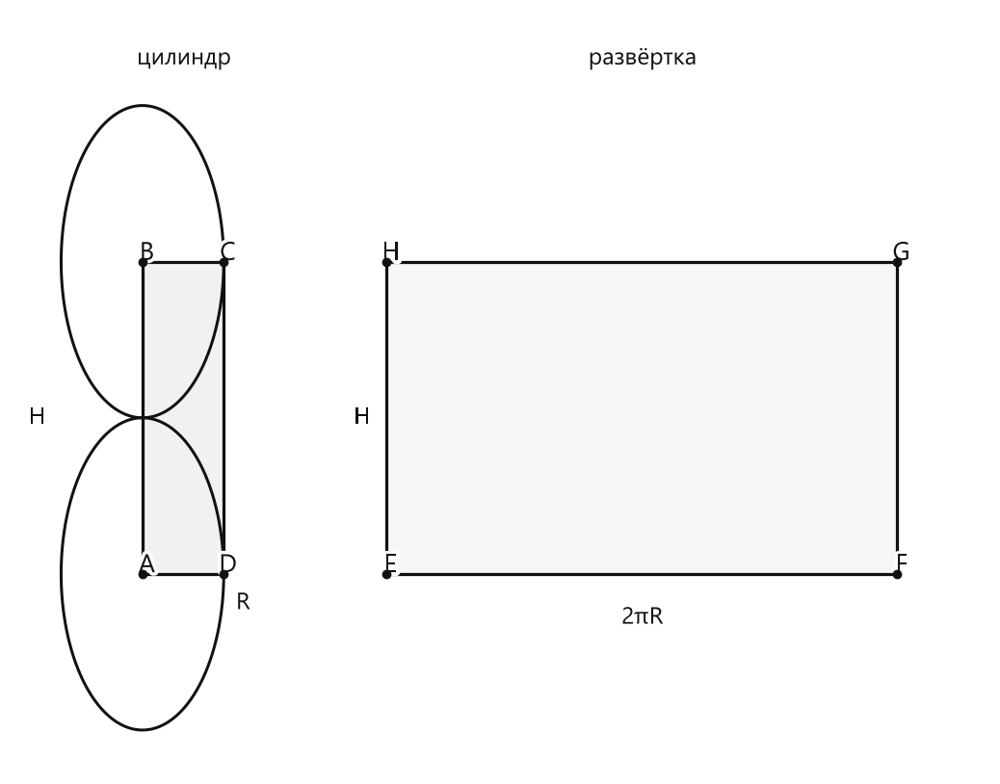
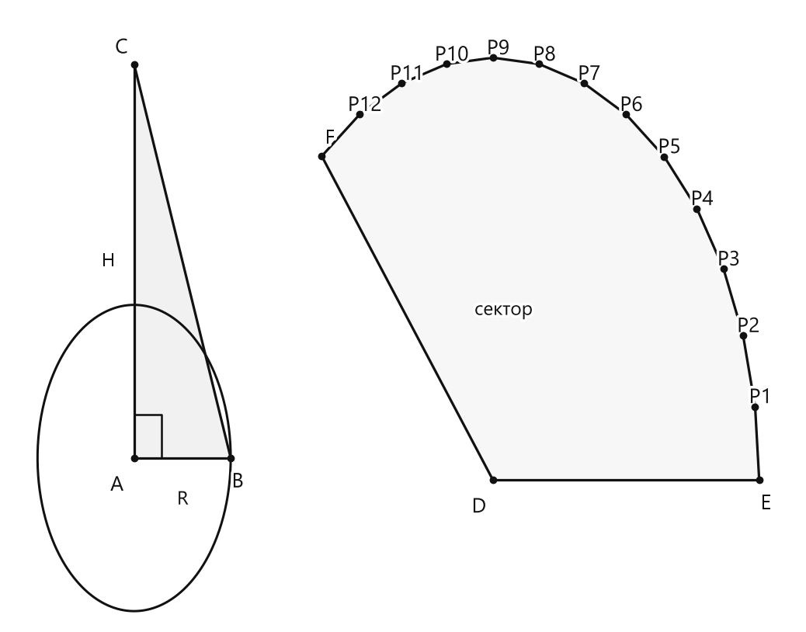

# Занятие 35. Геометрия 3D

**Раздел:** Глава 4. Окружность  
**Параграф учебника:** §35. Геометрия 3D  
**Страницы:** 200–201

## Цели занятия

После занятия ученик умеет:

- объяснять, как получают шар, цилиндр и конус вращением плоских фигур;
- различать поверхность, основания, высоту и радиус тел вращения;
- описывать поверхность цилиндра и конуса;
- определять вид развертки боковой поверхности цилиндра и конуса;
- применять связь длины окружности основания цилиндра с его разверткой.

Выбери блок своего уровня:

- **1–2 балла:** узнаю тела вращения и их элементы;
- **3–4 балла:** различаю основания, радиус и высоту;
- **5–6 баллов:** работаю с развертками;
- **7–8 баллов:** решаю задачи на длину сторон развертки;
- **9–10 баллов:** объясняю построение и проверяю несколько условий сразу.

## Теория к занятию

### Шар и сфера

#### Простыми словами

Представь круг или полукруг, который вращается вокруг своего диаметра. Каждая его точка движется по окружности. Так из плоской фигуры получается объёмное тело — шар.

Важно различать:

- **шар** — всё объёмное тело, как мяч целиком;
- **сфера** — только поверхность шара, его наружная оболочка.

Круг — плоская фигура, а шар — объёмная. Похожи по названию, но живут в разных измерениях.

#### Определение

> Из курса геометрии 7-го класса мы знаем, что если вращать круг или полукруг вокруг его диаметра, то получится шар (рис. 400).

#### Определение

> Поверхность шара называется сферой.

#### Правила

- **Шар** — объёмное тело.
- **Сфера** — поверхность шара.
- Шар получают вращением круга или полукруга вокруг диаметра.
- Диаметр, вокруг которого происходит вращение, называют осью вращения.

#### Ловушки

- Поверхность шара — это **сфера**, а не шар.
- Круг является плоской фигурой, а шар — объёмным телом.
- Вращение происходит именно вокруг диаметра, а не вокруг любого отрезка.

---

### Цилиндр

#### Простыми словами

Возьмём прямоугольник и начнём вращать его вокруг одной из сторон.

- Сторона, вокруг которой вращают прямоугольник, остаётся на месте и задаёт высоту цилиндра.
- Вторая сторона движется по кругу и задаёт радиус основания.
- При вращении появляются два одинаковых круга — верхнее и нижнее основания цилиндра.

Получается тело, похожее на банку или стакан без ручки. Математика тоже любит бытовые примеры — только записывает их точнее.

#### Определение

> Если вращать прямоугольник около одной из его сторон, то получится цилиндр (рис. 401).

#### Определение

> Круги называются основаниями цилиндра.

#### Определение

> Высота $H$ цилиндра равна второй стороне прямоугольника вращения.

#### Свойство

> Поверхность цилиндра состоит из двух кругов и боковой поверхности (рис. 402).

#### Свойство

> Радиус $R$ оснований цилиндра равен одной из сторон прямоугольника вращения.

#### Простыми словами о частях цилиндра

У цилиндра есть:

- два одинаковых круга — основания;
- боковая поверхность;
- высота $H$ — расстояние между основаниями;
- радиус $R$ основания.

Если разрезать боковую поверхность цилиндра по прямой и развернуть её, получится прямоугольник:

- одна сторона прямоугольника равна высоте цилиндра;
- другая сторона равна длине окружности основания.

То есть боковая поверхность цилиндра после развёртки превращается в прямоугольник. Цилиндр как будто временно «снимает куртку» и раскладывает её на столе.

#### Свойство

> Если боковую поверхность цилиндра развернуть на плоскость, то получится прямоугольник. Одна из его сторон равна высоте цилиндра, а другая — длине окружности основания, то есть $2\pi R$.

#### Формулы

Стороны прямоугольника-развёртки боковой поверхности цилиндра:

$$H \quad \text{и} \quad 2\pi R.$$

Здесь:

- $H$ — высота цилиндра;
- $R$ — радиус основания;
- $2\pi R$ — длина окружности основания.

Полная развёртка цилиндра состоит из:

- двух кругов радиуса $R$;
- прямоугольника со сторонами $H$ и $2\pi R$.

<!--geo-figure-spec
{
  "needed": true,
  "kind": "plane",
  "caption": "Цилиндр и развёртка его боковой поверхности",
  "equal": false,
  "axis": false,
  "xlim": [
    -2.4,
    15.6
  ],
  "ylim": [
    -0.9,
    6.4
  ],
  "points": {
    "A": [
      0,
      1
    ],
    "B": [
      0,
      4
    ],
    "C": [
      1.5,
      4
    ],
    "D": [
      1.5,
      1
    ],
    "E": [
      4.5,
      1
    ],
    "F": [
      13.9248,
      1
    ],
    "G": [
      13.9248,
      4
    ],
    "H": [
      4.5,
      4
    ]
  },
  "segments": [
    [
      "A",
      "B"
    ],
    [
      "B",
      "C"
    ],
    [
      "C",
      "D"
    ],
    [
      "D",
      "A"
    ],
    [
      "E",
      "F"
    ],
    [
      "F",
      "G"
    ],
    [
      "G",
      "H"
    ],
    [
      "H",
      "E"
    ]
  ],
  "polygons": [
    {
      "vertices": [
        "A",
        "B",
        "C",
        "D"
      ],
      "fill": 0.06
    },
    {
      "vertices": [
        "E",
        "F",
        "G",
        "H"
      ],
      "fill": 0.03
    }
  ],
  "circles": [
    {
      "center": "A",
      "radius": 1.5
    },
    {
      "center": "B",
      "radius": 1.5
    }
  ],
  "labels": {},
  "texts": [
    {
      "xy": [
        0.75,
        5.95
      ],
      "text": "цилиндр"
    },
    {
      "xy": [
        9.2124,
        5.95
      ],
      "text": "развёртка"
    },
    {
      "xy": [
        -1.95,
        2.5
      ],
      "text": "H"
    },
    {
      "xy": [
        1.85,
        0.72
      ],
      "text": "R"
    },
    {
      "xy": [
        4.05,
        2.5
      ],
      "text": "H"
    },
    {
      "xy": [
        9.2124,
        0.58
      ],
      "text": "2πR"
    }
  ]
}
-->

*Цилиндр и развёртка его боковой поверхности*

#### Правила

- У цилиндра два основания, и оба основания являются кругами.
- Сторона прямоугольника, вокруг которой вращали, становится высотой цилиндра.
- Вторая сторона прямоугольника становится радиусом основания.
- В развёртке боковой поверхности цилиндра одна сторона равна $H$, а другая — $2\pi R$.
- Если известен радиус, сначала находим длину окружности основания:

$$2\pi R.$$

#### Ловушки

- Длина окружности равна $2\pi R$, а не $\pi R$.
- Развёртка боковой поверхности цилиндра — прямоугольник, а не треугольник.
- Полная поверхность цилиндра включает два круга и боковую поверхность.
- Радиус и высота — разные величины. Они могут быть равны, но это не обязательное правило.
- Не перепутай стороны прямоугольника: одна даёт радиус, другая — высоту. Какая именно — зависит от того, вокруг какой стороны вращают.

---

### Конус

#### Простыми словами

Теперь вращаем прямоугольный треугольник вокруг одного из катетов.

- Катет, вокруг которого вращают треугольник, становится высотой конуса.
- Другой катет задаёт радиус основания.
- Гипотенуза образует боковую поверхность конуса.

Так получается тело с одной вершиной и одним круглым основанием. Если развернуть боковую поверхность конуса, получится не прямоугольник, а сектор круга.

#### Определение

> Если вращать прямоугольный треугольник около одного из катетов, то получится конус (рис. 403).

#### Определение

> Поверхность конуса состоит из одного круга, который называется основанием конуса, и боковой поверхности.

#### Определение

> Другой катет является высотой конуса. Высота $H$ конуса выходит из вершины и перпендикулярна основанию конуса.

#### Свойство

> Поверхность конуса состоит из одного круга, который называется основанием конуса, и боковой поверхности.

#### Свойство

> Радиус $R$ основания равен одному из катетов треугольника вращения.

#### Свойство

> Если боковую поверхность конуса развернуть на плоскость, то она будет представлять собой сектор круга (рис. 404).

#### Части конуса

У конуса есть:

- одно круглое основание;
- боковая поверхность;
- вершина;
- высота $H$;
- радиус основания $R$.

Высота конуса обязательно перпендикулярна основанию. Наклонная сторона треугольника вращения высотой не является: она образует боковую поверхность конуса.

#### Правила

- У цилиндра два основания, а у конуса — одно.
- Развёртка боковой поверхности конуса — сектор круга.
- Радиус основания конуса равен одному из катетов треугольника вращения.
- Другой катет является высотой конуса.
- Высота конуса выходит из вершины и перпендикулярна основанию.

#### Ловушки

- Наклонная сторона треугольника вращения не является высотой конуса.
- У конуса нет второго основания.
- Сектор круга получается из боковой поверхности, а круг является основанием.
- Высота должна быть перпендикулярна основанию. Наклонная линия обычно таким свойством не обладает.
- Если вращается прямоугольный треугольник, получается конус, а не пирамида. Пирамида вращением не появляется — у неё другой «способ рождения».

<!--geo-figure-spec
{
  "needed": true,
  "kind": "plane",
  "caption": "Конус: треугольник вращения и сектор развёртки боковой поверхности",
  "equal": false,
  "axis": false,
  "xlim": [
    -0.8,
    10.6
  ],
  "ylim": [
    -0.5,
    5.1
  ],
  "points": {
    "A": [
      1,
      1
    ],
    "B": [
      2.4,
      1
    ],
    "C": [
      1,
      4.6
    ],
    "D": [
      6.2,
      0.8
    ],
    "E": [
      10.06,
      0.8
    ],
    "F": [
      3.72,
      3.76
    ],
    "P1": [
      10.001,
      1.471
    ],
    "P2": [
      9.827,
      2.12
    ],
    "P3": [
      9.543,
      2.73
    ],
    "P4": [
      9.157,
      3.281
    ],
    "P5": [
      8.682,
      3.757
    ],
    "P6": [
      8.13,
      4.142
    ],
    "P7": [
      7.52,
      4.426
    ],
    "P8": [
      6.87,
      4.602
    ],
    "P9": [
      6.2,
      4.66
    ],
    "P10": [
      5.53,
      4.602
    ],
    "P11": [
      4.88,
      4.426
    ],
    "P12": [
      4.27,
      4.142
    ]
  },
  "segments": [
    [
      "A",
      "B"
    ],
    [
      "A",
      "C"
    ],
    [
      "B",
      "C"
    ],
    [
      "D",
      "E"
    ],
    [
      "E",
      "P1"
    ],
    [
      "P1",
      "P2"
    ],
    [
      "P2",
      "P3"
    ],
    [
      "P3",
      "P4"
    ],
    [
      "P4",
      "P5"
    ],
    [
      "P5",
      "P6"
    ],
    [
      "P6",
      "P7"
    ],
    [
      "P7",
      "P8"
    ],
    [
      "P8",
      "P9"
    ],
    [
      "P9",
      "P10"
    ],
    [
      "P10",
      "P11"
    ],
    [
      "P11",
      "P12"
    ],
    [
      "P12",
      "F"
    ],
    [
      "F",
      "D"
    ]
  ],
  "polygons": [
    {
      "vertices": [
        "A",
        "B",
        "C"
      ],
      "fill": 0.06
    },
    {
      "vertices": [
        "D",
        "E",
        "P1",
        "P2",
        "P3",
        "P4",
        "P5",
        "P6",
        "P7",
        "P8",
        "P9",
        "P10",
        "P11",
        "P12",
        "F"
      ],
      "fill": 0.03
    }
  ],
  "circles": [
    {
      "center": "A",
      "radius": 1.4
    }
  ],
  "labels": {
    "A": {
      "dx": -0.25,
      "dy": -0.25
    },
    "B": {
      "dx": 0.1,
      "dy": -0.22
    },
    "C": {
      "dx": -0.18,
      "dy": 0.15
    },
    "D": {
      "dx": -0.2,
      "dy": -0.25
    },
    "E": {
      "dx": 0.1,
      "dy": -0.22
    },
    "F": {
      "dx": 0.12,
      "dy": 0.16
    }
  },
  "right_angles": [
    {
      "vertex": "A",
      "from": "B",
      "to": "C"
    }
  ],
  "texts": [
    {
      "xy": [
        1.7,
        0.62
      ],
      "text": "R"
    },
    {
      "xy": [
        0.62,
        2.8
      ],
      "text": "H"
    },
    {
      "xy": [
        6.35,
        2.35
      ],
      "text": "сектор"
    }
  ]
}
-->

*Конус: треугольник вращения и сектор развёртки боковой поверхности*

---

### Тела вращения

#### Простыми словами

Шар, цилиндр и конус получают вращением плоских фигур. Поэтому их называют **телами вращения**.

Полезно запомнить три связи:

- круг или полукруг вращается вокруг диаметра — получается шар;
- прямоугольник вращается около одной из сторон — получается цилиндр;
- прямоугольный треугольник вращается около одного из катетов — получается конус.

Здесь важно смотреть сразу на две вещи: **какую фигуру вращают** и **вокруг чего её вращают**. Иначе вместо цилиндра можно мысленно получить геометрический сюрприз.

#### Определение

> Рассмотренные нами тела: шар, цилиндр и конус — называют *телами вращения*.

#### Правило-связка

- круг или полукруг вращается вокруг диаметра — шар;
- прямоугольник вращается около одной из сторон — цилиндр;
- прямоугольный треугольник вращается около одного из катетов — конус.

#### Ловушки

- Прямоугольник даёт цилиндр, а не конус.
- Прямоугольный треугольник даёт конус, а не пирамиду.
- Шар получают вращением круга или полукруга вокруг диаметра.
- Одного названия исходной фигуры мало: нужно учитывать и ось вращения.

---

## Сводка формул «выучить наизусть»

Длина окружности основания цилиндра:

$$2\pi R.$$

Стороны прямоугольника-развёртки боковой поверхности цилиндра:

$$H \quad \text{и} \quad 2\pi R.$$

Здесь $R$ — радиус основания, $H$ — высота цилиндра.

## Правила, которые нельзя путать

| Что сравниваем | Цилиндр | Конус |
|---|---|---|
| Число оснований | Два круга | Один круг |
| Боковая развёртка | Прямоугольник | Сектор круга |
| Радиус | Радиус основания | Радиус основания |
| Высота | Вторая сторона прямоугольника вращения | Другой катет треугольника вращения |
| Исходная фигура | Прямоугольник | Прямоугольный треугольник |

Главная связка:

$$\text{прямоугольник} \rightarrow \text{цилиндр},$$

$$\text{прямоугольный треугольник} \rightarrow \text{конус},$$

$$\text{круг или полукруг} \rightarrow \text{шар}.$$

## Разбор ключевых заданий

### Р1. Определение тела вращения

**Условие.** Прямоугольник вращают около одной из его сторон. Какое тело получается?

**Решение.**

Смотрим на исходную фигуру: это прямоугольник.

По определению:

> Если вращать прямоугольник около одной из его сторон, то получится цилиндр.

Значит, получившееся тело — цилиндр.

**Ответ:** цилиндр.

---

### Р2. Определение тела по исходной фигуре

**Условие.** Прямоугольный треугольник вращают около одного из катетов. Назовите получившееся тело.

**Решение.**

Исходная фигура — прямоугольный треугольник.

Вращение происходит вокруг одного из его катетов.

По определению:

> Если вращать прямоугольный треугольник около одного из катетов, то получится конус.

**Ответ:** конус.

> Ловушка: вращающийся треугольник не всегда означает пирамиду. В данном случае вращение прямоугольного треугольника даёт конус.

---

### Р3. Части поверхности цилиндра

**Условие.** Сколько кругов и сколько боковых поверхностей входит в поверхность цилиндра?

**Решение.**

Используем свойство:

> Поверхность цилиндра состоит из двух кругов и боковой поверхности.

Отсюда:

- кругов — $2$;
- боковых поверхностей — $1$.

**Ответ:** два круга и одна боковая поверхность.

---

### Р4. Части поверхности конуса

**Условие.** Сколько оснований имеет конус? Из каких частей состоит его поверхность?

**Решение.**

Используем свойство:

> Поверхность конуса состоит из одного круга, который называется основанием конуса, и боковой поверхности.

Значит:

- основание у конуса одно;
- основание является кругом;
- кроме основания, есть боковая поверхность.

**Ответ:** одно круглое основание и одна боковая поверхность.

---

### Р5. Радиус и высота цилиндра

**Условие.** Прямоугольник со сторонами $6$ см и $10$ см вращают вокруг стороны длиной $10$ см. Найдите радиус основания и высоту получившегося цилиндра.

**Решение.**

Прямоугольник вращают вокруг стороны длиной $10$ см.

Сторона, вокруг которой происходит вращение, становится высотой цилиндра:

$$H=10\text{ см}.$$

Вторая сторона прямоугольника становится радиусом основания:

$$R=6\text{ см}.$$

Следовательно:

$$R=6\text{ см},\qquad H=10\text{ см}.$$

**Ответ:** $R=6$ см, $H=10$ см.

> Вращают вокруг длинной стороны, но радиус берётся по другой стороне. Самый большой отрезок не получает автоматически все главные роли.

---

### Р6. Развёртка боковой поверхности цилиндра

**Условие.** Радиус основания цилиндра равен $4$ см, а высота — $7$ см. Найдите стороны прямоугольника, который получится при развёртке боковой поверхности.

**Решение.**

При развёртке боковой поверхности получается прямоугольник.

Одна его сторона равна высоте цилиндра:

$$H=7\text{ см}.$$

Вторая его сторона равна длине окружности основания:

$$2\pi R.$$

Подставим $R=4$ см:

$$2\pi R=2\pi\cdot4=8\pi\text{ см}.$$

Значит, стороны прямоугольника равны $7$ см и $8\pi$ см.

**Ответ:** $7$ см и $8\pi$ см.

---

### Р7. Обратная задача по развёртке

**Условие.** Боковая поверхность цилиндра при развёртке стала прямоугольником со сторонами $5$ см и $12\pi$ см. Найдите радиус основания цилиндра, если сторона $5$ см является его высотой.

**Решение.**

Сторона $5$ см — это высота цилиндра.

Значит, другая сторона прямоугольника равна длине окружности основания:

$$2\pi R=12\pi.$$

Разделим обе части равенства на $2\pi$:

$$R=\frac{12\pi}{2\pi}.$$

Сократим $\pi$:

$$R=6\text{ см}.$$

Проверим результат:

$$2\pi\cdot6=12\pi.$$

Получили длину второй стороны прямоугольника, поэтому ответ верный.

**Ответ:** $6$ см.

---

### Р8. Высота конуса

**Условие.** Прямоугольный треугольник вращают вокруг катета длиной $9$ см. Второй катет имеет длину $4$ см. Каковы радиус основания и высота получившегося конуса?

**Решение.**

Треугольник вращают вокруг катета длиной $9$ см.

Катет, вокруг которого происходит вращение, становится высотой конуса:

$$H=9\text{ см}.$$

Второй катет становится радиусом основания:

$$R=4\text{ см}.$$

Следовательно:

$$R=4\text{ см},\qquad H=9\text{ см}.$$

**Ответ:** $R=4$ см, $H=9$ см.

---

### Р9. Различение развёрток

**Условие.** Установите соответствие:

1. цилиндр;  
2. конус.

А. боковая поверхность разворачивается в сектор круга;  
Б. боковая поверхность разворачивается в прямоугольник.

**Решение.**

Для цилиндра используем свойство:

> Если боковую поверхность цилиндра развернуть на плоскость, то получится прямоугольник.

Поэтому:

$$1\rightarrow\text{Б}.$$

Для конуса используем свойство:

> Если боковую поверхность конуса развернуть на плоскость, то она будет представлять собой сектор круга.

Поэтому:

$$2\rightarrow\text{А}.$$

**Ответ:** $1$ — Б, $2$ — А.

### Р10. Комплексное задание

**Условие.** Выберите верное утверждение.

1) У конуса два круглых основания.  
2) Боковая поверхность цилиндра разворачивается в сектор круга.  
3) Радиус основания цилиндра равен одной из сторон прямоугольника вращения.  
4) Высота конуса не обязана быть перпендикулярна основанию.  
5) Сфера — это объёмное тело, полученное вращением прямоугольника.

**Решение.**

Проверим утверждения по очереди.

1) У конуса только одно основание — круг.

Значит, утверждение 1 неверно.

2) Если боковую поверхность цилиндра развернуть на плоскость, получится прямоугольник, а не сектор круга.

Значит, утверждение 2 неверно. Сектор здесь «заблудился» и пришёл из свойства конуса.

3) Верно свойство цилиндра:

> Радиус $R$ оснований цилиндра равен одной из сторон прямоугольника вращения.

Значит, утверждение 3 верно.

4) По определению:

> Другой катет является высотой конуса. Высота $H$ конуса выходит из вершины и перпендикулярна основанию конуса.

Значит, утверждение 4 неверно.

5) Поверхность шара называется сферой.

Сам шар получается при вращении круга или полукруга вокруг его диаметра, а не прямоугольника.

Значит, утверждение 5 неверно.

Верным является только утверждение 3.

**Ответ:** 3.

## Практические задания

Выбери свой уровень и решай только этот блок. В блоке должна закрепиться вся тема параграфа. Ответы не приводятся.

### Уровень 1–2 балла

**С1.** Какое тело получается при вращении круга вокруг его диаметра?  
1) цилиндр 2) конус 3) шар 4) призма 5) пирамида

**С2.** Как называется поверхность шара?  
1) основание 2) сфера 3) высота 4) образующая 5) боковая грань

**С3.** Какое тело получается при вращении прямоугольника вокруг одной из его сторон?  
1) шар 2) конус 3) цилиндр 4) пирамида 5) призма

**С4.** Что называют основаниями цилиндра?  
1) два круга 2) два квадрата 3) две сферы 4) два сектора 5) две боковые поверхности

**С5.** Из каких частей состоит поверхность цилиндра?  
1) из одного круга и боковой поверхности  
2) из двух кругов и боковой поверхности  
3) из двух сфер и боковой поверхности  
4) из одного круга и двух сфер  
5) из двух секторов и боковой поверхности

**С6.** При развёртке боковой поверхности цилиндра получается:  
1) круг 2) треугольник 3) сектор круга 4) прямоугольник 5) сфера

**С7.** Одна сторона прямоугольника, являющегося развёрткой боковой поверхности цилиндра, равна высоте цилиндра $H$. Чему равна другая сторона?  
1) $R$ 2) $H$ 3) $\pi R$ 4) $2\pi R$ 5) $2H$

**С8.** Какое тело получается при вращении прямоугольного треугольника вокруг одного из его катетов?  
1) шар 2) цилиндр 3) конус 4) призма 5) сфера

**С9.** Как называется круг, входящий в состав поверхности конуса?  
1) основание конуса 2) сфера 3) высота конуса 4) боковая поверхность 5) ось конуса

**С10.** Высота конуса выходит из вершины конуса и перпендикулярна:  
1) боковой поверхности  
2) радиусу основания  
3) диаметру основания  
4) основанию конуса  
5) образующей конуса

**С11.** При развёртке боковой поверхности конуса получается:  
1) прямоугольник 2) круг 3) квадрат 4) сектор круга 5) треугольник

**С12.** Выберите все тела вращения, рассмотренные в параграфе.  
1) шар 2) цилиндр 3) конус 4) призма 5) пирамида

**С13.** Как называется тело, полученное вращением круга вокруг его диаметра?

1) цилиндр  
2) конус  
3) шар  
4) призма  
5) пирамида

**С14.** Поверхность шара называется:

1) кругом  
2) сферой  
3) окружностью  
4) основанием  
5) сектором

**С15.** Какое из перечисленных тел является телом вращения?

1) куб  
2) призма  
3) пирамида  
4) цилиндр  
5) параллелепипед

**С16.** Прямоугольник вращают около одной из его сторон. Какое тело получается?

1) шар  
2) конус  
3) цилиндр  
4) сфера  
5) треугольная призма

**С17.** Из каких частей состоит поверхность цилиндра?

1) из одного круга и боковой поверхности  
2) из двух кругов и боковой поверхности  
3) из двух треугольников и боковой поверхности  
4) только из боковой поверхности  
5) из сферы и круга

**С18.** Радиус оснований цилиндра равен:

1) высоте цилиндра  
2) диагонали прямоугольника вращения  
3) одной из сторон прямоугольника вращения  
4) сумме сторон прямоугольника вращения  
5) площади прямоугольника вращения

**С19.** Боковую поверхность цилиндра развернули на плоскость. Какая фигура получилась?

1) круг  
2) треугольник  
3) сектор круга  
4) прямоугольник  
5) трапеция

**С20.** Высота цилиндра равна $7$ см, а радиус его основания — $3$ см. Чему равны стороны развёртки боковой поверхности цилиндра?

1) $3$ см и $7$ см  
2) $6$ см и $7$ см  
3) $7$ см и $6\pi$ см  
4) $7$ см и $3\pi$ см  
5) $14$ см и $6\pi$ см

**С21.** Прямоугольный треугольник вращают около одного из его катетов. Какое тело получается?

1) шар  
2) цилиндр  
3) конус  
4) сфера  
5) прямоугольная призма

**С22.** Как называется круг, входящий в поверхность конуса?

1) сечение конуса  
2) основание конуса  
3) высота конуса  
4) развёртка конуса  
5) образующая конуса

**С23.** Высота конуса:

1) лежит на боковой поверхности  
2) выходит из центра основания и параллельна основанию  
3) выходит из вершины и перпендикулярна основанию  
4) является радиусом основания  
5) совпадает с диаметром основания

**С24.** Боковая поверхность конуса при развёртывании имеет форму:

1) круга  
2) прямоугольника  
3) треугольника  
4) сектора круга  
5) окружности

**С25.** Как называется тело, полученное вращением круга вокруг его диаметра?

1) цилиндр 2) конус 3) шар 4) призма 5) пирамида

**С26.** Поверхность шара называется

1) кругом 2) сферой 3) окружностью 4) основанием 5) сечением

**С27.** Какое тело получается при вращении прямоугольника около одной из его сторон?

1) шар 2) конус 3) цилиндр 4) пирамида 5) сфера

**С28.** Выберите верное утверждение о цилиндре.

1) Цилиндр имеет одно основание. 2) Цилиндр имеет два основания. 3) Основание цилиндра является квадратом. 4) Цилиндр получается вращением треугольника. 5) Цилиндр не имеет боковой поверхности.

**С29.** Как обозначается радиус оснований цилиндра?

1) $H$ 2) $a$ 3) $R$ 4) $l$ 5) $d$

**С30.** Развёртка боковой поверхности цилиндра имеет форму

1) круга 2) треугольника 3) сектора 4) прямоугольника 5) трапеции

**С31.** Одна из сторон развёртки боковой поверхности цилиндра равна $6$ см, а другая — длине окружности основания. Радиус основания равен $2$ см. Чему равна длина окружности основания? Используйте $\pi \approx 3$.

**С32.** При вращении прямоугольного треугольника вокруг одного из катетов получается

1) шар 2) цилиндр 3) конус 4) призма 5) параллелепипед

**С33.** Как называется круг, входящий в поверхность конуса?

1) боковая поверхность 2) основание 3) сфера 4) высота 5) образующая

**С34.** Выберите верное утверждение о высоте конуса.

1) Высота конуса лежит на боковой поверхности. 2) Высота конуса выходит из вершины и перпендикулярна основанию. 3) Высота конуса является радиусом основания. 4) Высота конуса всегда равна радиусу основания. 5) Высота конуса соединяет две точки окружности основания.

**С35.** Развёртка боковой поверхности конуса имеет форму

1) прямоугольника 2) круга 3) сектора круга 4) квадрата 5) трапеции

**С36.** Какие из перечисленных тел относятся к телам вращения?

1) шар, цилиндр и конус 2) куб, призма и пирамида 3) цилиндр, куб и конус 4) шар, куб и цилиндр 5) конус, призма и шар

### Уровень 3–4 балла

**С1.** Назовите тело вращения, которое получается при вращении круга вокруг его диаметра.

**С2.** Как называется поверхность шара?

**С3.** Прямоугольник со сторонами $6$ см и $10$ см вращают вокруг стороны длиной $10$ см. Найдите радиус основания и высоту получившегося цилиндра.

**С4.** Радиус основания цилиндра равен $4$ см, а его высота — $7$ см. Укажите размеры прямоугольника, который получается при развёртке боковой поверхности цилиндра. Используйте $\pi \approx 3{,}14$.

**С5.** Боковая поверхность цилиндра после развёртки имеет форму прямоугольника со сторонами $8$ см и $18{,}84$ см. Найдите радиус основания цилиндра, если $\pi \approx 3{,}14$.

**С6.** При вращении прямоугольного треугольника вокруг катета длиной $9$ см образуется конус. Второй катет имеет длину $5$ см. Найдите радиус основания и высоту конуса.

**С7.** Поверхность цилиндра состоит из каких частей? Запишите количество кругов-оснований и название оставшейся части поверхности.

**С8.** Конус получен вращением прямоугольного треугольника вокруг катета длиной $12$ см. Другой катет имеет длину $7$ см. Какой отрезок является высотой конуса и чему равна его длина?

**С9.** Установите соответствие между телом вращения и фигурой, вращением которой оно получено:  
1) шар;  
2) цилиндр;  
3) конус.  

А) прямоугольный треугольник;  
Б) круг или полукруг;  
В) прямоугольник.

**С10.** Радиус основания цилиндра равен $3$ см, а высота — $5$ см. Найдите длину второй стороны прямоугольника, получающегося при развёртке боковой поверхности цилиндра. Используйте $\pi \approx 3{,}14$.

**С11.** При развёртке боковой поверхности конуса получился сектор круга. Как называется часть поверхности конуса, которая соответствует этому сектору?

**С12.** Определите тело вращения по описанию: поверхность состоит из одного круга и боковой поверхности; высота выходит из вершины и перпендикулярна основанию.

**С13.** Выберите тело вращения, поверхность которого состоит из двух кругов и боковой поверхности:  
1) шар  2) цилиндр  3) конус  4) сфера  5) полукруг.

**С14.** Выберите все верные утверждения.  
1) Поверхность шара называется сферой.  
2) У конуса два основания.  
3) Высота цилиндра равна второй стороне прямоугольника вращения.  
4) Боковая поверхность цилиндра при развёртке является сектором круга.  
5) Шар получают вращением круга вокруг его диаметра.

**С15.** Прямоугольник со сторонами $6$ см и $10$ см вращают вокруг стороны длиной $6$ см. Чему равен радиус полученного цилиндра?

**С16.** Прямоугольник со сторонами $4$ см и $9$ см вращают вокруг стороны длиной $4$ см. Чему равна высота полученного цилиндра?

**С17.** Радиус основания цилиндра равен $5$ см, а его высота — $8$ см. Назовите длины сторон прямоугольника, вращением которого можно получить этот цилиндр.

**С18.** Запишите формулу длины стороны развёртки боковой поверхности цилиндра, которая соответствует длине окружности основания, если радиус основания равен $R$.

**С19.** Радиус основания цилиндра равен $3$ см. Найдите длину окружности его основания, используя $\pi=3{,}14$. Ответ запишите в сантиметрах.

**С20.** Боковую поверхность цилиндра развернули и получили прямоугольник. Его высота равна $7$ см, а другая сторона равна $18{,}84$ см. Найдите радиус основания цилиндра, используя $\pi=3{,}14$.

**С21.** Выберите тело вращения, которое получают вращением прямоугольного треугольника вокруг одного из его катетов:  
1) шар  2) цилиндр  3) конус  4) сфера  5) круг.

**С22.** У прямоугольного треугольника катеты имеют длины $4$ см и $9$ см. Треугольник вращают вокруг катета длиной $9$ см. Чему равны радиус основания и высота полученного конуса?

**С23.** Вершина конуса соединена с центром его основания отрезком, перпендикулярным плоскости основания. Как называется этот отрезок?

**С24.** Установите соответствие между телом вращения и фигурой, вращением которой его получают.

А) шар  
Б) цилиндр  
В) конус  

1) прямоугольный треугольник  
2) круг или полукруг  
3) прямоугольник

**С25.** Какое из перечисленных тел является телом вращения?  
1) призма 2) шар 3) пирамида 4) параллелепипед 5) куб

**С26.** Установите соответствие между телом вращения и фигурой, вращением которой оно получается вокруг указанной стороны.

| Тело | Фигура и ось вращения |
|---|---|
| А) цилиндр | 1) круг вокруг диаметра |
| Б) конус | 2) прямоугольник вокруг одной из сторон |
| В) шар | 3) прямоугольный треугольник вокруг одного из катетов |

Запишите последовательность цифр, соответствующих буквам А, Б, В.

**С27.** Прямоугольник со сторонами $6$ см и $10$ см вращают вокруг стороны длиной $6$ см. Чему равна высота получившегося цилиндра?

**С28.** Прямоугольник со сторонами $4$ см и $9$ см вращают вокруг стороны длиной $9$ см. Чему равен радиус основания получившегося цилиндра?

**С29.** Высота цилиндра равна $7$ см, а радиус основания — $3$ см. Укажите размеры прямоугольника, при вращении которого вокруг одной из сторон получается этот цилиндр.

**С30.** Боковую поверхность цилиндра развернули. Получился прямоугольник, одна сторона которого равна $8$ см, а другая — $12\pi$ см. Чему равны высота цилиндра и длина окружности его основания?

**С31.** Радиус основания цилиндра равен $5$ см. Запишите длину стороны развёртки боковой поверхности, которая соответствует длине окружности основания.

**С32.** Как называется поверхность шара?  
1) основание 2) боковая поверхность 3) сфера 4) развёртка 5) высота

**С33.** Прямоугольный треугольник вращают вокруг катета длиной $6$ см. Другой катет имеет длину $4$ см. Чему равны высота и радиус основания получившегося конуса?

**С34.** В конусе высота выходит из вершины и перпендикулярна основанию. Какой отрезок является высотой конуса?  
1) любой радиус основания  
2) отрезок от вершины до точки окружности основания  
3) перпендикуляр из вершины к плоскости основания  
4) диаметр основания  
5) образующая боковой поверхности

**С35.** Поверхность цилиндра состоит из двух кругов и боковой поверхности. Сколько кругов является основаниями цилиндра?

**С36.** Боковую поверхность конуса развернули на плоскость. Какая плоская фигура получилась?  
1) прямоугольник 2) треугольник 3) круг 4) сектор круга 5) трапеция

### Уровень 5–6 баллов

**С1.** Какое тело получится при вращении круга вокруг его диаметра?

**С2.** Как называется поверхность шара?

**С3.** Прямоугольник вращают вокруг стороны длиной $6$ см. Вторая сторона прямоугольника равна $4$ см. Найдите радиус основания и высоту получившегося цилиндра.

**С4.** Высота цилиндра равна $9$ см, а радиус его основания — $3$ см. Чему равны стороны прямоугольника, при вращении которого получен этот цилиндр?

**С5.** Радиус основания цилиндра равен $5$ см. Найдите длину окружности его основания, принимая $\pi=3{,}14$.

**С6.** Боковую поверхность цилиндра развернули и получили прямоугольник. Высота цилиндра равна $7$ см, а радиус основания — $4$ см. Найдите длины сторон этого прямоугольника, принимая $\pi=3{,}14$.

**С7.** При вращении прямоугольного треугольника вокруг катета длиной $8$ см получился конус. Второй катет треугольника равен $3$ см. Найдите высоту и радиус основания конуса.

**С8.** Высота конуса выходит из его вершины и перпендикулярна основанию. Запишите, из какой точки конуса выходит высота и к какой фигуре она перпендикулярна.

**С9.** Выберите все тела вращения: шар, призма, цилиндр, пирамида, конус.

**С10.** Поверхность некоторого тела состоит из двух кругов и боковой поверхности. Как называется это тело? Сколько у него оснований?

**С11.** Боковую поверхность конуса развернули на плоскость. Какую плоскую фигуру получили? Укажите также, частью какой окружности является дуга этой фигуры.

**С12.** Для построения треугольника заданы основание $a=6$ см, угол при вершине $\alpha=60^\circ$ и высота, опущенная на основание, $h=4$ см. Перечислите последовательность основных построений, необходимых для построения такого треугольника.

**С13.** Выберите тела вращения: шар, призма, цилиндр, конус, пирамида.

1) шар и цилиндр  
2) цилиндр и пирамида  
3) шар, цилиндр и конус  
4) призма, цилиндр и конус  
5) шар, призма и пирамида

**С14.** Прямоугольник со сторонами $6$ см и $10$ см вращают вокруг стороны длиной $10$ см. Найдите радиус основания и высоту получившегося цилиндра.

**С15.** Прямоугольный треугольник вращают вокруг катета длиной $8$ см. Второй катет равен $15$ см. Укажите радиус основания и высоту получившегося конуса.

**С16.** Поверхность цилиндра состоит из двух кругов радиусом $4$ см и боковой поверхности. Найдите длину окружности одного основания. Ответ запишите в виде выражения с $\pi$.

**С17.** Радиус основания цилиндра равен $3$ см, а его высота — $7$ см. После развёртки боковой поверхности получили прямоугольник. Найдите длины сторон этого прямоугольника.

**С18.** Боковая поверхность цилиндра после развёртки представляет собой прямоугольник со сторонами $12$ см и $10\pi$ см. Известно, что сторона длиной $12$ см соответствует высоте цилиндра. Найдите радиус его основания.

**С19.** Основание конуса — круг радиусом $5$ см. Высота конуса равна $12$ см. Какой катет прямоугольного треугольника вращения является радиусом основания, а какой — высотой? Укажите их длины.

**С20.** Установите соответствие между телом вращения и его характеристикой.

А) шар  
Б) цилиндр  
В) конус  

1) поверхность состоит из одного круга и боковой поверхности  
2) получается при вращении круга или полукруга вокруг его диаметра  
3) поверхность состоит из двух кругов и боковой поверхности  

Запишите последовательность цифр, соответствующих телам А, Б, В.

**С21.** Развёртка боковой поверхности конуса имеет форму сектора круга. Выберите верное утверждение.

1) Она имеет форму прямоугольника.  
2) Она имеет форму двух кругов.  
3) Она имеет форму одного круга.  
4) Она имеет форму сектора круга.  
5) Она имеет форму треугольника.

**С22.** Цилиндр получен вращением прямоугольника со сторонами $4$ см и $9$ см вокруг стороны длиной $4$ см. Найдите длину стороны развёртки боковой поверхности, которая соответствует длине окружности основания.

**С23.** Конус получен вращением прямоугольного треугольника с катетами $6$ см и $8$ см вокруг катета длиной $8$ см. Найдите радиус основания и высоту конуса.

**С24.** Заполните пропуски. При вращении прямоугольника около одной из его сторон получается __________. Круги, образующие основания этого тела, называются __________. Другая сторона прямоугольника является __________ цилиндра.

**С25.** При вращении прямоугольника около стороны длиной $7$ см получен цилиндр. Вторая сторона прямоугольника равна $12$ см. Укажите высоту цилиндра $H$ и радиус его основания $R$.

**С26.** Радиус основания цилиндра равен $4$ см, а его высота — $9$ см. Найдите длины сторон прямоугольника, который получается при развёртке боковой поверхности этого цилиндра. Используйте $\pi \approx 3{,}14$.

**С27.** Боковая поверхность цилиндра после развёртки имеет вид прямоугольника со сторонами $8$ см и $31{,}4$ см. Определите радиус основания цилиндра и его высоту. Используйте $\pi \approx 3{,}14$.

**С28.** При вращении прямоугольного треугольника вокруг катета длиной $10$ см образуется конус. Второй катет треугольника имеет длину $6$ см. Укажите радиус основания и высоту полученного конуса.

**С29.** Поверхность конуса состоит из одного круга и боковой поверхности. Боковая поверхность при развёртке имеет форму сектора круга, а радиус основания конуса равен $5$ см. Какую фигуру представляет собой основание конуса? Укажите также, сколько таких фигур входит в поверхность конуса.

**С30.** Установите соответствие между телом вращения и способом его получения.

1) Шар  
2) Цилиндр  
3) Конус  

А) Вращение прямоугольного треугольника вокруг одного из катетов  
Б) Вращение круга или полукруга вокруг его диаметра  
В) Вращение прямоугольника вокруг одной из его сторон

### Уровень 7–8 баллов

**С1.** Из прямоугольника со сторонами $6$ см и $10$ см изготовили тело вращения, вращая прямоугольник вокруг стороны длиной $10$ см. Назовите полученное тело, его радиус основания и высоту.

**С2.** Прямоугольный треугольник с катетами $9$ см и $12$ см вращают сначала вокруг катета длиной $9$ см, а затем вокруг катета длиной $12$ см. Для каждого случая укажите радиус основания и высоту полученного конуса.

**С3.** Выберите все верные утверждения о цилиндре.

1) Цилиндр получают вращением прямоугольника около одной из его сторон.  
2) Поверхность цилиндра состоит из одного круга и боковой поверхности.  
3) Радиус основания цилиндра равен одной из сторон прямоугольника вращения.  
4) При развёртке боковой поверхности цилиндра получается сектор круга.  
5) Высота цилиндра равна второй стороне прямоугольника вращения.

**С4.** Выберите все верные утверждения о конусе.

1) Конус получают вращением прямоугольного треугольника около одного из катетов.  
2) Основанием конуса является круг.  
3) Высота конуса лежит на боковой поверхности.  
4) Высота конуса выходит из вершины и перпендикулярна основанию.  
5) Боковая поверхность конуса при развёртке превращается в прямоугольник.

**С5.** Боковую поверхность цилиндра развернули и получили прямоугольник, одна сторона которого равна $8$ см, а другая — $18{,}84$ см. Определите, какая из сторон является высотой цилиндра, если радиус его основания равен $3$ см. Обоснуйте ответ, используя длину окружности основания. Примите $\pi=3{,}14$.

**С6.** Боковая поверхность цилиндра при развёртке имеет вид прямоугольника со сторонами $12$ см и $31{,}4$ см. Определите радиус основания и высоту цилиндра. Примите $\pi=3{,}14$.

**С7.** Цилиндр получили вращением прямоугольника со сторонами $7$ см и $15$ см вокруг большей стороны. Найдите площадь прямоугольника, который получится при развёртке боковой поверхности цилиндра. Примите $\pi=3{,}14$.

**С8.** Цилиндр имеет радиус основания $4$ см и высоту $11$ см. Боковую поверхность цилиндра разрезали по образующей и развернули. Найдите периметр полученного прямоугольника. Примите $\pi=3{,}14$.

**С9.** Из прямоугольного треугольника с катетами $5$ см и $12$ см получили конус вращением вокруг катета длиной $12$ см. Определите радиус основания, высоту конуса и длину гипотенузы треугольника вращения.

**С10.** Из двух одинаковых прямоугольных треугольников с катетами $6$ см и $8$ см изготовили два конуса: первый вращением вокруг катета длиной $6$ см, второй — вокруг катета длиной $8$ см. Сравните радиусы оснований и высоты полученных конусов, записав результаты для каждого конуса.

**С11.** Тело вращения получили из прямоугольника. Известно, что радиус основания тела равен $5$ см, а высота — $13$ см. Определите, вокруг какой стороны прямоугольника вращали прямоугольник, если его стороны равны $5$ см и $13$ см. Назовите полученное тело и опишите, из каких частей состоит его поверхность.

**С12.** Для изготовления макета цилиндра нужна прямоугольная заготовка для боковой поверхности и два круглых основания. Радиус основания цилиндра равен $6$ см, высота — $10$ см. Определите размеры прямоугольной заготовки и длину окружности каждого круглого основания. Примите $\pi=3{,}14$. Объясните, почему одна из сторон заготовки равна длине окружности основания.

**С13.** Прямоугольник со сторонами $6$ см и $10$ см вращают вокруг стороны длиной $10$ см. Определите радиус оснований и высоту получившегося цилиндра. Обоснуйте ответ.

**С14.** Прямоугольник со сторонами $4$ см и $9$ см вращают сначала вокруг стороны длиной $4$ см, а затем вокруг стороны длиной $9$ см. Сравните радиусы оснований и высоты двух получившихся цилиндров.

**С15.** Боковую поверхность цилиндра развернули и получили прямоугольник со сторонами $8$ см и $18\pi$ см. Определите радиус основания и высоту цилиндра. Рассмотрите оба возможных расположения сторон развёртки.

**С16.** Радиус основания цилиндра равен $5$ см, а его высота — $12$ см. Найдите длины сторон прямоугольника, который получится при развёртке боковой поверхности цилиндра. Объясните, какая сторона соответствует высоте цилиндра.

**С17.** При вращении прямоугольника вокруг одной из сторон получили цилиндр с радиусом основания $7$ см и высотой $3$ см. Определите длины сторон исходного прямоугольника и укажите, вокруг какой стороны его вращали.

**С18.** Прямоугольный треугольник с катетами $6$ см и $8$ см вращают вокруг катета длиной $6$ см. Определите радиус основания и высоту конуса. Как изменятся эти величины, если тот же треугольник вращать вокруг другого катета?

**С19.** Прямоугольный треугольник вращают вокруг одного из катетов. Полученный конус имеет радиус основания $9$ см и высоту $12$ см. Найдите длины катетов исходного треугольника и объясните, какой катет был осью вращения.

**С20.** Боковую поверхность конуса развернули и получили сектор круга радиусом $13$ см. Радиус основания конуса равен $5$ см. Укажите, какая величина конуса соответствует радиусу сектора, и объясните, почему дуга сектора соответствует окружности основания.

**С21.** При развёртке боковой поверхности конуса получился сектор круга радиусом $10$ см, а длина дуги сектора равна $12\pi$ см. Определите радиус основания конуса, используя связь длины дуги сектора с длиной окружности основания.

**С22.** Сравните два конуса. Для первого конуса радиус основания равен $4$ см, а высота — $7$ см. Для второго конуса радиус основания равен $7$ см, а высота — $4$ см. Определите, какие катеты прямоугольного треугольника вращения соответствуют этим величинам в каждом случае.

**С23.** Определите, какие из перечисленных тел являются телами вращения: шар, призма, цилиндр, конус, пирамида, сфера. Для каждого выбранного тела назовите фигуру или поверхность, вращением которой его можно получить, опираясь на определения.

**С24.** Составьте описание построения тела, полученного вращением прямоугольника со сторонами $5$ см и $14$ см вокруг большей стороны, а затем опишите развёртку его боковой поверхности. Укажите название тела, радиус основания, высоту и длины сторон прямоугольника развёртки.

### Уровень 9–10 баллов

**С1.** Прямоугольник со сторонами $6$ см и $10$ см вращают сначала вокруг стороны длиной $6$ см, а затем вокруг стороны длиной $10$ см. Для каждого случая укажите радиус основания и высоту полученного цилиндра. Сравните длины окружностей его оснований.

**С2.** При вращении прямоугольника вокруг одной из сторон получили цилиндр с радиусом основания $7$ см и высотой $12$ см. Найдите стороны исходного прямоугольника и длину отрезка, являющегося одной из сторон развёртки боковой поверхности цилиндра.

**С3.** Боковая поверхность цилиндра после развёртки представляет собой прямоугольник, одна сторона которого равна $15$ см, а другая — $18\pi$ см. Определите радиус основания и высоту цилиндра. Рассмотрите оба возможных соответствия сторон развёртки радиусу и высоте.

**С4.** Боковую поверхность цилиндра с радиусом основания $4$ см и высотой $9$ см разрезали по образующей и развернули. Из полученного прямоугольника вырезали квадрат наибольшей возможной площади. Найдите сторону этого квадрата.

**С5.** Прямоугольник со сторонами $8$ см и $15$ см вращают вокруг стороны длиной $8$ см. На полученном цилиндре отмечают окружность, расположенную на расстоянии $5$ см от одного основания. Найдите длину этой окружности и длину отрезка боковой поверхности между этой окружностью и ближайшим основанием.

**С6.** Прямоугольный треугольник с катетами $9$ см и $12$ см вращают вокруг катета длиной $12$ см. Определите радиус основания, высоту и образующую полученного конуса. Затем укажите, какая сторона треугольника становится образующей конуса.

**С7.** При вращении прямоугольного треугольника вокруг одного из катетов получен конус с радиусом основания $10$ см и высотой $24$ см. Найдите длину гипотенузы исходного треугольника и периметр этого треугольника.

**С8.** Боковую поверхность конуса развернули в сектор круга радиуса $13$ см. Длина дуги этого сектора равна $10\pi$ см. Найдите радиус основания конуса и высоту конуса.

**С9.** Боковая поверхность конуса после разреза по образующей развернулась в сектор круга с радиусом $15$ см и центральным углом $120^\circ$. Найдите длину окружности основания и радиус основания конуса. Ответ выразите через $\pi$.

**С10.** У конуса радиус основания равен $9$ см, а образующая — $15$ см. Боковую поверхность разрезали по образующей и развернули. Найдите центральный угол полученного сектора и высоту конуса. Угол укажите в градусах.

**С11.** Сравните два тела, полученные вращением прямоугольного треугольника с катетами $6$ см и $8$ см: в первом случае вращение выполняют вокруг катета длиной $6$ см, во втором — вокруг катета длиной $8$ см. Для каждого конуса укажите радиус основания, высоту и длину образующей. Определите, у какого конуса боковая поверхность при развёртке имеет большую длину дуги сектора.

**С12.** Круг радиуса $10$ см вращают вокруг его диаметра, а прямоугольник со сторонами $10$ см и $16$ см — вокруг стороны длиной $16$ см. Для каждого полученного тела укажите его название, а также определите все величины из карточки параграфа, которые можно однозначно найти по данным условиям.

**С13.** Прямоугольник со сторонами $6$ см и $10$ см вращают сначала вокруг стороны длиной $6$ см, а затем вокруг стороны длиной $10$ см. Для каждого полученного тела укажите радиус оснований и высоту цилиндра. Затем определите, во сколько раз высота первого цилиндра больше радиуса его основания, а высота второго — радиуса его основания.

**С14.** Боковую поверхность цилиндра развернули и получили прямоугольник, одна сторона которого равна $12$ см, а другая — $18\pi$ см. Известно, что сторона длиной $12$ см является высотой цилиндра. Найдите радиус основания цилиндра и площадь одного его основания. Ответ выразите через $\pi$.

**С15.** Прямоугольный треугольник с катетами $9$ см и $12$ см вращают вокруг катета длиной $12$ см. Полученное тело вращения имеет основание и вершину. Найдите радиус основания, высоту конуса и длину отрезка, образующего боковую поверхность при вращении. Укажите, какие из найденных величин соответствуют сторонам исходного треугольника.

**С16.** Боковую поверхность конуса развернули в сектор круга радиуса $13$ см. Длина дуги этого сектора равна $10\pi$ см. При вращении этот сектор образует конус, у которого высота перпендикулярна основанию и проходит из вершины к центру основания. Найдите радиус основания конуса и его высоту.

**С17.** Два цилиндра получены вращением одного и того же прямоугольника: первый — вокруг стороны длиной $8$ см, второй — вокруг стороны длиной $15$ см. Для каждого цилиндра выпишите радиус основания и высоту. Затем сравните длины окружностей оснований и определите, во сколько раз длина окружности основания второго цилиндра больше длины окружности основания первого.

**С18.** Боковая поверхность конуса при развертке представляет собой сектор круга с центральным углом $144^\circ$ и радиусом $15$ см. Считайте, что длина дуги сектора равна длине окружности основания конуса. Найдите радиус основания, высоту конуса и площадь его основания. Ответы выразите через $\pi$ и корень, если он появится.

## Чек-лист «ученик понял тему»

- Могу повторить определения и формулы параграфа своими словами и по учебнику.
- Решаю типовые задания своего уровня без подсказки.
- Вижу типичную ошибку и могу её объяснить.
