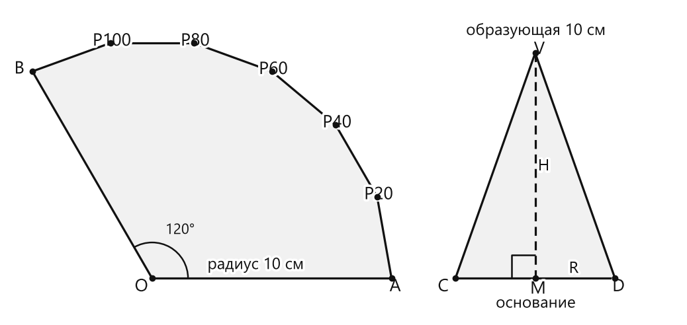
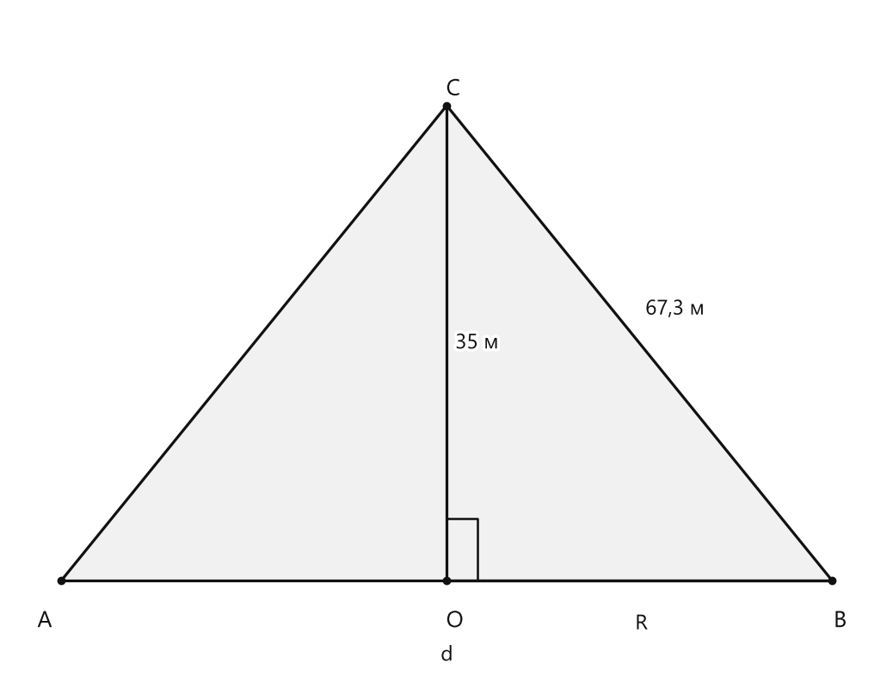

# Занятие 36. Моделирование

**Раздел:** Глава 4. Окружность  
**Параграф учебника:** §36. Моделирование  
**Страницы:** 202–202

## Цели занятия

К концу занятия ученик умеет:

- объяснять, как из плоской фигуры получить объёмное тело;
- находить радиус цилиндра по длине окружности его основания;
- вычислять площадь полной поверхности цилиндра;
- находить радиус и высоту конуса по модели из сектора;
- вычислять объём конуса;
- составлять математическую модель реального объекта.

Выбери блок своего уровня:

- **1–2 балла** — понять идею моделирования и выполнить расчёты по готовой формуле;
- **3–4 балла** — решить задания с цилиндром и конусом;
- **5–6 баллов** — объяснить связь модели с реальным предметом;
- **7–8 баллов** — самостоятельно составить план решения;
- **9–10 баллов** — проверить расчёт экспериментально и оценить погрешность.

## Теория к занятию

### 1. Что такое моделирование

#### Простыми словами

Моделирование — это когда настоящий объект заменяют более простой моделью, чтобы его было удобно изучать и измерять.

Например, настоящий курган трудно разрезать и измерить изнутри. Поэтому его можно представить как конус. Бумажный прямоугольник можно свернуть в цилиндр, а сектор круга — в конус. Плоский лист превращается в объёмное тело — геометрия решила немного поиграть в конструктор.

#### Факт

Плоскую фигуру можно преобразовать в объёмное тело:

- прямоугольную полоску — в цилиндр;
- сектор круга — в конус.

#### Правила

- Сначала выясни, какая сторона или линия бумажной фигуры станет образующей или окружностью основания.
- Все измерения должны иметь одинаковые единицы.
- Если модель приблизительная, результат тоже будет приближённым.
- Экспериментальное значение может немного отличаться от вычисленного: скотч, неточный сгиб и сахар — команда с характером.

#### Ловушки

- Не перепутай радиус с диаметром.
- Не считай сторону прямоугольника радиусом без проверки.
- Не забывай, что у цилиндра два основания.
- Не выдавай экспериментальное измерение за абсолютно точное.

---

### 2. Площадь круга

#### Простыми словами

Площадь круга зависит от радиуса. Причём радиус входит в формулу два раза: он возводится в квадрат.

Например, если радиус увеличить в два раза, площадь увеличится в четыре раза:

$$2R \cdot 2R = 4R^2.$$

Поэтому в формуле стоит $R^2$, а не $2R$.

#### Формула

$$S = \pi R^2$$

Здесь:

- $S$ — площадь круга;
- $R$ — радиус круга;
- $\pi \approx 3,14$.

#### Когда применять

Формулу применяют, если нужно найти площадь основания цилиндра или конуса, когда известен радиус основания.

#### Правила

- Сначала возведи радиус в квадрат.
- Затем умножь результат на $\pi$.
- Если нужно найти площадь двух оснований, умножь площадь одного круга на $2$.

#### Ловушки

- $R^2$ — это $R \cdot R$, а не $R \cdot 2$.
- Диаметр в формулу подставлять нельзя: сначала найди радиус.
- Единица площади будет квадратной: $\text{см}^2$, $\text{м}^2$.

---

### 3. Цилиндр из прямоугольной полоски

#### Простыми словами

Представь, что прямоугольную полоску свернули и соединили её короткие края. Полоска образовала боковую поверхность цилиндра.

Для полоски размером $10 \times 20$ см удобно считать, что:

- сторона длиной $10$ см стала высотой цилиндра;
- сторона длиной $20$ см обернулась вокруг основания и стала длиной окружности основания.

Длина окружности основания равна $20$ см. Используем формулу:

$$2\pi R = 20.$$

Из этого равенства найдём радиус основания.

#### Формулы

Площадь одного основания:

$$S = \pi R^2.$$

Площадь боковой поверхности модели равна площади прямоугольной полоски:

$$S_{\text{бок}} = 10 \cdot 20.$$

Площадь полной поверхности цилиндра:

$$S_{\text{полн}} = S_{\text{бок}} + 2S.$$

#### Алгоритм

1. Определи, какая сторона полоски стала длиной окружности.
2. Составь уравнение $2\pi R = l$.
3. Найди радиус $R$.
4. Найди площадь одного основания: $S = \pi R^2$.
5. Найди площадь боковой поверхности.
6. Прибавь площади двух оснований.

#### Ловушки

- Если свернуть полоску другой стороной, высота и длина окружности поменяются местами.
- Полная поверхность включает боковую поверхность и два основания.
- Лента бумаги — это боковая поверхность, а не одно основание.
- Если забыть основания, получится площадь только «стенки» цилиндра. Цилиндр без крышек — это уже геометрический стакан.

---

### 4. Конус из сектора круга

#### Простыми словами

Сектор круга можно свернуть в конус. При этом:

- радиус исходного круга становится образующей конуса;
- дуга сектора становится окружностью основания конуса.

В нашем случае радиус исходного круга равен $10$ см, а угол сектора равен $120^\circ$.

Полный круг имеет угол $360^\circ$. Поэтому дуга сектора составляет:

$$\frac{120^\circ}{360^\circ}=\frac13$$

длины всей окружности.

Длина дуги сектора равна:

$$l = \frac{120^\circ}{360^\circ}\cdot 2\pi\cdot 10.$$

Эта дуга после сворачивания становится длиной окружности основания конуса.

<!--geo-figure-spec
{
  "needed": true,
  "kind": "plane",
  "caption": "Сектор круга и осевое сечение конуса",
  "equal": true,
  "axis": false,
  "xlim": [
    -6,
    22
  ],
  "ylim": [
    -1.6,
    11.3
  ],
  "points": {
    "O": [
      0,
      0
    ],
    "A": [
      10,
      0
    ],
    "P20": [
      9.396926,
      3.420201
    ],
    "P40": [
      7.660444,
      6.427876
    ],
    "P60": [
      5,
      8.660254
    ],
    "P80": [
      1.736482,
      9.848078
    ],
    "P100": [
      -1.736482,
      9.848078
    ],
    "B": [
      -5,
      8.660254
    ],
    "V": [
      16,
      9.42809
    ],
    "C": [
      12.666667,
      0
    ],
    "D": [
      19.333333,
      0
    ],
    "M": [
      16,
      0
    ]
  },
  "segments": [
    [
      "O",
      "A"
    ],
    [
      "O",
      "B"
    ],
    [
      "A",
      "P20"
    ],
    [
      "P20",
      "P40"
    ],
    [
      "P40",
      "P60"
    ],
    [
      "P60",
      "P80"
    ],
    [
      "P80",
      "P100"
    ],
    [
      "P100",
      "B"
    ],
    [
      "V",
      "C"
    ],
    [
      "V",
      "D"
    ],
    [
      "C",
      "D"
    ],
    {
      "points": [
        "V",
        "M"
      ],
      "dashed": true,
      "label": "",
      "t": 0.5
    }
  ],
  "polygons": [
    {
      "vertices": [
        "O",
        "A",
        "P20",
        "P40",
        "P60",
        "P80",
        "P100",
        "B"
      ],
      "fill": 0.06
    },
    {
      "vertices": [
        "V",
        "C",
        "D"
      ],
      "fill": 0.06
    }
  ],
  "circles": [],
  "labels": {
    "O": {
      "dx": -0.45,
      "dy": -0.35
    },
    "A": {
      "dx": 0.15,
      "dy": -0.35
    },
    "B": {
      "dx": -0.55,
      "dy": 0.1
    },
    "V": {
      "dx": 0.18,
      "dy": 0.15
    },
    "C": {
      "dx": -0.5,
      "dy": -0.35
    },
    "D": {
      "dx": 0.15,
      "dy": -0.35
    },
    "M": {
      "dx": 0.12,
      "dy": -0.45
    }
  },
  "right_angles": [
    {
      "vertex": "M",
      "from": "V",
      "to": "C"
    }
  ],
  "angle_marks": [
    {
      "vertex": "O",
      "from": "A",
      "to": "B",
      "text": "120°",
      "radius": 1.5
    }
  ],
  "texts": [
    {
      "xy": [
        4.3,
        0.55
      ],
      "text": "радиус 10 см"
    },
    {
      "xy": [
        16,
        10.35
      ],
      "text": "образующая 10 см"
    },
    {
      "xy": [
        16,
        -1.05
      ],
      "text": "основание"
    },
    {
      "xy": [
        17.6,
        0.4
      ],
      "text": "R"
    },
    {
      "xy": [
        16.35,
        4.7
      ],
      "text": "H"
    }
  ]
}
-->

*Сектор круга и осевое сечение конуса*

#### Формулы

Объём конуса:

$$V = \frac{1}{3}S_{осн} \cdot H = \frac{1}{3}\pi R^2 \cdot H$$

Здесь:

- $V$ — объём конуса;
- $S_{осн}$ — площадь основания;
- $R$ — радиус основания;
- $H$ — высота конуса.

#### Алгоритм

1. Найди длину дуги сектора.
2. Приравняй длину дуги длине окружности основания конуса.
3. Найди радиус основания $R$.
4. Используй прямоугольный треугольник внутри конуса, чтобы найти высоту $H$.
5. Найди площадь основания.
6. Подставь значения в формулу объёма.
7. Сравни вычисленный объём с объёмом сахара по делениям цилиндрического стакана.

#### Ловушки

- Радиус исходного круга — это не радиус основания конуса.
- При сворачивании сектора длина дуги становится длиной окружности основания.
- В формуле объёма есть множитель $\frac13$.
- $1$ мл $= 1$ см$^3$, поэтому значения объёма численно совпадают.
- Не перепутай образующую с высотой: образующая идёт по боковой поверхности, а высота перпендикулярна основанию.

---

### 5. Проверка модели экспериментом

#### Простыми словами

Одну и ту же величину можно получить двумя способами:

1. вычислить по формуле;
2. измерить с помощью модели и стакана с делениями.

Если значения близки, модель работает хорошо. Если они немного различаются, это нормально. Бумага может быть согнута не идеально, края могут быть соединены с небольшой щелью, а показание стакана тоже считывается не до последней крупинки.

#### Правила

- Вычисленный объём записывай в кубических сантиметрах.
- Объём сахара по шкале стакана записывай в миллилитрах.
- Для сравнения используй равенство $1$ мл $= 1$ см$^3$.
- Небольшое расхождение объясняется неточностью изготовления и измерения.

#### Ловушки

- Не сравнивай $см^3$ и мл без указания их равенства.
- Не округляй слишком рано.
- Если сахар насыпан не доверху, экспериментальный результат будет меньше настоящего объёма конуса.
- Разность результатов не всегда означает ошибку в формуле: модель и измерение тоже имеют погрешность.

---

## Сводка формул «выучить наизусть»

$$S = \pi R^2$$

$$V = \frac{1}{3}S_{осн} \cdot H = \frac{1}{3}\pi R^2 \cdot H$$

$$2\pi R = l$$

Для прямоугольного треугольника модели конуса:

$$H^2 + R^2 = l^2.$$

Здесь $l$ — образующая конуса.

## Правила, которые нельзя путать

- Радиус — половина диаметра: $d = 2R$.
- Длина дуги сектора при сворачивании становится длиной окружности основания конуса.
- Радиус исходного круга и радиус основания конуса могут быть разными.
- Полная поверхность цилиндра состоит из боковой поверхности и двух оснований.
- Объём конуса равен одной трети произведения площади основания на высоту.
- $1$ мл $= 1$ см$^3$.

## Разбор ключевых заданий

### Р1. Модель цилиндра из полоски бумаги

#### Условие

Прямоугольная полоска бумаги имеет размеры $10 \times 20$ см. Её сворачивают так, что сторона длиной $10$ см становится высотой цилиндра, а сторона длиной $20$ см — длиной окружности основания. Найдите примерный радиус основания цилиндра и приближённую площадь полной поверхности цилиндра. Используйте $\pi \approx 3,14$.

#### Решение

Сторона длиной $20$ см стала длиной окружности основания.

Значит, длина окружности равна $20$ см.

Составим уравнение:

$$2\pi R = 20.$$

Подставим $\pi \approx 3,14$:

$$2\cdot 3,14\cdot R = 20.$$

Выполним умножение:

$$6,28R = 20.$$

Разделим обе части уравнения на $6,28$:

$$R = \frac{20}{6,28}.$$

Вычислим приближённое значение:

$$R \approx 3,18\text{ см}.$$

Теперь найдём площадь одного основания цилиндра:

$$S = \pi R^2.$$

Подставим найденный радиус:

$$S \approx 3,14\cdot 3,18^2.$$

Сначала возведём $3,18$ в квадрат:

$$3,18^2 = 10,1124.$$

Теперь умножим на $3,14$:

$$S \approx 3,14\cdot 10,1124.$$

$$S \approx 31,75\text{ см}^2.$$

Площадь боковой поверхности равна площади исходной прямоугольной полоски:

$$S_{\text{бок}} = 10\cdot 20.$$

$$S_{\text{бок}} = 200\text{ см}^2.$$

У цилиндра два одинаковых основания. Найдём их общую площадь:

$$S_{\text{осн}} = 2\cdot 31,75.$$

$$S_{\text{осн}} = 63,5\text{ см}^2.$$

Сложим площадь боковой поверхности и площадь двух оснований:

$$S_{\text{полн}} = 200 + 63,5.$$

$$S_{\text{полн}} \approx 263,5\text{ см}^2.$$

Здесь обычно забывают два основания. Они никуда не исчезли при сворачивании — просто сначала были отдельными кругами.

**Ответ:** $R \approx 3,18$ см; $S_{\text{полн}} \approx 263,5\text{ см}^2$.

---

### Р2. Радиус и высота конуса из сектора

#### Условие

Из круга радиусом $10$ см вырезали сектор с центральным углом $120^\circ$. Сектор свернули в конус. Найдите примерный радиус основания $R$ и высоту $H$ конуса.

#### Решение

При сворачивании сектора радиус исходного круга становится образующей конуса.

Поэтому:

$$l = 10\text{ см}.$$

Теперь найдём длину дуги сектора.

Сектор имеет угол $120^\circ$, а полный круг — $360^\circ$. Значит, дуга сектора составляет $\frac13$ длины полной окружности радиуса $10$ см:

$$L = \frac{120^\circ}{360^\circ}\cdot 2\pi\cdot 10.$$

Сократим дробь:

$$L = \frac13\cdot 20\pi.$$

$$L = \frac{20\pi}{3}.$$

После сворачивания эта дуга становится длиной окружности основания конуса. Поэтому:

$$2\pi R = \frac{20\pi}{3}.$$

Разделим обе части на $2\pi$:

$$R = \frac{\frac{20\pi}{3}}{2\pi}.$$

Сократим $\pi$:

$$R = \frac{20}{3\cdot 2}.$$

$$R = \frac{20}{6}.$$

$$R = \frac{10}{3}\text{ см}.$$

Вычислим приближённое значение:

$$R \approx 3,33\text{ см}.$$

Чтобы найти высоту конуса, рассмотрим прямоугольный треугольник, у которого:

- гипотенуза — образующая $l$;
- один катет — радиус основания $R$;
- второй катет — высота $H$.

По теореме Пифагора:

$$H^2 + R^2 = l^2.$$

Выразим $H^2$:

$$H^2 = l^2 - R^2.$$

Подставим значения $l=10$ и $R=\frac{10}{3}$:

$$H^2 = 10^2 - \left(\frac{10}{3}\right)^2.$$

Возведём числа в квадрат:

$$H^2 = 100 - \frac{100}{9}.$$

Представим число $100$ в виде дроби со знаменателем $9$:

$$H^2 = \frac{900}{9} - \frac{100}{9}.$$

Вычтем дроби:

$$H^2 = \frac{800}{9}.$$

Извлечём квадратный корень:

$$H = \sqrt{\frac{800}{9}}.$$

$$H = \frac{\sqrt{800}}{3}.$$

Так как $800=400\cdot 2$, получаем:

$$H = \frac{20\sqrt2}{3}\text{ см}.$$

Приближённо:

$$H \approx 9,43\text{ см}.$$

**Ответ:** $R \approx 3,33$ см; $H \approx 9,43$ см.

---

### Р3. Объём конуса из сектора

#### Условие

Для конуса из задания Р2 радиус основания равен $R=\frac{10}{3}$ см, а высота равна $H=\frac{20\sqrt2}{3}$ см. Найдите объём конуса. Используйте $\pi \approx 3,14$.

#### Решение

Используем формулу объёма конуса:

$$V = \frac13\pi R^2H.$$

Подставим значения радиуса и высоты:

$$V = \frac13\cdot 3,14\cdot \left(\frac{10}{3}\right)^2\cdot \frac{20\sqrt2}{3}.$$

Сначала возведём радиус в квадрат:

$$\left(\frac{10}{3}\right)^2 = \frac{100}{9}.$$

Тогда:

$$V = \frac13\cdot 3,14\cdot \frac{100}{9}\cdot \frac{20\sqrt2}{3}.$$

Для приближённого вычисления найдём сначала высоту:

$$\sqrt2 \approx 1,414.$$

$$H \approx \frac{20\cdot 1,414}{3}.$$

$$H \approx 9,43\text{ см}.$$

Радиус также запишем приближённо:

$$R=\frac{10}{3}\approx 3,33\text{ см}.$$

Подставим приближённые значения в формулу:

$$V \approx \frac13\cdot 3,14\cdot 3,33^2\cdot 9,43.$$

Возведём радиус в квадрат:

$$3,33^2 \approx 11,09.$$

Теперь вычислим объём:

$$V \approx \frac13\cdot 3,14\cdot 11,09\cdot 9,43.$$

$$V \approx 109,5\text{ см}^3.$$

Если пересыпать сахар из такого конуса в цилиндрический стакан, шкала должна показать примерно $109$–$110$ мл.

**Ответ:** $V \approx 109,5\text{ см}^3$, или примерно $109,5$ мл.

---

### Р4. Сравнение объёма по формуле и по измерению

#### Условие

Объём конуса, вычисленный по формуле, равен примерно $109,5\text{ см}^3$. После пересыпания сахара в цилиндрический стакан по шкале получили $108$ мл. Сравните результаты.

#### Решение

Переведём миллилитры в кубические сантиметры.

Используем равенство:

$$1\text{ мл}=1\text{ см}^3.$$

Поэтому:

$$108\text{ мл}=108\text{ см}^3.$$

Вычисленный объём равен:

$$V_{\text{выч}} \approx 109,5\text{ см}^3.$$

Экспериментальный объём равен:

$$V_{\text{эксп}} = 108\text{ см}^3.$$

Найдём разность результатов:

$$109,5 - 108 = 1,5\text{ см}^3.$$

Чтобы оценить эту разницу в процентах, разделим разность на вычисленный объём и умножим на $100\%$:

$$\frac{1,5}{109,5}\cdot 100\% \approx 1,37\%.$$

Разница небольшая, поэтому результаты близки.

Такое расхождение могло появиться из-за толщины бумаги, неточного склеивания сектора и погрешности отсчёта по шкале. Модель не обязана работать с точностью космической станции.

**Ответ:** $108\text{ мл}=108\text{ см}^3$; результаты близки, разница составляет примерно $1,5\text{ см}^3$.

---

### Р5. Модель кургана

#### Условие

Курган имеет форму конуса. Его высота равна $35$ м, а длина спуска по прямой, то есть образующая конуса, равна $67,3$ м. Определите диаметр основания кургана.

<!--geo-figure-spec
{
  "needed": true,
  "kind": "plane",
  "caption": "Осевое сечение кургана",
  "equal": false,
  "axis": false,
  "xlim": [
    -65,
    65
  ],
  "ylim": [
    -8,
    42
  ],
  "points": {
    "A": [
      -57.483,
      0
    ],
    "B": [
      57.483,
      0
    ],
    "C": [
      0,
      35
    ],
    "O": [
      0,
      0
    ]
  },
  "segments": [
    [
      "A",
      "B"
    ],
    [
      "A",
      "C"
    ],
    [
      "B",
      "C"
    ],
    [
      "C",
      "O"
    ],
    [
      "O",
      "B"
    ]
  ],
  "polygons": [
    {
      "vertices": [
        "A",
        "B",
        "C"
      ],
      "fill": 0.06
    }
  ],
  "circles": [],
  "labels": {
    "A": {
      "dx": -2.5,
      "dy": -3
    },
    "B": {
      "dx": 1.2,
      "dy": -3
    },
    "C": {
      "dx": 1,
      "dy": 1.2
    },
    "O": {
      "dx": 1.2,
      "dy": -3
    }
  },
  "right_angles": [
    {
      "vertex": "O",
      "from": "C",
      "to": "B"
    }
  ],
  "angle_marks": [],
  "texts": [
    {
      "xy": [
        4.5,
        17.5
      ],
      "text": "35 м"
    },
    {
      "xy": [
        34,
        20
      ],
      "text": "67,3 м"
    },
    {
      "xy": [
        29,
        -3.2
      ],
      "text": "R"
    },
    {
      "xy": [
        0,
        -5.5
      ],
      "text": "d"
    }
  ]
}
-->

*Осевое сечение кургана*

#### Решение

Представим конус в разрезе через его вершину и центр основания.

Получится прямоугольный треугольник:

- гипотенуза — образующая конуса, $67,3$ м;
- один катет — высота конуса, $35$ м;
- второй катет — радиус основания, $R$.

Здесь важно не перепутать: длина спуска — это не радиус, а наклонная сторона треугольника.

По теореме Пифагора:

$$R^2 + 35^2 = 67,3^2.$$

Выразим $R^2$:

$$R^2 = 67,3^2 - 35^2.$$

Вычислим квадраты:

$$67,3^2 = 4529,29.$$

$$35^2 = 1225.$$

Подставим значения:

$$R^2 = 4529,29 - 1225.$$

$$R^2 = 3304,29.$$

Найдём радиус:

$$R = \sqrt{3304,29}.$$

$$R \approx 57,48\text{ м}.$$

Диаметр в два раза больше радиуса:

$$d = 2R.$$

Подставим найденное значение:

$$d \approx 2\cdot 57,48.$$

$$d \approx 114,96\text{ м}.$$

Округлим до целого метра:

$$d \approx 115\text{ м}.$$

**Ответ:** примерно $115$ м.

## Итог занятия

Моделирование помогает заменить сложный реальный объект знакомой геометрической фигурой. Главное — правильно понять, какой отрезок чему соответствует:

- сторона бумажной полоски — длина окружности или высота;
- дуга сектора — окружность основания конуса;
- наклонный спуск — образующая;
- половина диаметра — радиус.

После этого выбираем нужную формулу и внимательно считаем. Особенно следим за единицами измерения: они любят исчезать из решения так же внезапно, как ручка перед контрольной.

## Практические задания

Выбери свой уровень и решай только этот блок. В блоке должна закрепиться вся тема параграфа. Ответы не приводятся.

### Уровень 1–2 балла

**С1.** Выберите модель, которая имеет форму цилиндра:

1) круглая шайба  
2) консервная банка  
3) мяч  
4) конус мороженого  
5) треугольная призма

**С2.** Выберите модель, которая имеет форму конуса:

1) стакан без ручки  
2) футбольный мяч  
3) дорожный конус  
4) монета  
5) кирпич

**С3.** Прямоугольную полоску бумаги размером $8 \times 24$ см свернули в цилиндр так, что сторона длиной $24$ см стала длиной окружности основания. Какая величина равна высоте цилиндра?

1) $8$ см  
2) $16$ см  
3) $24$ см  
4) $32$ см  
5) $48$ см

**С4.** Для вычисления площади основания цилиндра используют формулу:

1) $S=2\pi R$  
2) $S=\pi R^2$  
3) $S=\pi R$  
4) $S=R^2$  
5) $S=2R^2$

**С5.** Радиус основания цилиндра равен $3$ см. Вычислите площадь его основания, принимая $\pi \approx 3{,}14$.

**С6.** Объём конуса вычисляют по формуле:

1) $V=\pi R^2H$  
2) $V=\frac13\pi RH$  
3) $V=\frac13\pi R^2H$  
4) $V=2\pi R^2H$  
5) $V=\pi R^2+H$

**С7.** Радиус основания конуса равен $3$ см, а высота — $4$ см. Вычислите объём конуса, принимая $\pi \approx 3{,}14$.

**С8.** Из круга радиусом $12$ см вырезали сектор с центральным углом $90^\circ$. Выберите фигуру, которую получают после сворачивания этого сектора и соединения его радиальных сторон:

1) цилиндр  
2) конус  
3) шар  
4) прямоугольный параллелепипед  
5) круг

**С9.** В модели конуса образующая изготовлена из радиуса исходного круга длиной $10$ см. Что обозначает эта длина?

1) высоту конуса  
2) диаметр основания  
3) радиус основания  
4) образующую конуса  
5) длину окружности основания

**С10.** В цилиндрический стакан налили $180$ мл воды. Какой объём воды соответствует этой величине в кубических сантиметрах?

**С11.** При изготовлении модели цилиндра прямоугольную полоску бумаги свернули так, что сторона длиной $18$ см стала окружностью основания. Чему равна длина окружности основания цилиндра?

1) $6$ см  
2) $9$ см  
3) $18$ см  
4) $36$ см  
5) $324$ см

**С12.** Высота модели кургана равна $12$ м, а длина прямого спуска от вершины до края основания — $13$ м. Выберите величину радиуса основания модели, если курган моделируют прямым круговым конусом:

1) $1$ м  
2) $5$ м  
3) $12$ м  
4) $13$ м  
5) $25$ м

**С13.** Какую пространственную фигуру можно получить, свернув прямоугольную полоску бумаги и склеив её противоположные края?  
1) конус 2) цилиндр 3) шар 4) куб 5) призму

**С14.** Какая плоская фигура используется для изготовления боковой поверхности цилиндра в модели?  
1) круг 2) квадрат 3) прямоугольник 4) треугольник 5) трапеция

**С15.** Выберите формулу объёма конуса.  
1) $V=\pi R^2H$  
2) $V=2\pi RH$  
3) $V=\frac{1}{3}\pi R^2H$  
4) $V=\pi R^2$  
5) $V=\frac{1}{3}\pi RH$

**С16.** В модели цилиндра радиус основания равен $3$ см. Вычислите площадь одного основания, используя $\pi\approx3{,}14$.  
1) $9{,}42\text{ см}^2$ 2) $18{,}84\text{ см}^2$ 3) $28{,}26\text{ см}^2$ 4) $6{,}28\text{ см}^2$ 5) $12{,}56\text{ см}^2$

**С17.** Прямоугольную полоску бумаги размером $8\times 15$ см свернули в цилиндр так, что сторона длиной $15$ см стала длиной окружности основания. Какой величины примерно равен радиус основания? Используйте $\pi\approx3{,}14$.  
1) $1{,}2$ см 2) $2{,}4$ см 3) $4{,}8$ см 4) $7{,}5$ см 5) $15$ см

**С18.** В модели конуса образующая равна $10$ см, а сектор, из которого изготовлен конус, имеет радиус $10$ см. Чему равна длина образующей полученного конуса?  
1) $5$ см 2) $10$ см 3) $20$ см 4) $100$ см 5) определить невозможно

**С19.** Радиус основания модели конуса равен $3$ см, высота — $4$ см. Выберите выражение для вычисления его объёма.  
1) $\frac{1}{3}\pi\cdot3\cdot4$  
2) $\frac{1}{3}\pi\cdot3^2\cdot4$  
3) $\pi\cdot3^2\cdot4$  
4) $\frac{1}{3}\pi\cdot4^2\cdot3$  
5) $\pi\cdot3\cdot4$

**С20.** В эксперименте объём сахара, пересыпанного из модели конуса в мерный стакан, составил $75$ мл. Выразите этот объём в кубических сантиметрах.  
1) $0{,}075\text{ см}^3$ 2) $0{,}75\text{ см}^3$ 3) $7{,}5\text{ см}^3$ 4) $75\text{ см}^3$ 5) $750\text{ см}^3$

**С21.** Какая величина модели конуса обозначается буквой $H$ в формуле $V=\frac{1}{3}\pi R^2H$?  
1) радиус основания 2) диаметр основания 3) высота 4) длина окружности основания 5) площадь основания

**С22.** В модели цилиндра радиус основания равен $4$ см. Найдите площадь основания, используя $\pi\approx3{,}14$.  
1) $12{,}56\text{ см}^2$ 2) $25{,}12\text{ см}^2$ 3) $50{,}24\text{ см}^2$ 4) $16\text{ см}^2$ 5) $8\text{ см}^2$

**С23.** Из круга радиусом $12$ см вырезали сектор с центральным углом $90^\circ$. Какую часть полного круга составляет этот сектор?  
1) $\frac14$ 2) $\frac13$ 3) $\frac12$ 4) $\frac34$ 5) $\frac19$

**С24.** Высота модели конуса равна $6$ см, радиус основания — $2$ см. Выберите формулу, по которой можно найти его объём.  
1) $V=\pi\cdot2^2\cdot6$  
2) $V=\frac13\pi\cdot2^2\cdot6$  
3) $V=\frac13\pi\cdot2\cdot6$  
4) $V=\pi\cdot2\cdot6$  
5) $V=\frac13\pi\cdot6^2\cdot2$

**С25.** Выберите геометрическое тело, моделью которого может служить банка цилиндрической формы.

1) конус  
2) цилиндр  
3) шар  
4) призма  
5) пирамида

**С26.** Выберите формулу объёма конуса.

1) $V=\pi R^2H$  
2) $V=2\pi RH$  
3) $V=\dfrac{1}{3}\pi R^2H$  
4) $V=\dfrac{1}{2}\pi RH$  
5) $V=\pi R^2$

**С27.** Прямоугольную полоску бумаги размером $8\text{ см}\times 18\text{ см}$ свернули в цилиндр так, что сторона длиной $18$ см стала длиной окружности основания. Какой примерно радиус основания получился? Используйте $\pi\approx3$.

**С28.** Прямоугольную полоску бумаги размером $10\text{ см}\times 12\text{ см}$ свернули в цилиндр так, что сторона длиной $12$ см стала длиной окружности основания. Чему равна высота модели цилиндра?

1) $4$ см  
2) $10$ см  
3) $12$ см  
4) $22$ см  
5) $36$ см

**С29.** Радиус основания модели цилиндра равен $3$ см, а высота — $10$ см. Найдите площадь одного основания, используя $\pi\approx3,14$.

**С30.** У модели цилиндра радиус основания равен $2$ см, высота — $7$ см. Выберите выражение для площади полной поверхности модели.

1) $3,14\cdot2^2+2\cdot3,14\cdot2\cdot7$  
2) $3,14\cdot2\cdot7$  
3) $2\cdot3,14\cdot2^2+7$  
4) $3,14\cdot2^2\cdot7$  
5) $2\cdot3,14\cdot2\cdot7$

**С31.** Из круга радиусом $9$ см вырезали сектор с центральным углом $120^\circ$. Какую часть полного круга составляет этот сектор?

1) $\dfrac{1}{2}$  
2) $\dfrac{1}{3}$  
3) $\dfrac{1}{4}$  
4) $\dfrac{2}{3}$  
5) $\dfrac{3}{4}$

**С32.** Сектор круга радиусом $6$ см свернули в конус. Радиус основания получившейся модели конуса равен $2$ см, высота — $5$ см. Найдите объём модели, используя $\pi\approx3$.

**С33.** Модель конуса имеет радиус основания $4$ см и высоту $6$ см. Выберите значение её объёма, используя $\pi\approx3$.

1) $24\text{ см}^3$  
2) $48\text{ см}^3$  
3) $72\text{ см}^3$  
4) $96\text{ см}^3$  
5) $288\text{ см}^3$

**С34.** В цилиндрический стакан с делениями налили воду из модели конуса. По шкале стакана объём воды оказался равен $24$ мл. Выразите этот объём в кубических сантиметрах.

**С35.** Для изготовления модели конуса использовали сектор круга радиусом $10$ см. Длина дуги сектора равна $12\pi$ см. Найдите радиус основания получившегося конуса.

**С36.** Курган смоделировали конусом. Его высота равна $12$ м, а длина спуска от вершины до края основания по прямой равна $13$ м. Найдите радиус основания модели кургана.

### Уровень 3–4 балла

**С1.** Прямоугольную полоску бумаги размером $8\text{ см}\times 24\text{ см}$ свернули в цилиндр так, что сторона длиной $24\text{ см}$ стала длиной окружности основания. Определите радиус основания цилиндра. Используйте $\pi\approx3{,}14$.

**С2.** Полоску бумаги размером $10\text{ см}\times31{,}4\text{ см}$ свернули в цилиндр так, что сторона длиной $31{,}4\text{ см}$ образовала окружность основания. Найдите площадь одного основания цилиндра. Используйте $\pi\approx3{,}14$.

**С3.** Из прямоугольной полоски бумаги размером $12\text{ см}\times25{,}12\text{ см}$ изготовили боковую поверхность цилиндра: сторона длиной $25{,}12\text{ см}$ стала длиной окружности основания. Вырезали два круга для оснований. Найдите приближённую площадь полной поверхности цилиндра. Используйте $\pi\approx3{,}14$.

**С4.** Прямоугольный лист бумаги размером $15\text{ см}\times18{,}84\text{ см}$ свернули в цилиндр так, что сторона длиной $18{,}84\text{ см}$ стала длиной окружности основания. Найдите радиус и высоту полученного цилиндра. Используйте $\pi\approx3{,}14$.

**С5.** Из круга радиусом $12\text{ см}$ вырезали сектор с центральным углом $90^\circ$ и свернули его в конус. Образующая конуса равна радиусу исходного круга. Найдите длину окружности основания полученного конуса.

**С6.** Из круга радиусом $12\text{ см}$ вырезали сектор с центральным углом $90^\circ$ и свернули его в конус. Найдите радиус основания конуса. Используйте $\pi\approx3{,}14$.

**С7.** Из круга радиусом $10\text{ см}$ вырезали сектор с центральным углом $144^\circ$ и свернули его в конус. Найдите радиус основания конуса. Используйте $\pi\approx3{,}14$.

**С8.** Сектор круга радиусом $10\text{ см}$ и центральным углом $120^\circ$ свернули в конус. Радиус основания конуса равен $10/3\text{ см}$. Найдите площадь основания конуса. Используйте $\pi\approx3{,}14$.

**С9.** Модель конуса имеет радиус основания $3\text{ см}$ и высоту $4\text{ см}$. Найдите её объём. Используйте формулу $V=\frac13\pi R^2H$ и значение $\pi\approx3{,}14$.

**С10.** Воронка имеет форму конуса с радиусом основания $6\text{ см}$ и высотой $8\text{ см}. Найдите её объём в кубических сантиметрах. Используйте $\pi\approx3{,}14$.

**С11.** Курган смоделировали конусом. Его высота равна $12\text{ м}$, а длина прямого спуска от вершины до края основания равна $13\text{ м}$. Найдите диаметр основания кургана.

**С12.** Для изготовления модели конуса использовали сектор круга радиусом $15\text{ см}$ и центральным углом $144^\circ$. Высота полученного конуса равна $9\text{ см}$. Найдите объём модели. Используйте формулу $V=\frac13\pi R^2H$ и значение $\pi\approx3{,}14$.

**С13.** Прямоугольный лист бумаги размером $12 \times 31{,}4$ см свернули в цилиндр так, что сторона длиной $31{,}4$ см стала длиной окружности основания. Используя $\pi \approx 3{,}14$, определите радиус основания цилиндра и его высоту.

**С14.** Из прямоугольной полоски бумаги размером $10 \times 25{,}12$ см изготовили цилиндр, соединив стороны длиной $25{,}12$ см. Найдите площадь одного основания цилиндра, если $\pi \approx 3{,}14$.

**С15.** Модель цилиндрического бака имеет радиус основания $4$ см и высоту $15$ см. Вычислите объём модели по формуле
$$V=\pi R^2H,$$
используя $\pi \approx 3{,}14$.

**С16.** Цилиндрическую ёмкость изготовили из бумаги. Радиус её основания равен $5$ см, а высота — $12$ см. Найдите площадь боковой поверхности модели, равную площади прямоугольной развертки. Используйте $\pi \approx 3{,}14$.

**С17.** Для изготовления модели цилиндра использовали прямоугольный лист длиной $18{,}84$ см и шириной $9$ см. Длина листа стала длиной окружности основания цилиндра. Определите радиус основания модели, используя $\pi \approx 3{,}14$.

**С18.** Из круга радиусом $12$ см вырезали сектор с центральным углом $90^\circ$. Получившийся сектор свернули в конус. Определите длину дуги сектора и длину окружности основания конуса, если $\pi \approx 3{,}14$.

**С19.** Модель конуса имеет радиус основания $3$ см и высоту $8$ см. Найдите её объём по формуле
$$V=\frac13\pi R^2H,$$
используя $\pi \approx 3{,}14$.

**С20.** При изготовлении модели конуса сектор круга свернули так, что радиус основания получившегося конуса равен $4$ см, а его высота — $9$ см. Вычислите объём модели, используя $\pi \approx 3{,}14$.

**С21.** Вершина макета конусообразной насыпи находится на высоте $6$ м над землёй, а радиус её круглого основания равен $4$ м. Определите объём насыпи, считая её конусом. Используйте $\pi \approx 3{,}14$.

**С22.** Для сравнения объёмов изготовили модели конуса и цилиндра с одинаковыми радиусами оснований $3$ см и одинаковыми высотами $10$ см. Найдите объём каждой модели, используя $\pi \approx 3{,}14$, и определите, во сколько раз объём цилиндра больше объёма конуса.

**С23.** Коническую воронку для сыпучих материалов моделируют конусом с радиусом основания $6$ см и высотой $10$ см. Найдите вместимость воронки в кубических сантиметрах, используя формулу
$$V=\frac13\pi R^2H$$
и значение $\pi \approx 3{,}14$.

**С24.** Курган моделируют прямым круговым конусом. Его высота равна $12$ м, а длина спуска от вершины до края основания — $13$ м. Определите радиус круглого основания кургана.

**С25.** Прямоугольный лист бумаги размером $12 \times 25$ см свернули в цилиндр так, что сторона длиной $25$ см стала длиной окружности основания. Используя $\pi \approx 3{,}14$, определите радиус основания цилиндра.

**С26.** Полоску бумаги размером $10 \times 18$ см свернули в цилиндр так, что сторона длиной $18$ см стала длиной окружности основания, а сторона длиной $10$ см — высотой цилиндра. Найдите площадь одного основания цилиндра, используя $\pi \approx 3{,}14$.

**С27.** Из прямоугольного листа размером $8 \times 20$ см изготовили боковую поверхность цилиндра: сторона длиной $20$ см стала длиной окружности основания, а сторона длиной $8$ см — высотой цилиндра. К цилиндру прикрепили два круглых основания. Найдите приближённую площадь полной поверхности цилиндра, используя $\pi \approx 3{,}14$.

**С28.** Круг радиусом $12$ см разделили на $4$ равных сектора. Один сектор свернули в конус. Длина дуги сектора стала длиной окружности основания конуса. Определите радиус основания конуса, используя $\pi \approx 3{,}14$.

**С29.** Из круга радиусом $15$ см вырезали сектор с центральным углом $120^\circ$. Длину дуги сектора приняли за длину окружности основания конуса. Найдите радиус основания конуса, используя $\pi \approx 3{,}14$.

**С30.** Конусообразную воронку моделируют конусом с радиусом основания $4$ см и высотой $9$ см. Найдите объём воронки, используя $\pi \approx 3{,}14$.

**С31.** Бумажный стакан моделируют цилиндром с радиусом основания $3$ см и высотой $10$ см. Найдите объём стакана, используя $\pi \approx 3{,}14$.

**С32.** Ёмкость для хранения зерна моделируют конусом. Радиус основания модели равен $6$ см, высота — $8$ см. Найдите объём модели, используя $\pi \approx 3{,}14$.

**С33.** Цилиндрическую клумбу моделируют цилиндром радиусом основания $5$ м и высотой $0{,}4$ м. Найдите площадь одного основания клумбы, используя $\pi \approx 3{,}14$.

**С34.** Курган моделируют прямым круговым конусом. Его высота равна $12$ м, а длина спуска от вершины до края основания — $13$ м. Найдите радиус основания кургана.

**С35.** Игрушечную пирамидальную горку моделируют конусом с радиусом основания $5$ м и высотой $12$ м. Найдите длину спуска по прямой от вершины до края основания.

**С36.** Коническую насыпь моделируют конусом с радиусом основания $3$ м и высотой $4$ м. Найдите объём насыпи, используя $\pi \approx 3{,}14$.

### Уровень 5–6 баллов

**С1.** Прямоугольную полоску бумаги размером $12 \times 25$ см свернули в цилиндр так, что сторона длиной $25$ см стала длиной окружности основания. Используя $\pi \approx 3{,}14$, определите радиус основания цилиндра.

**С2.** Прямоугольную полоску бумаги размером $10 \times 20$ см свернули в цилиндр так, что сторона длиной $20$ см стала длиной окружности основания, а сторона длиной $10$ см — высотой цилиндра. Найдите приближённую площадь полной поверхности цилиндра, используя $\pi \approx 3{,}14$.

**С3.** Из картона изготовили цилиндрическую коробку радиусом основания $4$ см и высотой $12$ см. Найдите объём коробки по формуле $V=S_{осн}\cdot H$, используя $\pi \approx 3{,}14$.

**С4.** Для изготовления цилиндрического стакана используют прямоугольный лист бумаги длиной $31{,}4$ см и шириной $8$ см. Длина листа становится длиной окружности основания стакана. Определите радиус основания и высоту стакана, используя $\pi \approx 3{,}14$.

**С5.** Круг радиусом $12$ см разделили на равные секторы с центральным углом $90^\circ$. Один сектор свернули в боковую поверхность конуса. Найдите длину дуги этого сектора, используя $\pi \approx 3{,}14$.

**С6.** Сектор круга радиусом $15$ см имеет центральный угол $120^\circ$. Его свернули в конус. Определите радиус основания конуса, если длина дуги сектора стала длиной окружности основания. Используйте $\pi \approx 3{,}14$.

**С7.** Из сектора круга изготовили конус. Радиус исходного круга равен $10$ см, а радиус основания полученного конуса равен $5$ см. Найдите высоту конуса, если длина исходного радиуса является образующей конуса.

**С8.** Конус имеет радиус основания $6$ см и высоту $9$ см. Найдите его объём по формуле $$V=\frac13\pi R^2H,$$ используя $\pi \approx 3{,}14$.

**С9.** Для макета воронки изготовили конус радиусом основания $4$ см и высотой $15$ см. Вычислите его объём. Сколько кубических сантиметров материала понадобится для заполнения воронки доверху? Используйте $\pi \approx 3{,}14$.

**С10.** Конус с радиусом основания $6$ см и высотой $10$ см полностью заполнили крупой, а затем пересыпали крупу в цилиндрический стакан. Какой объём крупы должен показать стакан? Ответ выразите в миллилитрах, считая, что $1$ мл $=1$ см$^3$. Используйте $\pi \approx 3{,}14$.

**С11.** Для макета горки курган представили в форме конуса с радиусом основания $12$ м и высотой $5$ м. Найдите объём кургана в кубических метрах, используя формулу $$V=\frac13\pi R^2H$$ и значение $\pi \approx 3{,}14$.

**С12.** Имеется цилиндрический сосуд радиусом основания $6$ см и высотой $10$ см. В него перелили содержимое конуса с таким же радиусом основания и высотой $10$ см. Какую часть объёма цилиндра занимает содержимое конуса? Используйте формулы $$V_{\text{цилиндра}}=\pi R^2H$$ и $$V_{\text{конуса}}=\frac13\pi R^2H$$.

**С13.** Прямоугольный лист бумаги размером $12\text{ см}\times 25\text{ см}$ свернули в цилиндр так, что сторона длиной $25\text{ см}$ стала длиной окружности основания. Определите радиус основания цилиндра. Используйте $\pi\approx3{,}14$.

**С14.** Цилиндрическая модель имеет радиус основания $4\text{ см}$ и высоту $15\text{ см}$. Найдите площадь одного основания и объём модели. Используйте $\pi\approx3{,}14$.

**С15.** Из прямоугольного листа бумаги сделали боковую поверхность цилиндра. Длина листа, ставшая длиной окружности основания, равна $18{,}84\text{ см}$, а ширина равна $10\text{ см}$. Найдите радиус основания и площадь полной поверхности цилиндра. Используйте $\pi\approx3{,}14$.

**С16.** Для изготовления модели цилиндра использовали два круглых основания радиусом $5\text{ см}$ и прямоугольную боковую поверхность высотой $12\text{ см}$. Найдите площадь бумаги, необходимой для изготовления всей модели без учёта мест склеивания. Используйте $\pi\approx3{,}14$.

**С17.** Сектор круга радиусом $12\text{ см}$ и центральным углом $90^\circ$ свернули в конус. Длина дуги сектора стала длиной окружности основания конуса. Найдите радиус основания конуса. Используйте $\pi\approx3{,}14$.

**С18.** Из сектора круга радиусом $10\text{ см}$ и центральным углом $144^\circ$ изготовили боковую поверхность конуса. Найдите радиус основания конуса. Используйте $\pi\approx3{,}14$.

**С19.** Модель конуса имеет радиус основания $3\text{ см}$ и высоту $8\text{ см}. Найдите объём модели. Используйте $\pi\approx3{,}14$.

**С20.** Конусообразную воронку изготовили с радиусом основания $6\text{ см}$ и высотой $10\text{ см}. Сколько кубических сантиметров жидкости поместится в воронке, если наполнить её доверху? Используйте $\pi\approx3{,}14$.

**С21.** Высота модели конуса равна $12\text{ см}$, а радиус её основания — $5\text{ см}$. Найдите объём модели и выразите его в миллилитрах, учитывая, что $1\text{ см}^3=1\text{ мл}$. Используйте $\pi\approx3{,}14$.

**С22.** При изготовлении модели конуса из круга радиусом $13\text{ см}$ вырезали сектор, а оставшуюся часть свернули в конус. Радиус основания получившегося конуса равен $5\text{ см}$. Найдите длину дуги использованного сектора и его центральный угол. Используйте $\pi\approx3{,}14$.

**С23.** Для сравнения объёмов изготовили цилиндр и конус с одинаковыми радиусами оснований $4\text{ см}$ и одинаковыми высотами $9\text{ см}$. Найдите объём цилиндра и объём конуса. Во сколько раз объём цилиндра больше объёма конуса? Используйте $\pi\approx3{,}14$.

**С24.** Высота макета кургана, имеющего форму конуса, равна $35\text{ м}$, а длина прямого спуска от вершины до края основания равна $37\text{ м}$. Найдите радиус и диаметр основания макета, считая его осевым сечением равнобедренного треугольника.

**С25.** Прямоугольный лист бумаги размером $12\text{ см}\times 25{,}12\text{ см}$ свернули в цилиндр так, что сторона длиной $25{,}12\text{ см}$ стала длиной окружности основания. Используя $\pi\approx3{,}14$, определите радиус основания цилиндра и его высоту. Найдите объём цилиндра, если считать его моделью стакана.

**С26.** Для изготовления бумажного конуса из круга радиусом $15\text{ см}$ вырезали сектор с центральным углом $144^\circ$. Оставшиеся радиусы сектора соединили, получив боковую поверхность конуса. Определите радиус основания конуса. Если высота конуса равна $9\text{ см}$, найдите его объём, используя $\pi\approx3{,}14$.

**С27.** Курган моделируют конусом. Высота кургана равна $24\text{ м}$, а длина прямого спуска от вершины до края основания равна $26\text{ м}$. Определите радиус и диаметр основания кургана. Считайте, что осевое сечение модели является равнобедренным треугольником.

**С28.** Ёмкость для хранения зерна имеет форму конуса с радиусом основания $3\text{ м}$ и высотой $4\text{ м}$. Найдите её объём в кубических метрах, используя $\pi\approx3{,}14$. Сколько литров зерна вместит такая ёмкость, если $1\text{ м}^3=1000$ л?

**С29.** Бумажную модель конуса изготовили с радиусом основания $6\text{ см}$ и высотой $8\text{ см}$. Затем объём модели проверили с помощью цилиндрического стакана радиусом $4\text{ см}$ и высотой $6\text{ см}$. Найдите объём конуса и объём стакана, используя $\pi\approx3{,}14$. Определите, какой объём больше и на сколько кубических сантиметров.

**С30.** Для макета конической крыши нужно изготовить боковую поверхность конуса. Её разверткой будет сектор круга радиусом $10\text{ см}$, причём радиус основания готового конуса должен быть $4\text{ см}$. Используя $\pi\approx3{,}14$, определите длину дуги сектора и его центральный угол. Затем найдите высоту получившегося конуса.

### Уровень 7–8 баллов

**С1.** Из прямоугольного листа бумаги размером $12\text{ см}\times 25\text{ см}$ свернули цилиндр так, что сторона длиной $25\text{ см}$ стала длиной окружности основания. Определите радиус основания цилиндра. Затем найдите приближённую площадь полной поверхности цилиндра, принимая $\pi\approx3{,}14$. Результат округлите до десятых.

**С2.** Из прямоугольной полоски бумаги размером $8\text{ см}\times 30\text{ см}$ изготовили цилиндр, соединяя стороны длиной $8\text{ см}$. Определите радиус основания и объём цилиндра, если высота цилиндра равна $30\text{ см}$. При вычислениях используйте $\pi\approx3{,}14$.

**С3.** Для упаковки изготовили цилиндрическую коробку радиусом $6\text{ см}$ и высотой $18\text{ см}. Найдите площадь бумаги, необходимой для изготовления боковой поверхности и двух оснований коробки. На соединение и обрезку добавляют ещё $8\%$ найденной площади. Сколько квадратных сантиметров бумаги потребуется? Используйте $\pi\approx3{,}14$.

**С4.** Из круглого листа бумаги радиусом $12\text{ см}$ вырезали сектор с центральным углом $90^\circ$ и свернули его в конус. Определите радиус основания конуса. Затем найдите площадь его основания, принимая $\pi\approx3{,}14$. Обоснуйте, почему длина дуги сектора равна длине окружности основания конуса.

**С5.** Из кругового листа радиусом $15\text{ см}$ вырезали сектор с центральным углом $144^\circ$ и свернули его в конус. Радиус основания получившегося конуса равен $6\text{ см}$. Найдите высоту конуса. Ответ выразите в сантиметрах и округлите до десятых.

**С6.** Коническую воронку изготовили из сектора круга радиусом $13\text{ см}$ с центральным углом $180^\circ$. Найдите радиус основания и высоту воронки, а затем вычислите её объём. Используйте $\pi\approx3{,}14$ и округлите объём до целых кубических сантиметров.

**С7.** Из сектора круга радиусом $10\text{ см}$ изготовили конус с радиусом основания $5\text{ см}$. Определите центральный угол исходного сектора и высоту конуса. При вычислении угла считайте, что длина дуги сектора равна длине окружности основания. Результат для угла выразите в градусах.

**С8.** Для макета палатки в форме конуса использовали сектор круга радиусом $20\text{ см}$ с центральным углом $216^\circ$. Найдите радиус основания и высоту макета. Вычислите объём внутреннего пространства макета, принимая $\pi\approx3{,}14$. Результат округлите до десятых кубического сантиметра.

**С9.** Цилиндрическую ёмкость радиусом $4\text{ см}$ и высотой $15\text{ см}$ полностью заполнили водой. Всю воду перелили в коническую ёмкость с таким же радиусом основания. Определите высоту конуса. Объясните, почему при решении можно приравнять объёмы двух ёмкостей.

**С10.** Макет башни состоит из цилиндра высотой $12\text{ см}$ и радиусом основания $5\text{ см}$, а также установленного на нём конуса с таким же радиусом основания и высотой $8\text{ см}$. Найдите общий объём макета. Какую часть общего объёма составляет объём конуса? Используйте $\pi\approx3{,}14$ и ответ округлите до десятых процентов.

**С11.** Курган имеет форму конуса. Его высота равна $24\text{ м}$, а длина прямого спуска от вершины до края основания равна $26\text{ м}$. Найдите радиус и диаметр основания кургана, а затем вычислите его объём. Используйте $\pi\approx3{,}14$ и округлите объём до целых кубических метров.

**С12.** Для изготовления бумажного колпака требуется сектор круга радиусом $18\text{ см}$. После сворачивания сектора радиус основания колпака должен быть равен $9\text{ см}$. Определите центральный угол сектора, высоту колпака и его объём. Используйте $\pi\approx3{,}14$; высоту и объём округлите до десятых.

**С13.** Из прямоугольного листа картона размером $12\text{ см}\times 31{,}4\text{ см}$ изготовили боковую поверхность цилиндра: стороны длиной $31{,}4$ см соединили скотчем. Считая, что толщиной картона можно пренебречь, определите радиус и высоту цилиндра. Найдите объём цилиндра, используя $\pi\approx3{,}14$.

**С14.** Для изготовления цилиндрической банки без крышки использовали прямоугольный лист жести размером $20\text{ см}\times 25{,}12\text{ см}$ и круг для дна. Длинную сторону листа соединили в окружность основания банки. Определите радиус и высоту банки, а затем площадь жести, использованной для её изготовления. Примите $\pi\approx3{,}14$.

**С15.** Коническую праздничную шапочку изготовили из сектора круга радиусом $15$ см и центральным углом $216^\circ$. После соединения радиусов сектора получился конус. Определите радиус его основания. Найдите высоту конуса и его объём, если $\pi\approx3{,}14$.

**С16.** Из круглой заготовки радиусом $18$ см вырезали сектор с центральным углом $90^\circ$, а затем свернули оставшуюся часть круга в боковую поверхность конуса. Определите длину окружности основания конуса и его радиус. Найдите площадь основания конуса, используя $\pi\approx3{,}14$.

**С17.** Для хранения зерна изготовили модель силоса в форме цилиндра с конической крышей. Радиус цилиндрической части равен $3$ м, её высота — $8$ м, а высота крыши — $2$ м. Определите общий объём модели силоса, считая, что крыша полностью заполнена зерном. Используйте $\pi\approx3{,}14$.

**С18.** Бумажный стаканчик имеет форму конуса. Его диаметр равен $8$ см, а высота — $15$ см. Определите вместимость стаканчика в миллилитрах, если $1\text{ мл}=1\text{ см}^3$ и $\pi\approx3{,}14$. Ответ обоснуйте расчётом объёма конуса.

**С19.** Воронка имеет форму конуса с радиусом основания $6$ см и высотой $8$ см. Её заполнили водой доверху и перелили воду в цилиндрический сосуд с таким же радиусом основания. Определите высоту столба воды в сосуде. Объясните, почему для решения можно приравнять объёмы конуса и цилиндра.

**С20.** Для макета палатки изготовили коническую крышу без основания. Радиус её основания равен $5$ м, а образующая — $13$ м. Определите высоту крыши и объём пространства под ней. При вычислениях используйте теорему Пифагора и $\pi\approx3{,}14$.

**С21.** Круглый бассейн моделируют цилиндром радиусом $4$ м и глубиной $1{,}5$ м. В бассейн налили воду до уровня $1{,}2$ м. Определите объём воды и площадь поверхности воды. Используйте $\pi\approx3{,}14$.

**С22.** Из листа картона вырезали круг радиусом $10$ см и сектор с центральным углом $144^\circ$. Из сектора изготовили боковую поверхность конуса, а круг использовали как его основание. Определите радиус основания конуса и проверьте, можно ли закрыть изготовленным кругом это основание. Приведите вычисления, используя $\pi\approx3{,}14$.

**С23.** Купол небольшого павильона моделируют половиной шара радиусом $6$ м. Для оценки количества воздуха внутри павильона заменили эту модель конусом с таким же радиусом основания и высотой $6$ м. Найдите объём полученной конической модели и сравните его с объёмом цилиндра того же радиуса и высоты. Используйте $\pi\approx3{,}14$.

**С24.** Для перевозки сыпучего материала изготовили контейнер, состоящий из цилиндрической части и конического верха. Радиус контейнера равен $2$ м, высота цилиндрической части — $5$ м, а общая высота контейнера — $8$ м. Определите объём контейнера. Затем найдите, какую долю общего объёма составляет объём конического верха. Ответ представьте в виде несократимой дроби. Используйте $\pi\approx3{,}14$.

### Уровень 9–10 баллов

**С1.** Прямоугольный лист картона размером $12 \times 31{,}4$ см сворачивают в боковую поверхность цилиндра так, что сторона длиной $31{,}4$ см становится длиной окружности основания. Определите радиус основания и высоту полученной модели цилиндра. Найдите площадь одного основания, используя $\pi \approx 3{,}14$.

**С2.** Из круглого листа картона радиусом $15$ см вырезают сектор с центральным углом $144^\circ$, а затем сворачивают его в боковую поверхность конуса. Определите радиус основания конуса. Если высота модели равна $9$ см, вычислите её объём по формуле $V=\frac13\pi R^2H$, принимая $\pi\approx3{,}14$.

**С3.** Курган моделируют конусом. Его высота равна $24$ м, а длина прямого склона от вершины до края основания — $26$ м. Определите диаметр основания модели кургана.

**С4.** Коническую воронку изготавливают из сектора круга радиусом $18$ см. Длина дуги сектора равна $12\pi$ см. Определите центральный угол сектора и радиус основания полученного конуса. Ответ для угла запишите в градусах.

**С5.** Макет палатки имеет форму конуса. Для изготовления боковой поверхности использовали сектор круга радиусом $13$ см с центральным углом $270^\circ$. Высота макета равна $5$ см. Определите радиус основания и объём макета, используя $\pi\approx3{,}14$.

**С6.** Круглую заготовку радиусом $20$ см разделили на два сектора с центральными углами $90^\circ$ и $270^\circ$. Каждый сектор свернули в боковую поверхность отдельного конуса. Сравните радиусы оснований полученных конусов и найдите их сумму.

**С7.** Из прямоугольной полосы бумаги шириной $16$ см и длиной $25{,}12$ см склеивают цилиндрическую модель, соединяя стороны длиной $16$ см. Затем из остатков бумаги вырезают круг для основания модели. Определите радиус основания, площадь этого круга и проверьте, помещается ли вырезанный круг в полосе по ширине.

**С8.** Коническую насыпь моделируют конусом с диаметром основания $14$ м и высотой $9$ м. Для макета используют масштаб $1:150$. Определите радиус основания и высоту макета в сантиметрах, а затем вычислите его объём, принимая $\pi\approx3{,}14$.

**С9.** Вершина конической модели расположена над центром круглого основания. Радиус основания равен $12$ см, а расстояние от вершины до любой точки окружности основания — $20$ см. Определите высоту модели и её объём, используя $\pi\approx3{,}14$.

**С10.** Из сектора круга радиусом $10$ см изготовили конус. После склеивания его радиус основания оказался равен $4$ см. Определите центральный угол исходного сектора. Затем найдите высоту конуса и его объём, принимая $\pi\approx3{,}14$.

**С11.** Для сравнения двух моделей изготовили конус и цилиндр с одинаковым радиусом основания $6$ см и одинаковой высотой $15$ см. Объём конуса вычисляют по формуле $V=\frac13\pi R^2H$, а объём цилиндра — как произведение площади основания на высоту. Во сколько раз объём цилиндра больше объёма конуса? Используйте $\pi\approx3{,}14$.

**С12.** Конический контейнер моделируют из сектора круга радиусом $25$ см. Длина дуги вырезанного сектора составляет $16\pi$ см, а высота полученного конуса равна $15$ см. Определите радиус основания и объём контейнера, используя $\pi\approx3{,}14$.

**С13.** Прямоугольный лист картона размером $12\pi\ \text{см} \times 8\ \text{см}$ свернули в цилиндр так, что сторона длиной $12\pi\ \text{см}$ образовала окружность основания. Края листа совместили без нахлёста.  
1) Определите радиус и высоту полученной цилиндрической модели.  
2) Найдите площадь материала, необходимого для изготовления двух круглых крышек этой модели.  
3) Определите площадь полной поверхности цилиндра вместе с крышками. При вычислениях используйте $\pi \approx 3{,}14$.

**С14.** Из круга радиусом $12\ \text{см}$ вырезали сектор с центральным углом $120^\circ$, а затем свернули оставшуюся плоскую заготовку в конус без нахлёста. Сектор был выбран так, что дуга свернутой заготовки образовала окружность основания конуса.  
1) Определите радиус основания конуса.  
2) Определите высоту конуса.  
3) Вычислите объём полученной модели по формуле
$$V=\frac13\pi R^2H.$$

**С15.** Курган моделируют конусом. Высота кургана равна $24\ \text{м}$, а длина прямого спуска от вершины до края основания равна $26\ \text{м}$. Считайте, что вершина конуса расположена над центром круглого основания.  
1) Определите радиус и диаметр основания кургана.  
2) Найдите площадь основания модели.  
3) Вычислите объём кургана в кубических метрах, используя формулу
$$V=\frac13\pi R^2H.$$

**С16.** Для изготовления воронки используют конусообразную модель с радиусом основания $6\ \text{см}$ и высотой $8\ \text{см}$. Весь сахар из полностью заполненной воронки пересыпают в цилиндрический сосуд с радиусом основания $4\ \text{см}$.  
1) Определите объём сахара в воронке.  
2) До какой высоты поднимется сахар в цилиндрическом сосуде?  
Считайте, что сахар полностью заполняет конус и после пересыпания не изменяет занимаемый объём. Используйте $\pi \approx 3{,}14$.

**С17.** Из круглого листа картона радиусом $15\ \text{см}$ вырезали сектор с центральным углом $72^\circ$. Оставшуюся часть листа использовали как боковую поверхность конической модели, свернув её в конус без нахлёста.  
1) Определите длину дуги оставшейся части листа.  
2) Найдите радиус основания полученного конуса.  
3) Определите высоту конуса и его объём, если радиус листа является образующей конуса.  
При вычислениях используйте $\pi \approx 3{,}14$.

**С18.** Для выставочной модели конусообразного холма задан объём $800\pi\ \text{м}^3$ и радиус круглого основания $10\ \text{м}$. Модель должна быть изготовлена из плотного материала в форме цилиндра с тем же радиусом основания и высотой, равной высоте холма.  
1) Определите высоту конусообразного холма.  
2) Определите объём цилиндрической заготовки.  
3) Какую часть объёма заготовки составит объём модели? Результат представьте в виде несократимой дроби.

## Чек-лист «ученик понял тему»

- Могу повторить определения и формулы параграфа своими словами и по учебнику.
- Решаю типовые задания своего уровня без подсказки.
- Вижу типичную ошибку и могу её объяснить.
