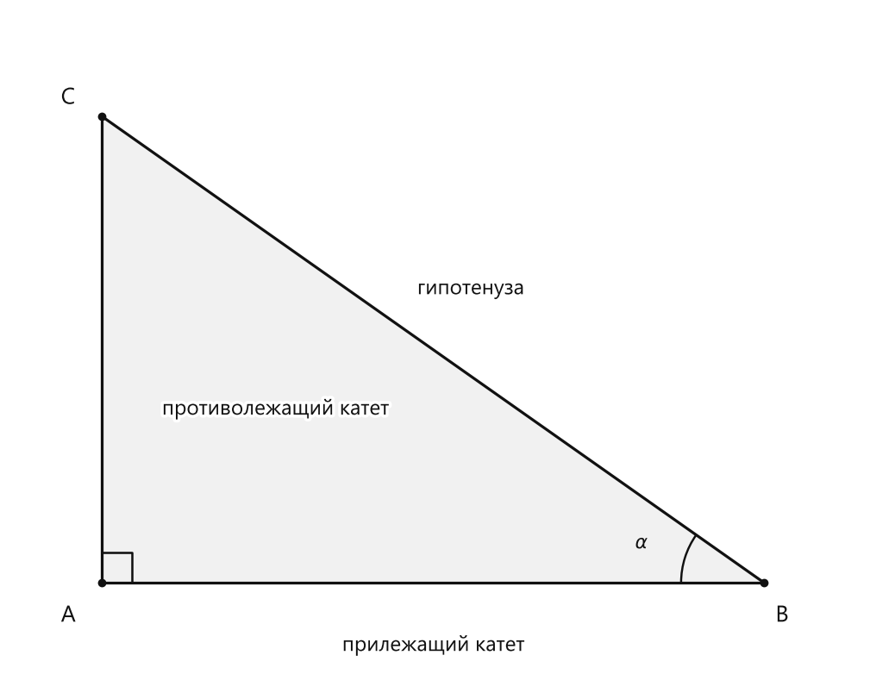
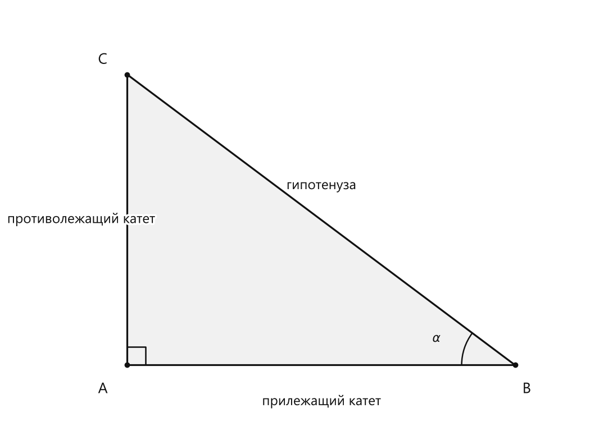

# Занятие 2. Соотношения в прямоугольном треугольнике

**Раздел:** Глава I  
**Параграф учебника:** §2. Соотношения в прямоугольном треугольнике  
**Страницы:** 15–16

## Цели занятия

После занятия ты умеешь:

- находить синус, косинус, тангенс и котангенс острого угла прямоугольного треугольника;
- различать противолежащий и прилежащий катеты;
- использовать значения тригонометрических функций угла $30^\circ$;
- применять основное тригонометрическое тождество;
- находить среднее арифметическое и среднее геометрическое двух чисел.

Выбери блок своего уровня:

- **1–2 балла:** распознать стороны и записать нужное отношение;
- **3–4 балла:** вычислить тригонометрическую функцию по сторонам;
- **5–6 баллов:** использовать значения функций угла $30^\circ$;
- **7–8 баллов:** применять основное тригонометрическое тождество;
- **9–10 баллов:** решать смешанные задачи на соотношения и средние.

## Теория к занятию

### 1. Синус, косинус, тангенс и котангенс

#### Простыми словами

Рассмотрим прямоугольный треугольник и один из его острых углов $\alpha$.

У этого угла есть три важные стороны:

- **противолежащий катет** — катет напротив угла;
- **прилежащий катет** — катет рядом с углом, но не гипотенуза;
- **гипотенуза** — сторона напротив прямого угла. Она всегда самая длинная.

Один и тот же треугольник даёт разные отношения сторон для разных острых углов. Поэтому сначала выбираем угол, а уже потом называем катеты противолежащим и прилежащим.

<!--geo-figure-spec
{
  "needed": true,
  "kind": "plane",
  "caption": "Прямоугольный треугольник $ABC$ с углом $\\alpha$",
  "equal": true,
  "axis": false,
  "xlim": [
    -0.6,
    5.2
  ],
  "ylim": [
    -0.7,
    3.8
  ],
  "points": {
    "A": [
      0,
      0
    ],
    "B": [
      4.4,
      0
    ],
    "C": [
      0,
      3.1
    ]
  },
  "segments": [
    [
      "A",
      "B"
    ],
    [
      "B",
      "C"
    ],
    [
      "C",
      "A"
    ]
  ],
  "polygons": [
    {
      "vertices": [
        "A",
        "B",
        "C"
      ],
      "fill": 0.06
    }
  ],
  "labels": {
    "A": {
      "dx": -0.22,
      "dy": -0.22
    },
    "B": {
      "dx": 0.12,
      "dy": -0.22
    },
    "C": {
      "dx": -0.22,
      "dy": 0.12
    }
  },
  "right_angles": [
    {
      "vertex": "A",
      "from": "B",
      "to": "C"
    }
  ],
  "angle_marks": [
    {
      "vertex": "B",
      "from": "A",
      "to": "C",
      "text": "$\\alpha$",
      "radius": 0.55
    }
  ],
  "texts": [
    {
      "xy": [
        2.2,
        -0.42
      ],
      "text": "прилежащий катет"
    },
    {
      "xy": [
        1.15,
        1.15
      ],
      "text": "противолежащий катет"
    },
    {
      "xy": [
        2.45,
        1.95
      ],
      "text": "гипотенуза"
    }
  ]
}
-->

*Прямоугольный треугольник ABC с углом \alpha*

В этом треугольнике:

- угол $\alpha$ расположен при вершине $B$;
- $AB$ — прилежащий катет;
- $AC$ — противолежащий катет;
- $BC$ — гипотенуза.

Смотри внимательно: гипотенуза определяется не выбранным острым углом, а прямым углом. Она всегда лежит напротив прямого угла.

#### Определения

$$
\sin \alpha = \frac{\text{противолежащий катет}}{\text{гипотенуза}}
$$

$$
\cos \alpha = \frac{\text{прилежащий катет}}{\text{гипотенуза}}
$$

$$
\text{tg } \alpha = \frac{\text{противолежащий катет}}{\text{прилежащий катет}}
$$

$$
\text{ctg } \alpha = \frac{\text{прилежащий катет}}{\text{противолежащий катет}}
$$

#### Формулы

Для угла $\alpha$:

- $\sin \alpha$ — противолежащий катет разделить на гипотенузу;
- $\cos \alpha$ — прилежащий катет разделить на гипотенузу;
- $\text{tg } \alpha$ — противолежащий катет разделить на прилежащий катет;
- $\text{ctg } \alpha$ — прилежащий катет разделить на противолежащий катет.

Удобно действовать по одному плану:

1. Найди выбранный угол $\alpha$.
2. Определи гипотенузу: она лежит напротив прямого угла.
3. Найди катет напротив угла $\alpha$.
4. Найди катет рядом с углом $\alpha$.
5. Подставь стороны в нужную формулу.

#### Правила

1. Сначала найди угол $\alpha$.
2. Определи, какой катет находится напротив него.
3. Определи, какой катет находится рядом с ним.
4. Только после этого выбирай формулу.

#### Ловушки

- Гипотенуза не бывает прилежащим катетом.
- Для синуса в числителе стоит противолежащий катет.
- Для косинуса в числителе стоит прилежащий катет.
- Тангенс и котангенс — перевёрнутые отношения. Перепутал их — формула отправилась в отпуск.
- Если выбрать другой острый угол, прилежащий и противолежащий катеты поменяются местами.

---

### 2. Значения тригонометрических функций угла $30^\circ$

#### Простыми словами

Для угла $30^\circ$ значения основных функций уже известны. Их не нужно каждый раз выводить заново — достаточно правильно выбрать нужную строку.

<!--geo-figure-spec
{
  "needed": true,
  "kind": "plane",
  "caption": "Прямоугольный треугольник $ABC$ с углом $\\alpha$",
  "equal": true,
  "axis": false,
  "xlim": [
    -0.7,
    4.7
  ],
  "ylim": [
    -0.7,
    3.7
  ],
  "points": {
    "A": [
      0,
      0
    ],
    "B": [
      4,
      0
    ],
    "C": [
      0,
      3
    ]
  },
  "segments": [
    [
      "A",
      "B"
    ],
    [
      "B",
      "C"
    ],
    [
      "C",
      "A"
    ]
  ],
  "polygons": [
    {
      "vertices": [
        "A",
        "B",
        "C"
      ],
      "fill": 0.06
    }
  ],
  "labels": {
    "A": {
      "dx": -0.25,
      "dy": -0.25
    },
    "B": {
      "dx": 0.12,
      "dy": -0.25
    },
    "C": {
      "dx": -0.25,
      "dy": 0.15
    }
  },
  "right_angles": [
    {
      "vertex": "A",
      "from": "B",
      "to": "C"
    }
  ],
  "angle_marks": [
    {
      "vertex": "B",
      "from": "A",
      "to": "C",
      "text": "$\\alpha$",
      "radius": 0.55
    }
  ],
  "texts": [
    {
      "xy": [
        2,
        -0.38
      ],
      "text": "прилежащий катет"
    },
    {
      "xy": [
        -0.48,
        1.5
      ],
      "text": "противолежащий катет"
    },
    {
      "xy": [
        2,
        1.85
      ],
      "text": "гипотенуза"
    }
  ]
}
-->

*Прямоугольный треугольник ABC с углом \alpha*

В треугольнике с углом $30^\circ$ противолежащий катет равен $1$, гипотенуза равна $2$, а прилежащий катет равен $\sqrt{3}$.

Поэтому отношения сторон имеют такие значения:

- противолежащий катет к гипотенузе: $\frac{1}{2}$;
- прилежащий катет к гипотенузе: $\frac{\sqrt{3}}{2}$;
- противолежащий катет к прилежащему: $\frac{1}{\sqrt3}=\frac{\sqrt3}{3}$;
- прилежащий катет к противолежащему: $\sqrt3$.

#### Формулы

$$
\sin 30^\circ = \frac{1}{2}
\qquad
\cos 30^\circ = \frac{\sqrt{3}}{2}
$$

$$
\text{tg } 30^\circ = \frac{\sqrt{3}}{3}
\qquad
\text{ctg } 30^\circ = \sqrt{3}
$$

#### Правила

Если в условии дан угол $30^\circ$, можно сразу использовать эти значения.

Например:

$$
\sin 30^\circ = \frac{1}{2}
$$

Сначала определяем функцию, потом берём её значение. Не наоборот: таблица не любит, когда в неё тыкают наугад.

#### Ловушки

- $\cos 30^\circ$ — это $\frac{\sqrt{3}}{2}$, а не $\frac{1}{2}$.
- $\text{tg }30^\circ$ — это $\frac{\sqrt{3}}{3}$.
- $\text{ctg }30^\circ$ — это $\sqrt{3}$.
- Тангенс и котангенс взаимно обратны.
- Нельзя менять местами значения синуса и косинуса только потому, что оба относятся к одному углу.

---

### 3. Основное тригонометрическое тождество

#### Простыми словами

Синус и косинус одного и того же угла связаны постоянным правилом. Если известно одно значение, часто можно найти другое.

Здесь используются обычные действия с дробями, квадратами и квадратными корнями, которые уже знакомы по алгебре 8 класса.

#### Теорема

**ОСНОВНОЕ ТРИГОНОМЕТРИЧЕСКОЕ ТОЖДЕСТВО**

$$
\sin^2 \alpha + \cos^2 \alpha = 1
$$

#### Формулы

Если нужно найти $\cos^2\alpha$:

$$
\cos^2\alpha=1-\sin^2\alpha
$$

Если нужно найти $\sin^2\alpha$:

$$
\sin^2\alpha=1-\cos^2\alpha
$$

Здесь $\sin^2\alpha$ означает $(\sin\alpha)^2$.

#### Правила

1. Запиши основное тригонометрическое тождество.
2. Подставь известное значение.
3. Возведи известную дробь в квадрат.
4. Перенеси известный квадрат в другую часть равенства.
5. Если требуется само значение синуса или косинуса, извлеки квадратный корень.
6. Для острого угла возьми положительное значение.

У синуса и косинуса острого угла значения положительные, поэтому отрицательный корень здесь не подходит.

#### Ловушки

- $\sin^2\alpha$ — это квадрат синуса, а не синус двойного угла.
- Нельзя забывать скобки: $(\frac{3}{5})^2=\frac{9}{25}$.
- После нахождения квадрата не забудь извлечь корень, если спрашивают $\cos\alpha$.
- При извлечении корня учитывай, что угол острый.

---

### 4. Среднее арифметическое и среднее геометрическое

#### Простыми словами

Среднее арифметическое двух чисел — это их сумма, поделённая на $2$.

Среднее геометрическое двух чисел — это квадратный корень из их произведения.

Эти два выражения похожи только внешне. Среднее арифметическое сначала складывает числа, а среднее геометрическое сначала их перемножает. Здесь как раз легко попасть в математическую ловушку: знак «плюс» и знак умножения — не близнецы.

#### Формулы

Среднее арифметическое:

$$
\frac{a+b}{2}
$$

Среднее геометрическое:

$$
\sqrt{ab}
$$

#### Правила

Чтобы найти среднее арифметическое чисел $a$ и $b$:

1. Сложи $a$ и $b$.
2. Раздели сумму на $2$.

Чтобы найти среднее геометрическое чисел $a$ и $b$:

1. Перемножь $a$ и $b$.
2. Извлеки квадратный корень.

#### Ловушки

- В среднем арифметическом сначала складываем, а не перемножаем.
- В среднем геометрическом сначала перемножаем, а не складываем.
- Под корнем должно быть произведение $ab$.
- Для действительного среднего геометрического произведение $ab$ не должно быть отрицательным.

## Сводка формул «выучить наизусть»

$$
\sin \alpha = \frac{\text{противолежащий катет}}{\text{гипотенуза}}
$$

$$
\cos \alpha = \frac{\text{прилежащий катет}}{\text{гипотенуза}}
$$

$$
\text{tg } \alpha = \frac{\text{противолежащий катет}}{\text{прилежащий катет}}
$$

$$
\text{ctg } \alpha = \frac{\text{прилежащий катет}}{\text{противолежащий катет}}
$$

$$
\sin 30^\circ = \frac{1}{2}
\qquad
\cos 30^\circ = \frac{\sqrt{3}}{2}
$$

$$
\text{tg } 30^\circ = \frac{\sqrt{3}}{3}
\qquad
\text{ctg } 30^\circ = \sqrt{3}
$$

$$
\sin^2 \alpha + \cos^2 \alpha = 1
$$

$$
\frac{a+b}{2}
$$

$$
\sqrt{ab}
$$

## Правила, которые нельзя путать

- Противолежащий катет находится напротив выбранного угла.
- Прилежащий катет находится рядом с выбранным углом.
- Гипотенуза лежит напротив прямого угла.
- Синус: противолежащий катет делим на гипотенузу.
- Косинус: прилежащий катет делим на гипотенузу.
- Тангенс: противолежащий катет делим на прилежащий.
- Котангенс: прилежащий катет делим на противолежащий.
- Среднее арифметическое связано со сложением.
- Среднее геометрическое связано с умножением.

## Разбор ключевых заданий

### Р1. Найти синус, косинус, тангенс и котангенс угла по сторонам

**Условие.** В прямоугольном треугольнике $ABC$ угол $A$ прямой, $AB=3$, $AC=4$, $BC=5$. Найдите $\sin B$, $\cos B$, $\text{tg }B$ и $\text{ctg }B$.

**Дано:**

- $\angle A=90^\circ$;
- $AB=3$;
- $AC=4$;
- $BC=5$;
- рассматривается угол $B$.

Сторона напротив прямого угла — $BC$.

Значит, $BC$ — гипотенуза.

Теперь рассматриваем стороны относительно угла $B$:

- $AC$ находится напротив угла $B$, поэтому это противолежащий катет;
- $AB$ находится рядом с углом $B$ и не является гипотенузой, поэтому это прилежащий катет;
- $BC$ — гипотенуза.

Находим синус:

$$
\sin B=\frac{AC}{BC}
$$

$$
\sin B=\frac{4}{5}
$$

Находим косинус:

$$
\cos B=\frac{AB}{BC}
$$

$$
\cos B=\frac{3}{5}
$$

Находим тангенс:

$$
\text{tg }B=\frac{AC}{AB}
$$

$$
\text{tg }B=\frac{4}{3}
$$

Находим котангенс:

$$
\text{ctg }B=\frac{AB}{AC}
$$

$$
\text{ctg }B=\frac{3}{4}
$$

Проверим синус и косинус основным тригонометрическим тождеством:

$$
\sin^2B+\cos^2B=
\left(\frac45\right)^2+\left(\frac35\right)^2
$$

$$
\sin^2B+\cos^2B=
\frac{16}{25}+\frac{9}{25}
$$

$$
\sin^2B+\cos^2B=1
$$

Проверка выполнена. Стороны не перепутались и не устроили маленький геометрический переворот.

**Ответ:**

$$
\sin B=\frac45,\quad
\cos B=\frac35,\quad
\text{tg }B=\frac43,\quad
\text{ctg }B=\frac34
$$

---

### Р2. Использовать значение функций угла $30^\circ$

**Условие.** Найдите значение выражения:

$$
2\sin30^\circ+\cos30^\circ
$$

Подставляем значения синуса и косинуса угла $30^\circ$:

$$
2\sin30^\circ+\cos30^\circ
=
2\cdot\frac12+\frac{\sqrt3}{2}
$$

Сначала выполняем умножение:

$$
2\cdot\frac12=1
$$

Получаем:

$$
1+\frac{\sqrt3}{2}
$$

Приводим число $1$ к знаменателю $2$:

$$
1=\frac22
$$

Теперь складываем дроби с одинаковыми знаменателями:

$$
1+\frac{\sqrt3}{2}
=
\frac22+\frac{\sqrt3}{2}
$$

$$
2\sin30^\circ+\cos30^\circ
=
\frac{2+\sqrt3}{2}
$$

Здесь важно подставить именно значение косинуса во второй член. Синус и косинус смотрят на один угол, но работают по разным формулам.

**Ответ:**

$$
\frac{2+\sqrt3}{2}
$$

---

### Р3. Найти косинус по синусу

**Условие.** Для острого угла $\alpha$ известно, что $\sin\alpha=\frac35$. Найдите $\cos\alpha$.

Записываем основное тригонометрическое тождество:

$$
\sin^2\alpha+\cos^2\alpha=1
$$

Подставляем известное значение синуса:

$$
\left(\frac35\right)^2+\cos^2\alpha=1
$$

Возводим дробь в квадрат:

$$
\frac9{25}+\cos^2\alpha=1
$$

Выражаем квадрат косинуса:

$$
\cos^2\alpha=1-\frac9{25}
$$

Представляем $1$ в виде дроби со знаменателем $25$:

$$
1=\frac{25}{25}
$$

Получаем:

$$
\cos^2\alpha=\frac{25}{25}-\frac9{25}
$$

$$
\cos^2\alpha=\frac{16}{25}
$$

Извлекаем квадратный корень:

$$
\cos\alpha=\sqrt{\frac{16}{25}}
$$

Так как угол $\alpha$ острый, косинус положителен:

$$
\cos\alpha=\frac45
$$

Проверяем результат:

$$
\left(\frac35\right)^2+\left(\frac45\right)^2
=
\frac9{25}+\frac{16}{25}
=
1
$$

**Ответ:**

$$
\frac45
$$

---

### Р4. Найти среднее арифметическое двух чисел

**Условие.** Найдите среднее арифметическое чисел $8$ и $14$.

Используем формулу среднего арифметического:

$$
\frac{a+b}{2}
$$

Подставляем числа $8$ и $14$:

$$
\frac{8+14}{2}
$$

Складываем числа:

$$
8+14=22
$$

Делим результат на $2$:

$$
\frac{22}{2}=11
$$

**Ответ:**

$$
11
$$

---

### Р5. Найти среднее геометрическое двух чисел

**Условие.** Найдите среднее геометрическое чисел $4$ и $25$.

Используем формулу среднего геометрического:

$$
\sqrt{ab}
$$

Подставляем числа:

$$
\sqrt{4\cdot25}
$$

Выполняем умножение под корнем:

$$
4\cdot25=100
$$

Извлекаем квадратный корень:

$$
\sqrt{100}=10
$$

Проверяем результат возведением в квадрат:

$$
10^2=100=4\cdot25
$$

Проверка показывает, что результат найден верно.

**Ответ:**

$$
10
$$

---

### Р6. Найти сторону прямоугольного треугольника по косинусу угла

**Условие.** В прямоугольном треугольнике для угла $\alpha$ прилежащий катет равен $6$, а гипотенуза равна $10$. Найдите $\cos\alpha$.

По определению косинуса:

$$
\cos\alpha=
\frac{\text{прилежащий катет}}{\text{гипотенуза}}
$$

Подставляем данные из условия:

$$
\cos\alpha=\frac6{10}
$$

Сокращаем дробь на $2$:

$$
\cos\alpha=\frac3{5}
$$

Проверяем расположение сторон: прилежащий катет меньше гипотенузы, поэтому дробь меньше $1$. Это соответствует свойству сторон прямоугольного треугольника.

**Ответ:**

$$
\frac35
$$

---

### Р7. Найти противолежащий катет по тангенсу

**Условие.** В прямоугольном треугольнике для угла $\alpha$ прилежащий катет равен $8$, а $\text{tg }\alpha=\frac34$. Найдите противолежащий катет.

Обозначим неизвестный противолежащий катет через $x$.

По определению тангенса:

$$
\text{tg }\alpha=
\frac{\text{противолежащий катет}}{\text{прилежащий катет}}
$$

Подставляем значения:

$$
\frac{x}{8}=\frac34
$$

Умножаем обе части равенства на $8$:

$$
x=8\cdot\frac34
$$

Сокращаем $8$ и $4$:

$$
x=2\cdot3
$$

$$
x=6
$$

Проверяем подстановкой:

$$
\frac{x}{8}=\frac68=\frac34
$$

Равенство выполняется.

**Ответ:**

$$
6
$$

## Практические задания

Выбери свой уровень и решай только этот блок. В блоке должна закрепиться вся тема параграфа. Ответы не приводятся.

### Уровень 1–2 балла

**С1.** В прямоугольном треугольнике угол $\alpha$ противолежит катету длиной $6$ см, прилежащий катет имеет длину $8$ см, а гипотенуза — $10$ см. Выберите верное равенство для $\sin\alpha$:
1) $\dfrac{6}{8}$ 2) $\dfrac{8}{10}$ 3) $\dfrac{6}{10}$ 4) $\dfrac{10}{6}$ 5) $\dfrac{10}{8}$

**С2.** В прямоугольном треугольнике относительно угла $\beta$ прилежащий катет равен $12$ см, а гипотенуза — $13$ см. Чему равен $\cos\beta$?
1) $\dfrac{5}{12}$ 2) $\dfrac{12}{13}$ 3) $\dfrac{5}{13}$ 4) $\dfrac{13}{12}$ 5) $\dfrac{12}{5}$

**С3.** В прямоугольном треугольнике относительно угла $\gamma$ противолежащий катет равен $9$ см, а прилежащий — $12$ см. Чему равен $\operatorname{tg}\gamma$?
1) $\dfrac{3}{4}$ 2) $\dfrac{4}{3}$ 3) $\dfrac{9}{12}$ 4) $\dfrac{12}{9}$ 5) $3$

**С4.** В прямоугольном треугольнике относительно угла $\delta$ прилежащий катет равен $15$ см, а противолежащий — $8$ см. Чему равен $\operatorname{ctg}\delta$?
1) $\dfrac{8}{15}$ 2) $\dfrac{15}{8}$ 3) $\dfrac{8}{23}$ 4) $\dfrac{15}{23}$ 5) $\dfrac{23}{8}$

**С5.** Выберите верное значение выражения $\sin^2\alpha+\cos^2\alpha$.
1) $0$ 2) $\dfrac{1}{2}$ 3) $1$ 4) $2$ 5) $\sin\alpha\cos\alpha$

**С6.** Выберите верное значение $\sin30^\circ$.
1) $\dfrac{\sqrt3}{2}$ 2) $\dfrac12$ 3) $\dfrac{\sqrt3}{3}$ 4) $\sqrt3$ 5) $1$

**С7.** Вычислите $\cos30^\circ+\sin30^\circ$.

**С8.** Вычислите $\operatorname{tg}30^\circ\cdot\operatorname{ctg}30^\circ$.

**С9.** В прямоугольном треугольнике катеты имеют длины $6$ см и $8$ см. Найдите гипотенузу.

**С10.** В прямоугольном треугольнике относительно угла $\alpha$ противолежащий катет равен $5$ см, а гипотенуза — $13$ см. Найдите $\sin\alpha$.

**С11.** Найдите среднее арифметическое чисел $10$ и $18$ по формуле $\dfrac{a+b}{2}$.

**С12.** Найдите среднее геометрическое чисел $4$ и $25$ по формуле $\sqrt{ab}$.

**С13.** В прямоугольном треугольнике $ABC$ угол $C$ прямой. Выберите формулу для $\sin A$.

1) $\dfrac{AC}{AB}$ 2) $\dfrac{BC}{AB}$ 3) $\dfrac{AB}{BC}$ 4) $\dfrac{BC}{AC}$ 5) $\dfrac{AC}{BC}$

**С14.** В прямоугольном треугольнике $ABC$ угол $C$ прямой. Выберите формулу для $\cos A$.

1) $\dfrac{BC}{AB}$ 2) $\dfrac{AB}{AC}$ 3) $\dfrac{AC}{AB}$ 4) $\dfrac{BC}{AC}$ 5) $\dfrac{AC}{BC}$

**С15.** В прямоугольном треугольнике $ABC$ угол $C$ прямой. Выберите формулу для $\operatorname{tg} A$.

1) $\dfrac{AC}{BC}$ 2) $\dfrac{BC}{AC}$ 3) $\dfrac{AB}{AC}$ 4) $\dfrac{AC}{AB}$ 5) $\dfrac{BC}{AB}$

**С16.** В прямоугольном треугольнике $ABC$ угол $C$ прямой. Выберите формулу для $\operatorname{ctg} A$.

1) $\dfrac{BC}{AC}$ 2) $\dfrac{AC}{BC}$ 3) $\dfrac{AB}{BC}$ 4) $\dfrac{BC}{AB}$ 5) $\dfrac{AC}{AB}$

**С17.** В прямоугольном треугольнике противолежащий углу $\alpha$ катет равен $6$ см, а гипотенуза равна $10$ см. Найдите $\sin\alpha$.

1) $\dfrac{3}{5}$ 2) $\dfrac{5}{3}$ 3) $\dfrac{2}{5}$ 4) $\dfrac{3}{2}$ 5) $\dfrac{4}{5}$

**С18.** В прямоугольном треугольнике прилежащий к углу $\alpha$ катет равен $8$ см, а гипотенуза равна $10$ см. Найдите $\cos\alpha$.

1) $\dfrac{5}{4}$ 2) $\dfrac{4}{5}$ 3) $\dfrac{3}{5}$ 4) $\dfrac{5}{3}$ 5) $\dfrac{1}{5}$

**С19.** В прямоугольном треугольнике катеты, противолежащий и прилежащий углу $\alpha$, равны соответственно $3$ см и $4$ см. Найдите $\operatorname{tg}\alpha$.

1) $\dfrac{4}{3}$ 2) $\dfrac{3}{4}$ 3) $\dfrac{7}{4}$ 4) $\dfrac{1}{4}$ 5) $\dfrac{4}{7}$

**С20.** В прямоугольном треугольнике катеты, прилежащий и противолежащий углу $\alpha$, равны соответственно $5$ см и $12$ см. Найдите $\operatorname{ctg}\alpha$.

1) $\dfrac{12}{5}$ 2) $\dfrac{5}{12}$ 3) $\dfrac{7}{12}$ 4) $\dfrac{17}{5}$ 5) $\dfrac{5}{7}$

**С21.** Выберите верное равенство.

1) $\sin^2\alpha-\cos^2\alpha=1$  
2) $\sin^2\alpha+\cos^2\alpha=1$  
3) $\sin\alpha+\cos\alpha=1$  
4) $\sin^2\alpha+\cos\alpha=1$  
5) $\sin\alpha\cdot\cos\alpha=1$

**С22.** Угол $\alpha$ равен $30^\circ$. Выберите значение $\sin\alpha$.

1) $\dfrac{\sqrt{3}}{2}$ 2) $\dfrac{\sqrt{3}}{3}$ 3) $\dfrac{1}{2}$ 4) $\sqrt{3}$ 5) $2$

**С23.** Угол $\alpha$ равен $30^\circ$. Выберите значение $\cos\alpha$.

1) $\dfrac{1}{2}$ 2) $\dfrac{\sqrt{3}}{2}$ 3) $\sqrt{3}$ 4) $\dfrac{\sqrt{3}}{3}$ 5) $2$

**С24.** Угол $\alpha$ равен $30^\circ$. Выберите значение $\operatorname{tg}\alpha$.

1) $\sqrt{3}$ 2) $\dfrac{1}{2}$ 3) $\dfrac{\sqrt{3}}{2}$ 4) $\dfrac{\sqrt{3}}{3}$ 5) $2$

**С25.** В прямоугольном треугольнике катеты, прилежащий и противолежащий углу $\alpha$, равны соответственно $6$ см и $8$ см, а гипотенуза равна $10$ см. Выберите верное значение $\sin\alpha$:

1) $\frac{3}{5}$ 2) $\frac{4}{5}$ 3) $\frac{3}{4}$ 4) $\frac{5}{3}$ 5) $\frac{5}{4}$

**С26.** В прямоугольном треугольнике катеты, прилежащий и противолежащий углу $\alpha$, равны соответственно $12$ см и $5$ см, а гипотенуза равна $13$ см. Выберите верное значение $\cos\alpha$:

1) $\frac{5}{13}$ 2) $\frac{12}{13}$ 3) $\frac{5}{12}$ 4) $\frac{13}{12}$ 5) $\frac{13}{5}$

**С27.** В прямоугольном треугольнике катеты, прилежащий и противолежащий углу $\alpha$, равны соответственно $9$ см и $12$ см. Найдите $\tg\alpha$.

**С28.** В прямоугольном треугольнике катеты, прилежащий и противолежащий углу $\alpha$, равны соответственно $15$ см и $8$ см. Найдите $\operatorname{ctg}\alpha$.

**С29.** Выберите формулу, соответствующую значению $\sin\alpha$ в прямоугольном треугольнике:

1) $\frac{\text{прилежащий катет}}{\text{гипотенуза}}$ 2) $\frac{\text{противолежащий катет}}{\text{гипотенуза}}$ 3) $\frac{\text{противолежащий катет}}{\text{прилежащий катет}}$ 4) $\frac{\text{гипотенуза}}{\text{противолежащий катет}}$ 5) $\frac{\text{гипотенуза}}{\text{прилежащего катета}}$

**С30.** Выберите формулу, соответствующую значению $\cos\alpha$ в прямоугольном треугольнике:

1) $\frac{\text{противолежащий катет}}{\text{гипотенуза}}$ 2) $\frac{\text{прилежащий катет}}{\text{гипотенуза}}$ 3) $\frac{\text{прилежащий катет}}{\text{противолежащего катета}}$ 4) $\frac{\text{гипотенуза}}{\text{прилежащего катета}}$ 5) $\frac{\text{гипотенуза}}{\text{противолежащего катета}}$

**С31.** Выберите верное значение $\sin30^\circ$:

1) $\frac{\sqrt3}{2}$ 2) $\frac12$ 3) $\frac{\sqrt3}{3}$ 4) $\sqrt3$ 5) $1$

**С32.** Выберите верное значение $\cos30^\circ$:

1) $\frac12$ 2) $\frac{\sqrt3}{2}$ 3) $\frac{\sqrt3}{3}$ 4) $\sqrt3$ 5) $0$

**С33.** Выберите верное значение $\tg30^\circ$:

1) $\frac12$ 2) $\frac{\sqrt3}{2}$ 3) $\frac{\sqrt3}{3}$ 4) $\sqrt3$ 5) $1$

**С34.** Для угла $\alpha$ известно, что $\sin\alpha=\frac35$ и $\cos\alpha=\frac45$. Выберите значение выражения $\sin^2\alpha+\cos^2\alpha$:

1) $\frac7{25}$ 2) $\frac{12}{25}$ 3) $1$ 4) $\frac{49}{25}$ 5) $2$

**С35.** Найдите среднее арифметическое чисел $6$ и $14$ по формуле $\frac{a+b}{2}$.

**С36.** Найдите среднее геометрическое чисел $9$ и $16$ по формуле $\sqrt{ab}$.

### Уровень 3–4 балла

**С1.** В прямоугольном треугольнике $ABC$ угол $C$ прямой. Для угла $A$ назовите противолежащий и прилежащий катеты, а также гипотенузу.

**С2.** В прямоугольном треугольнике $ABC$ угол $C$ прямой, $AC=6$ см, $BC=8$ см, $AB=10$ см. Найдите $\sin A$, $\cos A$, $\operatorname{tg} A$ и $\operatorname{ctg} A$.

**С3.** В прямоугольном треугольнике катет, противолежащий углу $\alpha$, равен $9$ см, а гипотенуза — $15$ см. Найдите $\sin\alpha$.

**С4.** В прямоугольном треугольнике прилежащий к углу $\alpha$ катет равен $12$ см, а гипотенуза — $13$ см. Найдите $\cos\alpha$.

**С5.** В прямоугольном треугольнике катеты, противолежащий и прилежащий углу $\alpha$, равны соответственно $5$ см и $12$ см. Найдите $\operatorname{tg}\alpha$ и $\operatorname{ctg}\alpha$.

**С6.** Вычислите значение выражения $\sin^2 30^\circ+\cos^2 30^\circ$.

**С7.** Вычислите значение выражения $2\sin30^\circ+\cos30^\circ$.

**С8.** Вычислите значение выражения $\operatorname{tg}30^\circ+\operatorname{ctg}30^\circ$.

**С9.** Для острого угла $\alpha$ известно, что $\sin\alpha=\frac{3}{5}$. Найдите $\cos\alpha$.

**С10.** Для острого угла $\alpha$ известно, что $\cos\alpha=\frac{5}{13}$. Найдите $\sin\alpha$.

**С11.** Катеты прямоугольного треугольника равны $6$ см и $8$ см. Найдите среднее арифметическое и среднее геометрическое этих катетов.

**С12.** В прямоугольном треугольнике противолежащий катет угла $\alpha$ равен $7$ см, а прилежащий катет — $24$ см. Найдите гипотенузу и значения $\sin\alpha$ и $\cos\alpha$.

**С13.** В прямоугольном треугольнике катеты равны $6$ см и $8$ см, а гипотенуза — $10$ см. Найдите $\sin\alpha$, если углу $\alpha$ противолежит катет длиной $6$ см.

**С14.** В прямоугольном треугольнике гипотенуза равна $13$ см, а катет, прилежащий к углу $\beta$, равен $12$ см. Найдите $\cos\beta$.

**С15.** В прямоугольном треугольнике катеты равны $5$ см и $12$ см. Найдите $\operatorname{tg}\alpha$, если противолежащий углу $\alpha$ катет равен $5$ см.

**С16.** В прямоугольном треугольнике катеты равны $7$ см и $24$ см. Найдите $\operatorname{ctg}\beta$, если противолежащий углу $\beta$ катет равен $7$ см.

**С17.** Найдите значение выражения $\sin^2 30^\circ+\cos^2 30^\circ$.

**С18.** Используя табличные значения, найдите значение выражения $2\sin30^\circ+\cos30^\circ$.

**С19.** Используя табличные значения, найдите значение выражения $\operatorname{tg}30^\circ\cdot\operatorname{ctg}30^\circ$.

**С20.** Известно, что $\sin\alpha=\dfrac{3}{5}$, где $\alpha$ — острый угол. Найдите $\cos\alpha$.

**С21.** Известно, что $\cos\beta=\dfrac{5}{13}$, где $\beta$ — острый угол. Найдите $\sin\beta$.

**С22.** В прямоугольном треугольнике противолежащий катет равен $9$ см, а прилежащий катет — $12$ см. Найдите $\operatorname{tg}\alpha$ и $\operatorname{ctg}\alpha$.

**С23.** Найдите среднее арифметическое чисел $18$ и $26$.

**С24.** Найдите среднее геометрическое положительных чисел $12$ и $27$.

**С25.** В прямоугольном треугольнике $ABC$ угол $C$ прямой, $AB=10$ см, $AC=6$ см. Найдите $\sin A$.

**С26.** В прямоугольном треугольнике $KLM$ угол $M$ прямой, $KL=13$ см, $LM=5$ см. Найдите $\cos L$.

**С27.** В прямоугольном треугольнике $DEF$ угол $F$ прямой, $DF=8$ см, $EF=15$ см. Найдите $\operatorname{tg} D$.

**С28.** В прямоугольном треугольнике $PQR$ угол $Q$ прямой, $PQ=9$ см, $PR=15$ см. Найдите $\operatorname{ctg} P$.

**С29.** Найдите значение выражения $\sin^2 40^\circ+\cos^2 40^\circ$.

**С30.** Найдите $\cos\alpha$, если $\alpha$ — острый угол и $\sin\alpha=\frac{3}{5}$.

**С31.** Найдите $\sin\beta$, если $\beta$ — острый угол и $\cos\beta=\frac{12}{13}$.

**С32.** В прямоугольном треугольнике один из острых углов равен $30^\circ$, а гипотенуза равна $18$ см. Найдите катет, противолежащий углу $30^\circ$.

**С33.** В прямоугольном треугольнике катет, прилежащий к углу $30^\circ$, равен $9\sqrt3$ см. Найдите гипотенузу.

**С34.** В прямоугольном треугольнике катет, противолежащий углу $30^\circ$, равен $7$ см. Найдите катет, прилежащий к этому углу.

**С35.** Высота, проведённая из вершины прямого угла прямоугольного треугольника к гипотенузе, делит гипотенузу на отрезки длиной $4$ см и $9$ см. Найдите длину этой высоты, используя соотношение $\sqrt{ab}$.

**С36.** Два отрезка имеют длины $6$ см и $14$ см. Найдите среднее арифметическое и среднее геометрическое этих отрезков. Результаты запишите в виде двух чисел.

### Уровень 5–6 баллов

**С1.** В прямоугольном треугольнике катеты равны $6$ см и $8$ см. Найдите синус острого угла, противолежащего катету длиной $6$ см.

**С2.** В прямоугольном треугольнике гипотенуза равна $13$ см, а один из катетов — $5$ см. Найдите косинус острого угла, прилежащего к катету длиной $5$ см.

**С3.** В прямоугольном треугольнике катеты равны $9$ см и $12$ см. Найдите тангенс угла, противолежащего катету длиной $9$ см.

**С4.** В прямоугольном треугольнике катеты равны $7$ см и $24$ см. Найдите котангенс острого угла, противолежащего катету длиной $7$ см.

**С5.** Известно, что $\sin\alpha=\frac{5}{13}$, где $\alpha$ — острый угол прямоугольного треугольника. Найдите $\cos\alpha$.

**С6.** Известно, что $\cos\beta=\frac{12}{13}$, где $\beta$ — острый угол прямоугольного треугольника. Найдите $\sin\beta$.

**С7.** В прямоугольном треугольнике острый угол равен $30^\circ$, а гипотенуза равна $18$ см. Найдите катет, противолежащий углу $30^\circ$.

**С8.** В прямоугольном треугольнике острый угол равен $30^\circ$, а прилежащий к нему катет равен $9\sqrt3$ см. Найдите гипотенузу.

**С9.** В прямоугольном треугольнике острый угол $\alpha$ таков, что $\operatorname{tg}\alpha=\frac{\sqrt3}{3}$. Найдите величину угла $\alpha$.

**С10.** В прямоугольном треугольнике острый угол $\alpha$ таков, что $\operatorname{ctg}\alpha=\sqrt3$. Найдите величину угла $\alpha$.

**С11.** В прямоугольном треугольнике для острого угла $\alpha$ известно, что $\sin\alpha=\frac{3}{5}$. Найдите $\operatorname{tg}\alpha$.

**С12.** В прямоугольном треугольнике катеты равны $9$ см и $16$ см. Найдите среднее арифметическое и среднее геометрическое длин катетов.

**С13.** В прямоугольном треугольнике гипотенуза равна $14$ см, а один из острых углов равен $30^\circ$. Найдите катет, противолежащий этому углу.

**С14.** В прямоугольном треугольнике гипотенуза равна $12\sqrt{3}$ см, а острый угол равен $30^\circ$. Найдите катет, прилежащий к этому углу.

**С15.** В прямоугольном треугольнике катеты равны $6$ см и $6\sqrt{3}$ см. Найдите $\operatorname{tg}$ острого угла, противолежащего катету длиной $6$ см.

**С16.** В прямоугольном треугольнике катеты равны $9$ см и $9\sqrt{3}$ см. Найдите $\operatorname{ctg}$ острого угла, прилежащего к катету длиной $9\sqrt{3}$ см.

**С17.** Для острого угла $\alpha$ известно, что $\sin\alpha=\frac{3}{5}$. Найдите $\cos\alpha$.

**С18.** Для острого угла $\beta$ известно, что $\cos\beta=\frac{5}{13}$. Найдите $\sin\beta$.

**С19.** В прямоугольном треугольнике катет, противолежащий углу $\alpha$, равен $8$ см, а гипотенуза — $17$ см. Найдите $\sin\alpha$ и $\cos\alpha$.

**С20.** В прямоугольном треугольнике катет, прилежащий к углу $\gamma$, равен $12$ см, а противолежащий катет — $5$ см. Найдите $\operatorname{tg}\gamma$ и $\operatorname{ctg}\gamma$.

**С21.** Для острого угла $\varphi$ известно, что $\sin\varphi=\frac{1}{2}$. Найдите $\cos\varphi$, $\operatorname{tg}\varphi$ и $\operatorname{ctg}\varphi$.

**С22.** Для острого угла $\delta$ известно, что $\cos\delta=\frac{\sqrt{3}}{2}$. Найдите $\sin\delta$, $\operatorname{tg}\delta$ и $\operatorname{ctg}\delta$.

**С23.** Найдите среднее арифметическое и среднее геометрическое чисел $12$ и $27$.

**С24.** Катеты прямоугольного треугольника равны $6$ см и $24$ см. Найдите среднее арифметическое и среднее геометрическое длин этих катетов.

**С25.** В прямоугольном треугольнике $ABC$ угол $C$ прямой, $AB=13$ см, $AC=5$ см. Найдите $\sin A$, $\cos A$, $\operatorname{tg} A$ и $\operatorname{ctg} A$.

**С26.** В прямоугольном треугольнике один из острых углов равен $30^\circ$, а гипотенуза равна $18$ см. Найдите катет, противолежащий этому углу.

**С27.** В прямоугольном треугольнике $ABC$ угол $C$ прямой, $BC=8$ см, $AC=15$ см. Найдите $\sin A$ и $\cos A$.

**С28.** Для острого угла $\alpha$ известно, что $\sin\alpha=\frac{5}{13}$. Найдите $\cos\alpha$, $\operatorname{tg}\alpha$ и $\operatorname{ctg}\alpha$.

**С29.** В прямоугольном треугольнике катеты равны $6$ см и $8$ см. Найдите гипотенузу и синус угла, противолежащего катету длиной $6$ см.

**С30.** В прямоугольном треугольнике высота, проведённая к гипотенузе, делит её на отрезки длиной $4$ см и $9$ см. Найдите длину этой высоты, используя соотношение $\sqrt{ab}$.

### Уровень 7–8 баллов

**С1.** В прямоугольном треугольнике $ABC$ угол $C$ прямой, $AC=9$ см, $BC=12$ см. Найдите $\sin A$, $\cos A$, $\tg A$ и $\ctg A$. Результаты запишите в виде обыкновенных дробей.

**С2.** В прямоугольном треугольнике один из острых углов равен $30^\circ$, а гипотенуза равна $18$ см. Найдите катет, противолежащий углу $30^\circ$, и второй катет.

**С3.** Для острого угла $\alpha$ известно, что $\cos\alpha=\dfrac{5}{13}$. Найдите $\sin\alpha$, $\tg\alpha$ и $\ctg\alpha$. Обоснуйте, почему выбран положительный корень.

**С4.** В прямоугольном треугольнике катет, противолежащий углу $\beta$, равен $7$ см, а $\tg\beta=\dfrac{7}{24}$. Найдите второй катет и гипотенузу.

**С5.** Высота $CH$ прямоугольного треугольника $ABC$ проведена к гипотенузе $AB$. Известно, что $AH=9$ см, $HB=16$ см. Найдите $AB$, $CH$, $AC$ и $BC$, используя соотношения между сторонами прямоугольного треугольника и его проекциями.

**С6.** В прямоугольном треугольнике $ABC$ угол $C$ прямой, $AB=25$ см, $\sin A=\dfrac{7}{25}$. Найдите длины катетов $AC$ и $BC$, а затем вычислите $\cos A$ и $\ctg A$.

**С7.** Лестница длиной $6$ м приставлена к вертикальной стене так, что образует с землёй угол $60^\circ$. Считая стену и землю перпендикулярными, найдите расстояние от нижнего конца лестницы до стены и высоту, на которой верхний конец лестницы касается стены. Ответ выразите в метрах.

**С8.** В прямоугольном треугольнике острый угол $\alpha$ удовлетворяет условию $\tg\alpha=\dfrac{3}{4}$. Какое из утверждений верно?  
1) $\sin\alpha=\dfrac{3}{4}$  
2) $\cos\alpha=\dfrac{3}{5}$  
3) $\sin\alpha=\dfrac{3}{5}$  
4) $\ctg\alpha=\dfrac{3}{4}$  
5) $\cos\alpha=\dfrac{4}{3}$

**С9.** В прямоугольном треугольнике один катет равен $8$ см, а угол, противолежащий этому катету, равен $30^\circ$. Найдите гипотенузу, второй катет и площадь треугольника.

**С10.** В прямоугольном треугольнике $ABC$ угол $C$ прямой, $AC=12$ см, $BC=5$ см. Для угла $A$ вычислите $\sin A$, $\cos A$, $\tg A$ и проверьте равенство $\sin^2 A+\cos^2 A=1$.

**С11.** Крыша имеет форму равнобедренного треугольника с основанием $12$ м и высотой $5$ м. Высота проведена к основанию и делит его пополам. Найдите длину каждого ската крыши и синус, косинус и тангенс угла наклона ската к основанию.

**С12.** В прямоугольном треугольнике $ABC$ угол $C$ прямой. Высота $CH$ делит гипотенузу $AB$ на отрезки $AH=4$ см и $HB=9$ см. Найдите длины катетов, высоту $CH$ и значения $\sin A$ и $\cos A$. Результаты обоснуйте соотношениями между сторонами треугольника и его проекциями.

**С13.** В прямоугольном треугольнике один из острых углов равен $30^\circ$, а гипотенуза равна $18$ см. Найдите длины обоих катетов.

**С14.** В прямоугольном треугольнике катеты равны $6$ см и $6\sqrt{3}$ см. Найдите значения $\sin\alpha$, $\cos\alpha$, $\tg\alpha$ и $\ctg\alpha$, где $\alpha$ — угол, противолежащий катету длиной $6$ см.

**С15.** Угол $\alpha$ острый, $\sin\alpha=\frac{5}{13}$. Найдите $\cos\alpha$, $\tg\alpha$ и $\ctg\alpha$.

**С16.** Угол $\beta$ острый, $\cos\beta=\frac{12}{13}$. Найдите $\sin\beta$, $\tg\beta$ и $\ctg\beta$.

**С17.** В прямоугольном треугольнике гипотенуза равна $25$ см, а один из катетов — $7$ см. Для угла, противолежащего катету длиной $7$ см, найдите $\sin\alpha$, $\cos\alpha$, $\tg\alpha$ и $\ctg\alpha$.

**С18.** В прямоугольном треугольнике $ABC$ угол $C$ прямой, $AC=9$ см, $BC=12$ см. Найдите гипотенузу $AB$ и значения всех четырёх тригонометрических отношений угла $A$.

**С19.** В прямоугольном треугольнике один катет равен $10$ см, а гипотенуза — $26$ см. Найдите второй катет и значение $\cos\alpha$, где $\alpha$ — угол, прилежащий к катету длиной $10$ см.

**С20.** В прямоугольном треугольнике угол $\alpha$ острый, $\tg\alpha=\frac{3}{4}$, а прилежащий к нему катет равен $16$ см. Найдите второй катет, гипотенузу и значения $\sin\alpha$ и $\cos\alpha$.

**С21.** В прямоугольном треугольнике катеты имеют длины $a$ и $b$, а гипотенуза — $c$. Докажите, что для угла, противолежащего катету $a$, выполняется равенство $\sin^2\alpha+\cos^2\alpha=1$, используя соотношения между сторонами треугольника.

**С22.** В прямоугольном треугольнике высота, проведённая к гипотенузе, делит её на отрезки длиной $4$ см и $9$ см. Найдите длину этой высоты, если она равна среднему геометрическому полученных отрезков.

**С23.** Два участка дороги образуют прямоугольный треугольник: длины перпендикулярных участков равны $9$ км и $12$ км. Найдите длину прямого участка, соединяющего их концы, а также синус и косинус угла, прилежащего к участку длиной $12$ км.

**С24.** В прямоугольном треугольнике один острый угол равен $30^\circ$, а разность между гипотенузой и меньшим катетом равна $8$ см. Найдите длины гипотенузы и обоих катетов.

### Уровень 9–10 баллов

**С1.** В прямоугольном треугольнике катеты равны $9$ см и $12$ см. Для острого угла, противолежащего катету длиной $9$ см, найдите $\sin$, $\cos$, $\operatorname{tg}$ и $\operatorname{ctg}$.

**С2.** В прямоугольном треугольнике $\sin\alpha=\frac{5}{13}$, где $\alpha$ — острый угол. Найдите $\cos\alpha$, $\operatorname{tg}\alpha$ и $\operatorname{ctg}\alpha$.

**С3.** В прямоугольном треугольнике один из острых углов равен $30^\circ$, а катет, противолежащий этому углу, имеет длину $7$ см. Найдите длины гипотенузы и второго катета.

**С4.** В прямоугольном треугольнике гипотенуза равна $16$ см, а один из острых углов равен $30^\circ$. Найдите площадь треугольника.

**С5.** Для острого угла $\alpha$ известно, что $\cos\alpha=\frac{\sqrt{7}}{4}$. Найдите $\sin\alpha$, $\operatorname{tg}\alpha$ и $\operatorname{ctg}\alpha$.

**С6.** В прямоугольном треугольнике отношение противолежащего катета к прилежащему катету для угла $\alpha$ равно $\frac{3}{4}$. Найдите $\sin\alpha$ и $\cos\alpha$.

**С7.** Угол подъёма прямолинейной дорожки относительно горизонтали равен $30^\circ$. Длина дорожки составляет $18\sqrt3$ м. На какую высоту поднимается дорожка? Ответ дайте в метрах.

**С8.** В прямоугольном треугольнике высота, проведённая к гипотенузе, делит её на отрезки длиной $4$ см и $9$ см. Найдите длину этой высоты и площадь треугольника.

**С9.** В прямоугольном треугольнике высота, проведённая к гипотенузе, делит гипотенузу на отрезки длиной $5$ см и $20$ см. Найдите длины катетов.

**С10.** В прямоугольном треугольнике катеты имеют длины $6$ см и $8$ см. Высота, проведённая к гипотенузе, делит гипотенузу на два отрезка. Найдите длины этих отрезков и проверьте, что длина высоты равна среднему геометрическому найденных отрезков.

**С11.** В прямоугольном треугольнике один катет на $7$ см больше другого, а гипотенуза равна $13$ см. Найдите катеты и значения $\sin\alpha$, $\cos\alpha$, $\operatorname{tg}\alpha$ для угла $\alpha$, противолежащего меньшему катету.

**С12.** В прямоугольном треугольнике острый угол $\alpha$ удовлетворяет условию $\sin\alpha+\cos\alpha=\frac{7}{5}$. Найдите $\sin\alpha\cos\alpha$, а затем значения $\operatorname{tg}\alpha+\operatorname{ctg}\alpha$.

**С13.** Для острого угла $\alpha$ известно, что $\sin\alpha=\frac{5}{13}$. Вычислите значение выражения $12\cos\alpha-13\sin\alpha$.

**С14.** В прямоугольном треугольнике гипотенуза равна $14$ см, а один из острых углов равен $30^\circ$. Найдите площадь треугольника.

**С15.** В прямоугольном треугольнике $ABC$ угол $C$ прямой, гипотенуза $AB=25$ см, а $\sin\angle A=\frac{7}{25}$. Найдите значение выражения $\operatorname{tg}\angle A+\operatorname{ctg}\angle A$.

**С16.** Для острого угла $\alpha$ известно, что $\operatorname{tg}\alpha=2$. Вычислите значение выражения $\sin\alpha+\cos\alpha$.

**С17.** Катеты прямоугольного треугольника отличаются на $7(\sqrt3-1)$ см, а один из его острых углов равен $30^\circ$. Найдите площадь треугольника.

**С18.** В прямоугольном треугольнике один из катетов равен $8$ см. Косинус прилежащего к этому катету острого угла равен $\frac{\sqrt3}{2}$. Найдите длину второго катета.

## Чек-лист «ученик понял тему»

- Могу повторить определения и формулы параграфа своими словами и по учебнику.
- Решаю типовые задания своего уровня без подсказки.
- Вижу типичную ошибку и могу её объяснить.
