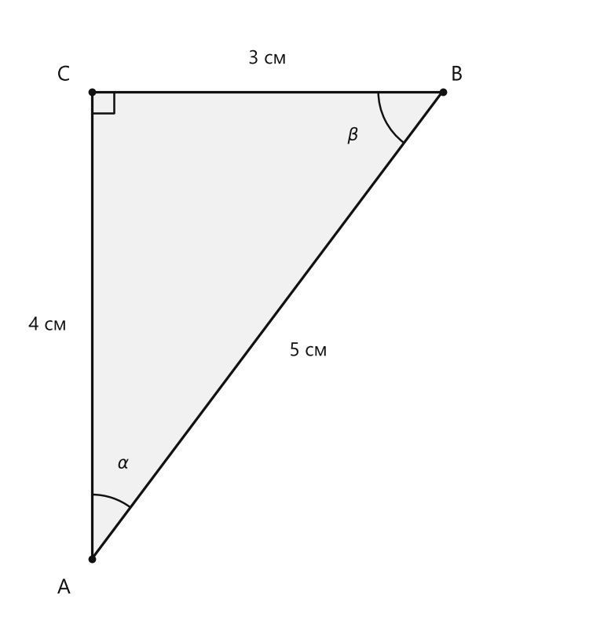
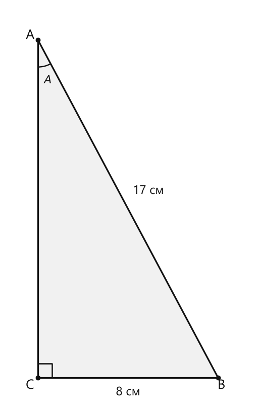
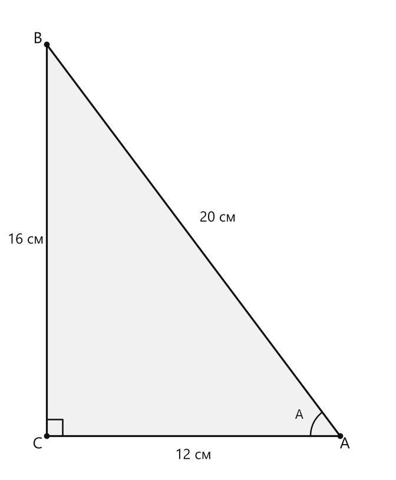
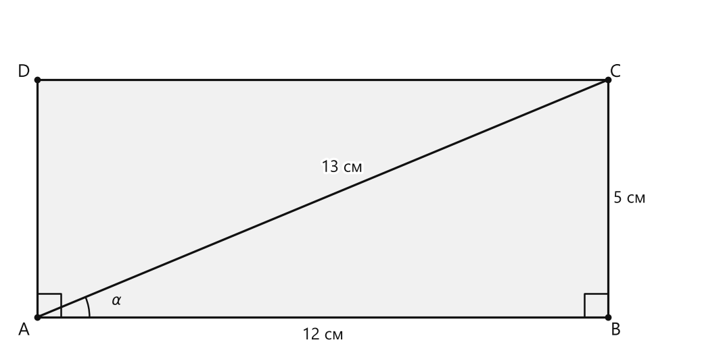
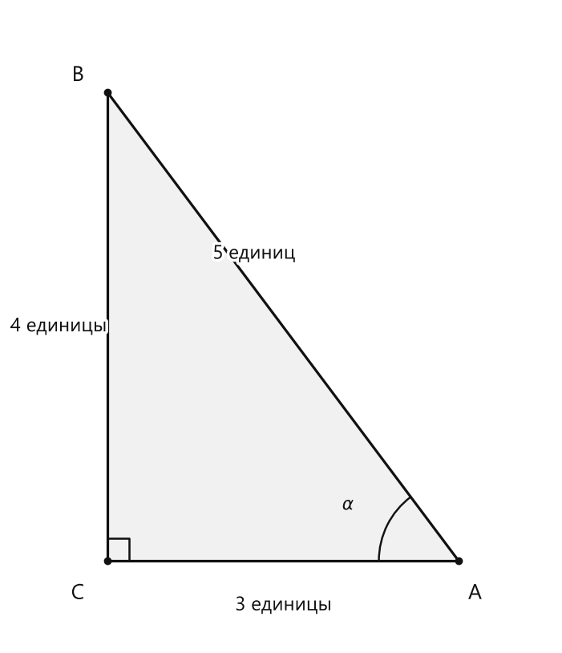

# Занятие 3. Синус, косинус, тангенс и котангенс острого угла

**Раздел:** Глава I. Соотношения в прямоугольном треугольнике  
**Параграф учебника:** §1. Синус, косинус, тангенс и котангенс острого угла  
**Страницы:** 17–25

## Цели занятия

После занятия ты сможешь:

- определять, какой катет является противолежащим, а какой — прилежащим;
- находить синус, косинус, тангенс и котангенс острого угла;
- использовать таблицу значений для углов $30^\circ$, $45^\circ$ и $60^\circ$;
- находить неизвестную сторону прямоугольного треугольника с помощью тригонометрической функции;
- находить острый угол по значению его синуса, косинуса или тангенса;
- решать задачи на площадь и построение угла.

Выбери блок своего уровня:

- **1–2 балла:** узнаю функции по определениям и нахожу их по готовым сторонам;
- **3–4 балла:** применяю формулы в прямоугольном треугольнике;
- **5–6 баллов:** решаю задачи с теоремой Пифагора и площадью;
- **7–8 баллов:** нахожу неизвестные углы и стороны;
- **9–10 баллов:** решаю составные задачи и объясняю построение.

## Теория к занятию

### 1. Стороны прямоугольного треугольника относительно угла

#### Простыми словами

В прямоугольном треугольнике выберем один острый угол $\alpha$.

Теперь посмотрим, где находятся стороны:

- **противолежащий катет** расположен напротив выбранного угла;
- **прилежащий катет** образует выбранный угол, но не является гипотенузой;
- **гипотенуза** расположена напротив прямого угла. Это самая длинная сторона треугольника.

Важно: относительно другого острого угла катеты меняются ролями. Сам треугольник не меняется — меняется только наш «взгляд» на него.

#### Определения

### Определение. Синусом острого угла прямоугольного треугольника

Синусом острого угла прямоугольного треугольника называется отношение противолежащего катета к гипотенузе:
$$ \sin \alpha = \frac{a}{c}. $$

### Определение. Косинусом острого угла прямоугольного треугольника

Косинусом острого угла прямоугольного треугольника называется отношение прилежащего катета к гипотенузе:
$$ \cos \alpha = \frac{b}{c}. $$

### Определение. Тангенсом острого угла прямоугольного треугольника

Тангенсом острого угла прямоугольного треугольника называется отношение противолежащего катета к прилежащему:
$$ \operatorname{tg} \alpha = \frac{a}{b}. $$

### Определение. Котангенсом острого угла прямоугольного треугольника

Котангенсом острого угла прямоугольного треугольника называется отношение прилежащего катета к противолежащему:
$$ \operatorname{ctg} \alpha = \frac{b}{a}. $$

Здесь:

- $a$ — противолежащий катет;
- $b$ — прилежащий катет;
- $c$ — гипотенуза.

#### Алгоритм

Чтобы найти тригонометрическую функцию острого угла:

1. Выбери угол, для которого нужно найти значение.
2. Найди гипотенузу: она лежит напротив прямого угла.
3. Определи противолежащий и прилежащий катеты.
4. Запиши подходящее отношение.
5. Подставь длины сторон.
6. Сократи дробь, если это возможно.

#### Формулы

Для угла $\alpha$:

$$
\sin \alpha=\frac{a}{c}
$$

$$
\cos \alpha=\frac{b}{c}
$$

$$
\operatorname{tg}\alpha=\frac{a}{b}
$$

$$
\operatorname{ctg}\alpha=\frac{b}{a}
$$

#### Правила

- Синус — **противолежащий катет к гипотенузе**.
- Косинус — **прилежащий катет к гипотенузе**.
- Тангенс — **противолежащий катет к прилежащему**.
- Котангенс — **прилежащий катет к противолежащему**.

#### Ловушки

- Гипотенуза всегда лежит напротив прямого угла.
- В синусе и косинусе знаменателем является гипотенуза.
- Тангенс и котангенс используют только катеты.
- Для другого острого угла противолежащий и прилежащий катеты меняются местами.

---

### 2. Значения функций для углов $30^\circ$, $45^\circ$ и $60^\circ$

#### Простыми словами

Для углов $30^\circ$, $45^\circ$ и $60^\circ$ значения тригонометрических функций удобно брать из таблицы. Главное — не перепутать строку функции со столбцом угла. Таблица ошибок не делает, но за её читателя отвечаем мы.

#### Таблица значений

| | $30^\circ$ | $45^\circ$ | $60^\circ$ |
|---|---:|---:|---:|
| $\sin \alpha$ | $\frac{1}{2}$ | $\frac{\sqrt{2}}{2}$ | $\frac{\sqrt{3}}{2}$ |
| $\cos \alpha$ | $\frac{\sqrt{3}}{2}$ | $\frac{\sqrt{2}}{2}$ | $\frac{1}{2}$ |
| $\operatorname{tg}\alpha$ | $\frac{\sqrt{3}}{3}$ | $1$ | $\sqrt{3}$ |
| $\operatorname{ctg}\alpha$ | $\sqrt{3}$ | $1$ | $\frac{\sqrt{3}}{3}$ |

#### Удобные пары

Дополнительные углы в сумме дают $90^\circ$, поэтому:

$$
\sin30^\circ=\cos60^\circ=\frac12
$$

$$
\cos30^\circ=\sin60^\circ=\frac{\sqrt3}{2}
$$

$$
\sin45^\circ=\cos45^\circ=\frac{\sqrt2}{2}
$$

$$
\operatorname{tg}45^\circ=\operatorname{ctg}45^\circ=1
$$

#### Ловушки

- $\sin30^\circ$ и $\cos60^\circ$ равны $\frac12$.
- $\cos30^\circ$ и $\sin60^\circ$ равны $\frac{\sqrt3}{2}$.
- $\operatorname{tg}30^\circ=\frac{\sqrt3}{3}$, а $\operatorname{ctg}30^\circ=\sqrt3$.
- Для угла $60^\circ$ эти два значения меняются местами.

---

### 3. Дополнительные углы

#### Простыми словами

Два острых угла прямоугольного треугольника в сумме дают $90^\circ$.

Если один острый угол равен $\alpha$, то второй равен $90^\circ-\alpha$.

У таких углов функции связаны попарно:

- синус одного угла равен косинусу другого;
- тангенс одного угла равен котангенсу другого.

#### Формулы

$$
\cos(90^\circ-\alpha)=\sin\alpha
$$

$$
\sin(90^\circ-\alpha)=\cos\alpha
$$

$$
\operatorname{tg}(90^\circ-\alpha)=\operatorname{ctg}\alpha
$$

$$
\operatorname{ctg}(90^\circ-\alpha)=\operatorname{tg}\alpha
$$

#### Примеры

Так как $60^\circ=90^\circ-30^\circ$, то:

$$
\sin60^\circ=\cos30^\circ
$$

Так как $50^\circ=90^\circ-40^\circ$, то:

$$
\operatorname{tg}40^\circ=\operatorname{ctg}50^\circ
$$

#### Ловушки

- Формулы применяются к углам, сумма которых равна $90^\circ$.
- Синус превращается в косинус, а тангенс — в котангенс.
- Нельзя заменить синус тангенсом: это уже не преобразование, а математическая самодеятельность.

---

### 4. Значения функций и величина угла

#### Простыми словами

Калькулятор может работать в двух направлениях:

- по заданному углу находить значение синуса, косинуса или тангенса;
- по заданному значению функции находить острый угол.

Перед вычислениями проверь режим калькулятора: нужны **градусы**, а не радианы.

#### Факт

Значения тригонометрических функций данного угла можно приближенно находить при помощи специальных тригонометрических таблиц либо калькулятора.

Приближенное значение тригонометрических функций при решении задач будем брать с округлением до четырех знаков после запятой.

#### Алгоритм нахождения значения функции

1. Установи режим градусов.
2. Введи величину угла.
3. Выбери нужную функцию.
4. Получи значение.
5. Округли его до требуемого количества знаков.

Например:

$$
\sin45^\circ\approx0,7071
$$

#### Алгоритм нахождения угла

1. Установи режим градусов.
2. Введи значение синуса, косинуса или тангенса.
3. Используй обратную функцию калькулятора.
4. Округли величину угла до требуемого числа градусов.

Если угол острый, результат должен быть больше $0^\circ$ и меньше $90^\circ$.

#### Ловушки

- В режиме радиан калькулятор выдаст другое значение.
- Не округляй промежуточные результаты без необходимости.
- При нахождении острого угла ответ должен находиться между $0^\circ$ и $90^\circ$.
- Приближённый ответ обычно отмечают знаком $\approx$, а не знаком $=$.

---

### 5. Свойства тригонометрических функций острого угла

#### Определение / свойство

Значение синуса острого угла, а также косинуса, тангенса и котангенса зависит только от величины угла и не зависит от размеров и расположения прямоугольного треугольника с указанным острым углом.

Это означает: если два прямоугольных треугольника имеют одинаковый острый угол, соответствующие отношения сторон у них будут одинаковыми. Размер треугольника может измениться, а значение функции — нет.

#### Свойства

Для острого угла $x$ справедливо:

$$
0<\sin x<1
$$

$$
0<\cos x<1
$$

Синус и косинус острого угла положительны и меньше 1.

Тангенс и котангенс острого угла могут принимать любое положительное значение.

С увеличением острого угла синус и тангенс возрастают, а косинус и котангенс убывают, то есть если $\beta>\alpha$, то

$$
\sin\beta>\sin\alpha
$$

$$
\operatorname{tg}\beta>\operatorname{tg}\alpha
$$

но

$$
\cos\beta<\cos\alpha
$$

$$
\operatorname{ctg}\beta<\operatorname{ctg}\alpha
$$

Синус (косинус, тангенс и котангенс) острого угла определяют этот угол однозначно.

#### Как быстро проверить число

- Синус и косинус острого угла должны быть положительными числами меньше $1$.
- Тангенс и котангенс должны быть положительными, но могут быть больше $1$.
- Отрицательное число не может быть значением ни одной из четырёх функций острого угла.

Например, числа $2$, $-1$ и $\sqrt2$ не могут быть синусами острых углов.

## Сводка формул «выучить наизусть»

$$
\sin\alpha=\frac{\text{противолежащий катет}}{\text{гипотенуза}}
$$

$$
\cos\alpha=\frac{\text{прилежащий катет}}{\text{гипотенуза}}
$$

$$
\operatorname{tg}\alpha=\frac{\text{противолежащий катет}}{\text{прилежащий катет}}
$$

$$
\operatorname{ctg}\alpha=\frac{\text{прилежащий катет}}{\text{противолежащий катет}}
$$

$$
\cos(90^\circ-\alpha)=\sin\alpha
$$

$$
\sin(90^\circ-\alpha)=\cos\alpha
$$

$$
\operatorname{tg}(90^\circ-\alpha)=\operatorname{ctg}\alpha
$$

$$
\operatorname{ctg}(90^\circ-\alpha)=\operatorname{tg}\alpha
$$

$$
S_{\triangle}=\frac{ab}{2}
$$

## Правила, которые нельзя путать

- Противолежащий катет находится напротив выбранного угла.
- Прилежащий катет находится рядом с выбранным углом, но не является гипотенузой.
- Гипотенуза находится напротив прямого угла.
- В синусе и косинусе знаменатель — гипотенуза.
- Тангенс и котангенс — взаимно обратные отношения:
  $$
  \operatorname{tg}\alpha\cdot\operatorname{ctg}\alpha=1
  $$
- При увеличении угла синус и тангенс увеличиваются, а косинус и котангенс уменьшаются.
- Для вычислений с градусами калькулятор должен работать в режиме градусов.

## Разбор ключевых заданий

### Р1. Найти четыре тригонометрические функции по сторонам

#### Условие

В прямоугольном треугольнике $ABC$ угол $C$ прямой, $BC=3$ см, $AC=4$ см, $AB=5$ см. Угол $A=\alpha$, угол $B=\beta$. Найдите $\sin\alpha$, $\cos\alpha$, $\operatorname{tg}\alpha$, $\operatorname{ctg}\alpha$, $\sin\beta$, $\cos\beta$, $\operatorname{tg}\beta$, $\operatorname{ctg}\beta.

<!--geo-figure-spec
{
  "needed": true,
  "kind": "plane",
  "caption": "Прямоугольный треугольник $ABC$",
  "equal": true,
  "axis": false,
  "xlim": [
    -0.7,
    4.3
  ],
  "ylim": [
    -0.6,
    4.7
  ],
  "points": {
    "A": [
      0,
      0
    ],
    "B": [
      3,
      4
    ],
    "C": [
      0,
      4
    ]
  },
  "segments": [
    [
      "A",
      "B"
    ],
    [
      "B",
      "C"
    ],
    [
      "C",
      "A"
    ]
  ],
  "polygons": [
    {
      "vertices": [
        "A",
        "B",
        "C"
      ],
      "fill": 0.06
    }
  ],
  "labels": {
    "A": {
      "dx": -0.24,
      "dy": -0.25
    },
    "B": {
      "dx": 0.12,
      "dy": 0.14
    },
    "C": {
      "dx": -0.24,
      "dy": 0.14
    }
  },
  "right_angles": [
    {
      "vertex": "C",
      "from": "A",
      "to": "B"
    }
  ],
  "angle_marks": [
    {
      "vertex": "A",
      "from": "C",
      "to": "B",
      "text": "$\\alpha$",
      "radius": 0.55
    },
    {
      "vertex": "B",
      "from": "A",
      "to": "C",
      "text": "$\\beta$",
      "radius": 0.55
    }
  ],
  "texts": [
    {
      "xy": [
        -0.38,
        2
      ],
      "text": "4 см"
    },
    {
      "xy": [
        1.5,
        4.28
      ],
      "text": "3 см"
    },
    {
      "xy": [
        1.85,
        1.78
      ],
      "text": "5 см"
    }
  ]
}
-->

*Прямоугольный треугольник ABC*

#### Решение

Сначала работаем с углом $\alpha=A$.

Сторона напротив угла $A$ — $BC=3$ см.

Катет рядом с углом $A$ — $AC=4$ см.

Гипотенуза — $AB=5$ см, потому что она лежит напротив прямого угла $C$.

$$
\sin\alpha=\frac{BC}{AB}=\frac35
$$

$$
\cos\alpha=\frac{AC}{AB}=\frac45
$$

$$
\operatorname{tg}\alpha=\frac{BC}{AC}=\frac34
$$

$$
\operatorname{ctg}\alpha=\frac{AC}{BC}=\frac43
$$

Теперь рассматриваем угол $\beta=B$.

Сторона напротив угла $B$ — $AC=4$ см.

Катет рядом с углом $B$ — $BC=3$ см.

Гипотенуза остаётся той же: $AB=5$ см.

$$
\sin\beta=\frac{AC}{AB}=\frac45
$$

$$
\cos\beta=\frac{BC}{AB}=\frac35
$$

$$
\operatorname{tg}\beta=\frac{AC}{BC}=\frac43
$$

$$
\operatorname{ctg}\beta=\frac{BC}{AC}=\frac34
$$

Проверим результат.

Углы $A$ и $B$ — острые углы одного прямоугольного треугольника, поэтому:

$$
\alpha+\beta=90^\circ
$$

Значит,

$$
\sin\alpha=\cos\beta
$$

и

$$
\cos\alpha=\sin\beta
$$

Полученные значения это подтверждают.

**Ответ:**

$$
\sin\alpha=\frac35,\quad
\cos\alpha=\frac45,\quad
\operatorname{tg}\alpha=\frac34,\quad
\operatorname{ctg}\alpha=\frac43
$$

$$
\sin\beta=\frac45,\quad
\cos\beta=\frac35,\quad
\operatorname{tg}\beta=\frac43,\quad
\operatorname{ctg}\beta=\frac34
$$

---

### Р2. Найти косинус угла по гипотенузе и катету

#### Условие

В прямоугольном треугольнике $ABC$, где $\angle C=90^\circ$, катет $BC=8$ см, гипотенуза $AB=17$ см. Найдите $\cos A$.

<!--geo-figure-spec
{
  "needed": true,
  "kind": "plane",
  "caption": "Прямоугольный треугольник $ABC$",
  "equal": true,
  "axis": false,
  "xlim": [
    -1.4,
    9.5
  ],
  "ylim": [
    -1.2,
    16.5
  ],
  "points": {
    "C": [
      0,
      0
    ],
    "B": [
      8,
      0
    ],
    "A": [
      0,
      15
    ]
  },
  "segments": [
    {
      "points": [
        "A",
        "B"
      ],
      "label": "",
      "t": 0.5
    },
    {
      "points": [
        "B",
        "C"
      ],
      "label": "",
      "t": 0.5
    },
    {
      "points": [
        "C",
        "A"
      ],
      "label": "",
      "t": 0.5
    }
  ],
  "polygons": [
    {
      "vertices": [
        "A",
        "B",
        "C"
      ],
      "fill": 0.06
    }
  ],
  "labels": {
    "A": {
      "dx": -0.35,
      "dy": 0.2
    },
    "B": {
      "dx": 0.15,
      "dy": -0.35
    },
    "C": {
      "dx": -0.35,
      "dy": -0.35
    }
  },
  "right_angles": [
    {
      "vertex": "C",
      "from": "A",
      "to": "B"
    }
  ],
  "angle_marks": [
    {
      "vertex": "A",
      "from": "C",
      "to": "B",
      "text": "$A$",
      "radius": 1.2
    }
  ],
  "texts": [
    {
      "xy": [
        4.9,
        8.3
      ],
      "text": "17 см"
    },
    {
      "xy": [
        4,
        -0.65
      ],
      "text": "8 см"
    }
  ]
}
-->

*Прямоугольный треугольник ABC*

#### Решение

Для косинуса угла $A$ нужен прилежащий катет $AC$ и гипотенуза $AB$.

Гипотенуза уже известна:

$$
AB=17\text{ см}
$$

Катет $AC$ пока неизвестен.

По теореме Пифагора:

$$
AC^2+BC^2=AB^2
$$

Выразим $AC^2$:

$$
AC^2=AB^2-BC^2
$$

Подставим известные длины:

$$
AC^2=17^2-8^2
$$

$$
AC^2=289-64
$$

$$
AC^2=225
$$

Так как длина стороны положительна:

$$
AC=15\text{ см}
$$

Теперь применим определение косинуса:

$$
\cos A=\frac{AC}{AB}
$$

$$
\cos A=\frac{15}{17}
$$

Проверим найденный катет:

$$
8^2+15^2=64+225=289=17^2
$$

Равенство выполняется.

**Ответ:**

$$
\frac{15}{17}
$$

---

### Р3. Найти площадь по гипотенузе и тангенсу

#### Условие

Гипотенуза $AB$ прямоугольного треугольника $ABC$ равна $20$ см, $\operatorname{tg}A=\frac43$. Найдите площадь треугольника.

<!--geo-figure-spec
{
  "needed": true,
  "kind": "plane",
  "caption": "Прямоугольный треугольник $ABC$",
  "equal": true,
  "axis": false,
  "xlim": [
    -1.5,
    14
  ],
  "ylim": [
    -1.5,
    17.5
  ],
  "points": {
    "C": [
      0,
      0
    ],
    "A": [
      12,
      0
    ],
    "B": [
      0,
      16
    ]
  },
  "segments": [
    {
      "points": [
        "A",
        "B"
      ],
      "label": "",
      "t": 0.5
    },
    {
      "points": [
        "A",
        "C"
      ],
      "label": "",
      "t": 0.5
    },
    {
      "points": [
        "B",
        "C"
      ],
      "label": "",
      "t": 0.5
    }
  ],
  "polygons": [
    {
      "vertices": [
        "A",
        "B",
        "C"
      ],
      "fill": 0.06
    }
  ],
  "labels": {
    "A": {
      "dx": 0.2,
      "dy": -0.35
    },
    "B": {
      "dx": -0.35,
      "dy": 0.2
    },
    "C": {
      "dx": -0.35,
      "dy": -0.35
    }
  },
  "right_angles": [
    {
      "vertex": "C",
      "from": "A",
      "to": "B"
    }
  ],
  "angle_marks": [
    {
      "vertex": "A",
      "from": "C",
      "to": "B",
      "text": "A",
      "radius": 1.2
    }
  ],
  "texts": [
    {
      "xy": [
        7,
        8.9
      ],
      "text": "20 см"
    },
    {
      "xy": [
        6,
        -0.8
      ],
      "text": "12 см"
    },
    {
      "xy": [
        -0.85,
        8
      ],
      "text": "16 см"
    }
  ]
}
-->

*Прямоугольный треугольник ABC*

#### Решение

Для угла $A$ противолежащий катет — $BC$, а прилежащий — $AC$.

По определению тангенса:

$$
\operatorname{tg}A=\frac{BC}{AC}
$$

По условию:

$$
\frac{BC}{AC}=\frac43
$$

Значит, катеты можно обозначить так:

$$
AC=3x,\qquad BC=4x
$$

Числа $3$ и $4$ взяты из отношения катетов. Переменная $x$ показывает, во сколько раз эти длины увеличены.

Применим теорему Пифагора:

$$
AC^2+BC^2=AB^2
$$

Подставим выражения для катетов и длину гипотенузы:

$$
(3x)^2+(4x)^2=20^2
$$

$$
9x^2+16x^2=400
$$

$$
25x^2=400
$$

$$
x^2=16
$$

Длины сторон положительны, поэтому:

$$
x=4
$$

Найдём катеты:

$$
AC=3\cdot4=12\text{ см}
$$

$$
BC=4\cdot4=16\text{ см}
$$

Площадь прямоугольного треугольника равна половине произведения катетов:

$$
S=\frac{AC\cdot BC}{2}
$$

$$
S=\frac{12\cdot16}{2}
$$

$$
S=\frac{192}{2}=96\text{ см}^2
$$

Проверим гипотенузу:

$$
12^2+16^2=144+256=400=20^2
$$

Проверка прошла: треугольник не пытается выдать себя за другой.

**Ответ:**

$$
96\text{ см}^2
$$

---

### Р4. Найти стороны и функции в треугольнике с гипотенузой $25$ см

#### Условие

В прямоугольном треугольнике $ABC$ гипотенуза $AB=25$ см, катет $AC=24$ см. Найдите:

а) $\sin A$;  
б) $\cos A$;  
в) $\operatorname{tg}B$;  
г) $\operatorname{ctg}B$;  
д) $\operatorname{tg}B\cdot\operatorname{ctg}B$;  
е) $\sin^2A+\cos^2A$.

#### Решение

Сначала найдём неизвестный катет $BC$.

По теореме Пифагора:

$$
BC^2+AC^2=AB^2
$$

Выразим $BC^2$:

$$
BC^2=AB^2-AC^2
$$

Подставим известные значения:

$$
BC^2=25^2-24^2
$$

$$
BC^2=625-576
$$

$$
BC^2=49
$$

Длина стороны положительна, поэтому:

$$
BC=7\text{ см}
$$

Теперь рассмотрим угол $A$.

Напротив угла $A$ находится $BC=7$ см.

Рядом с углом $A$ находится катет $AC=24$ см.

Гипотенуза равна $AB=25$ см.

$$
\sin A=\frac{BC}{AB}=\frac7{25}
$$

$$
\cos A=\frac{AC}{AB}=\frac{24}{25}
$$

Рассмотрим угол $B$.

Для угла $B$ противолежащим катетом является $AC=24$ см.

Прилежащим катетом является $BC=7$ см.

$$
\operatorname{tg}B=\frac{AC}{BC}=\frac{24}{7}
$$

$$
\operatorname{ctg}B=\frac{BC}{AC}=\frac7{24}
$$

Найдём произведение тангенса и котангенса:

$$
\operatorname{tg}B\cdot\operatorname{ctg}B
=
\frac{24}{7}\cdot\frac7{24}
$$

Сократим одинаковые множители:

$$
\operatorname{tg}B\cdot\operatorname{ctg}B=1
$$

Теперь вычислим сумму квадратов синуса и косинуса угла $A$:

$$
\sin^2A+\cos^2A
=
\left(\frac7{25}\right)^2+
\left(\frac{24}{25}\right)^2
$$

$$
\sin^2A+\cos^2A
=
\frac{49}{625}+\frac{576}{625}
$$

$$
\sin^2A+\cos^2A
=
\frac{625}{625}=1
$$

**Ответ:**

$$
\sin A=\frac7{25}
$$

$$
\cos A=\frac{24}{25}
$$

$$
\operatorname{tg}B=\frac{24}{7}
$$

$$
\operatorname{ctg}B=\frac7{24}
$$

$$
\operatorname{tg}B\cdot\operatorname{ctg}B=1
$$

$$
\sin^2A+\cos^2A=1
$$

### Р5. Найти значения функций для специальных углов

#### Условие

Заполните пропуски:

а) $\sin60^\circ$;  
б) $\operatorname{tg}30^\circ$;  
в) угол, синус которого равен $\frac12$;  
г) угол, косинус которого равен $\frac{\sqrt3}{2}$;  
д) $\sin45^\circ$;  
е) угол, котангенс которого равен $\sqrt3$;  
ж) функция, значение которой при $45^\circ$ равно $1$;  
з) угол, косинус которого равен $\frac{\sqrt2}{2}$.

#### Решение

Смотрим в таблицу значений специальных углов. Двигаемся по пунктам, чтобы ни один пропуск не спрятался.

а) В таблице указано:

$$
\sin60^\circ=\frac{\sqrt3}{2}
$$

б) Для угла $30^\circ$:

$$
\operatorname{tg}30^\circ=\frac{\sqrt3}{3}
$$

в) В таблице синус равен $\frac12$ для угла $30^\circ$:

$$
\sin30^\circ=\frac12
$$

Значит, искомый угол — $30^\circ$.

г) Косинус равен $\frac{\sqrt3}{2}$ для угла $30^\circ$:

$$
\cos30^\circ=\frac{\sqrt3}{2}
$$

д) Для угла $45^\circ$:

$$
\sin45^\circ=\frac{\sqrt2}{2}
$$

е) Котангенс равен $\sqrt3$ для угла $30^\circ$:

$$
\operatorname{ctg}30^\circ=\sqrt3
$$

Значит, искомый угол — $30^\circ$.

ж) Для угла $45^\circ$ и тангенс, и котангенс равны $1$:

$$
\operatorname{tg}45^\circ=1
$$

$$
\operatorname{ctg}45^\circ=1
$$

Поэтому подходят две функции: $\operatorname{tg}$ и $\operatorname{ctg}$.

з) Косинус равен $\frac{\sqrt2}{2}$ для угла $45^\circ$:

$$
\cos45^\circ=\frac{\sqrt2}{2}
$$

**Ответ:**

а) $\frac{\sqrt3}{2}$;  
б) $\frac{\sqrt3}{3}$;  
в) $30^\circ$;  
г) $30^\circ$;  
д) $\frac{\sqrt2}{2}$;  
е) $30^\circ$;  
ж) $\operatorname{tg}$ или $\operatorname{ctg}$;  
з) $45^\circ$.

---

### Р6. Найти угол по значению тригонометрической функции

#### Условие

Угол $x$ — острый. Найдите его величину, округлив ответ до $1^\circ$, если:

а) $\sin x=0,4226$;  
б) $\cos x=0,6820$;  
в) $\operatorname{tg}x=0,5774$.

#### Решение

Здесь нужно по известному значению функции найти угол. Для этого пользуемся тригонометрической таблицей или калькулятором.

а) В таблице находим значение, близкое к $0,4226$:

$$
\sin25^\circ\approx0,4226
$$

Значит,

$$
x\approx25^\circ
$$

б) Ищем в таблице значение косинуса, близкое к $0,6820$:

$$
\cos47^\circ\approx0,6820
$$

Значит,

$$
x\approx47^\circ
$$

в) Для тангенса получаем:

$$
\operatorname{tg}30^\circ=\frac{\sqrt3}{3}\approx0,5774
$$

Следовательно,

$$
x\approx30^\circ
$$

Здесь калькулятор не заменяет рассуждение: он просто быстро листает таблицу, только без шороха страниц.

**Ответ:**

а) $25^\circ$;  
б) $47^\circ$;  
в) $30^\circ$.

---

### Р7. Найти площадь равнобедренного треугольника по тангенсу

#### Условие

Основание равнобедренного треугольника равно $8$ см, тангенс угла при основании равен $2$. Найдите площадь треугольника.

#### Решение

Проведём высоту из вершины равнобедренного треугольника к основанию.

В равнобедренном треугольнике высота, проведённая к основанию, делит основание пополам.

Половина основания равна:

$$
\frac{8}{2}=4\text{ см}
$$

После проведения высоты получился прямоугольный треугольник.

В нём:

- высота $h$ — противолежащий катет;
- половина основания, равная $4$ см, — прилежащий катет.

По определению тангенса:

$$
\operatorname{tg}\alpha=\frac{h}{4}
$$

По условию $\operatorname{tg}\alpha=2$, поэтому:

$$
2=\frac{h}{4}
$$

Умножаем обе части равенства на $4$:

$$
h=8\text{ см}
$$

Теперь используем формулу площади треугольника:

$$
S=\frac{ah}{2}
$$

Подставляем $a=8$ см и $h=8$ см:

$$
S=\frac{8\cdot8}{2}
$$

$$
S=32\text{ см}^2
$$

**Ответ:**

$$
32\text{ см}^2
$$

---

### Р8. Найти площадь, если катеты отличаются на заданную величину

#### Условие

Тангенс острого угла прямоугольного треугольника равен $\frac25$, один из катетов на $6$ см больше другого. Найдите площадь треугольника.

#### Решение

Тангенс — это отношение противолежащего катета к прилежащему.

Нужно получить отношение катетов $\frac25$. Поэтому обозначим:

$$
\text{противолежащий катет}=2x\text{ см}
$$

$$
\text{прилежащий катет}=5x\text{ см}
$$

Тогда тангенс действительно равен:

$$
\operatorname{tg}\alpha=\frac{2x}{5x}=\frac25
$$

Катет $5x$ больше катета $2x$ на $6$ см:

$$
5x-2x=6
$$

Приводим подобные слагаемые:

$$
3x=6
$$

Делим обе части на $3$:

$$
x=2
$$

Находим длины катетов:

$$
2x=2\cdot2=4\text{ см}
$$

$$
5x=5\cdot2=10\text{ см}
$$

Площадь прямоугольного треугольника равна половине произведения катетов:

$$
S=\frac{4\cdot10}{2}
$$

$$
S=20\text{ см}^2
$$

Проверим условие:

$$
10-4=6
$$

$$
\frac4{10}=\frac25
$$

Оба условия выполнены. Значит, катеты найдены правильно.

**Ответ:**

$$
20\text{ см}^2
$$

---

### Р9. Найти синус меньшего угла между диагональю прямоугольника и его сторонами

#### Условие

Периметр прямоугольника равен $34$ см, одна из его сторон равна $12$ см. Найдите синус меньшего острого угла между диагональю прямоугольника и его сторонами.

<!--geo-figure-spec
{
  "needed": true,
  "kind": "plane",
  "caption": "Прямоугольник $ABCD$ с диагональю $AC$",
  "equal": true,
  "axis": false,
  "xlim": [
    -0.6,
    13.8
  ],
  "ylim": [
    -0.7,
    6.5
  ],
  "points": {
    "A": [
      0,
      0
    ],
    "B": [
      12,
      0
    ],
    "C": [
      12,
      5
    ],
    "D": [
      0,
      5
    ]
  },
  "segments": [
    [
      "A",
      "B"
    ],
    [
      "B",
      "C"
    ],
    [
      "C",
      "D"
    ],
    [
      "D",
      "A"
    ],
    [
      "A",
      "C"
    ]
  ],
  "polygons": [
    {
      "vertices": [
        "A",
        "B",
        "C",
        "D"
      ],
      "fill": 0.06
    }
  ],
  "labels": {
    "A": {
      "dx": -0.28,
      "dy": -0.28
    },
    "B": {
      "dx": 0.16,
      "dy": -0.28
    },
    "C": {
      "dx": 0.16,
      "dy": 0.16
    },
    "D": {
      "dx": -0.28,
      "dy": 0.16
    }
  },
  "right_angles": [
    {
      "vertex": "A",
      "from": "B",
      "to": "D"
    },
    {
      "vertex": "B",
      "from": "A",
      "to": "C"
    }
  ],
  "angle_marks": [
    {
      "vertex": "A",
      "from": "B",
      "to": "C",
      "text": "$\\alpha$",
      "radius": 1.1
    }
  ],
  "texts": [
    {
      "xy": [
        6,
        -0.38
      ],
      "text": "12 см"
    },
    {
      "xy": [
        12.45,
        2.5
      ],
      "text": "5 см"
    },
    {
      "xy": [
        6.4,
        3.15
      ],
      "text": "13 см"
    }
  ]
}
-->

*Прямоугольник ABCD с диагональю AC*

#### Решение

Обозначим вторую сторону прямоугольника через $b$ см.

Формула периметра прямоугольника:

$$
P=2(a+b)
$$

Подставляем известные данные:

$$
2(12+b)=34
$$

Делим обе части на $2$:

$$
12+b=17
$$

Находим вторую сторону:

$$
b=17-12=5\text{ см}
$$

Диагональ прямоугольника делит его на два прямоугольных треугольника.

В таком треугольнике диагональ — гипотенуза. Обозначим её через $d$.

По теореме Пифагора:

$$
d^2=12^2+5^2
$$

$$
d^2=144+25
$$

$$
d^2=169
$$

Так как длина отрезка положительна:

$$
d=13\text{ см}
$$

Меньший острый угол расположен напротив меньшей стороны, то есть стороны $5$ см.

Для этого угла сторона $5$ см является противолежащим катетом, а диагональ $13$ см — гипотенузой.

По определению синуса:

$$
\sin\alpha=\frac5{13}
$$

Угол выбран правильно: для другого острого угла синус равен $\frac{12}{13}$, а $\frac5{13}<\frac{12}{13}$.

**Ответ:**

$$
\frac5{13}
$$

---

### Р10. Построить угол с заданным синусом

#### Условие

При помощи циркуля и линейки постройте острый угол $\alpha$, синус которого равен $\frac45$.

#### Идея решения

По определению синуса:

$$
\sin\alpha=\frac{\text{противолежащий катет}}{\text{гипотенуза}}
$$

Нужно построить прямоугольный треугольник, у которого отношение противолежащего катета к гипотенузе равно $\frac45$.

Для этого удобно взять:

$$
\text{противолежащий катет}=4
$$

$$
\text{гипотенуза}=5
$$

Третий отрезок будет равен $3$, потому что числа $3$, $4$, $5$ образуют прямоугольный треугольник.

<!--geo-figure-spec
{
  "needed": true,
  "kind": "plane",
  "caption": "Построение острого угла $\\alpha$ с синусом $\\frac45$",
  "equal": true,
  "axis": false,
  "xlim": [
    -0.7,
    3.8
  ],
  "ylim": [
    -0.7,
    4.7
  ],
  "points": {
    "C": [
      0,
      0
    ],
    "B": [
      0,
      4
    ],
    "A": [
      3,
      0
    ]
  },
  "segments": [
    [
      "A",
      "B"
    ],
    [
      "B",
      "C"
    ],
    [
      "C",
      "A"
    ]
  ],
  "polygons": [
    {
      "vertices": [
        "A",
        "B",
        "C"
      ],
      "fill": 0.06
    }
  ],
  "labels": {
    "A": {
      "dx": 0.14,
      "dy": -0.28
    },
    "B": {
      "dx": -0.25,
      "dy": 0.14
    },
    "C": {
      "dx": -0.25,
      "dy": -0.28
    }
  },
  "right_angles": [
    {
      "vertex": "C",
      "from": "A",
      "to": "B"
    }
  ],
  "angle_marks": [
    {
      "vertex": "A",
      "from": "C",
      "to": "B",
      "text": "$\\alpha$",
      "radius": 0.68
    }
  ],
  "texts": [
    {
      "xy": [
        -0.42,
        2
      ],
      "text": "4 единицы"
    },
    {
      "xy": [
        1.5,
        -0.38
      ],
      "text": "3 единицы"
    },
    {
      "xy": [
        1.25,
        2.62
      ],
      "text": "5 единиц"
    }
  ]
}
-->

*Построение острого угла \alpha с синусом \frac45*

#### Построение

1. Проведите прямую $m$ и отметьте на ней точку $C$.
2. Через точку $C$ проведите перпендикуляр к прямой $m$.
3. На перпендикуляре отложите отрезок $BC=4$ единицы.
4. На прямой $m$ отложите отрезок $CA=3$ единицы.
5. Соедините точки $A$ и $B$.
6. Получился прямоугольный треугольник $ABC$ с прямым углом $C$.

Проверим длину гипотенузы $AB$ по теореме Пифагора:

$$
AB^2=AC^2+BC^2
$$

$$
AB^2=3^2+4^2
$$

$$
AB^2=9+16=25
$$

$$
AB=5
$$

Рассмотрим угол $A$.

Сторона $BC$ лежит напротив угла $A$, а $AB$ является гипотенузой.

По определению синуса:

$$
\sin\angle A=\frac{BC}{AB}
$$

$$
\sin\angle A=\frac45
$$

Значит, $\angle A$ — искомый угол $\alpha$.

**Ответ:** построен угол $\alpha$, для которого

$$
\sin\alpha=\frac45
$$

---

### Р11. Определить, какие числа не могут быть синусами острых углов

#### Условие

Какие из чисел не могут быть значениями синуса острого угла:

$$
2,\quad \frac{15}{17},\quad -1,\quad \sqrt2,\quad 0,75,\quad \sqrt3-1?
$$

#### Решение

Для синуса острого угла выполняется условие:

$$
0<\sin x<1
$$

Значит, подходящее число должно быть положительным и меньше $1$.

Проверим числа по очереди.

1. Число $2$:

$$
2>1
$$

Оно не может быть синусом острого угла.

2. Число $\frac{15}{17}$:

$$
0<\frac{15}{17}<1
$$

Оно подходит.

3. Число $-1$:

$$
-1<0
$$

Синус острого угла не может быть отрицательным. Число не подходит.

4. Число $\sqrt2$:

$$
\sqrt2>1
$$

Число не подходит.

5. Число $0,75$:

$$
0<0,75<1
$$

Оно подходит.

6. Рассмотрим число $\sqrt3-1$.

Так как:

$$
1<\sqrt3<2
$$

то после вычитания $1$ получаем:

$$
0<\sqrt3-1<1
$$

Число подходит.

**Ответ:**

$$
2,\quad -1,\quad \sqrt2
$$

---

### Р12. Задача на изменение функций при увеличении угла

#### Условие

Даны два острых угла $\alpha$ и $\beta$, причём $\beta>\alpha$. Сравните:

а) $\sin\alpha$ и $\sin\beta$;  
б) $\cos\alpha$ и $\cos\beta$;  
в) $\operatorname{tg}\alpha$ и $\operatorname{tg}\beta$;  
г) $\operatorname{ctg}\alpha$ и $\operatorname{ctg}\beta$.

#### Решение

Используем свойство тригонометрических функций острого угла.

Если угол увеличивается:

- синус увеличивается;
- тангенс увеличивается;
- косинус уменьшается;
- котангенс уменьшается.

Так как $\beta>\alpha$, получаем:

а) синус большего угла больше:

$$
\sin\beta>\sin\alpha
$$

б) косинус большего угла меньше:

$$
\cos\beta<\cos\alpha
$$

в) тангенс большего угла больше:

$$
\operatorname{tg}\beta>\operatorname{tg}\alpha
$$

г) котангенс большего угла меньше:

$$
\operatorname{ctg}\beta<\operatorname{ctg}\alpha
$$

Ловушка здесь одна: синус и тангенс «растут», а косинус и котангенс «спускаются». Не перепутать эту компанию местами.

**Ответ:**

$$
\sin\beta>\sin\alpha
$$

$$
\cos\beta<\cos\alpha
$$

$$
\operatorname{tg}\beta>\operatorname{tg}\alpha
$$

$$
\operatorname{ctg}\beta<\operatorname{ctg}\alpha
$$

## Практические задания

Выбери свой уровень и решай только этот блок. В блоке должна закрепиться вся тема параграфа. Ответы не приводятся.

### Уровень 1–2 балла

**С1.** В прямоугольном треугольнике $ABC$ угол $C$ прямой. Какое отношение задаёт $\sin A$?

1) $\dfrac{AC}{AB}$ 2) $\dfrac{BC}{AB}$ 3) $\dfrac{AB}{BC}$ 4) $\dfrac{BC}{AC}$ 5) $\dfrac{AC}{BC}$

**С2.** В прямоугольном треугольнике $ABC$ угол $C$ прямой. Запишите отношение, равное $\cos A$.

**С3.** В прямоугольном треугольнике $ABC$ угол $C$ прямой, $BC=6$ см, $AB=10$ см. Найдите $\sin A$.

1) $\dfrac{3}{5}$ 2) $\dfrac{4}{5}$ 3) $\dfrac{5}{3}$ 4) $\dfrac{3}{4}$ 5) $\dfrac{4}{3}$

**С4.** В прямоугольном треугольнике $ABC$ угол $C$ прямой, $AC=8$ см, $BC=6$ см. Найдите $\operatorname{tg} A$.

**С5.** Выберите верное равенство.

1) $\sin 30^\circ=\dfrac{\sqrt3}{2}$  
2) $\cos 30^\circ=\dfrac12$  
3) $\operatorname{tg}45^\circ=1$  
4) $\operatorname{ctg}60^\circ=\sqrt3$  
5) $\sin60^\circ=\dfrac12$

**С6.** Заполните пропуск: $\cos(90^\circ-35^\circ)=\sin\,$_____.

**С7.** Угол $\alpha$ острый. Какое из чисел не может быть значением $\cos\alpha$?

1) $0,2$ 2) $\dfrac12$ 3) $\dfrac{\sqrt2}{2}$ 4) $1$ 5) $0,95$

**С8.** Углы $\alpha$ и $\beta$ острые, причём $\beta>\alpha$. Сравните значения $\sin\alpha$ и $\sin\beta$, вставив знак $<$ или $>$: $\sin\alpha$ _____ $\sin\beta$.

**С9.** В прямоугольном треугольнике катеты, противолежащий и прилежащий к углу $\alpha$, равны соответственно $9$ см и $12$ см. Найдите $\operatorname{tg}\alpha$.

**С10.** Найдите значение выражения $\operatorname{tg}45^\circ+\cos60^\circ$.

1) $\dfrac12$ 2) $1$ 3) $\dfrac32$ 4) $2$ 5) $\sqrt3$

**С11.** В прямоугольном треугольнике $ABC$ угол $C$ прямой, $AB=13$ см, $AC=12$ см. Найдите $\cos A$.

**С12.** Угол $\alpha$ острый, $\operatorname{ctg}\alpha=\sqrt3$. Определите градусную меру угла $\alpha$.

1) $30^\circ$ 2) $45^\circ$ 3) $60^\circ$ 4) $75^\circ$ 5) $90^\circ$

**С13.** В прямоугольном треугольнике $ABC$ угол $C$ прямой. Какое равенство верно для синуса угла $A$?

1) $\sin A=\dfrac{AC}{AB}$ 2) $\sin A=\dfrac{BC}{AB}$ 3) $\sin A=\dfrac{AB}{BC}$ 4) $\sin A=\dfrac{AC}{BC}$ 5) $\sin A=\dfrac{BC}{AC}$

**С14.** В прямоугольном треугольнике $ABC$ угол $C$ прямой. Какое равенство верно для косинуса угла $B$?

1) $\cos B=\dfrac{BC}{AB}$ 2) $\cos B=\dfrac{AC}{AB}$ 3) $\cos B=\dfrac{AB}{AC}$ 4) $\cos B=\dfrac{AC}{BC}$ 5) $\cos B=\dfrac{BC}{AC}$

**С15.** В прямоугольном треугольнике $ABC$ угол $C$ прямой. Выберите формулу тангенса угла $A$.

1) $\operatorname{tg}A=\dfrac{AC}{BC}$ 2) $\operatorname{tg}A=\dfrac{BC}{AC}$ 3) $\operatorname{tg}A=\dfrac{AB}{AC}$ 4) $\operatorname{tg}A=\dfrac{BC}{AB}$ 5) $\operatorname{tg}A=\dfrac{AC}{AB}$

**С16.** В прямоугольном треугольнике $ABC$ угол $C$ прямой. Выберите формулу котангенса угла $B$.

1) $\operatorname{ctg}B=\dfrac{BC}{AC}$ 2) $\operatorname{ctg}B=\dfrac{AC}{BC}$ 3) $\operatorname{ctg}B=\dfrac{AB}{AC}$ 4) $\operatorname{ctg}B=\dfrac{AC}{AB}$ 5) $\operatorname{ctg}B=\dfrac{AB}{BC}$

**С17.** Угол $\alpha$ острый. Какое из чисел не может быть значением $\sin\alpha$?

1) $0,4$ 2) $\dfrac{1}{2}$ 3) $\dfrac{15}{17}$ 4) $1,2$ 5) $\sqrt{3}-1$

**С18.** Угол $\beta$ острый. Какое из чисел может быть значением $\operatorname{tg}\beta$?

1) $-2$ 2) $0$ 3) $\dfrac{3}{4}$ 4) $-\dfrac{1}{3}$ 5) $-1$

**С19.** Угол $\alpha$ острый. Если $\cos\alpha=\dfrac{1}{2}$, чему равен угол $\alpha$?

1) $15^\circ$ 2) $30^\circ$ 3) $45^\circ$ 4) $60^\circ$ 5) $75^\circ$

**С20.** Угол $\alpha$ острый. Выберите верное равенство.

1) $\sin30^\circ=\dfrac{\sqrt3}{2}$ 2) $\cos30^\circ=\dfrac{\sqrt3}{2}$ 3) $\operatorname{tg}30^\circ=\sqrt3$ 4) $\operatorname{ctg}30^\circ=\dfrac{\sqrt3}{3}$ 5) $\cos60^\circ=\dfrac{\sqrt3}{2}$

**С21.** Вычислите $\sin60^\circ+\cos60^\circ$.

1) $\dfrac{1}{2}$ 2) $1$ 3) $\dfrac{\sqrt3+1}{2}$ 4) $\sqrt3$ 5) $\dfrac{\sqrt3-1}{2}$

**С22.** Угол $\alpha$ острый. Известно, что $\sin\alpha=\dfrac{\sqrt2}{2}$. Чему равен $\cos\alpha$?

1) $\dfrac{1}{2}$ 2) $\dfrac{\sqrt3}{2}$ 3) $1$ 4) $\dfrac{\sqrt2}{2}$ 5) $\sqrt2$

**С23.** Угол $\alpha$ острый, а $\beta=90^\circ-\alpha$. Какое равенство верно?

1) $\sin\beta=\sin\alpha$ 2) $\cos\beta=\cos\alpha$ 3) $\sin\beta=\cos\alpha$ 4) $\operatorname{tg}\beta=\operatorname{tg}\alpha$ 5) $\operatorname{ctg}\beta=\operatorname{ctg}\alpha$

**С24.** В прямоугольном треугольнике катеты, прилежащий и противолежащий углу $\alpha$, равны соответственно $6$ см и $8$ см. Чему равен $\operatorname{tg}\alpha$?

1) $\dfrac{3}{4}$ 2) $\dfrac{4}{3}$ 3) $\dfrac{3}{5}$ 4) $\dfrac{4}{5}$ 5) $\dfrac{5}{3}$

**С25.** В прямоугольном треугольнике $ABC$ угол $C$ прямой, $AC=6$ см, $BC=8$ см, $AB=10$ см. Чему равен $\sin A$?

1) $\frac{3}{5}$ 2) $\frac{4}{5}$ 3) $\frac{3}{4}$ 4) $\frac{4}{3}$ 5) $\frac{5}{4}$

**С26.** В прямоугольном треугольнике $ABC$ угол $C$ прямой. Для угла $A$ противолежащий катет равен $9$ см, а прилежащий катет — $12$ см. Найдите $\operatorname{tg} A$.

**С27.** Выберите значение, которое может быть косинусом острого угла.

1) $-0,4$ 2) $0$ 3) $\frac{1}{2}$ 4) $1$ 5) $1,2$

**С28.** Угол $\alpha$ острый, $\sin\alpha=\frac{\sqrt{2}}{2}$. Определите величину угла $\alpha$.

1) $30^\circ$ 2) $45^\circ$ 3) $60^\circ$ 4) $90^\circ$ 5) $135^\circ$

**С29.** Угол $\alpha$ острый. Какое равенство является верным?

1) $\sin(90^\circ-\alpha)=\sin\alpha$
2) $\sin(90^\circ-\alpha)=\cos\alpha$
3) $\sin(90^\circ-\alpha)=\operatorname{tg}\alpha$
4) $\sin(90^\circ-\alpha)=\operatorname{ctg}\alpha$
5) $\sin(90^\circ-\alpha)=1-\sin\alpha$

**С30.** Найдите $\cos 60^\circ$.

1) $\frac{1}{2}$ 2) $\frac{\sqrt{2}}{2}$ 3) $\frac{\sqrt{3}}{2}$ 4) $1$ 5) $\sqrt{3}$

**С31.** В прямоугольном треугольнике катеты равны $5$ см и $12$ см. Найдите гипотенузу.

1) $7$ см 2) $10$ см 3) $12$ см 4) $13$ см 5) $17$ см

**С32.** В прямоугольном треугольнике $ABC$ угол $C$ прямой, $AC=12$ см, $BC=5$ см. Найдите $\cos A$.

1) $\frac{5}{13}$ 2) $\frac{12}{13}$ 3) $\frac{5}{12}$ 4) $\frac{12}{5}$ 5) $\frac{13}{12}$

**С33.** Угол $\alpha$ острый, $\operatorname{ctg}\alpha=\sqrt{3}$. Определите величину угла $\alpha$.

1) $30^\circ$ 2) $45^\circ$ 3) $60^\circ$ 4) $90^\circ$ 5) $120^\circ$

**С34.** В прямоугольном треугольнике для острого угла $\alpha$ противолежащий катет равен $6$ см, а гипотенуза — $10$ см. Найдите $\sin\alpha$.

**С35.** Углы $\alpha$ и $\beta$ — острые углы одного прямоугольного треугольника. Если $\alpha=30^\circ$, найдите $\cos\beta$.

1) $\frac{1}{2}$ 2) $\frac{\sqrt{2}}{2}$ 3) $\frac{\sqrt{3}}{2}$ 4) $1$ 5) $\sqrt{3}$

**С36.** Сравните значения $\sin 40^\circ$ и $\sin 70^\circ$.

1) $\sin40^\circ>\sin70^\circ$
2) $\sin40^\circ<\sin70^\circ$
3) $\sin40^\circ=\sin70^\circ$
4) Сравнить невозможно
5) Оба значения равны нулю

### Уровень 3–4 балла

**С1.** В прямоугольном треугольнике $ABC$ угол $C$ прямой, $AC=12$ см, $BC=5$ см. Найдите $\sin A$, $\cos A$, $\operatorname{tg} A$ и $\operatorname{ctg} A$.

**С2.** В прямоугольном треугольнике $ABC$ угол $C$ прямой, гипотенуза $AB=13$ см, катет $BC=12$ см. Найдите $\cos A$ и $\operatorname{tg} B$.

**С3.** В прямоугольном треугольнике один из острых углов равен $30^\circ$, а гипотенуза равна $18$ см. Найдите катет, противолежащий этому углу.

**С4.** Вычислите значения выражений:  
а) $\sin 60^\circ+\cos 60^\circ$;  
б) $\operatorname{tg}45^\circ+\operatorname{ctg}45^\circ$;  
в) $\cos30^\circ\cdot\sin30^\circ$.

**С5.** Заполните пропуски:  
а) $\sin 30^\circ=...$;  
б) $\cos ...=\frac{1}{2}$;  
в) $\operatorname{tg} ...=\sqrt{3}$;  
г) $\operatorname{ctg}60^\circ=...$;  
д) $\sin ...=\frac{\sqrt{2}}{2}$.

**С6.** Угол $\alpha$ острый. Найдите $\cos\alpha$, если $\alpha=60^\circ$. Затем найдите $\sin(90^\circ-\alpha)$.

**С7.** Угол $\alpha$ острый и $\sin\alpha=\frac{\sqrt{2}}{2}$. Найдите величину угла $\alpha$, $\cos\alpha$ и $\operatorname{tg}\alpha$.

**С8.** Угол $\alpha$ острый и $\operatorname{ctg}\alpha=\sqrt{3}$. Найдите величину угла $\alpha$, $\sin\alpha$ и $\cos\alpha$.

**С9.** Определите, какие из чисел могут быть значениями синуса острого угла: $0,4$; $1$; $-\frac{1}{2}$; $\frac{\sqrt{3}}{2}$; $1,2$.

**С10.** Расположите числа $\sin35^\circ$, $\sin70^\circ$, $\sin50^\circ$ в порядке возрастания.

**С11.** Прямоугольник имеет стороны $9$ см и $12$ см. Найдите синус меньшего острого угла между диагональю прямоугольника и его большей стороной.

**С12.** В равнобедренном треугольнике основание равно $12$ см, а высота, проведённая к основанию, равна $8$ см. Найдите тангенс угла при основании и площадь треугольника.

**С13.** В прямоугольном треугольнике $ABC$ угол $C$ прямой, $AC=12$ см, $BC=5$ см. Найдите $\sin A$, $\cos A$, $\operatorname{tg} A$ и $\operatorname{ctg} A$.

**С14.** В прямоугольном треугольнике $KLM$ угол $M$ прямой, гипотенуза $KL=13$ см, катет $KM=5$ см. Найдите $\sin K$ и $\cos K$.

**С15.** В прямоугольном треугольнике $ABC$ угол $C$ прямой, $\sin A=\frac{3}{5}$, а гипотенуза $AB=20$ см. Найдите катеты $AC$ и $BC$.

**С16.** В прямоугольном треугольнике $DEF$ угол $F$ прямой, $\operatorname{tg} D=\frac{3}{4}$, а катет $DF=12$ см. Найдите катет $EF$ и гипотенузу $DE$.

**С17.** Угол $\alpha$ — острый. Используя таблицу значений, найдите $\sin\alpha$, $\cos\alpha$, $\operatorname{tg}\alpha$ и $\operatorname{ctg}\alpha$, если $\alpha=60^\circ$.

**С18.** Угол $\beta$ — острый, $\cos\beta=\frac{\sqrt{2}}{2}$. Найдите величину угла $\beta$, а также $\sin\beta$ и $\operatorname{tg}\beta$.

**С19.** Угол $\gamma$ — острый, $\operatorname{ctg}\gamma=\sqrt{3}$. Найдите величину угла $\gamma$, а также $\sin\gamma$ и $\cos\gamma$.

**С20.** Сравните числа, не вычисляя их приближённых значений: $\sin 35^\circ$ и $\sin 55^\circ$; $\cos 25^\circ$ и $\cos 70^\circ$; $\operatorname{tg}40^\circ$ и $\operatorname{tg}65^\circ$.

**С21.** Заполните пропуски в равенствах:
а) $\sin(90^\circ-35^\circ)=\ldots$;  
б) $\cos(90^\circ-20^\circ)=\ldots$;  
в) $\operatorname{tg}(90^\circ-40^\circ)=\ldots$;  
г) $\operatorname{ctg}(90^\circ-25^\circ)=\ldots$.

**С22.** В прямоугольном треугольнике один острый угол равен $30^\circ$, а гипотенуза равна $18$ см. Найдите катет, противолежащий углу $30^\circ$, и катет, прилежащий к этому углу.

**С23.** Периметр прямоугольника равен $34$ см, одна его сторона равна $8$ см. Найдите синус меньшего острого угла между диагональю и большей стороной прямоугольника.

**С24.** Тангенс острого угла прямоугольного треугольника равен $\frac{3}{4}$. Разность катетов равна $5$ см. Найдите площадь треугольника.

**С25.** В прямоугольном треугольнике $ABC$ угол $C$ прямой, $AC=12$ см, $BC=5$ см. Найдите $\sin A$ и $\cos A$.

**С26.** В прямоугольном треугольнике $KLM$ угол $M$ прямой, $KL=13$ см, $KM=12$ см. Найдите $\operatorname{tg} K$ и $\operatorname{ctg} K$.

**С27.** Найдите значение выражения $\sin 30^\circ+\cos 60^\circ+\operatorname{tg}45^\circ$.

**С28.** Заполните пропуски в равенствах:
а) $\sin 60^\circ=...$;  
б) $\cos 30^\circ=...$;  
в) $\operatorname{tg}60^\circ=...$;  
г) $\operatorname{ctg}30^\circ=...$.

**С29.** Угол $\alpha$ — острый, $\cos\alpha=\dfrac{\sqrt{2}}{2}$. Найдите величину угла $\alpha$, $\sin\alpha$ и $\operatorname{tg}\alpha$.

**С30.** Угол $\beta$ — острый, $\operatorname{ctg}\beta=1$. Найдите величину угла $\beta$, $\sin\beta$ и $\cos\beta$.

**С31.** Углы $\alpha$ и $\beta$ дополняют друг друга до $90^\circ$, причём $\alpha=30^\circ$. Найдите $\sin\beta$, $\cos\beta$, $\operatorname{tg}\beta$ и $\operatorname{ctg}\beta$.

**С32.** Сравните без вычислений значения:  
а) $\sin 35^\circ$ и $\sin 55^\circ$;  
б) $\cos 35^\circ$ и $\cos 55^\circ$;  
в) $\operatorname{tg}35^\circ$ и $\operatorname{tg}55^\circ$.

**С33.** Какие из чисел могут быть значениями синуса острого угла: $\dfrac{3}{5}$, $1$, $0$, $-\dfrac{1}{2}$, $\dfrac{\sqrt{5}}{2}$, $0{,}84$? Запишите все подходящие числа.

**С34.** В прямоугольном треугольнике один из острых углов равен $60^\circ$, а противолежащий ему катет равен $9$ см. Найдите гипотенузу треугольника.

**С35.** В прямоугольном треугольнике $ABC$ угол $C$ прямой, $AB=10$ см, $\sin A=\dfrac{3}{5}$. Найдите длины катетов $AC$ и $BC$.

**С36.** В равнобедренном треугольнике $ABC$ боковые стороны равны $10$ см, а основание $AB$ равно $12$ см. Найдите тангенс угла при основании треугольника.

### Уровень 5–6 баллов

**С1.** В прямоугольном треугольнике $ABC$ угол $C$ — прямой, $AC=6$ см, $BC=8$ см. Найдите $\sin A$, $\cos A$, $\operatorname{tg} A$ и $\operatorname{ctg} A$.

**С2.** В прямоугольном треугольнике $ABC$ угол $C$ — прямой, гипотенуза $AB=13$ см, катет $AC=5$ см. Найдите $\sin A$, $\cos A$, $\operatorname{tg} B$ и $\operatorname{ctg} B$.

**С3.** Используя таблицу значений тригонометрических функций, заполните пропуски:
а) $\sin 60^\circ=...$;  
б) $\cos 30^\circ=...$;  
в) $\operatorname{tg}45^\circ=...$;  
г) $\operatorname{ctg}60^\circ=...$;  
д) $\cos ...=\frac12$;  
е) $\operatorname{tg}...=\sqrt3$.

**С4.** Выразите через тригонометрическую функцию угла $\alpha$:
а) $\cos(90^\circ-\alpha)$;  
б) $\sin(90^\circ-\alpha)$;  
в) $\operatorname{tg}(90^\circ-\alpha)$;  
г) $\operatorname{ctg}(90^\circ-\alpha)$.

**С5.** Угол $\alpha$ — острый. Найдите величину угла $\alpha$, если:
а) $\sin\alpha=\frac12$;  
б) $\cos\alpha=\frac{\sqrt2}{2}$;  
в) $\operatorname{tg}\alpha=\sqrt3$;  
г) $\operatorname{ctg}\alpha=\sqrt3$.

**С6.** В прямоугольном треугольнике катеты относятся как $3:4$, причём противолежащий катет для угла $\alpha$ имеет длину $9$ см. Найдите прилежащий катет, гипотенузу и значения $\sin\alpha$, $\cos\alpha$, $\operatorname{tg}\alpha$.

**С7.** Гипотенуза прямоугольного треугольника равна $25$ см, а $\operatorname{tg}\alpha=\frac34$, где $\alpha$ — один из его острых углов. Найдите длины катетов и площадь треугольника.

**С8.** Периметр прямоугольника равен $34$ см, одна его сторона равна $8$ см. Найдите синус меньшего острого угла между диагональю прямоугольника и большей стороной.

**С9.** В равнобедренном треугольнике боковые стороны равны $10$ см, а основание — $12$ см. Высота, проведённая к основанию, делит его пополам. Найдите синус и косинус угла при основании.

**С10.** Угол $\alpha$ — острый. Найдите величину угла $\alpha$ и значение недостающей функции:
а) если $\sin\alpha=\frac{\sqrt3}{2}$, найдите $\cos\alpha$;  
б) если $\cos\alpha=\frac{\sqrt3}{2}$, найдите $\operatorname{tg}\alpha$;  
в) если $\operatorname{ctg}\alpha=1$, найдите $\sin\alpha$.

**С11.** Из чисел $0{,}4$, $1$, $-\frac12$, $\frac{\sqrt5}{2}$, $\frac{\sqrt3}{2}$ и $0$ выпишите те, которые могут быть значениями синуса острого угла.

**С12.** В прямоугольном треугольнике катеты равны $5$ см и $12$ см. Для острого угла, противолежащим катетом которого является катет длиной $5$ см, найдите $\sin\alpha$, $\cos\alpha$, $\operatorname{tg}\alpha$ и проверьте равенство $\sin^2\alpha+\cos^2\alpha=1$.

**С13.** В прямоугольном треугольнике катеты равны $9$ см и $12$ см. Найдите значения $\sin\alpha$, $\cos\alpha$, $\operatorname{tg}\alpha$ и $\operatorname{ctg}\alpha$, где $\alpha$ — угол, противолежащий катету длиной $9$ см.

**С14.** В прямоугольном треугольнике гипотенуза равна $13$ см, а один из катетов — $5$ см. Найдите $\sin\beta$ и $\cos\beta$, если угол $\beta$ прилежит к катету длиной $5$ см.

**С15.** Тангенс острого угла прямоугольного треугольника равен $\frac{3}{4}$. Разность катетов равна $7$ см. Найдите длины катетов треугольника.

**С16.** Основание равнобедренного треугольника равно $10$ см, а тангенс угла при основании равен $\frac{3}{4}$. Найдите высоту, проведённую к основанию, и площадь треугольника.

**С17.** Стороны прямоугольника равны $9$ см и $12$ см. Найдите синус и косинус меньшего острого угла, образованного диагональю прямоугольника и его большей стороной.

**С18.** Заполните пропуски:
а) $\sin 30^\circ=...$;  
б) $\cos 60^\circ=...$;  
в) $\operatorname{tg}45^\circ=...$;  
г) $\operatorname{ctg}30^\circ=...$;  
д) $\sin ...=\frac{\sqrt{3}}{2}$;  
е) $\cos ...=\frac{\sqrt{2}}{2}$.

**С19.** Найдите величину острого угла $x$, если:
а) $\sin x=0,5$;  
б) $\cos x=\frac{\sqrt{2}}{2}$;  
в) $\operatorname{tg}x=\sqrt{3}$.  
Ответ запишите в градусах.

**С20.** Угол $\alpha$ — острый. Найдите $\cos\alpha$, $\operatorname{tg}\alpha$ и $\operatorname{ctg}\alpha$, если $\sin\alpha=\frac{3}{5}$.

**С21.** Укажите все числа, которые могут быть значениями косинуса острого угла: $0$; $\frac{1}{3}$; $1$; $0,8$; $-\frac{2}{5}$; $\frac{\sqrt{5}}{2}$.

**С22.** В прямоугольном треугольнике гипотенуза равна $25$ см. Синус острого угла $\alpha$ равен $\frac{7}{25}$. Найдите длины катетов, а также $\operatorname{tg}\alpha$ и $\operatorname{ctg}\alpha$.

**С23.** В прямоугольном треугольнике гипотенуза равна $14$ см, а один из острых углов равен $60^\circ$. Найдите длины катетов. Ответ округлите до десятых.

**С24.** Для острых углов $\alpha$ и $\beta$ известно, что $\sin\alpha=0,6$, а $\cos\beta=0,6$. Сравните углы $\alpha$ и $\beta$ и найдите $\operatorname{tg}\alpha$ и $\operatorname{ctg}\beta$.

**С25.** В прямоугольном треугольнике $ABC$ угол $C$ прямой, $AC=9$ см, $BC=12$ см. Найдите $\sin A$, $\cos A$, $\operatorname{tg} A$ и $\operatorname{ctg} A$.

**С26.** Угол $\alpha$ — острый, $\sin\alpha=\frac{5}{13}$. Найдите $\cos\alpha$, $\operatorname{tg}\alpha$ и $\operatorname{ctg}\alpha$.

**С27.** Гипотенуза прямоугольного треугольника равна $25$ см, а тангенс одного из острых углов равен $\frac{3}{4}$. Найдите площадь треугольника.

**С28.** В равнобедренном треугольнике основание равно $16$ см, а косинус угла при основании равен $\frac{3}{5}$. Найдите высоту, проведённую к основанию, и площадь треугольника.

**С29.** Угол $\alpha$ — острый. Найдите величину угла $\alpha$, если $\operatorname{ctg}\alpha=\sqrt{3}$. Затем найдите $\sin\alpha$, $\cos\alpha$ и $\operatorname{tg}\alpha$.

**С30.** Периметр прямоугольника равен $46$ см, одна из его сторон равна $15$ см. Найдите синус меньшего острого угла между диагональю прямоугольника и его стороной.

### Уровень 7–8 баллов

**С1.** В прямоугольном треугольнике $ABC$ $\angle C=90^\circ$, $AC=15$ см, $BC=8$ см. Найдите $\sin A$, $\cos A$, $\operatorname{tg} A$, $\operatorname{ctg} A$. Ответ обоснуйте вычислением длины гипотенузы.

**С2.** В прямоугольном треугольнике $KLM$ $\angle M=90^\circ$, $KL=26$ см, $KM=10$ см. Найдите $\sin K$, $\cos K$, $\operatorname{tg} L$ и $\operatorname{ctg} L$.

**С3.** Гипотенуза прямоугольного треугольника равна $25$ см, а тангенс одного из острых углов равен $\frac{7}{24}$. Найдите длины катетов и площадь треугольника.

**С4.** В прямоугольном треугольнике $ABC$ $\angle C=90^\circ$, $\sin A=\frac{5}{13}$, а гипотенуза $AB$ равна $39$ см. Найдите длины катетов, $\cos A$, $\operatorname{tg} A$ и $\operatorname{ctg} A$.

**С5.** Угол $\alpha$ острый. Известно, что $\cos\alpha=\frac{\sqrt3}{2}$. Найдите величину угла $\alpha$, $\sin\alpha$, $\operatorname{tg}\alpha$ и $\operatorname{ctg}\alpha$. Объясните, почему выбранное значение угла является единственным.

**С6.** Угол $\alpha$ острый, и $\operatorname{ctg}\alpha=\sqrt3$. Найдите величину угла $\alpha$, $\sin\alpha$, $\cos\alpha$ и $\operatorname{tg}\alpha$.

**С7.** Используя калькулятор, найдите значения с округлением до $0{,}0001$:  
а) $\sin 18^\circ$; б) $\cos 37^\circ$; в) $\operatorname{tg} 52^\circ$; г) $\operatorname{ctg} 67^\circ$.  
Для каждого результата укажите, является ли он больше или меньше $1$.

**С8.** Используя калькулятор, найдите величину острого угла $x$ с округлением до $1^\circ$:  
а) $\sin x=0{,}6018$; б) $\cos x=0{,}2588$; в) $\operatorname{tg}x=1{,}4281$.  
Проверьте каждый найденный угол вычислением соответствующей тригонометрической функции.

**С9.** В прямоугольнике $ABCD$ стороны $AB=16$ см и $BC=12$ см. Найдите длину диагонали $AC$, синус и косинус меньшего острого угла между диагональю $AC$ и стороной $AB$, а также тангенс этого угла.

**С10.** Равнобедренный треугольник имеет основание $14$ см и боковую сторону $25$ см. Высота, проведённая к основанию, делит его пополам. Найдите высоту треугольника, синус, косинус и тангенс угла при основании.

**С11.** Основание равнобедренного треугольника равно $12$ см, а тангенс угла при основании равен $\frac{3}{2}$. Найдите высоту треугольника, его боковую сторону и площадь.

**С12.** В равнобедренной трапеции основания равны $18$ см и $8$ см, а боковые стороны — по $13$ см. Найдите высоту трапеции, косинус острого угла при большем основании и величину этого угла с округлением до $1^\circ$.

**С13.** В прямоугольном треугольнике $ABC$ угол $C$ прямой, $AB=13$ см, $AC=5$ см. Найдите $\sin A$, $\cos A$, $\operatorname{tg} A$, $\sin B$ и $\operatorname{ctg} B$.

**С14.** В равнобедренном треугольнике основание равно $10$ см, а тангенс угла при основании равен $\frac{3}{4}$. Найдите высоту, проведённую к основанию, и площадь треугольника.

**С15.** Тангенс острого угла прямоугольного треугольника равен $\frac{3}{4}$. Один из катетов на $7$ см больше другого. Найдите длины катетов и площадь треугольника.

**С16.** В прямоугольном треугольнике $ABC$ угол $C$ прямой, $BC=12$ см, $\cos A=\frac{5}{13}$. Найдите $AC$, $AB$, $\sin A$ и $\operatorname{tg} A$.

**С17.** Угол $\alpha$ острый. Известно, что $\sin\alpha=\frac{\sqrt3}{2}$. Найдите величину угла $\alpha$, $\cos\alpha$, $\operatorname{tg}\alpha$ и $\operatorname{ctg}\alpha$. Обоснуйте выбор значения угла.

**С18.** Угол $\beta$ острый. Известно, что $\operatorname{ctg}\beta=\sqrt3$. Найдите величину угла $\beta$, $\sin\beta$, $\cos\beta$ и $\operatorname{tg}\beta$.

**С19.** В прямоугольнике $ABCD$ стороны равны $9$ см и $12$ см, а диагональ $AC$ образует с большей стороной угол $\alpha$. Найдите $\sin\alpha$, $\cos\alpha$ и $\operatorname{tg}\alpha$. Какой из острых углов, образованных диагональю со сторонами прямоугольника, имеет большую величину?

**С20.** Периметр равнобедренного треугольника равен $64$ см, а косинус угла при основании равен $0,6$. Найдите длину боковой стороны, длину основания и площадь треугольника.

**С21.** В равнобедренной трапеции основания равны $11$ см и $5$ см, а боковые стороны равны $5$ см. Найдите высоту трапеции, косинус её острого угла и величину этого угла.

**С22.** Для острого угла $\alpha$ известно, что $\cos\alpha=\frac{12}{13}$. Постройте с помощью циркуля и линейки угол $\alpha$. В построении используйте прямоугольный треугольник, у которого прилежащий к углу катет и гипотенуза имеют соответствующие длины. Запишите последовательность основных построений.

**С23.** Докажите, что для любых острых углов $\alpha$ и $\beta$ одного прямоугольного треугольника выполняются неравенства $\sin\alpha+\sin\beta<2$ и $\sin\alpha+\sin\beta>1$. Используйте определения синуса и свойства катетов и гипотенузы.

**С24.** В прямоугольном треугольнике $ABC$ угол $C$ прямой. Известно, что $\operatorname{tg} A=\frac{2}{3}$, а площадь треугольника равна $108$ см$^2$. Найдите длины катетов, гипотенузу, $\sin A$ и $\cos A$.

### Уровень 9–10 баллов

**С1.** В прямоугольном треугольнике $ABC$ угол $C$ прямой, $AB=29$ см, $AC=20$ см. Найдите $\sin A$, $\cos A$, $\operatorname{tg} A$, $\sin B$, $\cos B$, $\operatorname{ctg} B$.

**С2.** Гипотенуза прямоугольного треугольника равна $26$ см, а тангенс одного из острых углов равен $\frac{5}{12}$. Найдите площадь треугольника и значения синуса и косинуса этого угла.

**С3.** В равнобедренном треугольнике основание равно $14$ см, а косинус угла при основании равен $0{,}8$. Найдите высоту, проведённую к основанию, и площадь треугольника.

**С4.** Периметр прямоугольника равен $46$ см, одна из его сторон равна $8$ см. Найдите синус меньшего острого угла между диагональю прямоугольника и его большей стороной.

**С5.** Угол $\alpha$ острый, причём $\sin\alpha=\frac{5}{13}$. Найдите точные значения $\cos\alpha$, $\operatorname{tg}\alpha$, $\sin(90^\circ-\alpha)$ и $\operatorname{ctg}(90^\circ-\alpha)$.

**С6.** Используя калькулятор, найдите с округлением до $1^\circ$ острый угол $x$, если:
а) $\sin x=0{,}6018$;  
б) $\cos x=0{,}3420$;  
в) $\operatorname{tg}x=2{,}1445$.

**С7.** Углы $\alpha$ и $\beta$ — острые углы одного прямоугольного треугольника, причём $\operatorname{tg}\alpha=\frac{3}{4}$. Найдите $\sin\beta$, $\cos\beta$, $\operatorname{tg}\beta$ и $\operatorname{ctg}\beta$.

**С8.** Равнобедренная трапеция имеет основания $5$ см и $17$ см, а боковые стороны равны $10$ см. Найдите косинус острого угла трапеции и градусную меру этого угла.

**С9.** В равнобедренном треугольнике угол при вершине равен $40^\circ$, а боковая сторона равна $12$ см. Найдите высоту, проведённую к основанию, и основание треугольника, округлив результаты до $0{,}1$ см.

**С10.** Угол $\alpha$ острый. Известно, что $\operatorname{ctg}\alpha=\sqrt3$. Найдите угол $\alpha$, а также значения $\sin(90^\circ-\alpha)$ и $\operatorname{tg}(90^\circ-\alpha)$.

**С11.** Докажите, что для любых острых углов $\alpha$ и $\beta$ одного прямоугольного треугольника выполняются неравенства
$$1<\sin\alpha+\sin\beta<2.$$

**С12.** В прямоугольном треугольнике $ABC$ угол $C$ прямой, $BC=6$ см, $AC=8$ см. Окружность с центром $O$ касается катета $AC$, проходит через вершину $B$, а точка $O$ лежит на гипотенузе $AB$. Найдите радиус окружности.

**С13.** В прямоугольном треугольнике один из острых углов равен $\alpha$, причём $\operatorname{tg}\alpha=\frac{3}{4}$, а периметр треугольника равен $36$ см. Найдите площадь треугольника и значения $\sin\alpha$, $\cos\alpha$.

**С14.** Основание равнобедренного треугольника равно $14$ см, а тангенс угла при основании равен $\frac{3}{4}$. Найдите высоту, проведённую к основанию, и площадь треугольника.

**С15.** Тангенс одного из острых углов прямоугольного треугольника равен $\frac{2}{5}$. Разность катетов равна $9$ см. Найдите гипотенузу, площадь треугольника и котангенс другого острого угла.

**С16.** Равнобедренная трапеция имеет основания $10$ см и $22$ см, а боковые стороны равны $10$ см. Найдите высоту трапеции, косинус острого угла при большем основании и площадь трапеции.

**С17.** Углы $\alpha$ и $\beta$ — острые, причём $\alpha+\beta=90^\circ$. Известно, что $\sin\alpha=\frac{5}{13}$. Найдите без определения величины углов $\cos\beta$, $\sin\beta$, $\operatorname{tg}\beta$ и $\operatorname{ctg}\alpha$.

**С18.** Острые углы $\alpha$ и $\beta$ одного прямоугольного треугольника удовлетворяют условию $\sin\alpha=\frac{3}{5}$. Сравните без вычисления величин углов числа $\sin\alpha$ и $\sin\beta$, а также $\operatorname{tg}\alpha$ и $\operatorname{tg}\beta$. Затем найдите значения всех четырёх величин $\sin\beta$, $\cos\alpha$, $\operatorname{tg}\alpha$ и $\operatorname{ctg}\beta$.

## Чек-лист «ученик понял тему»

- Могу повторить определения и формулы параграфа своими словами и по учебнику.
- Решаю типовые задания своего уровня без подсказки.
- Вижу типичную ошибку и могу её объяснить.
