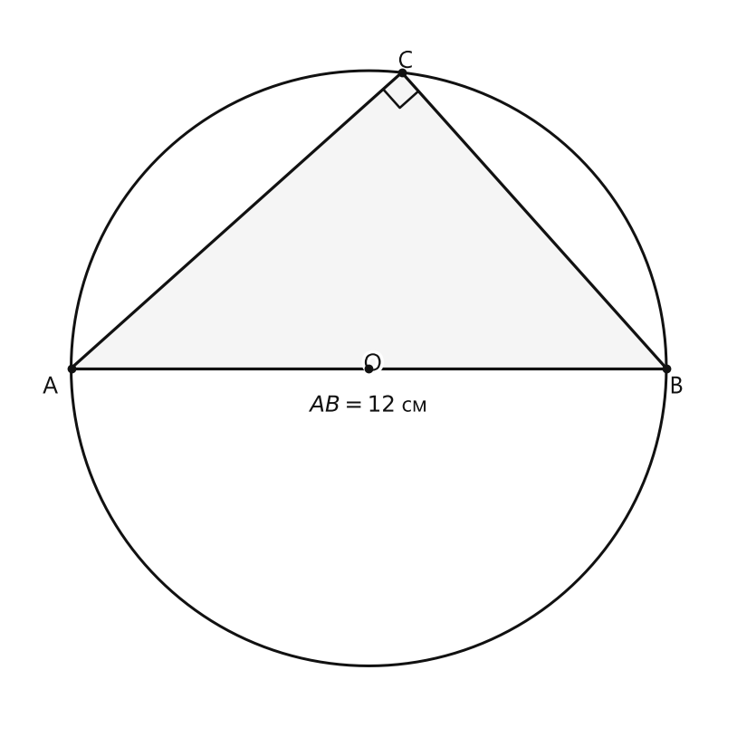
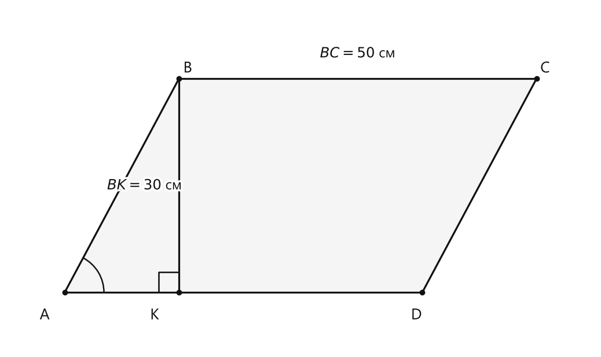
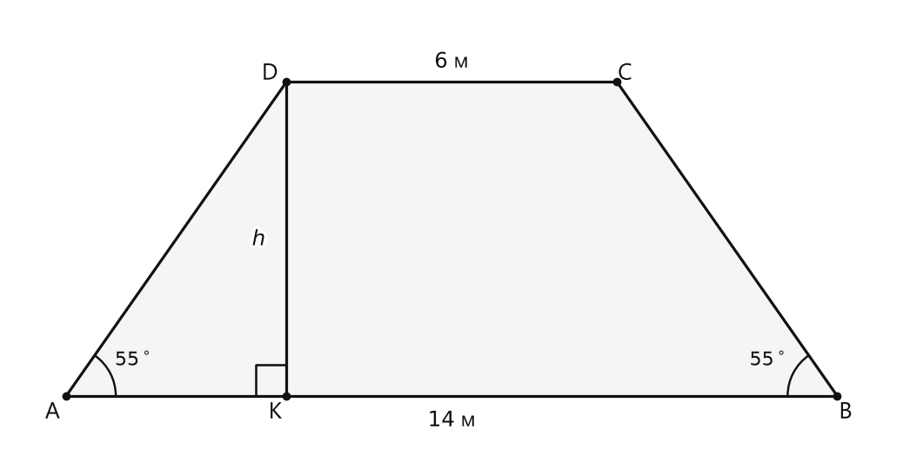

# Занятие 5. Тригонометрические формулы

**Раздел:** Глава I. Соотношения в прямоугольном треугольнике  
**Параграф учебника:** §3. Тригонометрические формулы  
**Страницы:** 32–36

## Цели занятия

К концу занятия ученик умеет:

- применять основное тригонометрическое тождество;
- находить синус или косинус острого угла по известному значению другой функции;
- выражать тангенс и котангенс через синус и косинус;
- находить неизвестные стороны прямоугольного треугольника с помощью тригонометрических функций;
- сравнивать острые углы по значениям их синусов или косинусов;
- применять тангенс в задачах планиметрии и стереометрии.

Выбери блок своего уровня:

- **1–2 балла:** формулы и простые подстановки;
- **3–4 балла:** нахождение неизвестных тригонометрических функций;
- **5–6 баллов:** задачи с прямоугольным треугольником и сравнение углов;
- **7–8 баллов:** доказательства тождеств и геометрические задачи;
- **9–10 баллов:** комплексное применение формул в планиметрии и стереометрии.

## Теория к занятию

### 1. Основное тригонометрическое тождество

#### Простыми словами

Синус и косинус одного острого угла связаны одной главной формулой.

Если известно значение синуса, можно найти косинус.

Если известен косинус, можно найти синус.

Это не фокус, а теорема Пифагора, записанная через отношения сторон прямоугольного треугольника.

#### Определение / факт / теорема / свойство

$$\sin^2\alpha+\cos^2\alpha=1.$$

#### Формулы

Перенесём один квадрат в другую часть равенства:

$$\sin^2\alpha=1-\cos^2\alpha,$$

$$\cos^2\alpha=1-\sin^2\alpha.$$

Теперь извлечём квадратный корень.

Так как синус и косинус острого угла $\alpha$ положительны, то

$$\sin\alpha=\sqrt{1-\cos^2\alpha}\text{ и }\cos\alpha=\sqrt{1-\sin^2\alpha}.$$

Знак «плюс» здесь обязателен: угол острый, поэтому его синус и косинус положительны. Отрицательный корень к этой задаче не подходит.

#### Правила

Чтобы найти синус по косинусу:

1. Возвести значение косинуса в квадрат.
2. Вычесть полученное число из $1$.
3. Извлечь квадратный корень.
4. Взять положительный корень.

Чтобы найти косинус по синусу, действуем так же.

#### Ловушки

- Нельзя писать $\sin\alpha=1-\cos^2\alpha$ без квадратного корня.
- Нельзя забывать квадрат у известного значения.
- Для острого угла берём положительный корень.
- Если дано десятичное число, внимательно возводим его в квадрат.
- Проверка простая: квадраты найденных синуса и косинуса должны в сумме дать $1$.

---

### 2. Выражение тангенса и котангенса через синус и косинус

#### Простыми словами

Тангенс показывает отношение синуса к косинусу.

Котангенс показывает обратное отношение: косинуса к синусу.

Они действительно похожи на дроби-зеркала, но менять местами числитель и знаменатель нужно только по формуле, а не «на глаз».

#### Определение / факт / теорема / свойство

$$\text{tg}\alpha=\frac{\sin\alpha}{\cos\alpha},\quad \text{ctg}\alpha=\frac{\cos\alpha}{\sin\alpha}.$$

#### Формулы

$$\text{tg}\alpha=\frac{\sin\alpha}{\cos\alpha},$$

$$\text{ctg}\alpha=\frac{\cos\alpha}{\sin\alpha},$$

$$\text{tg}\alpha=\frac{1}{\text{ctg}\alpha}.$$

Из последней формулы также получаем:

$$\text{ctg}\alpha=\frac{1}{\text{tg}\alpha}.$$

#### Когда применять

- Если известны $\sin\alpha$ и $\cos\alpha$, делим синус на косинус и получаем $\text{tg}\alpha$.
- Чтобы найти $\text{ctg}\alpha$, делим косинус на синус.
- Если известен тангенс, котангенс равен обратной величине.
- Если известен котангенс, тангенс также равен обратной величине.

#### Ловушки

- В тангенсе сверху стоит синус, снизу — косинус.
- В котангенсе сверху стоит косинус, снизу — синус.
- $\text{tg}\alpha$ и $\text{ctg}\alpha$ не равны друг другу, кроме случая, когда оба равны $1$.
- При делении дробей вторую дробь переворачиваем по правилу, а не по настроению.
- Для острого угла синус и косинус не равны нулю, поэтому деление допустимо.

---

### 3. Нахождение всех тригонометрических функций по одной известной

#### Простыми словами

Одного значения достаточно, чтобы найти остальные тригонометрические функции острого угла.

Например, дан синус:

1. Сначала находим косинус по основному тригонометрическому тождеству.
2. Затем находим тангенс как отношение синуса к косинусу.
3. После этого находим котангенс как отношение косинуса к синусу.

Можно рассуждать и через прямоугольный треугольник. Например, если синус равен $\dfrac{5}{13}$, можно взять противолежащий катет $5$, гипотенузу $13$, а третий катет найти по теореме Пифагора. Но формула часто короче — тетрадь скажет спасибо.

#### Алгоритм

Если дано $\sin\beta$:

1. Записать равенство $\sin^2\beta+\cos^2\beta=1$.
2. Подставить известное значение синуса.
3. Найти $\cos^2\beta$.
4. Извлечь корень и получить $\cos\beta$.
5. Вычислить $\text{tg}\beta=\dfrac{\sin\beta}{\cos\beta}$.
6. Вычислить $\text{ctg}\beta=\dfrac{\cos\beta}{\sin\beta}$.

Если дано $\cos\beta$:

1. Найти $\sin\beta$ по основному тождеству.
2. Найти тангенс.
3. Найти котангенс.

#### Ловушки

- Положительный корень можно брать потому, что угол острый.
- В прямоугольном треугольнике гипотенуза больше каждого катета.
- Значения синуса и косинуса острого угла находятся между $0$ и $1$.
- Тангенс и котангенс могут быть больше $1$. Это нормально: они являются отношениями катетов.
- После вычислений полезно проверить произведение:
  
$$\text{tg}\beta\cdot\text{ctg}\beta=1.$$

---

### 4. Изменение тригонометрических функций при увеличении острого угла

#### Простыми словами

Представим прямоугольный треугольник с одной неизменной гипотенузой.

Когда острый угол увеличивается:

- противолежащий катет становится длиннее;
- прилежащий катет становится короче.

Поэтому синус увеличивается, а косинус уменьшается.

Тангенс равен отношению противолежащего катета к прилежащему. Прилежащий катет становится всё меньше и приближается к нулю, поэтому тангенс быстро растёт.

#### Определение / факт / теорема / свойство

При увеличении угла от $0^\circ$ до $90^\circ$:

- синус угла увеличивается от $0$ до $1$;
- косинус уменьшается от $1$ до $0$;
- тангенс угла увеличивается от $0$ до бесконечности.

#### Правила сравнения углов

Для острых углов:

- если $\sin\alpha>\sin\beta$, то $\alpha>\beta$;
- если $\cos\alpha>\cos\beta$, то $\alpha<\beta$;
- если $\text{tg}\alpha>\text{tg}\beta$, то $\alpha>\beta$.

Обрати внимание: у косинуса сравнение направлено наоборот. Синус растёт вместе с углом, а косинус — словно идёт против движения.

#### Ловушки

- Для косинуса знак сравнения меняется на противоположный.
- Нельзя сравнивать углы только по числам, записанным рядом с буквами.
- Тангенс острого угла всегда положителен.
- При приближении угла к $90^\circ$ косинус приближается к нулю, поэтому тангенс неограниченно возрастает.

---

### 5. Дополнительные формулы

#### Простыми словами

Из основного тригонометрического тождества можно получить ещё две полезные формулы.

Чтобы получить формулу с тангенсом, разделим обе части основного тождества на $\cos^2\alpha$.

Чтобы получить формулу с котангенсом, разделим обе части на $\sin^2\alpha$.

Для острого угла $\sin\alpha\ne0$ и $\cos\alpha\ne0$, поэтому такое деление допустимо.

#### Формулы

Для острого угла $\alpha$:

$$1+\text{tg}^2\alpha=\frac{1}{\cos^2\alpha},$$

$$1+\text{ctg}^2\alpha=\frac{1}{\sin^2\alpha}.$$

Также:

$$\text{tg}\alpha\cdot\text{ctg}\alpha=1.$$

#### Правила

- Формулу
  
$$1+\text{tg}^2\alpha=\frac{1}{\cos^2\alpha}$$
  
удобно применять, когда известны $\cos\alpha$ или $\text{tg}\alpha$.

- Формулу
  
$$1+\text{ctg}^2\alpha=\frac{1}{\sin^2\alpha}$$
  
удобно применять, когда известны $\sin\alpha$ или $\text{ctg}\alpha$.

- Для острого угла синус, косинус, тангенс и котангенс положительны.
- Тангенс и котангенс — взаимно обратные числа.

#### Ловушки

- $\text{tg}^2\alpha$ — это квадрат тангенса, а не тангенс квадрата угла.
- В формуле с тангенсом в знаменателе стоит $\cos^2\alpha$.
- В формуле с котангенсом в знаменателе стоит $\sin^2\alpha$.
- Нельзя забывать единицу перед квадратом тангенса или котангенса.

---

## Сводка формул «выучить наизусть»

$$\sin^2\alpha+\cos^2\alpha=1,$$

$$\sin\alpha=\sqrt{1-\cos^2\alpha},$$

$$\cos\alpha=\sqrt{1-\sin^2\alpha},$$

$$\text{tg}\alpha=\frac{\sin\alpha}{\cos\alpha},$$

$$\text{ctg}\alpha=\frac{\cos\alpha}{\sin\alpha},$$

$$\text{tg}\alpha=\frac{1}{\text{ctg}\alpha},$$

$$\text{tg}\alpha\cdot\text{ctg}\alpha=1,$$

$$1+\text{tg}^2\alpha=\frac{1}{\cos^2\alpha},$$

$$1+\text{ctg}^2\alpha=\frac{1}{\sin^2\alpha}.$$

## Правила, которые нельзя путать

- Синус — противолежащий катет, делённый на гипотенузу.
- Косинус — прилежащий катет, делённый на гипотенузу.
- Тангенс — синус, делённый на косинус.
- Котангенс — косинус, делённый на синус.
- Для острого угла корень берём положительный.
- При увеличении острого угла синус растёт, а косинус уменьшается.
- Если тангенс увеличивается, угол увеличивается.
- Если косинус увеличивается, острый угол уменьшается.

## Разбор ключевых заданий

### Р1. Найти остальные тригонометрические функции по синусу

**Условие.** Дано: $\sin\beta=\dfrac{5}{13}$, $\beta$ — острый угол. Найти $\cos\beta$, $\text{tg}\beta$, $\text{ctg}\beta$.

**Решение.**

Сначала найдём косинус по основному тригонометрическому тождеству:

$$\sin^2\beta+\cos^2\beta=1.$$

Подставим значение синуса:

$$\left(\frac{5}{13}\right)^2+\cos^2\beta=1.$$

Возведём дробь в квадрат:

$$\frac{25}{169}+\cos^2\beta=1.$$

Выразим квадрат косинуса:

$$\cos^2\beta=1-\frac{25}{169}.$$

Запишем $1$ с тем же знаменателем:

$$\cos^2\beta=\frac{169}{169}-\frac{25}{169}.$$

Вычтем дроби:

$$\cos^2\beta=\frac{144}{169}.$$

Извлечём квадратный корень:

$$\cos\beta=\sqrt{\frac{144}{169}}.$$

Угол $\beta$ острый, поэтому выбираем положительный корень:

$$\cos\beta=\frac{12}{13}.$$

Теперь найдём тангенс:

$$\text{tg}\beta=\frac{\sin\beta}{\cos\beta}.$$

Подставим найденные значения:

$$\text{tg}\beta=\frac{\frac{5}{13}}{\frac{12}{13}}.$$

Деление на дробь заменим умножением на обратную дробь:

$$\text{tg}\beta=\frac{5}{13}\cdot\frac{13}{12}.$$

Сократим $13$:

$$\text{tg}\beta=\frac{5}{12}.$$

Найдём котангенс:

$$\text{ctg}\beta=\frac{\cos\beta}{\sin\beta}.$$

Подставим значения:

$$\text{ctg}\beta=\frac{\frac{12}{13}}{\frac{5}{13}}.$$

Перепишем деление:

$$\text{ctg}\beta=\frac{12}{13}\cdot\frac{13}{5}.$$

Сократим $13$:

$$\text{ctg}\beta=\frac{12}{5}.$$

Проверим взаимно обратные значения:

$$\frac{5}{12}\cdot\frac{12}{5}=1.$$

Проверка пройдена: тангенс и котангенс не поссорились.

**Ответ:** $\cos\beta=\dfrac{12}{13}$, $\text{tg}\beta=\dfrac{5}{12}$, $\text{ctg}\beta=\dfrac{12}{5}$.

---

### Р2. Найти синус по косинусу

**Условие.** Пусть $\alpha$ — острый угол. Найти $\sin\alpha$, если $\cos\alpha=0,8$.

**Решение.**

Используем основное тригонометрическое тождество:

$$\sin^2\alpha+\cos^2\alpha=1.$$

Подставим значение косинуса:

$$\sin^2\alpha+0,8^2=1.$$

Вычислим квадрат:

$$\sin^2\alpha+0,64=1.$$

Выразим квадрат синуса:

$$\sin^2\alpha=1-0,64.$$

$$\sin^2\alpha=0,36.$$

Извлечём квадратный корень:

$$\sin\alpha=\sqrt{0,36}.$$

Угол $\alpha$ острый, поэтому синус положителен:

$$\sin\alpha=0,6.$$

Проверим основное тождество:

$$0,6^2+0,8^2=0,36+0,64=1.$$

**Ответ:** $0,6$.

---

### Р3. Заполнить пропуски в формулах

**Условие.** Заполнить пропуски:

а) $\sin^2\beta+\dots=1$;

б) $\cos^2\alpha=1-\dots$;

в) $\dots=\dfrac{\sin\alpha}{\cos\alpha}$;

г) $\text{ctg}\alpha=\dots$.

**Решение.**

а) Используем основное тригонометрическое тождество:

$$\sin^2\beta+\cos^2\beta=1.$$

Значит, в пропуске стоит:

$$\cos^2\beta.$$

б) Выразим квадрат косинуса из основного тождества:

$$\cos^2\alpha=1-\sin^2\alpha.$$

Значит, в пропуске стоит:

$$\sin^2\alpha.$$

в) По формуле тангенса:

$$\text{tg}\alpha=\frac{\sin\alpha}{\cos\alpha}.$$

Значит, в пропуске стоит:

$$\text{tg}\alpha.$$

г) По формуле котангенса:

$$\text{ctg}\alpha=\frac{\cos\alpha}{\sin\alpha}.$$

Значит, в пропуске стоит:

$$\frac{\cos\alpha}{\sin\alpha}.$$

**Ответ:**  
а) $\cos^2\beta$;  
б) $\sin^2\alpha$;  
в) $\text{tg}\alpha$;  
г) $\dfrac{\cos\alpha}{\sin\alpha}$.

---

### Р4. Найти функции по косинусу

**Условие.** Найти синус, тангенс и котангенс острого угла $\alpha$, если $\cos\alpha=0,6$.

**Решение.**

Сначала найдём синус по основному тригонометрическому тождеству:

$$\sin^2\alpha+\cos^2\alpha=1.$$

Подставим значение косинуса:

$$\sin^2\alpha+0,6^2=1.$$

Вычислим квадрат:

$$\sin^2\alpha+0,36=1.$$

Выразим квадрат синуса:

$$\sin^2\alpha=1-0,36.$$

$$\sin^2\alpha=0,64.$$

Извлечём корень:

$$\sin\alpha=\sqrt{0,64}.$$

Угол острый, поэтому берём положительный корень:

$$\sin\alpha=0,8.$$

Теперь найдём тангенс:

$$\text{tg}\alpha=\frac{\sin\alpha}{\cos\alpha}.$$

Подставим значения:

$$\text{tg}\alpha=\frac{0,8}{0,6}.$$

Уберём десятичные запятые, умножив числитель и знаменатель на $10$:

$$\text{tg}\alpha=\frac{8}{6}.$$

Сократим дробь на $2$:

$$\text{tg}\alpha=\frac{4}{3}.$$

Найдём котангенс:

$$\text{ctg}\alpha=\frac{\cos\alpha}{\sin\alpha}.$$

Подставим значения:

$$\text{ctg}\alpha=\frac{0,6}{0,8}.$$

Уберём десятичные запятые:

$$\text{ctg}\alpha=\frac{6}{8}.$$

Сократим дробь на $2$:

$$\text{ctg}\alpha=\frac{3}{4}.$$

Проверим взаимно обратные значения:

$$\frac{4}{3}\cdot\frac{3}{4}=1.$$

**Ответ:** $\sin\alpha=0,8$, $\text{tg}\alpha=\dfrac{4}{3}$, $\text{ctg}\alpha=\dfrac{3}{4}$.

---

### Р5. Найти функции по синусу

**Условие.** Найти косинус, тангенс и котангенс острого угла $\alpha$, если $\sin\alpha=\dfrac{7}{25}$.

**Решение.**

Сначала найдём косинус по основному тригонометрическому тождеству:

$$\sin^2\alpha+\cos^2\alpha=1.$$

Подставим значение синуса:

$$\left(\frac{7}{25}\right)^2+\cos^2\alpha=1.$$

Возведём дробь в квадрат:

$$\frac{49}{625}+\cos^2\alpha=1.$$

Выразим квадрат косинуса:

$$\cos^2\alpha=1-\frac{49}{625}.$$

Запишем $1$ с тем же знаменателем:

$$\cos^2\alpha=\frac{625}{625}-\frac{49}{625}.$$

Вычтем дроби:

$$\cos^2\alpha=\frac{576}{625}.$$

Извлечём квадратный корень:

$$\cos\alpha=\sqrt{\frac{576}{625}}.$$

Угол острый, поэтому выбираем положительный корень:

$$\cos\alpha=\frac{24}{25}.$$

Теперь найдём тангенс:

$$\text{tg}\alpha=\frac{\sin\alpha}{\cos\alpha}.$$

Подставим значения:

$$\text{tg}\alpha=\frac{\frac{7}{25}}{\frac{24}{25}}.$$

Заменим деление умножением на обратную дробь:

$$\text{tg}\alpha=\frac{7}{25}\cdot\frac{25}{24}.$$

Сократим $25$:

$$\text{tg}\alpha=\frac{7}{24}.$$

Найдём котангенс:

$$\text{ctg}\alpha=\frac{\cos\alpha}{\sin\alpha}.$$

Подставим значения:

$$\text{ctg}\alpha=\frac{\frac{24}{25}}{\frac{7}{25}}.$$

Перепишем деление:

$$\text{ctg}\alpha=\frac{24}{25}\cdot\frac{25}{7}.$$

Сократим $25$:

$$\text{ctg}\alpha=\frac{24}{7}.$$

**Ответ:** $\cos\alpha=\dfrac{24}{25}$, $\text{tg}\alpha=\dfrac{7}{24}$, $\text{ctg}\alpha=\dfrac{24}{7}$.

### Р6. Найти хорду в окружности

**Условие.** В окружности радиусом $6$ см проведены диаметр $AB$ и хорда $AC$. Найти длину хорды $BC$, если $\cos\angle BAC=\dfrac{\sqrt5}{3}$.

**Дано:** радиус окружности $R=6$ см, $AB$ — диаметр, $\cos\angle BAC=\dfrac{\sqrt5}{3}$.

Так как $AB$ — диаметр, угол, опирающийся на диаметр, прямой:

$$\angle ACB=90^\circ.$$

<!--geo-figure-spec
{
  "needed": true,
  "kind": "plane",
  "caption": "Окружность с диаметром $AB$ и хордой $AC$",
  "equal": true,
  "axis": false,
  "xlim": [
    -7.2,
    7.2
  ],
  "ylim": [
    -7.2,
    7.2
  ],
  "points": {
    "A": [
      -6,
      0
    ],
    "B": [
      6,
      0
    ],
    "C": [
      0.6666666667,
      5.96284794
    ],
    "O": [
      0,
      0
    ]
  },
  "segments": [
    [
      "A",
      "B"
    ],
    [
      "A",
      "C"
    ],
    [
      "B",
      "C"
    ]
  ],
  "polygons": [
    {
      "vertices": [
        "A",
        "B",
        "C"
      ],
      "fill": 0.04
    }
  ],
  "circles": [
    {
      "center": "O",
      "radius": 6
    }
  ],
  "labels": {
    "A": {
      "dx": -0.42,
      "dy": -0.38
    },
    "B": {
      "dx": 0.2,
      "dy": -0.38
    },
    "C": {
      "dx": 0.08,
      "dy": 0.22
    }
  },
  "right_angles": [
    {
      "vertex": "C",
      "from": "A",
      "to": "B"
    }
  ],
  "angle_marks": [],
  "texts": [
    {
      "xy": [
        0,
        -0.75
      ],
      "text": "$AB=12$ см"
    }
  ]
}
-->

*Окружность с диаметром AB и хордой AC*

Диаметр в два раза больше радиуса:

$$AB=2R.$$

$$AB=2\cdot6=12\text{ см}.$$

В прямоугольном треугольнике $ABC$ сторона $AB$ — гипотенуза.

Для угла $\angle BAC$ косинус равен отношению прилежащего катета $AC$ к гипотенузе $AB$:

$$\cos\angle BAC=\frac{AC}{AB}.$$

Но нам нужна сторона $BC$, которая лежит напротив угла $\angle BAC$.

Значит, сначала найдём синус этого угла:

$$\sin^2\angle BAC+\cos^2\angle BAC=1.$$

Подставим известное значение косинуса:

$$\sin^2\angle BAC+\left(\frac{\sqrt5}{3}\right)^2=1.$$

$$\sin^2\angle BAC+\frac59=1.$$

$$\sin^2\angle BAC=1-\frac59.$$

$$\sin^2\angle BAC=\frac49.$$

Угол $\angle BAC$ острый, поэтому его синус положителен:

$$\sin\angle BAC=\sqrt{\frac49}=\frac23.$$

Теперь применим определение синуса:

$$\sin\angle BAC=\frac{BC}{AB}.$$

Подставим найденные значения:

$$\frac23=\frac{BC}{12}.$$

Умножим обе части равенства на $12$:

$$BC=12\cdot\frac23.$$

$$BC=8\text{ см}.$$

Не перепутай: косинус помог бы найти $AC$, а для хорды $BC$ удобнее использовать синус. Тригонометрия любит, когда стороны и функции стоят «парами».

**Ответ:** $8$ см.

---

### Р7. Сравнить острые углы

**Условие.** Сравнить величины острых углов $\alpha$ и $\beta$, если:

а) $\sin\alpha=\dfrac13$, $\sin\beta=\dfrac14$;

б) $\cos\alpha=\dfrac35$, $\cos\beta=\dfrac25$.

**Решение.**

а) Для острых углов большему синусу соответствует больший угол.

Сравним данные значения:

$$\frac13>\frac14.$$

Значит, синус угла $\alpha$ больше синуса угла $\beta$.

Следовательно:

$$\alpha>\beta.$$

б) Для острых углов косинус ведёт себя наоборот: при увеличении угла косинус уменьшается.

Сравним косинусы:

$$\frac35>\frac25.$$

У угла $\alpha$ косинус больше.

Значит, сам угол $\alpha$ меньше угла $\beta$:

$$\alpha<\beta.$$

Вот ловушка: у синуса «больше — значит угол больше», а у косинуса «больше — значит угол меньше». Косинус немного любит переворачивать правила.

**Ответ:** а) $\alpha>\beta$; б) $\alpha<\beta$.

---

### Р8. Сравнить синус и тангенс

**Условие.** Выяснить, что больше: $\sin\alpha$ или $\text{tg}\alpha$, если $\alpha$ — острый угол.

**Решение.**

Запишем формулу тангенса:

$$\text{tg}\alpha=\frac{\sin\alpha}{\cos\alpha}.$$

Так как угол $\alpha$ острый, то:

$$0<\cos\alpha<1.$$

Синус острого угла также положителен:

$$\sin\alpha>0.$$

Если положительное число разделить на положительное число, меньшее $1$, результат увеличится:

$$\frac{\sin\alpha}{\cos\alpha}>\sin\alpha.$$

Так как левая часть равна $\text{tg}\alpha$, получаем:

$$\text{tg}\alpha>\sin\alpha.$$

**Ответ:** $\text{tg}\alpha$ больше, чем $\sin\alpha$.

---

### Р9. Доказать тождество

**Условие.** Доказать, что для острого угла $\alpha$ справедливо тождество $\text{tg}\alpha\cdot\text{ctg}\alpha=1$.

**Решение.**

Запишем определения тангенса и котангенса:

$$\text{tg}\alpha=\frac{\sin\alpha}{\cos\alpha},$$

$$\text{ctg}\alpha=\frac{\cos\alpha}{\sin\alpha}.$$

Перемножим эти выражения:

$$\text{tg}\alpha\cdot\text{ctg}\alpha=
\frac{\sin\alpha}{\cos\alpha}\cdot
\frac{\cos\alpha}{\sin\alpha}.$$

В числителе и знаменателе есть одинаковые множители $\sin\alpha$ и $\cos\alpha$.

Сократим их:

$$\text{tg}\alpha\cdot\text{ctg}\alpha=1.$$

Сокращать можно, потому что у острого угла синус и косинус не равны нулю.

**Ответ:** тождество доказано.

---

### Р10. Вывести формулы с квадратами тангенса и котангенса

**Условие.** Вывести формулы

$$1+\text{tg}^2\alpha=\frac{1}{\cos^2\alpha},$$

$$1+\text{ctg}^2\alpha=\frac{1}{\sin^2\alpha}.$$

**Решение.**

Начнём с основного тригонометрического тождества:

$$\sin^2\alpha+\cos^2\alpha=1.$$

#### Первая формула

Разделим каждый член равенства на $\cos^2\alpha$:

$$\frac{\sin^2\alpha}{\cos^2\alpha}+
\frac{\cos^2\alpha}{\cos^2\alpha}
=
\frac{1}{\cos^2\alpha}.$$

Первую дробь заменим квадратом тангенса:

$$\frac{\sin^2\alpha}{\cos^2\alpha}=
\left(\frac{\sin\alpha}{\cos\alpha}\right)^2=
\text{tg}^2\alpha.$$

Вторая дробь равна $1$:

$$\frac{\cos^2\alpha}{\cos^2\alpha}=1.$$

Поэтому:

$$\text{tg}^2\alpha+1=\frac{1}{\cos^2\alpha}.$$

Переставим слагаемые слева:

$$1+\text{tg}^2\alpha=\frac{1}{\cos^2\alpha}.$$

#### Вторая формула

Теперь разделим каждый член основного тождества на $\sin^2\alpha$:

$$\frac{\sin^2\alpha}{\sin^2\alpha}+
\frac{\cos^2\alpha}{\sin^2\alpha}
=
\frac{1}{\sin^2\alpha}.$$

Первая дробь равна $1$:

$$\frac{\sin^2\alpha}{\sin^2\alpha}=1.$$

Вторую дробь заменим квадратом котангенса:

$$\frac{\cos^2\alpha}{\sin^2\alpha}=
\left(\frac{\cos\alpha}{\sin\alpha}\right)^2=
\text{ctg}^2\alpha.$$

Получаем:

$$1+\text{ctg}^2\alpha=\frac{1}{\sin^2\alpha}.$$

Главное — делить всё равенство целиком, а не только один понравившийся член. Формулы тоже замечают такие хитрости.

**Ответ:** обе формулы выведены.

---

### Р11. Найти синус по котангенсу

**Условие.** Найти синус острого угла $\alpha$, если его котангенс равен $1\dfrac13$.

**Решение.**

Сначала переведём смешанное число в неправильную дробь:

$$1\frac13=\frac{1\cdot3+1}{3}=\frac43.$$

Значит:

$$\text{ctg}\alpha=\frac43.$$

Используем формулу:

$$1+\text{ctg}^2\alpha=\frac{1}{\sin^2\alpha}.$$

Подставим значение котангенса:

$$1+\left(\frac43\right)^2=\frac{1}{\sin^2\alpha}.$$

Возведём дробь в квадрат:

$$1+\frac{16}{9}=\frac{1}{\sin^2\alpha}.$$

Представим единицу в виде дроби со знаменателем $9$:

$$\frac99+\frac{16}{9}=\frac{1}{\sin^2\alpha}.$$

$$\frac{25}{9}=\frac{1}{\sin^2\alpha}.$$

Перейдём к обратным величинам:

$$\sin^2\alpha=\frac{9}{25}.$$

Угол $\alpha$ острый, поэтому синус положителен:

$$\sin\alpha=\sqrt{\frac{9}{25}}.$$

$$\sin\alpha=\frac35.$$

Можно проверить результат по прямоугольному треугольнику.

Котангенс — это отношение прилежащего катета к противолежащему:

$$\text{ctg}\alpha=\frac43.$$

Значит, катеты можно взять равными $4$ и $3$.

По теореме Пифагора гипотенуза равна $5$:

$$3^2+4^2=5^2.$$

Тогда синус равен отношению противолежащего катета к гипотенузе:

$$\sin\alpha=\frac35.$$

Оба способа привели к одному результату — значит, ответ не убежал.

**Ответ:** $\dfrac35$.

---

### Р12. Параллелограмм и высота

**Условие.** В параллелограмме $ABCD$ сторона $BC=50$ см, высота $BK=30$ см, $\cos A=\dfrac{8}{17}$. Найти периметр параллелограмма.

**Дано:** $BC=50$ см, $BK=30$ см, $\cos A=\dfrac{8}{17}$.

<!--geo-figure-spec
{
  "needed": true,
  "kind": "plane",
  "caption": "Параллелограмм $ABCD$ с высотой $BK$",
  "equal": true,
  "axis": false,
  "xlim": [
    -0.8,
    7.4
  ],
  "ylim": [
    -0.8,
    4
  ],
  "points": {
    "A": [
      0,
      0
    ],
    "B": [
      1.6,
      3
    ],
    "C": [
      6.6,
      3
    ],
    "D": [
      5,
      0
    ],
    "K": [
      1.6,
      0
    ]
  },
  "segments": [
    [
      "A",
      "B"
    ],
    [
      "B",
      "C"
    ],
    [
      "C",
      "D"
    ],
    [
      "D",
      "A"
    ],
    [
      "B",
      "K"
    ]
  ],
  "polygons": [
    {
      "vertices": [
        "A",
        "B",
        "C",
        "D"
      ],
      "fill": 0.04
    }
  ],
  "circles": [],
  "labels": {
    "A": {
      "dx": -0.28,
      "dy": -0.32
    },
    "B": {
      "dx": 0.12,
      "dy": 0.14
    },
    "C": {
      "dx": 0.12,
      "dy": 0.14
    },
    "D": {
      "dx": -0.08,
      "dy": -0.32
    },
    "K": {
      "dx": -0.34,
      "dy": -0.32
    }
  },
  "right_angles": [
    {
      "vertex": "K",
      "from": "B",
      "to": "A"
    }
  ],
  "angle_marks": [
    {
      "vertex": "A",
      "from": "B",
      "to": "D",
      "text": "",
      "radius": 0.55
    }
  ],
  "texts": [
    {
      "xy": [
        4.1,
        3.35
      ],
      "text": "$BC=50$ см"
    },
    {
      "xy": [
        1.12,
        1.5
      ],
      "text": "$BK=30$ см"
    }
  ]
}
-->

*Параллелограмм ABCD с высотой BK*

Рассмотрим прямоугольный треугольник $ABK$.

В нём угол при вершине $A$ равен углу $A$ параллелограмма.

Сначала найдём синус угла $A$ по основному тригонометрическому тождеству:

$$\sin^2A+\cos^2A=1.$$

Подставим известный косинус:

$$\sin^2A+\left(\frac8{17}\right)^2=1.$$

$$\sin^2A+\frac{64}{289}=1.$$

$$\sin^2A=1-\frac{64}{289}.$$

$$\sin^2A=\frac{225}{289}.$$

Угол $A$ острый, поэтому выбираем положительное значение корня:

$$\sin A=\sqrt{\frac{225}{289}}=\frac{15}{17}.$$

В прямоугольном треугольнике $ABK$ синус угла $A$ равен отношению противолежащего катета $BK$ к гипотенузе $AB$:

$$\sin A=\frac{BK}{AB}.$$

Подставим известные значения:

$$\frac{15}{17}=\frac{30}{AB}.$$

Выразим $AB$:

$$AB=\frac{30}{\frac{15}{17}}.$$

Деление на дробь заменим умножением на обратную дробь:

$$AB=30\cdot\frac{17}{15}.$$

$$AB=2\cdot17=34\text{ см}.$$

Теперь известны обе стороны параллелограмма:

$$AB=34\text{ см},\qquad BC=50\text{ см}.$$

Периметр параллелограмма равен удвоенной сумме длин соседних сторон:

$$P=2(AB+BC).$$

$$P=2(34+50).$$

$$P=2\cdot84=168\text{ см}.$$

Высота помогла найти сторону $AB$, а затем эта сторона отправилась в формулу периметра. Командная работа без лишних участников.

**Ответ:** $168$ см.

---

### Р13. Высота железнодорожной насыпи

**Условие.** Поперечное сечение насыпи имеет форму равнобедренной трапеции. Верхнее основание равно $6$ м, нижнее основание — $14$ м, угол при каждом нижнем основании равен $55^\circ$. Найти примерную высоту $h$ насыпи. Ответ округлить до $0,1$ м.

**Дано:** верхнее основание $6$ м, нижнее основание $14$ м, углы при нижнем основании равны $55^\circ$.

<!--geo-figure-spec
{
  "needed": true,
  "kind": "plane",
  "caption": "Равнобедренная трапеция — поперечное сечение насыпи",
  "equal": true,
  "axis": false,
  "xlim": [
    -1,
    15
  ],
  "ylim": [
    -1,
    7
  ],
  "points": {
    "A": [
      0,
      0
    ],
    "B": [
      14,
      0
    ],
    "C": [
      10,
      5.712
    ],
    "D": [
      4,
      5.712
    ],
    "K": [
      4,
      0
    ]
  },
  "segments": [
    [
      "A",
      "B"
    ],
    [
      "B",
      "C"
    ],
    [
      "C",
      "D"
    ],
    [
      "D",
      "A"
    ],
    [
      "D",
      "K"
    ]
  ],
  "polygons": [
    {
      "vertices": [
        "A",
        "B",
        "C",
        "D"
      ],
      "fill": 0.04
    }
  ],
  "circles": [],
  "labels": {
    "A": {
      "dx": -0.25,
      "dy": -0.3
    },
    "B": {
      "dx": 0.15,
      "dy": -0.3
    },
    "C": {
      "dx": 0.15,
      "dy": 0.15
    },
    "D": {
      "dx": -0.3,
      "dy": 0.15
    },
    "K": {
      "dx": -0.2,
      "dy": -0.3
    }
  },
  "right_angles": [
    {
      "vertex": "K",
      "from": "D",
      "to": "A"
    }
  ],
  "angle_marks": [
    {
      "vertex": "A",
      "from": "B",
      "to": "D",
      "text": "$55^\\circ$",
      "radius": 0.9
    },
    {
      "vertex": "B",
      "from": "A",
      "to": "C",
      "text": "$55^\\circ$",
      "radius": 0.9
    }
  ],
  "texts": [
    {
      "xy": [
        7,
        -0.45
      ],
      "text": "$14$ м"
    },
    {
      "xy": [
        7,
        6.08
      ],
      "text": "$6$ м"
    },
    {
      "xy": [
        3.5,
        2.85
      ],
      "text": "$h$"
    }
  ]
}
-->

*Равнобедренная трапеция — поперечное сечение насыпи*

Опустим высоты из концов верхнего основания на нижнее основание.

У равнобедренной трапеции боковые части, на которые разбивается разность оснований, равны.

Сначала найдём разность оснований:

$$14-6=8\text{ м}.$$

На каждую боковую часть приходится половина этой разности:

$$AK=\frac82=4\text{ м}.$$

Получился прямоугольный треугольник.

В нём:

- горизонтальный катет равен $4$ м;
- вертикальный катет равен высоте насыпи $h$;
- угол при нижнем основании равен $55^\circ$.

По определению тангенса:

$$\text{tg}55^\circ=\frac{h}{4}.$$

Выразим высоту:

$$h=4\text{tg}55^\circ.$$

Используем приближённое значение:

$$\text{tg}55^\circ\approx1,428.$$

Тогда:

$$h\approx4\cdot1,428.$$

$$h\approx5,712\text{ м}.$$

Округлим до $0,1$ м:

$$h\approx5,7\text{ м}.$$

Не бери всю разность оснований $8$ м как один катет: равнобедренная трапеция делит её пополам. Иначе насыпь внезапно станет в два раза выше — геометрический спецэффект.

**Ответ:** $5,7$ м.

---

### Р14. Объём прямоугольного параллелепипеда

**Условие.** В основании прямоугольного параллелепипеда $ABCDA_1B_1C_1D_1$ лежит квадрат, диагональ которого $AC=4\sqrt6$ см. Диагональ боковой грани $CD_1$ составляет с ребром основания $DC$ угол $60^\circ$. Найти объём параллелепипеда.

**Дано:** $ABCD$ — квадрат, $AC=4\sqrt6$ см, $\angle D_1CD=60^\circ$.

<!--geo-figure-spec
{
  "needed": true,
  "kind": "plane",
  "caption": "Схема боковой грани $CDD_1C_1$",
  "equal": true,
  "axis": false,
  "xlim": [
    -1,
    8
  ],
  "ylim": [
    -1,
    8
  ],
  "points": {
    "C": [
      0,
      0
    ],
    "D": [
      5.2,
      0
    ],
    "D1": [
      5.2,
      6
    ],
    "C1": [
      0,
      6
    ]
  },
  "segments": [
    [
      "C",
      "D"
    ],
    [
      "D",
      "D1"
    ],
    [
      "D1",
      "C1"
    ],
    [
      "C1",
      "C"
    ],
    [
      "C",
      "D1"
    ]
  ],
  "polygons": [
    {
      "vertices": [
        "C",
        "D",
        "D1",
        "C1"
      ],
      "fill": 0.04
    }
  ],
  "circles": [],
  "labels": {
    "C": {
      "dx": -0.3,
      "dy": -0.3
    },
    "D": {
      "dx": 0.1,
      "dy": -0.3
    },
    "D1": {
      "dx": 0.1,
      "dy": 0.15
    },
    "C1": {
      "dx": -0.35,
      "dy": 0.15
    }
  },
  "right_angles": [
    {
      "vertex": "D",
      "from": "C",
      "to": "D1"
    }
  ],
  "angle_marks": [
    {
      "vertex": "C",
      "from": "D",
      "to": "D1",
      "text": "$60^\\circ$",
      "radius": 0.8
    }
  ],
  "texts": [
    {
      "xy": [
        2.5,
        -0.45
      ],
      "text": "$DC=4\\sqrt3$ см"
    },
    {
      "xy": [
        5.55,
        3
      ],
      "text": "$DD_1=h$"
    }
  ]
}
-->
*[рисунок не собран: 
DC=4\sqrt3
         ^
ParseSyntaxException: Expected \sqrt{value}, found '3'  (at char 9), (line:1, col:10)]*

Сначала найдём сторону квадрата по его диагонали.

В квадрате диагональ и сторона связаны формулой:

$$AC=DC\sqrt2.$$

Выразим сторону квадрата:

$$DC=\frac{AC}{\sqrt2}.$$

Подставим значение диагонали:

$$DC=\frac{4\sqrt6}{\sqrt2}.$$

Сократим корень:

$$DC=4\sqrt3\text{ см}.$$

Теперь рассмотрим боковую грань $CDD_1C_1$.

Это прямоугольник, поэтому треугольник $D_1DC$ прямоугольный:

$$\angle D=90^\circ.$$

В этом треугольнике:

- $DC$ — горизонтальный катет;
- $DD_1$ — высота параллелепипеда;
- $CD_1$ — диагональ боковой грани;
- $\angle D_1CD=60^\circ$.

По определению тангенса:

$$\text{tg}60^\circ=\frac{DD_1}{DC}.$$

Выразим высоту:

$$DD_1=DC\cdot\text{tg}60^\circ.$$

Так как:

$$\text{tg}60^\circ=\sqrt3,$$

получаем:

$$DD_1=4\sqrt3\cdot\sqrt3.$$

$$DD_1=4\cdot3=12\text{ см}.$$

Площадь основания — это площадь квадрата:

$$S_{\text{осн}}=DC^2.$$

Подставим длину стороны:

$$S_{\text{осн}}=(4\sqrt3)^2.$$

$$S_{\text{осн}}=16\cdot3=48\text{ см}^2.$$

Объём прямоугольного параллелепипеда равен произведению площади основания на высоту:

$$V=S_{\text{осн}}\cdot DD_1.$$

$$V=48\cdot12=576\text{ см}^3.$$

Проверим тем же результатом через три измерения:

$$V=4\sqrt3\cdot4\sqrt3\cdot12.$$

$$V=16\cdot3\cdot12=576\text{ см}^3.$$

Сначала нашли сторону основания, затем высоту и только после этого объём. Параллелепипед любит порядок: перепутаешь длину и высоту — и числа начнут протестовать.

**Ответ:** $576$ см$^3$.

## Практические задания

Выбери свой уровень и решай только этот блок. В блоке должна закрепиться вся тема параграфа. Ответы не приводятся.

### Уровень 1–2 балла

**С1.** Дан острый угол $\alpha$. Если $\sin\alpha=\frac{3}{5}$, то чему равен $\cos\alpha$?  
1) $\frac{2}{5}$ 2) $\frac{4}{5}$ 3) $\frac{5}{4}$ 4) $\frac{3}{4}$ 5) $\frac{1}{5}$

**С2.** Дан острый угол $\beta$. Если $\cos\beta=\frac{5}{13}$, то чему равен $\sin\beta$?  
1) $\frac{5}{12}$ 2) $\frac{8}{13}$ 3) $\frac{12}{13}$ 4) $\frac{13}{12}$ 5) $\frac{5}{13}$

**С3.** Дан острый угол $\alpha$. Если $\sin\alpha=0{,}6$, то чему равен $\cos\alpha$?  
1) $0{,}4$ 2) $0{,}6$ 3) $0{,}8$ 4) $1{,}6$ 5) $0{,}64$

**С4.** Дан острый угол $\alpha$. Если $\operatorname{tg}\alpha=4$, то чему равен $\operatorname{ctg}\alpha$?  
1) $4$ 2) $-\frac14$ 3) $\frac14$ 4) $\frac15$ 5) $16$

**С5.** Дан острый угол $\beta$. Если $\operatorname{ctg}\beta=\sqrt{3}$, то чему равен $\operatorname{tg}\beta$?  
1) $\sqrt{3}$ 2) $3$ 3) $-\sqrt{3}$ 4) $\frac{\sqrt{3}}{3}$ 5) $\frac13$

**С6.** Какая формула записана верно для острого угла $\alpha$?  
1) $\sin^2\alpha-\cos^2\alpha=1$ 2) $\sin^2\alpha+\cos^2\alpha=1$ 3) $\sin\alpha+\cos\alpha=1$ 4) $\operatorname{tg}\alpha=\frac{\cos\alpha}{\sin\alpha}$ 5) $\operatorname{ctg}\alpha=\frac{\sin\alpha}{\cos\alpha}$

**С7.** Найдите $\cos\alpha$, если $\alpha$ — острый угол и $\sin\alpha=\frac{8}{17}$.

**С8.** Найдите $\sin\beta$, если $\beta$ — острый угол и $\cos\beta=\frac{12}{13}$.

**С9.** Найдите $\operatorname{ctg}\alpha$, если $\alpha$ — острый угол и $\operatorname{tg}\alpha=5$.

**С10.** Найдите $\operatorname{tg}\beta$, если $\beta$ — острый угол и $\operatorname{ctg}\beta=\frac{2}{3}$.

**С11.** Заполните пропуск в формуле: $\operatorname{tg}\alpha=\dfrac{\dots}{\cos\alpha}$.

**С12.** Заполните пропуск в формуле: $\operatorname{ctg}\alpha=\dfrac{\cos\alpha}{\dots}$.

**С13.** Пусть $\alpha$ — острый угол. Выберите формулу основного тригонометрического тождества.  
1) $\sin\alpha+\cos\alpha=1$ 2) $\sin^2\alpha+\cos^2\alpha=1$ 3) $\sin^2\alpha-\cos^2\alpha=1$ 4) $\sin\alpha\cdot\cos\alpha=1$ 5) $\sin\alpha+\cos^2\alpha=1$

**С14.** Пусть $\alpha$ — острый угол и $\sin\alpha=\frac{3}{5}$. Найдите $\cos\alpha$.  
1) $\frac{2}{5}$ 2) $\frac{3}{4}$ 3) $\frac{4}{5}$ 4) $\frac{5}{4}$ 5) $\frac{1}{5}$

**С15.** Пусть $\beta$ — острый угол и $\cos\beta=\frac{12}{13}$. Найдите $\sin\beta$.  
1) $\frac{5}{13}$ 2) $\frac{12}{5}$ 3) $\frac{1}{13}$ 4) $\frac{13}{12}$ 5) $\frac{7}{13}$

**С16.** Выберите формулу тангенса острого угла $\alpha$.  
1) $\text{tg}\alpha=\frac{\cos\alpha}{\sin\alpha}$ 2) $\text{tg}\alpha=\sin\alpha\cos\alpha$ 3) $\text{tg}\alpha=\frac{\sin\alpha}{\cos\alpha}$ 4) $\text{tg}\alpha=\sin^2\alpha+\cos^2\alpha$ 5) $\text{tg}\alpha=\frac{1}{\sin\alpha}$

**С17.** Пусть $\alpha$ — острый угол и $\text{tg}\alpha=4$. Найдите $\text{ctg}\alpha$.  
1) $4$ 2) $\frac{1}{4}$ 3) $3$ 4) $\frac{5}{4}$ 5) $-4$

**С18.** Пусть $\alpha$ — острый угол и $\text{ctg}\alpha=2$. Найдите $\text{tg}\alpha$.  
1) $2$ 2) $-2$ 3) $\frac{1}{2}$ 4) $\frac{3}{2}$ 5) $\frac{1}{4}$

**С19.** Пусть $\alpha$ — острый угол и $\sin\alpha=0{,}6$. Найдите $\cos\alpha$.  
1) $0{,}4$ 2) $0{,}6$ 3) $0{,}8$ 4) $1{,}6$ 5) $-0{,}8$

**С20.** Пусть $\alpha$ — острый угол и $\cos\alpha=0{,}8$. Найдите $\sin\alpha$.  
1) $0{,}2$ 2) $0{,}6$ 3) $0{,}8$ 4) $1{,}8$ 5) $-0{,}6$

**С21.** Выберите формулу котангенса острого угла $\alpha$.  
1) $\text{ctg}\alpha=\frac{\sin\alpha}{\cos\alpha}$ 2) $\text{ctg}\alpha=\frac{\cos\alpha}{\sin\alpha}$ 3) $\text{ctg}\alpha=\sin\alpha+\cos\alpha$ 4) $\text{ctg}\alpha=\sin^2\alpha+\cos^2\alpha$ 5) $\text{ctg}\alpha=\frac{1}{\cos\alpha}$

**С22.** Пусть $\alpha$ — острый угол и $\sin\alpha=\frac{5}{13}$. Найдите $\text{ctg}\alpha$.  
1) $\frac{5}{12}$ 2) $\frac{12}{5}$ 3) $\frac{13}{5}$ 4) $\frac{5}{13}$ 5) $\frac{13}{12}$

**С23.** Пусть $\alpha$ — острый угол и $\cos\alpha=\frac{4}{5}$. Найдите $\text{tg}\alpha$.  
1) $\frac{3}{4}$ 2) $\frac{4}{3}$ 3) $\frac{5}{4}$ 4) $\frac{3}{5}$ 5) $\frac{1}{4}$

**С24.** Пусть $\alpha$ — острый угол и $\sin\alpha=\frac{8}{17}$. Найдите $\text{tg}\alpha$.  
1) $\frac{8}{15}$ 2) $\frac{15}{8}$ 3) $\frac{8}{17}$ 4) $\frac{17}{15}$ 5) $\frac{15}{17}$

**С25.** Дан острый угол $\alpha$. Если $\sin\alpha=\frac{3}{5}$, выберите значение $\cos\alpha$.

1) $\frac{3}{5}$  2) $\frac{4}{5}$  3) $\frac{5}{4}$  4) $\frac{1}{5}$  5) $\frac{2}{5}$

**С26.** Дан острый угол $\beta$. Если $\cos\beta=\frac{12}{13}$, выберите значение $\sin\beta$.

1) $\frac{5}{13}$  2) $\frac{12}{13}$  3) $\frac{13}{5}$  4) $\frac{1}{13}$  5) $\frac{7}{13}$

**С27.** Выберите формулу, верную для острого угла $\alpha$.

1) $\sin^2\alpha-\cos^2\alpha=1$  
2) $\sin^2\alpha+\cos^2\alpha=1$  
3) $\sin\alpha+\cos\alpha=1$  
4) $\sin^2\alpha+\cos\alpha=1$  
5) $\sin\alpha\cdot\cos\alpha=1$

**С28.** Выберите формулу тангенса острого угла $\alpha$.

1) $\operatorname{tg}\alpha=\frac{\cos\alpha}{\sin\alpha}$  
2) $\operatorname{tg}\alpha=\sin\alpha\cos\alpha$  
3) $\operatorname{tg}\alpha=\frac{\sin\alpha}{\cos\alpha}$  
4) $\operatorname{tg}\alpha=\frac{1}{\sin\alpha}$  
5) $\operatorname{tg}\alpha=\frac{1}{\cos\alpha}$

**С29.** Дан острый угол $\alpha$. Если $\operatorname{tg}\alpha=4$, выберите значение $\operatorname{ctg}\alpha$.

1) $4$  2) $3$  3) $\frac{1}{4}$  4) $\frac{1}{3}$  5) $16$

**С30.** Дан острый угол $\alpha$. Если $\sin\alpha=0{,}6$, выберите значение $\operatorname{ctg}\alpha$.

1) $\frac{3}{4}$  2) $\frac{4}{3}$  3) $\frac{5}{3}$  4) $\frac{3}{5}$  5) $\frac{5}{4}$

**С31.** Заполните пропуск в формуле: $\sin^2\alpha+\dots=1$.

**С32.** Заполните пропуск в формуле: $\cos\alpha=\sqrt{1-\dots}$ для острого угла $\alpha$.

**С33.** Заполните пропуск в формуле: $\operatorname{ctg}\alpha=\dfrac{\dots}{\sin\alpha}$.

**С34.** Дан острый угол $\alpha$, причём $\cos\alpha=\frac{5}{13}$. Найдите $\sin\alpha$.

**С35.** Дан острый угол $\beta$, причём $\sin\beta=\frac{8}{17}$. Найдите $\cos\beta$.

**С36.** Дан острый угол $\gamma$, причём $\operatorname{ctg}\gamma=2$. Найдите $\operatorname{tg}\gamma$.

### Уровень 3–4 балла

**С1.** Дан острый угол $\alpha$. Найдите $\cos\alpha$, если $\sin\alpha=\frac{5}{13}$.

**С2.** Дан острый угол $\beta$. Найдите $\sin\beta$, если $\cos\beta=\frac{8}{17}$.

**С3.** Найдите $\operatorname{ctg}\alpha$, если $\alpha$ — острый угол и $\operatorname{tg}\alpha=\frac{3}{4}$.

**С4.** Найдите $\operatorname{tg}\beta$, если $\beta$ — острый угол и $\operatorname{ctg}\beta=\sqrt{5}$.

**С5.** Дан острый угол $\alpha$, для которого $\cos\alpha=0{,}8$. Найдите $\sin\alpha$, $\operatorname{tg}\alpha$ и $\operatorname{ctg}\alpha$.

**С6.** Дан острый угол $\beta$, для которого $\sin\beta=\frac{12}{13}$. Найдите $\cos\beta$, $\operatorname{tg}\beta$ и $\operatorname{ctg}\beta$.

**С7.** Заполните пропуски в формулах:
    
а) $\sin^2\alpha+\dots=1$;
    
б) $\cos^2\alpha=1-\dots$;
    
в) $\operatorname{tg}\alpha=\dfrac{\dots}{\cos\alpha}$;
    
г) $\operatorname{ctg}\alpha=\dfrac{\cos\alpha}{\dots}$.

**С8.** Сравните острые углы $\alpha$ и $\beta$, если $\sin\alpha=\frac{2}{5}$, а $\sin\beta=\frac{3}{5}$.

**С9.** Сравните острые углы $\alpha$ и $\beta$, если $\cos\alpha=\frac{4}{5}$, а $\cos\beta=\frac{2}{5}$.

**С10.** Найдите значение выражения $1+\operatorname{tg}^2\alpha$, если $\alpha$ — острый угол и $\cos\alpha=\frac{5}{13}$.

**С11.** В прямоугольном треугольнике угол $\alpha$ острый, $\operatorname{tg}\alpha=\frac{3}{4}$. Противолежащий этому углу катет равен $9$ см. Найдите прилежащий катет.

**С12.** Лестница длиной $10$ м приставлена к вертикальной стене. Угол между лестницей и землёй равен $\alpha$, причём $\cos\alpha=\frac{3}{5}$. Найдите высоту, на которую опирается верхний конец лестницы.

**С13.** Дан острый угол $\alpha$. Найдите $\cos\alpha$, если $\sin\alpha=\frac{4}{5}$.

**С14.** Дан острый угол $\beta$. Найдите $\sin\beta$, если $\cos\beta=\frac{12}{13}$.

**С15.** Дан острый угол $\alpha$. Найдите $\tg\alpha$, если $\ctg\alpha=4$.

**С16.** Дан острый угол $\beta$. Найдите $\ctg\beta$, если $\tg\beta=\frac{3}{7}$.

**С17.** Дан острый угол $\alpha$. Найдите $\ctg\alpha$, если $\sin\alpha=0{,}6$.

**С18.** Дан острый угол $\beta$. Найдите $\tg\beta$, если $\cos\beta=\frac{5}{13}$.

**С19.** Заполните пропуски в формулах:
а) $\sin^2\alpha+\dots=1$;  
б) $\cos\alpha=\sqrt{1-\dots}$;  
в) $\tg\alpha=\dfrac{\dots}{\cos\alpha}$;  
г) $\tg\alpha=\dfrac{1}{\dots}$.

**С20.** Найдите синус, тангенс и котангенс острого угла $\alpha$, если $\cos\alpha=\frac{8}{17}$.

**С21.** Найдите косинус, тангенс и котангенс острого угла $\beta$, если $\sin\beta=\frac{5}{13}$.

**С22.** Сравните величины острых углов $\alpha$ и $\beta$, если $\sin\alpha=\frac{2}{5}$, а $\sin\beta=\frac{3}{5}$.

**С23.** Сравните величины острых углов $\alpha$ и $\beta$, если $\cos\alpha=\frac{4}{5}$, а $\cos\beta=\frac{3}{5}$.

**С24.** В окружности с центром $O$ и радиусом $5$ см проведён диаметр $AB$. Хорда $AC$ образует с диаметром $AB$ угол $\alpha$, причём $\cos\alpha=\frac{3}{5}$. Найдите длину хорды $BC$.

**С25.** Дан острый угол $\alpha$. Найдите $\cos\alpha$, если $\sin\alpha=\frac{4}{5}$.

**С26.** Дан острый угол $\beta$. Найдите $\sin\beta$, если $\cos\beta=\frac{12}{13}$.

**С27.** Дан острый угол $\alpha$. Найдите $\operatorname{tg}\alpha$, если $\sin\alpha=\frac{5}{13}$.

**С28.** Дан острый угол $\beta$. Найдите $\operatorname{ctg}\beta$, если $\cos\beta=\frac{8}{17}$.

**С29.** Найдите $\operatorname{ctg}\alpha$, если $\alpha$ — острый угол и $\operatorname{tg}\alpha=\frac{3}{4}$.

**С30.** Найдите $\operatorname{tg}\beta$, если $\beta$ — острый угол и $\operatorname{ctg}\beta=2$.

**С31.** Заполните пропуск в формуле:
$$\sin^2\alpha+\dots=1.$$

**С32.** Заполните пропуск в формуле:
$$\operatorname{tg}\beta=\frac{\dots}{\cos\beta}.$$

**С33.** Заполните пропуск в формуле:
$$\operatorname{ctg}\alpha=\frac{\cos\alpha}{\dots}.$$

**С34.** Дан острый угол $\alpha$, причём $\cos\alpha=0{,}6$. Найдите $\sin\alpha$, $\operatorname{tg}\alpha$ и $\operatorname{ctg}\alpha$.

**С35.** Дан острый угол $\beta$, причём $\sin\beta=\frac{7}{25}$. Найдите $\cos\beta$, $\operatorname{tg}\beta$ и $\operatorname{ctg}\beta$.

**С36.** Сравните величины $\sin\alpha$ и $\operatorname{tg}\alpha$, если $\alpha$ — острый угол и $\cos\alpha=\frac{3}{5}$.

### Уровень 5–6 баллов

**С1.** Дан острый угол $\alpha$. Найдите $\cos\alpha$, если $\sin\alpha=\frac{5}{13}$.

**С2.** Дан острый угол $\beta$. Найдите $\sin\beta$, если $\cos\beta=\frac{12}{13}$.

**С3.** Дан острый угол $\alpha$. Найдите $\operatorname{ctg}\alpha$, если $\operatorname{tg}\alpha=\frac{3}{4}$.

**С4.** Дан острый угол $\beta$. Найдите $\operatorname{tg}\beta$, если $\operatorname{ctg}\beta=\sqrt{3}$.

**С5.** Косинус острого угла $\alpha$ равен $0{,}8$. Найдите $\sin\alpha$, $\operatorname{tg}\alpha$ и $\operatorname{ctg}\alpha$.

**С6.** Синус острого угла $\beta$ равен $\frac{8}{17}$. Найдите $\cos\beta$, $\operatorname{tg}\beta$ и $\operatorname{ctg}\beta$.

**С7.** Сравните острые углы $\alpha$ и $\beta$, если $\sin\alpha=\frac{2}{5}$, а $\sin\beta=\frac{3}{5}$.

**С8.** Сравните острые углы $\alpha$ и $\beta$, если $\cos\alpha=\frac{4}{5}$, а $\cos\beta=\frac{3}{5}$.

**С9.** Упростите выражение $\operatorname{tg}\alpha\cdot\operatorname{ctg}\alpha$ для острого угла $\alpha$.

**С10.** Докажите, что для острого угла $\alpha$ выполняется равенство
$$1+\operatorname{tg}^2\alpha=\frac{1}{\cos^2\alpha}.$$

**С11.** В окружности радиусом $5$ см проведён диаметр $AB$ и хорда $AC$. Известно, что $\cos\angle BAC=\frac{3}{5}$. Найдите длину хорды $BC$.

**С12.** Найдите $\sin\alpha$, $\cos\alpha$ и $\operatorname{tg}\alpha$, если $\alpha$ — острый угол и $\operatorname{ctg}\alpha=1\frac{1}{3}$.

**С13.** Пусть $\alpha$ — острый угол и $\sin\alpha=\frac{5}{13}$. Найдите $\cos\alpha$.
1) $\frac{5}{12}$ 2) $\frac{12}{13}$ 3) $\frac{13}{12}$ 4) $\frac{8}{13}$ 5) $\frac{5}{13}$

**С14.** Пусть $\beta$ — острый угол и $\cos\beta=\frac{8}{17}$. Найдите $\sin\beta$.
1) $\frac{9}{17}$ 2) $\frac{15}{17}$ 3) $\frac{8}{15}$ 4) $\frac{17}{15}$ 5) $\frac{8}{17}$

**С15.** Пусть $\alpha$ — острый угол и $\operatorname{tg}\alpha=\frac{3}{4}$. Найдите $\operatorname{ctg}\alpha$.
1) $\frac{3}{4}$ 2) $\frac{4}{3}$ 3) $\frac{7}{4}$ 4) $\frac{1}{3}$ 5) $\frac{1}{4}$

**С16.** Пусть $\beta$ — острый угол и $\operatorname{ctg}\beta=\sqrt{3}$. Найдите $\operatorname{tg}\beta$.
1) $\sqrt{3}$ 2) $3$ 3) $\frac{\sqrt{3}}{3}$ 4) $\frac{1}{3}$ 5) $-\frac{\sqrt{3}}{3}$

**С17.** Пусть $\alpha$ — острый угол и $\cos\alpha=0,6$. Найдите $\sin\alpha$, $\operatorname{tg}\alpha$ и $\operatorname{ctg}\alpha$.

**С18.** Сравните острые углы $\alpha$ и $\beta$, если $\sin\alpha=\frac{2}{5}$, а $\sin\beta=\frac{3}{5}$.
1) $\alpha>\beta$ 2) $\alpha<\beta$ 3) $\alpha=\beta$ 4) сравнить невозможно 5) $\alpha+\beta=90^\circ$

**С19.** Пусть $\alpha$ — острый угол. Выясните, какая величина больше: $\sin\alpha$ или $\operatorname{tg}\alpha$. Ответ обоснуйте с помощью формул параграфа.

**С20.** Докажите, что для любого острого угла $\alpha$ выполняется равенство $\operatorname{tg}\alpha\cdot\operatorname{ctg}\alpha=1$.

**С21.** Найдите синус, косинус и тангенс острого угла $\alpha$, если $\operatorname{ctg}\alpha=\frac{3}{4}$.

**С22.** В окружности радиусом $5$ см проведён диаметр $AB$ и хорда $AC$. Угол $\angle BAC$ острый, причём $\cos\angle BAC=\frac{3}{5}$. Найдите длину хорды $BC$.

**С23.** В параллелограмме $ABCD$ сторона $BC=25$ см, высота, проведённая из вершины $B$ к прямой $AD$, равна $15$ см. Острый угол $A$ параллелограмма имеет $\cos A=\frac{4}{5}$. Найдите периметр параллелограмма.

**С24.** В прямоугольном параллелепипеде $ABCDA_1B_1C_1D_1$ основание $ABCD$ — квадрат. Диагональ основания $AC=6\sqrt{2}$ см. Диагональ боковой грани $CD_1$ образует с ребром основания $CD$ угол $45^\circ$. Найдите объём параллелепипеда.

**С25.** Дан острый угол $\alpha$, причём $\sin\alpha=\frac{8}{17}$. Найдите $\cos\alpha$, $\operatorname{tg}\alpha$ и $\operatorname{ctg}\alpha$.

**С26.** Дан острый угол $\beta$, причём $\cos\beta=\frac{12}{13}$. Найдите $\sin\beta$, $\operatorname{tg}\beta$ и $\operatorname{ctg}\beta$.

**С27.** Для острого угла $\gamma$ известно, что $\operatorname{tg}\gamma=\frac{3}{4}$. Найдите $\sin\gamma$ и $\cos\gamma$.

**С28.** Сравните острые углы $\alpha$ и $\beta$, если $\sin\alpha=\frac{5}{13}$, а $\sin\beta=\frac{4}{13}$.

**С29.** В окружности радиусом $6$ см проведён диаметр $AB$ и хорда $AC$. Известно, что $\cos\angle BAC=\frac{3}{5}$. Найдите длину хорды $BC$.

**С30.** В параллелограмме $ABCD$ сторона $BC=50$ см. Из вершины $B$ опущена высота $BK$ на прямую $AD$, причём $BK=30$ см и $\cos\angle DAB=\frac{8}{17}$. Найдите периметр параллелограмма.

### Уровень 7–8 баллов

**С1.** Известно, что $\alpha$ — острый угол и $\sin\alpha=\frac{5}{13}$. Найдите $\cos\alpha$, $\operatorname{tg}\alpha$ и $\operatorname{ctg}\alpha$. Запишите все преобразования и обоснуйте выбор знака корня.

**С2.** Известно, что $\beta$ — острый угол и $\cos\beta=\frac{12}{13}$. Найдите $\sin\beta$, $\operatorname{tg}\beta$ и $\operatorname{ctg}\beta$. Выполните проверку с помощью основного тригонометрического тождества.

**С3.** Известно, что $\gamma$ — острый угол и $\operatorname{tg}\gamma=\frac{3}{4}$. Найдите $\sin\gamma$, $\cos\gamma$ и $\operatorname{ctg}\gamma$. Объясните, почему для нахождения синуса и косинуса можно выбрать катеты прямоугольного треугольника, пропорциональные числам $3$ и $4$.

**С4.** Известно, что $\delta$ — острый угол и $\operatorname{ctg}\delta=\sqrt{3}$. Найдите $\operatorname{tg}\delta$. Затем выразите $\sin\delta$ через $\cos\delta$ и проверьте полученную связь с помощью основного тригонометрического тождества.

**С5.** Сравните величины $\sin\alpha$ и $\operatorname{tg}\alpha$ для острого угла $\alpha$. Проведите преобразования, используя формулу $\operatorname{tg}\alpha=\frac{\sin\alpha}{\cos\alpha}$, и обоснуйте результат без подстановки конкретного значения угла.

**С6.** Докажите, что для острого угла $\alpha$ справедливы формулы $$1+\operatorname{tg}^2\alpha=\frac{1}{\cos^2\alpha}$$ и $$1+\operatorname{ctg}^2\alpha=\frac{1}{\sin^2\alpha}.$$ В доказательстве используйте основное тригонометрическое тождество и укажите, на какое выражение выполняется деление в каждом случае.

**С7.** Известно, что $\sin\alpha=\frac{8}{17}$, где $\alpha$ — острый угол. Не находя сначала $\cos\alpha$, вычислите значение выражения $$\frac{1+\operatorname{ctg}^2\alpha}{1+\operatorname{tg}^2\alpha}.$$ Затем проверьте результат, найдя отдельно $\operatorname{tg}\alpha$ и $\operatorname{ctg}\alpha$.

**С8.** В прямоугольном треугольнике $ABC$ угол $C$ прямой, $AC=12$ см, $BC=5$ см. Найдите $\sin A$, $\cos A$, $\operatorname{tg}A$ и $\operatorname{ctg}A$. Объясните, как найденные значения связаны с основным тригонометрическим тождеством.

**С9.** В окружности с центром $O$ и радиусом $5$ см проведён диаметр $AB$ и хорда $AC$. Угол $BAC$ — острый, причём $\cos\angle BAC=\frac{3}{5}$. Найдите длину хорды $BC$. Обоснуйте, почему треугольник $ABC$ является прямоугольным, и примените тригонометрическую формулу к углу $BAC$.

**С10.** В параллелограмме $ABCD$ сторона $AB=15$ см, сторона $AD=20$ см, а угол $DAB$ — острый. Известно, что $\cos\angle DAB=\frac{4}{5}$. Найдите высоту параллелограмма, проведённую к стороне $AB$, и его площадь. Все используемые тригонометрические значения получите из основного тригонометрического тождества.

**С11.** В прямоугольном параллелепипеде $ABCDA_1B_1C_1D_1$ основание $ABCD$ — квадрат со стороной $6$ см. Диагональ боковой грани $ADD_1A_1$ образует с ребром $AD$ угол $\alpha$, причём $\operatorname{tg}\alpha=\frac{4}{3}$. Найдите высоту параллелепипеда и его объём. Укажите, какие стороны прямоугольного треугольника задают тангенс угла $\alpha$.

**С12.** Для острых углов $\alpha$ и $\beta$ известно, что $\sin\alpha=\frac{5}{13}$ и $\cos\beta=\frac{5}{13}$. Сравните углы $\alpha$ и $\beta$, используя монотонность синуса и косинуса на промежутке от $0^\circ$ до $90^\circ$. Ответ обоснуйте, предварительно найдя величину, с которой необходимо сравнить $\sin\beta$ или $\cos\alpha$.

**С13.** Дан острый угол $\alpha$. Известно, что $\cos\alpha=\dfrac{5}{13}$. Найдите $\sin\alpha$, $\tg\alpha$ и $\ctg\alpha$.

**С14.** Дан острый угол $\beta$. Известно, что $\sin\beta=0{,}6$. Найдите $\cos\beta$, $\tg\beta$ и $\ctg\beta$. Ответ запишите в виде обыкновенных дробей.

**С15.** Дан острый угол $\alpha$. Известно, что $\tg\alpha=\dfrac{3}{4}$. Найдите $\sin\alpha$ и $\cos\alpha$.

**С16.** Дан острый угол $\beta$. Известно, что $\ctg\beta=2$. Найдите $\sin\beta$, $\cos\beta$ и $\tg\beta$.

**С17.** Сравните величины $\sin\alpha$ и $\tg\alpha$ для острого угла $\alpha$. Ответ обоснуйте с помощью тригонометрических формул.

**С18.** Сравните острые углы $\alpha$ и $\beta$, если $\sin\alpha=\dfrac{4}{9}$, а $\sin\beta=\dfrac{5}{9}$. Обоснуйте ответ.

**С19.** Сравните острые углы $\alpha$ и $\beta$, если $\cos\alpha=\dfrac{7}{10}$, а $\cos\beta=\dfrac{3}{5}$. Обоснуйте ответ.

**С20.** Докажите тождество для острого угла $\alpha$:
$$\frac{\sin\alpha}{\cos\alpha}\cdot\frac{\cos\alpha}{\sin\alpha}=1.$$

**С21.** Выведите формулу
$$1+\tg^2\alpha=\frac{1}{\cos^2\alpha}$$
для острого угла $\alpha$, используя основное тригонометрическое тождество.

**С22.** Выведите формулу
$$1+\ctg^2\alpha=\frac{1}{\sin^2\alpha}$$
для острого угла $\alpha$, используя основное тригонометрическое тождество.

**С23.** В окружности радиусом $5$ см проведён диаметр $AB$ и хорда $AC$. Угол $\angle BAC$ — острый, причём $\cos\angle BAC=\dfrac{3}{5}$. Найдите длину хорды $BC$.

**С24.** В основании прямоугольного параллелепипеда $ABCDA_1B_1C_1D_1$ лежит квадрат со стороной $6$ см. Диагональ боковой грани $CD_1$ образует с ребром основания $CD$ угол $60^\circ$. Найдите высоту и объём параллелепипеда.

### Уровень 9–10 баллов

**С1.** Известно, что $\alpha$ — острый угол и $\sin\alpha=\dfrac{5}{13}$. Найдите значение выражения $3\cos\alpha+2\operatorname{tg}\alpha-\operatorname{ctg}\alpha$.

**С2.** Известно, что $\beta$ — острый угол и $\cos\beta=\dfrac{7}{25}$. Найдите значение выражения $\dfrac{\operatorname{tg}\beta+\operatorname{ctg}\beta}{\operatorname{tg}\beta\cdot\operatorname{ctg}\beta}$.

**С3.** Для острого угла $\alpha$ выполнено равенство $\operatorname{tg}\alpha=\dfrac{3}{4}$. Найдите $\sin\alpha-\cos\alpha$.

**С4.** Для острого угла $\beta$ известно, что $\operatorname{ctg}\beta=2$. Найдите значение выражения $\dfrac{1+\operatorname{tg}^2\beta}{1+\operatorname{ctg}^2\beta}$.

**С5.** Сравните без использования таблиц значения $\sin\alpha$ и $\operatorname{tg}\alpha$, если $\alpha$ — острый угол. Ответ обоснуйте.

**С6.** Сравните острые углы $\alpha$ и $\beta$, если $\sin\alpha=\dfrac{4}{5}$, а $\cos\beta=\dfrac{4}{5}$.

**С7.** Докажите, что для острого угла $\alpha$ справедливо равенство  
$$\frac{\operatorname{tg}\alpha}{1+\operatorname{tg}^2\alpha}=\sin\alpha\cos\alpha.$$

**С8.** Докажите, что для острого угла $\alpha$ справедливо равенство  
$$\frac{1-\operatorname{tg}^2\alpha}{1+\operatorname{tg}^2\alpha}=\cos^2\alpha-\sin^2\alpha.$$

**С9.** Найдите все значения $x$, при которых числа $\sin\alpha=\dfrac{x}{5}$ и $\cos\alpha=\dfrac{4}{5}$ могут быть синусом и косинусом одного острого угла $\alpha$, а затем найдите $\operatorname{tg}\alpha$.

**С10.** В прямоугольном треугольнике $ABC$ угол $C$ прямой, $AC=9$ см, $BC=12$ см. Найдите $\sin A$, $\cos A$, $\operatorname{tg}A$ и $\operatorname{ctg}A$, а затем проверьте основное тригонометрическое тождество для угла $A$.

**С11.** В окружности с центром $O$ и радиусом $10$ см проведён диаметр $AB$ и хорда $AC$. Угол $BAC$ острый, причём $\cos\angle BAC=\dfrac{3}{5}$. Найдите длину хорды $BC$ и $\operatorname{tg}\angle BAC$.

**С12.** В параллелограмме $ABCD$ сторона $AB=15$ см, высота, проведённая из вершины $B$ к стороне $AD$, равна $12$ см, а острый угол между сторонами $AB$ и $AD$ обозначен $\alpha$. Известно, что $\cos\alpha>0$. Найдите $\sin\alpha$, длину стороны $AD$ и периметр параллелограмма, если $BC=AB$.

**С13.** Для острого угла $\alpha$ известно, что $\operatorname{tg}\alpha=\frac{5}{12}$. Найдите $\sin\alpha$, $\cos\alpha$ и $\operatorname{ctg}\alpha$. Результаты запишите в виде несократимых дробей.

**С14.** Для острого угла $\alpha$ величина $\sin\alpha+\cos\alpha$ равна $\frac{7}{5}$. Найдите $\sin\alpha\cdot\cos\alpha$, а затем значения $\operatorname{tg}\alpha+\operatorname{ctg}\alpha$ и $\left(\operatorname{tg}\alpha-\operatorname{ctg}\alpha\right)^2$.

**С15.** Острые углы $\alpha$ и $\beta$ связаны условием $\sin\alpha=\cos\beta$. Известно, что $\operatorname{tg}\alpha=\frac{3}{4}$. Найдите $\sin\beta$, $\cos\beta$ и сравните величины $\alpha$ и $\beta$.

**С16.** В окружности радиусом $10$ см проведён диаметр $AB$ и хорда $AC$. Угол $\angle BAC$ острый, причём $\operatorname{tg}\angle BAC=\frac{3}{4}$. Найдите длину хорды $BC$ и площадь треугольника $ABC$.

**С17.** Для острого угла $\alpha$ докажите, что
$$
\sin\alpha<\operatorname{tg}\alpha
$$
и
$$
\cos\alpha<\operatorname{ctg}\alpha.
$$
Используя доказанные неравенства, определите, какая из величин больше:
$$
\sin\alpha+\cos\alpha
\quad\text{или}\quad
\operatorname{tg}\alpha+\operatorname{ctg}\alpha.
$$

**С18.** В основании прямоугольного параллелепипеда $ABCDA_1B_1C_1D_1$ лежит квадрат. Диагональ квадрата $AC=2\sqrt{10}$ см. Диагональ боковой грани $CD_1$ образует с ребром основания $CD$ угол $45^\circ$. Найдите объём параллелепипеда.

## Чек-лист «ученик понял тему»

- Могу повторить определения и формулы параграфа своими словами и по учебнику.
- Решаю типовые задания своего уровня без подсказки.
- Вижу типичную ошибку и могу её объяснить.
