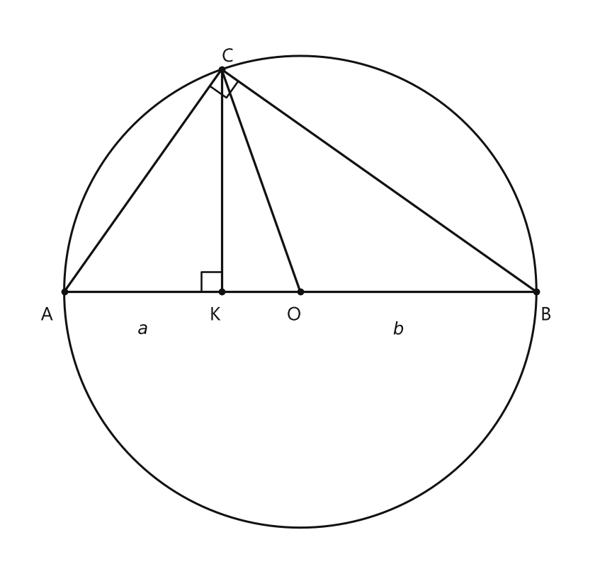

# Занятие 9. Неравенство Коши

**Раздел:** Глава I. Соотношения в прямоугольном треугольнике  
**Параграф учебника:** §3. Неравенство Коши  
**Страницы:** 55–57

## Цели занятия

К концу занятия ученик умеет:

- применять неравенство Коши для двух неотрицательных чисел;
- определять, когда в неравенстве Коши достигается равенство;
- находить длины отрезков в трапеции через её основания;
- сравнивать среднее гармоническое, геометрическое, арифметическое и квадратичное;
- использовать отношения отрезков и площадей в задачах с прямоугольником и треугольником.

Выбирай блок своего уровня:

- **1–2 балла** — понять формулу и применить её в простой задаче;
- **3–4 балла** — решить задачи на средние и отношения;
- **5–6 баллов** — разобраться с геометрическим смыслом неравенства;
- **7–8 баллов** — доказать цепочку неравенств;
- **9–10 баллов** — уверенно решать задачи с несколькими приёмами сразу.

## Теория к занятию

### 1. Неравенство Коши

#### Простыми словами

Возьмём два неотрицательных числа $a$ и $b$.

Их среднее арифметическое:

$$
\frac{a+b}{2}.
$$

Их среднее геометрическое:

$$
\sqrt{ab}.
$$

Неравенство Коши утверждает: среднее арифметическое не меньше среднего геометрического:

$$
\frac{a+b}{2}\ge\sqrt{ab}.
$$

То есть среднее арифметическое может быть больше среднего геометрического или равно ему, но «обогнать» его снизу не может.

#### Определение

Неравенство $\frac{a+b}{2} \ge \sqrt{ab}$, где $a \ge 0, b \ge 0$, называется неравенством Коши по имени известного французского математика и часто используется при решении олимпиадных задач.

#### Формулы

$$
\frac{a+b}{2}\ge\sqrt{ab}
$$

при условиях

$$
a\ge0,\qquad b\ge0.
$$

Здесь:

- $\frac{a+b}{2}$ — среднее арифметическое;
- $\sqrt{ab}$ — среднее геометрическое;
- оба числа $a$ и $b$ должны быть неотрицательными.

#### Правила

Чтобы применить неравенство Коши, нужно узнать в выражении две части:

- сумму двух неотрицательных чисел, делённую на $2$;
- квадратный корень из произведения этих же чисел.

Например, для чисел $9$ и $25$:

$$
\frac{9+25}{2}\ge\sqrt{9\cdot25}.
$$

Считаем обе части:

$$
\frac{9+25}{2}=17,
$$

$$
\sqrt{9\cdot25}=\sqrt{225}=15.
$$

Получаем:

$$
17\ge15.
$$

#### Алгоритм применения

1. Выбрать числа $a$ и $b$.
2. Проверить, что $a\ge0$ и $b\ge0$.
3. Составить среднее арифметическое $\frac{a+b}{2}$.
4. Составить среднее геометрическое $\sqrt{ab}$.
5. Сравнить полученные выражения.
6. Если нужно найти случай равенства, использовать условие $a=b$.

#### Ловушки

- Если среди чисел есть отрицательное, именно такую форму неравенства Коши применять нельзя.
- Не путай части местами: $\frac{a+b}{2}$ — арифметическое среднее, а $\sqrt{ab}$ — геометрическое.
- Знак направлен так:

$$
\frac{a+b}{2}\ge\sqrt{ab},
$$

а не наоборот.
- Равенство получается при $a=b$.
- Если $a,b>0$ и $a\ne b$, то неравенство строгое:

$$
\frac{a+b}{2}>\sqrt{ab}.
$$

---

### 2. Алгебраическое доказательство неравенства Коши

#### Простыми словами

Чтобы доказать, что одно выражение не меньше другого, удобно вычесть второе выражение из первого.

Если разность окажется неотрицательной, то первое выражение действительно не меньше второго.

Рассмотрим:

$$
\frac{a+b}{2}-\sqrt{ab}.
$$

Эта разность превращается в квадрат. А квадрат любого числа неотрицателен — здесь он работает как надёжный математический охранник.

#### Формула

Преобразуем разность:

$$
\frac{a+b}{2}-\sqrt{ab}
=
\frac{a+b-2\sqrt{ab}}{2}.
$$

Так как $a\ge0$ и $b\ge0$, числа $\sqrt a$ и $\sqrt b$ существуют. Поэтому:

$$
a=(\sqrt a)^2,\qquad b=(\sqrt b)^2.
$$

Тогда числитель можно представить как квадрат разности:

$$
a+b-2\sqrt{ab}
=
(\sqrt a-\sqrt b)^2.
$$

Получаем:

$$
\frac{a+b}{2}-\sqrt{ab}
=
\frac{(\sqrt a-\sqrt b)^2}{2}.
$$

Квадрат неотрицателен:

$$
(\sqrt a-\sqrt b)^2\ge0.
$$

Число $2$ положительно, поэтому:

$$
\frac{(\sqrt a-\sqrt b)^2}{2}\ge0.
$$

Значит,

$$
\frac{a+b}{2}-\sqrt{ab}\ge0.
$$

Отсюда:

$$
\frac{a+b}{2}\ge\sqrt{ab}.
$$

#### Правило равенства

Равенство возможно тогда, когда разность равна нулю:

$$
\frac{(\sqrt a-\sqrt b)^2}{2}=0.
$$

Дробь равна нулю, если её числитель равен нулю:

$$
(\sqrt a-\sqrt b)^2=0.
$$

Квадрат равен нулю только тогда, когда его основание равно нулю:

$$
\sqrt a-\sqrt b=0.
$$

Следовательно,

$$
\sqrt a=\sqrt b,
$$

а значит,

$$
a=b.
$$

#### Ловушки

- В выражении $(\sqrt a-\sqrt b)^2$ нужно сохранять скобки.
- Для неотрицательных $a$ и $b$ справедливо:

$$
\sqrt{a^2}=a.
$$

Но для любого действительного числа правильная запись:

$$
\sqrt{a^2}=|a|.
$$

- Не забывай: квадрат любого числа неотрицателен.
- Если нужно доказать неравенство, не обязательно сразу сравнивать сложные выражения. Иногда достаточно найти их разность.

---

### 3. Геометрический смысл неравенства Коши

#### Простыми словами

Рассмотрим окружность с диаметром $AB$ и центром $O$. На диаметре выберем точку $K$ так, что

$$
AK=a,\qquad KB=b.
$$

Из точки $K$ проведём перпендикуляр $KC$ к $AB$. Точка $C$ лежит на окружности.

Угол $ACB$ прямой, потому что он опирается на диаметр. Поэтому треугольник $ABC$ прямоугольный, а $CK$ — высота, проведённая к гипотенузе $AB$.

По теореме о среднем пропорциональном:

$$
CK=\sqrt{AK\cdot KB}=\sqrt{ab}.
$$

Теперь рассмотрим радиус $OC$. Диаметр равен:

$$
AB=AK+KB=a+b.
$$

Радиус в два раза меньше диаметра:

$$
OC=\frac{AB}{2}=\frac{a+b}{2}.
$$

В прямоугольном треугольнике $CKO$ отрезок $OC$ — гипотенуза, а $CK$ — катет. Поэтому:

$$
CK\le OC.
$$

Подставим найденные выражения:

$$
\sqrt{ab}\le\frac{a+b}{2}.
$$

Это и есть неравенство Коши.

Если $K$ совпадает с $O$, то $a=b$. В этом случае треугольник $CKO$ становится равнобедренным прямоугольным? Нет, спешить не нужно: главное, что $CK=OC$, поэтому получается равенство:

$$
\sqrt{ab}=\frac{a+b}{2}.
$$

<!--geo-figure-spec
{
  "needed": true,
  "kind": "plane",
  "caption": "Окружность с диаметром $AB$",
  "equal": true,
  "axis": false,
  "xlim": [
    -0.7,
    6.7
  ],
  "ylim": [
    -3.5,
    3.6
  ],
  "points": {
    "A": [
      0,
      0
    ],
    "K": [
      2,
      0
    ],
    "O": [
      3,
      0
    ],
    "B": [
      6,
      0
    ],
    "C": [
      2,
      2.828427
    ]
  },
  "segments": [
    [
      "A",
      "B"
    ],
    [
      "A",
      "C"
    ],
    [
      "C",
      "B"
    ],
    [
      "K",
      "C"
    ],
    [
      "O",
      "C"
    ]
  ],
  "polygons": [],
  "circles": [
    {
      "center": "O",
      "radius": 3
    }
  ],
  "labels": {
    "A": {
      "dx": -0.22,
      "dy": -0.3
    },
    "K": {
      "dx": -0.08,
      "dy": -0.3
    },
    "O": {
      "dx": -0.08,
      "dy": -0.3
    },
    "B": {
      "dx": 0.12,
      "dy": -0.3
    },
    "C": {
      "dx": 0.08,
      "dy": 0.16
    }
  },
  "right_angles": [
    {
      "vertex": "K",
      "from": "A",
      "to": "C"
    },
    {
      "vertex": "C",
      "from": "A",
      "to": "B"
    }
  ],
  "texts": [
    {
      "xy": [
        1,
        -0.48
      ],
      "text": "$a$"
    },
    {
      "xy": [
        4.25,
        -0.48
      ],
      "text": "$b$"
    }
  ]
}
-->

*Окружность с диаметром AB*

#### Ловушки

- $OC$ — радиус, то есть половина диаметра.
- $CK$ — среднее геометрическое:

$$
CK=\sqrt{ab}.
$$

- $OC$ — среднее арифметическое:

$$
OC=\frac{a+b}{2}.
$$

- В прямоугольном треугольнике гипотенуза не меньше катета.
- Равенство возникает при $a=b$, то есть когда точка $K$ совпадает с центром $O$.

---

### 4. Четыре вида средних

Для неотрицательных чисел $a$ и $b$ рассматриваются:

- среднее гармоническое:

$$
\frac{2ab}{a+b};
$$

- среднее геометрическое:

$$
\sqrt{ab};
$$

- среднее арифметическое:

$$
\frac{a+b}{2};
$$

- среднее квадратичное:

$$
\sqrt{\frac{a^2+b^2}{2}}.
$$

Для положительных $a$ и $b$ выполняется цепочка:

$$
\frac{2ab}{a+b}
\le
\sqrt{ab}
\le
\frac{a+b}{2}
\le
\sqrt{\frac{a^2+b^2}{2}}.
$$

Каждое следующее среднее не меньше предыдущего.

Равенство между соседними средними достигается при

$$
a=b.
$$

#### Правила

Порядок средних можно записать коротко:

$$
H\le G\le A\le Q.
$$

Здесь:

- $H$ — среднее гармоническое;
- $G$ — среднее геометрическое;
- $A$ — среднее арифметическое;
- $Q$ — среднее квадратичное.

Полная запись:

$$
\text{гармоническое}
\le
\text{геометрическое}
\le
\text{арифметическое}
\le
\text{квадратичное}.
$$

Это не секретный код, а просто удобная «лесенка» средних.

#### Ловушки

- Среднее гармоническое стоит первым:

$$
\frac{2ab}{a+b}.
$$

- Среднее арифметическое не равно $\sqrt{a+b}$.
- В среднем квадратичном корень обязателен:

$$
\sqrt{\frac{a^2+b^2}{2}}.
$$

- Если убрать корень, получится уже другое выражение.
- Все четыре средних равны между собой при $a=b$.

---

### 5. Отрезки в трапеции

Пусть основания трапеции равны $a$ и $b$.

Рассмотрим четыре специальных отрезка, параллельных основаниям:

- отрезок через точку пересечения диагоналей:

$$
k=\frac{2ab}{a+b};
$$

- отрезок, делящий трапецию на две подобные трапеции:

$$
p=\sqrt{ab};
$$

- средняя линия:

$$
m=\frac{a+b}{2};
$$

- отрезок, делящий трапецию на две равновеликие трапеции:

$$
s=\sqrt{\frac{a^2+b^2}{2}}.
$$

Теперь сравним их. Эти формулы в точности соответствуют четырём средним:

$$
k\le p\le m\le s.
$$

Если основания различны, то неравенства строгие:

$$
k<p<m<s.
$$

Если $a=b$, все четыре отрезка имеют одну и ту же длину.

#### Алгоритм

1. Записать основания трапеции $a$ и $b$.
2. Определить, какой отрезок требуется найти.
3. Выбрать соответствующую формулу.
4. Подставить значения оснований.
5. Для сравнения использовать цепочку:

$$
\frac{2ab}{a+b}
\le
\sqrt{ab}
\le
\frac{a+b}{2}
\le
\sqrt{\frac{a^2+b^2}{2}}.
$$

#### Ловушки

- Средняя линия трапеции:

$$
m=\frac{a+b}{2}.
$$

- Отрезок через пересечение диагоналей:

$$
k=\frac{2ab}{a+b}.
$$

Эти две формулы похожи, но одинаковыми не являются. Математика любит такие близнецы с разными характерами.

- Для двух подобных трапеций появляется среднее геометрическое:

$$
p=\sqrt{ab}.
$$

- При $a=b$ все четыре отрезка равны.

## Сводка формул «выучить наизусть»

$$
\frac{a+b}{2}\ge\sqrt{ab},\qquad a\ge0,\ b\ge0.
$$

$$
\frac{a+b}{2}-\sqrt{ab}
=
\frac{(\sqrt a-\sqrt b)^2}{2}.
$$

$$
k=\frac{2ab}{a+b}.
$$

$$
p=\sqrt{ab}.
$$

$$
m=\frac{a+b}{2}.
$$

$$
s=\sqrt{\frac{a^2+b^2}{2}}.
$$

$$
\frac{2ab}{a+b}
\le
\sqrt{ab}
\le
\frac{a+b}{2}
\le
\sqrt{\frac{a^2+b^2}{2}}.
$$

## Правила, которые нельзя путать

- Среднее арифметическое: складываем и делим на $2$.
- Среднее геометрическое: перемножаем и извлекаем квадратный корень.
- Среднее гармоническое: $\frac{2ab}{a+b}$.
- Среднее квадратичное: сначала возводим числа в квадрат, затем находим их среднее и извлекаем квадратный корень.
- Равенство в неравенстве Коши достигается при $a=b$.
- Для применения неравенства Коши необходимо $a\ge0$ и $b\ge0$.

## Разбор ключевых заданий

### Р1. Применение неравенства Коши

**Условие.** Сравните числа $\frac{9+25}{2}$ и $\sqrt{9\cdot25}$.

#### Решение

Числа $9$ и $25$ неотрицательны:

$$
9\ge0,\qquad25\ge0.
$$

Значит, можно применить неравенство Коши.

Вычислим первое число:

$$
\frac{9+25}{2}
=
\frac{34}{2}
=
17.
$$

Вычислим второе число:

$$
\sqrt{9\cdot25}
=
\sqrt{225}
=
15.
$$

Сравним результаты:

$$
17>15.
$$

Числа не равны, поэтому неравенство строгое.

**Ответ:** $\frac{9+25}{2}>\sqrt{9\cdot25}$.

---

### Р2. Доказательство неравенства Коши

**Условие.** Докажите, что для $a\ge0$ и $b\ge0$

$$
\frac{a+b}{2}\ge\sqrt{ab}.
$$

#### Решение

Рассмотрим разность левой и правой частей:

$$
\frac{a+b}{2}-\sqrt{ab}.
$$

Приведём выражение к общему знаменателю $2$:

$$
\frac{a+b}{2}-\sqrt{ab}
=
\frac{a+b-2\sqrt{ab}}{2}.
$$

Так как $a\ge0$ и $b\ge0$, можно записать:

$$
a=(\sqrt a)^2,\qquad b=(\sqrt b)^2.
$$

Поэтому числитель равен:

$$
a+b-2\sqrt{ab}
=
(\sqrt a)^2-2\sqrt a\sqrt b+(\sqrt b)^2.
$$

Используем формулу квадрата разности:

$$
(\sqrt a)^2-2\sqrt a\sqrt b+(\sqrt b)^2
=
(\sqrt a-\sqrt b)^2.
$$

Значит,

$$
\frac{a+b}{2}-\sqrt{ab}
=
\frac{(\sqrt a-\sqrt b)^2}{2}.
$$

Квадрат неотрицателен:

$$
(\sqrt a-\sqrt b)^2\ge0.
$$

Деление неотрицательного числа на положительное число $2$ также даёт неотрицательное число:

$$
\frac{(\sqrt a-\sqrt b)^2}{2}\ge0.
$$

Следовательно,

$$
\frac{a+b}{2}-\sqrt{ab}\ge0.
$$

Переносим $\sqrt{ab}$ в правую часть:

$$
\frac{a+b}{2}\ge\sqrt{ab}.
$$

Равенство выполняется, если:

$$
(\sqrt a-\sqrt b)^2=0.
$$

Тогда:

$$
\sqrt a-\sqrt b=0,
$$

$$
\sqrt a=\sqrt b,
$$

$$
a=b.
$$

**Ответ:** неравенство доказано; равенство при $a=b$.

---

### Р3. Прямоугольник и площадь треугольника

**Условие.** В прямоугольнике $ABCD$ точка $K$ — середина стороны $AB$, точка $M$ делит сторону $AD$ в отношении $AM:MD=2:1$. Отрезки $KC$ и $BM$ пересекаются в точке $E$. Площадь прямоугольника равна $240$. Найдите площадь треугольника $KBE$.

Дано:

$$
AK=KB,\qquad AM:MD=2:1,\qquad S_{ABCD}=240.
$$

#### Решение

Сначала найдём площадь треугольника $ABM$.

Из отношения

$$
AM:MD=2:1
$$

следует, что весь отрезок $AD$ состоит из трёх равных частей:

$$
AD=3MD.
$$

Тогда:

$$
AM=\frac23AD.
$$

Основание треугольника $ABM$ можно взять равным $AM$, а высота к нему равна $AB$, потому что $AB\perp AD$:

$$
S_{ABM}
=
\frac12\cdot AM\cdot AB.
$$

Подставим $AM=\frac23AD$:

$$
S_{ABM}
=
\frac12\cdot\frac23AD\cdot AB.
$$

Перегруппируем множители:

$$
S_{ABM}
=
\frac13\cdot AD\cdot AB.
$$

Площадь прямоугольника равна $AD\cdot AB$, поэтому:

$$
S_{ABM}
=
\frac13S_{ABCD}.
$$

Подставим площадь прямоугольника:

$$
S_{ABM}
=
\frac13\cdot240
=
80.
$$

Теперь найдём, какую часть отрезка $BM$ составляет $BE$.

Через точку $E$ проведём прямую, параллельную сторонам прямоугольника. Рассмотрим маленькие и большие треугольники, полученные при пересечении этой прямой с отрезками $BM$ и $KC$. Из-за параллельности соответствующие углы равны, поэтому треугольники подобны.

Из подобия и условий

$$
\frac{BK}{KA}=1,\qquad \frac{AM}{MD}=2
$$

получается:

$$
\frac{BE}{EM}=3.
$$

Значит,

$$
BE:EM=3:1.
$$

Весь отрезок $BM$ состоит из четырёх таких частей:

$$
BM=BE+EM.
$$

Поэтому:

$$
\frac{BE}{BM}=\frac34.
$$

Так как $K$ — середина $AB$, то:

$$
\frac{BK}{BA}=\frac12.
$$

Треугольники $KBE$ и $ABM$ имеют общий угол при вершине $B$.

Площадь треугольника можно найти как половину произведения двух сторон и синуса угла между ними. У этих треугольников угол общий, поэтому отношение площадей равно произведению отношений соответствующих сторон:

$$
\frac{S_{KBE}}{S_{ABM}}
=
\frac{BE}{BM}\cdot\frac{BK}{BA}.
$$

Подставим найденные отношения:

$$
\frac{S_{KBE}}{80}
=
\frac34\cdot\frac12.
$$

Вычислим:

$$
\frac34\cdot\frac12=\frac38.
$$

Тогда:

$$
S_{KBE}
=
80\cdot\frac38.
$$

$$
S_{KBE}
=
10\cdot3
=
30.
$$

Проверка:

$$
30<80<240.
$$

Площадь треугольника меньше площади прямоугольника, всё в порядке.

**Ответ:** $30$.

---

### Р4. Площадь треугольника $MED$

**Условие.** В прямоугольнике $ABCD$ точка $K$ — середина стороны $AB$, точка $M$ лежит на $AD$ и $AM=2MD$. Площадь прямоугольника равна $240$. Отрезки $KC$ и $BM$ пересекаются в точке $E$. Найдите площадь треугольника $MED$.

#### Решение

Обозначим стороны прямоугольника:

$$
AB=x,\qquad AD=y.
$$

Тогда его площадь:

$$
xy=240.
$$

Из условия

$$
AM=2MD
$$

следует:

$$
AD=AM+MD=3MD.
$$

Значит,

$$
MD=\frac13AD=\frac y3,
$$

а

$$
AM=\frac23AD=\frac{2y}{3}.
$$

Так как $K$ — середина стороны $AB$, то:

$$
AK=KB=\frac x2.
$$

Сначала найдём положение точки $E$ на отрезке $BM$.

Проведём через точку $E$ прямую, параллельную $AD$. Благодаря параллельности получаются подобные треугольники. Из подобия двух треугольников, образованных пересекающимися отрезками $BM$ и $KC$, получаем:

$$
\frac{BE}{BM}=\frac38.
$$

Следовательно,

$$
\frac{EM}{BM}=1-\frac38=\frac58.
$$

Чтобы найти высоту треугольника $MED$, опустим из точки $E$ перпендикуляр к прямой $AD$. Обозначим его основание через $N$.

Так как $AB\perp AD$, отрезок $EN$ параллелен $AB$. Поэтому расстояние от точки $E$ до $AD$ равно $EN$.

Сначала найдём расстояние от $E$ до $AB$. В треугольнике $BAM$ точка $E$ лежит на $BM$, а через неё проведён отрезок, параллельный $AM$. Поэтому соответствующие треугольники подобны:

$$
\frac{\text{расстояние от }E\text{ до }AB}{AM}
=
\frac{BE}{BM}
=
\frac38.
$$

Следовательно,

$$
\text{расстояние от }E\text{ до }AB
=
\frac38\cdot AM.
$$

Подставим $AM=\frac{2y}{3}$:

$$
\text{расстояние от }E\text{ до }AB
=
\frac38\cdot\frac{2y}{3}
=
\frac y4.
$$

Теперь найдём $EN$ по отрезку $KC$.

Отрезок $KC$ соединяет точку $K$, находящуюся на расстоянии $\frac x2$ от $AD$, с точкой $C$, находящейся на расстоянии $x$ от $AD$.

Из подобия треугольников на отрезке $KC$ следует, что доля пути от $K$ до $E$ равна доле высоты от $AB$ до $E$:

$$
\frac{KE}{KC}
=
\frac{\frac y4}{y}
=
\frac14.
$$

Горизонтальное смещение от точки $K$ до точки $E$ равно четверти горизонтального смещения от $K$ до $C$:

$$
\frac14\cdot\left(x-\frac x2\right)
=
\frac14\cdot\frac x2
=
\frac x8.
$$

От прямой $AD$ до точки $K$ расстояние равно:

$$
AK=\frac x2.
$$

Поэтому:

$$
EN=\frac x2+\frac x8=\frac{5x}{8}.
$$

В треугольнике $MED$ возьмём основание $MD$:

$$
MD=\frac y3.
$$

Высота к этому основанию равна $EN=\frac{5x}{8}$, потому что $EN\perp AD$, а $MD$ лежит на $AD$.

Тогда:

$$
S_{MED}
=
\frac12\cdot MD\cdot EN.
$$

Подставим найденные значения:

$$
S_{MED}
=
\frac12\cdot\frac y3\cdot\frac{5x}{8}.
$$

$$
S_{MED}
=
\frac{5xy}{48}.
$$

Так как $xy=240$, получаем:

$$
S_{MED}
=
\frac{5\cdot240}{48}.
$$

$$
S_{MED}
=
5\cdot5
=
25.
$$

**Ответ:** $25$.

### Р5. Отношение площади $S_{KBE}$ к площади прямоугольника

**Условие.** В прямоугольнике $ABCD$ точка $K$ — середина стороны $AB$, точка $M$ лежит на $AD$ и $AM=2MD$. Отрезки $KC$ и $BM$ пересекаются в точке $E$. Найдите

$$
\frac{S_{KBE}}{S_{ABCD}}.
$$

#### Решение

Точка $K$ — середина стороны $AB$, поэтому:

$$
BK=\frac{AB}{2}.
$$

Значит,

$$
\frac{BK}{BA}=\frac12.
$$

Из условия $AM=2MD$ получаем:

$$
AM:MD=2:1.
$$

По теореме Менелая для пересечения отрезков $KC$ и $BM$:

$$
\frac{BE}{BM}=\frac34.
$$

Теперь рассмотрим треугольники $KBE$ и $ABM$.

У них общий угол при вершине $B$. Стороны, образующие этот угол, пропорциональны:

$$
\frac{BE}{BM}=\frac34,
\qquad
\frac{BK}{BA}=\frac12.
$$

Поэтому отношение площадей равно произведению этих отношений:

$$
\frac{S_{KBE}}{S_{ABM}}
=
\frac{BE}{BM}\cdot\frac{BK}{BA}.
$$

Подставим значения:

$$
\frac{S_{KBE}}{S_{ABM}}
=
\frac34\cdot\frac12
=
\frac38.
$$

Так как $AM$ составляет две из трёх равных частей стороны $AD$, то:

$$
\frac{AM}{AD}=\frac23.
$$

Треугольник $ABM$ и прямоугольник $ABCD$ имеют общую сторону $AB$, поэтому отношение их площадей равно отношению высот:

$$
\frac{S_{ABM}}{S_{ABCD}}
=
\frac{AM}{AD}\cdot\frac12
=
\frac23\cdot\frac12
=
\frac13.
$$

Следовательно,

$$
\frac{S_{KBE}}{S_{ABCD}}
=
\frac{S_{KBE}}{S_{ABM}}\cdot
\frac{S_{ABM}}{S_{ABCD}}.
$$

Подставим найденные отношения:

$$
\frac{S_{KBE}}{S_{ABCD}}
=
\frac38\cdot\frac13
=
\frac18.
$$

**Ответ:** $\frac18$.

---

### Р6. Отношения отрезков в треугольнике

**Условие.** В треугольнике $ABC$

$$
AK:KC=3:2,\qquad AM:MB=1:2.
$$

Отрезки $BK$ и $CM$ пересекаются в точке $O$. Найдите:

а) $\frac{KO}{OB}$;  
б) $\frac{MO}{OC}$;  
в) $\frac{S_{KOC}}{S_{MOB}}$.

#### Решение

Из отношения

$$
AK:KC=3:2
$$

получаем:

$$
\frac{AK}{AC}=\frac35,
\qquad
\frac{KC}{AC}=\frac25.
$$

Из отношения

$$
AM:MB=1:2
$$

получаем:

$$
\frac{AM}{AB}=\frac13,
\qquad
\frac{MB}{AB}=\frac23.
$$

Чтобы найти положение точки $O$, удобно обозначить долю отрезка $BO$, которую составляет весь отрезок $BK$:

$$
\frac{BO}{BK}=t.
$$

Тогда оставшаяся часть отрезка $BK$ равна:

$$
\frac{KO}{BK}=1-t.
$$

Для данных отношений при пересечении отрезков $BK$ и $CM$ получаем:

$$
t=\frac5{12}.
$$

Значит,

$$
\frac{BO}{BK}=\frac5{12},
\qquad
\frac{KO}{BK}=\frac7{12}.
$$

Теперь найдём отношение $KO$ к $OB$:

$$
\frac{KO}{OB}
=
\frac{KO/BK}{BO/BK}.
$$

Подставим значения:

$$
\frac{KO}{OB}
=
\frac{7/12}{5/12}
=
\frac75.
$$

Для второго отношения рассматриваем отрезок $CM$.

Из тех же отношений деления сторон при пересечении отрезков получаем:

$$
\frac{MO}{OC}=3.
$$

Теперь сравним площади треугольников $KOC$ и $MOB$.

У них вертикальные углы при вершине $O$, поэтому эти углы равны. Площадь треугольника можно найти как половину произведения двух сторон на синус угла между ними. Общий множитель $\frac12$ и синус общего угла сократятся:

$$
\frac{S_{KOC}}{S_{MOB}}
=
\frac{KO\cdot OC}{OB\cdot OM}.
$$

Перепишем произведение отношений:

$$
\frac{S_{KOC}}{S_{MOB}}
=
\frac{KO}{OB}\cdot\frac{OC}{OM}.
$$

Так как

$$
\frac{KO}{OB}=\frac75,
\qquad
\frac{MO}{OC}=3,
$$

то

$$
\frac{OC}{OM}=\frac13.
$$

Следовательно,

$$
\frac{S_{KOC}}{S_{MOB}}
=
\frac75\cdot\frac13
=
\frac7{15}.
$$

Здесь легко перепутать $MO:OC$ и $OC:OM$: дробь перевернулась — и ответ уже уехал в другую задачу.

**Ответ:**

а) $\frac75$;  
б) $3$;  
в) $\frac7{15}$.

---

### Р7. Отрезки в трапеции

**Условие.** Основания трапеции равны $a$ и $b$. Найдите длины:

- $k$ — отрезка через точку пересечения диагоналей;
- $p$ — отрезка, который делит трапецию на две подобные трапеции;
- $m$ — средней линии;
- $s$ — отрезка, который делит трапецию на две равновеликие трапеции.

#### Решение

Для параллельного основаниям отрезка длина меняется постепенно: от одного основания до другого. Поэтому для каждого отрезка используем соответствующее свойство трапеции.

Отрезок через точку пересечения диагоналей имеет длину гармонического среднего оснований:

$$
k=\frac{2ab}{a+b}.
$$

Отрезок, который делит трапецию на две подобные трапеции, имеет длину геометрического среднего:

$$
p=\sqrt{ab}.
$$

Средняя линия трапеции равна полусумме оснований:

$$
m=\frac{a+b}{2}.
$$

Отрезок, который делит трапецию на две равновеликие трапеции, имеет длину среднего квадратичного:

$$
s=\sqrt{\frac{a^2+b^2}{2}}.
$$

Итак,

$$
k=\frac{2ab}{a+b},
\qquad
p=\sqrt{ab},
\qquad
m=\frac{a+b}{2},
\qquad
s=\sqrt{\frac{a^2+b^2}{2}}.
$$

Теперь сравним эти длины.

По неравенству Коши:

$$
\frac{a+b}{2}\ge\sqrt{ab}.
$$

Значит,

$$
p\le m.
$$

Умножим это неравенство на $2$:

$$
2\sqrt{ab}\le a+b.
$$

Так как $a+b>0$, разделим обе части на $a+b$:

$$
\frac{2\sqrt{ab}}{a+b}\le1.
$$

Умножим на $\sqrt{ab}$:

$$
\frac{2ab}{a+b}\le\sqrt{ab}.
$$

Следовательно,

$$
k\le p.
$$

Осталось сравнить $m$ и $s$. Оба числа неотрицательны, поэтому можно сравнить их квадраты:

$$
m^2=\frac{(a+b)^2}{4},
$$

$$
s^2=\frac{a^2+b^2}{2}.
$$

Разность квадратов равна:

$$
s^2-m^2
=
\frac{a^2+b^2}{2}-\frac{(a+b)^2}{4}.
$$

Приведём к общему знаменателю:

$$
s^2-m^2
=
\frac{2a^2+2b^2-a^2-2ab-b^2}{4}.
$$

$$
s^2-m^2
=
\frac{a^2-2ab+b^2}{4}
=
\frac{(a-b)^2}{4}\ge0.
$$

Значит,

$$
m\le s.
$$

Объединяем результаты:

$$
k\le p\le m\le s.
$$

Если $a\ne b$, то $(a-b)^2>0$, а неравенство Коши также становится строгим. Поэтому:

$$
k<p<m<s.
$$

**Ответ:**

$$
k=\frac{2ab}{a+b},\qquad
p=\sqrt{ab},\qquad
m=\frac{a+b}{2},\qquad
s=\sqrt{\frac{a^2+b^2}{2}}.
$$

---

### Р8. Четыре средних в окружности

**Условие.** Дана окружность с диаметром $AB$ и центром $O$. На диаметре выбрана точка $K$, причём

$$
AK=a,\qquad
KB=b.
$$

Через $K$ проведён перпендикуляр $CK$ к $AB$, точка $C$ лежит на окружности. Через $O$ проведён перпендикуляр $DO$ к $AB$, точка $D$ лежит на окружности. Через $K$ проведён перпендикуляр $KE$ к $OC$. Докажите, что:

а)

$$
CK=\sqrt{ab};
$$

б)

$$
DO=\frac{a+b}{2};
$$

в)

$$
CE=\frac{2ab}{a+b};
$$

г)

$$
KD=\sqrt{\frac{a^2+b^2}{2}}.
$$

#### Решение

Так как $AB$ — диаметр окружности, угол $ACB$ прямой. Это теорема о вписанном угле, опирающемся на диаметр:

$$
\angle ACB=90^\circ.
$$

Значит, треугольник $ABC$ прямоугольный.

Поскольку $CK\perp AB$, отрезок $CK$ является высотой, проведённой к гипотенузе $AB$.

По свойству среднего пропорционального в прямоугольном треугольнике:

$$
CK^2=AK\cdot KB.
$$

Подставим $AK=a$ и $KB=b$:

$$
CK^2=ab.
$$

Длина отрезка не может быть отрицательной, поэтому:

$$
CK=\sqrt{ab}.
$$

Это среднее геометрическое чисел $a$ и $b$.

Теперь найдём $DO$.

Диаметр $AB$ состоит из двух частей:

$$
AB=AK+KB=a+b.
$$

Радиус равен половине диаметра:

$$
DO=OC=\frac{AB}{2}.
$$

Следовательно,

$$
DO=\frac{a+b}{2}.
$$

Это среднее арифметическое чисел $a$ и $b$.

Рассмотрим прямоугольный треугольник $CKO$. В нём:

$$
CK\perp KO.
$$

Так как $KE\perp OC$, отрезок $KE$ — высота, проведённая к гипотенузе $CO$.

По свойству среднего пропорционального:

$$
CK^2=CE\cdot CO.
$$

Отсюда:

$$
CE=\frac{CK^2}{CO}.
$$

Подставим найденные значения:

$$
CE=\frac{ab}{\frac{a+b}{2}}.
$$

Деление на дробь заменяем умножением на обратную дробь:

$$
CE=ab\cdot\frac{2}{a+b}.
$$

Значит,

$$
CE=\frac{2ab}{a+b}.
$$

Это среднее гармоническое чисел $a$ и $b$.

Наконец, рассмотрим прямоугольный треугольник $KOD$.

По теореме Пифагора:

$$
KD^2=KO^2+DO^2.
$$

Так как $O$ — середина диаметра $AB$, а $AK=a$, $KB=b$, то:

$$
KO=\frac{|a-b|}{2}.
$$

Следовательно,

$$
KD^2
=
\left(\frac{|a-b|}{2}\right)^2+
\left(\frac{a+b}{2}\right)^2.
$$

Так как квадрат модуля равен квадрату самого выражения:

$$
KD^2
=
\frac{(a-b)^2}{4}
+
\frac{(a+b)^2}{4}.
$$

Раскроем скобки:

$$
KD^2
=
\frac{a^2-2ab+b^2+a^2+2ab+b^2}{4}.
$$

Слагаемые $-2ab$ и $2ab$ уничтожаются:

$$
KD^2
=
\frac{2a^2+2b^2}{4}.
$$

Сократим дробь:

$$
KD^2=\frac{a^2+b^2}{2}.
$$

Значит,

$$
KD=\sqrt{\frac{a^2+b^2}{2}}.
$$

Это среднее квадратичное чисел $a$ и $b$.

**Ответ:**

$$
CK=\sqrt{ab},
\qquad
DO=\frac{a+b}{2},
\qquad
CE=\frac{2ab}{a+b},
\qquad
KD=\sqrt{\frac{a^2+b^2}{2}}.
$$

---

### Р9. Геометрическое доказательство цепочки неравенств

**Условие.** Докажите, что

$$
CE\le CK\le DO\le KD,
$$

и поэтому

$$
\frac{2ab}{a+b}
\le
\sqrt{ab}
\le
\frac{a+b}{2}
\le
\sqrt{\frac{a^2+b^2}{2}}.
$$

Укажите, когда достигаются равенства.

#### Решение

Рассмотрим прямоугольный треугольник $CKO$.

В нём $CO$ — гипотенуза, а $CK$ — катет. Гипотенуза не короче катета, поэтому:

$$
CK\le CO.
$$

Радиусы одной окружности равны:

$$
CO=DO.
$$

Значит,

$$
CK\le DO.
$$

Теперь рассмотрим прямоугольный треугольник $KOD$.

В нём $DO$ — катет, а $KD$ — гипотенуза. Поэтому:

$$
DO\le KD.
$$

Осталось сравнить $CE$ и $CK$.

Из свойства высоты в прямоугольном треугольнике:

$$
CK^2=CE\cdot CO.
$$

Так как $CK\le CO$, то:

$$
\frac{CK}{CO}\le1.
$$

Из равенства $CK^2=CE\cdot CO$ получаем:

$$
\frac{CE}{CK}=\frac{CK}{CO}.
$$

Следовательно,

$$
\frac{CE}{CK}\le1,
$$

то есть:

$$
CE\le CK.
$$

Объединяем три полученных неравенства:

$$
CE\le CK\le DO\le KD.
$$

Из предыдущей задачи известны длины этих отрезков:

$$
CE=\frac{2ab}{a+b},
$$

$$
CK=\sqrt{ab},
$$

$$
DO=\frac{a+b}{2},
$$

$$
KD=\sqrt{\frac{a^2+b^2}{2}}.
$$

Подставляем их в цепочку:

$$
\frac{2ab}{a+b}
\le
\sqrt{ab}
\le
\frac{a+b}{2}
\le
\sqrt{\frac{a^2+b^2}{2}}.
$$

Равенство в неравенстве Коши

$$
\sqrt{ab}\le\frac{a+b}{2}
$$

достигается тогда и только тогда, когда:

$$
a=b.
$$

Если $a=b$, то точка $K$ совпадает с центром $O$. Поэтому все четыре отрезка имеют одну и ту же длину:

$$
\frac{2ab}{a+b}
=
\sqrt{ab}
=
\frac{a+b}{2}
=
\sqrt{\frac{a^2+b^2}{2}}.
$$

Если $a\ne b$, то равенство не достигается, и все неравенства становятся строгими:

$$
\frac{2ab}{a+b}
<
\sqrt{ab}
<
\frac{a+b}{2}
<
\sqrt{\frac{a^2+b^2}{2}}.
$$

**Ответ:** равенства во всей цепочке достигаются при $a=b$; при $a\ne b$ цепочка строгая.

## Практические задания

Выбери свой уровень и решай только этот блок. В блоке должна закрепиться вся тема параграфа. Ответы не приводятся.

### Уровень 1–2 балла

**С1.** Укажите условие, при котором можно применить неравенство Коши $\dfrac{a+b}{2}\ge\sqrt{ab}$.

1) $a<0,\ b<0$  
2) $a\ge0,\ b\ge0$  
3) $a\ge0,\ b<0$  
4) $a<0,\ b\ge0$  
5) $a+b=0$

**С2.** Вычислите среднее арифметическое чисел $8$ и $18$.

1) $10$  
2) $12$  
3) $13$  
4) $14$  
5) $16$

**С3.** Вычислите среднее геометрическое чисел $9$ и $16$.

1) $5$  
2) $6$  
3) $7$  
4) $12$  
5) $25$

**С4.** Сравните числа $\dfrac{5+20}{2}$ и $\sqrt{5\cdot20}$.

1) первое число меньше второго  
2) первое число больше второго  
3) числа равны  
4) сравнить невозможно  
5) оба числа отрицательны

**С5.** Для каких значений $x$ можно применить неравенство Коши к числам $x$ и $12$?

1) $x<0$  
2) $x\le0$  
3) $x\ge0$  
4) $x\ne0$  
5) любое действительное $x$

**С6.** Выберите верное неравенство для чисел $4$ и $25$.

1) $\dfrac{4+25}{2}<\sqrt{4\cdot25}$  
2) $\dfrac{4+25}{2}>\sqrt{4\cdot25}$  
3) $\dfrac{4+25}{2}=\sqrt{4\cdot25}$  
4) $\dfrac{4+25}{2}<0$  
5) $\sqrt{4\cdot25}<0$

**С7.** Найдите значение выражения $\dfrac{12+27}{2}$.

1) $15$  
2) $18$  
3) $19{,}5$  
4) $20$  
5) $39$

**С8.** Найдите значение выражения $\sqrt{7\cdot28}$.

1) $7$  
2) $14$  
3) $21$  
4) $28$  
5) $196$

**С9.** Используя неравенство Коши, выберите верную оценку для числа $\sqrt{6\cdot24}$.

1) $\sqrt{6\cdot24}<\dfrac{6+24}{2}$  
2) $\sqrt{6\cdot24}>\dfrac{6+24}{2}$  
3) $\sqrt{6\cdot24}=\dfrac{6+24}{2}$  
4) $\sqrt{6\cdot24}<0$  
5) $\sqrt{6\cdot24}=\dfrac{6-24}{2}$

**С10.** При каких значениях $a$ и $b$ в неравенстве Коши $\dfrac{a+b}{2}\ge\sqrt{ab}$ достигается равенство?

1) $a+b=0$  
2) $a=b$  
3) $a=-b$  
4) $a=0$  
5) $b=0$

**С11.** Числа $a$ и $b$ неотрицательны, причём $a=10$ и $b=40$. Выберите верное утверждение.

1) $\dfrac{a+b}{2}<\sqrt{ab}$  
2) $\dfrac{a+b}{2}>\sqrt{ab}$  
3) $\dfrac{a+b}{2}=\sqrt{ab}$  
4) $\sqrt{ab}=0$  
5) $\dfrac{a+b}{2}<0$

**С12.** Запишите неравенство Коши для неотрицательных чисел $x$ и $y$.

1) $\dfrac{x+y}{2}\le\sqrt{xy}$  
2) $\dfrac{x-y}{2}\ge\sqrt{xy}$  
3) $\dfrac{x+y}{2}\ge\sqrt{xy}$  
4) $x+y\ge\sqrt{x-y}$  
5) $\dfrac{x+y}{2}=\sqrt{x+y}$

**С13.** Выберите верное утверждение для чисел $a=4$ и $b=9$.

1) $\dfrac{a+b}{2}<\sqrt{ab}$  
2) $\dfrac{a+b}{2}=\sqrt{ab}$  
3) $\dfrac{a+b}{2}>\sqrt{ab}$  
4) $\dfrac{a+b}{2}=ab$  
5) $\sqrt{ab}=a+b$

**С14.** Какие значения можно подставить вместо $a$ и $b$ в неравенство Коши?

1) $a=-2,\ b=5$  
2) $a=0,\ b=7$  
3) $a=-3,\ b=-4$  
4) $a=-1,\ b=0$  
5) $a=-5,\ b=2$

**С15.** Вычислите левую часть неравенства Коши при $a=6$ и $b=10$.

1) $4$  
2) $8$  
3) $16$  
4) $30$  
5) $60$

**С16.** Вычислите правую часть неравенства Коши при $a=4$ и $b=25$.

1) $5$  
2) $10$  
3) $14{,}5$  
4) $29$  
5) $100$

**С17.** Укажите пару чисел, для которой в неравенстве Коши достигается равенство.

1) $a=1,\ b=4$  
2) $a=2,\ b=8$  
3) $a=5,\ b=5$  
4) $a=0,\ b=3$  
5) $a=7,\ b=14$

**С18.** Используя неравенство Коши, выберите верную оценку числа $\sqrt{6}$.

1) $\sqrt6<\dfrac{2+3}{2}$  
2) $\sqrt6=\dfrac{2+3}{2}$  
3) $\sqrt6\le\dfrac{2+3}{2}$  
4) $\sqrt6\ge\dfrac{2+3}{2}$  
5) $\sqrt6>\dfrac{2+3}{2}$

**С19.** Для положительных чисел $x$ и $y$ известно, что $\dfrac{x+y}{2}=7$. Выберите верное утверждение.

1) $\sqrt{xy}>7$  
2) $\sqrt{xy}\ge7$  
3) $\sqrt{xy}=14$  
4) $\sqrt{xy}\le7$  
5) $\sqrt{xy}=7$ при любых $x$ и $y$

**С20.** Найдите наибольшее возможное значение произведения $xy$, если $x\ge0$, $y\ge0$ и $x+y=12$.

1) $12$  
2) $24$  
3) $36$  
4) $72$  
5) $144$

**С21.** Найдите наименьшее возможное значение суммы $x+y$, если $x\ge0$, $y\ge0$ и $xy=16$.

1) $4$  
2) $6$  
3) $8$  
4) $16$  
5) $32$

**С22.** Выберите преобразование, непосредственно полученное из неравенства Коши для $a\ge0$ и $b\ge0$.

1) $a+b\ge\sqrt{ab}$  
2) $a+b\ge2\sqrt{ab}$  
3) $a+b\le2\sqrt{ab}$  
4) $a+b=2\sqrt{ab}$  
5) $a-b\ge2\sqrt{ab}$

**С23.** Для $a\ge0$ и $b\ge0$ известно, что $ab=49$. Выберите верную оценку суммы $a+b$.

1) $a+b\le7$  
2) $a+b<14$  
3) $a+b=14$ при любых $a$ и $b$  
4) $a+b\ge14$  
5) $a+b\le14$

**С24.** Выберите все верные утверждения для $a\ge0$ и $b\ge0$.

1) $\dfrac{a+b}{2}\ge\sqrt{ab}$  
2) $\dfrac{a+b}{2}<\sqrt{ab}$ при любых $a$ и $b$  
3) При $a=b$ выполняется равенство $\dfrac{a+b}{2}=\sqrt{ab}$  
4) Неравенство Коши применимо только при $a>0$ и $b>0$  
5) При $a=0$ и $b=4$ выполняется равенство $\dfrac{a+b}{2}=\sqrt{ab}$

**С25.** Выберите верное утверждение для чисел $a=4$ и $b=9$.

1) $\dfrac{a+b}{2}<\sqrt{ab}$  
2) $\dfrac{a+b}{2}=\sqrt{ab}$  
3) $\dfrac{a+b}{2}>\sqrt{ab}$  
4) $\dfrac{a+b}{2}=ab$  
5) $\sqrt{ab}=a+b$

**С26.** Укажите пару чисел, к которой можно применить неравенство Коши.

1) $a=-2,\ b=5$  
2) $a=0,\ b=7$  
3) $a=-3,\ b=-4$  
4) $a=2,\ b=-6$  
5) $a=-1,\ b=0$

**С27.** Найдите значение правой части неравенства Коши при $a=16$ и $b=9$.

1) $5$  
2) $7$  
3) $12$  
4) $25$  
5) $144$

**С28.** Выберите верную запись неравенства Коши для чисел $a=6$ и $b=24$.

1) $\dfrac{6+24}{2}\le\sqrt{6\cdot24}$  
2) $\dfrac{6+24}{2}\ge\sqrt{6\cdot24}$  
3) $\dfrac{6+24}{2}=\sqrt{6\cdot24}$  
4) $6+24\ge\sqrt{6\cdot24}$  
5) $\dfrac{6\cdot24}{2}\ge\sqrt{6+24}$

**С29.** Для каких значений $a$ и $b$ в неравенстве $\dfrac{a+b}{2}\ge\sqrt{ab}$ достигается равенство?

1) $a+b=0$  
2) $a=0$  
3) $b=0$  
4) $a=b$  
5) $a=-b$

**С30.** Сравните числа $\dfrac{2+18}{2}$ и $\sqrt{2\cdot18}$.

1) Первое число меньше второго.  
2) Первое число больше второго.  
3) Числа равны.  
4) Их произведение равно нулю.  
5) Сравнить числа невозможно.

**С31.** Выберите все верные утверждения при $a\ge0$ и $b\ge0$.

1) $\dfrac{a+b}{2}\ge\sqrt{ab}$  
2) $\sqrt{ab}\ge\dfrac{a+b}{2}$  
3) $\dfrac{a+b}{2}\le ab$  
4) $\dfrac{a+b}{2}$ — среднее арифметическое чисел $a$ и $b$  
5) $\sqrt{ab}$ — среднее геометрическое чисел $a$ и $b$

**С32.** Найдите среднее арифметическое чисел $8$ и $18$ и сравните его со средним геометрическим этих чисел.

1) $\dfrac{8+18}{2}<\sqrt{8\cdot18}$  
2) $\dfrac{8+18}{2}=\sqrt{8\cdot18}$  
3) $\dfrac{8+18}{2}>\sqrt{8\cdot18}$  
4) $\dfrac{8+18}{2}=8\cdot18$  
5) $\sqrt{8\cdot18}=8+18$

**С33.** Вставьте знак сравнения: $\dfrac{5+45}{2}\ \square\ \sqrt{5\cdot45}$.

1) $<$  
2) $>$  
3) $=$  
4) $\le$  
5) Знак поставить нельзя

**С34.** Выберите неравенство, которое является применением неравенства Коши к числам $25$ и $4$.

1) $\dfrac{25+4}{2}\ge\sqrt{25\cdot4}$  
2) $\dfrac{25+4}{2}\le\sqrt{25\cdot4}$  
3) $\dfrac{25\cdot4}{2}\ge\sqrt{25+4}$  
4) $\dfrac{25+4}{2}\ge25\cdot4$  
5) $\sqrt{25+4}\ge\dfrac{25\cdot4}{2}$

**С35.** Укажите значение, которое не может быть средним арифметическим неотрицательных чисел $a$ и $b$ при $\sqrt{ab}=6$.

1) $6$  
2) $7$  
3) $8$  
4) $10$  
5) $5$

**С36.** Выберите верное утверждение для неотрицательных чисел $a=1$ и $b=1$.

1) $\dfrac{a+b}{2}>\sqrt{ab}$  
2) $\dfrac{a+b}{2}<\sqrt{ab}$  
3) $\dfrac{a+b}{2}=\sqrt{ab}$  
4) $\dfrac{a+b}{2}=ab+1$  
5) $\sqrt{ab}=a+b+1$

### Уровень 3–4 балла

**С1.** Для чисел $a=8$ и $b=18$ примените неравенство Коши и сравните числа $\dfrac{a+b}{2}$ и $\sqrt{ab}$.

**С2.** Вычислите левую и правую части неравенства Коши при $a=9$, $b=16$.

**С3.** С помощью неравенства Коши докажите, что $\sqrt{12}<\dfrac{5+7}{2}$.

**С4.** Сравните числа $\dfrac{7+13}{2}$ и $\sqrt{7\cdot13}$, применив неравенство Коши.

**С5.** Найдите наименьшее значение выражения $x+\dfrac{16}{x}$ при $x>0$.

**С6.** Найдите наименьшее значение выражения $y+\dfrac{25}{y}$ при $y>0$.

**С7.** Докажите, что при $x>0$ выполняется неравенство $x+\dfrac{9}{x}\ge 6$.

**С8.** Докажите, что при $t>0$ выполняется неравенство $2t+\dfrac{8}{t}\ge 8$.

**С9.** Найдите наименьшее значение выражения $3x+\dfrac{12}{x}$ при $x>0$.

**С10.** Найдите наименьшее значение выражения $5z+\dfrac{20}{z}$ при $z>0$.

**С11.** Известно, что $a\ge0$, $b\ge0$ и $a+b=20$. Найдите наибольшее значение произведения $ab$.

**С12.** Известно, что $p\ge0$, $q\ge0$ и $p+q=18$. Найдите наибольшее значение произведения $pq$.

**С13.** Используя неравенство Коши, сравните числа $\dfrac{7+15}{2}$ и $\sqrt{7\cdot15}$.

**С14.** Проверьте, выполняется ли неравенство Коши для чисел $a=4$ и $b=25$.

**С15.** Сравните без вычисления произведения числа $\dfrac{9+16}{2}$ и $\sqrt{9\cdot16}$, обосновав ответ неравенством Коши.

**С16.** Найдите наименьшее значение выражения $x+\dfrac{16}{x}$ при $x>0$, используя неравенство Коши.

**С17.** Найдите наименьшее значение выражения $y+\dfrac{25}{y}$ при $y>0$, используя неравенство Коши.

**С18.** Докажите, что для любого $x>0$ выполняется неравенство $x+\dfrac{9}{x}\ge 6$.

**С19.** Докажите, что для любых положительных чисел $a$ и $b$ выполняется неравенство $a+b\ge 2\sqrt{ab}$.

**С20.** Используя неравенство Коши, докажите, что для любого $x\ge 0$ выполняется неравенство $x^2+4\ge 4x$.

**С21.** Найдите наименьшее значение выражения $3x+\dfrac{12}{x}$ при $x>0$.

**С22.** Найдите наименьшее значение выражения $2t+\dfrac{18}{t}$ при $t>0$.

**С23.** Для положительных чисел $a$ и $b$ известно, что $ab=36$. Найдите наименьшее возможное значение суммы $a+b$.

**С24.** Для неотрицательных чисел $x$ и $y$ известно, что $x+y=20$. Найдите наибольшее возможное значение произведения $xy$.

**С25.** Используя неравенство Коши, сравните числа $\dfrac{7+13}{2}$ и $\sqrt{7\cdot13}$.

**С26.** Используя неравенство Коши, установите, какое из чисел больше: $\dfrac{9+16}{2}$ или $12$.

**С27.** Найдите наименьшее значение выражения $x+\dfrac{16}{x}$ при $x>0$, применив неравенство Коши.

**С28.** Найдите наименьшее значение выражения $y+\dfrac{25}{y}$ при $y>0$, применив неравенство Коши.

**С29.** Докажите, что для любых положительных чисел $a$ и $b$ выполняется неравенство $a+b\geq 2\sqrt{ab}$.

**С30.** Докажите, что для любых неотрицательных чисел $x$ и $y$ выполняется неравенство $x+y+6\geq 2\sqrt{6(x+y)}$.

**С31.** Найдите наименьшее значение выражения $t^2+\dfrac{36}{t^2}$ при $t\ne0$, используя неравенство Коши.

**С32.** Найдите наименьшее значение выражения $\dfrac{p^2}{4}+\dfrac{16}{p^2}$ при $p\ne0$, используя неравенство Коши.

**С33.** Установите, при каких значениях $a$ и $b$ неравенство Коши $\dfrac{a+b}{2}\geq\sqrt{ab}$ обращается в равенство, если $a\geq0$ и $b\geq0$.

**С34.** Используя неравенство Коши, докажите, что при $x\geq0$ выполняется неравенство $x+4\geq4\sqrt{x}$.

**С35.** Используя неравенство Коши, найдите наименьшее значение выражения $3z+\dfrac{12}{z}$ при $z>0$.

**С36.** Используя неравенство Коши, сравните среднее арифметическое и среднее геометрическое чисел $18$ и $8$, то есть сравните $\dfrac{18+8}{2}$ и $\sqrt{18\cdot8}$.

### Уровень 5–6 баллов

**С1.** Применив неравенство Коши, сравните числа $\dfrac{7+13}{2}$ и $\sqrt{7\cdot13}$.

**С2.** С помощью неравенства Коши докажите, что для любых неотрицательных чисел $a$ и $b$ выполняется неравенство $a+b\ge 2\sqrt{ab}$.

**С3.** Найдите наименьшее значение выражения $x+\dfrac{16}{x}$ при $x>0$.

**С4.** Найдите наименьшее значение выражения $2x+\dfrac{18}{x}$ при $x>0$.

**С5.** Докажите, что для любого $x>0$ выполняется неравенство $x+\dfrac{25}{x}\ge 10$. Укажите значение $x$, при котором достигается равенство.

**С6.** Докажите, что для любых положительных чисел $a$ и $b$ выполняется неравенство $\dfrac{a}{b}+\dfrac{b}{a}\ge 2$. Укажите условие равенства.

**С7.** Найдите наименьшее значение выражения $\dfrac{x}{4}+\dfrac{36}{x}$ при $x>0$.

**С8.** Периметр прямоугольника равен $28$ см. Обозначив длины его сторон через $a$ и $b$, с помощью неравенства Коши найдите наибольшую возможную площадь прямоугольника.

**С9.** Площадь прямоугольника равна $36\ \text{см}^2$. С помощью неравенства Коши найдите наименьшее возможное значение его периметра.

**С10.** Докажите, что для любых положительных чисел $x$ и $y$ выполняется неравенство $\dfrac{x+y}{2}\ge\sqrt{xy}$. Затем определите, при каких значениях $x$ и $y$ это неравенство превращается в равенство.

**С11.** Для положительных чисел $a$ и $b$ известно, что $ab=49$. Найдите наименьшее значение суммы $a+b$ и укажите, при каких значениях $a$ и $b$ оно достигается.

**С12.** Даны положительные числа $x$ и $y$, причём $x+y=18$. Найдите наибольшее значение произведения $xy$, используя неравенство Коши. Укажите, при каких значениях $x$ и $y$ оно достигается.

**С13.** Для неотрицательных чисел $a=18$ и $b=8$ вычислите левую и правую части неравенства Коши и сравните их.

**С14.** Проверьте с помощью неравенства Коши, верно ли утверждение: $\dfrac{25+9}{2}\ge\sqrt{25\cdot9}$.

**С15.** Найдите наименьшее значение выражения $x+\dfrac{16}{x}$ при $x>0$.

**С16.** Найдите наименьшее значение выражения $2x+\dfrac{18}{x}$ при $x>0$.

**С17.** Докажите, что для любых неотрицательных чисел $x$ и $y$ выполняется неравенство $x+y\ge2\sqrt{xy}$.

**С18.** С помощью неравенства Коши сравните числа $\dfrac{7+15}{2}$ и $\sqrt{7\cdot15}$.

**С19.** Найдите наименьшее значение выражения $a+\dfrac{49}{a}$ при $a>0$ и укажите значение $a$, при котором оно достигается.

**С20.** Докажите, что для любого положительного числа $x$ выполняется неравенство $3x+\dfrac{12}{x}\ge12$.

**С21.** Найдите наименьшее значение выражения $\dfrac{x}{2}+\dfrac{8}{x}$ при $x>0$.

**С22.** Известно, что $a\ge0$, $b\ge0$ и $ab=36$. Найдите наименьшее возможное значение суммы $a+b$.

**С23.** Периметр прямоугольника равен $28$ см. Обозначьте длины его сторон через $x$ и $y$. С помощью неравенства Коши найдите наибольшую возможную площадь прямоугольника.

**С24.** Для положительных чисел $x$ и $y$ известно, что $x+y=20$. Найдите наибольшее возможное значение произведения $xy$, используя неравенство Коши.

**С25.** Для $x>0$ найдите наименьшее значение выражения $x+\dfrac{16}{x}$. Укажите значение $x$, при котором оно достигается.

**С26.** Положительные числа $a$ и $b$ удовлетворяют условию $a+b=18$. Найдите наибольшее значение произведения $ab$ и укажите, при каких значениях $a$ и $b$ оно достигается.

**С27.** Докажите, что для любых положительных чисел $a$ и $b$ выполняется неравенство
$$
\frac{a}{b}+\frac{b}{a}\ge 2.
$$
Укажите условие, при котором достигается равенство.

**С28.** Для $x>0$ найдите наименьшее значение выражения
$$
3x+\frac{12}{x}.
$$
Проверьте полученный результат с помощью неравенства Коши.

**С29.** Периметр прямоугольника равен $28$ см. Найдите наибольшую возможную площадь прямоугольника и длины его сторон при такой площади.

**С30.** Положительные числа $a$ и $b$ таковы, что $ab=25$. Найдите наименьшее значение суммы $a+b$ и укажите значения $a$ и $b$, при которых оно достигается.

### Уровень 7–8 баллов

**С1.** Для неотрицательных чисел $a$ и $b$ известно, что $a+b=18$. Найдите наибольшее возможное значение произведения $ab$ и укажите, при каких значениях $a$ и $b$ оно достигается.

**С2.** Для положительных чисел $x$ и $y$ известно, что $xy=49$. Найдите наименьшее возможное значение суммы $x+y$ и укажите, при каких значениях $x$ и $y$ оно достигается.

**С3.** Докажите с помощью неравенства Коши, что для любых неотрицательных чисел $a$ и $b$ выполняется неравенство
$$
a^2+b^2\ge 2ab.
$$
Укажите условие, при котором достигается равенство.

**С4.** Найдите наименьшее значение выражения
$$
x+\frac{16}{x}
$$
при $x>0$. Обоснуйте, что найденное значение является наименьшим.

**С5.** Найдите наибольшую площадь прямоугольника, если его периметр равен $36$ см. Обоснуйте ответ с помощью неравенства Коши и укажите размеры прямоугольника, при которых площадь максимальна.

**С6.** Стороны прямоугольника выражаются числами $x$ см и $y$ см, причём $xy=64$. Докажите, что его периметр не меньше $32$ см. Укажите, при каких значениях $x$ и $y$ достигается равенство.

**С7.** В треугольнике $ABC$ точка $K$ лежит на стороне $AC$, причём $AK:KC=3:2$, а точка $M$ лежит на стороне $AB$, причём $AM:MB=1:2$. Отрезки $BK$ и $CM$ пересекаются в точке $O$. Найдите отношения $\frac{KO}{OB}$ и $\frac{MO}{OC}$, а затем сравните площади треугольников $KOC$ и $MOB$. Ответ обоснуйте, используя свойства площадей треугольников.

**С8.** В прямоугольнике $ABCD$ точка $K$ — середина стороны $AB$, а точка $M$ лежит на стороне $AD$ и делит её так, что $AM:MD=2:1$. Отрезки $KC$ и $BM$ пересекаются в точке $E$. Докажите, что отношение площади треугольника $KBE$ к площади прямоугольника $ABCD$ не зависит от размеров прямоугольника, и найдите это отношение.

**С9.** В трапеции с основаниями $a$ и $b$, где $a>0$, $b>0$, параллельно основаниям проведены отрезки: $k$ — через точку пересечения диагоналей, $p$ — делящий трапецию на две подобные трапеции, $m$ — средняя линия, $s$ — делящий трапецию на две равновеликие трапеции. Выразите длины $k$, $p$, $m$ и $s$ через $a$ и $b$, а затем с помощью неравенства Коши докажите цепочку
$$
k\le p\le m\le s.
$$
Укажите, в каком случае все четыре длины равны.

**С10.** На отрезке $AB$ длины $a+b$ выбрана точка $K$ так, что $AK=a$, $KB=b$, где $a>0$, $b>0$. Восстановлена полуокружность с диаметром $AB$, через точку $K$ проведён перпендикуляр к $AB$ до пересечения с полуокружностью в точке $C$. Докажите, что
$$
CK=\sqrt{ab}.
$$
Затем сравните длину $CK$ с половиной диаметра $AB$ с помощью неравенства Коши и укажите условие равенства.

**С11.** Для положительных чисел $a$ и $b$ докажите, что
$$
\frac{2ab}{a+b}\le \sqrt{ab}\le \frac{a+b}{2}.
$$
В каждом из двух неравенств укажите, какое преобразование или применение неравенства Коши используется, и установите условие достижения равенства.

**С12.** Для положительных чисел $a$ и $b$ известно, что $a+b=10$. Рассмотрим величину
$$
T=\frac{2ab}{a+b}+\sqrt{ab}.
$$
Найдите наибольшее значение $T$ и укажите, при каких значениях $a$ и $b$ оно достигается. Обоснуйте, почему найденное значение действительно является наибольшим.

**С13.** Для положительных чисел $x$ и $y$ известно, что $xy=36$. Докажите, что $x+y\ge 12$, и укажите, при каком условии достигается равенство.

**С14.** Найдите наименьшее значение выражения $x+\dfrac{16}{x}$ при $x>0$. Обоснуйте, что найденное значение является наименьшим.

**С15.** Периметр прямоугольника равен $28$ см. Докажите, что его площадь не превосходит $49\ \text{см}^2$, и определите размеры прямоугольника, при которых площадь максимальна.

**С16.** Положительные числа $a$ и $b$ удовлетворяют условию $a+b=18$. Найдите наибольшее значение произведения $ab$ и укажите, при каких значениях $a$ и $b$ оно достигается.

**С17.** Для положительных чисел $x$ и $y$ известно, что $x+y=10$. Какое наименьшее значение может принимать выражение $\dfrac{1}{x}+\dfrac{1}{y}$? Обоснуйте ответ, используя неравенство Коши.

**С18.** Докажите, что для любых неотрицательных чисел $a$ и $b$ выполняется неравенство
$$
(a+b)^2\ge 4ab.
$$
Укажите условие, при котором достигается равенство.

**С19.** Найдите наименьшее значение выражения
$$
\frac{x^2+25}{x}
$$
при $x>0$. Проведите преобразование выражения и примените неравенство Коши.

**С20.** Стороны прямоугольного треугольника, прилежащие к прямому углу, имеют длины $x$ см и $y$ см, причём $x+y=14$. Докажите, что площадь треугольника не превосходит $24{,}5\ \text{см}^2$, и определите, когда достигается равенство.

**С21.** Положительные числа $m$ и $n$ связаны равенством $mn=49$. Сравните величины $m+n$ и $14$, обосновав сравнение неравенством Коши. Укажите случай равенства.

**С22.** Найдите наибольшее значение выражения
$$
\frac{x}{x^2+9}
$$
при $x>0$. Для обоснования преобразуйте условие к сравнению суммы двух неотрицательных выражений с их средним геометрическим.

**С23.** Докажите, что для любых положительных чисел $a$ и $b$ выполняется неравенство
$$
\frac{a}{b}+\frac{b}{a}\ge 2.
$$
Укажите, при каком условии достигается равенство.

**С24.** Длина проволоки равна $20$ см. Из неё изготовили прямоугольник со сторонами $x$ см и $y$ см. Используя неравенство Коши, найдите наибольшую возможную площадь прямоугольника и докажите, что при других размерах площадь меньше.

### Уровень 9–10 баллов

**С1.** Для положительных чисел $x$ и $y$ известно, что $x+y=18$. Найдите наибольшее значение выражения $xy$ и укажите, при каких значениях $x$ и $y$ оно достигается.

**С2.** Для положительных чисел $a$ и $b$ известно, что $ab=36$. Найдите наименьшее значение выражения $a+b$ и укажите, при каких значениях $a$ и $b$ оно достигается.

**С3.** Докажите, что для любых положительных чисел $x$ и $y$ выполняется неравенство
$$
\frac{x}{y}+\frac{y}{x}\ge 2.
$$
Установите условие, при котором достигается равенство.

**С4.** Найдите наименьшее значение выражения
$$
x+\frac{49}{x},
$$
если $x>0$. Укажите значение $x$, при котором это значение достигается.

**С5.** Найдите наибольшее значение выражения
$$
\sqrt{x(12-x)},
$$
если $0<x<12$. Обоснуйте существование найденного наибольшего значения с помощью неравенства Коши.

**С6.** Для положительных чисел $a$, $b$ и $c$ известно, что $a+b+c=15$. Докажите, что
$$
ab+bc+ca\le 75.
$$
Установите, при каких значениях $a$, $b$ и $c$ достигается равенство.

**С7.** Докажите, что для любых неотрицательных чисел $x$, $y$ и $z$ выполняется неравенство
$$
(x+y+z)^2\ge 3(xy+yz+zx).
$$
Укажите все случаи равенства.

**С8.** Положительные числа $a$ и $b$ удовлетворяют условию $a+b=10$. Найдите наименьшее значение выражения
$$
\frac{1}{a}+\frac{1}{b}.
$$
Укажите значения $a$ и $b$, при которых достигается минимум.

**С9.** В прямоугольном треугольнике $ABC$ с прямым углом $C$ высота $CH$ делит гипотенузу $AB$ на отрезки $AH=a$ и $HB=b$, где $a>0$, $b>0$. Докажите, что
$$
CH=\sqrt{ab}\le \frac{a+b}{2}.
$$
Установите, при каком условии на отрезки $AH$ и $HB$ достигается равенство.

**С10.** В трапеции основания имеют длины $a$ и $b$, где $a>0$, $b>0$. Отрезок, параллельный основаниям и проходящий через точку пересечения диагоналей, имеет длину
$$
k=\frac{2ab}{a+b},
$$
а средняя линия трапеции имеет длину
$$
m=\frac{a+b}{2}.
$$
Докажите, что $k\le m$, и установите условие равенства.

**С11.** Для положительных чисел $a$ и $b$ определены среднее гармоническое
$$
H=\frac{2ab}{a+b},
$$
среднее геометрическое
$$
G=\sqrt{ab},
$$
среднее арифметическое
$$
A=\frac{a+b}{2}.
$$
Докажите цепочку неравенств
$$
H\le G\le A.
$$
Установите, при каком условии оба равенства выполняются одновременно.

**С12.** Найдите все значения параметра $p$, при которых неравенство
$$
x^2-px+9\ge 0
$$
выполняется для любого действительного числа $x$. При решении используйте неравенство Коши и укажите случай равенства.

**С13.** Для положительных чисел $x$ и $y$ известно, что $x+y=18$. Найдите наименьшее значение выражения
$$
\frac{1}{x}+\frac{1}{y}+\frac{1}{9}.
$$

**С14.** Числа $a$ и $b$ положительны, причём $ab=36$. Найдите наименьшее значение выражения
$$
a+b+\frac{12}{a+b}.
$$
Укажите значения $a$ и $b$, при которых это значение достигается.

**С15.** Для положительных чисел $x$ и $y$ докажите неравенство
$$
\frac{x}{y}+\frac{y}{x}\ge 2.
$$
Установите, при каких значениях $x$ и $y$ достигается равенство.

**С16.** Основания трапеции равны $a$ и $b$, где $a>b>0$. Через точку пересечения диагоналей проведён отрезок, параллельный основаниям. Докажите, что его длина равна
$$
k=\frac{2ab}{a+b}.
$$
Используя неравенство Коши, сравните длину $k$ со средней линией трапеции.

**С17.** Для положительных чисел $a$ и $b$ докажите цепочку неравенств
$$
\frac{2ab}{a+b}\le \sqrt{ab}\le \frac{a+b}{2}\le \sqrt{\frac{a^2+b^2}{2}}.
$$
Для каждого из трёх неравенств укажите условие, при котором оно обращается в равенство.

**С18.** Прямоугольный параллелепипед имеет рёбра длиной $x$, $y$ и $z$, где $x,y,z>0$, а объём равен $V$. Докажите, что площадь его полной поверхности удовлетворяет неравенству
$$
S\ge 6\sqrt[3]{V^2}.
$$
Определите, при каких значениях $x$, $y$ и $z$ достигается равенство.

## Чек-лист «ученик понял тему»

- Могу повторить определения и формулы параграфа своими словами и по учебнику.
- Решаю типовые задания своего уровня без подсказки.
- Вижу типичную ошибку и могу её объяснить.
