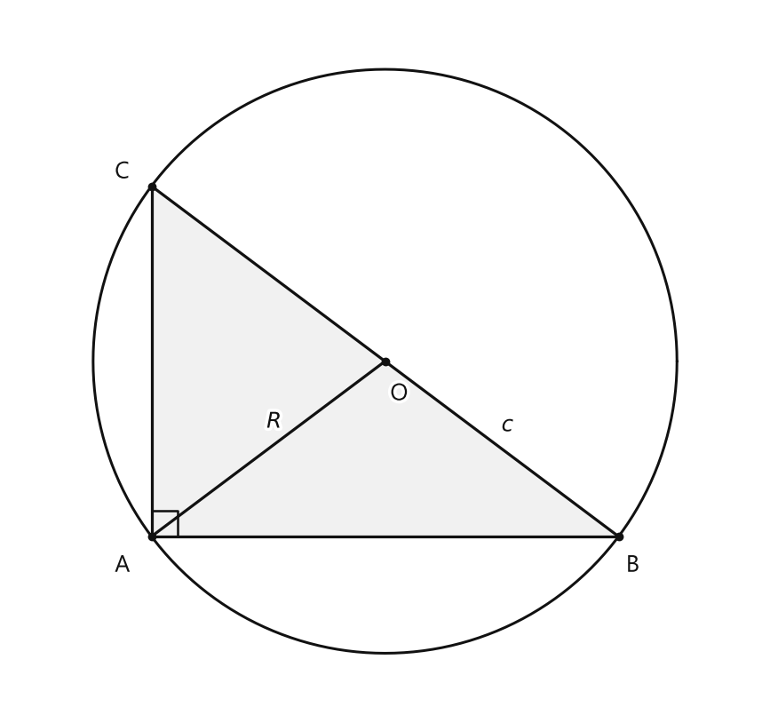

# Занятие 12. Прямоугольный треугольник и его описанная и вписанная окружности

**Раздел:** Глава II  
**Параграф учебника:** §9. Прямоугольный треугольник и его описанная и вписанная окружности  
**Страницы:** 74–79

## Цели занятия

К концу занятия ученик умеет:

- находить радиус описанной окружности прямоугольного треугольника;
- находить радиус вписанной окружности по катетам и гипотенузе;
- применять теорему Пифагора вместе с формулами для $R$ и $r$;
- находить площадь и периметр прямоугольного треугольника;
- восстанавливать катеты по гипотенузе и радиусам окружностей;
- выбирать способ решения: геометрический или алгебраический.

Выбери блок своего уровня:

- **1–2 балла:** знать формулы $R=\frac c2$ и $r=\frac{a+b-c}{2}$;
- **3–4 балла:** находить $R$ и $r$ по сторонам;
- **5–6 баллов:** решать задачи на площадь и периметр;
- **7–8 баллов:** восстанавливать стороны по радиусам;
- **9–10 баллов:** решать задачи несколькими способами и доказывать свойства.

## Теория к занятию

### 1. Описанная окружность прямоугольного треугольника

#### Простыми словами

В прямоугольном треугольнике гипотенуза является диаметром описанной окружности.

Поэтому центр этой окружности находится в середине гипотенузы. Значит, радиус равен половине гипотенузы:

$$R=\frac c2.$$

Здесь всё довольно удобно: центр не нужно искать отдельно — он уже спрятался в середине самой длинной стороны.

#### Теорема

> Центр окружности, описанной около прямоугольного треугольника, лежит на середине гипотенузы, а ее радиус равен половине гипотенузы, т. е. $R = \frac{c}{2}$, где $c$ — гипотенуза.

<!--geo-figure-spec
{
  "needed": true,
  "kind": "plane",
  "caption": "Прямоугольный треугольник $ABC$ и его описанная окружность",
  "equal": true,
  "axis": false,
  "xlim": [
    -1.2,
    5.2
  ],
  "ylim": [
    -1.5,
    4.5
  ],
  "points": {
    "A": [
      0,
      0
    ],
    "B": [
      4,
      0
    ],
    "C": [
      0,
      3
    ],
    "O": [
      2,
      1.5
    ]
  },
  "segments": [
    [
      "A",
      "B"
    ],
    [
      "B",
      "C"
    ],
    [
      "C",
      "A"
    ],
    [
      "O",
      "A"
    ]
  ],
  "polygons": [
    {
      "vertices": [
        "A",
        "B",
        "C"
      ],
      "fill": 0.06
    }
  ],
  "circles": [
    {
      "center": "O",
      "radius": 2.5
    }
  ],
  "labels": {
    "A": {
      "dx": -0.25,
      "dy": -0.25
    },
    "B": {
      "dx": 0.12,
      "dy": -0.25
    },
    "C": {
      "dx": -0.25,
      "dy": 0.12
    },
    "O": {
      "dx": 0.12,
      "dy": -0.28
    }
  },
  "right_angles": [
    {
      "vertex": "A",
      "from": "C",
      "to": "B"
    }
  ],
  "texts": [
    {
      "xy": [
        3.05,
        0.95
      ],
      "text": "$c$"
    },
    {
      "xy": [
        1.05,
        0.98
      ],
      "text": "$R$"
    }
  ]
}
-->

*Прямоугольный треугольник ABC и его описанная окружность*

#### Формула

$$R=\frac c2,$$

где:

- $R$ — радиус описанной окружности;
- $c$ — гипотенуза.

Если известна гипотенуза, делим её на $2$ и получаем радиус.

Если известен радиус, гипотенузу находим обратным действием:

$$c=2R.$$

#### Правила

- Гипотенуза лежит напротив прямого угла.
- Сначала найди гипотенузу, если она неизвестна.
- Затем раздели гипотенузу на $2$.
- Катет делить пополам нельзя: окружность «смотрит» именно на гипотенузу.

#### Алгоритм

1. Найди гипотенузу.
2. Если гипотенуза неизвестна, используй теорему Пифагора:
   $$c^2=a^2+b^2.$$
3. Найди радиус:
   $$R=\frac c2.$$
4. Запиши единицу измерения.

#### Ловушки

- Не перепутай гипотенузу с катетом.
- $R$ — радиус описанной окружности, а не вписанной.
- Если дан диаметр, радиус в два раза меньше диаметра.
- Если дан радиус, гипотенуза в два раза больше:
  $$c=2R.$$

---

### 2. Вписанная окружность прямоугольного треугольника

#### Простыми словами

Вписанная окружность касается всех трёх сторон треугольника.

В прямоугольном треугольнике её центр находится на одинаковом расстоянии $r$ от двух катетов. Поэтому около вершины прямого угла образуются два отрезка длиной $r$.

Ещё используется свойство касательных: отрезки касательных, проведённых из одной точки к окружности, равны. Благодаря этому стороны треугольника можно выразить через $r$, а затем получить формулу радиуса.

#### Теорема

> Радиус окружности, вписанной в прямоугольный треугольник, можно найти по формуле $r = \frac{a+b-c}{2}$, где $r$ — искомый радиус, $a$ и $b$ — катеты, $c$ — гипотенуза треугольника.

#### Формула

$$r=\frac{a+b-c}{2},$$

где:

- $r$ — радиус вписанной окружности;
- $a$ и $b$ — катеты;
- $c$ — гипотенуза.

Если известны только катеты, сначала найди гипотенузу по теореме Пифагора:

$$c=\sqrt{a^2+b^2}.$$

После этого подставь все три стороны в формулу для $r$.

#### Следствие

> $r = p - c$, где $p$ — полупериметр треугольника.

Полупериметр равен половине периметра:

$$p=\frac{a+b+c}{2}.$$

Поэтому радиус можно найти так:

$$r=p-c.$$

#### Правила

- В формуле для радиуса из суммы катетов вычитается гипотенуза:
  $$r=\frac{a+b-c}{2}.$$
- $r$ — радиус вписанной окружности, а $R$ — радиус описанной.
- Если известны $p$ и $c$, удобнее использовать:
  $$r=p-c.$$
- Радиус окружности не может быть отрицательным.

#### Алгоритм

Если даны катеты:

1. Найди гипотенузу:
   $$c=\sqrt{a^2+b^2}.$$
2. Подставь стороны в формулу:
   $$r=\frac{a+b-c}{2}.$$
3. Выполни действия и запиши единицу измерения.

Если даны полупериметр и гипотенуза:

1. Используй формулу:
   $$r=p-c.$$
2. Проверь, что результат положительный.

#### Ловушки

- Нельзя менять знак в формуле:
  $$r\ne\frac{c-a-b}{2}.$$
- Полупериметр — это половина периметра, а не сам периметр.
- Если известны только катеты, гипотенузу сначала нужно найти.
- Отрицательный радиус означает ошибку в вычислениях: у окружности такого настроения не бывает.

---

### 3. Площадь прямоугольного треугольника

#### Простыми словами

Катеты прямоугольного треугольника перпендикулярны. Значит, один катет можно взять за основание, а другой — за высоту. Поэтому площадь равна половине произведения катетов:

$$S=\frac{ab}{2}.$$

Если в задаче дана вписанная окружность, часто удобнее использовать другую формулу:

$$S=pr.$$

Она справедлива для любого треугольника, не только для прямоугольного.

#### Формулы

$$S=\frac{ab}{2},$$

где $a$ и $b$ — катеты.

$$S=pr,$$

где $p$ — полупериметр, $r$ — радиус вписанной окружности.

Так как для прямоугольного треугольника

$$r=p-c,$$

то

$$p=r+c.$$

Следовательно,

$$S=(r+c)r.$$

#### Правила

- Если известны катеты, используй:
  $$S=\frac{ab}{2}.$$
- Если известны $r$ и $c$, сначала найди полупериметр:
  $$p=r+c,$$
  а затем используй:
  $$S=pr.$$
- Если известны площадь и радиус, полупериметр можно найти так:
  $$p=\frac Sr.$$
- Площадь измеряется в квадратных единицах.

#### Ловушки

- В формуле $S=pr$ используется полупериметр, а не периметр.
- В формуле $S=\frac{ab}{2}$ должны быть именно катеты.
- Не забудь деление на $2$: площадь треугольника — это половина площади соответствующего прямоугольника.

---

## Сводка формул «выучить наизусть»

$$c^2=a^2+b^2$$

$$R=\frac c2$$

$$c=2R$$

$$r=\frac{a+b-c}{2}$$

$$p=\frac{a+b+c}{2}$$

$$r=p-c$$

$$S=\frac{ab}{2}$$

$$S=pr$$

$$p=r+c$$

$$S=(r+c)r$$

## Правила, которые нельзя путать

- $R$ — радиус **описанной** окружности.
- $r$ — радиус **вписанной** окружности.
- В прямоугольном треугольнике:
  $$R=\frac c2.$$
- В формуле радиуса вписанной окружности:
  $$r=\frac{a+b-c}{2}.$$
- Гипотенуза лежит напротив прямого угла.
- Полупериметр:
  $$p=\frac{P}{2},$$
  а не $P$.
- Площадь через вписанную окружность:
  $$S=pr,$$
  а не $S=Pr$.

## Разбор ключевых заданий

### Р1. Радиус описанной окружности по катетам

**Условие.** Катеты прямоугольного треугольника равны $6$ см и $8$ см. Найдите радиус описанной окружности.

**Решение.**

Гипотенуза находится напротив прямого угла.

По теореме Пифагора:

$$c^2=a^2+b^2.$$

Подставим катеты:

$$c^2=6^2+8^2.$$

Вычислим квадраты:

$$c^2=36+64.$$

$$c^2=100.$$

Длина стороны положительна, поэтому:

$$c=10\text{ см}.$$

Радиус описанной окружности равен половине гипотенузы:

$$R=\frac c2.$$

$$R=\frac{10}{2}=5\text{ см}.$$

Числа $6$, $8$, $10$ образуют известную пифагорову тройку. Но проверка по теореме Пифагора всё равно нужна: память иногда берёт выходной.

**Ответ:** $5$ см.

---

### Р2. Радиус вписанной окружности по катетам

**Условие.** Катеты прямоугольного треугольника равны $5$ см и $12$ см. Найдите радиус вписанной окружности.

**Решение.**

Сначала найдём гипотенузу по теореме Пифагора:

$$c^2=5^2+12^2.$$

$$c^2=25+144.$$

$$c^2=169.$$

$$c=13\text{ см}.$$

Теперь используем формулу радиуса вписанной окружности:

$$r=\frac{a+b-c}{2}.$$

Подставим значения сторон:

$$r=\frac{5+12-13}{2}.$$

Выполним действия в числителе:

$$r=\frac{4}{2}.$$

$$r=2\text{ см}.$$

Проверим результат:

$$a+b=5+12=17,$$

$$c+2r=13+2\cdot2=17.$$

Получились одинаковые значения.

**Ответ:** $2$ см.

---

### Р3. Задача 1. Один катет и радиус вписанной окружности

**Условие.** Один из катетов прямоугольного треугольника равен $6$ см, а радиус вписанной окружности равен $2$ см. Найдите радиус описанной окружности.

**Решение.**

Обозначим второй катет через $b$, а гипотенузу — через $c$.

Используем формулу радиуса вписанной окружности:

$$r=\frac{a+b-c}{2}.$$

Подставим $r=2$ и $a=6$:

$$2=\frac{6+b-c}{2}.$$

Умножим обе части уравнения на $2$:

$$4=6+b-c.$$

Перенесём выражения так, чтобы найти гипотенузу:

$$c=b+2.$$

Теперь применим теорему Пифагора:

$$c^2=6^2+b^2.$$

Вместо $c$ подставим $b+2$:

$$(b+2)^2=36+b^2.$$

Раскроем квадрат суммы:

$$b^2+4b+4=36+b^2.$$

Вычтем $b^2$ из обеих частей:

$$4b+4=36.$$

Вычтем $4$:

$$4b=32.$$

Разделим на $4$:

$$b=8\text{ см}.$$

Найдём гипотенузу:

$$c=b+2=8+2=10\text{ см}.$$

Радиус описанной окружности равен половине гипотенузы:

$$R=\frac c2.$$

$$R=\frac{10}{2}=5\text{ см}.$$

Проверим найденные стороны:

$$6^2+8^2=36+64=100,$$

$$10^2=100.$$

Теорема Пифагора выполнена.

**Ответ:** $5$ см.

---

### Р4. Задача 2. Площадь по гипотенузе и радиусу вписанной окружности

**Условие.** Гипотенуза прямоугольного треугольника равна $18$ см, радиус вписанной окружности равен $2$ см. Найдите площадь треугольника.

**Решение первым способом.**

Используем следствие:

$$r=p-c.$$

Выразим из него полупериметр:

$$p=r+c.$$

Подставим известные значения:

$$p=2+18=20\text{ см}.$$

Теперь применим формулу площади через полупериметр и радиус:

$$S=pr.$$

$$S=20\cdot2.$$

$$S=40\text{ см}^2.$$

Проверим вычисление по формуле, полученной для прямоугольного треугольника:

$$S=(r+c)r.$$

$$S=(2+18)\cdot2.$$

$$S=20\cdot2=40\text{ см}^2.$$

Получился тот же результат.

**Ответ:** $40\text{ см}^2$.

---

### Р5. Площадь по катету и радиусу описанной окружности

**Условие.** Один из катетов прямоугольного треугольника равен $6$ см, а радиус описанной окружности равен $5$ см. Найдите площадь треугольника.

**Решение.**

В прямоугольном треугольнике гипотенуза в два раза больше радиуса описанной окружности:

$$c=2R.$$

Подставим $R=5$ см:

$$c=2\cdot5=10\text{ см}.$$

Обозначим второй катет через $b$.

По теореме Пифагора:

$$c^2=a^2+b^2.$$

Подставим известные значения:

$$10^2=6^2+b^2.$$

$$100=36+b^2.$$

Вычтем $36$:

$$b^2=64.$$

Длина катета положительна, поэтому:

$$b=8\text{ см}.$$

Найдём площадь:

$$S=\frac{ab}{2}.$$

$$S=\frac{6\cdot8}{2}.$$

$$S=\frac{48}{2}=24\text{ см}^2.$$

Стороны $6$, $8$ и $10$ снова дают верное равенство Пифагора. Числа явно решили сегодня поработать командой.

**Ответ:** $24\text{ см}^2$.

---

### Р6. Радиус описанной окружности по одному катету и углу

**Условие.** В прямоугольном треугольнике катет, противолежащий углу $30^\circ$, равен $6$ см. Найдите радиус описанной окружности.

**Решение.**

Для синуса острого угла имеем:

$$\sin30^\circ=\frac{\text{противолежащий катет}}{\text{гипотенуза}}.$$

В этой задаче:

$$\sin30^\circ=\frac{6}{c}.$$

Значение синуса угла $30^\circ$ равно:

$$\sin30^\circ=\frac12.$$

Поэтому:

$$\frac12=\frac{6}{c}.$$

Умножим обе части на $2c$:

$$c=12\text{ см}.$$

Теперь найдём радиус описанной окружности:

$$R=\frac c2.$$

$$R=\frac{12}{2}=6\text{ см}.$$

Катет и радиус действительно оказались равны по $6$ см. Это совпадение, а не новое правило: сначала всё равно нужно найти гипотенузу.

**Ответ:** $6$ см.

---

### Р7. Катеты по отрезкам, на которые точка касания делит гипотенузу

**Условие.** Точка касания вписанной окружности делит гипотенузу прямоугольного треугольника на отрезки $5$ см и $12$ см. Найдите катеты треугольника.

**Решение.**

Обозначим катеты через $a$ и $b$, а гипотенузу — через $c$.

Гипотенуза состоит из двух данных отрезков:

$$c=5+12=17\text{ см}.$$

Из свойства касательных к окружности следует, что отрезки катетов от вершин до точек касания равны соответствующим отрезкам гипотенузы.

Поэтому:

$$a-r=5,$$

$$b-r=12.$$

Выразим катеты:

$$a=5+r,$$

$$b=12+r.$$

Формула радиуса вписанной окружности здесь сама по себе нового уравнения не даёт:

$$r=\frac{a+b-c}{2}.$$

Подставим выражения для $a$, $b$ и $c$:

$$r=\frac{(5+r)+(12+r)-17}{2}.$$

$$r=\frac{2r}{2}.$$

$$r=r.$$

Получилось тождество, поэтому переходим к теореме Пифагора:

$$a^2+b^2=c^2.$$

Подставим найденные выражения:

$$(5+r)^2+(12+r)^2=17^2.$$

Раскроем квадраты:

$$25+10r+r^2+144+24r+r^2=289.$$

Приведём подобные слагаемые:

$$2r^2+34r+169=289.$$

Перенесём $289$ в левую часть:

$$2r^2+34r-120=0.$$

Разделим уравнение на $2$:

$$r^2+17r-60=0.$$

Разложим левую часть на множители:

$$(r-3)(r+20)=0.$$

Произведение равно нулю, если:

$$r-3=0$$

или

$$r+20=0.$$

Получаем:

$$r=3$$

или

$$r=-20.$$

Радиус не может быть отрицательным, поэтому:

$$r=3\text{ см}.$$

Найдём катеты:

$$a=5+3=8\text{ см},$$

$$b=12+3=15\text{ см}.$$

Проверим результат:

$$8^2+15^2=64+225=289,$$

$$17^2=289.$$

Катеты найдены верно.

**Ответ:** $8$ см и $15$ см.

---

### Р8. Периметр и площадь по двум радиусам

**Условие.** Радиус описанной окружности прямоугольного треугольника равен $13$ см, а радиус вписанной окружности равен $4$ см. Найдите периметр и площадь треугольника.

**Решение.**

Сначала найдём гипотенузу. Она в два раза больше радиуса описанной окружности:

$$c=2R.$$

$$c=2\cdot13=26\text{ см}.$$

Используем формулу:

$$r=p-c.$$

Выразим полупериметр:

$$p=r+c.$$

Подставим данные:

$$p=4+26=30\text{ см}.$$

Периметр в два раза больше полупериметра:

$$P=2p.$$

$$P=2\cdot30=60\text{ см}.$$

Площадь найдём по формуле:

$$S=pr.$$

$$S=30\cdot4.$$

$$S=120\text{ см}^2.$$

Проверим единицы измерения:

- периметр измеряется в сантиметрах;
- площадь измеряется в квадратных сантиметрах.

**Ответ:** $P=60$ см, $S=120\text{ см}^2$.

### Р9. Расстояние от центра вписанной окружности до вершины прямого угла

**Условие.** Расстояние от центра вписанной окружности до гипотенузы равно $6$ см. Найдите расстояние от этого центра до вершины прямого угла.

**Решение.**

Расстояние от центра окружности до стороны, к которой проведён перпендикуляр, равно радиусу окружности.

Поэтому радиус вписанной окружности равен:

$$r=6\text{ см}.$$

Центр вписанной окружности находится на биссектрисе прямого угла. Значит, он одинаково удалён от обоих катетов.

Рассмотрим маленький треугольник, образованный вершиной прямого угла, центром окружности и основанием перпендикуляра к катету.

У этого треугольника:

- один катет равен расстоянию от центра до первого катета, то есть $r$;
- второй катет равен расстоянию от центра до второго катета, то есть тоже $r$;
- гипотенуза $x$ — это расстояние от вершины прямого угла до центра окружности.

По теореме Пифагора:

$$x^2=r^2+r^2.$$

Подставим $r=6$:

$$x^2=6^2+6^2.$$

$$x^2=36+36=72.$$

$$x=\sqrt{72}.$$

Разложим $72$ на множители:

$$72=36\cdot2.$$

Тогда:

$$x=\sqrt{36\cdot2}=6\sqrt2\text{ см}.$$

Отрицательное значение не рассматриваем, потому что расстояние не бывает отрицательным. Минус здесь не помощник, а просто лишний пассажир.

**Ответ:** $6\sqrt2$ см.

---

### Р10. Доказательство формулы площади через части гипотенузы

**Условие.** Точка касания вписанной окружности делит гипотенузу прямоугольного треугольника на отрезки $m$ и $n$. Докажите, что площадь треугольника можно найти по формуле $S=mn$.

**Доказательство.**

Пусть катеты равны $a$ и $b$, а гипотенуза равна $c$.

Обозначим радиус вписанной окружности через $r$.

По свойству касательных отрезки касательных, проведённых из одной точки, равны.

Поэтому на первом катете один отрезок равен $m$, а второй — $r$:

$$a=m+r.$$

На втором катете отрезки равны $n$ и $r$:

$$b=n+r.$$

Гипотенуза разделена на отрезки $m$ и $n$, поэтому:

$$c=m+n.$$

По теореме Пифагора:

$$a^2+b^2=c^2.$$

Подставим найденные выражения для $a$, $b$ и $c$:

$$(m+r)^2+(n+r)^2=(m+n)^2.$$

Раскроем скобки:

$$m^2+2mr+r^2+n^2+2nr+r^2=m^2+2mn+n^2.$$

Сократим одинаковые слагаемые $m^2$ и $n^2$ в обеих частях:

$$2mr+2nr+2r^2=2mn.$$

Разделим обе части на $2$:

$$mr+nr+r^2=mn.$$

В левой части вынесем $r$ за скобки:

$$r(m+n+r)=mn.$$

Теперь найдём полупериметр треугольника:

$$p=\frac{a+b+c}{2}.$$

Подставим $a=m+r$, $b=n+r$, $c=m+n$:

$$p=\frac{m+r+n+r+m+n}{2}.$$

Сложим подобные слагаемые:

$$p=\frac{2m+2n+2r}{2}.$$

$$p=m+n+r.$$

Значит,

$$pr=r(m+n+r)=mn.$$

Но площадь треугольника можно найти по формуле:

$$S=pr.$$

Следовательно:

$$S=mn.$$

**Ответ:** $$S=mn.$$

---

### Р11. Типовая задача на периметр

**Условие.** Гипотенуза прямоугольного треугольника равна $14$ см, а радиус вписанной окружности равен $1$ см. Найдите периметр треугольника.

**Решение.**

Используем следствие:

$$r=p-c,$$

где $p$ — полупериметр, а $c$ — гипотенуза.

Выразим полупериметр:

$$p=r+c.$$

Подставим известные значения:

$$p=1+14=15\text{ см}.$$

Периметр в два раза больше полупериметра:

$$P=2p.$$

Тогда:

$$P=2\cdot15=30\text{ см}.$$

Проверим найденный полупериметр:

$$p-c=15-14=1\text{ см}.$$

Получили заданный радиус, значит, вычисления выполнены верно.

**Ответ:** $30$ см.

---

### Р12. Расстояние между центрами окружностей

**Условие.** Прямоугольный треугольник имеет стороны $12$ см, $16$ см и $20$ см. Найдите расстояние между центрами его описанной и вписанной окружностей.

**Решение.**

Так как треугольник прямоугольный, гипотенуза равна $20$ см.

Центр описанной окружности прямоугольного треугольника — середина гипотенузы. Поэтому радиус описанной окружности равен:

$$R=\frac c2.$$

$$R=\frac{20}{2}=10\text{ см}.$$

Радиус вписанной окружности:

$$r=\frac{a+b-c}{2}.$$

Подставим длины катетов и гипотенузы:

$$r=\frac{12+16-20}{2}.$$

$$r=\frac{8}{2}=4\text{ см}.$$

Теперь найдём расстояние между центрами без использования ещё не изученной формулы. Для этого удобно сделать простой чертёж в координатной плоскости.

Пусть вершина прямого угла находится в точке $C(0;0)$.

Разместим катеты вдоль осей:

- вершина одного катета имеет координаты $A(12;0)$;
- вершина другого катета имеет координаты $B(0;16)$.

Центр вписанной окружности удалён от обоих катетов на расстояние $r=4$ см. Поэтому его координаты:

$$I(4;4).$$

Центр описанной окружности — середина гипотенузы $AB$. Координаты середины отрезка находим как полусуммы соответствующих координат его концов:

$$O\left(\frac{12+0}{2};\frac{0+16}{2}\right).$$

$$O(6;8).$$

Итак, нужно найти расстояние между точками $I(4;4)$ и $O(6;8)$.

Разность координат по горизонтали:

$$6-4=2.$$

Разность координат по вертикали:

$$8-4=4.$$

Эти отрезки образуют катеты прямоугольного треугольника, а расстояние $OI$ — его гипотенуза. По теореме Пифагора:

$$OI^2=2^2+4^2.$$

$$OI^2=4+16=20.$$

$$OI=\sqrt{20}.$$

Разложим $20$ на множители:

$$20=4\cdot5.$$

Тогда:

$$OI=\sqrt{4\cdot5}=2\sqrt5\text{ см}.$$

Берём положительный корень, потому что речь идёт о расстоянии.

**Ответ:** $2\sqrt5$ см.

## Практические задания

Выбери свой уровень и решай только этот блок. В блоке должна закрепиться вся тема параграфа. Ответы не приводятся.

### Уровень 1–2 балла

**С1.** Прямоугольный треугольник имеет гипотенузу $18$ см. Найдите радиус описанной окружности.

1) $6$ см   2) $9$ см   3) $18$ см   4) $36$ см   5) $4{,}5$ см

**С2.** Катеты прямоугольного треугольника равны $6$ см и $8$ см. Найдите радиус описанной окружности.

**С3.** Выберите формулу для радиуса окружности, вписанной в прямоугольный треугольник с катетами $a$, $b$ и гипотенузой $c$.

1) $r=\dfrac{a+b+c}{2}$   2) $r=\dfrac{a+b-c}{2}$   3) $r=\dfrac{c-a-b}{2}$   4) $r=\dfrac{ab}{2}$   5) $r=\dfrac{c}{2}$

**С4.** Катеты прямоугольного треугольника равны $3$ см и $4$ см, а гипотенуза равна $5$ см. Найдите радиус вписанной окружности.

1) $0{,}5$ см   2) $1$ см   3) $1{,}5$ см   4) $2$ см   5) $2{,}5$ см

**С5.** В прямоугольном треугольнике радиус описанной окружности равен $7$ см. Найдите длину гипотенузы.

**С6.** Катеты прямоугольного треугольника равны $5$ см и $12$ см, гипотенуза равна $13$ см. Найдите радиус вписанной окружности.

1) $1$ см   2) $2$ см   3) $3$ см   4) $4$ см   5) $5$ см

**С7.** Центр описанной окружности прямоугольного треугольника находится:

1) в вершине прямого угла  
2) на середине одного из катетов  
3) на середине гипотенузы  
4) внутри вписанной окружности  
5) вне описанной окружности

**С8.** Полупериметр прямоугольного треугольника равен $12$ см, а гипотенуза — $7$ см. Найдите радиус вписанной окружности.

**С9.** Радиус вписанной окружности прямоугольного треугольника равен $3$ см, а его катеты равны $6$ см и $8$ см. Найдите гипотенузу.

1) $9$ см   2) $10$ см   3) $11$ см   4) $12$ см   5) $14$ см

**С10.** Диаметр описанной окружности прямоугольного треугольника равен $20$ см. Найдите гипотенузу треугольника.

**С11.** Катеты прямоугольного треугольника равны $9$ см и $12$ см. Найдите радиус описанной окружности.

1) $6$ см   2) $7{,}5$ см   3) $9$ см   4) $10{,}5$ см   5) $12$ см

**С12.** В прямоугольном треугольнике гипотенуза равна $10$ см, а полупериметр — $12$ см. Найдите радиус вписанной окружности.

**С13.** Выберите формулу радиуса окружности, описанной около прямоугольного треугольника, если $c$ — его гипотенуза:  
1) $R=c$ 2) $R=\dfrac{c}{2}$ 3) $R=2c$ 4) $R=\dfrac{a+b-c}{2}$ 5) $R=\dfrac{c}{4}$

**С14.** Выберите формулу радиуса окружности, вписанной в прямоугольный треугольник с катетами $a$, $b$ и гипотенузой $c$:  
1) $r=\dfrac{a+b+c}{2}$ 2) $r=\dfrac{a-b+c}{2}$ 3) $r=\dfrac{a+b-c}{2}$ 4) $r=\dfrac{c-a-b}{2}$ 5) $r=\dfrac{a+b}{c}$

**С15.** Гипотенуза прямоугольного треугольника равна $14$ см. Найдите радиус описанной окружности.

**С16.** Катеты прямоугольного треугольника равны $6$ см и $8$ см. Найдите радиус описанной окружности.

**С17.** Катеты прямоугольного треугольника равны $9$ дм и $12$ дм. Найдите радиус описанной окружности.

**С18.** Прямоугольный треугольник имеет катеты $5$ см и $12$ см, а гипотенузу $13$ см. Найдите радиус вписанной окружности.

**С19.** Катеты прямоугольного треугольника равны $8$ м и $15$ м, гипотенуза равна $17$ м. Найдите радиус вписанной окружности.

**С20.** Полупериметр прямоугольного треугольника равен $12$ см, а гипотенуза — $9$ см. Найдите радиус вписанной окружности.

**С21.** Гипотенуза прямоугольного треугольника равна $20$ см. Найдите расстояние от центра описанной окружности до каждой вершины треугольника.

**С22.** Выберите верное утверждение о центре окружности, описанной около прямоугольного треугольника:  
1) Он совпадает с вершиной прямого угла.  
2) Он лежит на биссектрисе прямого угла.  
3) Он является серединой гипотенузы.  
4) Он лежит на одном из катетов.  
5) Он находится вне треугольника.

**С23.** Высота прямоугольного треугольника делит гипотенузу на отрезки длиной $4$ см и $9$ см. Найдите гипотенузу.

**С24.** Точка касания вписанной окружности делит гипотенузу прямоугольного треугольника на отрезки длиной $5$ см и $12$ см. Найдите площадь треугольника.

**С25.** Прямоугольный треугольник имеет гипотенузу $14$ см. Найдите радиус описанной около него окружности.

**С26.** Катеты прямоугольного треугольника равны $6$ см и $8$ см. Найдите радиус описанной окружности.

**С27.** Выберите формулу для радиуса окружности, вписанной в прямоугольный треугольник с катетами $a$ и $b$ и гипотенузой $c$.

1) $r=\dfrac{a+b+c}{2}$  
2) $r=\dfrac{a+b-c}{2}$  
3) $r=\dfrac{c-a-b}{2}$  
4) $r=\dfrac{ab}{c}$  
5) $r=\dfrac{c}{2}$

**С28.** Катеты прямоугольного треугольника равны $9$ см и $12$ см, а гипотенуза равна $15$ см. Найдите радиус вписанной окружности.

**С29.** Центр описанной около прямоугольного треугольника окружности расположен:

1) в вершине прямого угла;  
2) на середине одного из катетов;  
3) на середине гипотенузы;  
4) внутри треугольника, но не на гипотенузе;  
5) вне треугольника.

**С30.** Полупериметр прямоугольного треугольника равен $17$ см, а гипотенуза — $13$ см. Найдите радиус вписанной окружности.

**С31.** Радиус описанной окружности прямоугольного треугольника равен $5$ см. Найдите его гипотенузу.

**С32.** Выберите верное утверждение для прямоугольного треугольника.

1) Радиус описанной окружности равен половине меньшего катета.  
2) Центр описанной окружности совпадает с вершиной прямого угла.  
3) Радиус вписанной окружности равен половине гипотенузы.  
4) Центр описанной окружности лежит на середине гипотенузы.  
5) Радиус вписанной окружности равен сумме катетов.

**С33.** Катеты прямоугольного треугольника равны $5$ см и $12$ см. Найдите радиус вписанной окружности.

**С34.** Гипотенуза прямоугольного треугольника равна $10$ см, а радиус вписанной окружности — $2$ см. Найдите полупериметр треугольника.

**С35.** Площадь прямоугольного треугольника равна $30$ см$^2$, а его катеты равны $5$ см и $12$ см. Найдите радиус описанной окружности.

**С36.** В прямоугольном треугольнике катеты равны $8$ см и $15$ см, а гипотенуза — $17$ см. Выберите пару, в которой указаны радиусы описанной и вписанной окружностей соответственно.

1) $R=8{,}5$ см, $r=3$ см  
2) $R=17$ см, $r=3$ см  
3) $R=8{,}5$ см, $r=5$ см  
4) $R=7{,}5$ см, $r=3$ см  
5) $R=8{,}5$ см, $r=4$ см

### Уровень 3–4 балла

**С1.** Найдите радиус окружности, описанной около прямоугольного треугольника с катетами $6$ см и $8$ см.

**С2.** Найдите радиус окружности, описанной около прямоугольного треугольника с катетами $9$ м и $12$ м.

**С3.** Гипотенуза прямоугольного треугольника равна $26$ см. Найдите радиус окружности, описанной около этого треугольника.

**С4.** Радиус окружности, описанной около прямоугольного треугольника, равен $10$ дм. Найдите гипотенузу треугольника.

**С5.** Найдите радиус окружности, вписанной в прямоугольный треугольник с катетами $5$ см и $12$ см.

**С6.** Катеты прямоугольного треугольника равны $8$ м и $15$ м. Найдите радиус окружности, вписанной в этот треугольник.

**С7.** В прямоугольном треугольнике катет равен $7$ см, а гипотенуза — $25$ см. Найдите радиус окружности, вписанной в треугольник.

**С8.** Полупериметр прямоугольного треугольника равен $17$ см, а гипотенуза — $13$ см. Найдите радиус окружности, вписанной в треугольник.

**С9.** Радиус окружности, описанной около прямоугольного треугольника, равен $5$ см, а один из катетов равен $6$ см. Найдите площадь треугольника.

**С10.** Гипотенуза прямоугольного треугольника равна $10$ см, а радиус вписанной окружности — $2$ см. Найдите площадь треугольника.

**С11.** Радиус описанной окружности прямоугольного треугольника равен $13$ см, а радиус вписанной окружности — $4$ см. Найдите периметр треугольника.

**С12.** В прямоугольном треугольнике точка касания вписанной окружности делит гипотенузу на отрезки длиной $5$ см и $12$ см. Найдите площадь треугольника.

**С13.** Гипотенуза прямоугольного треугольника равна $26$ см. Найдите радиус окружности, описанной около этого треугольника.

**С14.** Катеты прямоугольного треугольника равны $9$ см и $12$ см. Найдите радиус окружности, описанной около треугольника.

**С15.** Катеты прямоугольного треугольника равны $5$ см и $12$ см. Найдите радиус окружности, вписанной в этот треугольник.

**С16.** Один катет прямоугольного треугольника равен $8$ см, а гипотенуза — $17$ см. Найдите радиус окружности, вписанной в треугольник.

**С17.** Полупериметр прямоугольного треугольника равен $12$ см, а гипотенуза — $10$ см. Найдите радиус окружности, вписанной в треугольник.

**С18.** Радиус окружности, описанной около прямоугольного треугольника, равен $10$ см. Один из катетов равен $12$ см. Найдите площадь треугольника.

**С19.** Гипотенуза прямоугольного треугольника равна $25$ см, а радиус вписанной окружности — $3$ см. Найдите площадь треугольника.

**С20.** Площадь прямоугольного треугольника равна $30$ см$^2$, а радиус вписанной окружности — $2$ см. Найдите диаметр окружности, описанной около треугольника.

**С21.** Точка касания вписанной окружности делит гипотенузу прямоугольного треугольника на отрезки $6$ см и $8$ см. Найдите радиус вписанной окружности.

**С22.** Высота, проведённая из вершины прямого угла прямоугольного треугольника к гипотенузе, делит гипотенузу на отрезки $9$ см и $16$ см. Найдите радиус окружности, вписанной в треугольник.

**С23.** Катеты прямоугольного треугольника равны $6$ см и $8$ см. Найдите радиусы вписанной и описанной окружностей.

**С24.** Гипотенуза прямоугольного треугольника равна $10$ см, а радиус вписанной окружности — $1$ см. Найдите периметр треугольника.

**С25.** Гипотенуза прямоугольного треугольника равна $26$ см. Найдите радиус окружности, описанной около этого треугольника.

**С26.** Катеты прямоугольного треугольника равны $9$ см и $12$ см. Найдите радиус окружности, вписанной в этот треугольник.

**С27.** Один из катетов прямоугольного треугольника равен $6$ см, а гипотенуза — $10$ см. Найдите радиус окружности, вписанной в этот треугольник.

**С28.** Гипотенуза прямоугольного треугольника равна $25$ см, а радиус вписанной окружности — $3$ см. Найдите периметр треугольника.

**С29.** Гипотенуза прямоугольного треугольника равна $10$ см, а радиус вписанной окружности — $2$ см. Найдите площадь треугольника.

**С30.** Площадь прямоугольного треугольника равна $30$ см$^2$, а радиус вписанной окружности — $2$ см. Найдите диаметр описанной окружности.

**С31.** Радиус окружности, описанной около прямоугольного треугольника, равен $10$ см. Один из катетов равен $12$ см. Найдите площадь треугольника.

**С32.** Радиус описанной окружности прямоугольного треугольника равен $13$ см, а радиус вписанной окружности — $4$ см. Найдите периметр треугольника.

**С33.** Точка касания вписанной окружности делит гипотенузу прямоугольного треугольника на отрезки, равные $3$ см и $2$ см. Найдите катеты треугольника.

**С34.** Высота прямоугольного треугольника делит гипотенузу на отрезки, равные $9$ см и $16$ см. Найдите радиус окружности, вписанной в этот треугольник.

**С35.** Один из катетов прямоугольного треугольника равен $5$ см, а радиус вписанной окружности — $2$ см. Найдите радиус окружности, описанной около этого треугольника.

**С36.** Площадь прямоугольного треугольника равна $42$ см$^2$, а радиус вписанной окружности — $3$ см. Найдите диаметр описанной окружности.

### Уровень 5–6 баллов

**С1.** Найдите радиус окружности, описанной около прямоугольного треугольника с катетами $9$ см и $12$ см.

**С2.** Найдите радиус окружности, вписанной в прямоугольный треугольник с катетами $5$ см и $12$ см.

**С3.** Гипотенуза прямоугольного треугольника равна $10$ см, радиус вписанной окружности — $2$ см, один из катетов — $6$ см. Найдите второй катет.

**С4.** Гипотенуза прямоугольного треугольника равна $17$ см, а радиус вписанной окружности — $2$ см. Найдите периметр треугольника.

**С5.** Гипотенуза прямоугольного треугольника равна $10$ см, а радиус вписанной окружности — $2$ см. Найдите площадь треугольника.

**С6.** Радиус окружности, описанной около прямоугольного треугольника, равен $10$ см. Один из катетов равен $12$ см. Найдите площадь треугольника.

**С7.** Точка касания вписанной окружности с гипотенузой прямоугольного треугольника делит гипотенузу на отрезки $3$ см и $10$ см. Найдите длины катетов треугольника.

**С8.** Высота, проведённая из вершины прямого угла прямоугольного треугольника к гипотенузе, делит гипотенузу на отрезки $9$ см и $16$ см. Найдите радиус вписанной окружности треугольника.

**С9.** Площадь прямоугольного треугольника равна $24$ см$^2$, а радиус вписанной окружности — $2$ см. Найдите диаметр окружности, описанной около треугольника.

**С10.** Площадь прямоугольного треугольника равна $30$ см$^2$, а радиус описанной окружности — $6{,}5$ см. Найдите радиус вписанной окружности.

**С11.** Гипотенуза прямоугольного треугольника равна $14$ см, а радиус вписанной окружности — $1$ см. Найдите периметр треугольника.

**С12.** Радиус окружности, описанной около прямоугольного треугольника, равен $13$ см, а радиус вписанной окружности — $4$ см. Найдите периметр и площадь треугольника.

**С13.** Найдите радиус окружности, описанной около прямоугольного треугольника с катетами $9$ см и $12$ см.

**С14.** Найдите радиус окружности, описанной около прямоугольного треугольника с катетами $7$ дм и $24$ дм.

**С15.** Гипотенуза прямоугольного треугольника равна $26$ см. Найдите радиус описанной окружности.

**С16.** Радиус описанной окружности прямоугольного треугольника равен $10$ м. Один из его катетов равен $12$ м. Найдите второй катет.

**С17.** Найдите радиус окружности, вписанной в прямоугольный треугольник с катетами $6$ см и $8$ см.

**С18.** В прямоугольном треугольнике один катет равен $7$ см, а гипотенуза — $25$ см. Найдите радиус вписанной окружности.

**С19.** Площадь прямоугольного треугольника равна $24$ см$^2$, а радиус вписанной окружности — $2$ см. Найдите диаметр описанной окружности.

**С20.** Гипотенуза прямоугольного треугольника равна $14$ см, а радиус вписанной окружности — $1$ см. Найдите периметр треугольника.

**С21.** Гипотенуза прямоугольного треугольника равна $18$ см, а радиус вписанной окружности — $2$ см. Найдите площадь треугольника.

**С22.** Радиус описанной окружности прямоугольного треугольника равен $13$ см, а радиус вписанной окружности — $4$ см. Найдите периметр и площадь треугольника.

**С23.** Высота, проведённая из вершины прямого угла прямоугольного треугольника к гипотенузе, делит гипотенузу на отрезки длиной $9$ см и $16$ см. Найдите радиус вписанной окружности.

**С24.** Один из катетов прямоугольного треугольника равен $8$ см, а синус противолежащего ему острого угла равен $\frac{2}{3}$. Найдите радиус описанной окружности.

**С25.** Катеты прямоугольного треугольника равны $9$ см и $12$ см. Найдите радиус окружности, описанной около этого треугольника.

**С26.** Катеты прямоугольного треугольника равны $8$ см и $15$ см. Найдите радиус окружности, вписанной в этот треугольник.

**С27.** Гипотенуза прямоугольного треугольника равна $25$ см, а радиус вписанной окружности — $3$ см. Найдите периметр треугольника.

**С28.** Радиус окружности, описанной около прямоугольного треугольника, равен $10$ см. Один из катетов равен $12$ см. Найдите площадь треугольника.

**С29.** Точка касания вписанной окружности делит гипотенузу прямоугольного треугольника на отрезки длиной $5$ см и $12$ см. Найдите площадь треугольника.

**С30.** Площадь прямоугольного треугольника равна $24$ см$^2$, а радиус вписанной окружности — $2$ см. Найдите диаметр окружности, описанной около этого треугольника.

### Уровень 7–8 баллов

**С1.** В прямоугольном треугольнике катеты равны $9$ см и $12$ см. Найдите радиус описанной окружности, радиус вписанной окружности и площадь треугольника. Обоснуйте применённые формулы.

**С2.** Гипотенуза прямоугольного треугольника равна $20$ см, а радиус вписанной окружности — $2$ см. Найдите длины катетов.

**С3.** Один из катетов прямоугольного треугольника равен $10$ см, а радиус описанной окружности — $6$ см. Найдите второй катет и радиус вписанной окружности.

**С4.** Площадь прямоугольного треугольника равна $60$ см$^2$, а радиус вписанной окружности — $3$ см. Найдите длины катетов и радиус описанной окружности.

**С5.** Точка касания вписанной окружности с гипотенузой прямоугольного треугольника делит гипотенузу на отрезки длиной $6$ см и $8$ см. Найдите радиус вписанной окружности и длины катетов треугольника. Обоснуйте связь между отрезками гипотенузы и касательными отрезками на катетах.

**С6.** Высота, проведённая из вершины прямого угла прямоугольного треугольника к гипотенузе, делит её на отрезки длиной $4$ см и $9$ см. Найдите радиус вписанной окружности треугольника.

**С7.** Радиус описанной окружности прямоугольного треугольника равен $10$ см, а радиус вписанной окружности — $2$ см. Найдите периметр и площадь треугольника.

**С8.** Докажите, что если точка касания вписанной окружности с гипотенузой прямоугольного треугольника делит гипотенузу на отрезки длиной $m$ и $n$, то площадь треугольника равна $mn$.

**С9.** В прямоугольном треугольнике один катет равен $8$ см, а радиус вписанной окружности — $2$ см. Найдите гипотенузу, второй катет и радиус описанной окружности.

**С10.** Гипотенуза прямоугольного треугольника равна $25$ см, а радиус вписанной окружности — $3$ см. Найдите длины катетов и площадь треугольника.

**С11.** Площадь прямоугольного треугольника равна $84$ см$^2$, а радиус вписанной окружности — $3$ см. Найдите гипотенузу, длины катетов и радиус описанной окружности.

**С12.** Радиусы описанной и вписанной окружностей прямоугольного треугольника равны соответственно $13$ см и $4$ см. Найдите гипотенузу, полупериметр, периметр и площадь треугольника. Получите используемые зависимости из формул $R=\frac{c}{2}$ и $r=p-c$.

**С13.** Катеты прямоугольного треугольника равны $9$ см и $12$ см. Найдите радиусы описанной и вписанной окружностей треугольника.

**С14.** Гипотенуза прямоугольного треугольника равна $25$ см, а радиус вписанной окружности — $3$ см. Найдите катеты треугольника.

**С15.** Один из катетов прямоугольного треугольника равен $6$ см, а радиус описанной окружности — $5$ см. Найдите площадь треугольника и радиус вписанной окружности.

**С16.** Площадь прямоугольного треугольника равна $24$ см$^2$, а радиус вписанной окружности — $2$ см. Найдите гипотенузу и диаметр описанной окружности треугольника.

**С17.** Точка касания вписанной окружности с гипотенузой прямоугольного треугольника делит её на отрезки длиной $5$ см и $12$ см. Найдите катеты, радиус вписанной окружности и площадь треугольника.

**С18.** Высота, проведённая из вершины прямого угла прямоугольного треугольника к гипотенузе, делит гипотенузу на отрезки длиной $9$ см и $16$ см. Найдите катеты треугольника, его гипотенузу и радиус вписанной окружности.

**С19.** Стороны прямоугольного треугольника равны $9$ см, $12$ см и $15$ см. Найдите расстояние между центрами описанной и вписанной окружностей, обосновав применённую формулу.

**С20.** Докажите, что в прямоугольном треугольнике, если точка касания вписанной окружности делит гипотенузу на отрезки длиной $m$ и $n$, то площадь треугольника равна $mn$.

**С21.** Площадь прямоугольного треугольника равна $24$ см$^2$, а его периметр — $24$ см. Найдите катеты, гипотенузу, радиусы описанной и вписанной окружностей.

**С22.** Гипотенуза прямоугольного треугольника равна $25$ см, а радиус вписанной окружности — $3$ см. Найдите площадь треугольника, его периметр и радиус описанной окружности.

**С23.** Катет прямоугольного треугольника, равный $8$ см, лежит против угла, синус которого равен $\dfrac{2}{3}$. Найдите гипотенузу и радиусы описанной и вписанной окружностей треугольника.

**С24.** В прямоугольном треугольнике радиус описанной окружности равен $13$ см, а радиус вписанной окружности — $4$ см. Найдите гипотенузу, катеты, периметр и площадь треугольника. Обоснуйте, что найденные значения катетов образуют единственный возможный набор.

### Уровень 9–10 баллов

**С1.** Один из катетов прямоугольного треугольника равен $9$ см, а радиус вписанной окружности — $3$ см. Найдите радиус описанной окружности.

**С2.** Гипотенуза прямоугольного треугольника равна $25$ см, а радиус вписанной окружности — $3$ см. Найдите площадь треугольника.

**С3.** Точка касания вписанной окружности делит гипотенузу прямоугольного треугольника на отрезки длиной $6$ см и $15$ см. Найдите катеты треугольника.

**С4.** Высота, проведённая из вершины прямого угла прямоугольного треугольника к гипотенузе, делит гипотенузу на отрезки длиной $9$ см и $16$ см. Найдите радиус вписанной окружности.

**С5.** Радиус описанной окружности прямоугольного треугольника равен $10$ см, а радиус вписанной окружности — $2$ см. Найдите периметр и площадь треугольника.

**С6.** Площадь прямоугольного треугольника равна $54$ см$^2$, а радиус вписанной окружности — $3$ см. Найдите гипотенузу и радиус описанной окружности.

**С7.** Радиус описанной окружности прямоугольного треугольника равен $13$ см. Один из его катетов равен $10$ см. Найдите радиус вписанной окружности и площадь треугольника.

**С8.** Катеты прямоугольного треугольника равны $12$ см и $16$ см. Найдите расстояние между центрами описанной и вписанной окружностей.

**С9.** Докажите, что для прямоугольного треугольника с радиусами описанной и вписанной окружностей $R$ и $r$ площадь выражается формулой $S=r(2R+r)$.

**С10.** Гипотенуза прямоугольного треугольника равна $18$ см, а радиус вписанной окружности — $2$ см. Найдите катеты треугольника.

**С11.** Периметр прямоугольного треугольника равен $48$ см, а радиус описанной окружности — $10$ см. Найдите радиус вписанной окружности.

**С12.** Докажите, что если точка касания вписанной окружности делит гипотенузу прямоугольного треугольника на отрезки длиной $m$ и $n$, то площадь треугольника равна $mn$. Затем найдите площадь треугольника, если эти отрезки имеют длины $5$ см и $12$ см.

**С13.** В прямоугольном треугольнике радиус вписанной окружности равен $3$ см, а гипотенуза — $25$ см. Найдите длины катетов, периметр и площадь треугольника.

**С14.** Площадь прямоугольного треугольника равна $84$ см$^2$, а радиус вписанной окружности — $3$ см. Найдите радиус описанной окружности и длины катетов треугольника.

**С15.** Точка касания вписанной окружности с гипотенузой прямоугольного треугольника делит её на отрезки длиной $9$ см и $16$ см. Найдите длины катетов, радиусы вписанной и описанной окружностей, а также площадь треугольника.

**С16.** Радиус описанной окружности прямоугольного треугольника равен $6{,}5$ см, а радиус вписанной окружности — $2$ см. Найдите длины катетов, периметр и площадь треугольника.

**С17.** Высота, проведённая из вершины прямого угла прямоугольного треугольника к гипотенузе, делит гипотенузу на отрезки длиной $9$ см и $16$ см. Найдите радиус вписанной окружности, радиус описанной окружности и площадь треугольника.

**С18.** Докажите, что для любого прямоугольного треугольника радиус вписанной окружности меньше половины радиуса описанной окружности. Равенство рассматривать не нужно.

## Чек-лист «ученик понял тему»

- Могу повторить определения и формулы параграфа своими словами и по учебнику.
- Решаю типовые задания своего уровня без подсказки.
- Вижу типичную ошибку и могу её объяснить.
