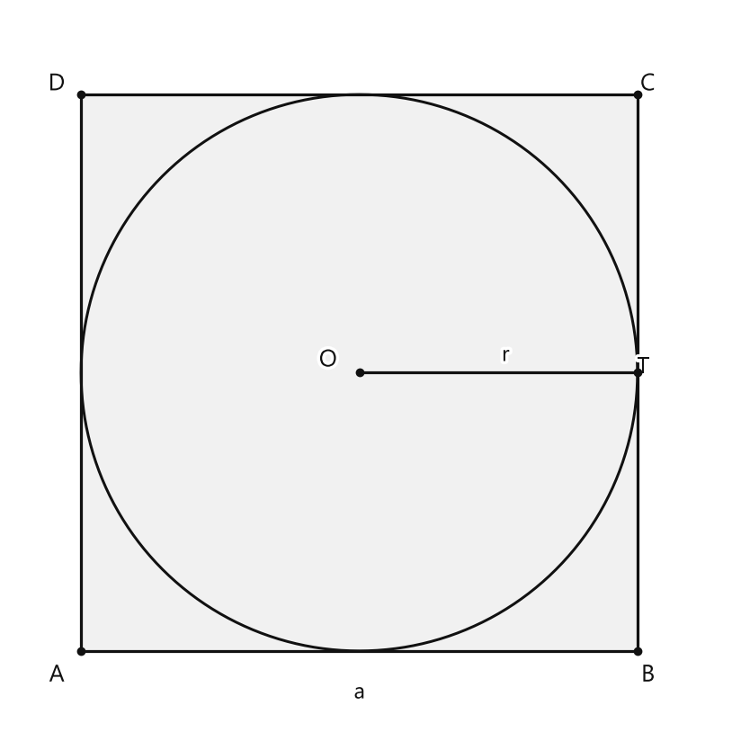
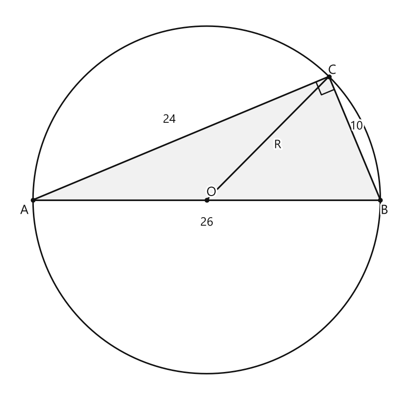
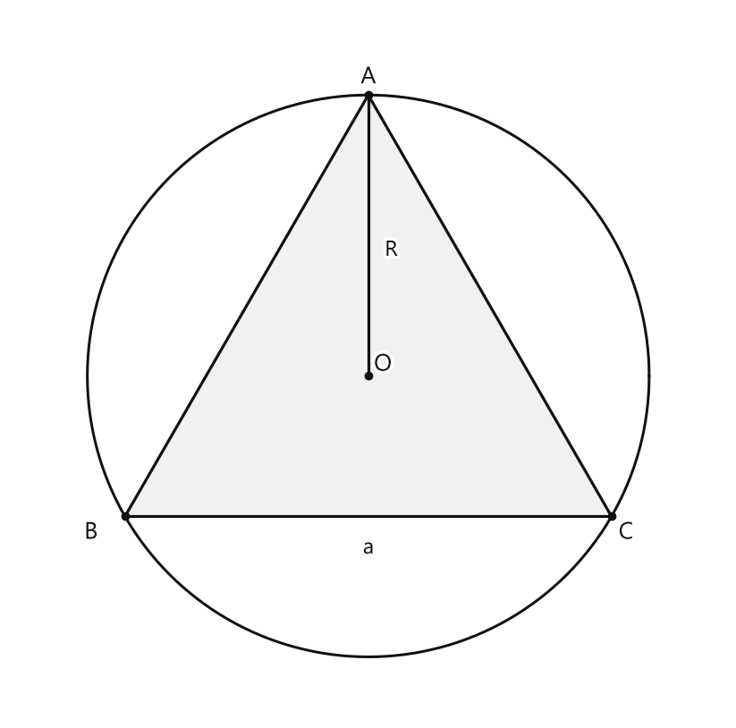

# Занятие 14. Геометрия 3D

**Раздел:** Глава II  
**Параграф учебника:** §14. Геометрия 3D  
**Страницы:** 90–90

## Цели занятия

К концу занятия ученик сможет:

- понимать, что значит «одно тело вписано в другое»;
- находить размеры правильной четырёхугольной призмы по параметрам вписанного цилиндра;
- находить радиус основания конуса по сторонам треугольника, вписанного в его основание;
- находить площадь боковой поверхности правильной треугольной призмы, вписанной в цилиндр;
- правильно связывать радиус окружности и стороны вписанного правильного многоугольника.

Выбирай блок своего уровня:

- **1–2 балла:** понять, какие элементы тел совпадают;
- **3–4 балла:** применять связи между окружностью и правильным многоугольником;
- **5–6 баллов:** решать задания по готовому алгоритму;
- **7–8 баллов:** объяснять, почему используются именно такие формулы;
- **9–10 баллов:** решать смешанные задачи и проверять ответ другим способом.

## Теория к занятию

### 1. Вписанные тела

#### Простыми словами

В пространстве одно тело можно поместить внутрь другого так, чтобы они соприкасались не случайно, а по определённым правилам.

Например:

- цилиндр вписан в призму, если окружности его оснований вписаны в основания призмы;
- пирамида вписана в конус, если основание пирамиды вписано в основание конуса, а вершины совпадают;
- призма вписана в цилиндр, если её основания вписаны в основания цилиндра, а боковые рёбра лежат на боковой поверхности цилиндра.

Смотри на основание тела: именно там чаще всего спрятана главная подсказка. Квадрат, треугольник и окружность уже знакомы по планиметрии — теперь они просто «переехали» в 3D.

#### Факт

**Многогранники (призма, пирамида) и тела вращения (цилиндр, конус, шар) могут быть вписаны друг в друга.**

#### Формулы

Рассмотрим цилиндр, вписанный в правильную четырёхугольную призму.

В основании правильной четырёхугольной призмы лежит квадрат. Окружность основания цилиндра вписана в этот квадрат.

Диаметр окружности равен стороне квадрата:

$$a=2r.$$

Цилиндр и призма имеют одинаковую высоту:

$$H=h.$$

Здесь:

- $a$ — сторона квадратного основания призмы;
- $r$ — радиус основания цилиндра;
- $H$ — высота призмы;
- $h$ — высота цилиндра.

#### Правила

- Если окружность вписана в квадрат, её диаметр равен стороне квадрата.
- Диаметр в два раза больше радиуса:

  $$d=2r.$$

- Если цилиндр и призма имеют общие основания по высоте, их высоты равны.
- Не путай радиус и диаметр: радиус — это половина диаметра. Иначе ответ увеличится вдвое — коварный, но вполне исправимый фокус.

#### Алгоритм

1. Найди сторону квадратного основания призмы:

   $$a=2r.$$

2. Приравняй высоты цилиндра и призмы:

   $$H=h.$$

3. Запиши оба размера призмы: сторону основания и высоту.

#### Ловушки

- Написать $a=r$ вместо $a=2r$.
- Принять радиус за диаметр.
- Найти только сторону основания и забыть высоту.
- Решить, что высота призмы в два раза больше высоты цилиндра. В этой задаче высоты равны.

---

### 2. Пирамида, вписанная в конус

#### Простыми словами

Основание треугольной пирамиды вписано в основание конуса. Значит, треугольник основания пирамиды вписан в окружность основания конуса.

Чтобы найти радиус этой окружности, сначала изучим треугольник со сторонами $10$, $24$ и $26$.

Проверим теорему Пифагора:

$$10^2+24^2=26^2.$$

Значит, треугольник прямоугольный, а сторона $26$ см — его гипотенуза.

Если прямоугольный треугольник вписан в окружность, то гипотенуза является диаметром этой окружности. Значит, радиус равен половине гипотенузы.

Задача выглядит как задача про конус, но ключ к ней лежит в треугольнике. Геометрия любит такие маскировки.

#### Факт

Если прямоугольный треугольник вписан в окружность, то его гипотенуза является диаметром этой окружности.

#### Формулы

Для треугольника со сторонами $a$, $b$, $c$:

$$a^2+b^2=c^2,$$

если $c$ — гипотенуза.

Диаметр описанной окружности:

$$d=c.$$

Радиус:

$$R=\frac{d}{2}=\frac{c}{2}.$$

Здесь:

- $a$, $b$ — катеты;
- $c$ — гипотенуза;
- $d$ — диаметр окружности;
- $R$ — радиус окружности основания конуса.

#### Правила

- Сначала проверь, является ли треугольник прямоугольным.
- Гипотенуза — самая длинная сторона прямоугольного треугольника.
- Если треугольник вписан в окружность, гипотенуза является диаметром.
- Радиус равен половине гипотенузы, а не всей гипотенузе.

#### Алгоритм

1. Выбери наибольшую сторону.
2. Проверь теорему Пифагора.
3. Сделай вывод, что треугольник прямоугольный.
4. Прими гипотенузу за диаметр окружности:

   $$d=c.$$

5. Раздели диаметр на $2$:

   $$R=\frac{c}{2}.$$

#### Ловушки

- Взять радиус равным $26$ см.
- Не проверить, является ли треугольник прямоугольным.
- Взять меньшую сторону за диаметр.
- Забыть разделить диаметр на $2$.

---

### 3. Правильная треугольная призма, вписанная в цилиндр

#### Простыми словами

В основании правильной треугольной призмы лежит равносторонний треугольник.

Этот треугольник вписан в окружность основания цилиндра. Поэтому сторона треугольника связана с радиусом окружности формулой:

$$a=R\sqrt{3}.$$

Боковая поверхность призмы состоит из трёх прямоугольников. У всех них одна сторона равна стороне основания $a$, а другая — высоте призмы $h$.

Поэтому можно действовать двумя способами:

- сложить площади трёх прямоугольников;
- умножить периметр основания на высоту.

Удобнее использовать второй способ:

$$S_{\text{бок}}=Ph.$$

Сначала находим сторону треугольника, затем его периметр, затем площадь боковой поверхности. Три шага — и цилиндр больше не выглядит загадочным.

#### Формулы

Для равностороннего треугольника, вписанного в окружность радиуса $R$:

$$a=R\sqrt{3}.$$

Периметр равностороннего треугольника:

$$P=3a.$$

Площадь боковой поверхности призмы:

$$S_{\text{бок}}=Ph.$$

Следовательно:

$$S_{\text{бок}}=3ah.$$

Здесь:

- $R$ — радиус окружности основания цилиндра;
- $a$ — сторона равностороннего треугольника;
- $P$ — периметр основания призмы;
- $h$ — высота призмы;
- $S_{\text{бок}}$ — площадь боковой поверхности призмы.

#### Правила

- В правильной треугольной призме основание — равносторонний треугольник.
- Высота призмы равна высоте цилиндра.
- Для боковой поверхности используем периметр основания, а не площадь основания.
- Все три боковые грани имеют одинаковую высоту.
- Формула $a=2R$ относится к квадрату, вписанному в окружность, а не к равностороннему треугольнику.

#### Алгоритм

1. Найди сторону основания призмы:

   $$a=R\sqrt{3}.$$

2. Найди периметр основания:

   $$P=3a.$$

3. Возьми высоту цилиндра как высоту призмы:

   $$h=H.$$

4. Найди площадь боковой поверхности:

   $$S_{\text{бок}}=Ph.$$

#### Ловушки

- Использовать формулу площади основания вместо площади боковой поверхности.
- Взять $a=2R$.
- Забыть множитель $3$ в периметре.
- Перепутать радиус и диаметр окружности.
- Использовать высоту цилиндра не там, где нужна высота призмы.

---

## Сводка формул «выучить наизусть»

Для цилиндра, вписанного в правильную четырёхугольную призму:

$$a=2r,$$

$$H=h.$$

Для прямоугольного треугольника:

$$a^2+b^2=c^2.$$

Для радиуса описанной окружности прямоугольного треугольника:

$$R=\frac{c}{2}.$$

Для равностороннего треугольника, вписанного в окружность:

$$a=R\sqrt3.$$

Периметр равностороннего треугольника:

$$P=3a.$$

Площадь боковой поверхности призмы:

$$S_{\text{бок}}=Ph.$$

## Правила, которые нельзя путать

- Радиус — это половина диаметра:

  $$r=\frac d2.$$

- В квадрате, вписанном в окружность, сторона равна диаметру окружности:

  $$a=2r.$$

- В равностороннем треугольнике, вписанном в окружность:

  $$a=R\sqrt3.$$

- Площадь боковой поверхности призмы находится по формуле:

  $$S_{\text{бок}}=Ph,$$

  а не по формуле площади основания.

- Высота вписанных тел совпадает только тогда, когда основания и боковые элементы расположены так, как указано в условии.

- Перед вычислениями выясни, какая фигура находится в основании. Квадрат и равносторонний треугольник требуют разных формул.

## Разбор ключевых заданий

### Р1. Размеры правильной четырёхугольной призмы

**Условие.** В правильную четырёхугольную призму вписан цилиндр так, что его основания вписаны в основания призмы. Радиус основания цилиндра равен $4$ см, высота цилиндра — $10$ см. Найдите размеры призмы.

**Дано:**

$$r=4\text{ см},$$

$$h=10\text{ см}.$$

Найти сторону основания призмы $a$ и её высоту $H$.

<!--geo-figure-spec
{
  "needed": true,
  "kind": "plane",
  "caption": "Квадратное основание призмы с вписанной окружностью",
  "equal": true,
  "axis": false,
  "xlim": [
    -1,
    9.2
  ],
  "ylim": [
    -1,
    9.2
  ],
  "points": {
    "A": [
      0,
      0
    ],
    "B": [
      8,
      0
    ],
    "C": [
      8,
      8
    ],
    "D": [
      0,
      8
    ],
    "O": [
      4,
      4
    ],
    "T": [
      8,
      4
    ]
  },
  "segments": [
    [
      "A",
      "B"
    ],
    [
      "B",
      "C"
    ],
    [
      "C",
      "D"
    ],
    [
      "D",
      "A"
    ],
    {
      "points": [
        "O",
        "T"
      ],
      "dashed": false,
      "label": "",
      "t": 0.5
    }
  ],
  "polygons": [
    {
      "vertices": [
        "A",
        "B",
        "C",
        "D"
      ],
      "fill": 0.06
    }
  ],
  "circles": [
    {
      "center": "O",
      "radius": 4
    }
  ],
  "labels": {
    "A": {
      "dx": -0.35,
      "dy": -0.35
    },
    "B": {
      "dx": 0.15,
      "dy": -0.35
    },
    "C": {
      "dx": 0.15,
      "dy": 0.15
    },
    "D": {
      "dx": -0.35,
      "dy": 0.15
    },
    "O": {
      "dx": -0.45,
      "dy": 0.18
    }
  },
  "texts": [
    {
      "xy": [
        4,
        -0.6
      ],
      "text": "a"
    },
    {
      "xy": [
        6.1,
        4.25
      ],
      "text": "r"
    }
  ]
}
-->

*Квадратное основание призмы с вписанной окружностью*

Основание правильной четырёхугольной призмы — квадрат.

Окружность основания цилиндра вписана в этот квадрат.

Значит, сторона квадрата равна диаметру окружности:

$$a=2r.$$

Подставим значение радиуса:

$$a=2\cdot4.$$

$$a=8\text{ см}.$$

Цилиндр и призма имеют одинаковую высоту:

$$H=h.$$

Подставим значение высоты цилиндра:

$$H=10\text{ см}.$$

**Ответ:** сторона основания призмы — $8$ см, высота призмы — $10$ см.

---

### Р2. Радиус основания конуса

**Условие.** В конус вписана треугольная пирамида так, что её основание вписано в основание конуса, а вершина совпадает с вершиной конуса. Стороны основания пирамиды равны $10$ см, $24$ см и $26$ см. Найдите радиус основания конуса.

**Дано:**

$$a=10\text{ см},$$

$$b=24\text{ см},$$

$$c=26\text{ см}.$$

Найти $R$ — радиус основания конуса.

<!--geo-figure-spec
{
  "needed": true,
  "kind": "plane",
  "caption": "Треугольник основания пирамиды, вписанный в окружность основания конуса",
  "equal": true,
  "axis": false,
  "xlim": [
    -2,
    28
  ],
  "ylim": [
    -14.5,
    14.5
  ],
  "points": {
    "A": [
      0,
      0
    ],
    "B": [
      26,
      0
    ],
    "C": [
      22.1538,
      9.2308
    ],
    "O": [
      13,
      0
    ]
  },
  "segments": [
    [
      "A",
      "B"
    ],
    [
      "B",
      "C"
    ],
    [
      "C",
      "A"
    ],
    {
      "points": [
        "O",
        "C"
      ],
      "dashed": false,
      "label": "",
      "t": 0.5
    }
  ],
  "polygons": [
    {
      "vertices": [
        "A",
        "B",
        "C"
      ],
      "fill": 0.06
    }
  ],
  "circles": [
    {
      "center": "O",
      "radius": 13
    }
  ],
  "labels": {
    "A": {
      "dx": -0.65,
      "dy": -0.8
    },
    "B": {
      "dx": 0.3,
      "dy": -0.8
    },
    "C": {
      "dx": 0.25,
      "dy": 0.45
    },
    "O": {
      "dx": 0.35,
      "dy": 0.55
    }
  },
  "right_angles": [
    {
      "vertex": "C",
      "from": "A",
      "to": "B"
    }
  ],
  "texts": [
    {
      "xy": [
        13,
        -1.7
      ],
      "text": "26"
    },
    {
      "xy": [
        24.2,
        5.5
      ],
      "text": "10"
    },
    {
      "xy": [
        10.2,
        6
      ],
      "text": "24"
    },
    {
      "xy": [
        18.3,
        4.1
      ],
      "text": "R"
    }
  ]
}
-->

*Треугольник основания пирамиды, вписанный в окружность основания конуса*

Основание пирамиды — треугольник, вписанный в окружность основания конуса.

Сначала выясним, является ли этот треугольник прямоугольным.

Возведём в квадрат две меньшие стороны:

$$10^2=100,$$

$$24^2=576.$$

Сложим полученные числа:

$$10^2+24^2=100+576=676.$$

Теперь найдём квадрат наибольшей стороны:

$$26^2=676.$$

Получили равенство:

$$10^2+24^2=26^2.$$

Значит, треугольник прямоугольный.

Сторона $26$ см — гипотенуза.

По свойству прямоугольного треугольника, вписанного в окружность, гипотенуза является диаметром окружности:

$$d=26\text{ см}.$$

Радиус равен половине диаметра:

$$R=\frac d2.$$

Подставим значение диаметра:

$$R=\frac{26}{2}.$$

$$R=13\text{ см}.$$

**Ответ:** $13$ см.

---

### Р3. Площадь боковой поверхности правильной треугольной призмы

**Условие.** В цилиндр вписана правильная треугольная призма так, что основания призмы вписаны в основания цилиндра, а боковые рёбра принадлежат боковой поверхности цилиндра. Радиус основания цилиндра равен $2\sqrt3$ см, высота цилиндра — $8$ см. Найдите площадь боковой поверхности призмы.

**Дано:**

$$R=2\sqrt3\text{ см},$$

$$H=8\text{ см}.$$

Найти $S_{\text{бок}}$.

<!--geo-figure-spec
{
  "needed": true,
  "kind": "plane",
  "caption": "Основание правильной треугольной призмы, вписанное в окружность основания цилиндра",
  "equal": true,
  "axis": false,
  "xlim": [
    -4.4,
    4.4
  ],
  "ylim": [
    -4.2,
    4.5
  ],
  "points": {
    "A": [
      0,
      3.464
    ],
    "B": [
      -3,
      -1.732
    ],
    "C": [
      3,
      -1.732
    ],
    "O": [
      0,
      0
    ]
  },
  "segments": [
    [
      "A",
      "B"
    ],
    [
      "B",
      "C"
    ],
    [
      "C",
      "A"
    ],
    [
      "O",
      "A"
    ]
  ],
  "polygons": [
    {
      "vertices": [
        "A",
        "B",
        "C"
      ],
      "fill": 0.06
    }
  ],
  "circles": [
    {
      "center": "O",
      "radius": 3.464
    }
  ],
  "labels": {
    "A": {
      "dx": 0,
      "dy": 0.22
    },
    "B": {
      "dx": -0.42,
      "dy": -0.2
    },
    "C": {
      "dx": 0.18,
      "dy": -0.2
    },
    "O": {
      "dx": 0.18,
      "dy": 0.14
    }
  },
  "texts": [
    {
      "xy": [
        0,
        -2.12
      ],
      "text": "a"
    },
    {
      "xy": [
        0.28,
        1.55
      ],
      "text": "R"
    }
  ]
}
-->

*Основание правильной треугольной призмы, вписанное в окружность основания цилиндра*

В основании призмы лежит равносторонний треугольник, вписанный в окружность радиуса $R$.

Сторона этого треугольника равна:

$$a=R\sqrt3.$$

Подставим значение радиуса:

$$a=2\sqrt3\cdot\sqrt3.$$

Используем равенство $\sqrt3\cdot\sqrt3=3$:

$$a=2\cdot3.$$

$$a=6\text{ см}.$$

Найдём периметр основания призмы:

$$P=3a.$$

$$P=3\cdot6.$$

$$P=18\text{ см}.$$

Высоты призмы и цилиндра равны:

$$h=H.$$

Подставим значение высоты цилиндра:

$$h=8\text{ см}.$$

Площадь боковой поверхности призмы равна произведению периметра основания на высоту:

$$S_{\text{бок}}=Ph.$$

Подставим найденные значения:

$$S_{\text{бок}}=18\cdot8.$$

$$S_{\text{бок}}=144\text{ см}^2.$$

Проверим результат по боковым граням.

Боковая поверхность состоит из трёх прямоугольников.

Площадь каждого прямоугольника:

$$6\cdot8=48\text{ см}^2.$$

Площадь трёх прямоугольников:

$$3\cdot48=144\text{ см}^2.$$

**Ответ:** $144\text{ см}^2$.

---

### Р4. Обратная задача на цилиндр и призму

**Условие.** В правильную четырёхугольную призму вписан цилиндр. Сторона квадратного основания призмы равна $14$ см, а высота призмы — $9$ см. Найдите радиус основания и высоту цилиндра.

**Дано:**

$$a=14\text{ см},$$

$$H=9\text{ см}.$$

Найти $r$ и $h$.

Окружность основания цилиндра вписана в квадрат.

Поэтому сторона квадрата равна диаметру окружности:

$$a=2r.$$

Выразим радиус:

$$r=\frac a2.$$

Подставим значение стороны квадрата:

$$r=\frac{14}{2}.$$

$$r=7\text{ см}.$$

Высота цилиндра равна высоте призмы:

$$h=H.$$

Подставим значение высоты призмы:

$$h=9\text{ см}.$$

**Ответ:** радиус цилиндра — $7$ см, высота цилиндра — $9$ см.

---

### Р5. Площадь боковой поверхности по радиусу окружности

**Условие.** В цилиндр вписана правильная треугольная призма. Радиус основания цилиндра равен $4$ см, высота цилиндра — $5$ см. Найдите площадь боковой поверхности призмы.

**Дано:**

$$R=4\text{ см},$$

$$H=5\text{ см}.$$

Найти $S_{\text{бок}}$.

В основании призмы находится равносторонний треугольник.

Сначала найдём его сторону:

$$a=R\sqrt3.$$

Подставим значение радиуса:

$$a=4\sqrt3\text{ см}.$$

Теперь найдём периметр основания:

$$P=3a.$$

$$P=3\cdot4\sqrt3.$$

$$P=12\sqrt3\text{ см}.$$

Высота призмы равна высоте цилиндра:

$$h=H.$$

$$h=5\text{ см}.$$

Площадь боковой поверхности призмы равна произведению периметра основания на высоту:

$$S_{\text{бок}}=Ph.$$

Подставим найденные значения:

$$S_{\text{бок}}=12\sqrt3\cdot5.$$

$$S_{\text{бок}}=60\sqrt3\text{ см}^2.$$

Проверим тем же результатом через три боковые грани.

Площадь одной боковой грани:

$$a\cdot h=4\sqrt3\cdot5=20\sqrt3\text{ см}^2.$$

Площадь трёх граней:

$$S_{\text{бок}}=3\cdot20\sqrt3.$$

$$S_{\text{бок}}=60\sqrt3\text{ см}^2.$$

**Ответ:** $60\sqrt3\text{ см}^2$.

## Практические задания

Выбери свой уровень и решай только этот блок. В блоке должна закрепиться вся тема параграфа. Ответы не приводятся.

### Уровень 1–2 балла

**С1.** В правильную четырёхугольную призму вписан цилиндр. Радиус основания цилиндра равен $4$ см, а высота — $10$ см. Чему равна сторона основания призмы?  
1) $2$ см 2) $4$ см 3) $6$ см 4) $8$ см 5) $10$ см

**С2.** В правильную четырёхугольную призму вписан цилиндр. Радиус основания цилиндра равен $3$ см. Какой должна быть сторона квадратного основания призмы?  
1) $3$ см 2) $4$ см 3) $6$ см 4) $9$ см 5) $12$ см

**С3.** В правильную четырёхугольную призму вписан цилиндр так, что основания цилиндра вписаны в основания призмы. Высота цилиндра равна $7$ см. Чему равна высота призмы?  
1) $3{,}5$ см 2) $7$ см 3) $14$ см 4) $21$ см 5) Нельзя определить

**С4.** В цилиндр вписана правильная треугольная призма. Радиус основания цилиндра равен $2$ см. Какая фигура является основанием вписанной призмы?  
1) Квадрат 2) Прямоугольник 3) Равносторонний треугольник 4) Трапеция 5) Круг

**С5.** В цилиндр вписана правильная треугольная призма. Сторона основания призмы равна $6$ см, а высота — $5$ см. Найдите площадь боковой поверхности призмы.  
1) $11$ см² 2) $18$ см² 3) $30$ см² 4) $36$ см² 5) $90$ см²

**С6.** В цилиндр вписана правильная треугольная призма. Площадь боковой поверхности призмы равна $48$ см², а высота призмы — $8$ см. Найдите периметр основания призмы.  
1) $4$ см 2) $6$ см 3) $8$ см 4) $12$ см 5) $16$ см

**С7.** В цилиндр вписана правильная треугольная призма. Радиус основания цилиндра равен $2\sqrt3$ см. Чему равна сторона равностороннего треугольника, вписанного в основание цилиндра?  
1) $2$ см 2) $3$ см 3) $4$ см 4) $6$ см 5) $12$ см

**С8.** В конус вписана треугольная пирамида: основание пирамиды вписано в основание конуса, а вершины совпадают с вершиной конуса. Какой фигурой является основание конуса?  
1) Кругом 2) Квадратом 3) Треугольником 4) Прямоугольником 5) Шаром

**С9.** В основание конуса вписан треугольник со сторонами $6$ см, $8$ см и $10$ см. Найдите радиус основания конуса.  
1) $3$ см 2) $4$ см 3) $5$ см 4) $6$ см 5) $10$ см

**С10.** В конус вписана треугольная пирамида. Основание пирамиды — прямоугольный треугольник с катетами $5$ см и $12$ см. Найдите диаметр основания конуса.  
1) $5$ см 2) $6$ см 3) $12$ см 4) $13$ см 5) $26$ см

**С11.** Выберите все верные утверждения о вписанном цилиндре и правильной четырёхугольной призме: цилиндр имеет общую высоту с призмой; окружность основания цилиндра вписана в квадрат основания призмы; радиус цилиндра равен стороне квадрата основания призмы.  
1) Верно только первое утверждение 2) Верно только второе утверждение 3) Верны только первое и второе утверждения 4) Верны все три утверждения 5) Неверны все утверждения

**С12.** В цилиндр вписана правильная треугольная призма. Высота цилиндра равна $9$ см, а сторона основания призмы — $4$ см. Найдите площадь боковой поверхности призмы.  
1) $13$ см² 2) $27$ см² 3) $36$ см² 4) $48$ см² 5) $108$ см²

**С13.** В правильную четырёхугольную призму вписан цилиндр. Радиус основания цилиндра равен $3$ см, а высота — $8$ см. Чему равна сторона основания призмы?  
1) $3$ см 2) $6$ см 3) $8$ см 4) $9$ см 5) $12$ см

**С14.** В правильную четырёхугольную призму вписан цилиндр, основания которого вписаны в основания призмы. Высота цилиндра равна $11$ см. Чему равна высота призмы?  
1) $5{,}5$ см 2) $11$ см 3) $22$ см 4) $33$ см 5) $121$ см

**С15.** В правильную шестиугольную призму вписан цилиндр так, что окружности его оснований вписаны в основания призмы. Радиус цилиндра равен $4$ см. Какой отрезок равен радиусу окружности основания призмы?  
1) $2$ см 2) $4$ см 3) $6$ см 4) $8$ см 5) $16$ см

**С16.** В цилиндр вписана правильная треугольная призма. Радиус основания цилиндра равен $2$ см, высота — $7$ см. Чему равна сторона основания призмы?  
1) $2$ см 2) $2\sqrt3$ см 3) $3$ см 4) $4$ см 5) $7$ см

**С17.** В цилиндр вписана правильная треугольная призма с высотой $9$ см. Периметр основания призмы равен $12\sqrt3$ см. Найдите площадь боковой поверхности призмы.  
1) $36\sqrt3$ см$^2$ 2) $48\sqrt3$ см$^2$ 3) $72\sqrt3$ см$^2$ 4) $108\sqrt3$ см$^2$ 5) $144\sqrt3$ см$^2$

**С18.** В цилиндр вписана правильная треугольная призма. Сторона равностороннего треугольника в основании призмы равна $6$ см. Чему равен радиус основания цилиндра?  
1) $2$ см 2) $3$ см 3) $2\sqrt3$ см 4) $3\sqrt3$ см 5) $6\sqrt3$ см

**С19.** В конус вписана треугольная пирамида, вершина которой совпадает с вершиной конуса. Основание пирамиды вписано в основание конуса. Стороны основания пирамиды равны $6$ см, $8$ см и $10$ см. Чему равен радиус основания конуса?  
1) $3$ см 2) $4$ см 3) $5$ см 4) $6$ см 5) $8$ см

**С20.** В конус вписана треугольная пирамида. Основание пирамиды — прямоугольный треугольник с катетами $5$ см и $12$ см. Найдите диаметр основания конуса.  
1) $5$ см 2) $6$ см 3) $12$ см 4) $13$ см 5) $26$ см

**С21.** В конус вписана треугольная пирамида. Какая точка основания пирамиды является центром окружности основания конуса?  
1) середина любой стороны треугольника  
2) точка пересечения медиан треугольника  
3) центр описанной окружности треугольника  
4) точка пересечения высот треугольника  
5) любая вершина треугольника

**С22.** Выберите верное утверждение о цилиндре и правильной четырёхугольной призме, если цилиндр вписан в призму.  
1) высота цилиндра в два раза больше высоты призмы  
2) радиус цилиндра равен стороне основания призмы  
3) диаметр основания цилиндра равен стороне основания призмы  
4) диаметр цилиндра равен высоте призмы  
5) площадь основания цилиндра равна площади основания призмы

**С23.** В цилиндр вписана правильная треугольная призма. Высота призмы равна $5$ см, а сторона её основания — $4\sqrt3$ см. Найдите площадь боковой поверхности призмы.  
Ответ запишите в квадратных сантиметрах.

**С24.** В правильную четырёхугольную призму вписан цилиндр. Диаметр основания цилиндра равен $10$ см, высота цилиндра — $6$ см. Запишите длину стороны основания призмы и высоту призмы через запятую.

**С25.** В правильную четырёхугольную призму вписан цилиндр. Радиус основания цилиндра равен $3$ см, а высота — $7$ см. Найдите сторону основания призмы.

**С26.** В правильную четырёхугольную призму вписан цилиндр с радиусом основания $5$ см и высотой $9$ см. Найдите высоту призмы.

**С27.** Выберите тело, в которое может быть вписана правильная треугольная призма так, что основания призмы вписаны в основания тела.

1) цилиндр  
2) шар  
3) конус  
4) пирамида  
5) параллелепипед

**С28.** Основание треугольной пирамиды, вписанной в конус, — прямоугольный треугольник с катетами $6$ см и $8$ см. Вершина пирамиды совпадает с вершиной конуса. Найдите радиус основания конуса.

**С29.** В конус вписана треугольная пирамида. Основание пирамиды — равносторонний треугольник со стороной $6$ см, а вершина пирамиды совпадает с вершиной конуса. Найдите радиус основания конуса.

**С30.** Выберите верное утверждение о правильной призме.

1) Все её боковые грани являются прямоугольниками, а в основании лежит правильный многоугольник.  
2) Все её грани являются треугольниками.  
3) В её основании обязательно лежит круг.  
4) Все рёбра правильной призмы имеют разные длины.  
5) Её боковые рёбра не перпендикулярны основаниям.

**С31.** В цилиндр вписана правильная треугольная призма. Радиус основания цилиндра равен $4$ см, высота — $6$ см. Найдите сторону треугольника в основании призмы.

**С32.** В цилиндр вписана правильная треугольная призма с высотой $10$ см. Радиус основания цилиндра равен $2\sqrt{3}$ см. Найдите площадь боковой поверхности призмы.

**С33.** Выберите тело, основания которого могут совпадать с основаниями вписанной призмы.

1) цилиндр  
2) конус  
3) шар  
4) пирамида  
5) сфера

**С34.** В правильную четырёхугольную призму вписан цилиндр, площадь основания которого равна $16\pi$ см$^2$. Высота цилиндра равна $12$ см. Найдите площадь боковой поверхности призмы.

**С35.** В цилиндр вписана правильная треугольная призма. Сторона треугольника в основании призмы равна $6$ см, а высота призмы — $8$ см. Найдите площадь боковой поверхности призмы.

**С36.** В конус вписана треугольная пирамида с основанием-равнобедренным прямоугольным треугольником. Катеты основания пирамиды равны $10$ см, вершина пирамиды совпадает с вершиной конуса. Найдите радиус основания конуса.

### Уровень 3–4 балла

**С1.** В правильную четырёхугольную призму вписан цилиндр так, что основания цилиндра вписаны в основания призмы. Радиус основания цилиндра равен $5$ см, а высота цилиндра — $12$ см. Найдите сторону основания и высоту призмы.

**С2.** В правильную четырёхугольную призму вписан цилиндр так, что основания цилиндра вписаны в основания призмы. Сторона основания призмы равна $14$ см, а высота призмы — $9$ см. Найдите радиус основания и высоту цилиндра.

**С3.** В правильную шестиугольную призму вписан цилиндр так, что основания цилиндра вписаны в основания призмы. Радиус основания цилиндра равен $6$ см, а высота призмы — $11$ см. Найдите сторону основания и высоту призмы.

**С4.** В цилиндр вписана правильная треугольная призма так, что основания призмы вписаны в основания цилиндра, а боковые рёбра призмы лежат на боковой поверхности цилиндра. Радиус основания цилиндра равен $4$ см, высота цилиндра — $7$ см. Найдите сторону основания призмы.

**С5.** В цилиндр вписана правильная треугольная призма так, что основания призмы вписаны в основания цилиндра, а боковые рёбра призмы лежат на боковой поверхности цилиндра. Сторона основания призмы равна $6\sqrt3$ см, высота призмы — $10$ см. Найдите радиус основания цилиндра и площадь боковой поверхности призмы.

**С6.** В цилиндр вписана правильная треугольная призма так, что основания призмы вписаны в основания цилиндра, а боковые рёбра призмы лежат на боковой поверхности цилиндра. Радиус основания цилиндра равен $5$ см, высота цилиндра — $8$ см. Найдите площадь боковой поверхности призмы.

**С7.** В конус вписана треугольная пирамида так, что основание пирамиды вписано в основание конуса, а вершина пирамиды совпадает с вершиной конуса. Стороны основания пирамиды равны $6$ см, $8$ см и $10$ см. Найдите радиус основания конуса.

**С8.** В конус вписана треугольная пирамида так, что основание пирамиды вписано в основание конуса, а вершина пирамиды совпадает с вершиной конуса. Основание пирамиды является равносторонним треугольником со стороной $12$ см. Найдите радиус основания конуса.

**С9.** В конус вписана треугольная пирамида так, что основание пирамиды вписано в основание конуса, а вершина пирамиды совпадает с вершиной конуса. Основание пирамиды является прямоугольным треугольником с катетами $9$ см и $12$ см. Найдите радиус основания конуса.

**С10.** В правильную четырёхугольную призму вписан цилиндр. Сторона основания призмы равна $10$ см, а высота — $15$ см. Найдите площадь основания и площадь боковой поверхности цилиндра.

**С11.** В цилиндр вписана правильная треугольная призма. Радиус основания цилиндра равен $3\sqrt3$ см, а высота — $12$ см. Найдите площадь основания призмы и площадь её боковой поверхности.

**С12.** В конус вписана треугольная пирамида, основание которой вписано в основание конуса, а вершина совпадает с вершиной конуса. Стороны основания пирамиды равны $5$ см, $12$ см и $13$ см. Найдите диаметр основания конуса.

**С13.** В правильную четырёхугольную призму вписан цилиндр: основания цилиндра вписаны в основания призмы, а высоты цилиндра и призмы совпадают. Радиус основания цилиндра равен $5$ см, высота цилиндра — $12$ см. Найдите сторону основания и высоту призмы.

**С14.** В цилиндр вписана правильная треугольная призма: основания призмы вписаны в основания цилиндра, а боковые рёбра призмы принадлежат боковой поверхности цилиндра. Радиус основания цилиндра равен $4\sqrt{3}$ см, высота цилиндра — $7$ см. Найдите сторону основания призмы.

**С15.** В конус вписана треугольная пирамида так, что основание пирамиды вписано в основание конуса, а вершины пирамиды и конуса совпадают. Стороны основания пирамиды равны $6$ см, $8$ см и $10$ см. Найдите радиус основания конуса.

**С16.** В правильную четырёхугольную призму вписан цилиндр. Сторона основания призмы равна $14$ см, а высота призмы — $9$ см. Найдите радиус основания и высоту цилиндра.

**С17.** В цилиндр вписана правильная треугольная призма. Сторона основания призмы равна $12$ см, высота призмы — $15$ см. Найдите радиус основания цилиндра.

**С18.** В цилиндр вписана правильная треугольная призма так, что её основания вписаны в основания цилиндра. Радиус основания цилиндра равен $6$ см, высота — $10$ см. Найдите площадь боковой поверхности призмы.

**С19.** В правильную четырёхугольную призму вписан цилиндр с радиусом основания $3$ см и высотой $8$ см. Найдите площадь боковой поверхности призмы.

**С20.** В конус вписана треугольная пирамида. Основание пирамиды — прямоугольный треугольник с катетами $9$ см и $12$ см. Найдите радиус основания конуса.

**С21.** В цилиндр вписана правильная треугольная призма, сторона основания которой равна $10\sqrt{3}$ см. Высота цилиндра равна $11$ см. Найдите площадь боковой поверхности призмы.

**С22.** В правильную четырёхугольную призму вписан цилиндр. Площадь основания цилиндра равна $16\pi$ см$^2$, а высота цилиндра равна $13$ см. Найдите площадь боковой поверхности призмы.

**С23.** В конус вписана треугольная пирамида с равносторонним основанием. Сторона основания пирамиды равна $12\sqrt{3}$ см. Найдите радиус основания конуса.

**С24.** В цилиндр вписана правильная треугольная призма. Радиус основания цилиндра равен $5$ см, а высота — $6$ см. Найдите площадь боковой поверхности призмы.

**С25.** В правильную четырёхугольную призму вписан цилиндр. Радиус основания цилиндра равен $3$ см, высота — $7$ см. Найдите сторону основания и высоту призмы.

**С26.** В правильную шестиугольную призму вписан цилиндр так, что основания цилиндра вписаны в основания призмы. Радиус основания цилиндра равен $5$ см, высота цилиндра — $12$ см. Найдите сторону основания призмы.

**С27.** В конус вписана треугольная пирамида, основанием которой является прямоугольный треугольник со сторонами $6$ см, $8$ см и $10$ см. Найдите радиус основания конуса.

**С28.** В цилиндр вписана правильная треугольная призма. Радиус основания цилиндра равен $4$ см, высота — $9$ см. Найдите площадь боковой поверхности призмы.

**С29.** В правильную четырёхугольную призму вписан цилиндр. Радиус основания цилиндра равен $2{,}5$ см, высота — $8$ см. Найдите объём призмы.

**С30.** В конус вписана треугольная пирамида, основанием которой является треугольник со сторонами $10$ см, $10$ см и $12$ см. Найдите радиус основания конуса.

**С31.** В цилиндр вписана правильная шестиугольная призма. Радиус основания цилиндра равен $6$ см, высота — $10$ см. Найдите площадь боковой поверхности призмы.

**С32.** В конус вписана правильная четырёхугольная пирамида. Радиус основания конуса равен $5$ см, высота конуса равна $12$ см. Найдите объём пирамиды.

**С33.** В правильную четырёхугольную призму вписан цилиндр. Радиус основания цилиндра равен $3$ см, высота — $11$ см. Найдите площадь боковой поверхности призмы.

**С34.** В конус вписана правильная треугольная пирамида, сторона основания которой равна $12$ см. Найдите радиус основания конуса.

**С35.** В цилиндр вписана правильная треугольная призма. Радиус основания цилиндра равен $6$ см, высота — $5$ см. Найдите объём призмы.

**С36.** В правильную четырёхугольную призму вписан цилиндр высотой $10$ см. Объём цилиндра равен $250\pi$ см$^3$. Найдите объём призмы.

### Уровень 5–6 баллов

**С1.** В правильную четырёхугольную призму вписан цилиндр: основания цилиндра вписаны в основания призмы, а высоты тел совпадают. Радиус основания цилиндра равен $5$ см, высота призмы — $12$ см. Найдите сторону основания и высоту призмы.

**С2.** В правильную четырёхугольную призму вписан цилиндр. Сторона квадратного основания призмы равна $14$ см, высота призмы равна $9$ см. Найдите радиус основания и высоту цилиндра.

**С3.** В цилиндр вписана правильная треугольная призма так, что основания призмы вписаны в основания цилиндра, а её боковые рёбра лежат на боковой поверхности цилиндра. Радиус основания цилиндра равен $4$ см, высота цилиндра — $10$ см. Найдите сторону основания призмы.

**С4.** В цилиндр вписана правильная треугольная призма. Радиус основания цилиндра равен $6$ см, а высота — $7$ см. Найдите площадь боковой поверхности призмы.

**С5.** В цилиндр вписана правильная треугольная призма, площадь боковой поверхности которой равна $108\sqrt3$ см$^2$. Высота цилиндра равна $9$ см. Найдите радиус основания цилиндра.

**С6.** В конус вписана треугольная пирамида так, что основание пирамиды вписано в основание конуса, а вершины пирамиды и конуса совпадают. Стороны основания пирамиды равны $6$ см, $8$ см и $10$ см. Найдите радиус основания конуса.

**С7.** В конус вписана треугольная пирамида. Стороны треугольника, являющегося основанием пирамиды, равны $10$ см, $10$ см и $12$ см. Найдите радиус основания конуса.

**С8.** В конус вписана треугольная пирамида с прямоугольным основанием. Катеты основания пирамиды равны $9$ см и $12$ см. Найдите радиус основания конуса.

**С9.** В правильную четырёхугольную призму вписан цилиндр с радиусом основания $3$ см и высотой $8$ см. Найдите площадь полной поверхности призмы.

**С10.** В цилиндр вписана правильная треугольная призма. Радиус основания цилиндра равен $2\sqrt3$ см, а высота — $6$ см. Найдите площадь полной поверхности призмы.

**С11.** В правильную четырёхугольную призму вписан цилиндр, объём которого равен $200\pi$ см$^3$, а высота цилиндра равна $8$ см. Найдите сторону основания призмы.

**С12.** В цилиндр вписана правильная треугольная призма, сторона основания которой равна $6\sqrt3$ см, а высота равна $11$ см. Найдите радиус основания цилиндра и площадь боковой поверхности призмы.

**С13.** В правильную четырёхугольную призму вписан цилиндр так, что основания цилиндра вписаны в основания призмы. Радиус основания цилиндра равен $5$ см, а высота — $12$ см. Найдите сторону основания и высоту призмы.

**С14.** В цилиндр вписана правильная треугольная призма так, что основания призмы вписаны в основания цилиндра, а боковые рёбра лежат на боковой поверхности цилиндра. Радиус основания цилиндра равен $4$ см. Найдите сторону основания призмы.

**С15.** В правильную четырёхугольную призму вписан цилиндр. Сторона основания призмы равна $8$ см, высота призмы равна $15$ см. Найдите радиус основания и высоту цилиндра.

**С16.** В цилиндр вписана правильная треугольная призма. Сторона основания призмы равна $6\sqrt3$ см, а высота призмы равна $10$ см. Найдите радиус основания и высоту цилиндра.

**С17.** В конус вписана треугольная пирамида так, что основание пирамиды вписано в основание конуса, а вершины пирамиды и конуса совпадают. Стороны основания пирамиды равны $13$ см, $14$ см и $15$ см. Найдите радиус основания конуса.

**С18.** В конус вписана треугольная пирамида с основанием в форме прямоугольного треугольника. Катеты основания равны $9$ см и $12$ см. Найдите радиус основания конуса.

**С19.** В цилиндр вписана правильная треугольная призма. Радиус основания цилиндра равен $6$ см, а высота — $9$ см. Найдите площадь боковой поверхности призмы.

**С20.** В цилиндр вписана правильная треугольная призма, площадь основания которой равна $9\sqrt3$ см$^2$. Высота призмы равна $7$ см. Найдите площадь боковой поверхности цилиндра.

**С21.** В правильную четырёхугольную призму вписан цилиндр. Радиус основания цилиндра равен $3\sqrt2$ см, а высота — $11$ см. Найдите площадь полной поверхности призмы.

**С22.** В цилиндр вписана правильная треугольная призма. Радиус основания цилиндра равен $5$ см, а высота — $12$ см. Найдите площадь полной поверхности призмы.

**С23.** В конус вписана треугольная пирамида с равносторонним основанием. Сторона основания пирамиды равна $12$ см. Найдите радиус основания конуса.

**С24.** В правильную четырёхугольную призму вписан цилиндр, радиус основания которого равен $4$ см. Площадь боковой поверхности призмы равна $160$ см$^2$. Найдите высоту призмы.

**С25.** В правильную четырёхугольную призму вписан цилиндр. Радиус основания цилиндра равен $4$ см, а высота — $10$ см. Найдите длину ребра основания и высоту призмы.

**С26.** В конус вписана треугольная пирамида: основание пирамиды вписано в основание конуса, а вершины основания пирамиды лежат на окружности основания конуса. Стороны треугольника в основании пирамиды равны $10$ см, $24$ см и $26$ см. Найдите радиус основания конуса.

**С27.** В цилиндр вписана правильная треугольная призма. Радиус основания цилиндра равен $2\sqrt3$ см, а высота — $8$ см. Найдите площадь боковой поверхности призмы.

**С28.** В правильную шестиугольную призму вписан цилиндр так, что окружности оснований цилиндра вписаны в основания призмы. Радиус цилиндра равен $6$ см, а высота — $9$ см. Найдите длину стороны основания призмы и площадь её боковой поверхности.

**С29.** В конус вписана правильная четырёхугольная пирамида, вершина которой совпадает с вершиной конуса. Сторона квадратного основания пирамиды равна $12$ см. Найдите радиус основания конуса.

**С30.** В конус вписана треугольная пирамида, вершина которой совпадает с вершиной конуса. Основание пирамиды вписано в основание конуса, а стороны треугольника равны $5$ см, $12$ см и $13$ см. Найдите радиус основания конуса.

### Уровень 7–8 баллов

**С1.** В правильную четырёхугольную призму вписан цилиндр: окружности оснований цилиндра вписаны в основания призмы, а высота цилиндра равна высоте призмы. Радиус основания цилиндра равен $5$ см, высота — $12$ см. Найдите сторону основания и высоту призмы, а также площадь её полной поверхности.

**С2.** В цилиндр вписана правильная треугольная призма так, что вершины оснований призмы лежат на окружностях оснований цилиндра, а боковые рёбра принадлежат боковой поверхности цилиндра. Радиус основания цилиндра равен $4$ см, высота — $9$ см. Найдите сторону основания призмы и площадь её боковой поверхности.

**С3.** В конус вписана треугольная пирамида, вершина пирамиды совпадает с вершиной конуса, а основание пирамиды вписано в основание конуса. Стороны основания пирамиды равны $13$ см, $14$ см и $15$ см. Найдите радиус основания конуса.

**С4.** В правильную шестиугольную призму вписан цилиндр так, что основания цилиндра вписаны в основания призмы, а высоты тел совпадают. Радиус основания цилиндра равен $6$ см, высота призмы — $10$ см. Найдите сторону основания призмы и площадь её боковой поверхности.

**С5.** В цилиндр вписана правильная четырёхугольная призма. Сторона квадратного основания призмы равна $8$ см, а её высота — $15$ см. Найдите радиус основания цилиндра, площадь боковой поверхности цилиндра и площадь боковой поверхности призмы.

**С6.** В конус с радиусом основания $10$ см вписана треугольная пирамида, основание которой является равносторонним треугольником, вписанным в основание конуса. Высота конуса равна $24$ см. Найдите сторону основания пирамиды и образующую конуса.

**С7.** В шар радиуса $5$ см вписан цилиндр, радиус основания которого равен $3$ см. Ось цилиндра проходит через центр шара. Найдите высоту цилиндра и площадь его полной поверхности.

**С8.** В шар радиуса $13$ см вписан цилиндр высотой $10$ см. Ось цилиндра проходит через центр шара. Найдите радиус основания цилиндра и площадь его боковой поверхности.

**С9.** В правильную четырёхугольную призму вписан цилиндр. Площадь основания цилиндра равна $16\pi$ см$^2$, а площадь его боковой поверхности равна $80\pi$ см$^2$. Найдите площадь полной поверхности призмы.

**С10.** В цилиндр вписана правильная треугольная призма. Площадь основания цилиндра равна $12\pi$ см$^2$, а высота цилиндра равна $7$ см. Найдите площадь полной поверхности призмы.

**С11.** В конус вписана правильная четырёхугольная пирамида так, что вершины квадрата основания пирамиды лежат на окружности основания конуса, а вершина пирамиды совпадает с вершиной конуса. Радиус основания конуса равен $6$ см, высота конуса — $8$ см. Найдите сторону основания пирамиды, высоту боковой грани пирамиды и площадь боковой поверхности пирамиды.

**С12.** В цилиндр вписана правильная шестиугольная призма. Площадь боковой поверхности призмы равна $144$ см$^2$, а сторона её основания равна $4$ см. Найдите радиус основания цилиндра, высоту призмы и площадь полной поверхности цилиндра.

**С13.** В правильную четырёхугольную призму вписан цилиндр: основания цилиндра являются кругами, вписанными в основания призмы, а боковая поверхность цилиндра касается боковых граней призмы. Радиус цилиндра равен $5$ см, высота — $12$ см. Найдите сторону основания, высоту и площадь полной поверхности призмы. Обоснуйте связь размеров цилиндра и призмы.

**С14.** В конус вписана треугольная пирамида, вершина которой совпадает с вершиной конуса, а основание вписано в основание конуса. Стороны основания пирамиды равны $6$ см, $8$ см и $10$ см. Найдите радиус основания конуса. Обоснуйте, почему для решения используется радиус окружности, описанной около основания пирамиды.

**С15.** В цилиндр вписана правильная треугольная призма. Стороны оснований призмы вписаны в окружности оснований цилиндра, а боковые рёбра призмы являются образующими цилиндра. Радиус цилиндра равен $4\sqrt3$ см, высота — $9$ см. Найдите площадь боковой поверхности призмы и её объём.

**С16.** В правильную шестиугольную призму вписан цилиндр так, что окружности оснований цилиндра вписаны в основания призмы, а высоты тел совпадают. Радиус цилиндра равен $6$ см, высота — $10$ см. Найдите сторону основания призмы, площадь её боковой поверхности и объём призмы. Обоснуйте найденную связь между радиусом цилиндра и стороной правильного шестиугольника.

**С17.** В конус вписана правильная четырёхугольная пирамида. Основание пирамиды — квадрат со стороной $12$ см, высота пирамиды равна высоте конуса и составляет $8$ см. Найдите радиус основания конуса, образующую конуса и площадь боковой поверхности конуса.

**С18.** В куб вписан цилиндр так, что основания цилиндра вписаны в две противоположные грани куба, а боковая поверхность цилиндра касается четырёх боковых граней куба. Диагональ куба равна $6\sqrt3$ см. Найдите радиус и высоту цилиндра, а также отношение объёма цилиндра к объёму куба.

**С19.** В цилиндр вписана правильная шестиугольная призма. Радиус основания цилиндра равен $5$ см, высота — $14$ см. Найдите площадь полной поверхности призмы и объём части цилиндра, не занятой призмой. Ответ для объёма оставьте в виде выражения с $\pi$.

**С20.** В конус вписана правильная четырёхугольная пирамида. Сторона квадратного основания равна $16$ см, высота конуса равна $15$ см, а вершины квадрата лежат на окружности основания конуса. Найдите площадь боковой поверхности пирамиды и площадь боковой поверхности конуса. Обоснуйте, почему высоты боковых граней пирамиды и образующая конуса вычисляются по разным прямоугольным треугольникам.

**С21.** Шар вписан в правильную четырёхугольную призму со стороной основания $10$ см. Найдите радиус шара, высоту призмы и объём части призмы, расположенной вне шара. Считайте, что шар касается всех граней призмы.

**С22.** В цилиндр вписан шар радиусом $6$ см: шар касается двух оснований цилиндра и его боковой поверхности. Найдите высоту цилиндра, радиус основания цилиндра, площадь полной поверхности цилиндра и объём цилиндра. Объясните, какие размеры цилиндра определяются условием касания шара.

**С23.** В правильную треугольную призму вписан цилиндр. Сторона основания призмы равна $12$ см, высота — $15$ см. Найдите радиус основания цилиндра, площадь боковой поверхности цилиндра и разность между площадями боковых поверхностей призмы и цилиндра. Обоснуйте, что окружность основания цилиндра является вписанной окружностью равностороннего треугольника.

**С24.** В конус вписана треугольная пирамида с равносторонним основанием. Радиус основания конуса равен $6$ см, высота конуса — $8$ см. Основание пирамиды вписано в основание конуса, а вершина пирамиды совпадает с вершиной конуса. Найдите сторону основания пирамиды, площадь её основания и объём пирамиды. Затем сравните объёмы конуса и пирамиды и обоснуйте полученное отношение.

### Уровень 9–10 баллов

**С1.** В правильную четырёхугольную призму вписан цилиндр: окружности оснований цилиндра вписаны в основания призмы, а высота цилиндра совпадает с высотой призмы. Радиус основания цилиндра равен $5$ см, высота — $12$ см. Найдите площадь полной поверхности призмы.

**С2.** В цилиндр вписана правильная треугольная призма так, что основания призмы вписаны в основания цилиндра, а её боковые рёбра принадлежат боковой поверхности цилиндра. Радиус основания цилиндра равен $4$ см, высота — $9$ см. Найдите площадь боковой поверхности призмы.

**С3.** В конус вписана треугольная пирамида: основание пирамиды вписано в основание конуса, а вершины пирамиды и конуса совпадают. Основание пирамиды — прямоугольный треугольник с катетами $6$ см и $8$ см. Найдите радиус основания конуса.

**С4.** В конус вписана правильная четырёхугольная пирамида так, что основание пирамиды вписано в основание конуса, а вершины пирамиды и конуса совпадают. Радиус основания конуса равен $6$ см, высота конуса — $8$ см. Найдите объём пирамиды.

**С5.** В шар вписан куб с ребром $6$ см. Найдите площадь поверхности шара.

**С6.** В цилиндр вписан шар радиуса $5$ см: шар касается обоих оснований цилиндра и его боковой поверхности. Найдите площадь полной поверхности цилиндра.

**С7.** В цилиндр вписана правильная шестиугольная призма так, что основания призмы вписаны в основания цилиндра, а её боковые рёбра принадлежат боковой поверхности цилиндра. Радиус основания цилиндра равен $6$ см, высота — $10$ см. Найдите площадь боковой поверхности призмы.

**С8.** В конус вписана правильная четырёхугольная пирамида. Сторона основания пирамиды равна $10$ см, высота конуса и пирамиды равна $12$ см. Найдите объём пирамиды.

**С9.** В шар радиуса $13$ см вписан цилиндр высотой $10$ см. Основания цилиндра являются сечениями шара плоскостями, расположенными симметрично относительно центра шара. Найдите площадь боковой поверхности цилиндра.

**С10.** В цилиндр вписана правильная треугольная призма. Радиус основания цилиндра равен $5$ см, высота цилиндра равна $7$ см. Найдите объём призмы.

**С11.** В конус вписана правильная четырёхугольная пирамида: основание пирамиды вписано в основание конуса, а вершины пирамиды и конуса совпадают. Сторона основания пирамиды равна $12$ см, высота конуса равна $9$ см. Найдите площадь полной поверхности пирамиды.

**С12.** В цилиндр вписана правильная шестиугольная призма так, что основания призмы вписаны в основания цилиндра, а её боковые рёбра принадлежат боковой поверхности цилиндра. Радиус основания цилиндра равен $4$ см, высота — $6$ см. Найдите площадь полной поверхности призмы.

**С13.** В правильную четырёхугольную призму вписан цилиндр: основания цилиндра вписаны в основания призмы, а образующие цилиндра совпадают с боковыми рёбрами призмы. Радиус цилиндра равен $5$ см, высота — $12$ см. Найдите объём части призмы, расположенной вне цилиндра.

**С14.** В конус вписана треугольная пирамида, причём основание пирамиды вписано в основание конуса, а вершины пирамиды и конуса совпадают. Стороны основания пирамиды равны $13$ см, $14$ см и $15$ см. Найдите радиус основания конуса.

**С15.** В цилиндр вписана правильная шестиугольная призма так, что основания призмы вписаны в основания цилиндра, а боковые рёбра принадлежат боковой поверхности цилиндра. Радиус основания цилиндра равен $6$ см, высота — $10$ см. Найдите полную площадь поверхности призмы.

**С16.** В конус вписана правильная четырёхугольная пирамида: основание пирамиды вписано в основание конуса, а вершины пирамиды и конуса совпадают. Радиус основания конуса равен $5$ см, высота — $12$ см. Найдите объём пирамиды.

**С17.** В цилиндр вписана правильная треугольная призма. Площадь боковой поверхности призмы равна $144\sqrt3$ см$^2$, а высота цилиндра и призмы равна $8$ см. Найдите объём цилиндра.

**С18.** В конус вписана треугольная пирамида, причём основание пирамиды вписано в основание конуса, а вершины пирамиды и конуса совпадают. Стороны основания пирамиды равны $13$ см, $14$ см и $15$ см. Высота конуса равна $12$ см. Найдите сумму объёмов конуса и пирамиды.

## Чек-лист «ученик понял тему»

- Могу повторить определения и формулы параграфа своими словами и по учебнику.
- Решаю типовые задания своего уровня без подсказки.
- Вижу типичную ошибку и могу её объяснить.
