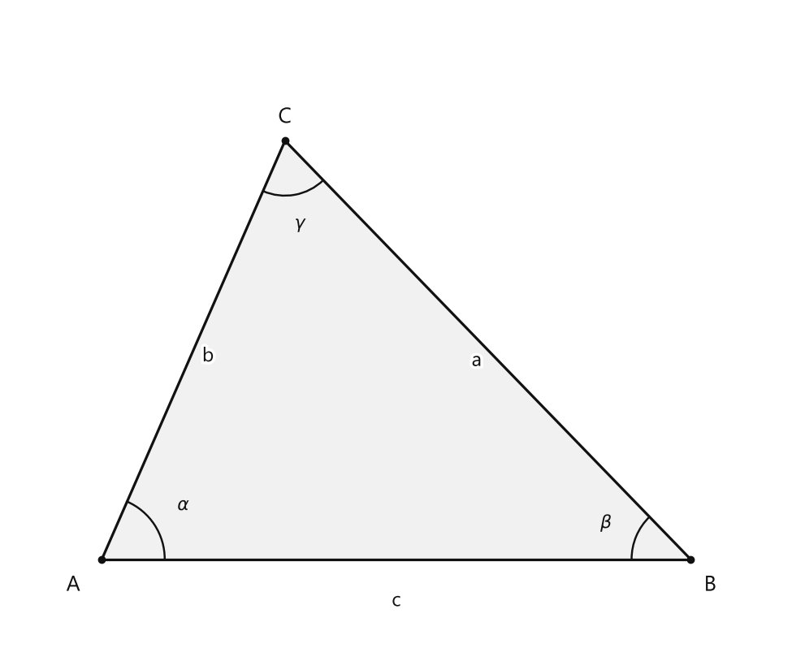
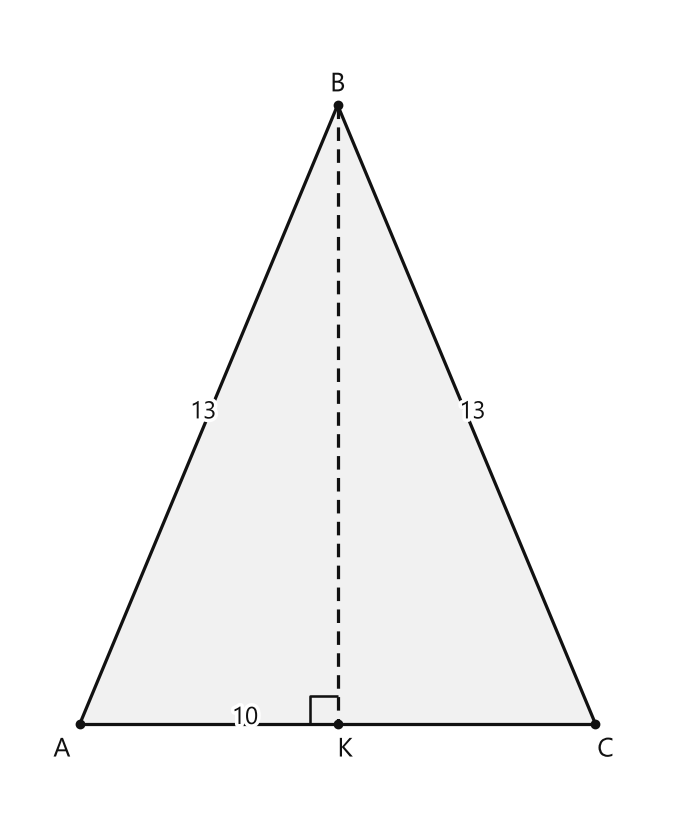

# Занятие 17. Теорема синусов

**Раздел:** Глава III  
**Параграф учебника:** §12. Теорема синусов  
**Страницы:** 105–112

## Цели занятия

После занятия ты умеешь:

- связывать стороны треугольника с противолежащими углами;
- находить неизвестную сторону по двум углам и известной стороне;
- находить неизвестный угол по двум сторонам и одному углу;
- вычислять радиус описанной окружности;
- использовать формулу площади треугольника через его стороны и радиус;
- проверять, не потерялся ли тупой угол при вычислении синуса.

Выбирай блок своего уровня:

- **1–2 балла:** понять теорему и применять готовую формулу;
- **3–4 балла:** находить стороны и углы;
- **5–6 баллов:** вычислять радиус описанной окружности;
- **7–8 баллов:** решать задачи с несколькими шагами;
- **9–10 баллов:** доказывать формулы и разбирать нестандартные конфигурации.

## Теория к занятию

### 1. Связь стороны и противолежащего угла

#### Простыми словами

Смотри на треугольник как на три пары:

- стороне $a$ противолежит угол $\alpha$;
- стороне $b$ противолежит угол $\beta$;
- стороне $c$ противолежит угол $\gamma$.

Сторона и угол напротив неё образуют «свою пару». В теореме синусов нельзя соединять сторону $a$ с углом $\beta$: это уже чужая команда.

Если сторона больше, то и противолежащий угол больше. А теорема синусов позволяет не только сравнить их, но и точно вычислить неизвестную сторону, угол или радиус окружности.

#### Теорема

Стороны треугольника пропорциональны синусам противолежащих углов. Отношение стороны треугольника к синусу противолежащего угла равно удвоенному радиусу окружности, описанной около треугольника, т. е.

$$
\frac{a}{\sin \alpha} = \frac{b}{\sin \beta} = \frac{c}{\sin \gamma} = 2R.
$$

<!--geo-figure-spec
{
  "needed": true,
  "kind": "plane",
  "caption": "Треугольник $ABC$",
  "equal": true,
  "axis": false,
  "xlim": [
    -0.7,
    5.2
  ],
  "ylim": [
    -0.7,
    4.2
  ],
  "points": {
    "A": [
      0,
      0
    ],
    "B": [
      4.5,
      0
    ],
    "C": [
      1.4,
      3.2
    ]
  },
  "segments": [
    {
      "points": [
        "A",
        "B"
      ],
      "label": "",
      "t": 0.5
    },
    {
      "points": [
        "B",
        "C"
      ],
      "label": "a",
      "t": 0.5
    },
    {
      "points": [
        "C",
        "A"
      ],
      "label": "b",
      "t": 0.5
    }
  ],
  "polygons": [
    {
      "vertices": [
        "A",
        "B",
        "C"
      ],
      "fill": 0.06
    }
  ],
  "circles": [],
  "labels": {
    "A": {
      "dx": -0.22,
      "dy": -0.2
    },
    "B": {
      "dx": 0.15,
      "dy": -0.2
    },
    "C": {
      "dx": 0,
      "dy": 0.18
    }
  },
  "right_angles": [],
  "angle_marks": [
    {
      "vertex": "A",
      "from": "B",
      "to": "C",
      "text": "$\\alpha$",
      "radius": 0.48
    },
    {
      "vertex": "B",
      "from": "A",
      "to": "C",
      "text": "$\\beta$",
      "radius": 0.45
    },
    {
      "vertex": "C",
      "from": "A",
      "to": "B",
      "text": "$\\gamma$",
      "radius": 0.42
    }
  ],
  "texts": [
    {
      "xy": [
        2.25,
        -0.32
      ],
      "text": "c"
    }
  ]
}
-->

*Треугольник ABC*

#### Формулы

Из теоремы синусов можно взять равенство двух дробей:

$$
\frac{a}{\sin \alpha} = \frac{b}{\sin \beta}.
$$

Если нужно найти сторону $b$, выразим её:

$$
b = \frac{a\sin\beta}{\sin\alpha}.
$$

Если нужно найти угол $\beta$, сначала найдём его синус:

$$
\sin\beta = \frac{b\sin\alpha}{a}.
$$

Связь с радиусом описанной окружности:

$$
\frac{a}{\sin\alpha}=2R.
$$

Из этого равенства получаем:

$$
R=\frac{a}{2\sin\alpha},
$$

$$
a=2R\sin\alpha,
$$

$$
\sin\alpha=\frac{a}{2R}.
$$

Здесь $a$, $b$, $c$ — стороны треугольника, $\alpha$, $\beta$, $\gamma$ — противолежащие им углы, $R$ — радиус окружности, описанной около треугольника.

#### Правила

- Сначала найди пары «сторона — угол напротив неё».
- Сторона $a$ соединяется с $\sin\alpha$, сторона $b$ — с $\sin\beta$, сторона $c$ — с $\sin\gamma$.
- Калькулятор должен быть установлен в градусный режим.
- Если по синусу найден острый угол, проверь условие задачи: настоящий угол может быть тупым.
- Округляй числа только в конце решения.

#### Алгоритм нахождения стороны

1. Запиши теорему синусов.
2. Выбери известную пару «сторона — противолежащий угол».
3. Подставь известные данные.
4. Вырази неизвестную сторону.
5. Выполни вычисления.
6. Округли ответ только в самом конце.

Например, если известны $a$, $\alpha$ и $\beta$, то:

$$
\frac{a}{\sin\alpha}=\frac{b}{\sin\beta},
$$

$$
b=\frac{a\sin\beta}{\sin\alpha}.
$$

#### Алгоритм нахождения угла

1. Запиши теорему синусов.
2. Вырази синус неизвестного угла.
3. Найди на калькуляторе острый угол с таким синусом.
4. Проверь, может ли искомый угол быть тупым.
5. Если известны два угла, найди третий по формуле суммы углов треугольника:

$$
\alpha+\beta+\gamma=180^\circ.
$$

#### Ловушки

- Против большей стороны лежит больший угол.
- Равные синусы не всегда означают равные углы:

$$
\sin\theta=\sin(180^\circ-\theta).
$$

- Если в условии сказано, что угол острый, второй вариант $180^\circ-\theta$ не подходит.
- Не округляй промежуточные значения слишком рано. Иначе маленькая погрешность может испортить весь последний ответ. Калькулятор любит точность, а не раннюю драму.

---

### 2. Нахождение радиуса описанной окружности

#### Простыми словами

Окружность, описанная около треугольника, проходит через все его вершины.

Теорема синусов связывает сторону, угол напротив неё и радиус этой окружности:

$$
\frac{a}{\sin\alpha}=2R.
$$

Поэтому, если известны сторона и противолежащий угол, радиус можно найти сразу.

#### Формула

$$
\frac{a}{\sin\alpha}=2R.
$$

Следовательно:

$$
R=\frac{a}{2\sin\alpha}.
$$

#### Правила

- В формулу подставляй сторону и угол, которые лежат напротив друг друга.
- Если дана сторона $a$, нужен угол $\alpha$, а не любой другой угол треугольника.
- Величина $\frac{a}{\sin\alpha}$ равна диаметру описанной окружности, то есть $2R$.
- Радиус в два раза меньше диаметра.

#### Ловушки

- Записать $R=\frac{a}{\sin\alpha}$ — ошибка: это значение равно $2R$.
- Не перепутай радиус и диаметр.
- В равностороннем треугольнике угол равен $60^\circ$, поэтому используется $\sin60^\circ$, а не $\sin30^\circ$.

---

### 3. Формула площади через стороны и радиус

#### Простыми словами

Площадь треугольника можно найти по двум сторонам и углу между ними:

$$
S=\frac12 ab\sin\gamma.
$$

Но иногда угол неизвестен. Тогда теорема синусов помогает заменить $\sin\gamma$ выражением через сторону $c$ и радиус $R$.

Так получается формула, где нужны только три стороны и радиус описанной окружности.

#### Теорема и формулы

Формула площади треугольника:

$$
S = \frac{abc}{4R}.
$$

Формула радиуса описанной окружности треугольника:

$$
R = \frac{abc}{4S}.
$$

#### Вывод формулы

По теореме синусов:

$$
\frac{c}{\sin\gamma}=2R.
$$

Выразим $\sin\gamma$:

$$
\sin\gamma=\frac{c}{2R}.
$$

Используем известную формулу площади:

$$
S=\frac12 ab\sin\gamma.
$$

Подставим найденное значение синуса:

$$
S=\frac12 ab\cdot\frac{c}{2R}.
$$

Перемножим числители и знаменатели:

$$
S=\frac{abc}{4R}.
$$

Если нужно найти радиус, преобразуем эту формулу:

$$
R=\frac{abc}{4S}.
$$

#### Ловушки

- В знаменателе стоит $4R$, а не $2R$.
- В числителе должны быть все три стороны: $a$, $b$ и $c$.
- Площадь $S$ измеряется в квадратных единицах.
- Формулу $S=\frac12 ab\sin\gamma$ можно использовать, только если $\gamma$ — угол между сторонами $a$ и $b$.

---

### 4. Радиус описанной окружности равнобедренного треугольника

#### Простыми словами

В равнобедренном треугольнике высота, проведённая к основанию, одновременно является медианой. Значит, она делит основание пополам.

После этого получается прямоугольный треугольник. В нём можно применить теорему Пифагора, найти высоту, затем площадь и радиус описанной окружности.

Иногда быстрее использовать теорему синусов. Выбирай способ, где вычислений меньше: математика не требует страдать по расписанию.

#### Формулы

Формула радиуса описанной окружности для произвольного треугольника:

$$
R = \frac{ab}{2h_c}.
$$

Формула радиуса описанной окружности для равнобедренного треугольника:

$$
R = \frac{b^2}{2h_a},
$$

где $b$ — боковая сторона, $h_a$ — высота, проведенная к основанию $a$.

Также можно использовать:

$$
R=\frac{abc}{4S}.
$$

#### Алгоритм через высоту

1. Проведи высоту к основанию.
2. Используй свойство равнобедренного треугольника: эта высота является медианой.
3. Раздели основание пополам.
4. Найди высоту по теореме Пифагора.
5. Найди площадь треугольника.
6. Подставь стороны и площадь в формулу:

$$
R=\frac{abc}{4S}.
$$

#### Ловушки

- Высота делит основание пополам только потому, что треугольник равнобедренный.
- В формуле $R=\frac{b^2}{2h_a}$ буква $b$ обозначает боковую сторону.
- Половина основания — это не всё основание.
- Если сначала получил половину основания, не подставляй её в формулу площади вместо всего основания. Минус один такой промах — и радиус уехал в неизвестность.

---

## Сводка формул «выучить наизусть»

$$
\frac{a}{\sin \alpha} = \frac{b}{\sin \beta} = \frac{c}{\sin \gamma} = 2R.
$$

$$
b=\frac{a\sin\beta}{\sin\alpha}.
$$

$$
\sin\beta=\frac{b\sin\alpha}{a}.
$$

$$
R=\frac{a}{2\sin\alpha}.
$$

$$
a=2R\sin\alpha.
$$

$$
S=\frac{abc}{4R}.
$$

$$
R=\frac{abc}{4S}.
$$

$$
R=\frac{ab}{2h_c}.
$$

$$
R=\frac{b^2}{2h_a}.
$$

## Правила, которые нельзя путать

- Сторона и угол в теореме синусов должны быть противолежащими.
- В формуле $\frac{a}{\sin\alpha}=2R$ радиус равен половине дроби.
- Угол треугольника может быть тупым, даже если калькулятор сначала показал острый угол с тем же синусом.
- Сумма углов треугольника равна $180^\circ$.
- Округлять нужно в конце решения.
- В равнобедренном треугольнике высота к основанию является медианой.
- Диаметр окружности равен $2R$.

## Разбор ключевых заданий

### Р1. Найти два угла и третью сторону

**Условие.** В остроугольном треугольнике известны стороны $a=8$, $b=9$ и угол $\alpha=60^\circ$. Найдите углы $\beta$ и $\gamma$, округлив их значения до $1^\circ$, и сторону $c$, округлив ее длину до $0,1$.

Сторона $a$ лежит напротив угла $\alpha$.

Сторона $b$ лежит напротив угла $\beta$.

#### Решение

По теореме синусов:

$$
\frac{a}{\sin\alpha}=\frac{b}{\sin\beta}.
$$

Подставим известные данные:

$$
\frac{8}{\sin60^\circ}=\frac{9}{\sin\beta}.
$$

Выразим $\sin\beta$:

$$
\sin\beta=\frac{9\sin60^\circ}{8}.
$$

Используем значение:

$$
\sin60^\circ=\frac{\sqrt3}{2}\approx0,8660.
$$

Тогда:

$$
\sin\beta\approx\frac{9\cdot0,8660}{8}.
$$

Вычислим числитель:

$$
9\cdot0,8660=7,794.
$$

Разделим на $8$:

$$
\sin\beta\approx\frac{7,794}{8}\approx0,9743.
$$

С помощью калькулятора найдём острый угол с таким синусом:

$$
\beta\approx77^\circ.
$$

По условию треугольник остроугольный.

Значит, тупой угол $180^\circ-77^\circ$ не подходит.

Найдём третий угол по сумме углов треугольника:

$$
\gamma=180^\circ-\alpha-\beta.
$$

Подставим значения:

$$
\gamma=180^\circ-60^\circ-77^\circ.
$$

$$
\gamma=43^\circ.
$$

Теперь найдём сторону $c$.

По теореме синусов:

$$
\frac{a}{\sin\alpha}=\frac{c}{\sin\gamma}.
$$

Подставим данные:

$$
\frac{8}{\sin60^\circ}=\frac{c}{\sin43^\circ}.
$$

Выразим $c$:

$$
c=\frac{8\sin43^\circ}{\sin60^\circ}.
$$

Используем значения:

$$
\sin43^\circ\approx0,6820,
$$

$$
\sin60^\circ\approx0,8660.
$$

Подставим их:

$$
c\approx\frac{8\cdot0,6820}{0,8660}.
$$

Вычислим числитель:

$$
8\cdot0,6820=5,456.
$$

Разделим:

$$
c\approx\frac{5,456}{0,8660}\approx6,3.
$$

Проверим результат.

Угол $\gamma=43^\circ$ меньше угла $\alpha=60^\circ$.

Значит, сторона $c$ должна быть меньше стороны $a=8$.

Получили $c\approx6,3$, поэтому проверка выполнена.

**Ответ:** $\beta\approx77^\circ$, $\gamma\approx43^\circ$, $c\approx6,3$.

> Ловушка задачи: калькулятор сначала выдаёт острый угол. Но иногда второй вариант может быть тупым. Здесь условие сразу сказало, что треугольник остроугольный, поэтому тупой вариант в задачу не проходит.

---

### Р2. Найти сторону по двум углам и стороне

**Условие.** В треугольнике $ABC$ сторона $a=4$, угол $\alpha=50^\circ$, угол $\beta=70^\circ$. Найдите сторону $b$, округлив ответ до $0,1$.

#### Решение

Сторона $a$ противолежит углу $\alpha$.

Сторона $b$ противолежит углу $\beta$.

Запишем теорему синусов:

$$
\frac{a}{\sin\alpha}=\frac{b}{\sin\beta}.
$$

Подставим известные значения:

$$
\frac{4}{\sin50^\circ}=\frac{b}{\sin70^\circ}.
$$

Выразим неизвестную сторону $b$:

$$
b=\frac{4\sin70^\circ}{\sin50^\circ}.
$$

Найдём значения синусов:

$$
\sin70^\circ\approx0,9397,
$$

$$
\sin50^\circ\approx0,7660.
$$

Подставим их в формулу:

$$
b\approx\frac{4\cdot0,9397}{0,7660}.
$$

Вычислим числитель:

$$
4\cdot0,9397=3,7588.
$$

Разделим:

$$
b\approx\frac{3,7588}{0,7660}\approx4,9.
$$

Проверим порядок сторон.

Угол $\beta=70^\circ$ больше угла $\alpha=50^\circ$.

Значит, сторона $b$ должна быть больше стороны $a=4$.

Получили $b\approx4,9$, поэтому результат согласуется с условием.

**Ответ:** $b\approx4,9$.

---

### Р3. Найти сторону по двум углам, если известна другая сторона

**Условие.** В треугольнике $ABC$ сторона $a=6,5$, углы $\beta=120^\circ$ и $\gamma=45^\circ$. Найдите сторону $b$, округлив ответ до $0,1$.

#### Решение

Сначала найдём угол $\alpha$.

Сумма углов треугольника равна $180^\circ$:

$$
\alpha=180^\circ-\beta-\gamma.
$$

Подставим значения:

$$
\alpha=180^\circ-120^\circ-45^\circ.
$$

$$
\alpha=15^\circ.
$$

Теперь применим теорему синусов:

$$
\frac{a}{\sin\alpha}=\frac{b}{\sin\beta}.
$$

Подставим известные данные:

$$
\frac{6,5}{\sin15^\circ}=\frac{b}{\sin120^\circ}.
$$

Выразим $b$:

$$
b=\frac{6,5\sin120^\circ}{\sin15^\circ}.
$$

Вычислим синусы:

$$
\sin120^\circ=\sin60^\circ\approx0,8660,
$$

$$
\sin15^\circ\approx0,2588.
$$

Подставим значения:

$$
b\approx\frac{6,5\cdot0,8660}{0,2588}.
$$

Вычислим числитель:

$$
6,5\cdot0,8660=5,629.
$$

Разделим:

$$
b\approx\frac{5,629}{0,2588}\approx21,8.
$$

Проверим результат.

Угол $\beta=120^\circ$ — самый большой угол треугольника.

Значит, сторона $b$ должна быть самой большой.

Полученное значение $21,8$ этому не противоречит.

**Ответ:** $b\approx21,8$.

> Маленький угол $15^\circ$ оказался в знаменателе. Поэтому сторона получилась большой: это не ошибка вычислений, а обычная работа теоремы синусов.

---

### Р4. Найти неизвестный угол по двум сторонам

**Условие.** В треугольнике $ABC$ известны $BC=6$, $AC=3$, $\angle A=62^\circ$. Найдите угол $B$, округлив ответ до $1^\circ$.

Сторона $BC$ противолежит углу $A$, поэтому:

$$
a=6,\qquad \alpha=62^\circ.
$$

Сторона $AC$ противолежит углу $B$, поэтому:

$$
b=3.
$$

#### Решение

Запишем теорему синусов:

$$
\frac{a}{\sin\alpha}=\frac{b}{\sin\beta}.
$$

Подставим данные:

$$
\frac{6}{\sin62^\circ}=\frac{3}{\sin\beta}.
$$

Выразим $\sin\beta$:

$$
\sin\beta=\frac{3\sin62^\circ}{6}.
$$

Сократим дробь:

$$
\sin\beta=\frac{\sin62^\circ}{2}.
$$

Найдём значение синуса:

$$
\sin62^\circ\approx0,8829.
$$

Тогда:

$$
\sin\beta\approx\frac{0,8829}{2}\approx0,4415.
$$

С помощью калькулятора найдём угол:

$$
\beta\approx26^\circ.
$$

Проверим результат.

Сторона $a=6$ больше стороны $b=3$.

Значит, угол $\alpha=62^\circ$ должен быть больше угла $\beta$.

Получили $62^\circ>26^\circ$, поэтому ответ подходит.

**Ответ:** $B\approx26^\circ$.

### Р5. Восстановить стороны по синусам углов

**Условие.** В треугольнике $ABC$ известно:

$$
\sin A=0,8,\qquad \sin B=0,6,
$$

а также:

$$
AC+BC=28\text{ см}.
$$

Найдите длины сторон $AC$ и $BC$.

#### Решение

Сначала сопоставим стороны и противолежащие углы.

Сторона $AC$ лежит напротив угла $B$, значит:

$$
AC=b.
$$

Сторона $BC$ лежит напротив угла $A$, значит:

$$
BC=a.
$$

По теореме синусов соответствующие стороны пропорциональны синусам противолежащих углов:

$$
\frac{a}{\sin A}=\frac{b}{\sin B}.
$$

Подставим известные синусы:

$$
\frac{a}{0,8}=\frac{b}{0,6}.
$$

Перемножим равенство крест-накрест:

$$
0,6a=0,8b.
$$

Разделим обе части на $0,2$:

$$
3a=4b.
$$

Выразим $a$ через $b$:

$$
a=\frac43b.
$$

По условию сумма сторон $AC$ и $BC$ равна $28$ см.

Так как $AC=b$, а $BC=a$, получаем:

$$
a+b=28.
$$

Подставим выражение для $a$:

$$
\frac43b+b=28.
$$

Запишем $b$ с таким же знаменателем:

$$
\frac43b+\frac33b=28.
$$

Сложим дроби:

$$
\frac73b=28.
$$

Умножим обе части на $3$:

$$
7b=84.
$$

Разделим на $7$:

$$
b=12.
$$

Теперь найдём $a$:

$$
a=28-b.
$$

$$
a=28-12=16.
$$

Возвращаемся к названиям сторон:

$$
BC=a=16\text{ см},
$$

$$
AC=b=12\text{ см}.
$$

Проверим теорему синусов:

$$
\frac{BC}{\sin A}=\frac{16}{0,8}=20,
$$

$$
\frac{AC}{\sin B}=\frac{12}{0,6}=20.
$$

Оба отношения равны $20$, значит, вычисления выполнены верно. Теорема синусов проверку прошла — можно отпускать её на перемену.

**Ответ:** $AC=12\text{ см}$, $BC=16\text{ см}$.

---

### Р6. Доказать формулу площади

**Условие.** Докажите справедливость формулы площади треугольника:

$$
S=\frac{abc}{4R}.
$$

#### Доказательство

Возьмём известную формулу площади треугольника через две стороны и угол между ними:

$$
S=\frac12ab\sin\gamma.
$$

По теореме синусов:

$$
\frac{c}{\sin\gamma}=2R.
$$

Выразим $\sin\gamma$:

$$
\sin\gamma=\frac{c}{2R}.
$$

Подставим это выражение в формулу площади:

$$
S=\frac12ab\cdot\frac{c}{2R}.
$$

Перемножим числители и знаменатели:

$$
S=\frac{abc}{4R}.
$$

Получили требуемую формулу.

**Ответ:** доказано, что $S=\frac{abc}{4R}$.

---

### Р7. Найти радиус описанной окружности через высоту

**Условие.** Найдите радиус окружности, описанной около равнобедренного треугольника $ABC$ с основанием $AC=10$ см и боковыми сторонами $AB=BC=13$ см.

<!--geo-figure-spec
{
  "needed": true,
  "kind": "plane",
  "caption": "Равнобедренный треугольник $ABC$ с высотой $BK$",
  "equal": true,
  "axis": false,
  "xlim": [
    -1.3,
    11.3
  ],
  "ylim": [
    -1.5,
    13.8
  ],
  "points": {
    "A": [
      0,
      0
    ],
    "C": [
      10,
      0
    ],
    "B": [
      5,
      12
    ],
    "K": [
      5,
      0
    ]
  },
  "segments": [
    {
      "points": [
        "A",
        "C"
      ],
      "label": "10",
      "t": 0.32
    },
    {
      "points": [
        "A",
        "B"
      ],
      "label": "13",
      "t": 0.5
    },
    {
      "points": [
        "B",
        "C"
      ],
      "label": "13",
      "t": 0.5
    },
    {
      "points": [
        "B",
        "K"
      ],
      "dashed": true,
      "label": "",
      "t": 0.5
    }
  ],
  "polygons": [
    {
      "vertices": [
        "A",
        "B",
        "C"
      ],
      "fill": 0.06
    }
  ],
  "circles": [],
  "labels": {
    "A": {
      "dx": -0.35,
      "dy": -0.5
    },
    "B": {
      "dx": 0,
      "dy": 0.4
    },
    "C": {
      "dx": 0.2,
      "dy": -0.5
    },
    "K": {
      "dx": 0.15,
      "dy": -0.5
    }
  },
  "right_angles": [
    {
      "vertex": "K",
      "from": "A",
      "to": "B"
    }
  ],
  "angle_marks": [],
  "texts": []
}
-->

*Равнобедренный треугольник ABC с высотой BK*

#### Решение

Проведём высоту $BK$ к основанию $AC$.

В равнобедренном треугольнике высота, проведённая к основанию, одновременно является медианой.

Поэтому точка $K$ — середина основания:

$$
AK=KC=\frac{AC}{2}.
$$

Найдём $AK$:

$$
AK=\frac{10}{2}=5\text{ см}.
$$

Треугольник $ABK$ прямоугольный, поэтому применим теорему Пифагора:

$$
AB^2=AK^2+BK^2.
$$

Выразим высоту $BK$:

$$
BK^2=AB^2-AK^2,
$$

$$
BK=\sqrt{AB^2-AK^2}.
$$

Подставим известные длины:

$$
BK=\sqrt{13^2-5^2}.
$$

$$
BK=\sqrt{169-25}.
$$

$$
BK=\sqrt{144}=12\text{ см}.
$$

Теперь найдём площадь треугольника. За основание возьмём $AC$, а высотой будет $BK$:

$$
S=\frac12\cdot AC\cdot BK.
$$

$$
S=\frac12\cdot10\cdot12.
$$

$$
S=60\text{ см}^2.
$$

Используем формулу радиуса описанной окружности:

$$
R=\frac{abc}{4S}.
$$

В нашем треугольнике:

$$
a=BC=13,\qquad b=CA=10,\qquad c=AB=13.
$$

Подставим значения:

$$
R=\frac{13\cdot10\cdot13}{4\cdot60}.
$$

$$
R=\frac{1690}{240}.
$$

Сократим дробь на $10$:

$$
R=\frac{169}{24}.
$$

Выделим целую часть:

$$
R=7\frac1{24}\text{ см}.
$$

Проверим результат другим способом.

В прямоугольном треугольнике $ABK$:

$$
\sin A=\frac{BK}{AB}.
$$

Подставим длины:

$$
\sin A=\frac{12}{13}.
$$

По теореме синусов сторона $BC$ противолежит углу $A$:

$$
\frac{BC}{\sin A}=2R.
$$

Подставим значения:

$$
2R=\frac{13}{12/13}.
$$

Деление на дробь заменим умножением на обратную дробь:

$$
2R=13\cdot\frac{13}{12}.
$$

$$
2R=\frac{169}{12}.
$$

Разделим обе части на $2$:

$$
R=\frac{169}{24}.
$$

Получилось то же значение. Значит, радиус найден верно, а два способа не поссорились.

**Ответ:** $R=\frac{169}{24}\text{ см}=7\frac1{24}\text{ см}$.

---

### Р8. Найти радиус по стороне и углу

**Условие.** В треугольнике $ABC$ сторона $AC=12\sqrt3$ см, угол $B=60^\circ$. Найдите радиус описанной окружности.

Сторона $AC$ противолежит углу $B$, поэтому используем именно эту пару: $AC$ и $\angle B$.

#### Решение

По теореме синусов:

$$
\frac{AC}{\sin B}=2R.
$$

Подставим известные значения:

$$
\frac{12\sqrt3}{\sin60^\circ}=2R.
$$

Используем значение синуса угла $60^\circ$:

$$
\sin60^\circ=\frac{\sqrt3}{2}.
$$

Тогда:

$$
\frac{12\sqrt3}{\sqrt3/2}=2R.
$$

Деление на дробь заменим умножением на обратную дробь:

$$
12\sqrt3\cdot\frac{2}{\sqrt3}=2R.
$$

Сократим $\sqrt3$:

$$
24=2R.
$$

Разделим обе части на $2$:

$$
R=12\text{ см}.
$$

Проверка:

$$
2R=24,
$$

$$
\frac{12\sqrt3}{\sqrt3/2}=24.
$$

Обе части равны, поэтому вычисление верно.

**Ответ:** $R=12\text{ см}$.

---

### Р9. Найти сторону по радиусу и углу

**Условие.** В треугольнике $ABC$ угол $C=60^\circ$, радиус описанной окружности $R=2\sqrt3$ см. Найдите сторону $AB$.

Сторона $AB$ лежит напротив угла $C$, поэтому используем пару $AB$ и $\angle C$.

#### Решение

Запишем теорему синусов для этой пары:

$$
\frac{AB}{\sin C}=2R.
$$

Выразим $AB$:

$$
AB=2R\sin C.
$$

Подставим данные:

$$
AB=2\cdot2\sqrt3\cdot\sin60^\circ.
$$

Так как:

$$
\sin60^\circ=\frac{\sqrt3}{2},
$$

получаем:

$$
AB=4\sqrt3\cdot\frac{\sqrt3}{2}.
$$

Перемножим числители:

$$
AB=\frac{4\cdot\sqrt3\cdot\sqrt3}{2}.
$$

Так как $\sqrt3\cdot\sqrt3=3$, имеем:

$$
AB=\frac{4\cdot3}{2}.
$$

$$
AB=6\text{ см}.
$$

**Ответ:** $AB=6\text{ см}$.

---

## Короткая памятка перед самостоятельной работой

1. Сначала найди пары: сторона и угол, лежащий напротив неё.
2. Для двух таких пар запиши теорему синусов:

$$
\frac{a}{\sin\alpha}=\frac{b}{\sin\beta}.
$$

3. Если нужно найти радиус описанной окружности, используй:

$$
R=\frac{a}{2\sin\alpha}.
$$

4. Если известны стороны треугольника и его площадь, можно использовать:

$$
S=\frac{abc}{4R}.
$$

5. Большей стороне соответствует больший угол. Если получилось наоборот, проверь вычисления: знак ошибки уже машет рукой.
6. Округляй только в самом конце решения.
7. Если найден синус угла, проверь, может ли этот угол быть тупым.
8. Не путай сторону с углом напротив неё: сторона $a$ связана с углом $\alpha$, сторона $b$ — с углом $\beta$, сторона $c$ — с углом $\gamma$.

## Практические задания

Выбери свой уровень и решай только этот блок. В блоке должна закрепиться вся тема параграфа. Ответы не приводятся.

### Уровень 1–2 балла

**С1.** В треугольнике $ABC$ сторонам $a$, $b$, $c$ противолежат углы $A$, $B$, $C$ соответственно. Выберите верное равенство.

1) $\dfrac{a}{\sin A}=\dfrac{b}{\sin B}=\dfrac{c}{\sin C}$  
2) $\dfrac{a}{\sin B}=\dfrac{b}{\sin C}=\dfrac{c}{\sin A}$  
3) $a\sin A=b\sin B=c\sin C$  
4) $\dfrac{a}{\cos A}=\dfrac{b}{\cos B}=\dfrac{c}{\cos C}$  
5) $\dfrac{\sin A}{a}=\dfrac{\sin B}{b}=\dfrac{\sin C}{c}=R$

**С2.** В треугольнике $ABC$ сторона $a=10$ см, а противолежащий ей угол $A=30^\circ$. Найдите радиус описанной окружности.

**С3.** В треугольнике $ABC$ сторона $a=6$ см, $\angle A=30^\circ$, $\angle B=60^\circ$. Найдите сторону $b$.

**С4.** В треугольнике $ABC$ сторона $b=8$ см, $\angle B=45^\circ$, $\angle C=30^\circ$. Найдите сторону $c$.

**С5.** В треугольнике $ABC$ сторона $a=12$ см, $\angle A=90^\circ$, $\angle B=30^\circ$. Найдите сторону $b$.

**С6.** В треугольнике $ABC$ стороны $a=5$ см и $b=10$ см. Известно, что $\sin A=0{,}4$. Найдите $\sin B$.

**С7.** В треугольнике $ABC$ $\angle A=45^\circ$, $\angle B=45^\circ$, сторона $a=7$ см. Найдите сторону $b$.

**С8.** В треугольнике $ABC$ $\angle A=30^\circ$, $\angle B=60^\circ$, $\angle C=90^\circ$, сторона $c=10$ см. Найдите сторону $a$.

**С9.** Выберите верное выражение для радиуса описанной окружности треугольника со сторонами $a$, $b$, $c$ и площадью $S$.

1) $R=\dfrac{abc}{4S}$  
2) $R=\dfrac{4S}{abc}$  
3) $R=\dfrac{abc}{2S}$  
4) $R=\dfrac{ab}{4Sc}$  
5) $R=\dfrac{S}{4abc}$

**С10.** В треугольнике $ABC$ сторона $a=4$ см, $\angle A=60^\circ$, а радиус описанной окружности равен $R=\dfrac{4}{\sqrt3}$ см. Найдите $\sin A$.

**С11.** В равностороннем треугольнике сторона равна $6$ см. Найдите радиус описанной окружности.

**С12.** В треугольнике $ABC$ сторона $a=9$ см, $\angle A=30^\circ$, $\angle B=90^\circ$. Найдите сторону $b$.

**С13.** В треугольнике $ABC$ сторонам $a$, $b$, $c$ противолежат углы $A$, $B$, $C$ соответственно. Выберите верное равенство.

1) $\dfrac{a}{\sin B}=\dfrac{b}{\sin A}$  
2) $\dfrac{a}{\sin A}=\dfrac{b}{\sin B}$  
3) $\dfrac{a}{\sin C}=\dfrac{b}{\sin B}$  
4) $\dfrac{a}{\sin A}=\dfrac{c}{\sin B}$  
5) $\dfrac{a}{\sin B}=\dfrac{c}{\sin A}$

**С14.** В треугольнике $ABC$ сторона $a=6$ см, $\angle A=30^\circ$, $\angle B=45^\circ$. Найдите сторону $b$. Выберите верный ответ.

1) $3\sqrt2$ см  
2) $6\sqrt2$ см  
3) $3\sqrt3$ см  
4) $12$ см  
5) $6$ см

**С15.** В треугольнике $ABC$ сторона $b=8$ см, $\angle B=60^\circ$, $\angle C=30^\circ$. Найдите сторону $c$.

**С16.** В треугольнике $ABC$ сторона $a=10$ см, $\angle A=90^\circ$, $\angle B=30^\circ$. Найдите сторону $b$.

**С17.** В треугольнике $ABC$ стороны $a=4$ см и $b=6$ см, а $\angle A=30^\circ$. Найдите $\sin B$.

**С18.** В треугольнике $ABC$ $\sin A=0,6$, $\sin B=0,8$, а $AC=15$ см. Найдите $BC$.

**С19.** В треугольнике $ABC$ сторона $a=12$ см, а $\sin A=0,6$. Найдите радиус описанной окружности $R$.

**С20.** В треугольнике $ABC$ радиус описанной окружности $R=5$ см, а $\angle C=30^\circ$. Найдите сторону $c$.

**С21.** В треугольнике $ABC$ сторона $a=7$ см, а радиус описанной окружности $R=7$ см. Найдите $\sin A$.

**С22.** В равностороннем треугольнике сторона равна $6$ см. Найдите радиус описанной окружности.

**С23.** В треугольнике $ABC$ стороны равны $a=6$ см, $b=8$ см и $c=10$ см, а площадь равна $24$ см$^2$. Найдите радиус описанной окружности.

**С24.** В равнобедренном треугольнике боковые стороны равны $5$ см, а высота, проведённая к основанию, равна $4$ см. Найдите радиус описанной окружности.

**С25.** В треугольнике $ABC$ сторонам $a$, $b$, $c$ противолежат углы $A$, $B$, $C$ соответственно. Выберите верное равенство.

1) $\dfrac{a}{\sin A}=\dfrac{b}{\sin B}=\dfrac{c}{\sin C}$  
2) $\dfrac{a}{\sin B}=\dfrac{b}{\sin C}=\dfrac{c}{\sin A}$  
3) $\dfrac{a}{\cos A}=\dfrac{b}{\cos B}=\dfrac{c}{\cos C}$  
4) $\dfrac{a}{A}=\dfrac{b}{B}=\dfrac{c}{C}$  
5) $a\sin A=b\sin B=c\sin C$

**С26.** В треугольнике $ABC$ сторона $a=12$ см, а $\angle A=30^\circ$. Найдите радиус описанной окружности.

1) $3$ см  
2) $6$ см  
3) $12$ см  
4) $18$ см  
5) $24$ см

**С27.** В треугольнике $ABC$ $\angle A=30^\circ$, $\angle B=60^\circ$, сторона $a=4$ см. Найдите сторону $b$.

1) $2$ см  
2) $4$ см  
3) $4\sqrt3$ см  
4) $8$ см  
5) $8\sqrt3$ см

**С28.** В треугольнике $ABC$ стороны $a=6$ см и $b=9$ см, а $\sin A=0,5$. Найдите $\sin B$.

1) $0,25$  
2) $0,3$  
3) $0,5$  
4) $0,75$  
5) $1,5$

**С29.** В треугольнике $ABC$ сторона $c=10$ см, а $\sin C=0,8$. Найдите диаметр описанной окружности.

1) $4$ см  
2) $8$ см  
3) $10$ см  
4) $12,5$ см  
5) $16$ см

**С30.** В треугольнике $ABC$ $\angle A=45^\circ$, $\angle B=45^\circ$, сторона $a=7$ см. Найдите сторону $b$.

1) $3,5$ см  
2) $7$ см  
3) $7\sqrt2$ см  
4) $14$ см  
5) $14\sqrt2$ см

**С31.** Установите соответствие между данными треугольника и формулой для нахождения радиуса описанной окружности.

А) известны стороны $a$, $b$, $c$ и площадь $S$;  
Б) известны сторона $a$ и противолежащий угол $A$;  
В) известны сторона $a$, сторона $b$ и высота $h_c$.

1) $R=\dfrac{a}{2\sin A}$  
2) $R=\dfrac{abc}{4S}$  
3) $R=\dfrac{ab}{2h_c}$

Запишите последовательность цифр для букв А, Б, В.

**С32.** В треугольнике $ABC$ $\angle A=30^\circ$, а сторона $a=8$ см. Используя теорему синусов, найдите $2R$.

Ответ запишите в сантиметрах.

**С33.** В треугольнике $ABC$ $\angle A=60^\circ$, $\angle B=30^\circ$, сторона $a=6\sqrt3$ см. Найдите сторону $b$.

Ответ запишите в сантиметрах.

**С34.** В треугольнике $ABC$ сторона $b=10$ см, а $\sin B=0,5$. Найдите радиус описанной окружности.

Ответ запишите в сантиметрах.

**С35.** Площадь треугольника равна $24$ см², а его стороны равны $6$ см, $8$ см и $10$ см. Найдите радиус описанной окружности.

Ответ запишите в сантиметрах.

**С36.** В равностороннем треугольнике сторона равна $6$ см. Найдите радиус описанной окружности.

Ответ запишите в сантиметрах.

### Уровень 3–4 балла

**С1.** В треугольнике $ABC$ сторона $a=6$ см, $\angle A=30^\circ$, $\angle B=45^\circ$. Найдите сторону $b$.

**С2.** В треугольнике $ABC$ сторона $a=8$ см, $\angle A=30^\circ$, $\angle C=90^\circ$. Найдите сторону $c$.

**С3.** В треугольнике $ABC$ сторона $a=6$ см, сторона $b=9$ см, $\angle A=30^\circ$. Известно, что угол $B$ острый. Найдите $\angle B$, округлив ответ до $1^\circ$.

**С4.** Сторона треугольника, противолежащая углу $30^\circ$, равна $10$ см. Найдите радиус окружности, описанной около треугольника.

**С5.** В треугольнике $ABC$ радиус описанной окружности равен $5$ см, $\angle A=60^\circ$. Найдите сторону $a$.

**С6.** В треугольнике $ABC$ сторона $a=7$ см, радиус описанной окружности $R=7$ см. Найдите синус угла $A$.

**С7.** В треугольнике $ABC$ $\sin A=0{,}6$, $\sin B=0{,}8$, а $AC+BC=28$ см. Найдите длины сторон $AC$ и $BC$.

**С8.** Стороны треугольника равны $6$ см, $8$ см и $10$ см, а радиус описанной окружности равен $5$ см. Найдите площадь треугольника.

**С9.** Стороны треугольника равны $13$ см, $14$ см и $15$ см. Найдите радиус окружности, описанной около треугольника.

**С10.** В прямоугольном треугольнике $ABC$ катеты $AB=6$ см и $BC=8$ см. Найдите радиус окружности, описанной около треугольника.

**С11.** Найдите радиус окружности, описанной около равностороннего треугольника со стороной $6$ см.

**С12.** Равнобедренный треугольник имеет основание $10$ см и боковые стороны по $13$ см. Найдите радиус окружности, описанной около треугольника.

**С13.** В треугольнике $ABC$ сторона $a=6$ см, $\angle A=30^\circ$, $\angle B=45^\circ$. Найдите сторону $b$, округлив ответ до $0{,}1$ см.

**С14.** В треугольнике $ABC$ сторона $a=8$ см, $\angle A=45^\circ$, $\angle C=60^\circ$. Найдите сторону $c$, округлив ответ до $0{,}1$ см.

**С15.** В треугольнике $ABC$ стороны $a=5$ см и $b=5\sqrt{3}$ см, $\angle A=30^\circ$. Найдите острый угол $B$.

**С16.** В треугольнике $ABC$ сторона $BC=6$ см, сторона $AC=3\sqrt{2}$ см, $\angle A=45^\circ$. Найдите острый угол $B$.

**С17.** В треугольнике $ABC$ $\sin A=0{,}6$, $\sin B=0{,}8$, а $AC+BC=35$ см. Найдите длины сторон $AC$ и $BC$.

**С18.** В треугольнике $ABC$ сторона $a=12$ см и углы $B=30^\circ$, $C=45^\circ$. Найдите стороны $b$ и $c$, округлив ответы до $0{,}1$ см.

**С19.** В треугольнике $ABC$ сторона $BC=10$ см, $\angle A=30^\circ$. Найдите радиус окружности, описанной около треугольника.

**С20.** В треугольнике $ABC$ сторона $AB=8$ см, $\angle C=60^\circ$. Найдите радиус окружности, описанной около треугольника.

**С21.** В треугольнике $ABC$ радиус описанной окружности равен $5$ см, а $\angle A=30^\circ$. Найдите длину стороны $BC$.

**С22.** В равностороннем треугольнике сторона равна $6\sqrt{3}$ см. Найдите радиус окружности, описанной около треугольника.

**С23.** В равнобедренном треугольнике боковые стороны равны $10$ см, а основание равно $12$ см. Найдите радиус окружности, описанной около треугольника.

**С24.** В треугольнике $ABC$ стороны равны $6$ см, $8$ см и $10$ см. Найдите радиус окружности, описанной около треугольника.

**С25.** В треугольнике $ABC$ сторона $a=10$ см, $\angle A=30^\circ$, $\angle B=45^\circ$. Найдите сторону $b$.

**С26.** В треугольнике $ABC$ сторона $a=12$ см, $\angle A=60^\circ$, $\angle C=30^\circ$. Найдите сторону $c$.

**С27.** В треугольнике $ABC$ сторона $a=6$ см, $\angle A=30^\circ$, сторона $b=9$ см. Найдите угол $B$, округлив его величину до $1^\circ$.

**С28.** В треугольнике $ABC$ $\sin A=0{,}6$, $\sin B=0{,}8$, а $AC+BC=35$ см. Найдите длины сторон $AC$ и $BC$.

**С29.** В треугольнике сторона $a=12$ см, а противолежащий ей угол равен $30^\circ$. Найдите радиус описанной окружности.

**С30.** В треугольнике сторона $b=10$ см, а противолежащий ей угол равен $45^\circ$. Найдите радиус описанной окружности.

**С31.** Радиус описанной окружности треугольника равен $5$ см, а один из его углов равен $30^\circ$. Найдите длину стороны, противолежащей этому углу.

**С32.** Найдите радиус окружности, описанной около равностороннего треугольника со стороной $6$ см.

**С33.** Стороны треугольника равны $3$ см, $4$ см и $5$ см. Найдите радиус окружности, описанной около этого треугольника.

**С34.** Равнобедренный треугольник имеет основание $10$ см и боковые стороны по $13$ см. Найдите радиус окружности, описанной около треугольника.

**С35.** В прямоугольнике $ABCD$ стороны $AB=6$ см и $BC=8$ см. Точка $M$ — середина стороны $AD$. Найдите радиус окружности, описанной около треугольника $ACM$.

**С36.** В треугольнике $ABC$ $\angle A=30^\circ$, $\angle B=60^\circ$, $\angle C=90^\circ$, а сторона $a=BC=5$ см. Найдите стороны $b=AC$ и $c=AB$.

### Уровень 5–6 баллов

**С1.** В треугольнике $ABC$ сторона $a=6$ см, $\angle A=30^\circ$, $\angle B=45^\circ$. Найдите длину стороны $b$, округлив ответ до $0{,}1$ см.

**С2.** В треугольнике $ABC$ сторона $a=8$ см, $\angle A=60^\circ$, $\angle C=45^\circ$. Найдите длину стороны $c$, округлив ответ до $0{,}1$ см.

**С3.** В треугольнике $ABC$ $\sin A=0{,}6$, $\sin B=0{,}8$, а $AC+BC=35$ см. Найдите длины сторон $AC$ и $BC$.

**С4.** В треугольнике сторона $a=12$ см противолежит углу $A=30^\circ$. Найдите радиус окружности, описанной около треугольника.

**С5.** В треугольнике $ABC$ сторона $a=10$ см, радиус описанной окружности $R=10$ см. Известно, что угол $A$ острый. Найдите величину угла $A$.

**С6.** Стороны треугольника равны $6$ см, $8$ см и $10$ см. Найдите радиус окружности, описанной около этого треугольника, используя формулу $R=\dfrac{abc}{4S}$.

**С7.** Равнобедренный треугольник имеет основание $12$ см и боковые стороны по $10$ см. Найдите радиус окружности, описанной около треугольника.

**С8.** Найдите радиус окружности, описанной около равностороннего треугольника со стороной $6$ см.

**С9.** В прямоугольнике $ABCD$ стороны $AB=6$ см и $BC=8$ см. Точка $M$ — середина стороны $AD$. Найдите радиус окружности, описанной около треугольника $ACM$.

**С10.** Вписанная трапеция $ABCD$ имеет основания $AD=21$ см и $BC=11$ см, а боковые стороны равны $AB=CD=13$ см. Найдите радиус окружности, описанной около трапеции.

**С11.** Докажите, используя теорему синусов, что радиус $R$ окружности, описанной около любого треугольника, не меньше половины каждой его стороны.

**С12.** В треугольнике $ABC$ сторона $a=5$ см, $\angle A=30^\circ$, $\angle B=60^\circ$, $\angle C=90^\circ$. Найдите длины сторон $b$ и $c$.

**С13.** В треугольнике $ABC$ сторона $a=8$ см, $\angle A=30^\circ$, $\angle B=45^\circ$. Найдите сторону $b$, округлив ответ до $0{,}1$ см.

**С14.** В треугольнике $ABC$ сторона $a=10$ см, $\angle A=60^\circ$, $\angle B=45^\circ$. Найдите сторону $b$, округлив ответ до $0{,}1$ см.

**С15.** В остроугольном треугольнике $ABC$ стороны $a=9$ см и $b=6$ см, $\angle A=30^\circ$. Найдите величину угла $B$, округлив ответ до $1^\circ$.

**С16.** В треугольнике $ABC$ $\angle A=45^\circ$, $\angle C=60^\circ$, сторона $a=8$ см. Найдите сторону $c$, округлив ответ до $0{,}1$ см.

**С17.** В треугольнике $ABC$ $\sin A=0{,}6$, $\sin B=0{,}8$, а $AC+BC=28$ см. Найдите длины сторон $AC$ и $BC$.

**С18.** В треугольнике $ABC$ сторона $a=12$ см, а $\angle A=60^\circ$. Найдите радиус окружности, описанной около треугольника.

**С19.** В треугольнике $ABC$ сторона $b=10$ см, а $\angle B=30^\circ$. Найдите радиус окружности, описанной около треугольника.

**С20.** В остроугольном треугольнике $ABC$ сторона $c=9$ см, радиус описанной окружности $R=6$ см. Найдите величину угла $C$, округлив ответ до $1^\circ$.

**С21.** Найдите радиус окружности, описанной около равностороннего треугольника со стороной $6$ см.

**С22.** Найдите радиус окружности, описанной около равнобедренного треугольника с основанием $12$ см и боковыми сторонами по $10$ см.

**С23.** Стороны треугольника равны $7$ см, $8$ см и $9$ см. Найдите радиус окружности, описанной около этого треугольника, используя формулу $R=\frac{abc}{4S}$.

**С24.** Треугольник $ABC$ задан координатами $A(0;0)$, $B(6;0)$, $C(0;8)$. Найдите радиус окружности, описанной около треугольника $ABC$.

**С25.** В треугольнике $ABC$ сторона $a=8$ см, $\angle A=45^\circ$, $\angle B=60^\circ$. Найдите длину стороны $b$, округлив ответ до $0{,}1$ см.

**С26.** В остроугольном треугольнике $ABC$ стороны $a=6$ см и $b=3\sqrt2$ см, а $\angle A=45^\circ$. Найдите величину угла $B$.

**С27.** Сторона треугольника, противолежащая углу $30^\circ$, равна $10$ см. Найдите радиус окружности, описанной около треугольника.

**С28.** Стороны треугольника равны $6$ см, $8$ см и $10$ см, а его площадь равна $24$ см$^2$. Найдите радиус окружности, описанной около треугольника.

**С29.** В треугольнике $ABC$ известно, что $\sin A=0{,}6$, $\sin B=0{,}8$, а $AC+BC=35$ см. Найдите длины сторон $AC$ и $BC$.

**С30.** В треугольнике $ABC$ радиус описанной окружности равен $6$ см, а $\angle C=45^\circ$. Найдите длину стороны $AB$.

### Уровень 7–8 баллов

**С1.** В треугольнике $ABC$ сторона $a=8$ см, $\angle A=40^\circ$, $\angle B=60^\circ$. Найдите стороны $b$ и $c$, округлив их длины до $0{,}1$ см.

**С2.** В треугольнике $ABC$ известно, что $a=7$ см, $b=9$ см, $\angle A=30^\circ$. Угол $B$ является острым. Найдите углы $B$ и $C$, округлив их значения до $1^\circ$.

**С3.** В треугольнике $ABC$ сторона $BC=12$ см, а $\angle A=30^\circ$. Найдите радиус окружности, описанной около треугольника.

**С4.** Стороны треугольника равны $13$ см, $14$ см и $15$ см. Найдите радиус окружности, описанной около этого треугольника, используя формулу площади треугольника и формулу $R=\frac{abc}{4S}$.

**С5.** В равнобедренном треугольнике $ABC$ основание $AC=10$ см, а углы при основании равны $30^\circ$. Найдите радиус окружности, описанной около треугольника. Ответ запишите в точном виде.

**С6.** Найдите радиус окружности, описанной около равностороннего треугольника со стороной $12$ см. Решение обоснуйте с помощью теоремы синусов.

**С7.** Дана равнобедренная трапеция $ABCD$, вписанная в окружность, причём $AD\parallel BC$, $AD=24$ см, $BC=10$ см, $AB=CD=13$ см. Найдите радиус окружности, описанной около трапеции.

**С8.** В прямоугольнике $ABCD$ стороны $AB=6$ см и $BC=8$ см. Точка $M$ — середина стороны $AD$. Найдите радиус окружности, описанной около треугольника $ACM$.

**С9.** В декартовой системе координат даны точки $A(0;0)$, $B(6;0)$ и $C(0;8)$. Найдите радиус окружности, описанной около треугольника $ABC$, используя теорему синусов или формулу $R=\frac{abc}{4S}$.

**С10.** Докажите формулу радиуса описанной окружности треугольника
$$
R=\frac{abc}{4S},
$$
где $a$, $b$, $c$ — стороны треугольника, а $S$ — его площадь, используя формулу $S=\frac12ab\sin C$ и теорему синусов.

**С11.** Докажите, что радиус окружности, описанной около любого треугольника, не меньше половины каждой его стороны. В доказательстве используйте теорему синусов и неравенство $\sin\alpha\leq 1$.

**С12.** В треугольнике $ABC$ на стороне $AC$ взята точка $M$, отличная от вершин. Докажите, что отношение радиусов $R_1$ и $R_2$ окружностей, описанных соответственно около треугольников $ABM$ и $CBM$, не зависит от положения точки $M$. Выразите это отношение через стороны $AB$ и $BC$.

**С13.** В треугольнике $ABC$ известны $a=7$ см, $\alpha=45^\circ$ и $\beta=60^\circ$. Найдите стороны $b$ и $c$, а также угол $\gamma$. Ответ округлите: длины сторон — до $0{,}1$ см, углы — до $1^\circ$.

**С14.** В треугольнике $ABC$ сторона $BC=10$ см, $\angle A=30^\circ$, $\angle C=75^\circ$. Найдите сторону $AB$ и угол $B$. Ответ округлите длину стороны до $0{,}1$ см, величину угла — до $1^\circ$.

**С15.** В треугольнике $ABC$ сторона $a=12$ см, сторона $b=9$ см, угол $A=60^\circ$. Известно, что угол $B$ острый. Найдите углы $B$ и $C$, а также сторону $c$. Ответ округлите углы до $1^\circ$, сторону — до $0{,}1$ см.

**С16.** В треугольнике $ABC$ $\sin A=0{,}6$, $\sin B=0{,}8$, а сумма сторон $AC$ и $BC$ равна $35$ см. Найдите длины сторон $AC$ и $BC$.

**С17.** В треугольнике $ABC$ сторона $BC=14$ см, $\angle A=45^\circ$, а радиус описанной окружности равен $7\sqrt2$ см. Найдите величину угла $B$, если угол $B$ острый.

**С18.** В треугольнике $ABC$ $\angle C=30^\circ$, а радиус описанной окружности равен $6$ см. Найдите длину стороны $AB$. Затем найдите площадь треугольника, если $\angle A=45^\circ$.

**С19.** В треугольнике $ABC$ стороны $a=6$ см, $b=8$ см и $c=10$ см. Найдите радиус окружности, описанной около треугольника, используя формулу $R=\dfrac{abc}{4S}$. Обоснуйте значение площади треугольника.

**С20.** Равнобедренный треугольник имеет основание $AC=16$ см и боковые стороны $AB=BC=10$ см. Найдите радиус окружности, описанной около треугольника, двумя способами: используя площадь треугольника и используя формулу для равнобедренного треугольника.

**С21.** В прямоугольнике $ABCD$ стороны $AB=12$ см и $BC=5$ см. Точка $M$ — середина стороны $AD$. Найдите радиус окружности, описанной около треугольника $ACM$. Ответ запишите в сантиметрах.

**С22.** В равнобедренной трапеции $ABCD$ основания $AD=18$ см и $BC=8$ см, а боковые стороны равны $13$ см. Найдите радиус окружности, описанной около трапеции. Укажите, какие треугольники использованы при обосновании вычислений.

**С23.** Докажите, что радиус окружности, описанной около любого треугольника, не меньше половины каждой его стороны. Используйте теорему синусов и свойство синуса угла, величина которого лежит от $0^\circ$ до $180^\circ$.

**С24.** В остроугольном треугольнике $ABC$ сторона $BC=10$ см, $\angle A=45^\circ$, а разность углов $B$ и $C$ равна $30^\circ$. Найдите углы $B$ и $C$, затем найдите стороны $AB$ и $AC$. Ответ округлите длины сторон до $0{,}1$ см.

### Уровень 9–10 баллов

**С1.** В треугольнике $ABC$ сторона $a=8$ см, $\angle A=45^\circ$, $\angle B=75^\circ$. Найдите стороны $b$ и $c$, округлив результаты до $0{,}1$ см.

**С2.** В треугольнике известны сторона $a=12$ см, сторона $b=10$ см и угол $A=30^\circ$. Определите, сколько различных треугольников можно построить с такими данными. Для каждого возможного треугольника найдите углы $B$ и $C$, а также сторону $c$, округлив углы до $1^\circ$, а сторону — до $0{,}1$ см.

**С3.** В треугольнике $ABC$ известно, что $\sin A=0{,}6$, $\sin B=0{,}8$, а $AC+BC=35$ см. Найдите длины сторон $AC$ и $BC$.

**С4.** Стороны треугольника равны $13$ см, $14$ см и $15$ см. Найдите радиус окружности, описанной около этого треугольника.

**С5.** Докажите с помощью теоремы синусов, что радиус окружности, описанной около равностороннего треугольника со стороной $a$, равен $\dfrac{a}{\sqrt3}$.

**С6.** В прямоугольнике $ABCD$ стороны $AB=6$ см и $BC=8$ см. Точка $M$ — середина стороны $AD$. Найдите радиус окружности, описанной около треугольника $ACM$.

**С7.** В равнобедренной трапеции $ABCD$, вписанной в окружность, основания $AD=21$ см и $BC=11$ см, а боковая сторона $AB=13$ см. Найдите радиус окружности, описанной около трапеции.

**С8.** На координатной плоскости заданы точки $A(0;0)$, $B(3;4)$ и $C(7;0)$. Найдите радиус окружности, описанной около треугольника $ABC$.

**С9.** Докажите, используя теорему синусов, что радиус окружности, описанной около любого треугольника, не меньше половины каждой его стороны.

**С10.** В остроугольном треугольнике $ABC$ высоты $AD$, $BE$ и $CF$ пересекаются в точке $H$. Докажите, что окружность, проходящая через точки $B$, $C$ и $H$, имеет тот же радиус, что и окружность, описанная около треугольника $ABC$.

**С11.** Около треугольника $ABC$ описана окружность диаметром $16\sqrt2$ см. Центральный угол $\angle BOC=160^\circ$, где $O$ — центр окружности. Известно, что $\angle B-\angle C=10^\circ$, а угол $A$ острый. Найдите длину стороны $AB$.

**С12.** Равнобедренный треугольник имеет основание $10$ см и боковые стороны по $13$ см. Найдите радиус окружности, описанной около этого треугольника, двумя способами: используя формулу $R=\dfrac{abc}{4S}$ и формулу $R=\dfrac{b^2}{2h_a}$.

**С13.** В треугольнике $ABC$ стороны $a=BC$ и $b=CA$ связаны со сторонами и углами равенствами $a=7$ см, $\alpha=45^\circ$, $b=7\sqrt2$ см. Известно, что треугольник существует. Найдите все его углы и длину стороны $c=AB$.

**С14.** В треугольнике $ABC$ $\sin A=\frac35$, $\sin B=\frac45$, а сумма сторон $AC$ и $BC$ равна $35$ см. Определите длины сторон $AC$ и $BC$, учитывая, что углы $A$ и $B$ острые.

**С15.** Стороны треугольника равны $13$ см, $14$ см и $15$ см. Найдите радиус окружности, описанной около этого треугольника, используя формулу $R=\frac{abc}{4S}$. Предварительно найдите площадь треугольника.

**С16.** В прямоугольнике $ABCD$ стороны $AB=6$ см и $BC=8$ см. Точка $M$ — середина стороны $AD$. Найдите радиус окружности, описанной около треугольника $ACM$.

**С17.** Вписанная равнобедренная трапеция $ABCD$ имеет основания $AD=25$ см и $BC=9$ см, а боковые стороны $AB=CD=10$ см. Найдите радиус окружности, описанной около трапеции. Используйте теорему синусов для одного из треугольников, на которые трапеция разбивается диагональю.

**С18.** Докажите, что радиус окружности, описанной около любого треугольника, не меньше половины каждой его стороны. Укажите, при каком условии для выбранной стороны достигается равенство.

## Чек-лист «ученик понял тему»

- Могу повторить определения и формулы параграфа своими словами и по учебнику.
- Решаю типовые задания своего уровня без подсказки.
- Вижу типичную ошибку и могу её объяснить.
