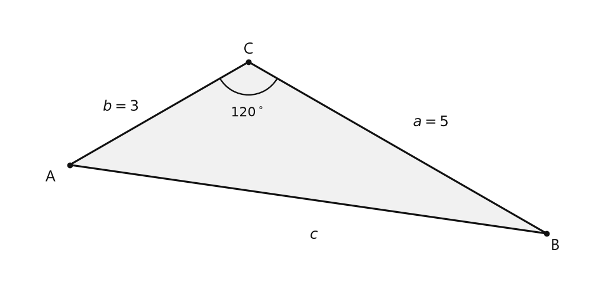
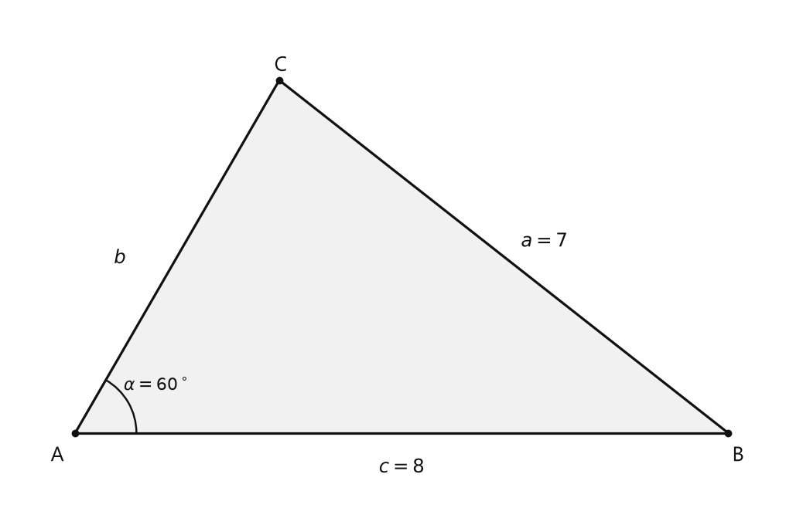

# Занятие 18. Теорема косинусов

**Раздел:** Глава III. Теорема синусов, теорема косинусов  
**Параграф учебника:** §13. Теорема косинусов  
**Страницы:** 113–122

## Цели занятия

После занятия ученик умеет:

- применять теорему косинусов для нахождения неизвестной стороны;
- находить косинус угла по трём сторонам;
- определять вид треугольника по его сторонам;
- использовать формулу суммы квадратов диагоналей параллелограмма;
- находить медиану треугольника;
- решать задачи, где теорема косинусов соединяется с формулой площади.

Выбери блок своего уровня:

- **1–2 балла:** понять формулу и найти сторону;
- **3–4 балла:** находить угол или вид треугольника;
- **5–6 баллов:** применять формулы параллелограмма и медианы;
- **7–8 баллов:** решать задачи с несколькими шагами;
- **9–10 баллов:** разбирать нестандартные комбинации известных формул.

## Теория к занятию

### 1. Теорема косинусов

#### Простыми словами

Теорема Пифагора работает только в прямоугольном треугольнике. Теорема косинусов подходит для любого треугольника.

Она связывает три стороны треугольника и угол между двумя из них. Если угол острый, его косинус положительный. Если угол тупой, косинус отрицательный, поэтому вычитание отрицательного числа превращается в сложение. Минус иногда тоже умеет работать на увеличение.

#### Теорема

Квадрат любой стороны треугольника равен сумме квадратов двух других его сторон минус удвоенное произведение этих сторон на косинус угла между ними, т. е.
$$a^2 = b^2 + c^2 - 2bc \cos \alpha.$$

#### Формулы

Для стороны $a$, лежащей против угла $\alpha$:

$$a^2 = b^2 + c^2 - 2bc \cos \alpha.$$

Для стороны $b$:

$$b^2 = a^2 + c^2 - 2ac \cos \beta.$$

Для стороны $c$:

$$c^2 = a^2 + b^2 - 2ab \cos \gamma.$$

Здесь:

- $a$, $b$, $c$ — стороны треугольника;
- $\alpha$, $\beta$, $\gamma$ — углы, лежащие против соответствующих сторон.

#### Правила

Чтобы найти неизвестную сторону:

1. Определи угол между двумя известными сторонами.
2. Неизвестная сторона должна лежать напротив этого угла.
3. Запиши теорему косинусов для этой стороны.
4. Подставь известные значения.
5. Найди квадрат неизвестной стороны.
6. Извлеки квадратный корень.

Главная ловушка: угол должен быть именно **между известными сторонами**. Угол «где-то рядом» не подходит — геометрия не угадывает по настроению.

#### Алгоритм нахождения стороны

1. Запиши теорему косинусов для нужной стороны.
2. Подставь длины сторон и косинус угла.
3. Выполни вычисления.
4. Извлеки квадратный корень.
5. Проверь, что длина получилась положительной.

#### Ловушки

- $\cos120^\circ=-\frac12$, а не $\frac12$.
- Если угол тупой, сторона напротив него обычно самая большая.
- Если $a^2=49$, то $a=7$, а не $49$.
- Теорема Пифагора получается только при угле $90^\circ$.

---

### 2. Нахождение угла по трём сторонам

#### Простыми словами

Если известны три стороны треугольника, можно найти его углы. Сначала вычисляем косинус нужного угла, затем по таблице или калькулятору находим сам угол.

#### Следствие 1

Теорема косинусов позволяет, зная три стороны треугольника, найти его углы (косинусы углов). Из равенства $a^2 = b^2 + c^2 - 2bc \cos\alpha$ следует формула
$$\cos\alpha = \frac{b^2 + c^2 - a^2}{2bc}.$$

Для углов $\beta$ и $\gamma$ получим:
$$\cos\beta = \frac{a^2 + c^2 - b^2}{2ac}, \quad \cos\gamma = \frac{a^2 + b^2 - c^2}{2ab}.$$

#### Формулы

Чтобы найти угол $\alpha$, используй сторону $a$, лежащую напротив него:

$$\cos\alpha=\frac{b^2+c^2-a^2}{2bc}.$$

После этого найди угол $\alpha$ по таблице или с помощью калькулятора.

#### Правила

Сначала сопоставь угол и сторону, которая лежит напротив него:

- углу $\alpha$ соответствует сторона $a$;
- углу $\beta$ соответствует сторона $b$;
- углу $\gamma$ соответствует сторона $c$.

Если нужно найти угол, лежащий напротив стороны $7$, то в числителе будет стоять $-7^2$.

#### Ловушки

- В знаменателе стоят две стороны, прилежащие к нужному углу.
- В числителе квадрат стороны напротив угла вычитается.
- Большей стороне соответствует больший противолежащий угол.
- Косинус тупого угла отрицателен.

---

### 3. Определение вида треугольника

#### Простыми словами

Чтобы узнать, какой треугольник перед нами, не обязательно вычислять все углы. Достаточно сравнить квадрат большей стороны с суммой квадратов двух других сторон.

Почему смотрим именно на большую сторону? Угол напротив неё тоже самый большой. Только он может оказаться прямым или тупым.

#### Следствие 2

С помощью теоремы косинусов можно по трем сторонам определить вид треугольника: остроугольный, прямоугольный или тупоугольный.

Так, из формулы $\cos \alpha = \frac{b^2 + c^2 - a^2}{2bc}$ с учетом того, что $2bc > 0$, следует:
1) если $b^2 + c^2 - a^2 > 0$, то $\cos \alpha > 0$ и угол $\alpha$ острый;
2) если $b^2 + c^2 - a^2 < 0$, то $\cos \alpha < 0$ и угол $\alpha$ тупой;
3) если $b^2 + c^2 - a^2 = 0$, то $\cos \alpha = 0$ и угол $\alpha$ прямой.

#### Правило определения вида треугольника

Треугольник является:
1) остроугольным, если квадрат его большей стороны меньше суммы квадратов двух других его сторон: $a^2 < b^2 + c^2$;
2) тупоугольным, если квадрат его большей стороны больше суммы квадратов двух других его сторон: $a^2 > b^2 + c^2$;
3) прямоугольным, если квадрат его большей стороны равен сумме квадратов двух других его сторон: $a^2 = b^2 + c^2$.

#### Алгоритм

1. Найди большую сторону.
2. Возведи её в квадрат.
3. Возведи в квадрат две другие стороны.
4. Сложи квадраты двух других сторон.
5. Сравни два результата.
6. Сделай вывод:

- меньше — треугольник остроугольный;
- больше — тупоугольный;
- равно — прямоугольный.

#### Ловушки

- Сравнивать нужно квадрат **большей** стороны.
- Равенство означает, что треугольник прямоугольный.
- Если квадрат большей стороны больше суммы двух других квадратов, треугольник тупоугольный.
- Вычислять все три косинуса не нужно: одного сравнения достаточно.

---

### 4. Теорема Пифагора как частный случай

#### Простыми словами

Пусть угол между сторонами равен $90^\circ$. Тогда $\cos90^\circ=0$. Поэтому слагаемое с косинусом исчезает, и остаётся теорема Пифагора.

#### Факт

Так как при $\gamma = 90^\circ$ по теореме косинусов $c^2 = a^2 + b^2 - 2ab \cos 90^\circ = a^2 + b^2 - 2ab \cdot 0 = a^2 + b^2$, то теорема Пифагора — частный случай теоремы косинусов.

#### Формула

При $\gamma=90^\circ$:

$$c^2=a^2+b^2.$$

#### Ловушка

Теорема Пифагора работает только для прямоугольного треугольника. Теорема косинусов работает для любого треугольника.

---

### 5. Параллелограмм

#### Простыми словами

Диагонали параллелограмма могут иметь разные длины. Но если сложить их квадраты, получится сумма удвоенных квадратов двух его сторон.

#### Следствие 3

Сумма квадратов диагоналей параллелограмма равна сумме квадратов всех его сторон: $d_1^2 + d_2^2 = 2a^2 + 2b^2$.

#### Формула

$$d_1^2+d_2^2=2a^2+2b^2.$$

По этой формуле можно найти:

- диагональ, если известны две стороны и другая диагональ;
- сторону, если известны две диагонали и другая сторона.

#### Алгоритм нахождения диагонали

1. Запиши формулу параллелограмма.
2. Подставь известные значения.
3. Вырази квадрат неизвестной диагонали.
4. Извлеки квадратный корень.

#### Ловушки

- Справа записано $2a^2+2b^2$, а не $a^2+b^2$.
- Сначала нужно возвести диагонали в квадрат, а затем складывать.
- Периметр параллелограмма равен $2a+2b$, а не сумме диагоналей.

---

### 6. Медиана треугольника

#### Простыми словами

Медиана делит сторону пополам, но не обязана быть перпендикулярной этой стороне. Поэтому применять теорему Пифагора напрямую обычно нельзя.

Для медианы есть специальная формула. В ней важно не перепутать индекс: $m_a$ проведена к стороне $a$.

#### Следствие 4

Медиану $m_a$ треугольника со сторонами $a$, $b$ и $c$ можно найти по формуле $m_a = \frac{1}{2}\sqrt{2b^2 + 2c^2 - a^2}$.

Аналогично: $m_b = \frac{1}{2}\sqrt{2a^2 + 2c^2 - b^2}$, $m_c = \frac{1}{2}\sqrt{2a^2 + 2b^2 - c^2}$.

#### Формулы

$$m_a=\frac12\sqrt{2b^2+2c^2-a^2};$$

$$m_b=\frac12\sqrt{2a^2+2c^2-b^2};$$

$$m_c=\frac12\sqrt{2a^2+2b^2-c^2}.$$

Индекс медианы показывает, к какой стороне она проведена.

#### Алгоритм

1. Определи, к какой стороне проведена медиана.
2. Выбери соответствующую формулу.
3. Подставь длины сторон.
4. Вычисли выражение под корнем.
5. Умножь полученный корень на $\frac12$.

#### Ловушки

- В формуле $m_a$ вычитается $a^2$.
- Медиана к стороне $a$ не равна автоматически $\frac a2$.
- Нельзя забывать множитель $\frac12$ перед корнем.

---

### 7. Площадь через две стороны и угол

#### Простыми словами

Если известны две стороны и угол между ними, площадь треугольника можно найти через синус этого угла.

А если известна площадь, то сначала можно найти синус угла. Затем, если сказано, что угол тупой, нужно выбрать именно тупой угол. У острых и тупых углов иногда бывает одинаковый синус — вот где прячется ловушка.

#### Формула

$$S=\frac12bc\sin\alpha.$$

#### Правила

Если известно, что угол тупой, после нахождения синуса выбирай тупой угол. Например:

$$\sin60^\circ=\sin120^\circ,$$

но $60^\circ$ — острый угол, а $120^\circ$ — тупой.

#### Ловушки

- По одному значению синуса иногда подходят два угла.
- Условие «угол тупой» помогает выбрать правильный вариант.
- Косинус тупого угла отрицателен.

---

## Сводка формул «выучить наизусть»

$$a^2=b^2+c^2-2bc\cos\alpha.$$

$$b^2=a^2+c^2-2ac\cos\beta.$$

$$c^2=a^2+b^2-2ab\cos\gamma.$$

$$\cos\alpha=\frac{b^2+c^2-a^2}{2bc}.$$

$$\cos\beta=\frac{a^2+c^2-b^2}{2ac}.$$

$$\cos\gamma=\frac{a^2+b^2-c^2}{2ab}.$$

$$d_1^2+d_2^2=2a^2+2b^2.$$

$$m_a=\frac12\sqrt{2b^2+2c^2-a^2}.$$

$$m_b=\frac12\sqrt{2a^2+2c^2-b^2}.$$

$$m_c=\frac12\sqrt{2a^2+2b^2-c^2}.$$

$$S=\frac12bc\sin\alpha.$$

## Правила, которые нельзя путать

- Сторона и угол должны быть взаимно противоположными.
- В теореме косинусов угол находится между двумя сторонами, стоящими в произведении.
- Для определения вида треугольника сравнивают квадрат большей стороны с суммой квадратов двух других.
- При тупом угле косинус отрицателен.
- В формуле медианы вычитается квадрат стороны, к которой проведена медиана.
- В формуле параллелограмма справа стоят удвоенные квадраты обеих сторон.
- В конце вычисления длины нужно извлечь квадратный корень.

# Разбор ключевых заданий

## Р1. Нахождение стороны по двум сторонам и углу между ними

### Условие

В треугольнике $ABC$ даны $a=5$, $b=3$, $\gamma=120^\circ$. Найдите сторону $c$.

Угол $\gamma$ расположен между сторонами $a$ и $b$, а напротив него лежит сторона $c$.

<!--geo-figure-spec
{
  "needed": true,
  "kind": "plane",
  "caption": "Треугольник $ABC$",
  "equal": true,
  "axis": false,
  "xlim": [
    -3.5,
    5.2
  ],
  "ylim": [
    0.7,
    4.8
  ],
  "points": {
    "A": [
      -2.598,
      2.5
    ],
    "B": [
      4.33,
      1.5
    ],
    "C": [
      0,
      4
    ]
  },
  "segments": [
    [
      "A",
      "B"
    ],
    [
      "B",
      "C"
    ],
    [
      "C",
      "A"
    ]
  ],
  "polygons": [
    {
      "vertices": [
        "A",
        "B",
        "C"
      ],
      "fill": 0.06
    }
  ],
  "labels": {
    "A": {
      "dx": -0.28,
      "dy": -0.18
    },
    "B": {
      "dx": 0.12,
      "dy": -0.18
    },
    "C": {
      "dx": 0,
      "dy": 0.18
    }
  },
  "angle_marks": [
    {
      "vertex": "C",
      "from": "A",
      "to": "B",
      "text": "$120^\\circ$",
      "radius": 0.48
    }
  ],
  "texts": [
    {
      "xy": [
        -1.85,
        3.35
      ],
      "text": "$b=3$"
    },
    {
      "xy": [
        2.65,
        3.12
      ],
      "text": "$a=5$"
    },
    {
      "xy": [
        0.95,
        1.48
      ],
      "text": "$c$"
    }
  ]
}
-->

*Треугольник ABC*

### Решение

Сторона $c$ лежит напротив угла $\gamma$. Поэтому записываем теорему косинусов для стороны $c$:

$$c^2=a^2+b^2-2ab\cos\gamma.$$

Подставляем данные:

$$c^2=5^2+3^2-2\cdot5\cdot3\cos120^\circ.$$

Значение косинуса тупого угла:

$$\cos120^\circ=-\frac12.$$

Подставляем его в формулу:

$$c^2=25+9-2\cdot5\cdot3\cdot\left(-\frac12\right).$$

Вычисляем произведение:

$$2\cdot5\cdot3=30.$$

Получаем:

$$c^2=34-30\cdot\left(-\frac12\right).$$

Вычитание отрицательного числа превращается в сложение:

$$c^2=34+15.$$

$$c^2=49.$$

Извлекаем квадратный корень:

$$c=\sqrt{49}=7.$$

**Ответ: $7$.**

---

## Р2. Две возможные стороны

### Условие

В треугольнике $ABC$ даны $a=7$, $c=8$, $\alpha=60^\circ$. Найдите сторону $b$.

<!--geo-figure-spec
{
  "needed": true,
  "kind": "plane",
  "caption": "Треугольник $ABC$: $a=7$, $c=8$, $\\alpha=60^\\circ$",
  "equal": true,
  "axis": false,
  "xlim": [
    -0.8,
    8.8
  ],
  "ylim": [
    -0.8,
    5.2
  ],
  "points": {
    "A": [
      0,
      0
    ],
    "B": [
      8,
      0
    ],
    "C": [
      2.5,
      4.330127
    ]
  },
  "segments": [
    [
      "A",
      "B"
    ],
    [
      "B",
      "C"
    ],
    [
      "C",
      "A"
    ]
  ],
  "polygons": [
    {
      "vertices": [
        "A",
        "B",
        "C"
      ],
      "fill": 0.06
    }
  ],
  "labels": {
    "A": {
      "dx": -0.22,
      "dy": -0.28
    },
    "B": {
      "dx": 0.12,
      "dy": -0.28
    },
    "C": {
      "dx": 0.02,
      "dy": 0.18
    }
  },
  "angle_marks": [
    {
      "vertex": "A",
      "from": "B",
      "to": "C",
      "text": "$\\alpha=60^\\circ$",
      "radius": 0.75
    }
  ],
  "texts": [
    {
      "xy": [
        4,
        -0.42
      ],
      "text": "$c=8$"
    },
    {
      "xy": [
        5.75,
        2.35
      ],
      "text": "$a=7$"
    },
    {
      "xy": [
        0.55,
        2.15
      ],
      "text": "$b$"
    }
  ]
}
-->

*Треугольник ABC: a=7, c=8, \alpha=60^\circ*

### Решение

Угол $\alpha$ находится напротив стороны $a$. Поэтому применяем теорему косинусов для стороны $a$:

$$a^2=b^2+c^2-2bc\cos\alpha.$$

Обозначим неизвестную сторону:

$$b=x.$$

Подставим известные значения:

$$7^2=x^2+8^2-2\cdot x\cdot8\cos60^\circ.$$

Так как

$$\cos60^\circ=\frac12,$$

получаем:

$$49=x^2+64-2\cdot x\cdot8\cdot\frac12.$$

Упростим произведение:

$$2\cdot8\cdot\frac12=8.$$

Тогда:

$$49=x^2+64-8x.$$

Перенесём все слагаемые в левую часть:

$$x^2-8x+15=0.$$

Разложим квадратный трёхчлен на множители:

$$x^2-8x+15=(x-3)(x-5).$$

Произведение равно нулю, значит:

$$x-3=0 \quad \text{или} \quad x-5=0.$$

Отсюда:

$$x_1=3,\qquad x_2=5.$$

Проверим неравенство треугольника для каждого значения:

$$3+7>8,$$

$$5+7>8.$$

Оба значения подходят.

**Ответ: $b=3$ или $b=5$.**

---

## Р3. Площадь, тупой угол и третья сторона

### Условие

Две стороны треугольника равны $6$ и $10$, площадь треугольника равна $15\sqrt3$. Найдите третью сторону, если угол, противолежащий этой стороне, тупой.

### Решение

Обозначим две известные стороны через $6$ и $10$, а угол между ними — через $\beta$.

Площадь треугольника по двум сторонам и углу между ними вычисляется по формуле:

$$S=\frac12\cdot6\cdot10\sin\beta.$$

Подставим известную площадь:

$$15\sqrt3=\frac12\cdot6\cdot10\sin\beta.$$

Вычислим множитель перед синусом:

$$\frac12\cdot6\cdot10=30.$$

Получаем:

$$15\sqrt3=30\sin\beta.$$

Разделим обе части равенства на $30$:

$$\sin\beta=\frac{15\sqrt3}{30}=\frac{\sqrt3}{2}.$$

Синус $\frac{\sqrt3}{2}$ имеют два угла от $0^\circ$ до $180^\circ$:

$$60^\circ\quad\text{и}\quad120^\circ.$$

По условию угол $\beta$ тупой, поэтому выбираем:

$$\beta=120^\circ.$$

Тогда:

$$\cos\beta=\cos120^\circ=-\frac12.$$

Обозначим третью сторону треугольника через $x$.

Эта сторона лежит напротив угла $\beta$, поэтому применяем теорему косинусов:

$$x^2=6^2+10^2-2\cdot6\cdot10\cos120^\circ.$$

Подставим значение косинуса:

$$x^2=36+100-120\cdot\left(-\frac12\right).$$

Умножение на отрицательное число меняет знак:

$$x^2=136+60.$$

$$x^2=196.$$

Длина стороны положительна, поэтому:

$$x=\sqrt{196}=14.$$

Проверим, может ли существовать треугольник с такими сторонами:

$$6+10>14,$$

$$16>14.$$

Неравенство треугольника выполняется. Треугольник существует.

**Ответ: $14$.**

---

## Р4. Нахождение угла по трём сторонам

### Условие

В треугольнике $ABC$ стороны равны $AB=8$, $BC=5$, $AC=7$. Найдите угол $B$.

### Решение

Угол $B$ образован сторонами $AB$ и $BC$.

Напротив угла $B$ находится сторона $AC$.

По следствию из теоремы косинусов:

$$\cos B=\frac{AB^2+BC^2-AC^2}{2\cdot AB\cdot BC}.$$

Подставим длины сторон:

$$\cos B=\frac{8^2+5^2-7^2}{2\cdot8\cdot5}.$$

Вычислим квадраты:

$$\cos B=\frac{64+25-49}{80}.$$

$$\cos B=\frac{40}{80}.$$

$$\cos B=\frac12.$$

Косинус равен $\frac12$ при угле $60^\circ$:

$$B=60^\circ.$$

**Ответ: $60^\circ$.**

---

## Р5. Определение вида треугольника

### Условие

Определите вид треугольника со сторонами $2$, $3$ и $4$.

### Решение

Сначала найдём наибольшую сторону:

$$4>3>2.$$

Значит, наибольшая сторона равна $4$.

Возведём её в квадрат:

$$4^2=16.$$

Теперь найдём сумму квадратов двух других сторон:

$$2^2+3^2=4+9=13.$$

Сравним полученные числа:

$$16>13.$$

Квадрат наибольшей стороны больше суммы квадратов двух других сторон.

По правилу определения вида треугольника треугольник является тупоугольным.

**Ответ: тупоугольный.**

---

## Р6. Диагональ параллелограмма

### Условие

В параллелограмме стороны равны $3$ см и $4$ см, одна диагональ равна $6$ см. Найдите вторую диагональ.

### Решение

Используем следствие теоремы косинусов:

$$d_1^2+d_2^2=2a^2+2b^2.$$

Пусть известная диагональ равна:

$$d_1=6\text{ см},$$

а неизвестная диагональ равна $d_2$.

Подставим данные в формулу:

$$6^2+d_2^2=2\cdot3^2+2\cdot4^2.$$

Вычислим квадраты:

$$36+d_2^2=2\cdot9+2\cdot16.$$

$$36+d_2^2=18+32.$$

$$36+d_2^2=50.$$

Перенесём $36$ в правую часть:

$$d_2^2=50-36.$$

$$d_2^2=14.$$

Длина диагонали положительна, поэтому:

$$d_2=\sqrt{14}\text{ см}.$$

Проверим результат:

$$6^2+(\sqrt{14})^2=36+14=50,$$

$$2\cdot3^2+2\cdot4^2=18+32=50.$$

Обе части формулы дают одно и то же число. Значит, вычисление выполнено верно.

**Ответ: $\sqrt{14}$ см.**

---

## Р7. Медиана и площадь треугольника

### Условие

Две стороны треугольника равны $6$ см и $8$ см, а медиана, проведённая к третьей стороне, равна $5$ см. Найдите площадь треугольника.

### Решение

Пусть две известные стороны равны:

$$a=6,\qquad b=8,$$

а медиана проведена к третьей стороне:

$$m_c=5.$$

Используем формулу медианы:

$$m_c=\frac12\sqrt{2a^2+2b^2-c^2}.$$

Подставим известные значения:

$$5=\frac12\sqrt{2\cdot6^2+2\cdot8^2-c^2}.$$

Умножим обе части равенства на $2$:

$$10=\sqrt{2\cdot6^2+2\cdot8^2-c^2}.$$

Возведём обе части в квадрат:

$$100=2\cdot6^2+2\cdot8^2-c^2.$$

Вычислим квадраты:

$$100=2\cdot36+2\cdot64-c^2.$$

$$100=72+128-c^2.$$

$$100=200-c^2.$$

Выразим $c^2$:

$$c^2=200-100.$$

$$c^2=100.$$

Так как длина стороны положительна:

$$c=10.$$

Итак, стороны треугольника равны $6$, $8$ и $10$ см.

Проверим вид треугольника:

$$6^2+8^2=36+64=100,$$

$$10^2=100.$$

Квадрат наибольшей стороны равен сумме квадратов двух других сторон.

Значит, треугольник прямоугольный, а стороны $6$ см и $8$ см — его катеты.

Площадь прямоугольного треугольника:

$$S=\frac12\cdot6\cdot8.$$

$$S=3\cdot8.$$

$$S=24\text{ см}^2.$$

**Ответ: $24\text{ см}^2$.**

---

## Р8. Сторона равностороннего треугольника и точка на стороне

### Условие

Сторона равностороннего треугольника $ABC$ равна $10$ см. На стороне $BC$ взята точка $M$ так, что $BM:MC=2:3$. Найдите $AM$.

### Решение

Отрезок $BC$ разделён на $2+3=5$ равных частей.

Длина одной части:

$$10:5=2\text{ см}.$$

Тогда:

$$BM=2\cdot2=4\text{ см},$$

$$MC=3\cdot2=6\text{ см}.$$

Так как треугольник $ABC$ равносторонний:

$$AB=10\text{ см},$$

$$\angle B=60^\circ.$$

Рассмотрим треугольник $ABM$.

В нём известны две стороны $AB=10$ см и $BM=4$ см, а также угол между ними. Применим теорему косинусов:

$$AM^2=AB^2+BM^2-2\cdot AB\cdot BM\cos60^\circ.$$

Подставим значения:

$$AM^2=10^2+4^2-2\cdot10\cdot4\cdot\frac12.$$

$$AM^2=100+16-40.$$

$$AM^2=76.$$

Извлечём квадратный корень:

$$AM=\sqrt{76}=2\sqrt{19}\text{ см}.$$

**Ответ: $2\sqrt{19}$ см.**

---

## Р9. Задача на движение

### Условие

Из одного населенного пункта выходят две дороги, угол между которыми равен $60^\circ$. Одновременно по одной дороге выезжает автомобиль со скоростью 80 км/ч, по другой — автобус со скоростью 50 км/ч. Через сколько минут расстояние между ними станет равным 7 км?

### Решение

Пусть транспорт движется $t$ часов.

Тогда автомобиль проедет:

$$80t\text{ км},$$

а автобус проедет:

$$50t\text{ км}.$$

Направления движения образуют угол $60^\circ$.

Отрезок между автомобилем и автобусом — третья сторона треугольника. Обозначим её длину через $d$.

По теореме косинусов:

$$d^2=(80t)^2+(50t)^2-2\cdot80t\cdot50t\cos60^\circ.$$

По условию $d=7$ км, поэтому:

$$7^2=(80t)^2+(50t)^2-2\cdot80t\cdot50t\cos60^\circ.$$

Подставим $\cos60^\circ=\frac12$:

$$49=6400t^2+2500t^2-8000t^2\cdot\frac12.$$

$$49=6400t^2+2500t^2-4000t^2.$$

$$49=4900t^2.$$

Разделим обе части на $4900$:

$$t^2=\frac{49}{4900}.$$

$$t^2=\frac1{100}.$$

Время не может быть отрицательным, поэтому:

$$t=\frac1{10}\text{ ч}.$$

Переведём часы в минуты:

$$\frac1{10}\cdot60=6\text{ мин}.$$

Проверим ответ.

За $6$ минут, то есть за $\frac1{10}$ часа, автомобиль проедет:

$$80\cdot\frac1{10}=8\text{ км},$$

а автобус:

$$50\cdot\frac1{10}=5\text{ км}.$$

Расстояние между ними:

$$d^2=8^2+5^2-2\cdot8\cdot5\cdot\frac12.$$

$$d^2=64+25-40=49.$$

$$d=7\text{ км}.$$

Значит, ответ подходит. Минуты на месте, транспорт тоже.

**Ответ: через $6$ минут.**

---

## Р10. Площадь треугольной призмы

### Условие

Дана прямая треугольная призма. В основании лежит треугольник со сторонами $5$ см и $6$ см, угол между этими сторонами имеет косинус $0{,}6$. Большая по площади боковая грань призмы является квадратом. Найдите:

а) площадь боковой поверхности призмы;  
б) площадь полной поверхности призмы.

### Решение

Обозначим третью сторону треугольника в основании через $x$.

Угол между сторонами $5$ см и $6$ см имеет косинус $0{,}6$.

По теореме косинусов:

$$x^2=5^2+6^2-2\cdot5\cdot6\cdot0{,}6.$$

Вычислим:

$$x^2=25+36-60\cdot0{,}6.$$

$$60\cdot0{,}6=36.$$

Поэтому:

$$x^2=25+36-36.$$

$$x^2=25.$$

Длина стороны положительна:

$$x=5\text{ см}.$$

Стороны основания равны $5$, $5$ и $6$ см.

Наибольшая сторона основания равна $6$ см. Соответствующая ей боковая грань имеет наибольшую площадь.

По условию эта боковая грань является квадратом.

Значит, её стороны равны $6$ см, поэтому высота призмы:

$$h=6\text{ см}.$$

Периметр основания:

$$P_{\text{осн}}=5+5+6=16\text{ см}.$$

Для прямой призмы площадь боковой поверхности равна:

$$S_{\text{бок}}=P_{\text{осн}}\cdot h.$$

Подставим значения:

$$S_{\text{бок}}=16\cdot6.$$

$$S_{\text{бок}}=96\text{ см}^2.$$

Теперь найдём площадь одного основания.

Пусть угол между сторонами $5$ см и $6$ см равен $\alpha$.

Из условия:

$$\cos\alpha=0{,}6.$$

Угол $\alpha$ острый, поэтому $\sin\alpha>0$.

Используем основное тригонометрическое тождество:

$$\sin^2\alpha+\cos^2\alpha=1.$$

Тогда:

$$\sin^2\alpha=1-\cos^2\alpha.$$

$$\sin^2\alpha=1-0{,}6^2.$$

$$\sin^2\alpha=1-0{,}36=0{,}64.$$

Так как синус острого угла положителен:

$$\sin\alpha=0{,}8.$$

Площадь треугольника по двум сторонам и углу между ними:

$$S_{\text{осн}}=\frac12\cdot5\cdot6\cdot0{,}8.$$

$$S_{\text{осн}}=15\cdot0{,}8.$$

$$S_{\text{осн}}=12\text{ см}^2.$$

У призмы два одинаковых основания:

$$2S_{\text{осн}}=2\cdot12=24\text{ см}^2.$$

Полная поверхность состоит из боковой поверхности и двух оснований:

$$S_{\text{полн}}=S_{\text{бок}}+2S_{\text{осн}}.$$

$$S_{\text{полн}}=96+24.$$

$$S_{\text{полн}}=120\text{ см}^2.$$

**Ответ: а) $96\text{ см}^2$; б) $120\text{ см}^2$.**

## Практические задания

Выбери свой уровень и решай только этот блок. В блоке должна закрепиться вся тема параграфа. Ответы не приводятся.

### Уровень 1–2 балла

**С1.** Выберите формулу теоремы косинусов для стороны $a$ треугольника, если угол $\alpha$ лежит между сторонами $b$ и $c$.

1) $a^2=b^2+c^2+2bc\cos\alpha$ 2) $a^2=b^2+c^2-2bc\cos\alpha$ 3) $a^2=b^2-c^2-2bc\cos\alpha$ 4) $a^2=b^2+c^2-2b c\sin\alpha$ 5) $a=b+c-2bc\cos\alpha$

**С2.** В треугольнике $ABC$ стороны $AC=5$ см, $BC=7$ см, а $\angle C=60^\circ$. Выберите выражение для $AB^2$.

1) $5^2+7^2-2\cdot5\cdot7\cos60^\circ$ 2) $5^2+7^2+2\cdot5\cdot7\cos60^\circ$ 3) $7^2-5^2-2\cdot5\cdot7\cos60^\circ$ 4) $5^2+7^2-2\cdot5\cdot7\sin60^\circ$ 5) $(5+7)^2$

**С3.** Найдите сторону $a$ треугольника, если $b=3$ см, $c=4$ см, а угол между этими сторонами равен $90^\circ$.

**С4.** Найдите сторону $a$ треугольника, если $b=6$ см, $c=8$ см, а угол между ними равен $60^\circ$.

**С5.** В треугольнике $MNK$ стороны $MK=4$ см, $NK=6$ см, $\cos\angle K=\frac{2}{3}$. Найдите длину стороны $MN$.

**С6.** Выберите формулу для нахождения косинуса угла $\alpha$ треугольника со сторонами $a$, $b$, $c$, если сторона $a$ лежит напротив угла $\alpha$.

1) $\cos\alpha=\dfrac{b^2+c^2-a^2}{2bc}$ 2) $\cos\alpha=\dfrac{a^2+b^2-c^2}{2ab}$ 3) $\cos\alpha=\dfrac{a^2+c^2-b^2}{2ac}$ 4) $\cos\alpha=\dfrac{a^2-b^2-c^2}{2bc}$ 5) $\cos\alpha=\dfrac{b^2+c^2+a^2}{2bc}$

**С7.** Найдите $\cos\alpha$ в треугольнике, если $a=5$ см, $b=6$ см, $c=7$ см, а сторона $a$ лежит напротив угла $\alpha$.

**С8.** Треугольник имеет стороны $6$ см, $8$ см и $10$ см. Выберите его вид.

1) остроугольный 2) прямоугольный 3) тупоугольный 4) равносторонний 5) невозможно определить по сторонам

**С9.** Определите вид треугольника со сторонами $5$ см, $6$ см и $8$ см.

**С10.** Найдите медиану $m_a$ треугольника со сторонами $a=6$ см, $b=5$ см и $c=5$ см, используя формулу $m_a=\frac12\sqrt{2b^2+2c^2-a^2}$.

**С11.** Диагонали параллелограмма равны $6$ см и $10$ см. Найдите сумму квадратов его сторон, используя равенство $d_1^2+d_2^2=2a^2+2b^2$.

**С12.** В треугольнике $ABC$ стороны $AB=5$ см и $BC=7$ см, а угол $B=60^\circ$. Найдите длину стороны $AC$.

**С13.** Какая формула является теоремой косинусов для стороны $a$ треугольника?

1) $a^2=b^2+c^2+2bc\cos\alpha$  
2) $a^2=b^2+c^2-2bc\cos\alpha$  
3) $a=b+c-2bc\cos\alpha$  
4) $a^2=b^2-c^2-2bc\cos\alpha$  
5) $a^2=b^2+c^2-2bс\sin\alpha$

**С14.** В треугольнике две стороны равны $3$ см и $4$ см, а угол между ними равен $60^\circ$. Найдите длину третьей стороны.

**С15.** Стороны треугольника равны $5$ см, $6$ см и $7$ см. Найдите косинус угла, противолежащего стороне длиной $6$ см.

**С16.** Определите вид треугольника со сторонами $5$ см, $12$ см и $13$ см.

1) остроугольный  
2) тупоугольный  
3) прямоугольный  
4) равносторонний  
5) определить невозможно

**С17.** В треугольнике стороны, прилежащие к вершине $A$, равны $5$ см и $7$ см, а сторона $BC$ равна $6$ см. Найдите медиану, проведённую из вершины $A$.

**С18.** Стороны параллелограмма равны $3$ см и $4$ см. Чему равна сумма квадратов его диагоналей?

1) $14\text{ см}^2$  
2) $25\text{ см}^2$  
3) $50\text{ см}^2$  
4) $49\text{ см}^2$  
5) $100\text{ см}^2$

**С19.** В треугольнике две стороны равны $5$ см и $5$ см, а угол между ними равен $60^\circ$. Найдите третью сторону.

**С20.** Стороны треугольника равны $3$ см, $4$ см и $5$ см. Найдите косинус угла, противолежащего стороне длиной $5$ см.

**С21.** Какое неравенство выполняется для сторон $a$, $b$, $c$ остроугольного треугольника, если $a$ — его большая сторона?

1) $a^2>b^2+c^2$  
2) $a^2=b^2+c^2$  
3) $a^2<b^2+c^2$  
4) $a=b+c$  
5) $a^2=b^2-c^2$

**С22.** В параллелограмме стороны равны $3$ см и $4$ см, одна диагональ равна $5$ см. Найдите длину другой диагонали.

**С23.** Стороны треугольника равны $5$ см, $6$ см и $7$ см. Найдите медиану, проведённую к стороне длиной $7$ см.

**С24.** В треугольнике $ABC$ стороны $AC=5$ см и $BC=7$ см, а $\cos\angle C=\frac{3}{7}$. Найдите длину стороны $AB$.

**С25.** Выберите формулу теоремы косинусов для стороны $a$ треугольника, если угол $\alpha$ лежит между сторонами $b$ и $c$.

1) $a^2=b^2+c^2+2bc\cos\alpha$  2) $a^2=b^2+c^2-2bc\cos\alpha$  3) $a^2=b^2-c^2-2bc\cos\alpha$  4) $a^2=b^2+c^2-2b c\sin\alpha$  5) $a=b+c-2bc\cos\alpha$

**С26.** В треугольнике $ABC$ стороны $AC=5$ см и $BC=7$ см образуют угол $C=60^\circ$. Какая формула позволяет найти сторону $AB$?

1) $AB^2=5^2+7^2-2\cdot5\cdot7\cos60^\circ$  2) $AB^2=5^2+7^2+2\cdot5\cdot7\cos60^\circ$  3) $AB^2=5^2-7^2-2\cdot5\cdot7\cos60^\circ$  4) $AB=5+7-2\cos60^\circ$  5) $AB^2=5^2+7^2-2\cdot5\cdot7\sin60^\circ$

**С27.** Найдите квадрат стороны $a$ треугольника, если $b=3$, $c=4$, $\cos\alpha=\frac12$.

**С28.** Найдите сторону $a$ треугольника, если $b=5$, $c=5$, $\alpha=60^\circ$.

**С29.** Найдите косинус угла $\alpha$ треугольника со сторонами $a=5$, $b=4$, $c=3$.

1) $-\frac12$  2) $0$  3) $\frac12$  4) $\frac34$  5) $1$

**С30.** В треугольнике стороны, прилежащие к углу $\alpha$, равны $6$ см и $8$ см, а противолежащая сторона равна $10$ см. Определите вид угла $\alpha$.

1) Острый  2) Прямой  3) Тупой  4) Развёрнутый  5) Невозможно определить

**С31.** Выберите треугольник, который является прямоугольным.

1) $4$ см, $5$ см, $6$ см  2) $5$ см, $5$ см, $6$ см  3) $6$ см, $8$ см, $10$ см  4) $3$ см, $4$ см, $6$ см  5) $2$ см, $3$ см, $4$ см

**С32.** Выберите треугольник, который является тупоугольным.

1) Со сторонами $3$ см, $4$ см, $5$ см  2) Со сторонами $4$ см, $5$ см, $6$ см  3) Со сторонами $5$ см, $6$ см, $7$ см  4) Со сторонами $2$ см, $3$ см, $4$ см  5) Со сторонами $6$ см, $8$ см, $10$ см

**С33.** Стороны параллелограмма равны $3$ см и $4$ см. Запишите выражение для суммы квадратов его диагоналей.

**С34.** Диагонали параллелограмма равны $6$ см и $10$ см. Найдите сумму квадратов его сторон.

**С35.** Найдите медиану $m_a$ треугольника со сторонами $a=6$ см, $b=5$ см и $c=5$ см.

**С36.** Выберите верное утверждение.

1) Теорема косинусов применима только к прямоугольным треугольникам.  
2) Теорема Пифагора является частным случаем теоремы косинусов.  
3) В формуле теоремы косинусов используется синус угла.  
4) Квадрат стороны равен разности квадратов двух других сторон.  
5) Теорема косинусов не позволяет находить углы треугольника.

### Уровень 3–4 балла

**С1.** В треугольнике две стороны равны $6$ см и $8$ см, а угол между ними равен $60^\circ$. Найдите третью сторону.

**С2.** В треугольнике $MNK$ стороны $MK=4$ см и $NK=6$ см, а $\cos\angle K=\frac12$. Найдите длину стороны $MN$.

**С3.** Определите вид треугольника со сторонами $7$ см, $8$ см и $9$ см: остроугольный, прямоугольный или тупоугольный.

**С4.** Стороны треугольника равны $5$ см, $7$ см и $8$ см. Найдите косинус угла, противолежащего стороне длиной $8$ см.

**С5.** В треугольнике две стороны равны $6$ см и $8$ см, а медиана, проведённая к третьей стороне, равна $5$ см. Найдите длину третьей стороны.

**С6.** Стороны параллелограмма равны $5$ см и $7$ см. Одна из его диагоналей равна $8$ см. Найдите длину другой диагонали.

**С7.** В треугольнике две стороны равны $6$ см и $8$ см, а медиана, проведённая к третьей стороне, равна $5$ см. Найдите площадь треугольника.

**С8.** В равностороннем треугольнике $ABC$ сторона равна $12$ см. На стороне $BC$ взята точка $M$ так, что $BM:MC=1:2$. Найдите длину отрезка $AM$.

**С9.** Найдите косинус угла треугольника, противолежащего стороне длиной $10$ см, если две другие стороны равны $6$ см и $8$ см.

**С10.** В параллелограмме $ABCD$ стороны $AB=6$ см и $AD=8$ см, а диагональ $AC=10$ см. Найдите длину диагонали $BD$.

**С11.** Из одного пункта одновременно выехали автомобиль и автобус по дорогам, угол между которыми равен $60^\circ$. Скорость автомобиля равна $80$ км/ч, скорость автобуса — $50$ км/ч. Через сколько минут расстояние между ними станет равным $7$ км?

**С12.** Наблюдатель находится в точке $M$. Расстояния до точек $A$ и $B$ равны $MA=30$ м и $MB=20$ м, а угол $AMB$ равен $60^\circ$. Найдите расстояние $AB$.

**С13.** В треугольнике $ABC$ стороны $AC=6$ см, $BC=8$ см, а $\angle C=60^\circ$. Найдите длину стороны $AB$.

**С14.** В треугольнике $MNK$ стороны $MK=5$ см, $NK=7$ см, а $\cos\angle MNK=\frac{3}{5}$. Найдите длину стороны $MK$.

**С15.** В треугольнике $ABC$ стороны $AB=7$ см, $AC=9$ см, $BC=8$ см. Найдите $\cos\angle A$.

**С16.** Определите вид треугольника со сторонами $7$ см, $24$ см и $25$ см: остроугольный, прямоугольный или тупоугольный.

**С17.** Определите вид треугольника со сторонами $5$ см, $6$ см и $8$ см: остроугольный, прямоугольный или тупоугольный.

**С18.** В треугольнике $ABC$ стороны $AB=10$ см, $AC=12$ см, а угол между ними равен $60^\circ$. Найдите длину стороны $BC$.

**С19.** В треугольнике $ABC$ стороны $AB=5$ см, $BC=7$ см и $AC=8$ см. Найдите $\cos\angle B$.

**С20.** Найдите длину медианы, проведённой к стороне длиной $10$ см, в треугольнике со сторонами $6$ см, $8$ см и $10$ см.

**С21.** В треугольнике $ABC$ стороны $AB=5$ см, $BC=6$ см, $AC=7$ см. Найдите длину медианы, проведённой из вершины $B$.

**С22.** Диагонали параллелограмма равны $6$ см и $10$ см. Найдите сумму квадратов его сторон.

**С23.** В параллелограмме стороны равны $5$ см и $7$ см, а одна из диагоналей равна $8$ см. Найдите длину второй диагонали.

**С24.** Две дороги выходят из одного пункта под углом $60^\circ$. По одной дороге движется автомобиль со скоростью $60$ км/ч, по другой — автобус со скоростью $80$ км/ч. Какое расстояние будет между ними через $3$ минуты?

**С25.** В треугольнике две стороны равны $3$ см и $5$ см, а угол между ними равен $60^\circ$. Найдите длину третьей стороны.

**С26.** В треугольнике две стороны равны $6$ см и $8$ см, а угол между ними прямой. Найдите длину стороны, лежащей напротив этого угла.

**С27.** Стороны треугольника равны $5$ см, $7$ см и $8$ см. Найдите косинус угла, заключённого между сторонами длиной $5$ см и $7$ см.

**С28.** Определите вид треугольника относительно углов, если его стороны равны $6$ см, $8$ см и $10$ см.

**С29.** Найдите косинус наибольшего угла треугольника со сторонами $5$ см, $6$ см и $7$ см.

**С30.** Найдите медиану треугольника, проведённую к стороне длиной $10$ см, если две другие стороны равны $6$ см и $8$ см.

**С31.** Параллелограмм имеет стороны длиной $3$ см и $5$ см, а угол между ними равен $60^\circ$. Найдите длины его диагоналей.

**С32.** Диагонали параллелограмма равны $6$ см и $8$ см, одна из его сторон равна $5$ см. Найдите длину другой стороны.

**С33.** В треугольнике две стороны равны $5$ см и $7$ см, а угол между ними равен $60^\circ$. Найдите длину третьей стороны.

**С34.** Определите вид треугольника относительно углов, если его стороны равны $5$ см, $6$ см и $7$ см.

**С35.** Две стороны треугольника равны $6$ см и $8$ см, а медиана, проведённая к третьей стороне, равна $5$ см. Найдите длину третьей стороны.

**С36.** Из одной точки выходят две взаимно перпендикулярные дороги. По одной дороге автомобиль движется со скоростью $30$ км/ч, а по другой — автобус со скоростью $40$ км/ч. Через какое время расстояние между ними станет равным $5$ км? Ответ выразите в минутах.

### Уровень 5–6 баллов

**С1.** В треугольнике $ABC$ стороны $AC=6$ см и $BC=8$ см, а $\angle C=60^\circ$. Найдите длину стороны $AB$.

**С2.** В треугольнике $MNK$ стороны $MK=5$ см и $NK=7$ см, $\cos \angle K=\frac{3}{5}$. Найдите длину стороны $MN$.

**С3.** В треугольнике $ABC$ стороны $AB=9$ см, $AC=12$ см и $\angle A=120^\circ$. Найдите длину стороны $BC$.

**С4.** В треугольнике $ABC$ стороны равны $7$ см, $8$ см и $13$ см. Определите вид треугольника относительно углов: остроугольный, прямоугольный или тупоугольный.

**С5.** Найдите косинус угла треугольника, противолежащего стороне длиной $7$ см, если две другие стороны равны $5$ см и $6$ см.

**С6.** В треугольнике $ABC$ стороны $AB=5$ см, $BC=6$ см, $AC=7$ см. Найдите косинус угла $B$.

**С7.** В треугольнике $ABC$ стороны $AB=10$ см и $BC=14$ см, а медиана $BM$, проведённая к стороне $AC$, равна $8$ см. Найдите длину стороны $AC$.

**С8.** Найдите длину медианы, проведённой к стороне длиной $12$ см, в треугольнике со сторонами $7$ см, $9$ см и $12$ см.

**С9.** В параллелограмме $ABCD$ стороны $AB=5$ см и $AD=7$ см, а диагональ $AC=10$ см. Найдите длину диагонали $BD$.

**С10.** Диагонали параллелограмма равны $6$ см и $10$ см. Найдите сумму квадратов его сторон.

**С11.** Две дороги выходят из одного пункта под углом $60^\circ$. По одной дороге движется автомобиль со скоростью $60$ км/ч, по другой — автобус со скоростью $40$ км/ч. Какое расстояние будет между ними через $6$ минут?

**С12.** В треугольнике $ABC$ стороны $AB=4$ см, $AC=6$ см и $\angle A=60^\circ$. Найдите площадь треугольника $ABC$ и определите вид треугольника относительно углов.

**С13.** В треугольнике две стороны равны $6$ см и $8$ см, а угол между ними равен $60^\circ$. Найдите длину третьей стороны.

**С14.** В треугольнике $ABC$ стороны $AC=5$ см, $BC=7$ см, а $\cos \angle C=\frac{2}{7}$. Найдите длину стороны $AB$.

**С15.** Определите вид треугольника со сторонами $7$ см, $9$ см и $12$ см: остроугольный, прямоугольный или тупоугольный.

**С16.** Стороны треугольника равны $5$ см, $6$ см и $7$ см. Найдите косинус угла, противолежащего стороне длиной $7$ см.

**С17.** В треугольнике две стороны равны $5$ см и $9$ см, а угол между ними равен $120^\circ$. Найдите длину третьей стороны.

**С18.** В треугольнике $ABC$ стороны $AB=6$ см, $AC=8$ см, а медиана $AM=5$ см. Найдите длину стороны $BC$.

**С19.** В треугольнике $ABC$ сторона $BC=10$ см, $AC=7$ см, а $\angle C=60^\circ$. Найдите длину стороны $AB$.

**С20.** В треугольнике две стороны равны $6$ см и $8$ см, а медиана, проведённая к третьей стороне, равна $5$ см. Найдите площадь треугольника.

**С21.** Из одной точки выходят две дороги, угол между которыми равен $60^\circ$. По одной дороге автомобиль движется со скоростью $60$ км/ч, а по другой автобус — со скоростью $40$ км/ч. Через сколько часов расстояние между ними станет равным $20\sqrt7$ км?

**С22.** В параллелограмме стороны равны $5$ см и $8$ см, а угол между ними равен $60^\circ$. Найдите длины диагоналей параллелограмма.

**С23.** Найдите длину медианы, проведённой из вершины наибольшего угла треугольника со сторонами $7$ см, $11$ см и $12$ см.

**С24.** В основании прямой треугольной призмы лежит треугольник, две стороны которого равны $5$ см и $6$ см, а косинус угла между ними равен $0{,}6$. Большая по площади боковая грань призмы является квадратом. Найдите площадь боковой поверхности и площадь полной поверхности призмы.

**С25.** В треугольнике две стороны равны $6$ см и $8$ см, а угол между ними равен $60^\circ$. Найдите длину третьей стороны.

**С26.** Стороны треугольника равны $5$ см, $7$ см и $8$ см. Найдите косинус угла, противолежащего стороне длиной $8$ см.

**С27.** Определите вид треугольника относительно углов, если его стороны равны $7$ см, $24$ см и $25$ см.

**С28.** Найдите длину медианы треугольника, проведённой к стороне длиной $10$ см, если две другие его стороны равны $6$ см и $8$ см.

**С29.** В параллелограмме стороны равны $5$ см и $7$ см, а угол между ними равен $60^\circ$. Найдите длины диагоналей параллелограмма и его периметр.

**С30.** Из одного пункта одновременно выехали автомобиль и автобус по дорогам, угол между которыми равен $120^\circ$. Скорость автомобиля равна $30$ км/ч, а скорость автобуса — $50$ км/ч. Через сколько минут расстояние между ними станет равным $7$ км?

### Уровень 7–8 баллов

**С1.** В треугольнике две стороны равны $6$ см и $10$ см, а угол между ними равен $120^\circ$. Найдите длину третьей стороны.

**С2.** В треугольнике $ABC$ $AC=8$ см, $AB=7$ см, $\angle A=60^\circ$. Найдите все возможные значения длины стороны $BC$, если известно, что сторона $AC$ может быть расположена напротив одного из двух возможных углов.

**С3.** Две стороны треугольника равны $5$ см и $5$ см, а его площадь равна $\dfrac{25\sqrt3}{4}$ см$^2$. Угол между этими сторонами тупой. Найдите длину третьей стороны.

**С4.** В треугольнике две стороны равны $6$ см и $8$ см, а медиана, проведённая к третьей стороне, равна $5$ см. Найдите площадь треугольника и определите, является ли он прямоугольным.

**С5.** Стороны треугольника равны $7$ см, $8$ см и $9$ см. Найдите косинус его наибольшего угла и определите вид треугольника по углам.

**С6.** В параллелограмме стороны равны $5$ см и $7$ см, а одна из диагоналей равна $6$ см. Найдите длину другой диагонали.

**С7.** В треугольнике $ABC$ медианы $AM$ и $BK$ пересекаются в точке $E$. Известно, что $AM=BK=6$ см и $\angle MEK=120^\circ$. Найдите длину стороны $AB$.

**С8.** В треугольник $ABC$ вписана окружность, касающаяся стороны $AC$ в точке $K$. Известно, что $AK=5$ см, $KC=10$ см и $\angle A=60^\circ$. Найдите периметр треугольника $ABC$.

**С9.** Высоты треугольника равны $3$ см, $4$ см и $5$ см. Определите, является ли треугольник остроугольным, прямоугольным или тупоугольным. Ответ обоснуйте с помощью теоремы косинусов.

**С10.** Из одного пункта выходят две прямые дороги, угол между которыми равен $60^\circ$. По первой дороге автомобиль движется со скоростью $60$ км/ч, а по второй автобус — со скоростью $80$ км/ч. Транспортные средства начинают движение одновременно. Через сколько минут расстояние между ними станет равным $26$ км?

**С11.** В треугольнике $ABC$ стороны $AC=b$ и $AB=c$ постоянны, а угол $A$ изменяется от $0^\circ$ до $180^\circ$. Докажите, используя теорему косинусов, что с увеличением угла $A$ длина стороны $BC$ увеличивается.

**С12.** Дана прямая треугольная призма. В её основании лежит треугольник, две стороны которого равны $5$ см и $6$ см, а косинус угла между ними равен $0{,}6$. Бóльшая по площади боковая грань призмы является квадратом. Найдите площадь боковой поверхности и площадь полной поверхности призмы.

**С13.** В треугольнике две стороны равны $7$ см и $9$ см, а угол между ними равен $60^\circ$. Найдите третью сторону треугольника.

**С14.** В треугольнике две стороны равны $6$ см и $8$ см, а угол между ними равен $120^\circ$. Найдите третью сторону, оставив ответ в виде корня.

**С15.** Стороны треугольника равны $5$ см, $6$ см и $7$ см. Найдите косинус его наибольшего угла.

**С16.** Определите вид треугольника относительно углов, если его стороны равны $7$ см, $8$ см и $13$ см. Обоснуйте ответ с помощью теоремы косинусов.

**С17.** В треугольнике две стороны равны $8$ см и $10$ см, а медиана, проведённая к третьей стороне, равна $7$ см. Найдите длину третьей стороны.

**С18.** В параллелограмме стороны равны $5$ см и $7$ см, а одна из диагоналей равна $8$ см. Найдите длину другой диагонали.

**С19.** Диагонали параллелограмма равны $10$ см и $14$ см, а косинус острого угла между ними равен $\frac{3}{7}$. Найдите периметр параллелограмма.

**С20.** В треугольнике $ABC$ медианы $AM$ и $BK$ пересекаются в точке $E$, причём $AM=9$ см, $BK=6$ см, а $\angle MEK=120^\circ$. Найдите длину стороны $AB$. Обоснуйте, как используются свойства точки пересечения медиан и теорема косинусов.

**С21.** Две стороны треугольника равны $9$ см и $12$ см, а косинус угла между ними равен $\frac{1}{3}$. Найдите площадь треугольника.

**С22.** Наблюдатель находится в точке $M$. Расстояния до двух объектов $A$ и $B$ равны $MA=30$ м и $MB=20$ м, а угол между направлениями на объекты равен $\angle AMB=68^\circ$. Найдите расстояние $AB$, округлив результат до десятых метра.

**С23.** Из одного населённого пункта одновременно выехали автомобиль и автобус по двум дорогам, угол между которыми равен $60^\circ$. Скорость автомобиля равна $80$ км/ч, скорость автобуса — $50$ км/ч. Через сколько минут расстояние между ними станет равным $7$ км? Решение обоснуйте теоремой косинусов.

**С24.** Дана прямая треугольная призма, в основании которой лежит треугольник со сторонами $5$ см и $6$ см и углом между ними, косинус которого равен $0{,}6$. Большая по площади боковая грань призмы является квадратом. Найдите:  
а) площадь боковой поверхности призмы;  
б) площадь полной поверхности призмы.

### Уровень 9–10 баллов

**С1.** В треугольнике $ABC$ стороны $AC=7$ см и $BC=9$ см, а $\angle C=120^\circ$. Найдите длину стороны $AB$.

**С2.** В треугольнике $ABC$ стороны $AB=10$ см и $AC=6$ см, а угол $A$ острый и $\sin A=0{,}8$. Найдите длину стороны $BC$.

**С3.** Две стороны треугольника равны $8$ см и $15$ см, а его площадь равна $30\sqrt{3}$ см$^2$. Найдите третью сторону, если угол, противолежащий этой стороне, тупой.

**С4.** В треугольнике $ABC$ стороны равны $AB=7$ см, $BC=8$ см и $AC=9$ см. Найдите косинус наименьшего угла треугольника.

**С5.** Стороны треугольника равны $7$ см, $10$ см и $12$ см. Определите вид треугольника по углам и найдите косинус его наибольшего угла.

**С6.** В треугольнике $ABC$ стороны $AB=5$ см и $BC=7$ см. Медиана $BM$ равна $6$ см, где точка $M$ — середина стороны $AC$. Найдите длину стороны $AC$.

**С7.** В треугольнике $ABC$ медианы $AM=8$ см и $BK=6$ см пересекаются в точке $E$, причём $\angle MEK=120^\circ$. Найдите длину стороны $AB$.

**С8.** В параллелограмме $ABCD$ стороны $AB=6$ см и $AD=10$ см, а диагональ $AC=14$ см. Найдите длину диагонали $BD$.

**С9.** В параллелограмме диагонали равны $10$ см и $18$ см, а его стороны относятся как $2:3$. Найдите длины сторон параллелограмма.

**С10.** Вписанный в окружность выпуклый четырёхугольник $ABCD$ имеет стороны $AB=3$ см, $BC=4$ см, $CD=5$ см и $DA=6$ см. Найдите длину диагонали $BD$.

**С11.** В выпуклом четырёхугольнике отрезки, соединяющие середины противоположных сторон, имеют длины $4$ см и $6$ см, а угол между ними равен $60^\circ$. Найдите длины диагоналей четырёхугольника.

**С12.** Докажите, что в треугольнике $ABC$ при фиксированных длинах сторон $AB=c$ и $AC=b$ сторона $BC=a$ увеличивается с увеличением угла $\angle A$ в пределах $0^\circ<\angle A<180^\circ$. Затем найдите длину $BC$, если $AB=6$ см, $AC=8$ см и $\angle A$ увеличился с $60^\circ$ до $120^\circ$.

**С13.** В треугольнике две стороны равны $5$ см и $8$ см, а угол между ними равен $60^\circ$. Найдите длину третьей стороны и площадь треугольника.

**С14.** В треугольнике две стороны равны $6$ см и $8$ см, а медиана, проведённая к третьей стороне, равна $5$ см. Найдите длину третьей стороны и площадь треугольника.

**С15.** Диагонали параллелограмма равны $6$ см и $10$ см, а косинус угла между ними равен $\frac{3}{5}$. Найдите длины сторон и площадь параллелограмма.

**С16.** Стороны треугольника равны $7$ см, $8$ см и $9$ см. Найдите косинус его наибольшего угла и определите вид треугольника относительно углов.

**С17.** В выпуклом четырёхугольнике отрезки, соединяющие середины противоположных сторон, имеют длины $2$ см и $3$ см, а угол между ними равен $60^\circ$. Найдите длины диагоналей четырёхугольника.

**С18.** Дана прямая треугольная призма, в основании которой лежит треугольник со сторонами $5$ см и $6$ см. Косинус угла между этими сторонами равен $0{,}6$. Боковая грань, основанием которой служит сторона длиной $6$ см, является квадратом. Найдите площадь боковой поверхности и площадь полной поверхности призмы.

## Чек-лист «ученик понял тему»

- Могу повторить определения и формулы параграфа своими словами и по учебнику.
- Решаю типовые задания своего уровня без подсказки.
- Вижу типичную ошибку и могу её объяснить.
