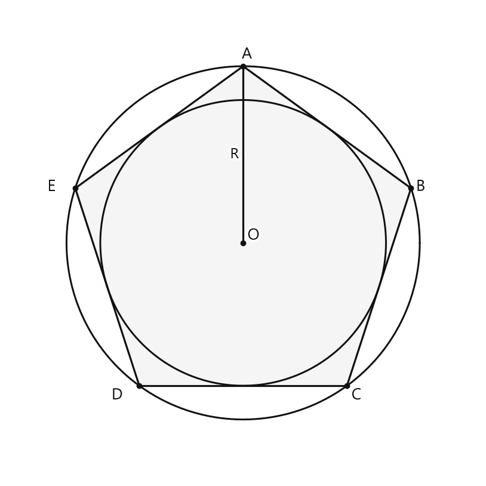

# Занятие 21. Правильные многоугольники

**Раздел:** Глава IV  
**Параграф учебника:** §21. Правильные многоугольники  
**Страницы:** 137–138

## Цели занятия

К концу занятия ты сможешь:

- распознавать правильные многоугольники;
- находить внутренний угол правильного $n$-угольника;
- применять формулы длины окружности и площади круга;
- находить радиус по длине окружности или площади круга;
- решать задачи на правильные треугольник, четырёхугольник и шестиугольник.

Выбери блок своего уровня:

- **1–2 балла:** узнать правильный многоугольник и применить формулу;
- **3–4 балла:** найти угол правильного многоугольника;
- **5–6 баллов:** решить задачу на длину окружности или площадь круга;
- **7–8 баллов:** связать правильный многоугольник с окружностью;
- **9–10 баллов:** решить задачу в несколько действий и проверить результат.

## Теория к занятию

### 1. Что такое правильный многоугольник

#### Простыми словами

Смотри: у правильного многоугольника два условия выполняются одновременно:

- все стороны имеют одинаковую длину;
- все углы имеют одинаковую величину.

Одного условия недостаточно. Например, у ромба все стороны равны, но углы могут быть разными. Поэтому не каждый ромб является правильным многоугольником. Равные стороны — это только половина дела.

#### Определение

**ВСЕ СТОРОНЫ РАВНЫ И ВСЕ УГЛЫ РАВНЫ**

#### Правила

- Если у многоугольника равны и все стороны, и все углы, то он правильный.
- Если равны только стороны или только углы, многоугольник ещё не обязательно правильный.
- Правильный четырёхугольник — квадрат.

#### Ловушки

- Не путай правильный многоугольник с многоугольником, у которого равны только стороны.
- У квадрата равны все стороны и все углы.
- У прямоугольника все углы равны, но все стороны равными быть не обязаны.

---

### 2. Окружность, описанная около правильного многоугольника, и окружность, вписанная в него

#### Простыми словами

У правильного многоугольника можно провести две окружности.

Первая проходит через все вершины многоугольника. Это описанная окружность.

Вторая касается всех сторон многоугольника. Это вписанная окружность.

У этих окружностей один и тот же центр. Многоугольник и две окружности словно выбрали одного «начальника» — точку $O$.

#### Факт

**окружность можно описать, вписать, центры совпадают**

На рисунке правильный пятиугольник $ABCDE$ вписан в окружность с центром $O$. Окружность касается его сторон; её центр также $O$.

<!--geo-figure-spec
{
  "needed": true,
  "kind": "plane",
  "caption": "Правильный пятиугольник $ABCDE$, вписанный в окружность, и вписанная окружность с общим центром $O$",
  "equal": true,
  "axis": false,
  "xlim": [
    -3.2,
    3.2
  ],
  "ylim": [
    -3.2,
    3.2
  ],
  "points": {
    "O": [
      0,
      0
    ],
    "A": [
      0,
      2.4
    ],
    "B": [
      2.281,
      0.742
    ],
    "C": [
      1.411,
      -1.941
    ],
    "D": [
      -1.411,
      -1.941
    ],
    "E": [
      -2.281,
      0.742
    ]
  },
  "segments": [
    [
      "A",
      "B"
    ],
    [
      "B",
      "C"
    ],
    [
      "C",
      "D"
    ],
    [
      "D",
      "E"
    ],
    [
      "E",
      "A"
    ],
    {
      "points": [
        "O",
        "A"
      ],
      "dashed": false,
      "label": "R",
      "t": 0.5
    }
  ],
  "polygons": [
    {
      "vertices": [
        "A",
        "B",
        "C",
        "D",
        "E"
      ],
      "fill": 0.04
    }
  ],
  "circles": [
    {
      "center": "O",
      "radius": 2.4
    },
    {
      "center": "O",
      "radius": 1.941
    }
  ],
  "labels": {
    "O": {
      "dx": 0.14,
      "dy": 0.1
    },
    "A": {
      "dx": 0.05,
      "dy": 0.16
    },
    "B": {
      "dx": 0.13,
      "dy": 0.02
    },
    "C": {
      "dx": 0.13,
      "dy": -0.13
    },
    "D": {
      "dx": -0.3,
      "dy": -0.13
    },
    "E": {
      "dx": -0.32,
      "dy": 0.02
    }
  },
  "right_angles": [],
  "angle_marks": [],
  "texts": []
}
-->

*Правильный пятиугольник ABCDE, вписанный в окружность, и вписанная окружность с общим центром O*

#### Правила

- Радиус описанной окружности соединяет её центр с вершиной многоугольника.
- Центры описанной и вписанной окружностей совпадают.
- Радиус окружности и сторона многоугольника — разные отрезки. Не выдаём одного за другого: геометрия такое замечает.

#### Ловушки

- Если окружность проходит через все вершины, она описана около многоугольника.
- Если окружность касается всех сторон, она вписана в многоугольник.
- У описанной и вписанной окружностей общий центр, но их радиусы обычно различны.

---

### 3. Угол правильного $n$-угольника

#### Простыми словами

Буквой $n$ обозначают количество сторон многоугольника.

У любого выпуклого $n$-угольника сумма внутренних углов равна $180^{\circ}(n-2)$. В правильном многоугольнике все эти углы равны, поэтому сумму делим на число углов $n$.

Получаем формулу одного угла:

#### Формула

$$
\beta = \frac{180^{\circ}(n-2)}{n}
$$

Здесь:

- $\beta$ — угол правильного $n$-угольника;
- $n$ — число сторон многоугольника.

Чем больше сторон, тем ближе форма многоугольника к окружности, а его внутренний угол становится ближе к $180^{\circ}$.

#### Алгоритм

Чтобы найти угол правильного $n$-угольника:

1. Определи число сторон $n$.
2. Вычисли $n-2$.
3. Умножь результат на $180^{\circ}$.
4. Раздели полученное число на $n$.
5. Запиши ответ в градусах.

#### Ловушки

- В формуле стоит $n-2$, а не $n+2$.
- На $n$ делится вся величина $180^{\circ}(n-2)$.
- Ответ измеряется в градусах.
- Для треугольника формула даёт $60^{\circ}$, а для квадрата — $90^{\circ}$. Это удобная проверка вычислений.

---

### 4. Длина окружности

#### Простыми словами

Длина окружности — это длина линии, которая ограничивает круг.

Она зависит от радиуса: если радиус увеличить, окружность тоже станет длиннее.

#### Формула

$$
C = 2\pi R
$$

Здесь:

- $C$ — длина окружности;
- $R$ — радиус окружности;
- $\pi$ — постоянное число, для вычислений часто используют $\pi \approx 3{,}14$.

#### Когда применять

Эту формулу используют, когда известен радиус и нужно найти длину окружности.

Если известна длина окружности и нужно найти радиус, выразим $R$ из формулы:

$$
R = \frac{C}{2\pi}
$$

#### Правила

- В формулу подставляют радиус, а не диаметр.
- Если дан диаметр $d$, сначала находят радиус:

$$
R=\frac d2
$$

- Длину окружности записывают в единицах длины: сантиметрах, метрах и так далее.

#### Ловушки

- В записи $C=\pi R$ пропущена двойка. А двойка здесь не для красоты.
- Диаметр в два раза больше радиуса.
- Длина окружности измеряется в единицах длины, а не в квадратных единицах.

---

### 5. Площадь круга

#### Простыми словами

Площадь круга показывает, какую часть плоскости занимает круг.

В формуле радиус умножается сам на себя, поэтому результат измеряется в квадратных единицах.

#### Формула

$$
S = \pi R^2
$$

Здесь:

- $S$ — площадь круга;
- $R$ — радиус круга;
- $\pi$ — постоянное число.

#### Когда применять

Формулу используют, когда известен радиус круга и нужно найти его площадь.

Если известна площадь круга, радиус можно найти по формуле:

$$
R=\sqrt{\frac S\pi}
$$

#### Правила

- В формулу подставляют радиус.
- Радиус возводят в квадрат.
- Площадь записывают в квадратных единицах.

#### Ловушки

- Запись $S=\pi R$ — не формула площади круга: пропущен квадрат радиуса.
- Если $R=4$ см, то $R^2=16$ см$^2$, а не $8$ см.
- Длина окружности и площадь круга — разные величины: первая измеряется, например, в сантиметрах, вторая — в квадратных сантиметрах.

---

## Сводка формул «выучить наизусть»

Угол правильного $n$-угольника:

$$
\beta = \frac{180^{\circ}(n-2)}{n}
$$

Длина окружности:

$$
C = 2\pi R
$$

Площадь круга:

$$
S = \pi R^2
$$

Радиус по длине окружности:

$$
R = \frac{C}{2\pi}
$$

Радиус по площади круга:

$$
R=\sqrt{\frac S\pi}
$$

## Правила, которые нельзя путать

- Правильный многоугольник: **все стороны равны и все углы равны**.
- Радиус — это отрезок от центра окружности до точки окружности.
- Диаметр в два раза больше радиуса.
- Длина окружности: $C=2\pi R$.
- Площадь круга: $S=\pi R^2$.
- Для угла правильного $n$-угольника используют формулу $\beta=\frac{180^{\circ}(n-2)}{n}$.
- Длина измеряется в единицах длины, площадь — в квадратных единицах.

## Разбор ключевых заданий

### Р1. Распознавание правильного многоугольника

**Условие.** У какого из перечисленных многоугольников все стороны равны и все углы равны?

1) прямоугольник со сторонами $3$ см и $5$ см  
2) квадрат со стороной $4$ см  
3) ромб с углами $60^{\circ}$ и $120^{\circ}$  
4) равнобедренный треугольник  
5) произвольный пятиугольник  

**Решение.**

Вспомним определение:

**ВСЕ СТОРОНЫ РАВНЫ И ВСЕ УГЛЫ РАВНЫ**

Рассмотрим варианты.

У прямоугольника со сторонами $3$ см и $5$ см стороны имеют разную длину.

У ромба равны все стороны, но его углы $60^{\circ}$ и $120^{\circ}$ не равны.

У равнобедренного треугольника равны только две стороны и два угла.

У произвольного пятиугольника никаких нужных равенств по условию нет.

У квадрата все стороны равны.

Все углы квадрата равны $90^{\circ}$.

Значит, квадрат является правильным многоугольником.

**Ответ: 2.**

---

### Р2. Угол правильного пятиугольника

**Условие.** Найдите угол правильного пятиугольника.

**Решение.**

У пятиугольника пять сторон, поэтому:

$$
n=5
$$

Используем формулу:

$$
\beta=\frac{180^{\circ}(n-2)}{n}
$$

Подставим $n=5$:

$$
\beta=\frac{180^{\circ}(5-2)}{5}
$$

Вычислим разность:

$$
5-2=3
$$

Получим:

$$
\beta=\frac{180^{\circ}\cdot3}{5}
$$

Умножим:

$$
180^{\circ}\cdot3=540^{\circ}
$$

Разделим на $5$:

$$
\beta=\frac{540^{\circ}}5=108^{\circ}
$$

Число $108^{\circ}$ подходит: оно больше $90^{\circ}$ и меньше $180^{\circ}$.

**Ответ: $108^{\circ}$.**

---

### Р3. Угол правильного восьмиугольника

**Условие.** Найдите угол правильного восьмиугольника.

**Решение.**

У восьмиугольника:

$$
n=8
$$

Используем формулу:

$$
\beta=\frac{180^{\circ}(n-2)}{n}
$$

Подставим $n=8$:

$$
\beta=\frac{180^{\circ}(8-2)}8
$$

Вычислим разность:

$$
8-2=6
$$

Умножим:

$$
180^{\circ}\cdot6=1080^{\circ}
$$

Разделим на $8$:

$$
\beta=\frac{1080^{\circ}}8=135^{\circ}
$$

Значит, каждый угол правильного восьмиугольника равен $135^{\circ}$.

**Ответ: $135^{\circ}$.**

---

### Р4. Длина окружности по радиусу

**Условие.** Найдите длину окружности радиуса $5$ см, используя $\pi\approx3{,}14$.

**Решение.**

Дан радиус:

$$
R=5\text{ см}
$$

Используем формулу длины окружности:

$$
C=2\pi R
$$

Подставим значения:

$$
C=2\cdot3{,}14\cdot5
$$

Сначала перемножим $2$ и $5$:

$$
2\cdot5=10
$$

Тогда:

$$
C=3{,}14\cdot10
$$

Выполним умножение:

$$
C=31{,}4\text{ см}
$$

В ответе указаны сантиметры, потому что найдена длина.

**Ответ: $31{,}4$ см.**

---

### Р5. Площадь круга по радиусу

**Условие.** Найдите площадь круга радиуса $6$ см, используя $\pi\approx3{,}14$.

**Решение.**

Дан радиус:

$$
R=6\text{ см}
$$

Используем формулу площади круга:

$$
S=\pi R^2
$$

Сначала возведём радиус в квадрат:

$$
R^2=6^2=36
$$

Подставим значение в формулу:

$$
S=3{,}14\cdot36
$$

Разложим $36$ на удобные слагаемые:

$$
3{,}14\cdot36=3{,}14\cdot(30+6)
$$

Вычислим произведения:

$$
3{,}14\cdot30=94{,}2
$$

$$
3{,}14\cdot6=18{,}84
$$

Сложим результаты:

$$
94{,}2+18{,}84=113{,}04
$$

Значит:

$$
S=113{,}04\text{ см}^2
$$

Единица измерения квадратная, потому что найдена площадь.

**Ответ: $113{,}04$ см$^2$.**

---

### Р6. Нахождение радиуса по длине окружности

**Условие.** Длина окружности равна $25{,}12$ см. Найдите её радиус, используя $\pi\approx3{,}14$.

**Решение.**

Дано:

$$
C=25{,}12\text{ см}
$$

Используем формулу длины окружности:

$$
C=2\pi R
$$

Выразим радиус:

$$
R=\frac{C}{2\pi}
$$

Подставим известные значения:

$$
R=\frac{25{,}12}{2\cdot3{,}14}
$$

Вычислим знаменатель:

$$
2\cdot3{,}14=6{,}28
$$

Получим:

$$
R=\frac{25{,}12}{6{,}28}
$$

Выполним деление:

$$
R=4\text{ см}
$$

Проверим результат по исходной формуле:

$$
C=2\cdot3{,}14\cdot4
$$

$$
C=6{,}28\cdot4=25{,}12\text{ см}
$$

Получили данную длину окружности, значит, вычисление выполнено верно.

**Ответ: $4$ см.**

---

### Р7. Смешанная задача

**Условие.** Правильный шестиугольник вписан в окружность радиуса $4$ см. Найдите длину окружности и площадь круга, ограниченного этой окружностью. Используйте $\pi\approx3{,}14$.

**Решение.**

Радиус окружности дан:

$$
R=4\text{ см}
$$

Сначала найдём длину окружности.

Используем формулу:

$$
C=2\pi R
$$

Подставим значения:

$$
C=2\cdot3{,}14\cdot4
$$

Перемножим $2$ и $3{,}14$:

$$
C=6{,}28\cdot4
$$

Получим:

$$
C=25{,}12\text{ см}
$$

Теперь найдём площадь круга.

Используем формулу:

$$
S=\pi R^2
$$

Возведём радиус в квадрат:

$$
R^2=4^2=16
$$

Подставим значение:

$$
S=3{,}14\cdot16
$$

Разложим $16$ на сумму $10+6$:

$$
S=3{,}14\cdot(10+6)
$$

Вычислим:

$$
S=31{,}4+18{,}84
$$

$$
S=50{,}24\text{ см}^2
$$

Итак:

$$
C=25{,}12\text{ см}
$$

$$
S=50{,}24\text{ см}^2
$$

**Ответ: $25{,}12$ см; $50{,}24$ см$^2$.**

## Практические задания

Выбери свой уровень и решай только этот блок. В блоке должна закрепиться вся тема параграфа. Ответы не приводятся.

### Уровень 1–2 балла

**С1.** Выберите правильное определение правильного многоугольника.  
1) Многоугольник, у которого равны только стороны  
2) Многоугольник, у которого равны только углы  
3) Многоугольник, у которого все стороны и все углы равны  
4) Многоугольник, у которого диагонали равны  
5) Многоугольник, у которого противоположные стороны параллельны

**С2.** Какой из перечисленных многоугольников является правильным, если у него все стороны равны и все углы равны?  
1) Любой прямоугольник  
2) Любой ромб  
3) Квадрат  
4) Любая трапеция  
5) Любой параллелограмм

**С3.** Сколько сторон имеет правильный шестиугольник?  
1) 4  
2) 5  
3) 6  
4) 7  
5) 8

**С4.** Выберите формулу для величины внутреннего угла правильного $n$-угольника.  
1) $\beta=\frac{180^\circ(n+2)}{n}$  
2) $\beta=\frac{180^\circ(n-2)}{n}$  
3) $\beta=\frac{360^\circ}{n}$  
4) $\beta=180^\circ n$  
5) $\beta=\frac{180^\circ}{n-2}$

**С5.** Найдите величину внутреннего угла правильного треугольника.  
1) $30^\circ$  
2) $45^\circ$  
3) $60^\circ$  
4) $90^\circ$  
5) $120^\circ$

**С6.** Найдите величину внутреннего угла правильного четырёхугольника.  
1) $60^\circ$  
2) $90^\circ$  
3) $120^\circ$  
4) $135^\circ$  
5) $180^\circ$

**С7.** Найдите величину внутреннего угла правильного пятиугольника.  
1) $72^\circ$  
2) $90^\circ$  
3) $108^\circ$  
4) $120^\circ$  
5) $144^\circ$

**С8.** В правильном восьмиугольнике все стороны равны. Что ещё обязательно выполняется?  
1) Все углы равны  
2) Все диагонали равны  
3) Все стороны перпендикулярны друг другу  
4) Все углы прямые  
5) Все диагонали имеют длину, равную стороне

**С9.** Выберите формулу длины окружности радиуса $R$.  
1) $C=\pi R$  
2) $C=2\pi R$  
3) $C=\pi R^2$  
4) $C=2\pi R^2$  
5) $C=4\pi R$

**С10.** Выберите формулу площади круга радиуса $R$.  
1) $S=2\pi R$  
2) $S=\pi R$  
3) $S=\pi R^2$  
4) $S=2\pi R^2$  
5) $S=4\pi R^2$

**С11.** Около правильного многоугольника описана окружность. Как расположены её центр и центр вписанной в этот многоугольник окружности?  
1) Совпадают  
2) Всегда находятся в вершинах многоугольника  
3) Всегда лежат на одной стороне многоугольника  
4) Не имеют определённого положения  
5) Находятся на разных расстояниях от всех вершин

**С12.** Радиус окружности равен $3$ см. Выберите выражение для длины этой окружности.  
1) $3\pi$ см  
2) $6\pi$ см  
3) $9\pi$ см  
4) $12\pi$ см  
5) $18\pi$ см

**С13.** Выберите многоугольник, который является правильным.

1) Четырёхугольник со сторонами $4$ см, $4$ см, $5$ см, $5$ см  
2) Пятиугольник, у которого все стороны равны и все углы равны  
3) Треугольник со сторонами $3$ см, $4$ см, $5$ см  
4) Прямоугольник со сторонами $3$ см и $6$ см  
5) Ромб с двумя различными углами

**С14.** Сколько сторон имеет правильный шестиугольник?

1) $4$  
2) $5$  
3) $6$  
4) $7$  
5) $8$

**С15.** У правильного многоугольника все стороны равны. Что ещё обязательно выполняется?

1) Все диагонали равны  
2) Все углы равны  
3) Все стороны перпендикулярны  
4) Все углы прямые  
5) Диагонали делятся пополам

**С16.** Найдите величину внутреннего угла правильного треугольника по формуле $\beta=\frac{180^\circ(n-2)}{n}$.

1) $30^\circ$  
2) $45^\circ$  
3) $60^\circ$  
4) $90^\circ$  
5) $120^\circ$

**С17.** Найдите величину внутреннего угла правильного шестиугольника.

1) $90^\circ$  
2) $108^\circ$  
3) $120^\circ$  
4) $135^\circ$  
5) $150^\circ$

**С18.** Найдите величину внутреннего угла правильного восьмиугольника.

1) $120^\circ$  
2) $125^\circ$  
3) $135^\circ$  
4) $140^\circ$  
5) $150^\circ$

**С19.** В правильном десятиугольнике число сторон равно $10$. Найдите величину его внутреннего угла.

1) $136^\circ$  
2) $140^\circ$  
3) $144^\circ$  
4) $150^\circ$  
5) $160^\circ$

**С20.** Радиус окружности равен $3$ см. Найдите длину окружности по формуле $C=2\pi R$.

1) $3\pi$ см  
2) $5\pi$ см  
3) $6\pi$ см  
4) $9\pi$ см  
5) $12\pi$ см

**С21.** Радиус круга равен $4$ см. Найдите площадь круга по формуле $S=\pi R^2$.

1) $4\pi$ см²  
2) $8\pi$ см²  
3) $12\pi$ см²  
4) $16\pi$ см²  
5) $20\pi$ см²

**С22.** Выберите верное утверждение о правильном многоугольнике и окружностях.

1) В правильный многоугольник нельзя вписать окружность  
2) Около правильного многоугольника нельзя описать окружность  
3) Центры вписанной и описанной окружностей совпадают  
4) Вписанная и описанная окружности всегда имеют одинаковые радиусы  
5) Центры окружностей находятся в вершинах многоугольника

**С23.** Окружность имеет радиус $5$ см. Какая формула используется для нахождения её длины?

1) $C=\pi R^2$  
2) $C=2\pi R$  
3) $C=2R$  
4) $C=\pi R$  
5) $C=R^2$

**С24.** Укажите правильную формулу для величины внутреннего угла правильного $n$-угольника.

1) $\beta=\frac{180^\circ n}{n-2}$  
2) $\beta=\frac{180^\circ(n+2)}{n}$  
3) $\beta=\frac{180^\circ(n-2)}{n}$  
4) $\beta=\frac{180^\circ}{n-2}$  
5) $\beta=180^\circ(n-2)n$

**С25.** Выберите правильное утверждение о правильном многоугольнике.

1) Все стороны равны, но углы могут быть различными.  
2) Все углы равны, но стороны могут быть различными.  
3) Все стороны и все углы равны.  
4) Равны только диагонали.  
5) Равны только две стороны.

**С26.** Какой из перечисленных многоугольников является правильным?

1) Прямоугольник со сторонами $3$ см и $5$ см.  
2) Ромб с углами $60^\circ$ и $120^\circ$.  
3) Квадрат со стороной $6$ см.  
4) Треугольник со сторонами $3$ см, $4$ см и $5$ см.  
5) Трапеция с равными боковыми сторонами.

**С27.** Найдите величину внутреннего угла правильного треугольника.

1) $30^\circ$  
2) $45^\circ$  
3) $60^\circ$  
4) $90^\circ$  
5) $120^\circ$

**С28.** Найдите величину внутреннего угла правильного шестиугольника по формуле $\beta=\dfrac{180^\circ(n-2)}{n}$.

**С29.** Угол правильного многоугольника равен $90^\circ$. Сколько сторон имеет этот многоугольник?

1) $3$  
2) $4$  
3) $5$  
4) $6$  
5) $8$

**С30.** Угол правильного пятиугольника равен $108^\circ$. Выберите формулу, которая соответствует вычислению этого угла.

1) $\dfrac{180^\circ(5+2)}{5}$  
2) $\dfrac{180^\circ(5-2)}{5}$  
3) $\dfrac{180^\circ\cdot5}{5-2}$  
4) $\dfrac{180^\circ(2-5)}{5}$  
5) $\dfrac{180^\circ}{5-2}$

**С31.** Радиус окружности равен $4$ см. Выберите выражение для длины этой окружности.

1) $4\pi$ см  
2) $8\pi$ см  
3) $16\pi$ см  
4) $\dfrac{\pi}{4}$ см  
5) $2\pi+4$ см

**С32.** Длина окружности равна $10\pi$ см. Найдите её радиус.

**С33.** Радиус круга равен $5$ см. Выберите выражение для площади этого круга.

1) $5\pi$ см$^2$  
2) $10\pi$ см$^2$  
3) $20\pi$ см$^2$  
4) $25\pi$ см$^2$  
5) $50\pi$ см$^2$

**С34.** Площадь круга равна $36\pi$ см$^2$. Найдите радиус круга.

**С35.** Выберите верное утверждение.

1) В правильный многоугольник нельзя вписать окружность.  
2) Около правильного многоугольника нельзя описать окружность.  
3) Окружность, вписанная в правильный многоугольник, и окружность, описанная около него, имеют общий центр.  
4) Центр вписанной окружности находится на стороне многоугольника.  
5) Центр описанной окружности находится вне многоугольника.

**С36.** Правильный восьмиугольник имеет сторону $4$ см. Выберите верное утверждение о нём.

1) Все его стороны различны.  
2) Все его углы различны.  
3) Все его стороны равны, а все углы равны.  
4) Только противоположные стороны равны.  
5) У него нет центра.

### Уровень 3–4 балла

**С1.** Выберите правильное утверждение о правильном многоугольнике:  
1) Все его стороны равны, а углы могут быть разными.  
2) Все его углы равны, а стороны могут быть разными.  
3) Все его стороны и все его углы равны.  
4) Равны только две его стороны.  
5) Равны только два его угла.

**С2.** Определите, является ли правильным четырёхугольник, у которого все стороны имеют длину $6$ см, а углы равны $90^\circ$.

**С3.** Найдите величину внутреннего угла правильного треугольника.

**С4.** Найдите величину внутреннего угла правильного шестиугольника.

**С5.** Найдите величину внутреннего угла правильного восьмиугольника.

**С6.** Внутренний угол правильного многоугольника равен $120^\circ$. Сколько сторон у этого многоугольника?

**С7.** Внутренний угол правильного многоугольника равен $135^\circ$. Сколько сторон у этого многоугольника?

**С8.** Найдите длину окружности радиуса $5$ см. Ответ выразите через $\pi$.

**С9.** Найдите длину окружности диаметра $12$ см. Ответ выразите через $\pi$.

**С10.** Найдите площадь круга радиуса $4$ см. Ответ выразите через $\pi$.

**С11.** Площадь круга равна $49\pi$ см$^2$. Найдите его радиус.

**С12.** Около правильного многоугольника описана окружность, а в этот многоугольник вписана окружность. Как расположены центры этих окружностей?

**С13.** Запишите, какие два свойства имеют все правильные многоугольники.

**С14.** Найдите величину внутреннего угла правильного треугольника, используя формулу $\beta=\frac{180^\circ(n-2)}{n}$.

**С15.** Найдите величину внутреннего угла правильного шестиугольника.

**С16.** Внутренний угол правильного многоугольника равен $135^\circ$. Сколько сторон имеет этот многоугольник?

**С17.** Внутренний угол правильного многоугольника равен $150^\circ$. Найдите число его сторон.

**С18.** Найдите длину окружности радиуса $7$ см. Ответ выразите через $\pi$.

**С19.** Радиус окружности равен $5$ см. Найдите её длину, считая $\pi=3{,}14$. Ответ запишите в сантиметрах.

**С20.** Длина окружности равна $18\pi$ см. Найдите её радиус.

**С21.** Найдите площадь круга радиуса $4$ см. Ответ выразите через $\pi$.

**С22.** Радиус круга равен $6$ см. Найдите его площадь, считая $\pi=3{,}14$. Ответ запишите в квадратных сантиметрах.

**С23.** Площадь круга равна $49\pi$ см$^2$. Найдите радиус этого круга.

**С24.** Окружность описана около правильного многоугольника, а другая окружность вписана в него. Как расположены центры этих окружностей?

**С25.** Выберите правильное утверждение о правильном многоугольнике.

1) Все стороны равны, но углы могут быть различными.  
2) Все углы равны, но стороны могут быть различными.  
3) Все стороны и все углы равны.  
4) Равны только диагонали.  
5) Все стороны перпендикулярны друг другу.

**С26.** Найдите величину внутреннего угла правильного треугольника.

**С27.** Найдите величину внутреннего угла правильного шестиугольника.

**С28.** Найдите величину внутреннего угла правильного восьмиугольника.

**С29.** Внутренний угол правильного многоугольника равен $120^\circ$. Сколько сторон у этого многоугольника?

**С30.** Внутренний угол правильного многоугольника равен $135^\circ$. Сколько сторон у этого многоугольника?

**С31.** Внутренний угол правильного многоугольника равен $150^\circ$. Сколько сторон у этого многоугольника?

**С32.** Выберите формулу для вычисления величины внутреннего угла правильного $n$-угольника.

1) $\beta=\dfrac{180^\circ n}{n-2}$  
2) $\beta=\dfrac{180^\circ(n-2)}{n}$  
3) $\beta=180^\circ(n-2)n$  
4) $\beta=\dfrac{180^\circ}{n-2}$  
5) $\beta=\dfrac{n-2}{180^\circ n}$

**С33.** Радиус окружности равен $6$ см. Найдите длину этой окружности. Ответ выразите через $\pi$.

**С34.** Радиус круга равен $5$ см. Найдите площадь круга. Ответ выразите через $\pi$.

**С35.** Выберите верное утверждение о вписанной и описанной окружностях правильного многоугольника.

1) Центры вписанной и описанной окружностей не совпадают.  
2) У правильного многоугольника нельзя построить вписанную окружность.  
3) У правильного многоугольника нельзя построить описанную окружность.  
4) Центры вписанной и описанной окружностей совпадают.  
5) Радиусы вписанной и описанной окружностей всегда равны.

**С36.** Радиус окружности, описанной около правильного многоугольника, равен $4$ см. Найдите длину этой окружности. Ответ выразите через $\pi$.

### Уровень 5–6 баллов

**С1.** Сколько сторон имеет правильный многоугольник, если каждый его внутренний угол равен $120^\circ$?

**С2.** Найдите величину внутреннего угла правильного восьмиугольника.

**С3.** В правильном $n$-угольнике каждый внутренний угол равен $150^\circ$. Найдите $n$.

**С4.** Найдите величину внутреннего угла правильного пятнадцатиугольника. Ответ запишите в градусах.

**С5.** Периметр правильного двенадцатиугольника равен $84$ см. Найдите длину его стороны.

**С6.** Сторона правильного девятиугольника равна $7$ см. Найдите его периметр.

**С7.** Верно ли утверждение: правильный многоугольник имеет равные стороны и равные углы? Запишите «да» или «нет».

**С8.** Вокруг правильного многоугольника описана окружность. Радиус этой окружности равен $6$ см. Найдите её длину, если $\pi=3{,}14$. Ответ округлять не нужно.

**С9.** В правильный многоугольник вписана окружность радиуса $5$ см. Найдите площадь круга, ограниченного этой окружностью, если $\pi=3{,}14$.

**С10.** Окружность описана около правильного многоугольника, а другая окружность вписана в него. Радиусы этих окружностей равны соответственно $9$ см и $4$ см. Что можно сказать о центрах этих окружностей?

**С11.** Найдите число сторон правильного многоугольника, если сумма его внутренних углов равна $1260^\circ$.

**С12.** В правильном многоугольнике каждый внутренний угол на $36^\circ$ больше внешнего угла, образованного продолжением одной из его сторон. Найдите число сторон многоугольника.

**С13.** Найдите величину внутреннего угла правильного восьмиугольника.

**С14.** Внутренний угол правильного многоугольника равен $150^\circ$. Сколько сторон имеет этот многоугольник?

**С15.** Выберите правильное утверждение о правильном многоугольнике.  
1) Все его стороны равны, но углы могут быть различными.  
2) Все его углы равны, но стороны могут быть различными.  
3) Все его стороны и все его углы равны.  
4) Равны только две его стороны и два его угла.  
5) У него обязательно три стороны.

**С16.** Найдите величину внутреннего угла правильного двенадцатиугольника.

**С17.** Внутренний угол правильного многоугольника равен $120^\circ$. Определите число его сторон.

**С18.** Радиус окружности равен $7$ см. Найдите длину этой окружности, используя $\pi \approx 3{,}14$. Ответ округлите до десятых.

**С19.** Длина окружности равна $18{,}84$ см. Найдите её радиус, используя $\pi \approx 3{,}14$.

**С20.** Найдите площадь круга радиуса $5$ см, используя $\pi \approx 3{,}14$. Ответ запишите в квадратных сантиметрах.

**С21.** Площадь круга равна $314\text{ см}^2$. Найдите его радиус, используя $\pi \approx 3{,}14$.

**С22.** Выберите все верные утверждения.  
1) В правильный многоугольник можно вписать окружность.  
2) Около правильного многоугольника можно описать окружность.  
3) Центры вписанной и описанной окружностей правильного многоугольника совпадают.  
4) Радиусы вписанной и описанной окружностей правильного многоугольника всегда равны.  
5) У правильного многоугольника все стороны имеют одинаковую длину.

**С23.** Найдите величину внутреннего угла правильного пятнадцатиугольника.

**С24.** Периметр правильного десятиугольника равен $96$ см. Найдите длину его стороны.

**С25.** Из данных фигур выберите все правильные многоугольники:  
1) пятиугольник, у которого все стороны равны, но углы различны;  
2) квадрат;  
3) прямоугольник со сторонами $4$ см и $7$ см;  
4) равносторонний треугольник;  
5) шестиугольник, у которого все стороны и все углы равны.

**С26.** Найдите величину внутреннего угла правильного восьмиугольника.

**С27.** Внутренний угол правильного многоугольника равен $150^\circ$. Сколько сторон у этого многоугольника?

**С28.** Найдите длину окружности радиуса $7$ см, если $\pi=\frac{22}{7}$.

**С29.** Найдите площадь круга радиуса $5$ см, если $\pi=3{,}14$. Ответ запишите в квадратных сантиметрах.

**С30.** Правильный двенадцатиугольник имеет сторону длиной $3$ см. Найдите его периметр и величину внутреннего угла.

### Уровень 7–8 баллов

**С1.** Найдите величину внутреннего угла правильного десятиугольника.

**С2.** Внутренний угол правильного многоугольника равен $150^\circ$. Сколько сторон имеет этот многоугольник? Обоснуйте ответ.

**С3.** Сторона правильного шестиугольника равна $8$ см. Найдите периметр многоугольника и сумму его внутренних углов.

**С4.** Периметр правильного двенадцатиугольника равен $96$ см. Найдите длину его стороны и величину внутреннего угла.

**С5.** Один из углов правильного многоугольника на $36^\circ$ больше, чем угол правильного восьмиугольника. Определите число сторон данного многоугольника.

**С6.** У правильного многоугольника сумма внутренних углов равна $1440^\circ$. Найдите число его сторон и величину каждого внутреннего угла.

**С7.** Окружность радиуса $7$ см описана около правильного многоугольника. Найдите длину этой окружности, считая $\pi=\frac{22}{7}$. В ответе укажите число сантиметров.

**С8.** Площадь круга, ограниченного окружностью, описанной около правильного многоугольника, равна $81\pi\ \text{см}^2$. Найдите радиус этой окружности и её длину.

**С9.** В правильном многоугольнике внешний угол, полученный при продолжении одной его стороны, равен $30^\circ$. Найдите число сторон многоугольника и величину его внутреннего угла. Объясните, почему найденное число сторон единственно.

**С10.** Правильный многоугольник имеет $18$ сторон, а длина каждой стороны равна $5$ см. Окружность радиуса $9$ см описана около этого многоугольника. Найдите периметр многоугольника, длину описанной окружности и площадь круга, ограниченного этой окружностью, считая $\pi=3{,}14$.

**С11.** В правильном многоугольнике угол между продолжением одной стороны и соседней стороной равен $24^\circ$. Определите число сторон многоугольника, его периметр, если сторона равна $6$ см, и сумму его внутренних углов.

**С12.** Правильный многоугольник имеет внутренний угол $165^\circ$. Окружность радиуса $12$ см вписана в этот многоугольник, то есть касается всех его сторон, а её центр совпадает с центром многоугольника. Найдите число сторон многоугольника, длину окружности и площадь круга, ограниченного этой окружностью, считая $\pi=3{,}14$.

**С13.** Внутренний угол правильного многоугольника равен $150^\circ$. Определите число его сторон и назовите этот многоугольник.

**С14.** Внутренний угол правильного многоугольника равен $135^\circ$. Найдите число его сторон. Запишите формулу, по которой выполняли вычисления.

**С15.** Правильный пятнадцатиугольник имеет периметр $90$ см. Найдите длину его стороны и величину внутреннего угла.

**С16.** Около круга радиуса $6$ см описана окружность. Найдите длину этой окружности и площадь круга. Ответ выразите через $\pi$.

**С17.** Длина окружности равна $18\pi$ см. Найдите радиус окружности и площадь соответствующего круга.

**С18.** Площадь круга равна $49\pi$ см$^2$. Найдите его радиус и длину ограничивающей его окружности.

**С19.** Найдите внутренний угол правильного десятиугольника. Затем определите сумму всех его внутренних углов и сравните её с суммой внутренних углов правильного шестиугольника.

**С20.** Внутренний угол правильного многоугольника на $18^\circ$ меньше развернутого угла. Найдите число сторон многоугольника и его название.

**С21.** Периметр правильного двенадцатиугольника равен $84$ см. Найдите длину его стороны, величину внутреннего угла и сумму всех внутренних углов.

**С22.** Радиусы двух кругов равны $4$ см и $10$ см. Во сколько раз длина окружности второго круга больше длины окружности первого? Во сколько раз площадь второго круга больше площади первого?

**С23.** Сторона правильного многоугольника равна $4$ см, а его внутренний угол равен $160^\circ$. Найдите число сторон многоугольника и его периметр.

**С24.** Правильный многоугольник имеет $18$ сторон. Найдите величину его внутреннего угла. Обоснуйте, почему при увеличении числа сторон правильного многоугольника его внутренний угол увеличивается, используя формулу $\beta=\frac{180^\circ(n-2)}{n}$.

### Уровень 9–10 баллов

**С1.** Внутренний угол правильного многоугольника на $36^\circ$ меньше развёрнутого угла. Определите число его сторон.

**С2.** У правильного многоугольника каждый внутренний угол в $5$ раз больше внешнего угла, полученного при продолжении одной из его сторон. Найдите число сторон многоугольника.

**С3.** У правильного $n$-угольника величина внутреннего угла в $2$ раза больше величины центрального угла, на который опирается его сторона. Определите $n$.

**С4.** Внутренний угол правильного многоугольника равен $156^\circ$. Найдите количество его сторон и сумму всех внутренних углов.

**С5.** Сумма внутренних углов правильного многоугольника на $1440^\circ$ больше суммы внутренних углов правильного восьмиугольника. Определите число сторон данного многоугольника.

**С6.** Периметр правильного многоугольника равен $84$ см, а длина каждой его стороны — $7$ см. Найдите величину внутреннего угла этого многоугольника.

**С7.** Периметр правильного $n$-угольника равен $120$ см. После увеличения числа его сторон на $4$ длина стороны нового правильного многоугольника стала на $2$ см меньше. Определите $n$.

**С8.** Длина окружности, описанной около правильного многоугольника, равна $18\pi$ см. Найдите радиус этой окружности и площадь круга, ограниченного ею.

**С9.** Около правильного многоугольника описана окружность радиуса $7$ см, а длина окружности, вписанной в этот же многоугольник, равна $8\pi$ см. Найдите радиус вписанной окружности и площадь круга, ограниченного описанной окружностью.

**С10.** Для правильного многоугольника длина описанной окружности равна $24\pi$ см, а площадь круга, ограниченного вписанной окружностью, равна $25\pi$ см$^2$. Найдите радиусы обеих окружностей и отношение радиуса описанной окружности к радиусу вписанной окружности.

**С11.** Правильный многоугольник имеет $n$ сторон. Если к числу его сторон прибавить $6$, то каждый внутренний угол увеличится на $15^\circ$. Определите $n$.

**С12.** У правильного многоугольника внутренний угол равен $\beta$. После удаления одной стороны и соответствующей ей вершины получают правильный $(n-1)$-угольник, у которого внутренний угол на $12^\circ$ меньше первоначального. Определите число сторон исходного многоугольника и величину его внутреннего угла.

**С13.** Внутренний угол правильного многоугольника на $24^\circ$ меньше развернутого угла. Определите число его сторон.

**С14.** У правильного $n$-угольника каждый внутренний угол равен $156^\circ$. Найдите $n$ и определите, во сколько раз сумма внутренних углов этого многоугольника больше суммы внутренних углов правильного пятиугольника.

**С15.** Около правильного двенадцатиугольника описана окружность радиуса $9$ см. Найдите длину этой окружности и площадь круга, ограниченного ею. Ответы выразите через $\pi$.

**С16.** Длина окружности, описанной около правильного многоугольника, равна $20\pi$ см. Известно, что каждый внутренний угол многоугольника в $8$ раз больше угла, дополняющего его до развернутого угла. Найдите число сторон многоугольника, радиус описанной окружности и площадь круга.

**С17.** Для правильного $n$-угольника величина внешнего угла равна $30^\circ$. Не используя подбор вариантов, найдите число сторон многоугольника и величину его внутреннего угла. Затем определите длину окружности, вписанной в этот многоугольник, если её радиус равен $4$ см.

**С18.** Внутренний угол правильного $(n+1)$-угольника на $12^\circ$ больше внутреннего угла правильного $n$-угольника. Найдите $n$. Если окружность, описанная около найденного $n$-угольника, имеет длину $14\pi$ см, найдите её радиус и площадь круга.

## Чек-лист «ученик понял тему»

- Могу повторить определения и формулы параграфа своими словами и по учебнику.
- Решаю типовые задания своего уровня без подсказки.
- Вижу типичную ошибку и могу её объяснить.
