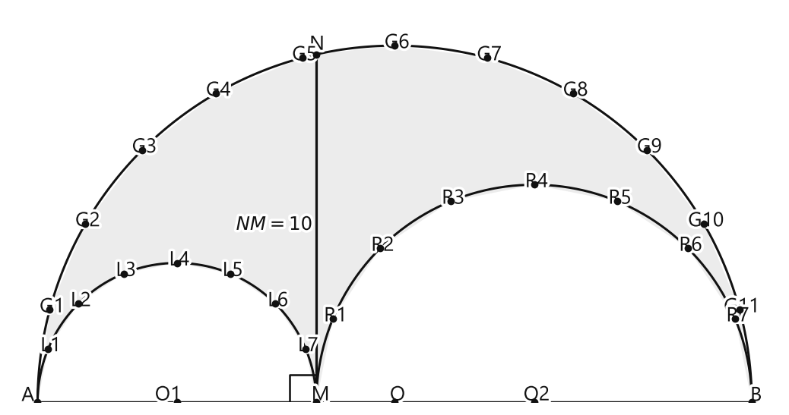
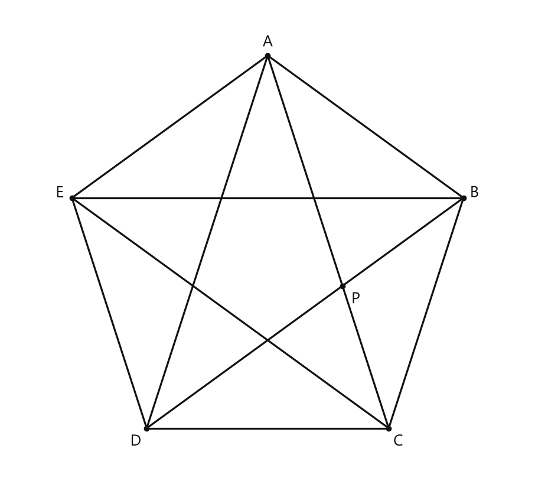

# Занятие 26. Креативная геометрия

**Раздел:** Глава IV. Правильные многоугольники  
**Параграф учебника:** §20. Креативная геометрия  
**Страницы:** 164–168

## Цели занятия

После занятия ученик умеет:

- находить площадь луночек Гиппократа через высоту прямоугольного треугольника;
- применять теорему о высоте прямоугольного треугольника;
- использовать золотое сечение и число $\Phi$;
- строить деление отрезка в отношении золотого сечения;
- описывать построение правильного пятиугольника и десятиугольника;
- находить точные значения $\cos 36^\circ$ и $\cos 72^\circ$.

Выбери блок своего уровня:

- **1–2 балла** — понять основные определения и формулы;
- **3–4 балла** — решить базовые задачи на площади и косинус;
- **5–6 баллов** — доказать свойства луночек;
- **7–8 баллов** — выполнить построения;
- **9–10 баллов** — связать золотое сечение с правильным пятиугольником.

## Теория к занятию

### 1. Луночки Гиппократа

#### Простыми словами

Представь большой полукруг. На его частях построены два меньших полукруга. Если посмотреть на области между их дугами, получаются серповидные фигуры — луночки.

Название необычное, а вычисления вполне обычные: нужны площади полукругов и теорема Пифагора.

#### Определение

**Луночками Гиппократа называют серповидные фигуры, ограниченные дугами двух окружностей.**

#### Формулы

Площадь круга радиуса $R$:

$$
S=\pi R^2.
$$

Площадь полукруга:

$$
S_{\text{полукруга}}=\frac{\pi R^2}{2}.
$$

Если диаметр полукруга равен $d$, то $R=\frac d2$, поэтому:

$$
S_{\text{полукруга}}=\frac{\pi d^2}{8}.
$$

Для прямоугольного треугольника $ANB$, где $NM$ — высота к гипотенузе $AB$:

$$
NM^2=AM\cdot MB.
$$

Площадь луночек:

$$
S=\frac{\pi}{4}\cdot AM\cdot MB.
$$

Так как $AM\cdot MB=NM^2$, можно записать:

$$
S=\frac{\pi}{4}\cdot NM^2.
$$

#### Правила

- Сначала определи, какие отрезки являются диаметрами полукругов.
- Для площади полукруга используй радиус или формулу через диаметр.
- Если известна высота к гипотенузе, применяй равенство $NM^2=AM\cdot MB$.
- Не смешивай площадь луночек и площадь большого полукруга. Они находятся рядом, но это разные области.

#### Алгоритм

1. Записать площадь большого полукруга.
2. Записать площади двух малых полукругов.
3. Найти разность этих площадей.
4. Заменить $AB$ на $AM+MB$.
5. Раскрыть квадрат суммы.
6. Использовать равенство $NM^2=AM\cdot MB$.
7. Подставить известную длину $NM$.

#### Ловушки

- Радиус в два раза меньше диаметра: $R=\frac d2$.
- Площадь полукруга — это половина площади круга.
- Если дано $NM$, не обязательно отдельно находить $AM$ и $MB$.
- Формула $NM^2=AM\cdot MB$ работает здесь потому, что $NM$ — высота к гипотенузе прямоугольного треугольника.

### 2. Золотое сечение

#### Простыми словами

Отрезок делят на большую и меньшую части. Деление будет золотым, если большая часть относится к меньшей так же, как весь отрезок относится к большей части.

То есть одна и та же пропорция повторяется в двух местах. Геометрия любит такие совпадения — особенно когда они выглядят как магия, но считаются обычной пропорцией.

#### Определение

**«Золотое сечение», или «божественная пропорция», — так называют математики деление отрезка некоторой точкой на части так, что больший из полученных отрезков является средним пропорциональным (средним геометрическим) между меньшим отрезком и целым. Другими словами, больший отрезок должен так относиться к меньшему, как целый отрезок относится к большему.**

Если точка $M$ делит отрезок $AB$ на большую часть $AM$ и меньшую часть $MB$, то:

$$
\frac{AM}{MB}=\frac{AB}{AM}.
$$

Пусть для удобства $AB=1$, $AM=x$, тогда $MB=1-x$. Подставим в пропорцию:

$$
\frac{x}{1-x}=\frac{1}{x}.
$$

Перемножим крест-накрест:

$$
x^2=1-x.
$$

Перенесём всё в левую часть:

$$
x^2+x-1=0.
$$

Решая квадратное уравнение, получаем:

$$
x=\frac{-1+\sqrt5}{2}
$$

или отрицательное значение. Отрицательная длина нам не подходит, поэтому:

$$
x=\frac{\sqrt5-1}{2}=0,618033989\ldots
$$

Число золотого сечения:

$$
\Phi=1,618033989\ldots
$$

Также:

$$
\Phi=\frac1x.
$$

Отношение частей приблизительно равно:

$$
62\%:38\%.
$$

#### Правила

- Большая часть — $AM$, меньшая — $MB$.
- Пропорция золотого сечения записывается так:

$$
\frac{AM}{MB}=\frac{AB}{AM}.
$$

- Отрицательный корень квадратного уравнения не подходит, потому что длина отрезка не может быть отрицательной.
- Число $0,618\ldots$ показывает, какую часть целого отрезка составляет большая часть.
- Число $1,618\ldots$ показывает отношение большей части к меньшей.

#### Ловушки

- Не путай $0,618\ldots$ и $1,618\ldots$.
- Не меняй местами $AM$ и $MB$ в пропорции.
- Проценты $62\%$ и $38\%$ являются округлёнными.
- Золотое сечение — это не просто «примерно красивые» числа, а точное соотношение отрезков.

### 3. Золотое сечение в правильном пятиугольнике

#### Простыми словами

Проведём диагонали правильного пятиугольника. Они образуют пятиконечную звезду. Диагонали пересекаются в нескольких точках, и эти точки делят диагонали не пополам, а в отношении золотого сечения.

Вот где обычно путают: правильный пятиугольник имеет равные стороны, но его диагонали длиннее сторон.

#### Свойство

**Точки пересечения диагоналей правильного пятиугольника делят их в отношении золотого сечения.**

Если $M$ — точка пересечения диагоналей, то:

$$
\frac{AM}{MC}=\frac{AC}{AM}.
$$

#### Правила

- В правильном пятиугольнике все стороны равны.
- Все диагонали правильного пятиугольника равны.
- Для доказательства свойства используют подобные треугольники.
- Отношение диагонали к стороне правильного пятиугольника равно $\Phi$.
- Точка пересечения диагоналей делит диагональ на большую и меньшую части.

#### Ловушки

- Диагональ не равна стороне.
- Диагонали пересекаются не обязательно в серединах.
- Золотое сечение относится к частям диагонали.
- «Правильный» означает, что все стороны и все углы равны.

### 4. Деление отрезка в отношении золотого сечения

#### Простыми словами

Пусть дан отрезок длины $a$. Сначала строим прямоугольный треугольник с катетами $a$ и $\frac a2$. Затем циркулем переносим нужные длины.

Циркуль ничего не вычисляет, зато отлично переносит длину. Такой вот геометрический копировальный аппарат.

#### Правило

**Пусть дан отрезок, равный $a$. Построим прямоугольный треугольник $ABC$ с катетами $AC = a$ и $BC = \frac{a}{2}$ (рис. 254). На гипотенузе $AB$ отложим отрезок $BK$, равный отрезку $BC$. Затем на катете $AC$ отложим отрезок $AM$, равный отрезку $AK$. Точка $M$ делит отрезок $AC$ в отношении золотого сечения, т. е. $\frac{AM}{MC} = \frac{AC}{AM}$.**

#### Алгоритм

1. Построить отрезок $AC=a$.
2. В точке $C$ построить перпендикуляр к $AC$.
3. На этом перпендикуляре отложить отрезок $BC=\frac a2$.
4. Соединить точки $A$ и $B$.
5. На гипотенузе $AB$ отложить отрезок $BK=BC$.
6. Найти отрезок $AK$.
7. На отрезке $AC$ отложить от точки $A$ отрезок $AM=AK$.
8. Полученная точка $M$ разделит отрезок $AC$ в отношении золотого сечения.

#### Ловушки

- Отрезок $BC$ должен иметь длину именно $\frac a2$.
- Сначала нужно отложить $BK=BC$, а не $AK=BC$.
- На отрезок $AC$ переносится длина $AK$.
- Проверка выполняется с помощью пропорции:

$$
\frac{AM}{MC}=\frac{AC}{AM}.
$$

### 5. Косинус $36^\circ$ и $72^\circ$

#### Простыми словами

Угол $36^\circ$ встречается в правильном пятиугольнике и связан с золотым сечением. Угол $72^\circ$ в два раза больше:

$$
72^\circ=2\cdot36^\circ.
$$

Значит, для нахождения $\cos72^\circ$ удобно применить формулу косинуса двойного угла.

#### Формула

$$
\cos36^\circ=\frac{1+\sqrt5}{4}.
$$

Для двойного угла:

$$
\cos72^\circ=2\cos^2 36^\circ-1.
$$

Подставим значение $\cos36^\circ$:

$$
\cos72^\circ
=
2\left(\frac{1+\sqrt5}{4}\right)^2-1.
$$

Возведём дробь в квадрат:

$$
\cos72^\circ
=
2\cdot\frac{(1+\sqrt5)^2}{16}-1.
$$

Раскроем квадрат суммы:

$$
(1+\sqrt5)^2=1+2\sqrt5+5=6+2\sqrt5.
$$

Тогда:

$$
\cos72^\circ
=
\frac{6+2\sqrt5}{8}-1.
$$

Представим $1$ в виде дроби со знаменателем $8$:

$$
\cos72^\circ
=
\frac{6+2\sqrt5}{8}-\frac88.
$$

$$
\cos72^\circ
=
\frac{2\sqrt5-2}{8}.
$$

Сократим дробь на $2$:

$$
\cos72^\circ=\frac{\sqrt5-1}{4}.
$$

#### Правила

- Для угла $72^\circ$ используй равенство $72^\circ=2\cdot36^\circ$.
- Применяй формулу:

$$
\cos2\alpha=2\cos^2\alpha-1.
$$

- При возведении в квадрат внимательно раскрывай квадрат суммы.
- Точный ответ с корнем не заменяй десятичным приближением.

#### Ловушки

- $\cos72^\circ$ и $\cos36^\circ$ — разные числа.
- В формуле двойного угла есть слагаемое $-1$.
- При возведении $\frac{1+\sqrt5}{4}$ в квадрат знаменатель становится равным $16$.
- Угол $72^\circ$ острый, поэтому его косинус положителен.

## Сводка формул «выучить наизусть»

$$
S_{\text{полукруга}}=\frac{\pi R^2}{2}.
$$

$$
S_{\text{полукруга}}=\frac{\pi d^2}{8}.
$$

$$
NM^2=AM\cdot MB.
$$

$$
S_{\text{луночек}}=\frac{\pi}{4}\cdot AM\cdot MB.
$$

$$
S_{\text{луночек}}=\frac{\pi}{4}\cdot NM^2.
$$

$$
\frac{AM}{MB}=\frac{AB}{AM}.
$$

$$
x=\frac{\sqrt5-1}{2}.
$$

$$
\Phi=1,618033989\ldots
$$

$$
\cos36^\circ=\frac{1+\sqrt5}{4}.
$$

$$
\cos72^\circ=\frac{\sqrt5-1}{4}.
$$

## Правила, которые нельзя путать

- Диаметр и радиус: $d=2R$.
- Большая часть золотого сечения составляет примерно $62\%$, меньшая — примерно $38\%$.
- Число $\Phi\approx1,618$, а доля большей части от целого отрезка равна примерно $0,618$.
- В прямоугольном треугольнике высота к гипотенузе удовлетворяет формуле $h^2=pq$.
- Площадь полукруга равна половине площади круга.
- В правильном пятиугольнике диагонали делятся в отношении золотого сечения, а не пополам.

## Разбор ключевых заданий

### Р1. Площадь луночек Гиппократа

**Условие.** На отрезках $AB$, $AM$ и $MB$ построены полукруги с центрами в точках $O$, $O_1$ и $O_2$. Точка $N$ лежит на большом полукруге, $NM\perp AB$, $NM=10$. Найти площадь закрашенной части большого полукруга.

<!--geo-figure-spec
{
  "needed": true,
  "kind": "plane",
  "caption": "Полукруги на диаметрах $AB$, $AM$ и $MB$",
  "equal": true,
  "axis": false,
  "xlim": [
    -0.8,
    21.3
  ],
  "ylim": [
    0,
    11.3
  ],
  "points": {
    "A": [
      0,
      0
    ],
    "M": [
      8,
      0
    ],
    "B": [
      20.5,
      0
    ],
    "N": [
      8,
      10
    ],
    "O": [
      10.25,
      0
    ],
    "O1": [
      4,
      0
    ],
    "O2": [
      14.25,
      0
    ],
    "G1": [
      0.3483,
      2.6529
    ],
    "G2": [
      1.3732,
      5.125
    ],
    "G3": [
      3.0022,
      7.2478
    ],
    "G4": [
      5.125,
      8.8768
    ],
    "G5": [
      7.5971,
      9.9007
    ],
    "G6": [
      10.25,
      10.25
    ],
    "G7": [
      12.9029,
      9.9007
    ],
    "G8": [
      15.375,
      8.8768
    ],
    "G9": [
      17.4978,
      7.2478
    ],
    "G10": [
      19.1268,
      5.125
    ],
    "G11": [
      20.1517,
      2.6529
    ],
    "L1": [
      0.3045,
      1.5307
    ],
    "L2": [
      1.1716,
      2.8284
    ],
    "L3": [
      2.4693,
      3.6955
    ],
    "L4": [
      4,
      4
    ],
    "L5": [
      5.5307,
      3.6955
    ],
    "L6": [
      6.8284,
      2.8284
    ],
    "L7": [
      7.6955,
      1.5307
    ],
    "R1": [
      8.4758,
      2.3918
    ],
    "R2": [
      9.8306,
      4.4194
    ],
    "R3": [
      11.8582,
      5.7743
    ],
    "R4": [
      14.25,
      6.25
    ],
    "R5": [
      16.6418,
      5.7743
    ],
    "R6": [
      18.6694,
      4.4194
    ],
    "R7": [
      20.0243,
      2.3918
    ]
  },
  "segments": [
    [
      "A",
      "B"
    ],
    [
      "A",
      "M"
    ],
    [
      "M",
      "B"
    ],
    {
      "points": [
        "N",
        "M"
      ],
      "dashed": false,
      "label": "",
      "t": 0.5
    }
  ],
  "polygons": [
    {
      "vertices": [
        "A",
        "G1",
        "G2",
        "G3",
        "G4",
        "G5",
        "N",
        "M",
        "L7",
        "L6",
        "L5",
        "L4",
        "L3",
        "L2",
        "L1"
      ],
      "fill": 0.08
    },
    {
      "vertices": [
        "N",
        "G6",
        "G7",
        "G8",
        "G9",
        "G10",
        "G11",
        "B",
        "R7",
        "R6",
        "R5",
        "R4",
        "R3",
        "R2",
        "R1",
        "M"
      ],
      "fill": 0.08
    }
  ],
  "circles": [
    {
      "center": "O",
      "radius": 10.25
    },
    {
      "center": "O1",
      "radius": 4
    },
    {
      "center": "O2",
      "radius": 6.25
    }
  ],
  "labels": {
    "A": {
      "dx": -0.28,
      "dy": 0.18
    },
    "M": {
      "dx": 0.12,
      "dy": 0.2
    },
    "B": {
      "dx": 0.12,
      "dy": 0.18
    },
    "N": {
      "dx": 0.02,
      "dy": 0.28
    },
    "O": {
      "dx": 0.08,
      "dy": 0.2
    },
    "O1": {
      "dx": -0.25,
      "dy": 0.2
    },
    "O2": {
      "dx": 0.08,
      "dy": 0.2
    }
  },
  "right_angles": [
    {
      "vertex": "M",
      "from": "N",
      "to": "A"
    }
  ],
  "angle_marks": [],
  "texts": [
    {
      "xy": [
        6.8,
        5.1
      ],
      "text": "$NM=10$"
    }
  ]
}
-->

*Полукруги на диаметрах AB, AM и MB*

**Дано:**

- $NM\perp AB$;
- $NM=10$;
- $AB$ — диаметр большого полукруга;
- $AM$ и $MB$ — диаметры двух малых полукругов.

**Решение.**

Закрашенная часть получается так: из площади большого полукруга вычитаются площади двух малых полукругов.

Площадь полукруга с диаметром $d$ равна $\frac{\pi d^2}{8}$. Поэтому:

$$
S=\frac{\pi}{8}AB^2-\frac{\pi}{8}AM^2-\frac{\pi}{8}MB^2.
$$

Вынесем общий множитель $\frac{\pi}{8}$:

$$
S=\frac{\pi}{8}\left(AB^2-AM^2-MB^2\right).
$$

Точки $A$, $M$, $B$ лежат на одной прямой, поэтому:

$$
AB=AM+MB.
$$

Подставим это равенство:

$$
S=\frac{\pi}{8}\left((AM+MB)^2-AM^2-MB^2\right).
$$

Раскроем квадрат суммы:

$$
S=\frac{\pi}{8}\left(AM^2+2AM\cdot MB+MB^2-AM^2-MB^2\right).
$$

Сократим противоположные слагаемые:

$$
S=\frac{\pi}{8}\cdot2AM\cdot MB.
$$

Получим:

$$
S=\frac{\pi}{4}\cdot AM\cdot MB.
$$

Рассмотрим треугольник $ANB$.

Угол $ANB$ прямой, потому что он опирается на диаметр $AB$. Значит, треугольник $ANB$ прямоугольный, а $AB$ — его гипотенуза.

Отрезок $NM$ — высота, проведённая к гипотенузе. Поэтому:

$$
NM^2=AM\cdot MB.
$$

Заменим произведение $AM\cdot MB$ на $NM^2$:

$$
S=\frac{\pi}{4}\cdot NM^2.
$$

Подставим $NM=10$:

$$
S=\frac{\pi}{4}\cdot10^2.
$$

$$
S=\frac{\pi}{4}\cdot100.
$$

$$
S=25\pi.
$$

**Ответ:** $25\pi$.

> Высота к гипотенузе здесь буквально спасает решение: не пришлось искать отдельно $AM$ и $MB$.

### Р2. Сумма площадей луночек

**Условие.** На сторонах прямоугольного треугольника $ABC$ как на диаметрах построены полукруги. Катеты имеют длины $AC=12$ и $BC=5$. Найдите сумму площадей луночек $S_1+S_2$.

**Дано:**

- $\angle C=90^\circ$;
- $AC=12$;
- $BC=5$;
- $AB$ — гипотенуза;
- на сторонах треугольника построены полукруги.

**Решение.**

Сначала найдём гипотенузу $AB$ по теореме Пифагора:

$$
AB^2=AC^2+BC^2.
$$

Подставим известные длины:

$$
AB^2=12^2+5^2.
$$

$$
AB^2=144+25.
$$

$$
AB^2=169.
$$

Так как длина положительна:

$$
AB=13.
$$

Площадь полукруга с диаметром $AB$ равна:

$$
S_3=\frac{\pi AB^2}{8}.
$$

Сумма площадей полукругов, построенных на катетах, равна:

$$
S_{\text{кат}}=\frac{\pi AC^2}{8}+\frac{\pi BC^2}{8}.
$$

Вынесем общий множитель:

$$
S_{\text{кат}}=\frac{\pi}{8}\left(AC^2+BC^2\right).
$$

По теореме Пифагора:

$$
AC^2+BC^2=AB^2.
$$

Следовательно:

$$
S_{\text{кат}}=\frac{\pi AB^2}{8}=S_3.
$$

Значит, площади полукругов на катетах и на гипотенузе равны. При вычитании общих частей остаются две луночки и прямоугольный треугольник:

$$
S_1+S_2=S_{\triangle ABC}.
$$

Найдём площадь прямоугольного треугольника:

$$
S_{\triangle ABC}=\frac12\cdot AC\cdot BC.
$$

Подставим значения:

$$
S_{\triangle ABC}=\frac12\cdot12\cdot5.
$$

$$
S_{\triangle ABC}=6\cdot5.
$$

$$
S_{\triangle ABC}=30.
$$

Значит:

$$
S_1+S_2=30.
$$

**Ответ:** $30$.

> Число $\pi$ исчезло при сравнении площадей полукругов. Осталась площадь обычного прямоугольного треугольника — геометрия устроила аккуратный фокус.

### Р3. Доказательство свойства луночек

**Условие.** На сторонах прямоугольного треугольника $ABC$ как на диаметрах построены полукруги. Докажите, что $S_1+S_2=S_3$, где $S_3$ — площадь полукруга на гипотенузе $AB$, а $S_1$ и $S_2$ — площади луночек.

**Дано:**

- $\angle C=90^\circ$;
- $AC$ и $BC$ — катеты;
- $AB$ — гипотенуза;
- на сторонах $AC$, $BC$, $AB$ построены полукруги.

**Доказательство.**

Так как треугольник $ABC$ прямоугольный, по теореме Пифагора:

$$
AB^2=AC^2+BC^2.
$$

Площадь полукруга с диаметром $AB$ равна:

$$
S_{\text{большого}}=\frac{\pi AB^2}{8}.
$$

Площади полукругов с диаметрами $AC$ и $BC$ равны:

$$
S_{\text{малых}}=\frac{\pi AC^2}{8}+\frac{\pi BC^2}{8}.
$$

Вынесем общий множитель:

$$
S_{\text{малых}}=\frac{\pi}{8}\left(AC^2+BC^2\right).
$$

Используем теорему Пифагора:

$$
S_{\text{малых}}=\frac{\pi}{8}AB^2.
$$

Следовательно:

$$
S_{\text{малых}}=\frac{\pi AB^2}{8}=S_{\text{большого}}.
$$

Значит, площадь большого полукруга равна сумме площадей двух малых полукругов.

Общие части этих фигур имеют одинаковые площади и при вычитании сокращаются. Остаётся:

$$
S_1+S_2=S_{\triangle ABC}.
$$

Область $S_3$ также равна площади треугольника $ABC$. Поэтому:

$$
S_1+S_2=S_3.
$$

**Ответ:** доказано, что $S_1+S_2=S_3$.

> Секрет доказательства — в теореме Пифагора: квадраты диаметров складываются так же, как площади полукругов.

### Р4. Луночки около квадрата

**Условие.** Около квадрата $ABCD$ описан круг, а на его сторонах построены полукруги как на диаметрах. Докажите, что сумма площадей зелёных луночек равна площади квадрата.

**Дано:**

- $ABCD$ — квадрат;
- около квадрата описан круг;
- на сторонах квадрата построены полукруги;
- сторона квадрата равна $a$.

**Решение.**

Обозначим площадь описанного круга через $S_{\text{круга}}$.

Диагональ квадрата является диаметром описанной окружности. Обозначим диагональ квадрата через $d$.

По теореме Пифагора:

$$
d^2=a^2+a^2.
$$

$$
d^2=2a^2.
$$

Радиус описанного круга равен $\frac d2$. Поэтому площадь круга:

$$
S_{\text{круга}}=\pi\left(\frac d2\right)^2.
$$

$$
S_{\text{круга}}=\frac{\pi d^2}{4}.
$$

Подставим $d^2=2a^2$:

$$
S_{\text{круга}}=\frac{\pi\cdot2a^2}{4}
=\frac{\pi a^2}{2}.
$$

Теперь найдём сумму площадей четырёх полукругов, построенных на сторонах квадрата. Радиус каждого такого полукруга равен $\frac a2$, поэтому:

$$
S_{\text{одного полукруга}}
=\frac12\pi\left(\frac a2\right)^2
=\frac{\pi a^2}{8}.
$$

Для четырёх полукругов:

$$
S_{\text{сторон}}
=4\cdot\frac{\pi a^2}{8}
=\frac{\pi a^2}{2}.
$$

Значит,

$$
S_{\text{сторон}}=S_{\text{круга}}.
$$

На рисунке круг и четыре полукруга имеют общие части. Если из обеих равных площадей убрать эти общие части, то слева останутся зелёные луночки, а справа — квадрат.

Следовательно,

$$
S_{\text{зелёных луночек}}=S_{\text{квадрата}}.
$$

Площадь квадрата равна:

$$
S_{\text{квадрата}}=a^2.
$$

Значит,

$$
S_{\text{зелёных луночек}}=a^2.
$$

Здесь главное — сравнивать целые площади, а не пытаться вычислять каждую луночку отдельно. Луночки выглядят хитро, но площади у них честные.

**Ответ:** сумма площадей зелёных луночек равна площади квадрата.

### Р5. Деление отрезка в отношении золотого сечения

**Условие.** Дан отрезок $AC$ длины $a$. Выполните построение точки $M$, которая делит отрезок $AC$ в отношении золотого сечения.

**Решение.**

1. Постройте отрезок $AC=a$.
2. В точке $C$ восстановите перпендикуляр к прямой $AC$.
3. На перпендикуляре отложите отрезок $CB=\frac a2$.
4. Соедините точки $A$ и $B$. Получится прямоугольный треугольник $ABC$.
5. На гипотенузе $AB$ от точки $B$ отложите отрезок $BK=BC$.
6. Соедините точки $A$ и $K$ или установите циркуль на длину $AK$.
7. На отрезке $AC$ от точки $A$ отложите отрезок $AM=AK$.

Полученная точка $M$ лежит на отрезке $AC$.

По правилу построения:

$$
\frac{AM}{MC}=\frac{AC}{AM}.
$$

Значит, точка $M$ делит отрезок $AC$ в отношении золотого сечения.

Циркуль здесь не измеряет длину «примерно». Он аккуратно переносит уже построенный отрезок — настоящий геометрический копировальный аппарат.

**Ответ:** построена точка $M$, для которой

$$
\frac{AM}{MC}=\frac{AC}{AM}.
$$

### Р6. Построение правильного пятиугольника по стороне

**Условие.** При помощи циркуля и линейки постройте правильный пятиугольник по данной стороне $a$.

**Решение.**

1. Постройте отрезок $AB=a$. Он будет одной из сторон пятиугольника.
2. Постройте точку $K$, которая делит отрезок $AB$ в отношении золотого сечения.
3. Используя построение золотого сечения, постройте отрезок $AD$, длина которого в $\Phi$ раз больше $AB$. Этот отрезок будет диагональю пятиугольника:
   
   $$
   AD=\Phi\cdot AB.
   $$

4. Проведите окружность с центром $A$ и радиусом $AD$.
5. Проведите окружность с центром $B$ и радиусом $AB$.
6. Точку их пересечения, расположенную по выбранную сторону от $AB$, обозначьте $C$.

Тогда:

$$
AC=AD,\qquad BC=AB.
$$

7. Проведите окружность с центром $B$ и радиусом $AD$.
8. Проведите окружность с центром $C$ и радиусом $AB$.
9. Их пересечение обозначьте $D$.

Тогда:

$$
BD=AD,\qquad CD=AB.
$$

10. Проведите окружности с центрами $A$ и $D$ радиусом $AB$.
11. Их нужную точку пересечения обозначьте $E$.
12. Соедините последовательно точки $A$, $B$, $C$, $D$, $E$ и снова $A$.

Все стороны полученной фигуры равны:

$$
AB=BC=CD=DE=EA=a.
$$

Диагонали также построены одинаковой длины. Поэтому полученная фигура является правильным пятиугольником.

Почему появляется золотое сечение? В правильном пятиугольнике диагональ относится к стороне как $\Phi$ к $1$. Золотая пропорция тут не украшение, а рабочая деталь конструкции.

**Ответ:** построен правильный пятиугольник со стороной $a$.

### Р7. Построение правильного пятиугольника, вписанного в окружность

**Условие.** При помощи циркуля и линейки постройте правильный пятиугольник, вписанный в данную окружность.

**Решение.**

1. Пусть дана окружность с центром $O$.
2. Проведите диаметр $AB$.
3. Восстановите к диаметру $AB$ перпендикуляр через центр $O$. Получите второй диаметр $CD$.
4. Разделите радиус $OB$ пополам. Середину радиуса обозначьте $M$.
5. Соедините точку $M$ с точкой $C$.
6. Проведите окружность с центром $M$ и радиусом $MC$.
7. Пусть эта окружность пересечёт диаметр $AB$ в точке $N$, расположенной между $O$ и $B$.
8. Отрезок $CN$ является стороной правильного пятиугольника, вписанного в данную окружность.
9. Установите циркуль на длину $CN$.
10. Начиная с точки $C$, последовательно отложите на данной окружности пять равных хорд.
11. Соедините соседние точки хордами.

Центральный угол, соответствующий одной стороне правильного пятиугольника, равен:

$$
\frac{360^\circ}{5}=72^\circ.
$$

Все пять хорд равны, значит, равны все стороны пятиугольника. Поэтому полученная фигура — правильный пятиугольник.

Ловушка: пяти равных хорд недостаточно просто «увидеть» на рисунке — важно отложить их последовательно на одной и той же окружности.

**Ответ:** построен правильный пятиугольник, вписанный в данную окружность.

### Р8. Построение правильного десятиугольника

**Условие.** При помощи циркуля и линейки постройте правильный десятиугольник с данной стороной $b$.

**Решение.**

Для правильного десятиугольника центральный угол, соответствующий одной стороне, равен:

$$
\frac{360^\circ}{10}=36^\circ.
$$

Поэтому сторона десятиугольника — это хорда, стягивающая центральный угол $36^\circ$.

1. Постройте отрезок $AC=b$.
2. Постройте отрезок $AB$, который является радиусом описанной окружности правильного десятиугольника. Для этого используйте золотое сечение:

   $$
   AB=\Phi\cdot b.
   $$

   Длину $AB$ можно построить циркулем и линейкой по алгоритму построения золотого сечения.
3. Проведите окружность с центром $O$ и радиусом $AB$.
4. На этой окружности выберите точку $A_1$.
5. Установите циркуль на длину $b$.
6. От точки $A_1$ последовательно отложите на окружности десять равных хорд длины $b$.
7. Соедините соседние точки.

Все десять сторон полученной фигуры равны $b$, а окружность разделена на десять равных дуг. Следовательно, центральные углы равны $36^\circ$, и фигура является правильным десятиугольником.

Здесь радиус больше стороны: окружность должна «разместить» десять сторон, а не десять сторон должны растянуть окружность до бесконечности.

**Ответ:** построен правильный десятиугольник со стороной $b$.

### Р9. Точное значение $\cos72^\circ$

**Условие.** Найдите точное значение $\cos72^\circ$, используя значение $\cos36^\circ$.

**Решение.**

Используем формулу двойного угла:

$$
\cos 2\alpha=2\cos^2\alpha-1.
$$

При $\alpha=36^\circ$ получаем:

$$
\cos72^\circ=2\cos^236^\circ-1.
$$

Из условия известно:

$$
\cos36^\circ=\frac{1+\sqrt5}{4}.
$$

Подставим это значение:

$$
\cos72^\circ
=2\left(\frac{1+\sqrt5}{4}\right)^2-1.
$$

Возведём дробь в квадрат:

$$
\cos72^\circ
=2\cdot\frac{(1+\sqrt5)^2}{16}-1.
$$

Раскроем квадрат суммы:

$$
(1+\sqrt5)^2=1+2\sqrt5+5.
$$

$$
(1+\sqrt5)^2=6+2\sqrt5.
$$

Тогда:

$$
\cos72^\circ
=2\cdot\frac{6+2\sqrt5}{16}-1.
$$

Умножим числитель на $2$ и сократим:

$$
\cos72^\circ=\frac{6+2\sqrt5}{8}-1.
$$

Представим число $1$ в виде дроби со знаменателем $8$:

$$
\cos72^\circ
=\frac{6+2\sqrt5}{8}-\frac88.
$$

Вычтем дроби:

$$
\cos72^\circ
=\frac{6+2\sqrt5-8}{8}.
$$

$$
\cos72^\circ=\frac{2\sqrt5-2}{8}.
$$

Вынесем $2$ в числителе:

$$
\cos72^\circ=\frac{2(\sqrt5-1)}{8}.
$$

Сократим дробь на $2$:

$$
\cos72^\circ=\frac{\sqrt5-1}{4}.
$$

**Ответ:** $\frac{\sqrt5-1}{4}$.

### Р10. Золотая пропорция в правильном пятиугольнике

**Условие.** В правильном пятиугольнике диагональ $AC$ пересекается с диагональю $BD$ в точке $M$. Докажите, что:

$$
\frac{AM}{MC}=\frac{AC}{AM}.
$$

**Дано:**

- $ABCDE$ — правильный пятиугольник;
- $AC$ и $BD$ — диагонали;
- $M$ — точка их пересечения.

**Доказательство.**

Все стороны правильного пятиугольника равны:

$$
AB=BC=CD=DE=EA.
$$

Так как пятиугольник правильный, его диагонали равны:

$$
AC=BD.
$$

Рассмотрим треугольники $ABC$ и $BMC$.

В правильном пятиугольнике каждый центральный угол равен $72^\circ$, поэтому угол между стороной и диагональю равен $36^\circ$.

Следовательно:

$$
\angle BAC=\angle MBC=36^\circ,
$$

а углы

$$
\angle ACB=\angle MCB=36^\circ.
$$

Значит, треугольники $ABC$ и $BMC$ подобны по двум углам:

$$
\triangle ABC\sim\triangle BMC.
$$

Из подобия соответствующих сторон следует:

$$
\frac{AC}{BC}=\frac{BC}{MC}.
$$

Кроме того, рассмотрим треугольник $ABM$.

У него:

$$
\angle BAM=36^\circ,
$$

поскольку луч $AM$ лежит на диагонали $AC$, и

$$
\angle ABM=36^\circ,
$$

поскольку луч $BM$ лежит на диагонали $BD$.

Значит, треугольник $ABM$ равнобедренный, поэтому:

$$
AM=AB.
$$

Но $AB=BC$, так как $ABCDE$ — правильный пятиугольник. Следовательно:

$$
AM=BC.
$$

Подставим это равенство в пропорцию:

$$
\frac{AC}{AM}=\frac{AM}{MC}.
$$

Переставим части равенства:

$$
\frac{AM}{MC}=\frac{AC}{AM}.
$$

Это и есть условие золотого сечения.

Диагонали правильного пятиугольника не просто пересекаются — они ещё и аккуратно делят друг друга в золотой пропорции. Геометрия любит порядок, даже когда на рисунке много пересекающихся линий.

**Ответ:**

$$
\frac{AM}{MC}=\frac{AC}{AM},
$$

следовательно, диагональ $AC$ разделена в отношении золотого сечения.

## Практические задания

Выбери свой уровень и решай только этот блок. В блоке должна закрепиться вся тема параграфа. Ответы не приводятся.

### Уровень 1–2 балла

**С1.** Выберите определение луночек Гиппократа.

1) Фигуры, ограниченные двумя хордами  
2) Серповидные фигуры, ограниченные дугами двух окружностей  
3) Фигуры, ограниченные тремя прямыми  
4) Круги, вписанные в треугольник  
5) Области, ограниченные только дугой одной окружности

**С2.** Число $\Phi=1,618033989\ldots$ называют отношением:

1) подобия  
2) периметров  
3) золотого сечения  
4) площадей  
5) высот

**С3.** Отрезок длиной $20$ см разделён точкой в отношении золотого сечения. Как называется больший из двух полученных отрезков согласно определению золотого сечения?

1) Средним арифметическим меньшего отрезка и целого  
2) Средним геометрическим меньшего отрезка и целого  
3) Разностью целого и меньшего отрезка  
4) Половиной целого отрезка  
5) Удвоенным меньшим отрезком

**С4.** Запишите формулу, выражающую значение $\cos 36^\circ$.

1) $\dfrac{1+\sqrt5}{2}$  
2) $\dfrac{1-\sqrt5}{4}$  
3) $\dfrac{1+\sqrt5}{4}$  
4) $\dfrac{\sqrt5-1}{2}$  
5) $\dfrac{\sqrt5}{4}$

**С5.** В правильном пятиугольнике диагонали пересекаются в точках. Как делятся диагонали этими точками?

1) На равные части  
2) В отношении золотого сечения  
3) В отношении $1:3$  
4) Только пополам  
5) В отношении $2:3$

**С6.** На сторонах прямоугольного треугольника как на диаметрах построены полукруги. Площади полукругов на катетах равны $S_1$ и $S_2$, а площадь полукруга на гипотенузе равна $S_3$. Выберите верное равенство.

1) $S_1+S_2=S_3$  
2) $S_1-S_2=S_3$  
3) $S_1+S_3=S_2$  
4) $S_1S_2=S_3$  
5) $S_1=S_2+S_3$

**С7.** В прямоугольном треугольнике $ABC$ катеты равны $AC=6$ см и $BC=8$ см. Найдите гипотенузу $AB$.

**С8.** На сторонах прямоугольного треугольника построены полукруги как на диаметрах. Катеты треугольника равны $AC=12$ см и $BC=5$ см. Найдите сумму площадей полукругов, построенных на катетах, используя формулу площади полукруга $S=\dfrac{\pi d^2}{8}$.

**С9.** Около квадрата $ABCD$ описан круг. На сторонах квадрата построены полукруги как на диаметрах. Какой фигуре равна сумма площадей четырёх луночек?

1) Диагонали квадрата  
2) Площади квадрата  
3) Периметру квадрата  
4) Площади описанного круга  
5) Половине площади квадрата

**С10.** Для построения отрезка в золотом сечении дан отрезок $AC=a$. Какой длины должен быть катет $BC$ в прямоугольном треугольнике $ABC$?

1) $a$  
2) $2a$  
3) $\dfrac a2$  
4) $\dfrac a3$  
5) $\sqrt2a$

**С11.** При построении золотого сечения на гипотенузе $AB$ прямоугольного треугольника отложен отрезок $BK=BC$. Какой отрезок затем откладывают на катете $AC$ от точки $A$?

1) $AM=AB$  
2) $AM=AK$  
3) $AM=BC$  
4) $AM=AC$  
5) $AM=BK+AC$

**С12.** Найдите точное значение $\cos72^\circ$, используя формулу $\cos36^\circ=\dfrac{1+\sqrt5}{4}$ и тождество $\cos72^\circ=2\cos^2 36^\circ-1$.

1) $\dfrac{1+\sqrt5}{4}$  
2) $\dfrac{\sqrt5-1}{4}$  
3) $\dfrac{1-\sqrt5}{4}$  
4) $\dfrac{\sqrt5}{2}$  
5) $\dfrac{1+\sqrt5}{2}$

**С13.** Как называют серповидные фигуры, ограниченные дугами двух окружностей?

1) правильными многоугольниками  
2) луночками Гиппократа  
3) секторами  
4) сегментами  
5) трапециями

**С14.** Какое число является отношением золотого сечения?

1) $\dfrac{\sqrt5-1}{2}$  
2) $\dfrac{\sqrt5+1}{2}$  
3) $\dfrac{1+\sqrt3}{2}$  
4) $\dfrac{3+\sqrt5}{2}$  
5) $\sqrt5$

**С15.** Точка $M$ делит отрезок $AC$ в отношении золотого сечения. Какая запись верна, если $AM$ — больший отрезок?

1) $\dfrac{AM}{MC}=\dfrac{AC}{AM}$  
2) $\dfrac{AM}{MC}=\dfrac{AC}{MC}$  
3) $\dfrac{MC}{AM}=\dfrac{AC}{AM}$  
4) $\dfrac{AM}{AC}=\dfrac{MC}{AM}$  
5) $\dfrac{AC}{MC}=\dfrac{MC}{AM}$

**С16.** В правильном пятиугольнике диагонали пересекаются в точках, которые делят диагонали:

1) пополам  
2) в отношении $1:3$  
3) в отношении золотого сечения  
4) в отношении $2:3$  
5) на три равные части

**С17.** Выберите значение $\cos 36^\circ$.

1) $\dfrac{\sqrt5-1}{4}$  
2) $\dfrac{1+\sqrt5}{4}$  
3) $\dfrac{\sqrt5+1}{2}$  
4) $\dfrac{\sqrt3}{2}$  
5) $\dfrac12$

**С18.** Найдите $\cos 72^\circ$, используя формулу двойного угла и значение $\cos36^\circ=\dfrac{1+\sqrt5}{4}$.

1) $\dfrac{1+\sqrt5}{4}$  
2) $\dfrac{\sqrt5-1}{4}$  
3) $\dfrac{1-\sqrt5}{4}$  
4) $\dfrac{\sqrt5+1}{2}$  
5) $\dfrac{\sqrt5}{4}$

**С19.** На сторонах прямоугольного треугольника построены полукруги как на диаметрах. Катеты имеют длины $6$ и $8$. Чему равна площадь соответствующей суммы луночек Гиппократа?

1) $14$  
2) $24$  
3) $28$  
4) $48$  
5) $96$

**С20.** На катетах прямоугольного треугольника построены полукруги как на диаметрах. На гипотенузе также построен полукруг. Какое равенство площадей выполняется для луночек Гиппократа?

1) $S_1+S_2=S_3$  
2) $S_1-S_2=S_3$  
3) $S_1+S_3=S_2$  
4) $S_1=S_2=S_3$  
5) $2S_1+S_2=S_3$

**С21.** Около квадрата $ABCD$ описан круг, а на его сторонах построены полукруги как на диаметрах. Чему равна сумма площадей зелёных луночек?

1) половине площади квадрата  
2) площади квадрата  
3) площади описанного круга  
4) удвоенной площади квадрата  
5) площади одного полукруга

**С22.** При построении золотого сечения отрезка $AC=a$ сначала строят прямоугольный треугольник с катетами:

1) $a$ и $a$  
2) $a$ и $\dfrac a2$  
3) $\dfrac a2$ и $\dfrac a2$  
4) $2a$ и $a$  
5) $a$ и $\dfrac a3$

**С23.** При построении золотого сечения по описанному алгоритму на гипотенузе $AB$ откладывают отрезок $BK$, равный:

1) $AC$  
2) $AK$  
3) $BC$  
4) $AB$  
5) $MC$

**С24.** Какой отрезок является стороной правильного десятиугольника, вписанного в окружность радиусом $AB$?

1) $AB$  
2) $BC$  
3) $AC$  
4) $AK$  
5) $BK$

**С25.** Выберите определение луночек Гиппократа.  
1) Фигуры, ограниченные сторонами многоугольника  
2) Серповидные фигуры, ограниченные дугами двух окружностей  
3) Круги, вписанные в треугольник  
4) Фигуры, ограниченные двумя хордами  
5) Области между двумя параллельными прямыми

**С26.** Отрезок длиной $10$ см разделён точкой в отношении золотого сечения. Как обозначают отношение золотого сечения?  
1) $\pi$  
2) $\sqrt{2}$  
3) $\Phi$  
4) $\cos 36^\circ$  
5) $\frac{1}{2}$

**С27.** Выберите значение отношения золотого сечения $\Phi$.  
1) $1,414\ldots$  
2) $1,5$  
3) $1,618033989\ldots$  
4) $2,718\ldots$  
5) $3,14159\ldots$

**С28.** В каком многоугольнике точки пересечения диагоналей делят диагонали в отношении золотого сечения?  
1) В правильном треугольнике  
2) В квадрате  
3) В правильном пятиугольнике  
4) В правильном шестиугольнике  
5) В прямоугольнике

**С29.** Вычислите $\cos 36^\circ$ по формуле $\cos 36^\circ=\frac{1+\sqrt5}{4}$.  
1) $\frac{1+\sqrt5}{2}$  
2) $\frac{1+\sqrt5}{4}$  
3) $\frac{\sqrt5-1}{4}$  
4) $\frac{1-\sqrt5}{4}$  
5) $\frac{\sqrt5}{4}$

**С30.** На сторонах прямоугольного треугольника как на диаметрах построены полукруги. Катеты треугольника равны $6$ см и $8$ см. Найдите гипотенузу.  
Ответ запишите в сантиметрах.

**С31.** На сторонах прямоугольного треугольника как на диаметрах построены полукруги. Площади двух полукругов, построенных на катетах, равны $18\pi$ см$^2$ и $32\pi$ см$^2$. Чему равна площадь полукруга, построенного на гипотенузе?  
Ответ запишите в квадратных сантиметрах.

**С32.** В прямоугольном треугольнике $ABC$ угол $C$ прямой, $AC=12$ см, $BC=5$ см. На сторонах треугольника как на диаметрах построены полукруги. Найдите площадь полукруга, построенного на гипотенузе $AB$.  
Ответ запишите через $\pi$.

**С33.** Выберите верное утверждение о луночках Гиппократа, построенных на сторонах прямоугольного треугольника.  
1) Сумма площадей двух луночек равна площади гипотенузы  
2) Сумма площадей двух луночек равна площади прямоугольного треугольника  
3) Сумма площадей двух луночек равна площади полукруга, построенного на гипотенузе  
4) Площади двух луночек всегда равны  
5) Площади луночек не связаны с площадями полукругов

**С34.** Для построения золотого сечения отрезка $AC=a$ строят прямоугольный треугольник с катетами $AC=a$ и $BC=\frac a2$. Какова длина катета $BC$, если $AC=14$ см?  
Ответ запишите в сантиметрах.

**С35.** При построении золотого сечения отрезка $AC$ точка $K$ на гипотенузе выбирается так, что $BK=BC$, а затем на отрезке $AC$ откладывают $AM=AK$. Какой отрезок откладывают равным $AK$?  
1) $AB$  
2) $BC$  
3) $AC$  
4) $AM$  
5) $MC$

**С36.** Найдите точное значение $\cos 72^\circ$, используя формулу двойного угла и значение $\cos36^\circ=\frac{1+\sqrt5}{4}$.  
1) $\frac{1+\sqrt5}{4}$  
2) $\frac{\sqrt5-1}{4}$  
3) $\frac{\sqrt5-1}{2}$  
4) $\frac{1-\sqrt5}{4}$  
5) $\frac{\sqrt5}{2}$

### Уровень 3–4 балла

**С1.** Запишите определение луночек Гиппократа.

**С2.** Отрезок длиной $18$ см разделён точкой в отношении золотого сечения. Большая часть отрезка равна $x$ см. Запишите уравнение, выражающее свойство золотого сечения.

**С3.** Вычислите значение $\cos 36^\circ$ по формуле
$$\cos 36^\circ=\frac{1+\sqrt5}{4}.$$

**С4.** Используя формулу золотого сечения $\Phi\approx1{,}618$, найдите приближённую длину большего отрезка, если меньший отрезок имеет длину $12$ см.

**С5.** В прямоугольном треугольнике катеты равны $6$ см и $8$ см. На каждом из трёх его катетов и гипотенузе как на диаметре построены полукруги. Найдите площадь полукруга, построенного на гипотенузе.

**С6.** На катетах прямоугольного треугольника построены полукруги с площадями $S_1$ и $S_2$, а на гипотенузе — полукруг с площадью $S_3$. Запишите равенство, связывающее $S_1$, $S_2$ и $S_3$.

**С7.** В прямоугольном треугольнике катеты равны $5$ см и $12$ см. На сторонах треугольника как на диаметрах построены полукруги. Найдите сумму площадей двух луночек Гиппократа.

**С8.** В прямоугольном треугольнике $ABC$ угол $C$ прямой, $AC=9$ см, $BC=12$ см. На сторонах треугольника как на диаметрах построены полукруги. Найдите площадь большого полукруга, построенного на гипотенузе.

**С9.** Около квадрата со стороной $10$ см описана окружность. На сторонах квадрата построены полукруги как на диаметрах. Чему равна сумма площадей четырёх луночек, образованных между описанной окружностью и построенными полукругами?

**С10.** На отрезке $AC$ длиной $14$ см постройте точку $M$, делящую его в отношении золотого сечения, используя циркуль и линейку. Запишите последовательность основных построений.

**С11.** При помощи циркуля и линейки постройте правильный пятиугольник по данной стороне $a$. Запишите последовательность построений, указав, какие вспомогательные фигуры необходимо построить.

**С12.** При помощи циркуля и линейки постройте правильный десятиугольник, вписанный в окружность радиуса $6$ см. Запишите последовательность основных построений.

**С13.** Выберите верное утверждение.

1) Луночка Гиппократа ограничена отрезками двух окружностей.  
2) Луночка Гиппократа ограничена дугами двух окружностей.  
3) Луночка Гиппократа ограничена только дугой одной окружности.  
4) Луночка Гиппократа является правильным многоугольником.  
5) Луночка Гиппократа всегда имеет форму треугольника.

**С14.** Отрезок длиной $18$ см разделён точкой в отношении золотого сечения. Больший отрезок равен $x$ см, меньший — $18-x$ см. Запишите уравнение, выражающее определение золотого сечения.

**С15.** Отрезок $AB$ длиной $10$ см разделён точкой $M$ в отношении золотого сечения. Используя приближённое значение $\Phi\approx1{,}618$, найдите длину большего отрезка $AM$, если $AM>MB$ и $\dfrac{AM}{MB}=\Phi$.

**С16.** В правильном пятиугольнике $ABCDE$ диагонали $AC$ и $BD$ пересекаются в точке $P$. Запишите отношение, равное отношению золотого сечения, если $AP$ — больший отрезок диагонали, а $PC$ — меньший.

**С17.** Найдите точное значение $\cos36^\circ$, используя формулу
$$\cos36^\circ=\frac{1+\sqrt5}{4}.$$

**С18.** Используя формулу двойного угла и значение $\cos36^\circ=\dfrac{1+\sqrt5}{4}$, найдите точное значение $\cos72^\circ$.

**С19.** На сторонах катетов прямоугольного треугольника построены полукруги как на диаметрах. Длины катетов равны $6$ см и $8$ см. Найдите сумму площадей этих двух полукругов.

**С20.** На сторонах прямоугольного треугольника $ABC$ как на диаметрах построены полукруги. Катеты имеют длины $5$ см и $12$ см. Найдите площадь полукруга, построенного на гипотенузе, и сравните её с суммой площадей полукругов, построенных на катетах.

**С21.** В прямоугольном треугольнике катеты равны $9$ см и $12$ см. На всех трёх сторонах построены полукруги как на диаметрах. Найдите площадь луночек Гиппократа, образованных полукругами на катетах и полукругом на гипотенузе.

**С22.** Выполните построение правильного пятиугольника по данной стороне $a$. Опишите последовательность основных действий циркулем и линейкой.

**С23.** Выполните построение правильного пятиугольника, вписанного в окружность радиуса $R$. Опишите, как построить на окружности центральные углы, соответствующие сторонам пятиугольника.

**С24.** Выполните построение правильного десятиугольника с данной стороной $b$, используя построение правильного пятиугольника и деление центральных углов пополам. Опишите последовательность построения.

**С25.** Даны отрезки $AB=8$ см и $AC=6$ см, причём на отрезках $AB$, $AC$ и $BC$ построены полукруги как на диаметрах. Найдите площадь полукруга, построенного на гипотенузе $BC$, если треугольник $ABC$ прямоугольный с прямым углом $A$.

**С26.** В прямоугольном треугольнике $ABC$ катеты равны $9$ см и $12$ см. На его сторонах как на диаметрах построены полукруги. Найдите сумму площадей двух луночек Гиппократа, образованных катетами и гипотенузой.

**С27.** На отрезках $AB$, $AM$ и $MB$ построены полукруги как на диаметрах. Известно, что $AM=9$ см, $MB=16$ см, а $NM\perp AB$ и $NM$ — высота прямоугольного треугольника, построенного на диаметре $AB$. Найдите длину $NM$.

**С28.** Даны две окружности, пересекающиеся в точках $A$ и $B$. Их дуги $ACB$ и $ADB$ образуют серповидную фигуру. Как называется фигура, ограниченная дугами двух окружностей?

**С29.** Отрезок длиной $20$ см разделён точкой $M$ в отношении золотого сечения: больший отрезок относится к меньшему так же, как весь отрезок к большему. Найдите длину большего отрезка, округлив результат до десятых долей сантиметра. Используйте $\Phi\approx1{,}618$.

**С30.** Отрезок $AB$ длиной $13$ см разделён точкой $M$ так, что $\dfrac{AM}{MB}=\Phi$, где $\Phi\approx1{,}618$. Найдите длины отрезков $AM$ и $MB$, округлив результаты до сотых долей сантиметра.

**С31.** В правильном пятиугольнике $ABCDE$ диагонали $AC$ и $BD$ пересекаются в точке $P$. В каком отношении точка $P$ делит диагональ $AC$: $\dfrac{AP}{PC}$?

**С32.** Найдите точное значение $\cos 36^\circ$, используя формулу $\cos36^\circ=\dfrac{1+\sqrt5}{4}$.

**С33.** Найдите точное значение $\cos72^\circ$, используя равенство $\cos72^\circ=2\cos^2 36^\circ-1$ и формулу $\cos36^\circ=\dfrac{1+\sqrt5}{4}$.

**С34.** Опишите последовательность построения точки, делящей данный отрезок $AC$ длиной $a$ в отношении золотого сечения, с помощью циркуля и линейки. В описании укажите, какие катеты должен иметь построенный прямоугольный треугольник и какие отрезки необходимо отложить.

**С35.** Опишите построение правильного пятиугольника по данной стороне $a$ с помощью циркуля и линейки. Укажите, какие элементы правильного пятиугольника требуется построить в первую очередь.

**С36.** Опишите построение правильного десятиугольника с данной стороной $b$ с помощью циркуля и линейки, используя тот факт, что сторона правильного десятиугольника является хордой, стягивающей центральный угол $36^\circ$.

### Уровень 5–6 баллов

**С1.** В прямоугольном треугольнике $ABC$ катеты имеют длины $AC=6$ см и $BC=8$ см, а гипотенуза $AB$ является диаметром большого полукруга. На катетах $AC$ и $BC$ построены полукруги как на диаметрах. Найдите сумму площадей двух малых полукругов.

**С2.** На сторонах прямоугольного треугольника $ABC$ построены полукруги как на диаметрах. Катеты равны $AC=12$ см и $BC=5$ см. Докажите, что сумма площадей полукругов, построенных на катетах, равна площади полукруга, построенного на гипотенузе.

**С3.** В прямоугольном треугольнике $ABC$ катеты равны $9$ см и $12$ см. На всех трёх сторонах построены полукруги как на диаметрах. Найдите разность между площадью полукруга на гипотенузе и суммой площадей полукругов на катетах.

**С4.** Около квадрата со стороной $8$ см описан круг. На каждой стороне квадрата построен полукруг внутрь круга как на диаметре. Найдите сумму площадей четырёх луночек Гиппократа, образованных дугами круга и полукругов.

**С5.** Около квадрата $ABCD$ описан круг. На сторонах квадрата построены полукруги как на диаметрах, причём каждый полукруг расположен внутри описанного круга. Докажите, что сумма площадей четырёх луночек Гиппократа равна площади квадрата.

**С6.** В прямоугольном треугольнике $ABC$ высота $CN$ к гипотенузе $AB$ равна $6$ см, а отрезок $AN$ равен $4$ см. На отрезках $AB$, $AN$ и $NB$ построены полукруги как на диаметрах. Найдите площадь луночек Гиппократа, расположенных между большим полукругом и двумя малыми полукругами.

**С7.** Дана окружность радиуса $5$ см. Постройте вписанный в неё правильный пятиугольник с помощью циркуля и линейки. Опишите последовательность построения, используя точки $O$, $A$, $B$, $C$, $D$, $E$, где $O$ — центр окружности, а $A$ — одна из её точек.

**С8.** Дан отрезок $AB$ длиной $10$ см. С помощью циркуля и линейки разделите его точкой $M$ в отношении золотого сечения так, чтобы больший отрезок был $AM$. Запишите, какие вспомогательные отрезки и окружности необходимо построить.

**С9.** Отрезок $AC$ имеет длину $14$ см. По правилу построения золотого сечения построен прямоугольный треугольник $ABC$ с катетами $AC=14$ см и $BC=7$ см. На гипотенузе $AB$ отложен отрезок $BK=BC$, после чего на $AC$ отложен отрезок $AM=AK$. Найдите длины отрезков $AM$ и $MC$.

**С10.** Постройте правильный десятиугольник с данной стороной $b$ с помощью циркуля и линейки. Укажите, какой отрезок правильного пятиугольника используется при этом построении и почему он позволяет получить сторону правильного десятиугольника.

**С11.** Используя формулу
$$\cos 36^\circ=\frac{1+\sqrt5}{4},$$
найдите точное значение $\cos72^\circ$.

**С12.** В правильном пятиугольнике $ABCDE$ диагонали $AC$ и $BD$ пересекаются в точке $P$. Известно, что $AB=6$ см. Используя свойство золотого сечения в правильном пятиугольнике, найдите длину диагонали $AC$, округлив результат до десятых сантиметра.

**С13.** На сторонах прямоугольного треугольника $ABC$ с прямым углом $C$ построены полукруги как на диаметрах. Диаметры полукругов, построенных на катетах, равны $AC=9$ см и $BC=12$ см, а диаметр полукруга, построенного на гипотенузе, равен $AB$. Докажите, что сумма площадей полукругов на катетах равна площади полукруга на гипотенузе.

**С14.** На сторонах прямоугольного треугольника $ABC$ как на диаметрах построены полукруги. Катеты треугольника равны $AC=6$ см и $BC=8$ см. Найдите сумму площадей двух луночек Гиппократа, образованных полукругами на катетах и гипотенузе.

**С15.** На сторонах прямоугольного треугольника с катетами $15$ см и $8$ см построены полукруги как на диаметрах. Найдите площадь полукруга, построенного на гипотенузе.

**С16.** Около квадрата со стороной $10$ см описана окружность. На каждой стороне квадрата построен полукруг наружу, используя сторону квадрата как диаметр. Докажите, что сумма площадей четырёх луночек между описанной окружностью и полукругами равна площади квадрата.

**С17.** Около квадрата $ABCD$ описана окружность радиусом $5\sqrt2$ см. На сторонах квадрата построены полукруги как на диаметрах. Найдите площадь квадрата и сумму площадей четырёх луночек, образованных окружностью и полукругами.

**С18.** Отрезок длиной $20$ см разделён точкой $M$ в отношении золотого сечения: больший отрезок $AM$ относится к меньшему $MB$ так же, как весь отрезок $AB$ относится к большему $AM$. Найдите длины отрезков $AM$ и $MB$.

**С19.** Отрезок $AB$ длиной $10$ см разделён точкой $M$ так, что $\dfrac{AM}{MB}=\dfrac{AB}{AM}$. Определите, является ли такое деление делением в отношении золотого сечения, и найдите точное значение $AM$.

**С20.** В прямоугольном треугольнике $ABC$ катеты имеют длины $a$ и $\dfrac a2$. По правилу построения золотого сечения на гипотенузе отложен отрезок, равный меньшему катету. Запишите длину отрезка, который затем нужно отложить на катете длины $a$, и объясните, какую часть исходного отрезка он отсекает.

**С21.** При помощи циркуля и линейки постройте правильный пятиугольник по данной стороне $a$. Опишите последовательность основных построений и укажите, где используется деление отрезка в отношении золотого сечения.

**С22.** При помощи циркуля и линейки постройте правильный пятиугольник, вписанный в данную окружность с центром $O$. Опишите построение одного центрального угла и получение остальных вершин пятиугольника.

**С23.** При помощи циркуля и линейки постройте правильный десятиугольник по данной стороне $b$. Укажите, какой отрезок окружности должен быть построен первым и почему задача связана с построением правильного пятиугольника.

**С24.** Используя формулу $\cos36^\circ=\dfrac{1+\sqrt5}{4}$ и формулу двойного угла, найдите точное значение $\cos72^\circ$. Затем сравните полученный результат с приближённым значением $\cos72^\circ\approx0{,}309$.

**С25.** На сторонах прямоугольного треугольника с катетами $AC=5$ см и $BC=12$ см как на диаметрах построены полукруги. На гипотенузе $AB$ построен полукруг. Найдите сумму площадей двух луночек Гиппократа, образованных этими полукругами.

**С26.** В прямоугольном треугольнике $ABC$ катеты равны $6$ см и $8$ см. На каждой стороне треугольника как на диаметре построен полукруг. Докажите, что сумма площадей полукругов, построенных на катетах, равна площади полукруга, построенного на гипотенузе, и вычислите эту площадь.

**С27.** Около квадрата $ABCD$ со стороной $6$ см описана окружность. На сторонах квадрата как на диаметрах построены полукруги. Докажите, что сумма площадей четырёх луночек, расположенных между окружностью и полукругами, равна площади квадрата.

**С28.** Дана окружность радиуса $5$ см. Опишите построение правильного пятиугольника, вписанного в эту окружность, используя только циркуль и линейку. Укажите, как получить сторону пятиугольника и как последовательно отметить все его вершины на окружности.

**С29.** Дана сторона правильного десятиугольника $AB$ длиной $4$ см. Опишите построение правильного десятиугольника с этой стороной, используя циркуль и линейку. Обоснуйте, какой центральный угол должна стягивать сторона правильного десятиугольника.

**С30.** Отрезок длиной $18$ см разделён точкой $M$ в отношении золотого сечения: больший отрезок является средним пропорциональным между меньшим отрезком и целым отрезком. Найдите длины получившихся частей и проверьте равенство $\dfrac{AM}{MB}=\dfrac{AB}{AM}$, если $AM>MB$.

### Уровень 7–8 баллов

**С1.** В прямоугольном треугольнике $ABC$ угол $C$ прямой. На сторонах $AC$, $BC$ и $AB$ как на диаметрах построены полукруги. Луночками Гиппократа называют две области, ограниченные дугами построенных полукругов на катетах и гипотенузе. Обозначьте их площади через $S_1$ и $S_2$. Докажите, что $S_1+S_2$ равно площади треугольника $ABC$.

**С2.** В прямоугольном треугольнике $ABC$ катеты равны $AC=12$ см и $BC=5$ см. На трёх его сторонах как на диаметрах построены полукруги. Найдите сумму площадей двух луночек Гиппократа. Ответ запишите в квадратных сантиметрах.

**С3.** В прямоугольном треугольнике $ABC$ гипотенуза $AB=17$ см, а один из катетов $AC=8$ см. На сторонах треугольника как на диаметрах построены полукруги. Найдите площадь треугольника и сумму площадей луночек Гиппократа.

**С4.** В прямоугольном треугольнике $ABC$ высота $CN$, проведённая к гипотенузе $AB$, равна $6$ см, а отрезок $AN=4,5$ см. На сторонах треугольника как на диаметрах построены полукруги. Найдите сумму площадей луночек Гиппократа.

**С5.** На отрезках $AB$, $AM$ и $MB$ построены полукруги с центрами соответственно в точках $O$, $O_1$ и $O_2$, где $M$ лежит между $A$ и $B$. Перпендикуляр $NM$ к $AB$ пересекает большой полукруг в точке $N$, причём $NM=8$ см, $AM=6$ см. Найдите площадь области большого полукруга, не покрытой двумя малыми полукругами.

**С6.** Отрезок $AC$ имеет длину $20$ см. Точка $M$ делит его так, что больший отрезок является средним геометрическим между меньшим отрезком и всем отрезком. Найдите длины $AM$ и $MC$, считая $AM>MC$. Ответ дайте в виде точных выражений с корнем.

**С7.** Отрезок разделён точкой $M$ на части $AM$ и $MC$, причём $AM>MC$, $MC=8$ см, а отношение $AM:MC$ является отношением золотого сечения. Найдите длину всего отрезка и длину $AM$.

**С8.** В правильном пятиугольнике $ABCDE$ точка $P$ — точка пересечения диагоналей $AC$ и $BD$. Известно, что $AC=18$ см. Используя свойство золотого сечения в правильном пятиугольнике, найдите длину стороны пятиугольника $AB$ в точном виде.

**С9.** Используя формулу $\cos36^\circ=\dfrac{1+\sqrt5}{4}$ и формулу двойного угла, найдите точное значение $\cos72^\circ$. Обоснуйте каждый этап преобразования.

**С10.** Выполните построение правильного пятиугольника $ABCDE$ по данной стороне $AB=a$ с помощью циркуля и линейки. Запишите последовательность построений и объясните, почему построенная фигура является правильным пятиугольником.

**С11.** Выполните построение правильного десятиугольника, вписанного в окружность радиуса $R$. Используйте тот факт, что сторона правильного десятиугольника стягивает центральный угол $36^\circ$. Запишите последовательность построений и обоснуйте правильность построения.

**С12.** В правильном пятиугольнике $ABCDE$ диагонали $AC$, $BD$, $CE$, $DA$ и $EB$ пересекаются, образуя внутреннюю звезду. Точка $P$ — точка пересечения диагоналей $AC$ и $BD$, причём $AP=12$ см, $PC=7,416$ см. Установите, какая из частей $AP$ и $PC$ является большей, проверьте выполнение отношения золотого сечения с округлением до тысячных и найдите длину диагонали $AC$.

**С13.** В прямоугольном треугольнике $ABC$ с прямым углом $C$ на сторонах $AC$, $BC$ и $AB$ как на диаметрах построены полукруги. Докажите, что площадь полукруга на гипотенузе равна сумме площадей полукругов на катетах.

**С14.** На сторонах прямоугольного треугольника $ABC$ как на диаметрах построены полукруги. Катеты треугольника равны $AC=5$ см и $BC=12$ см. Найдите площадь полукруга, построенного на гипотенузе $AB$ как на диаметре.

**С15.** На сторонах прямоугольного треугольника $ABC$ как на диаметрах построены полукруги. Катеты равны $AC=9$ см и $BC=12$ см. Найдите сумму площадей полукругов, построенных на катетах.

**С16.** В квадрате $ABCD$ со стороной $8$ см около квадрата описана окружность. На каждой стороне квадрата как на диаметре построен полукруг, расположенный внутри описанной окружности. Докажите, что сумма площадей четырёх луночек, ограниченных дугами этих окружностей, равна площади квадрата.

**С17.** В прямоугольном треугольнике $ABC$ с катетами $AC=6$ см и $BC=8$ см из вершины прямого угла $C$ проведена высота $CH$ к гипотенузе $AB$. На отрезках $AC$, $BC$ и $AB$ как на диаметрах построены полукруги. Найдите сумму площадей двух луночек Гиппократа, образованных полукругами на катетах и полукругом на гипотенузе.

**С18.** Отрезок $AB$ длиной $18$ см разделён точкой $M$ так, что $AM$ — больший отрезок, а $MB$ — меньший. Известно, что деление выполнено в отношении золотого сечения. Найдите длины $AM$ и $MB$.

**С19.** Точка $M$ делит отрезок $AB$ в отношении золотого сечения: $AM$ — больший отрезок, $MB=6$ см — меньший. Найдите длину всего отрезка $AB$.

**С20.** Дан правильный пятиугольник $ABCDE$ со стороной $4$ см. Диагонали пятиугольника пересекаются в точках, образующих внутренний правильный пятиугольник. Используя свойство золотого сечения, найдите отношение длины диагонали исходного пятиугольника к длине его стороны и длину диагонали.

<!--geo-figure-spec
{
  "needed": true,
  "kind": "plane",
  "caption": "Правильный пятиугольник $ABCDE$ с диагоналями и точкой $P=AC\\cap BD$",
  "equal": true,
  "axis": false,
  "xlim": [
    -4.3,
    4.3
  ],
  "ylim": [
    -3.5,
    4.2
  ],
  "points": {
    "A": [
      0,
      3.402603
    ],
    "B": [
      3.236068,
      1.051462
    ],
    "C": [
      2,
      -2.752764
    ],
    "D": [
      -2,
      -2.752764
    ],
    "E": [
      -3.236068,
      1.051462
    ],
    "P": [
      1.236068,
      -0.401623
    ]
  },
  "segments": [
    [
      "A",
      "B"
    ],
    [
      "B",
      "C"
    ],
    [
      "C",
      "D"
    ],
    [
      "D",
      "E"
    ],
    [
      "E",
      "A"
    ],
    [
      "A",
      "C"
    ],
    [
      "B",
      "D"
    ],
    [
      "C",
      "E"
    ],
    [
      "D",
      "A"
    ],
    [
      "E",
      "B"
    ]
  ],
  "polygons": [],
  "circles": [],
  "labels": {
    "A": {
      "dx": 0,
      "dy": 0.22
    },
    "B": {
      "dx": 0.18,
      "dy": 0.08
    },
    "C": {
      "dx": 0.16,
      "dy": -0.22
    },
    "D": {
      "dx": -0.18,
      "dy": -0.22
    },
    "E": {
      "dx": -0.2,
      "dy": 0.08
    },
    "P": {
      "dx": 0.22,
      "dy": -0.22
    }
  },
  "right_angles": [],
  "angle_marks": [],
  "texts": []
}
-->

*Правильный пятиугольник ABCDE с диагоналями и точкой P=AC\cap BD*

**С21.** Используя формулу $\cos 36^\circ=\frac{1+\sqrt5}{4}$ и формулу двойного угла, найдите точное значение $\cos72^\circ$. Ответ запишите в виде выражения, содержащего $\sqrt5$.

**С22.** Опишите последовательность построения правильного пятиугольника с помощью циркуля и линейки по данной стороне $a$. В обосновании укажите, почему построенная диагональ должна относиться к стороне как золотое сечение.

**С23.** Дан отрезок $AB$ длиной $10$ см. С помощью циркуля и линейки постройте точку $M$, делящую его в отношении золотого сечения так, чтобы $AM$ был большим отрезком. Запишите последовательность построения и равенство, подтверждающее результат.

**С24.** Диагонали правильного пятиугольника $ABCDE$ пересекаются в точке $P$. Известно, что $AB=6$ см. Докажите, что точка $P$ делит диагональ $AC$ в отношении золотого сечения, и найдите длину большего из отрезков, на которые точка $P$ делит диагональ $AC$.

### Уровень 9–10 баллов

**С1.** На сторонах прямоугольного треугольника $ABC$ как на диаметрах построены полукруги. Катеты треугольника равны $9$ см и $12$ см. Докажите, что площадь полукруга, построенного на гипотенузе, равна сумме площадей полукругов, построенных на катетах, и вычислите эту площадь.

**С2.** В прямоугольном треугольнике $ABC$ с прямым углом $C$ на сторонах $AC$, $BC$ и $AB$ как на диаметрах построены полукруги. Из большего полукруга удалены два меньших. Найдите площадь оставшейся фигуры, если $AC=10$ см, $BC=24$ см. Объясните, почему эта фигура состоит из двух луночек Гиппократа.

**С3.** В прямоугольном треугольнике $ABC$ высота $CH$, проведённая к гипотенузе $AB$, равна $12$ см, а $AH=9$ см. На сторонах $AC$, $BC$ и $AB$ как на диаметрах построены полукруги. Найдите сумму площадей двух луночек Гиппократа, образованных меньшими полукругами и большим полукругом.

**С4.** На сторонах квадрата $ABCD$ со стороной $8$ см построены полукруги наружу, а около квадрата описана окружность. Рассматриваются четыре серповидные области, ограниченные дугами окружности и дугами полукругов. Докажите, что сумма площадей этих областей равна площади квадрата, и найдите её числовое значение.

**С5.** Стороны прямоугольника равны $6$ см и $10$ см. На каждой его стороне построен полукруг наружу, а внутри прямоугольника построена окружность, касающаяся всех его сторон. Определите, можно ли утверждать, что сумма площадей четырёх серповидных областей, образованных дугами полукругов и окружностью, равна площади прямоугольника. Ответ обоснуйте вычислением площадей соответствующих полукругов и круга.

**С6.** Дан отрезок $AB$ длиной $14$ см. С помощью циркуля и линейки выполните построение точки $M$ на отрезке $AB$, делящей его в отношении золотого сечения, то есть удовлетворяющей условию
$\dfrac{AM}{MB}=\dfrac{AB}{AM}$.
Опишите последовательность построения и вычислите длины отрезков $AM$ и $MB$.

**С7.** Отрезок $AC$ имеет длину $20$ см. По алгоритму построения золотого сечения построен прямоугольный треугольник $ABC$ с катетами $AC$ и $BC=\dfrac{AC}{2}$, затем на гипотенузе отложен отрезок $BK=BC$, а на $AC$ — отрезок $AM=AK$. Найдите точные значения $AK$, $AM$ и $MC$, не используя приближённое значение числа $\Phi$.

**С8.** В правильном пятиугольнике $ABCDE$ диагонали $AC$ и $BD$ пересекаются в точке $P$. Известно, что $AC=18$ см. Используя свойство золотого сечения, найдите длины отрезков $AP$, $PC$, $BP$ и $PD$, если $AP>PC$ и $BP>PD$.

**С9.** В правильном пятиугольнике диагональ в $\Phi$ раз больше стороны, где $\Phi$ — отношение золотого сечения. Периметр пятиугольника равен $40$ см. Найдите сумму длин всех его диагоналей и выразите результат через $\sqrt5$.

**С10.** Постройте с помощью циркуля и линейки правильный пятиугольник по данной стороне $a$. В описании построения укажите, как получить отрезок, длина которого равна диагонали искомого пятиугольника, и как с его помощью определить положения всех вершин.

**С11.** Постройте с помощью циркуля и линейки правильный десятиугольник по данной стороне $b$. Обоснуйте, почему для построения можно использовать равнобедренный треугольник, у которого боковые стороны равны радиусу описанной окружности, а угол при вершине равен $36^\circ$.

**С12.** Используя равенство
$\cos36^\circ=\dfrac{1+\sqrt5}{4}$,
формулы двойного угла и связь углов $36^\circ$ и $72^\circ$, найдите точные значения $\cos72^\circ$ и $\sin72^\circ$. Затем вычислите точную площадь равнобедренного треугольника, боковые стороны которого равны $10$ см, а угол между ними равен $72^\circ$.

**С13.** На сторонах прямоугольного треугольника $ABC$ с прямым углом $C$ построены внешние полукруги с диаметрами $AC$, $BC$ и $AB$. Докажите, что сумма площадей двух луночек, образованных полукругом на гипотенузе и полукругами на катетах, равна площади треугольника $ABC$. В доказательстве используйте формулу площади круга и теорему Пифагора.

**С14.** В прямоугольном треугольнике $ABC$ катеты равны $9$ см и $12$ см. На всех трёх сторонах построены полукруги как на диаметрах. Найдите сумму площадей двух луночек Гиппократа, ограниченных дугами этих полукругов. Ответ выразите в квадратных сантиметрах.

**С15.** Квадрат $ABCD$ имеет сторону $a$. Около него описана окружность, а на каждой стороне квадрата построен внешний полукруг как на диаметре. Луночкой назовём часть каждого полукруга, расположенную вне описанной окружности. Докажите, что сумма площадей четырёх таких луночек равна площади квадрата. Получите равенство сначала для произвольного $a>0$, а затем объясните, почему результат не зависит от размера квадрата.

**С16.** Дана сторона $AB=a$ правильного пятиугольника. Опишите последовательность построений циркулем и линейкой, позволяющую построить этот пятиугольник. В построении используйте деление отрезка $AB$ в отношении золотого сечения. Для каждого нового построенного отрезка укажите, каким способом он получен, и обоснуйте, что построенная фигура действительно является правильным пятиугольником.

**С17.** Используя равенство
$$\cos 36^\circ=\frac{1+\sqrt5}{4},$$
найдите точное значение $\cos72^\circ$. Затем вычислите точное значение
$$\cos^2 36^\circ-\sin^2 36^\circ$$
и сравните полученный результат с $\cos72^\circ$.

**С18.** Отрезок $AB$ имеет длину $20$ см. Точка $M$ делит его в отношении золотого сечения, причём $AM>MB$. Постройте точку $M$ циркулем и линейкой по правилу построения золотого сечения. После построения найдите точные длины отрезков $AM$ и $MB$, используя уравнение, выражающее свойство золотого сечения, и проверьте найденные длины по отношению
$$\frac{AM}{MB}=\frac{AB}{AM}.$$

## Чек-лист «ученик понял тему»

- Могу повторить определения и формулы параграфа своими словами и по учебнику.
- Решаю типовые задания своего уровня без подсказки.
- Вижу типичную ошибку и могу её объяснить.
