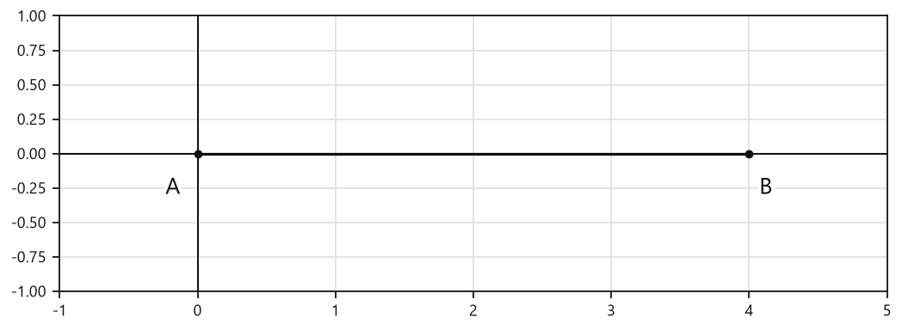
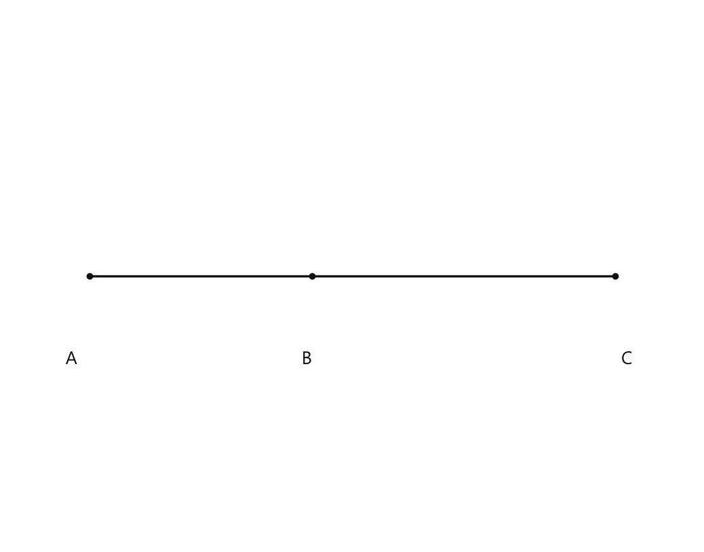
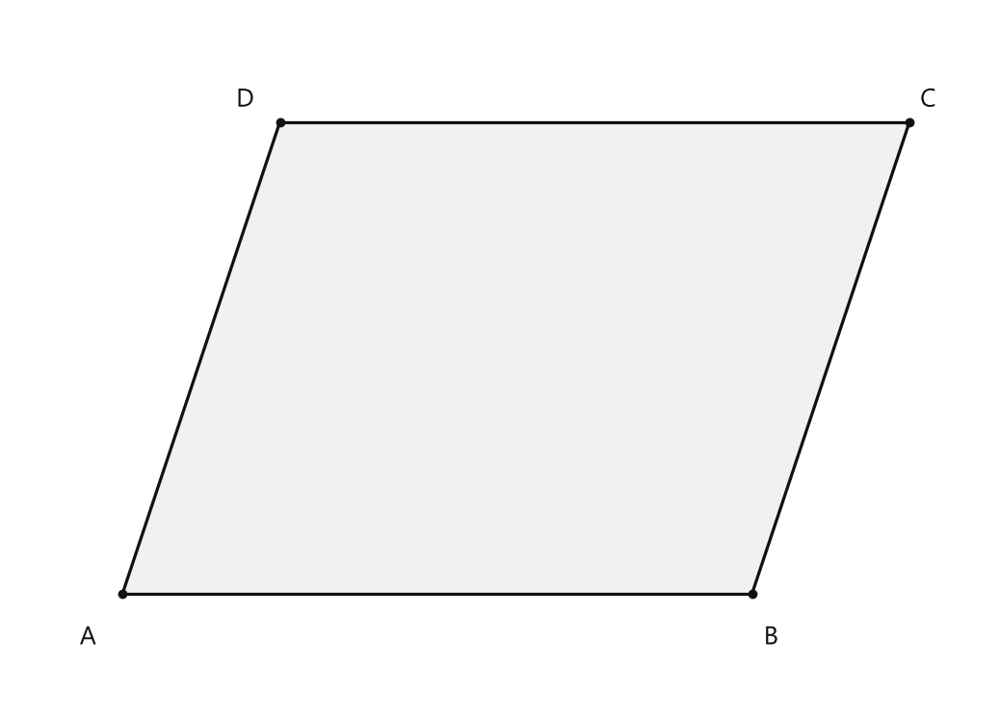
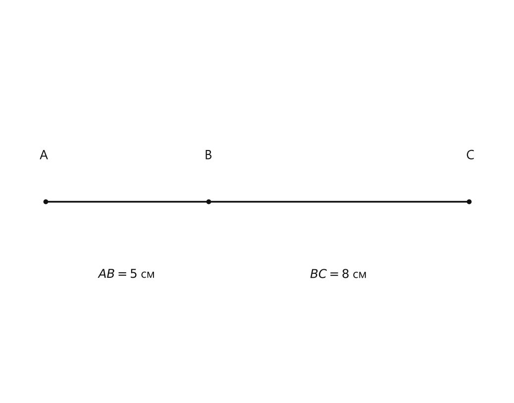
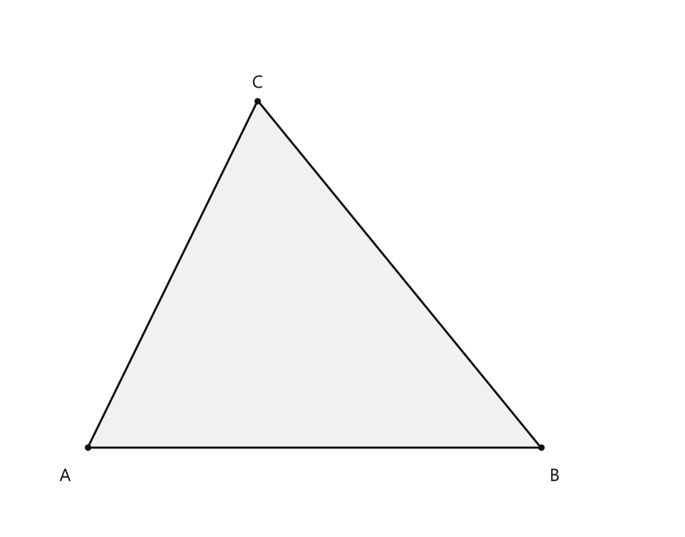
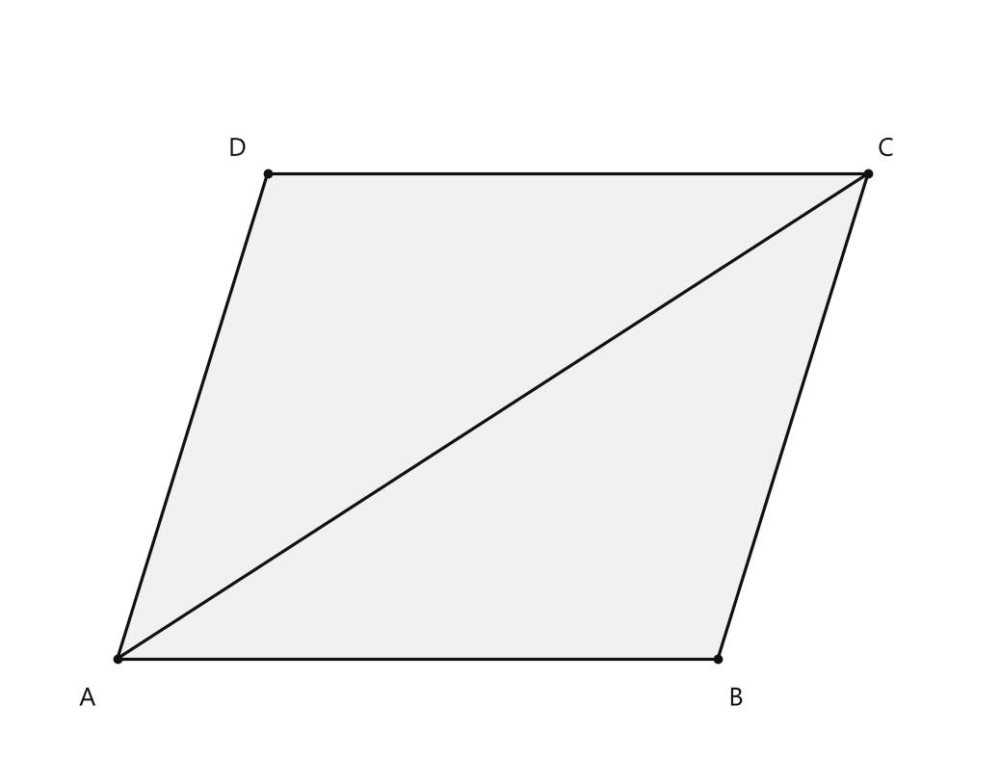
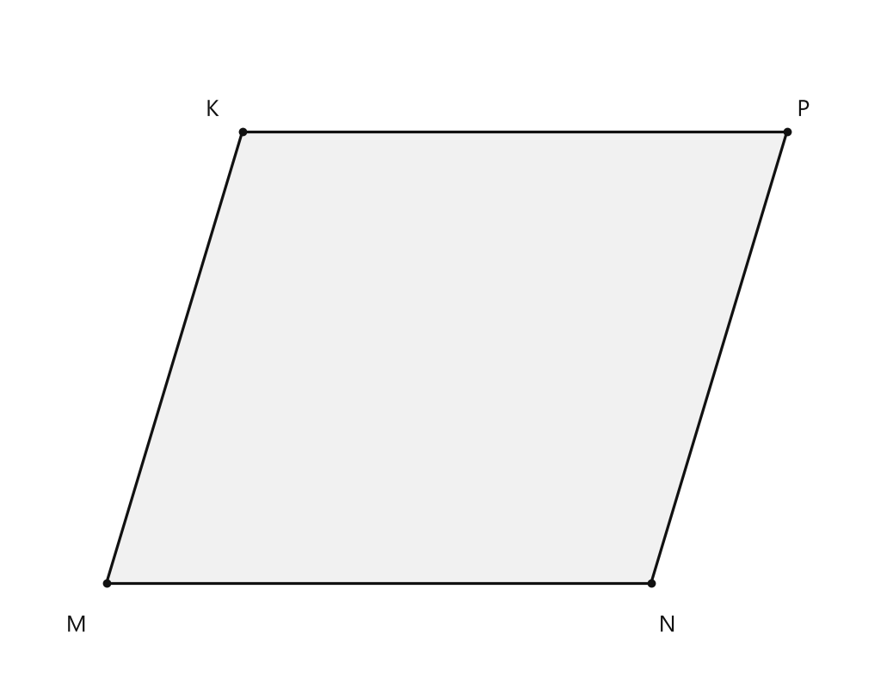

# Занятие 27. Векторы

**Раздел:** Глава V. Векторы  
**Параграф учебника:** §27. Векторы  
**Страницы:** 173–173

## Цели занятия

После занятия ученик сможет:

- объяснить, что изучается в главе «Векторы»;
- распознавать обозначения векторов $\vec a$, $\vec b$, $\vec c$;
- понимать запись суммы векторов $\vec c=\vec a+\vec b$;
- назвать правило сложения векторов, если оно дано в следующем теоретическом материале;
- выбрать блок заданий своего уровня: **1–2 / 3–4 / 5–6 / 7–8 / 9–10 баллов**.

> В предоставленной карточке есть только вводная страница главы. Полных определений, свойств, формул и примеров §27 нет, поэтому ниже не добавляются формулировки, которых нет в опоре.

## Теория к занятию

### Что изучается в главе

#### 1. Простыми словами

В этой главе начинаем знакомиться с векторами.

Вектор — это объект, для которого важны:

- направление;
- длина.

На рисунке вектор показывают стрелкой. Стрелка указывает, куда направлен вектор. Это не украшение, а важная часть записи.

Векторы обозначают маленькими латинскими буквами со стрелкой сверху:

- $\vec a$;
- $\vec b$;
- $\vec c$.

Также в главе встречается запись суммы векторов:

$$
\vec c=\vec a+\vec b.
$$

Она означает: вектор $\vec c$ получили при сложении векторов $\vec a$ и $\vec b$.

Смотри внимательно: $\vec a$ и $a$ выглядят почти одинаково, но стрелка меняет смысл записи. В математике маленькая стрелка умеет многое.

#### 2. Определение / факт / теорема / свойство

В предоставленном транскрипте страницы учебника определения вектора не приведено.

На странице указано:

> Что такое вектор в геометрии

Это название изучаемого вопроса, а не само определение.

Поэтому точную формулировку определения по этой карточке восстановить нельзя.

#### 3. Формулы

В карточке приведена формула:

$$
\vec c=\vec a+\vec b.
$$

Здесь:

- $\vec a$ — первый вектор;
- $\vec b$ — второй вектор;
- $\vec c$ — результат их сложения.

То есть формула читается так: «вектор $\vec c$ равен сумме векторов $\vec a$ и $\vec b$».

Важно: результат сложения векторов тоже является вектором, поэтому над буквой $\vec c$ также стоит стрелка.

#### 4. Правила

Из предоставленного материала можно записать такие правила:

- вектор обозначают буквой со стрелкой сверху;
- сумму векторов записывают знаком $+$;
- результат сложения двух векторов также обозначают как вектор;
- $\vec a$ и $a$ — разные обозначения;
- $\vec a$ обозначает вектор, а $a$ может обозначать число или длину.

Вот где обычно путают: стрелка над буквой — не декоративная причёска символа, а его математический смысл.

#### 5. Алгоритм

Полный алгоритм сложения векторов в карточке не приведён.

Можно записать только общий порядок действий:

1. Взять векторы $\vec a$ и $\vec b$.
2. Выполнить их сложение.
3. Обозначить полученный результат вектором $\vec c$.
4. Записать:

$$
\vec c=\vec a+\vec b.
$$

Точный способ сложения по рисунку и правило треугольника должны быть приведены в полном тексте параграфа. В данной карточке их нет, поэтому добавлять их нельзя.

#### 6. Ловушки

- Не убирай стрелку над буквой: $\vec a$ и $a$ — не одно и то же.
- Запись $\vec c=\vec a+\vec b$ означает сумму векторов.
- Вектор и его длина — разные математические объекты.
- Сумма двух векторов обозначается тоже вектором.
- По одной картинке нельзя восстановить точное определение или полный алгоритм. Рисунок помогает понять идею, но не заменяет текст учебника.

### Сводка формул «выучить наизусть»

$$
\vec c=\vec a+\vec b.
$$

### Правила, которые нельзя путать

- Вектор и его длина — разные математические объекты.
- Обозначение $\vec a$ — это вектор.
- Обозначение $a$ без стрелки не следует автоматически считать вектором.
- Сумма двух векторов обозначается тоже вектором.
- Стрелка над буквой является частью обозначения вектора.

## Разбор ключевых заданий

В предоставленной карточке нет разобранных примеров и типовых упражнений §27.

Поэтому нельзя составить точные задания на:

- определение вектора;
- его длину;
- направление;
- правило треугольника;
- сложение векторов по рисунку.

Для полного разбора нужны дополнительные страницы §27, где приведены:

- определение вектора;
- обозначение вектора;
- рисунки с началом и концом вектора;
- правило сложения векторов;
- примеры и типовые упражнения.

После получения этих страниц можно будет составить задания Р1, Р2 и далее с пошаговым решением и проверенными ответами.

## Практические задания

Выбери свой уровень и решай только этот блок. В блоке должна закрепиться вся тема параграфа. Ответы не приводятся.

### Уровень 1–2 балла

**С1.** Выберите обозначение вектора, направленного из точки $A$ в точку $B$.

1) $\overrightarrow{AB}$ 2) $\overrightarrow{BA}$ 3) $AB$ 4) $\overline{AB}$ 5) $\overrightarrow{AA}$

**С2.** Какой вектор противоположен вектору $\overrightarrow{MN}$?

1) $\overrightarrow{MN}$ 2) $\overrightarrow{NM}$ 3) $\overrightarrow{MM}$ 4) $\overrightarrow{NN}$ 5) $\overrightarrow{MN}+\overrightarrow{NM}$

**С3.** Выберите нулевой вектор.

1) $\overrightarrow{AB}$ 2) $\overrightarrow{BA}$ 3) $\overrightarrow{AA}$ 4) $\overrightarrow{AC}$ 5) $\overrightarrow{BC}$

**С4.** Векторы $\overrightarrow{AB}$ и $\overrightarrow{CD}$ равны. Выберите верное утверждение.

1) Они имеют разные направления и равные длины.  
2) Они имеют одинаковые направления и разные длины.  
3) Они имеют одинаковые направления и равные длины.  
4) Их начала совпадают.  
5) Их концы совпадают.

**С5.** Укажите сумму, записанную по правилу треугольника.

1) $\overrightarrow{AB}+\overrightarrow{BC}=\overrightarrow{AC}$  
2) $\overrightarrow{AB}+\overrightarrow{CB}=\overrightarrow{AC}$  
3) $\overrightarrow{BA}+\overrightarrow{BC}=\overrightarrow{AC}$  
4) $\overrightarrow{AB}+\overrightarrow{AC}=\overrightarrow{BC}$  
5) $\overrightarrow{AC}+\overrightarrow{BC}=\overrightarrow{AB}$

**С6.** Векторы $\vec a$ и $\vec b$ направлены в противоположные стороны и имеют равные длины. Какой вектор равен их сумме?

1) $\vec a$ 2) $\vec b$ 3) $2\vec a$ 4) $\vec a+\vec b$ — нулевой вектор 5) $-\vec a$

**С7.** Запишите вектор, противоположный вектору $\overrightarrow{PQ}$.

**С8.** Запишите равенство для суммы векторов $\overrightarrow{KL}$ и $\overrightarrow{LM}$ по правилу треугольника.

**С9.** Даны векторы $\vec a$ и $\vec b$. Запишите их сумму.

**С10.** Векторы $\overrightarrow{AB}$ и $\overrightarrow{CD}$ имеют одинаковые направления и равные длины. Запишите равенство этих векторов.

**С11.** Запишите нулевой вектор, начало и конец которого находятся в точке $R$.

**С12.** Дано равенство $\overrightarrow{XY}=\overrightarrow{ZT}$. Запишите вектор, противоположный каждому из данных векторов.

**С13.** Какой объект является вектором?

1) точка $A$  
2) прямая $a$  
3) направленный отрезок $\overrightarrow{AB}$  
4) угол $\angle ABC$  
5) окружность $\omega$

**С14.** Для вектора $\overrightarrow{CD}$ укажите его начало.

1) $C$  
2) $D$  
3) $CD$  
4) $\overrightarrow{DC}$  
5) начало не определяется

**С15.** Для вектора $\overrightarrow{MN}$ укажите его конец.

1) $M$  
2) $N$  
3) $MN$  
4) $\overrightarrow{NM}$  
5) конец не определяется

**С16.** Как записывают длину вектора $\overrightarrow{AB}$?

1) $AB$  
2) $\overrightarrow{AB}$  
3) $|\overrightarrow{AB}|$  
4) $\angle AB$  
5) $A+B$

**С17.** На рисунке изображены точки $A(0;0)$ и $B(4;0)$. Какой вектор направлен слева направо?

<!--geo-figure-spec
{
  "needed": true,
  "kind": "plane",
  "caption": "Вектор $\\overrightarrow{AB}$",
  "equal": true,
  "axis": true,
  "xlim": [
    -1,
    5
  ],
  "ylim": [
    -1,
    1
  ],
  "points": {
    "A": [
      0,
      0
    ],
    "B": [
      4,
      0
    ]
  },
  "segments": [
    {
      "points": [
        "A",
        "B"
      ],
      "dashed": false,
      "label": "",
      "t": 0.5,
      "arrow": true
    }
  ],
  "polygons": [],
  "circles": [],
  "labels": {
    "A": {
      "dx": -0.18,
      "dy": -0.25
    },
    "B": {
      "dx": 0.12,
      "dy": -0.25
    }
  },
  "right_angles": [],
  "angle_marks": [],
  "texts": []
}
-->

*Вектор \overrightarrow{AB}*

1) $\overrightarrow{AB}$  
2) $\overrightarrow{BA}$  
3) $AB$  
4) $\overrightarrow{AA}$  
5) $\overrightarrow{BB}$

**С18.** Векторы $\overrightarrow{AB}$ и $\overrightarrow{CD}$ имеют одинаковое направление и равные длины. Как они называются?

1) противоположными  
2) равными  
3) нулевыми  
4) перпендикулярными  
5) сонаправленными, но не равными

**С19.** Какой вектор называют нулевым?

1) вектор с началом и концом в одной точке  
2) любой вектор горизонтального направления  
3) вектор наибольшей длины  
4) вектор, направленный вверх  
5) вектор, имеющий две разные конечные точки

**С20.** Какой вектор противоположен вектору $\overrightarrow{AB}$?

1) $\overrightarrow{AB}$  
2) $\overrightarrow{BA}$  
3) $\overrightarrow{AA}$  
4) $\overrightarrow{BB}$  
5) $\overrightarrow{AB}+\overrightarrow{BA}$

**С21.** На рисунке точки $A$, $B$ и $C$ расположены на одной прямой, причём $B$ находится между $A$ и $C$. Какой вектор является суммой $\overrightarrow{AB}+\overrightarrow{BC}$?

<!--geo-figure-spec
{
  "needed": true,
  "kind": "plane",
  "caption": "Точки $A$, $B$, $C$ на одной прямой; точка $B$ между точками $A$ и $C$",
  "equal": false,
  "axis": false,
  "xlim": [
    -0.8,
    6
  ],
  "ylim": [
    -0.8,
    0.8
  ],
  "points": {
    "A": [
      0,
      0
    ],
    "B": [
      2.2,
      0
    ],
    "C": [
      5.2,
      0
    ]
  },
  "segments": [
    {
      "points": [
        "A",
        "B"
      ],
      "dashed": false,
      "label": "",
      "t": 0.5
    },
    {
      "points": [
        "B",
        "C"
      ],
      "dashed": false,
      "label": "",
      "t": 0.5
    },
    {
      "points": [
        "A",
        "C"
      ],
      "dashed": false,
      "label": "",
      "t": 0.5
    }
  ],
  "polygons": [],
  "circles": [],
  "labels": {
    "A": {
      "dx": -0.18,
      "dy": -0.25
    },
    "B": {
      "dx": -0.05,
      "dy": -0.25
    },
    "C": {
      "dx": 0.12,
      "dy": -0.25
    }
  },
  "right_angles": [],
  "angle_marks": [],
  "texts": []
}
-->

*Точки A, B, C на одной прямой; точка B между точками A и C*

1) $\overrightarrow{AB}$  
2) $\overrightarrow{BC}$  
3) $\overrightarrow{AC}$  
4) $\overrightarrow{CA}$  
5) $\overrightarrow{BA}$

**С22.** Выберите запись вектора, противоположного вектору $\overrightarrow{PQ}$.

1) $\overrightarrow{PQ}$  
2) $\overrightarrow{QP}$  
3) $\overrightarrow{PP}$  
4) $\overrightarrow{QQ}$  
5) $PQ$

**С23.** Векторы $\overrightarrow{AB}$ и $\overrightarrow{CD}$ имеют равные длины и противоположные направления. Как они называются?

1) равными  
2) нулевыми  
3) противоположными  
4) сонаправленными  
5) перпендикулярными

**С24.** Какое равенство соответствует правилу треугольника для суммы векторов $\overrightarrow{AB}$ и $\overrightarrow{BC}$?

1) $\overrightarrow{AB}+\overrightarrow{BC}=\overrightarrow{AC}$  
2) $\overrightarrow{AB}+\overrightarrow{BC}=\overrightarrow{BA}$  
3) $\overrightarrow{AB}+\overrightarrow{BC}=\overrightarrow{CB}$  
4) $\overrightarrow{AB}+\overrightarrow{BC}=\overrightarrow{AA}$  
5) $\overrightarrow{AB}+\overrightarrow{BC}=\overrightarrow{BB}$

**С25.** Выберите обозначение вектора, направленного от точки $A$ к точке $B$.

1) $\overrightarrow{AB}$ 2) $\overrightarrow{BA}$ 3) $AB$ 4) $\overline{AB}$ 5) $\overrightarrow{AA}$

**С26.** Укажите нулевой вектор.

1) $\overrightarrow{AB}$, где $A\ne B$ 2) $\overrightarrow{AA}$ 3) $\overrightarrow{BA}$ 4) $\overrightarrow{AC}$, где $A\ne C$ 5) $\overrightarrow{BC}$, где $B\ne C$

**С27.** Для вектора $\overrightarrow{AB}$ укажите его начало.

1) точка $A$ 2) точка $B$ 3) середина отрезка $AB$ 4) любая точка плоскости 5) точка, не лежащая на $AB$

**С28.** Выберите вектор, противоположный вектору $\overrightarrow{MN}$.

1) $\overrightarrow{MN}$ 2) $\overrightarrow{NM}$ 3) $\overrightarrow{MM}$ 4) $\overrightarrow{NN}$ 5) $\overrightarrow{MP}$

**С29.** Точки $A$, $B$ и $C$ лежат на одной прямой, причём точка $B$ находится между точками $A$ и $C$. Запишите сумму векторов по правилу треугольника: $\overrightarrow{AB}+\overrightarrow{BC}$.

1) $\overrightarrow{AC}$ 2) $\overrightarrow{CA}$ 3) $\overrightarrow{AB}$ 4) $\overrightarrow{BC}$ 5) $\overrightarrow{BA}$

**С30.** Векторы $\vec a$ и $\vec b$ равны. Выберите верное утверждение.

1) они имеют одинаковые длины и одинаковое направление  
2) они имеют разные длины и одинаковое направление  
3) они имеют одинаковые длины и противоположные направления  
4) они имеют разные длины и противоположные направления  
5) их начала обязательно совпадают

**С31.** На прямой расположены точки $A$, $B$, $C$, $D$ именно в таком порядке. Запишите сумму $\overrightarrow{AB}+\overrightarrow{BC}+\overrightarrow{CD}$.

1) $\overrightarrow{AD}$ 2) $\overrightarrow{DA}$ 3) $\overrightarrow{AC}$ 4) $\overrightarrow{BD}$ 5) $\overrightarrow{AB}$

**С32.** Выберите пару противоположно направленных векторов.

1) $\overrightarrow{AB}$ и $\overrightarrow{CD}$  
2) $\overrightarrow{AB}$ и $\overrightarrow{BA}$  
3) $\overrightarrow{AA}$ и $\overrightarrow{BB}$  
4) $\overrightarrow{AC}$ и $\overrightarrow{BD}$  
5) $\overrightarrow{BC}$ и $\overrightarrow{CB}$

**С33.** Вектор $\vec a$ имеет длину $5$ см. Выберите длину вектора, равного вектору $\vec a$.

1) $2$ см 2) $3$ см 3) $5$ см 4) $7$ см 5) $10$ см

**С34.** Даны векторы $\overrightarrow{AB}$ и $\overrightarrow{BC}$. Какая точка является общей для конца первого и начала второго вектора?

1) $A$ 2) $B$ 3) $C$ 4) никакая точка 5) любая точка плоскости

**С35.** Выберите равенство, выражающее сложение векторов по правилу треугольника для точек $P$, $Q$, $R$.

1) $\overrightarrow{PQ}+\overrightarrow{QR}=\overrightarrow{PR}$  
2) $\overrightarrow{PQ}+\overrightarrow{RQ}=\overrightarrow{PR}$  
3) $\overrightarrow{QP}+\overrightarrow{QR}=\overrightarrow{PR}$  
4) $\overrightarrow{PR}+\overrightarrow{QR}=\overrightarrow{PQ}$  
5) $\overrightarrow{PQ}+\overrightarrow{PR}=\overrightarrow{QR}$

**С36.** Для вектора $\overrightarrow{XY}$ укажите его конец.

1) точка $X$ 2) точка $Y$ 3) середина отрезка $XY$ 4) любая точка плоскости 5) точка, не лежащая на отрезке $XY$

### Уровень 3–4 балла

**С1.** Запишите вектор, направленный из точки $A$ в точку $B$, используя обозначение с началом и концом.

**С2.** В параллелограмме $ABCD$ укажите вектор, равный вектору $\overrightarrow{AB}$.

**С3.** На прямой отмечены точки $A$, $B$, $C$, причём точка $B$ находится между точками $A$ и $C$. Запишите сумму векторов, равную вектору $\overrightarrow{AC}$.

**С4.** Даны векторы $\vec a$ и $\vec b$. Постройте вектор $\vec a+\vec b$ по правилу треугольника: начало второго слагаемого совместите с концом первого.

**С5.** Найдите координаты вектора $\overrightarrow{AB}$, если $A(2; -1)$ и $B(7; 3)$.

**С6.** Найдите координаты точки $B$, если $A(-3; 4)$ и $\overrightarrow{AB}=(6; -5)$.

**С7.** Даны векторы $\vec a=(3; -2)$ и $\vec b=(-1; 5)$. Найдите координаты вектора $\vec a+\vec b$.

**С8.** Даны векторы $\vec a=(4; 1)$ и $\vec b=(2; -3)$. Найдите координаты вектора $\vec a-\vec b$.

**С9.** Укажите противоположный вектор для вектора $\vec a=(-5; 2)$.

**С10.** Даны точки $A(1; 2)$, $B(4; 6)$ и $C(7; 10)$. Определите, равны ли векторы $\overrightarrow{AB}$ и $\overrightarrow{BC}$.

**С11.** Векторы $\vec a=(2; 3)$ и $\vec b=(-4; 1)$ заданы своими координатами. Найдите координаты вектора $2\vec a+\vec b$.

**С12.** Даны точки $A(-2; 1)$, $B(3; 4)$ и $C(1; -2)$. Найдите координаты вектора $\overrightarrow{AB}+\overrightarrow{BC}$.

**С13.** Запишите вектор, направленный из точки $A$ в точку $B$, с помощью двух букв.

**С14.** Даны точки $M$ и $N$. Как называется отрезок $MN$, если указано направление от $M$ к $N$? Запишите этот объект с помощью обозначения вектора.

**С15.** Вектор $\overrightarrow{AB}$ имеет длину $7$ см. Чему равна длина вектора $\overrightarrow{BA}$?

**С16.** Векторы $\overrightarrow{AB}$ и $\overrightarrow{CD}$ имеют одинаковое направление и равные длины. Как называются такие векторы?

**С17.** Векторы $\vec a$ и $\vec b$ равны. Запишите это равенство, если $\vec a=\overrightarrow{MN}$, а $\vec b=\overrightarrow{PQ}$.

**С18.** Длина вектора $\vec a$ равна $4{,}5$ см. Найдите длину вектора $-\vec a$.

**С19.** Точка $B$ является концом вектора $\overrightarrow{AB}$. Какая точка является началом этого вектора?

**С20.** Векторы $\overrightarrow{AB}$ и $\overrightarrow{CD}$ имеют равные длины, но противоположные направления. Запишите соотношение между этими векторами.

**С21.** На отрезке $AB$ выбрана точка $C$, причём $AC=3$ см и $CB=5$ см. Используя правило треугольника, выразите вектор $\overrightarrow{AB}$ через векторы $\overrightarrow{AC}$ и $\overrightarrow{CB}$.

**С22.** Даны векторы $\overrightarrow{MN}$ и $\overrightarrow{NP}$. Запишите их сумму по правилу треугольника одним вектором.

**С23.** Вектор $\overrightarrow{XY}$ имеет длину $8$ см. Точка $Z$ такова, что векторы $\overrightarrow{YZ}$ и $\overrightarrow{XY}$ равны. Найдите длину вектора $\overrightarrow{YZ}$.

**С24.** Даны точки $A$, $B$ и $C$. Известно, что $\overrightarrow{AB}=\overrightarrow{CD}$. Какой вектор равен вектору $\overrightarrow{BA}$? Запишите ответ через точки $C$ и $D$.

**С25.** Запишите обозначение вектора, направленного от точки $A$ к точке $B$, и обозначение его длины.

**С26.** На прямой отмечены точки $A$, $B$ и $C$, причём точка $B$ находится между точками $A$ и $C$. Сравните по направлению и длине векторы $\overrightarrow{AB}$ и $\overrightarrow{BC}$, если $AB=BC$.

**С27.** Даны точки $M$ и $N$. Запишите вектор, противоположный вектору $\overrightarrow{MN}$.

**С28.** Известно, что $\overrightarrow{AB}=\overrightarrow{CD}$. Запишите два равенства, которые следуют из этого равенства: одно для длин векторов, другое — для направлений.

**С29.** На отрезке $AB$ выбрана точка $C$, причём $AC=4$ см, $CB=7$ см. Используя правило треугольника, запишите разложение вектора $\overrightarrow{AB}$ через векторы $\overrightarrow{AC}$ и $\overrightarrow{CB}$.

**С30.** Даны векторы $\vec a$ и $\vec b$, причём $\vec a=\overrightarrow{AB}$ и $\vec b=\overrightarrow{BC}$. Представьте сумму $\vec a+\vec b$ одним вектором.

**С31.** Даны точки $P$, $Q$ и $R$. Запишите векторную сумму, равную вектору $\overrightarrow{PR}$, используя векторы $\overrightarrow{PQ}$ и $\overrightarrow{QR}$.

**С32.** Известно, что $\overrightarrow{AB}=\vec a$, а $\overrightarrow{BC}=\vec b$. Выразите вектор $\overrightarrow{CA}$ через $\vec a$ и $\vec b$.

**С33.** Векторы $\vec a$ и $\vec b$ направлены в одну сторону, их длины равны $5$ см и $3$ см соответственно. Найдите длину вектора $\vec a+\vec b$.

**С34.** Векторы $\vec a$ и $\vec b$ направлены в противоположные стороны, их длины равны $8$ см и $3$ см соответственно. Найдите длину вектора $\vec a+\vec b$.

**С35.** Для векторов $\vec a$ и $\vec b$ выполнено равенство $\vec a+\vec b=\vec 0$. Как связаны эти векторы? Запишите ответ с использованием знака равенства.

**С36.** Даны точки $A$, $B$, $C$ и $D$, причём $\overrightarrow{AB}=\overrightarrow{DC}$. Запишите векторное равенство, выражающее сумму $\overrightarrow{AB}+\overrightarrow{BC}$ через вектор $\overrightarrow{DC}$ и вектор $\overrightarrow{BC}$.

### Уровень 5–6 баллов

**С1.** Даны точки $A(2;1)$ и $B(7;4)$. Найдите координаты вектора $\overrightarrow{AB}$.

**С2.** Даны точки $C(-3;5)$ и $D(1;-2)$. Найдите координаты вектора $\overrightarrow{CD}$.

**С3.** Даны векторы $\vec a=(4;-3)$ и $\vec b=(-2;5)$. Найдите координаты вектора $\vec a+\vec b$.

**С4.** Даны векторы $\vec u=(-6;2)$ и $\vec v=(3;-4)$. Найдите координаты вектора $\vec u-\vec v$.

**С5.** Даны векторы $\vec a=(5;-1)$ и $\vec b=(-5;1)$. Определите, являются ли эти векторы противоположными.

**С6.** Даны векторы $\vec p=(3;4)$ и $\vec q=(3;4)$. Определите, являются ли эти векторы равными.

**С7.** Вектор $\overrightarrow{AB}$ имеет координаты $(6;-2)$, а точка $A$ имеет координаты $(1;5)$. Найдите координаты точки $B$.

**С8.** Точка $M$ имеет координаты $(-4;3)$, а вектор $\overrightarrow{MN}$ имеет координаты $(7;-6)$. Найдите координаты точки $N$.

**С9.** Даны векторы $\vec a=(2;3)$, $\vec b=(-1;4)$ и $\vec c=(5;-2)$. Найдите координаты вектора $\vec a+\vec b+\vec c$.

**С10.** Даны векторы $\vec m=(8;-5)$ и $\vec n=(3;2)$. Найдите координаты вектора $2\vec m-\vec n$.

**С11.** В треугольнике $ABC$ даны векторы $\overrightarrow{AB}=(4;1)$ и $\overrightarrow{BC}=(-2;5)$. Найдите координаты вектора $\overrightarrow{AC}$, используя правило треугольника.

**С12.** Даны точки $A(-2;4)$, $B(3;1)$ и $C(6;-3)$. Найдите координаты векторов $\overrightarrow{AB}$, $\overrightarrow{BC}$ и суммы $\overrightarrow{AB}+\overrightarrow{BC}$.

**С13.** На рисунке изображены точки $A$, $B$, $C$ и $D$. Известно, что $ABCD$ — параллелограмм. Запишите все пары равных векторов, составленных из его вершин.

<!--geo-figure-spec
{
  "needed": true,
  "kind": "plane",
  "caption": "Параллелограмм $ABCD$",
  "equal": true,
  "axis": false,
  "xlim": [
    -0.7,
    5.5
  ],
  "ylim": [
    -0.7,
    3.7
  ],
  "points": {
    "A": [
      0,
      0
    ],
    "B": [
      4,
      0
    ],
    "C": [
      5,
      3
    ],
    "D": [
      1,
      3
    ]
  },
  "segments": [
    [
      "A",
      "B"
    ],
    [
      "B",
      "C"
    ],
    [
      "C",
      "D"
    ],
    [
      "D",
      "A"
    ]
  ],
  "polygons": [
    {
      "vertices": [
        "A",
        "B",
        "C",
        "D"
      ],
      "fill": 0.06
    }
  ],
  "labels": {
    "A": {
      "dx": -0.22,
      "dy": -0.28
    },
    "B": {
      "dx": 0.12,
      "dy": -0.28
    },
    "C": {
      "dx": 0.12,
      "dy": 0.14
    },
    "D": {
      "dx": -0.22,
      "dy": 0.14
    }
  }
}
-->

*Параллелограмм ABCD*

**С14.** Даны точки $M$, $N$, $P$ и $Q$, причём $\overrightarrow{MN}=\overrightarrow{PQ}$. Запишите вектор, равный вектору $\overrightarrow{NM}$.

**С15.** Длина вектора $\overrightarrow{AB}$ равна $7$ см. Чему равна длина вектора $\overrightarrow{BA}$?

**С16.** Даны точки $A$, $B$, $C$, расположенные на одной прямой, причём точка $B$ находится между точками $A$ и $C$, $AB=5$ см, $BC=8$ см. Найдите длину вектора $\overrightarrow{AC}$.

<!--geo-figure-spec
{
  "needed": true,
  "kind": "plane",
  "caption": "Точки $A$, $B$, $C$ на одной прямой; $B$ находится между $A$ и $C$",
  "equal": false,
  "axis": false,
  "xlim": [
    -1.2,
    14.2
  ],
  "ylim": [
    -1.2,
    1.2
  ],
  "points": {
    "A": [
      0,
      0
    ],
    "B": [
      5,
      0
    ],
    "C": [
      13,
      0
    ]
  },
  "segments": [
    [
      "A",
      "B"
    ],
    [
      "B",
      "C"
    ],
    [
      "A",
      "C"
    ]
  ],
  "labels": {
    "A": {
      "dx": -0.05,
      "dy": 0.28
    },
    "B": {
      "dx": 0,
      "dy": 0.28
    },
    "C": {
      "dx": 0.05,
      "dy": 0.28
    }
  },
  "texts": [
    {
      "xy": [
        2.5,
        -0.45
      ],
      "text": "$AB=5$ см"
    },
    {
      "xy": [
        9,
        -0.45
      ],
      "text": "$BC=8$ см"
    }
  ]
}
-->

*Точки A, B, C на одной прямой; B находится между A и C*

**С17.** В треугольнике $ABC$ выразите вектор $\overrightarrow{AC}$ через векторы $\overrightarrow{AB}$ и $\overrightarrow{BC}$.

<!--geo-figure-spec
{
  "needed": true,
  "kind": "plane",
  "caption": "Треугольник $ABC$",
  "equal": false,
  "axis": false,
  "xlim": [
    -0.7,
    5.2
  ],
  "ylim": [
    -0.7,
    3.8
  ],
  "points": {
    "A": [
      0,
      0
    ],
    "B": [
      4,
      0
    ],
    "C": [
      1.5,
      3
    ]
  },
  "segments": [
    [
      "A",
      "B"
    ],
    [
      "B",
      "C"
    ],
    [
      "C",
      "A"
    ]
  ],
  "polygons": [
    {
      "vertices": [
        "A",
        "B",
        "C"
      ],
      "fill": 0.06
    }
  ],
  "labels": {
    "A": {
      "dx": -0.2,
      "dy": -0.25
    },
    "B": {
      "dx": 0.12,
      "dy": -0.25
    },
    "C": {
      "dx": 0,
      "dy": 0.15
    }
  }
}
-->

*Треугольник ABC*

**С18.** В треугольнике $KLM$ выразите вектор $\overrightarrow{KM}$ через векторы $\overrightarrow{KL}$ и $\overrightarrow{LM}$.

**С19.** Даны векторы $\vec a$ и $\vec b$. Известно, что $\vec a=\overrightarrow{AB}$, а $\vec b=\overrightarrow{BC}$. Запишите сумму $\vec a+\vec b$ одним вектором.

**С20.** Векторы $\vec p$ и $\vec q$ имеют одинаковое направление, причём $|\vec p|=4$ см и $|\vec q|=9$ см. Найдите длину вектора $\vec p+\vec q$.

**С21.** Векторы $\vec u$ и $\vec v$ имеют противоположные направления, причём $|\vec u|=11$ см и $|\vec v|=6$ см. Найдите длину вектора $\vec u+\vec v$.

**С22.** На рисунке изображён параллелограмм $ABCD$. Выразите вектор $\overrightarrow{AC}$ через векторы $\overrightarrow{AB}$ и $\overrightarrow{AD}$.

<!--geo-figure-spec
{
  "needed": true,
  "kind": "plane",
  "caption": "Параллелограмм $ABCD$",
  "equal": false,
  "axis": false,
  "xlim": [
    -0.7,
    5.8
  ],
  "ylim": [
    -0.7,
    4.0
  ],
  "points": {
    "A": [
      0,
      0
    ],
    "B": [
      4,
      0
    ],
    "C": [
      5,
      3
    ],
    "D": [
      1,
      3
    ]
  },
  "segments": [
    [
      "A",
      "B"
    ],
    [
      "B",
      "C"
    ],
    [
      "C",
      "D"
    ],
    [
      "D",
      "A"
    ],
    [
      "A",
      "C"
    ]
  ],
  "polygons": [
    {
      "vertices": [
        "A",
        "B",
        "C",
        "D"
      ],
      "fill": 0.06
    }
  ],
  "labels": {
    "A": {
      "dx": -0.2,
      "dy": -0.25
    },
    "B": {
      "dx": 0.12,
      "dy": -0.25
    },
    "C": {
      "dx": 0.12,
      "dy": 0.15
    },
    "D": {
      "dx": -0.2,
      "dy": 0.15
    }
  }
}
-->

*Параллелограмм ABCD*

**С23.** На рисунке изображён параллелограмм $MNPK$. Запишите вектор, равный $\overrightarrow{MN}$, и вектор, противоположный $\overrightarrow{MN}$.

<!--geo-figure-spec
{
  "needed": true,
  "kind": "plane",
  "caption": "Параллелограмм $MNPK$",
  "equal": false,
  "axis": false,
  "xlim": [
    -0.7,
    5.7
  ],
  "ylim": [
    -0.7,
    3.8
  ],
  "points": {
    "M": [
      0,
      0
    ],
    "N": [
      4,
      0
    ],
    "P": [
      5,
      3
    ],
    "K": [
      1,
      3
    ]
  },
  "segments": [
    [
      "M",
      "N"
    ],
    [
      "N",
      "P"
    ],
    [
      "P",
      "K"
    ],
    [
      "K",
      "M"
    ]
  ],
  "polygons": [
    {
      "vertices": [
        "M",
        "N",
        "P",
        "K"
      ],
      "fill": 0.06
    }
  ],
  "labels": {
    "M": {
      "dx": -0.22,
      "dy": -0.28
    },
    "N": {
      "dx": 0.12,
      "dy": -0.28
    },
    "P": {
      "dx": 0.12,
      "dy": 0.14
    },
    "K": {
      "dx": -0.22,
      "dy": 0.14
    }
  }
}
-->

*Параллелограмм MNPK*

**С24.** Даны точки $A$, $B$, $C$, $D$, причём $\overrightarrow{AB}=\vec x$ и $\overrightarrow{BC}=\vec y$. Известно, что $\overrightarrow{CD}=\vec x$. Выразите вектор $\overrightarrow{AD}$ через $\vec x$ и $\vec y$.

**С25.** На рисунке мысленно задан треугольник $ABC$. Запишите вектор $\overrightarrow{AC}$ в виде суммы двух векторов, используя правило треугольника.

**С26.** Даны точки $A$, $B$, $C$ и $D$, причём $\overrightarrow{AB}=\overrightarrow{DC}$. Запишите все пары равных векторов, составленные из векторов $\overrightarrow{AB}$, $\overrightarrow{DC}$, $\overrightarrow{BA}$ и $\overrightarrow{CD}$.

**С27.** Упростите векторное выражение $\overrightarrow{AB}+\overrightarrow{BC}+\overrightarrow{CD}$ и запишите получившийся вектор с началом в точке $A$.

**С28.** Известно, что $\overrightarrow{MN}=\overrightarrow{PQ}$. Запишите вектор, противоположный вектору $\overrightarrow{MN}$, и выразите его через вектор $\overrightarrow{PQ}$.

**С29.** Даны векторы $\vec a$ и $\vec b$. Постройте сумму $\vec a+\vec b$ по правилу треугольника: сначала отложите вектор $\vec b$ концом к началу вектора $\vec a$, затем соедините начало первого вектора с концом второго.

**С30.** В параллелограмме $ABCD$ запишите:
1) два равных вектора, имеющих направление стороны $AB$;
2) два равных вектора, имеющих направление стороны $BC$;
3) сумму $\overrightarrow{AB}+\overrightarrow{BC}$ в виде одного вектора.

### Уровень 7–8 баллов

**С1.** Даны точки $A(2;1)$ и $B(7;4)$. Найдите координаты вектора $\overrightarrow{AB}$ и его длину.

**С2.** Даны векторы $\vec a=(3;-2)$ и $\vec b=(-1;5)$. Найдите координаты вектора $2\vec a-\vec b$.

**С3.** Векторы $\vec a$ и $\vec b$ имеют координаты $\vec a=(-4;3)$ и $\vec b=(2;-1)$. Представьте вектор $\vec c=(12;-8)$ в виде $\vec c=m\vec a+n\vec b$, где $m$ и $n$ — числа.

**С4.** Даны точки $A(-3;2)$, $B(4;5)$ и $C(1;-2)$. Найдите координаты вектора $\overrightarrow{AB}+\overrightarrow{BC}$ и объясните, с каким вектором он совпадает.

**С5.** В параллелограмме $ABCD$ известны векторы $\overrightarrow{AB}=(6;1)$ и $\overrightarrow{AD}=(-2;4)$. Найдите координаты векторов $\overrightarrow{AC}$ и $\overrightarrow{DB}$.

**С6.** Даны точки $A(1;4)$, $B(6;2)$ и $C(-2;-1)$. Найдите координаты точки $D$, если $\overrightarrow{CD}=\overrightarrow{AB}$. Проверьте равенство векторов по координатам.

**С7.** В треугольнике $ABC$ точка $M$ — середина стороны $AB$. Известно, что $\overrightarrow{AC}=\vec p$ и $\overrightarrow{AB}=\vec q$. Выразите через $\vec p$ и $\vec q$ вектор $\overrightarrow{MC}$.

**С8.** Даны векторы $\vec a=(2;3)$ и $\vec b=(4;-1)$. Найдите число $k$, при котором векторы $\vec a+k\vec b$ и $\vec b$ имеют равные первые координаты. Запишите координаты полученного вектора.

**С9.** Даны точки $A(2;-3)$, $B(8;1)$ и $C(5;7)$. Найдите координаты точки $D$, если $\overrightarrow{AD}=\overrightarrow{BC}$. Определите, является ли четырёхугольник $ABCD$ параллелограммом, и обоснуйте ответ.

**С10.** Векторы $\vec a$ и $\vec b$ ненулевые и неколлинеарные. Докажите, что векторы $\vec a+\vec b$ и $\vec a-\vec b$ не могут быть равными.

**С11.** Даны точки $A(-1;3)$, $B(5;0)$ и $C(2;-4)$. Найдите координаты точки $M$, для которой выполняется равенство $\overrightarrow{MA}+2\overrightarrow{MB}=\overrightarrow{MC}$. Проверьте найденные координаты непосредственной подстановкой.

**С12.** В треугольнике $ABC$ точка $M$ лежит на стороне $AB$, причём $AM:MB=2:1$. Выразите вектор $\overrightarrow{CM}$ через векторы $\overrightarrow{CA}$ и $\overrightarrow{CB}$. Обоснуйте полученное равенство, используя разбиение отрезка $AB$ в указанном отношении.

**С13.** На отрезке $AB$ длиной $12$ см выбрана точка $C$ так, что $AC=5$ см. Выразите вектор $\overrightarrow{AB}$ через векторы $\overrightarrow{AC}$ и $\overrightarrow{CB}$. Укажите длину каждого из полученных векторов.

**С14.** Даны векторы $\vec a$ и $\vec b$, причём $|\vec a|=4$ см, $|\vec b|=7$ см, а их направления противоположны. Найдите длину вектора $\vec a+\vec b$ и укажите его направление относительно векторов $\vec a$ и $\vec b$.

**С15.** В треугольнике $ABC$ точка $M$ лежит на стороне $BC$, причём $BM=3$ см, $MC=8$ см. Выразите вектор $\overrightarrow{AC}$ через векторы $\overrightarrow{AB}$ и $\overrightarrow{AM}$.

**С16.** Известно, что $\vec p=\overrightarrow{AB}$, $\vec q=\overrightarrow{BC}$ и $|\vec p|=6$ см, $|\vec q|=4$ см. Векторы $\vec p$ и $\vec q$ направлены вдоль одной прямой в противоположные стороны. Найдите длину и направление вектора $\overrightarrow{AC}$.

**С17.** Даны точки $A$, $B$, $C$ и $D$. Известно, что $\overrightarrow{AB}=\overrightarrow{DC}$ и $\overrightarrow{BC}=\overrightarrow{AD}$. Запишите две цепочки равенств векторов, связывающие вершины четырёхугольника $ABCD$.

**С18.** Векторы $\vec a$ и $\vec b$ имеют одинаковое направление, причём $|\vec a|=2{,}5$ см и $|\vec b|=6$ см. Представьте вектор $\vec b$ через вектор $\vec a$ с помощью умножения на число.

**С19.** На прямой расположены точки $A$, $B$, $C$ в указанном порядке. Известно, что $AB=9$ см, $BC=4$ см. Выразите вектор $\overrightarrow{AC}$ через векторы $\overrightarrow{AB}$ и $\overrightarrow{BC}$, а вектор $\overrightarrow{BA}$ — через вектор $\overrightarrow{AB}$.

**С20.** В треугольнике $ABC$ выбрана точка $M$ внутри стороны $AB$, причём $AM:MB=2:3$. Выразите вектор $\overrightarrow{CM}$ через векторы $\overrightarrow{CA}$ и $\overrightarrow{CB}$, используя отношения длин отрезков.

**С21.** Даны векторы $\vec a$ и $\vec b$, направленные вдоль одной прямой в противоположные стороны, причём $|\vec a|=10$ см и $|\vec b|=6$ см. Найдите длину вектора $2\vec a+\vec b$ и определите его направление относительно вектора $\vec a$.

**С22.** В треугольнике $ABC$ точка $D$ лежит на стороне $AC$, причём $AD=4$ см, $DC=6$ см. Выразите вектор $\overrightarrow{BD}$ через векторы $\overrightarrow{BA}$ и $\overrightarrow{BC}$.

**С23.** Вектор $\vec u$ получен из вектора $\vec v$ умножением на число $-3$. Известно, что $|\vec u|=15$ см. Найдите длину вектора $\vec v$ и сравните направления векторов $\vec u$ и $\vec v$.

**С24.** Точки $A$, $B$, $C$, $D$ образуют ломаную. Известно, что $\overrightarrow{AB}=\vec a$, $\overrightarrow{BC}=\vec b$, $\overrightarrow{CD}=-\vec a$. Выразите вектор $\overrightarrow{AD}$ через $\vec a$ и $\vec b$. При каких условиях точки $A$ и $D$ совпадут?

### Уровень 9–10 баллов

**С1.** Даны векторы $\vec a=(3;-2)$ и $\vec b=(-1;4)$. Найдите координаты вектора $\vec c$, если $2\vec c-\vec a=3\vec b$.

**С2.** Векторы $\vec a$ и $\vec b$ неколлинеарны. Известно, что $\vec u=3\vec a-2\vec b$ и $\vec v=5\vec a+\vec b$. Представьте вектор $\vec a$ в виде линейной комбинации векторов $\vec u$ и $\vec v$.

**С3.** Даны точки $A(-2;3)$, $B(4;-1)$ и $C(1;5)$. Найдите координаты точки $D$, для которой выполняется равенство $\overrightarrow{AD}=\overrightarrow{BC}$, а затем вычислите длину вектора $\overrightarrow{CD}$.

**С4.** В параллелограмме $ABCD$ диагонали пересекаются в точке $O$. Известно, что $\overrightarrow{AB}=\vec a$ и $\overrightarrow{AC}=\vec b$. Выразите через $\vec a$ и $\vec b$ векторы $\overrightarrow{AD}$, $\overrightarrow{BD}$ и $\overrightarrow{AO}$.

**С5.** Даны точки $A(1;-2)$, $B(7;1)$ и $C(3;6)$. Точка $M$ делит отрезок $AB$ так, что $AM:MB=2:1$, а точка $N$ делит отрезок $AC$ так, что $AN:NC=1:2$. Найдите координаты вектора $\overrightarrow{MN}$.

**С6.** Векторы $\vec a$ и $\vec b$ имеют длины $5$ и $7$, а угол между ними равен $60^\circ$. Найдите длину вектора $\vec c=2\vec a-\vec b$.

**С7.** В треугольнике $ABC$ точка $M$ — середина стороны $BC$, а точка $N$ делит сторону $AC$ в отношении $AN:NC=2:1$. Выразите вектор $\overrightarrow{MN}$ через векторы $\overrightarrow{AB}=\vec p$ и $\overrightarrow{AC}=\vec q$.

**С8.** Даны векторы $\vec a=(2;-1)$ и $\vec b=(1;3)$. Найдите все значения $x$, при которых векторы $\vec u=x\vec a+\vec b$ и $\vec v=\vec a-x\vec b$ перпендикулярны.

**С9.** Векторы $\vec a$ и $\vec b$ неколлинеарны. Известно, что $\vec x+\vec y=4\vec a-\vec b$ и $\vec x-\vec y=2\vec a+3\vec b$. Представьте векторы $\vec x$ и $\vec y$ через $\vec a$ и $\vec b$.

**С10.** Даны точки $A(-1;2)$, $B(5;4)$ и $C(2;-3)$. Найдите координаты точки $P$, если $\overrightarrow{PA}+2\overrightarrow{PB}-\overrightarrow{PC}=\vec 0$.

**С11.** Векторы $\vec a$ и $\vec b$ имеют одинаковую длину, угол между ними равен $120^\circ$. Найдите отношение длин векторов $\vec u=\vec a+\vec b$ и $\vec v=2\vec a-\vec b$.

**С12.** В треугольнике $ABC$ точка $D$ лежит на стороне $BC$ и удовлетворяет условию $BD:DC=1:2$, а точка $E$ лежит на стороне $AC$ и удовлетворяет условию $AE:EC=3:1$. Известно, что $\overrightarrow{AB}=\vec p$ и $\overrightarrow{AC}=\vec q$. Представьте вектор $\overrightarrow{DE}$ через $\vec p$ и $\vec q$.

**С13.** Даны векторы $\vec a=(2;-3)$ и $\vec b=(-4;5)$. Найдите координаты вектора $\vec c$, если $3\vec c-2\vec a=\vec b$. Затем вычислите длину вектора $\vec c$.

**С14.** Векторы $\vec a$ и $\vec b$ не являются коллинеарными. Установите, при каком значении $x$ векторы $\vec u=(x-1)\vec a+2\vec b$ и $\vec v=3\vec a+(x+1)\vec b$ имеют одинаковое направление.

**С15.** Даны точки $A(-2;4)$, $B(3;-1)$ и $C(5;2)$. Найдите координаты такой точки $D$, чтобы четырёхугольник $ABCD$ был параллелограммом с вершинами, записанными в указанном порядке. Вычислите длины его диагоналей.

**С16.** В треугольнике $ABC$ точка $M$ — середина стороны $BC$. Выразите векторы $\overrightarrow{AM}$ и $\overrightarrow{CM}$ через векторы $\overrightarrow{AB}$ и $\overrightarrow{AC}$, используя правило треугольника и свойство середины отрезка.

**С17.** Даны векторы $\vec p=(1;-2)$ и $\vec q=(3;1)$. Найдите все значения $t$, при которых длина вектора $\vec p+t\vec q$ равна длине вектора $2\vec p-\vec q$.

**С18.** Векторы $\vec a$ и $\vec b$ имеют длины $6$ и $8$, а угол между ними равен $60^\circ$. Найдите длину вектора $\vec c=2\vec a-\vec b$.

## Чек-лист «ученик понял тему»

- Могу повторить определения и формулы параграфа своими словами и по учебнику.
- Решаю типовые задания своего уровня без подсказки.
- Вижу типичную ошибку и могу её объяснить.
