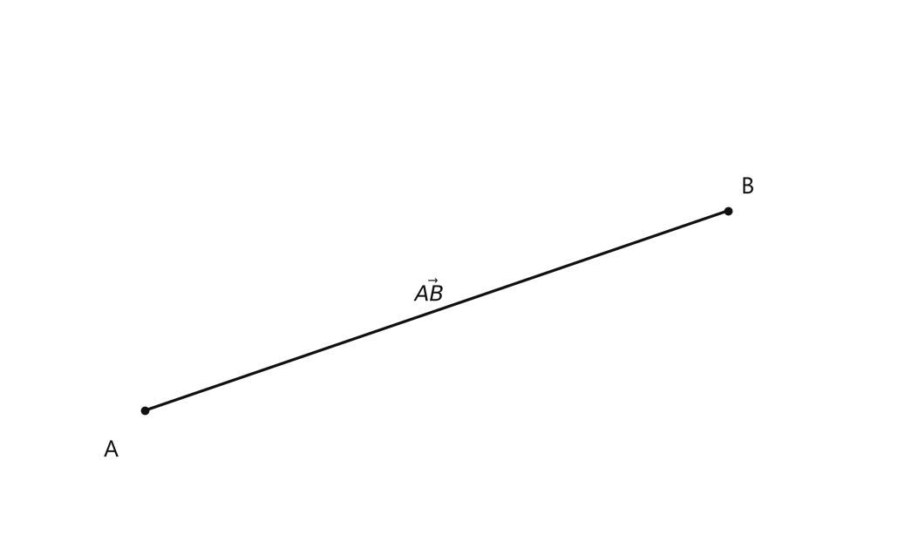
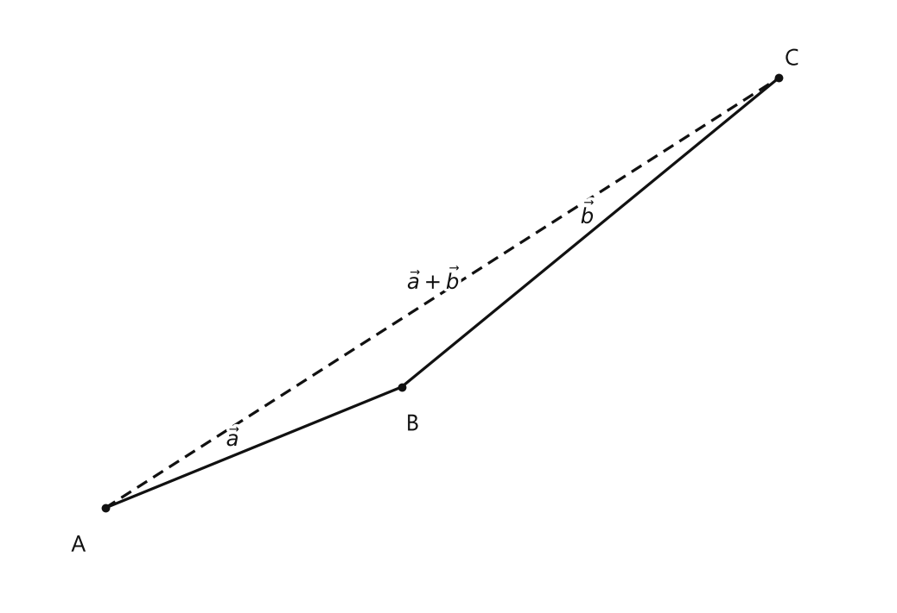
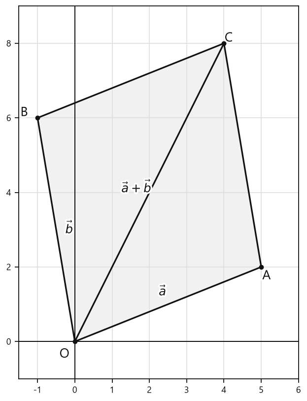

# Занятие 28. Вектор — направленный отрезок

**Раздел:** Глава V. Векторы  
**Параграф учебника:** §28. Вектор — направленный отрезок  
**Страницы:** 174–174

## Цели занятия

После занятия ты умеешь:

- отличать начало и конец вектора;
- записывать вектор с помощью двух точек;
- находить координаты вектора по координатам его начала и конца;
- находить длину вектора;
- складывать и вычитать векторы по координатам;
- применять правило треугольника и правило параллелограмма.

Выбери блок своего уровня:

- **1–2 балла:** узнаю вектор, начало, конец и его длину;
- **3–4 балла:** нахожу координаты вектора;
- **5–6 баллов:** нахожу длину вектора;
- **7–8 баллов:** складываю и вычитаю векторы;
- **9–10 баллов:** применяю несколько правил в одной задаче.

## Теория к занятию

### Вектор — направленный отрезок

#### Простыми словами

Обычный отрезок показывает только расстояние между двумя точками. Вектор показывает сразу две вещи:

- длину;
- направление.

Представь движение: если идти из точки $A$ в точку $B$, получим вектор $\vec{AB}$.

Здесь:

- $A$ — начало вектора;
- $B$ — конец вектора;
- стрелка направлена от $A$ к $B$.

Порядок букв важен. Вектор $\vec{AB}$ направлен от $A$ к $B$, а вектор $\vec{BA}$ — от $B$ к $A$. Они направлены в разные стороны. Буквы здесь работают, а не просто стоят для красоты.

#### Определение / факт

**Вектор — направленный отрезок.**

Вектор можно обозначить двумя заглавными буквами со стрелкой:

$$
\vec{AB}
$$

Также вектор часто обозначают одной строчной буквой со стрелкой:

$$
\vec{AB}=\vec{a}
$$

Это означает, что $\vec{AB}$ и $\vec{a}$ — один и тот же вектор.

#### Длина вектора

Длина вектора — это длина отрезка, который изображает этот вектор.

Длина вектора $\vec{AB}$ обозначается так:

$$
|\vec{AB}|
$$

Вертикальные черты здесь не означают «вектор спрятался». Они показывают, что мы говорим именно о длине, то есть о числе.

#### Правила

- Первая буква в записи $\vec{AB}$ показывает начало вектора.
- Вторая буква показывает конец вектора.
- Стрелка показывает направление.
- Длина вектора не может быть отрицательной.
- Если начало и конец вектора совпадают, его длина равна нулю.

#### Ловушки

- $\vec{AB}$ и $\vec{BA}$ — разные направленные отрезки.
- $\vec{AB}$ — это вектор, а $|\vec{AB}|$ — его длина.
- Нельзя менять местами буквы, если направление важно.
- Стрелка на рисунке обязательна: без неё отрезок потеряет главное свойство — направление.

## Сводка формул «выучить наизусть»

$$
\vec{AB}=\vec{a}
$$

$$
|\vec{AB}|
$$

## Правила, которые нельзя путать

- Вектор $\vec{AB}$ направлен от точки $A$ к точке $B$.
- Вектор $\vec{BA}$ направлен от точки $B$ к точке $A$.
- $\vec{AB}$ — направленный отрезок.
- $|\vec{AB}|$ — длина этого вектора.
- Длина вектора — неотрицательное число.
- Если начало и конец совпадают, длина вектора равна нулю.

## Разбор ключевых заданий

### Р1. Запись вектора и его длины

**Условие.** На рисунке направленный отрезок имеет начало в точке $A$ и конец в точке $B$. Как записать этот вектор и как обозначить его длину?

<!--geo-figure-spec
{
  "needed": true,
  "kind": "plane",
  "caption": "Направленный отрезок $\\vec{AB}$",
  "equal": true,
  "axis": false,
  "xlim": [
    -0.8,
    4.5
  ],
  "ylim": [
    -0.8,
    2.4
  ],
  "points": {
    "A": [
      0,
      0
    ],
    "B": [
      3.5,
      1.2
    ]
  },
  "segments": [
    {
      "points": [
        "A",
        "B"
      ],
      "dashed": false,
      "arrow": true,
      "label": "$\\vec{AB}$",
      "t": 0.5
    }
  ],
  "polygons": [],
  "circles": [],
  "labels": {
    "A": {
      "dx": -0.2,
      "dy": -0.24
    },
    "B": {
      "dx": 0.12,
      "dy": 0.14
    }
  },
  "right_angles": [],
  "angle_marks": [],
  "texts": []
}
-->

*Направленный отрезок \vec{AB}*

**Решение.**

Начало направленного отрезка — точка $A$.

Конец направленного отрезка — точка $B$.

Записываем вектор от начала к концу:

$$
\vec{AB}
$$

Длину этого вектора обозначаем вертикальными чертами:

$$
|\vec{AB}|
$$

Важно не перепутать: $\vec{AB}$ — сам вектор, а $|\vec{AB}|$ — только его длина. Стрелка показывает дорогу, а вертикальные черты считают, сколько эта дорога длится.

**Ответ:** $\vec{AB}$; длина — $|\vec{AB}|$.

### Р8. Смешанное действие с векторами

**Условие.** Даны векторы $\vec{a}(2;4)$, $\vec{b}(-3;1)$ и $\vec{c}(5;-2)$. Найдите $\vec{a}+\vec{b}-\vec{c}$.

**Решение.**

Сначала сложим $\vec{a}$ и $\vec{b}$.

При сложении векторов складываем отдельно первые координаты и отдельно вторые:

$$
\vec{a}+\vec{b}=(2+(-3);4+1)
$$

$$
\vec{a}+\vec{b}=(-1;5)
$$

Теперь из полученного вектора вычтем $\vec{c}$:

$$
(\vec{a}+\vec{b})-\vec{c}=(-1;5)-(5;-2)
$$

Вычитаем первые координаты:

$$
-1-5=-6
$$

Вычитаем вторые координаты:

$$
5-(-2)=5+2=7
$$

Значит,

$$
\vec{a}+\vec{b}-\vec{c}=(-6;7)
$$

Можно проверить результат сразу по координатам:

$$
2+(-3)-5=-6
$$

$$
4+1-(-2)=7
$$

Координаты совпали. Значит, знак минус нигде не сбежал — ответ найден верно.

**Ответ:** $\vec{a}+\vec{b}-\vec{c}=(-6;7)$.

---

### Р9. Применение правила треугольника

**Условие.** Вектор $\vec{a}$ направлен из точки $A$ в точку $B$, а вектор $\vec{b}$ — из точки $B$ в точку $C$. Запишите сумму $\vec{a}+\vec{b}$ через точки $A$ и $C$.

<!--geo-figure-spec
{
  "needed": true,
  "kind": "plane",
  "caption": "Правило треугольника для векторов $\\vec{a}$ и $\\vec{b}$",
  "equal": true,
  "axis": false,
  "xlim": [
    -0.7,
    5.8
  ],
  "ylim": [
    -0.7,
    3.7
  ],
  "points": {
    "A": [
      0,
      0
    ],
    "B": [
      2.2,
      0.9
    ],
    "C": [
      5,
      3.2
    ]
  },
  "segments": [
    {
      "points": [
        "A",
        "B"
      ],
      "dashed": false,
      "label": "$\\vec{a}$",
      "t": 0.45
    },
    {
      "points": [
        "B",
        "C"
      ],
      "dashed": false,
      "label": "$\\vec{b}$",
      "t": 0.52
    },
    {
      "points": [
        "A",
        "C"
      ],
      "dashed": true,
      "label": "$\\vec{a}+\\vec{b}$",
      "t": 0.5
    }
  ],
  "polygons": [],
  "circles": [],
  "labels": {
    "A": {
      "dx": -0.2,
      "dy": -0.28
    },
    "B": {
      "dx": 0.08,
      "dy": -0.28
    },
    "C": {
      "dx": 0.1,
      "dy": 0.14
    }
  },
  "right_angles": [],
  "angle_marks": [],
  "texts": []
}
-->

*Правило треугольника для векторов \vec{a} и \vec{b}*

**Решение.**

Вектор $\vec{a}$ направлен из точки $A$ в точку $B$, поэтому

$$
\vec{a}=\vec{AB}
$$

Вектор $\vec{b}$ направлен из точки $B$ в точку $C$, поэтому

$$
\vec{b}=\vec{BC}
$$

Конец вектора $\vec{a}$ совпадает с началом вектора $\vec{b}$: оба находятся в точке $B$.

Значит, применяем правило треугольника.

Сумма соединяет начало первого вектора с концом второго:

$$
\vec{a}+\vec{b}=\vec{AB}+\vec{BC}
$$

Начало первого вектора — точка $A$, конец второго — точка $C$.

Следовательно,

$$
\vec{a}+\vec{b}=\vec{AC}
$$

Здесь векторы складываются «маршрутом» $A \to B \to C$, а итоговый вектор идёт напрямую: $A \to C$.

**Ответ:** $\vec{a}+\vec{b}=\vec{AC}$.

---

### Р10. Выбор способа сложения по координатам

**Условие.** Векторы $\vec{a}(4;1)$ и $\vec{b}(-2;3)$ имеют общее начало. Найдите координаты диагонали параллелограмма, соответствующей сумме этих векторов.

**Решение.**

Векторы имеют общее начало, поэтому их можно сложить по правилу параллелограмма.

По этому правилу сумма векторов является диагональю параллелограмма, проведённой из общего начала.

Значит, сначала найдём сумму:

$$
\vec{a}+\vec{b}
$$

Складываем первые координаты:

$$
4+(-2)=2
$$

Складываем вторые координаты:

$$
1+3=4
$$

Получаем координаты суммы:

$$
\vec{a}+\vec{b}=(2;4)
$$

Следовательно, координаты нужной диагонали равны $(2;4)$.

Не путай: диагональ здесь не нужно измерять по рисунку — координаты спокойно складываются по местам.

**Ответ:** $(2;4)$.

## Практические задания

Выбери свой уровень и решай только этот блок. В блоке должна закрепиться вся тема параграфа. Ответы не приводятся.

### Уровень 1–2 балла

**С1.** Выберите верное утверждение о векторе $\vec{AB}$.

1) Он имеет только длину. 2) Он имеет направление и длину. 3) Он задаётся только точкой $A$. 4) Он задаётся только точкой $B$. 5) Он не имеет начала.

**С2.** Укажите запись вектора, равного $\vec{a}$, если $\vec{AB}=\vec{a}$.

1) $\vec{BA}$ 2) $\vec{AB}$ 3) $\vec{AA}$ 4) $\vec{BB}$ 5) $|\vec{AB}|$

**С3.** Точки имеют координаты $A(2;1)$ и $B(6;4)$. Найдите координаты вектора $\vec{AB}$.

1) $(8;5)$ 2) $(4;3)$ 3) $(-4;-3)$ 4) $(3;4)$ 5) $(2;1)$

**С4.** Точки имеют координаты $C(-3;5)$ и $D(1;2)$. Найдите координаты вектора $\vec{CD}$.

1) $(-4;3)$ 2) $(4;-3)$ 3) $(-2;7)$ 4) $(2;-7)$ 5) $(3;-4)$

**С5.** Найдите длину вектора $\vec{a}(3;4)$.

1) $1$ 2) $5$ 3) $7$ 4) $12$ 5) $25$

**С6.** Найдите длину вектора $\vec{b}(-5;12)$.

1) $7$ 2) $13$ 3) $17$ 4) $119$ 5) $169$

**С7.** Выполните сложение векторов $\vec{a}(2;-1)$ и $\vec{b}(3;4)$.

1) $(5;3)$ 2) $(-1;-5)$ 3) $(6;-4)$ 4) $(1;5)$ 5) $(5;-3)$

**С8.** Выполните вычитание векторов $\vec{p}(7;2)$ и $\vec{q}(4;-3)$: $\vec{p}-\vec{q}$.

1) $(3;5)$ 2) $(11;-1)$ 3) $(-3;-5)$ 4) $(3;-1)$ 5) $(-3;5)$

**С9.** Даны векторы $\vec{u}(-2;6)$ и $\vec{v}(5;-1)$. Найдите координаты вектора $\vec{u}+\vec{v}$.

**С10.** Даны векторы $\vec{m}(8;-4)$ и $\vec{n}(3;2)$. Найдите координаты вектора $\vec{m}-\vec{n}$.

**С11.** Точки имеют координаты $P(-1;3)$ и $Q(2;7)$. Найдите длину вектора $\vec{PQ}$.

**С12.** Векторы $\vec{a}(4;1)$ и $\vec{b}(-2;3)$ имеют общее начало. Укажите координаты их суммы $\vec{a}+\vec{b}$.

1) $(2;4)$ 2) $(6;4)$ 3) $(2;-2)$ 4) $(-6;2)$ 5) $(4;3)$

**С13.** Точка $A(2; -1)$ является началом, а точка $B(5; 3)$ — концом вектора $\vec{AB}$. Запишите координаты вектора $\vec{AB}$.

**С14.** Даны точки $C(-4; 2)$ и $D(1; -3)$. Выберите координаты вектора $\vec{CD}$:  
1) $(-5; 5)$ 2) $(5; -5)$ 3) $(5; 5)$ 4) $(-5; -5)$ 5) $(1; -3)$

**С15.** Вектор $\vec a=(-6; 8)$. Найдите его длину.

**С16.** Какой из записей обозначен вектор — направленный отрезок с началом в точке $M$ и концом в точке $N$?  
1) $\vec{NM}$ 2) $\vec{MN}$ 3) $|MN|$ 4) $MN$ 5) $\vec M+\vec N$

**С17.** Даны векторы $\vec a=(3; -2)$ и $\vec b=(4; 5)$. Найдите координаты вектора $\vec a+\vec b$.

**С18.** Даны векторы $\vec p=(-7; 4)$ и $\vec q=(2; -6)$. Выберите координаты вектора $\vec p-\vec q$:  
1) $(-5; -2)$ 2) $(-9; 10)$ 3) $(9; -10)$ 4) $(-5; 10)$ 5) $( -9; -2)$

**С19.** Радиус-векторы точек $A$ и $B$ имеют координаты $\vec{OA}=(1; 4)$ и $\vec{OB}=(6; 2)$. Запишите координаты вектора $\vec{AB}$.

**С20.** Вектор $\vec c=(5; 12)$. Найдите $|\vec c|$.

**С21.** Векторы $\vec a$ и $\vec b$ имеют общее начало. Какой отрезок является диагональю параллелограмма, построенного на этих векторах, и представляет вектор $\vec a+\vec b$?  
1) сторона, равная $\vec a$ 2) сторона, равная $\vec b$ 3) диагональ из общего начала 4) диагональ между концами $\vec a$ и $\vec b$ 5) любой отрезок параллелограмма

**С22.** Вектор $\vec a=(-3; 7)$, а вектор $\vec b=(5; -2)$. Выберите координаты вектора $\vec a+\vec b$:  
1) $(-8; 9)$ 2) $(2; 5)$ 3) $(-2; 5)$ 4) $(2; 9)$ 5) $(-15; -14)$

**С23.** Конец вектора $\vec{AB}$ имеет координаты $B(4; -1)$, а начало — $A(-2; 3)$. Найдите координаты вектора $\vec{AB}$.

**С24.** Вектор $\vec d=(9; 12)$. Выберите его длину:  
1) $3$ 2) $12$ 3) $15$ 4) $21$ 5) $144$

**С25.** Какой записью обозначают вектор, направленный от точки $A$ к точке $B$?

1) $\overrightarrow{BA}$ 2) $\overrightarrow{AB}$ 3) $AB$ 4) $\overrightarrow{AA}$ 5) $BA$

**С26.** Укажите верную запись равенства, если $\vec{AB}=\vec a$.

1) $\vec{AB}=\vec b$ 2) $\vec a=\vec{BA}$ 3) $\vec{AB}=\vec a$ 4) $\vec a=\vec 0$ 5) $\vec{AB}=|\vec a|$

**С27.** Точки имеют координаты $A(2;1)$ и $B(6;4)$. Найдите координаты вектора $\vec{AB}$.

**С28.** Точки имеют координаты $C(-3;5)$ и $D(1;2)$. Найдите координаты вектора $\vec{CD}$.

**С29.** Вектор $\vec a(3;4)$. Найдите его длину.

**С30.** Вектор $\vec b(-5;12)$. Найдите его длину.

**С31.** Выберите верную формулу длины вектора $\vec a(a_1;a_2)$.

1) $|\vec a|=a_1+a_2$ 2) $|\vec a|=a_1^2+a_2^2$ 3) $|\vec a|=\sqrt{a_1^2+a_2^2}$ 4) $|\vec a|=a_1-a_2$ 5) $|\vec a|=\sqrt{a_1+a_2}$

**С32.** Даны векторы $\vec a(2;-3)$ и $\vec b(4;1)$. Найдите координаты вектора $\vec a+\vec b$.

**С33.** Даны векторы $\vec a(-1;5)$ и $\vec b(3;2)$. Найдите координаты вектора $\vec a-\vec b$.

**С34.** Выберите верную формулу координат вектора $\vec{AB}$, если $A(x_1;y_1)$ и $B(x_2;y_2)$.

1) $\vec{AB}(x_1-x_2;y_1-y_2)$ 2) $\vec{AB}(x_1+x_2;y_1+y_2)$ 3) $\vec{AB}(x_2-x_1;y_2-y_1)$ 4) $\vec{AB}(x_2+x_1;y_2+y_1)$ 5) $\vec{AB}(x_1y_1;x_2y_2)$

**С35.** Векторы $\vec a$ и $\vec b$ имеют общее начало. Какой отрезок является диагональю параллелограмма, построенного на этих векторах, если он обозначает $\vec a+\vec b$?

1) отрезок, соединяющий начала векторов 2) отрезок, соединяющий конец $\vec a$ с концом $\vec b$ 3) диагональ, соединяющая общее начало с противоположной вершиной 4) любой боковой отрезок 5) отрезок, соединяющий начало $\vec a$ с концом $\vec b$

**С36.** Векторы $\vec a$ и $\vec b$ соединены так, что конец вектора $\vec a$ совпадает с началом вектора $\vec b$. Какой вектор соединяет начало $\vec a$ с концом $\vec b$?

1) $\vec a-\vec b$ 2) $\vec b-\vec a$ 3) $\vec a+\vec b$ 4) $\vec a\cdot\vec b$ 5) $|\vec a|+|\vec b|$

### Уровень 3–4 балла

**С1.** Запишите вектор $\vec{AB}$, если его начало находится в точке $A(-2; 3)$, а конец — в точке $B(4; 1)$.

**С2.** Найдите координаты вектора $\vec{CD}$, если $C(5; -2)$ и $D(1; 4)$.

**С3.** Найдите длину вектора $\vec{a}(6; 8)$.

**С4.** Найдите длину вектора $\vec{b}(-5; 12)$.

**С5.** Даны векторы $\vec{a}(3; -1)$ и $\vec{b}(2; 5)$. Найдите координаты вектора $\vec{a}+\vec{b}$.

**С6.** Даны векторы $\vec{p}(-4; 7)$ и $\vec{q}(6; -3)$. Найдите координаты вектора $\vec{p}-\vec{q}$.

**С7.** Даны векторы $\vec{m}(1; 4)$ и $\vec{n}(-3; 2)$. Найдите координаты вектора $\vec{m}+\vec{n}$.

**С8.** Вектор $\vec{AB}$ имеет координаты $(7; -5)$. Запишите координаты вектора $\vec{BA}$.

**С9.** Точка $A(-3; 2)$ является началом вектора $\vec{AB}(5; 4)$. Найдите координаты точки $B$.

**С10.** Точка $M(6; -1)$ является концом вектора $\vec{MN}(-2; 7)$. Найдите координаты точки $N$.

**С11.** Векторы $\vec{a}(4; 3)$ и $\vec{b}(-4; 3)$ имеют общее начало. Найдите координаты их суммы и длину полученного вектора.

**С12.** Векторы $\vec{a}(2; -6)$ и $\vec{b}(5; 1)$ соединены так, что конец вектора $\vec{a}$ совпадает с началом вектора $\vec{b}$. Найдите координаты вектора, соединяющего начало $\vec{a}$ с концом $\vec{b}$, и его длину.

**С13.** Запишите координаты вектора $\vec{AB}$, если $A(2; -1)$ и $B(7; 3)$.

**С14.** Найдите длину вектора $\vec a(6; 8)$.

**С15.** Даны точки $C(-4; 5)$ и $D(1; -3)$. Запишите координаты вектора $\vec{CD}$.

**С16.** Найдите координаты суммы векторов $\vec a(3; -2)$ и $\vec b(-5; 7)$.

**С17.** Найдите координаты разности векторов $\vec m(8; 4)$ и $\vec n(3; -6)$.

**С18.** Даны радиус-векторы $\vec{OA}(4; -2)$ и $\vec{OB}(-3; 5)$. Запишите координаты вектора $\vec{AB}$.

**С19.** Найдите длину вектора $\vec b(-9; 12)$.

**С20.** Вектор $\vec{AB}$ имеет координаты $(5; -4)$, а точка $A$ имеет координаты $(-2; 3)$. Найдите координаты точки $B$.

**С21.** Точка $P(6; -1)$ является концом вектора $\vec{QP}(-4; 7)$. Найдите координаты точки $Q$.

**С22.** Найдите координаты вектора $\vec c$, если $\vec c=\vec a+\vec b$, $\vec a(-2; 6)$ и $\vec b(7; -3)$.

**С23.** Даны векторы $\vec u(4; 3)$ и $\vec v(-1; 5)$. Найдите длину вектора $\vec u+\vec v$.

**С24.** Даны точки $A(-1; 2)$, $B(3; 5)$ и $C(6; 1)$. Найдите координаты вектора $\vec{AB}+\vec{BC}$.

**С25.** Запишите координаты вектора $\vec{AB}$, если $A(2; -1)$ и $B(7; 3)$.

**С26.** Найдите координаты точки $B$, если $A(-3; 4)$ и $\vec{AB}(5; -6)$.

**С27.** Найдите длину вектора $\vec{a}(6; 8)$.

**С28.** Найдите длину вектора $\vec{AB}$, если $A(-1; 2)$ и $B(3; 5)$.

**С29.** Даны векторы $\vec{a}(4; -2)$ и $\vec{b}(-1; 6)$. Найдите координаты вектора $\vec{a}+\vec{b}$.

**С30.** Даны векторы $\vec{a}(-3; 5)$ и $\vec{b}(7; -2)$. Найдите координаты вектора $\vec{a}-\vec{b}$.

**С31.** Векторы $\vec{a}$ и $\vec{b}$ имеют общее начало. Вектор $\vec{c}$ является диагональю параллелограмма, построенного на этих векторах, и направлен от их общего начала к противоположной вершине. Запишите формулу, связывающую $\vec{a}$, $\vec{b}$ и $\vec{c}$.

**С32.** Вектор $\vec{a}$ направлен от точки $A$ к точке $B$, а вектор $\vec{b}$ — от точки $B$ к точке $C$. Какой вектор соединяет точку $A$ с точкой $C$? Запишите его через $\vec{a}$ и $\vec{b}$.

**С33.** Даны радиус-векторы $\vec{OA}(2; 5)$ и $\vec{OB}(-4; 1)$. Найдите координаты вектора $\vec{AB}$.

**С34.** Даны точки $A(1; -2)$ и $B(5; 1)$. Представьте $\vec{AB}$ в виде $\vec{a}$ и найдите $|\vec{a}|$.

**С35.** Даны векторы $\vec{a}(3; 4)$ и $\vec{b}(-3; 4)$. Найдите координаты векторов $\vec{a}+\vec{b}$ и $\vec{a}-\vec{b}$.

**С36.** Векторы $\vec{a}(2; -5)$ и $\vec{b}(4; 1)$ соединены по правилу треугольника: начало $\vec{b}$ совпадает с концом $\vec{a}$. Найдите координаты вектора $\vec{c}$, соединяющего начало $\vec{a}$ с концом $\vec{b}$.

### Уровень 5–6 баллов

**С1.** Даны точки $A(2; -1)$ и $B(7; 3)$. Найдите координаты вектора $\vec{AB}$.

**С2.** Даны точки $C(-4; 5)$ и $D(1; -2)$. Найдите координаты вектора $\vec{CD}$.

**С3.** Найдите длину вектора $\vec a(6; 8)$.

**С4.** Найдите длину вектора $\vec b(-5; 12)$.

**С5.** Даны точки $A(-3; 4)$ и $B(5; -2)$. Найдите длину вектора $\vec{AB}$.

**С6.** Даны точки $M(1; 6)$ и $N(-7; 0)$. Найдите длину вектора $\vec{MN}$.

**С7.** Выполните сложение векторов $\vec a(4; -3)$ и $\vec b(-6; 5)$.

**С8.** Выполните вычитание вектора $\vec b(3; -7)$ из вектора $\vec a(-2; 4)$.

**С9.** Даны векторы $\vec p(5; 1)$ и $\vec q(-2; 3)$. Найдите координаты вектора $\vec p+\vec q$ и его длину.

**С10.** Даны векторы $\vec u(-4; 6)$ и $\vec v(1; -2)$. Найдите координаты вектора $\vec u-\vec v$ и его длину.

**С11.** Даны точки $A(2; 3)$, $B(6; 5)$ и $C(1; -1)$. Найдите координаты вектора $\vec{AB}+\vec{BC}$ и сравните полученный вектор с вектором $\vec{AC}$.

**С12.** Даны точки $O(0; 0)$ и $A(-6; 8)$. Вектор $\vec{OA}$ является радиус-вектором точки $A$. Найдите координаты и длину этого вектора.

**С13.** Даны точки $A(-2;3)$ и $B(4;-1)$. Найдите координаты вектора $\vec{AB}$.

**С14.** Даны точки $C(5;-2)$ и $D(-1;6)$. Найдите координаты вектора $\vec{CD}$.

**С15.** Вектор $\vec a$ имеет координаты $(6;8)$. Найдите его длину.

**С16.** Вектор $\vec b$ имеет координаты $(-5;12)$. Найдите его длину.

**С17.** Найдите координаты суммы векторов $\vec a=(3;-7)$ и $\vec b=(-5;4)$.

**С18.** Найдите координаты разности векторов $\vec c=(8;1)$ и $\vec d=(3;-6)$.

**С19.** Даны точки $A(1;-4)$, $B(6;2)$ и $C(-2;3)$. Найдите координаты вектора $\vec{AB}+\vec{AC}$.

**С20.** Даны точки $M(-3;5)$ и $N(4;-1)$. Найдите длину вектора $\vec{MN}$.

**С21.** Векторы $\vec a=(x;5)$ и $\vec b=(2;-3)$ имеют сумму $\vec a+\vec b=(9;2)$. Найдите $x$.

**С22.** Векторы $\vec p=(-4;y)$ и $\vec q=(7;3)$ имеют разность $\vec p-\vec q=(-11;5)$. Найдите $y$.

**С23.** Даны точки $A(-1;2)$ и $B(3;5)$. Вектор $\vec{AB}$ представлен как сумма двух векторов $\vec u=(2;1)$ и $\vec v$. Найдите координаты вектора $\vec v$.

**С24.** Даны векторы $\vec a=(4;-3)$ и $\vec b=(-1;7)$. Найдите длину вектора $\vec a+\vec b$.

**С25.** Даны точки $A(-2; 3)$ и $B(4; -1)$. Найдите координаты вектора $\vec{AB}$.

**С26.** Вектор $\vec a=(-6; 8)$. Найдите его длину $|\vec a|$.

**С27.** Даны векторы $\vec a=(3; -5)$ и $\vec b=(-7; 2)$. Найдите координаты вектора $\vec a+\vec b$.

**С28.** Даны векторы $\vec a=(-4; 6)$ и $\vec b=(5; -3)$. Найдите координаты вектора $\vec a-\vec b$.

**С29.** Точки $A(1; -2)$, $B(6; 2)$ и $C(3; 5)$ заданы на координатной плоскости. Найдите координаты вектора $\vec{AB}+\vec{BC}$.

**С30.** Даны векторы $\vec a=(x; 4)$ и $\vec b=(3; -2)$. Известно, что $\vec a+\vec b=(10; 2)$. Найдите значение $x$.

### Уровень 7–8 баллов

**С1.** Даны точки $A(-3; 4)$ и $B(5; -2)$. Найдите координаты вектора $\vec{AB}$ и его длину.

**С2.** Вектор $\vec a(-6; 8)$ задан своими координатами. Найдите длину вектора $\vec a$. Обоснуйте вычисление по формуле длины вектора.

**С3.** Даны точки $M(2; -5)$ и $N(-4; 7)$. Найдите координаты векторов $\vec{MN}$ и $\vec{NM}$. Сравните их длины и направления.

**С4.** Даны векторы $\vec a(3; -7)$ и $\vec b(-5; 4)$. Найдите координаты векторов $\vec a+\vec b$ и $\vec a-\vec b$, а также длину вектора $\vec a+\vec b$.

**С5.** Даны точки $A(-2; 1)$, $B(4; 5)$ и $C(7; -1)$. Найдите координаты векторов $\vec{AB}$ и $\vec{BC}$. Используя правило треугольника, определите координаты вектора, соединяющего точку $A$ с точкой $C$, и проверьте результат непосредственно по координатам точек.

**С6.** Векторы $\vec a(5; 2)$ и $\vec b(-1; 6)$ имеют общее начало. Постройте мысленно параллелограмм на этих векторах и найдите координаты его диагонали, являющейся вектором $\vec a+\vec b$. Найдите длину этой диагонали.

<!--geo-figure-spec
{
  "needed": true,
  "kind": "plane",
  "caption": "Параллелограмм, построенный на векторах $\\vec a$ и $\\vec b$",
  "equal": true,
  "axis": true,
  "grid": true,
  "xlim": [
    -1.5,
    6
  ],
  "ylim": [
    -1,
    9
  ],
  "points": {
    "O": [
      0,
      0
    ],
    "A": [
      5,
      2
    ],
    "B": [
      -1,
      6
    ],
    "C": [
      4,
      8
    ]
  },
  "segments": [
    {
      "points": [
        "O",
        "A"
      ],
      "label": "",
      "t": 0.5
    },
    {
      "points": [
        "O",
        "B"
      ],
      "label": "",
      "t": 0.5
    },
    [
      "A",
      "C"
    ],
    [
      "B",
      "C"
    ],
    {
      "points": [
        "O",
        "C"
      ],
      "label": "",
      "t": 0.5
    }
  ],
  "polygons": [
    {
      "vertices": [
        "O",
        "A",
        "C",
        "B"
      ],
      "fill": 0.06
    }
  ],
  "circles": [],
  "labels": {
    "O": {
      "dx": -0.28,
      "dy": -0.34
    },
    "A": {
      "dx": 0.14,
      "dy": -0.24
    },
    "B": {
      "dx": -0.36,
      "dy": 0.14
    },
    "C": {
      "dx": 0.13,
      "dy": 0.14
    }
  },
  "right_angles": [],
  "angle_marks": [],
  "texts": [
    {
      "xy": [
        2.35,
        1.35
      ],
      "text": "$\\vec a$"
    },
    {
      "xy": [
        -0.15,
        3.05
      ],
      "text": "$\\vec b$"
    },
    {
      "xy": [
        1.65,
        4.15
      ],
      "text": "$\\vec a+\\vec b$"
    }
  ]
}
-->

*Параллелограмм, построенный на векторах \vec a и \vec b*

**С7.** Даны точки $P(-1; 3)$ и $Q(6; -5)$. Найдите координаты точки $R$, если $\vec{QR}=\vec{PQ}$. Затем найдите координаты вектора $\vec{PR}$ и объясните, как связаны $\vec{PR}$ и $\vec{PQ}$.

**С8.** Даны векторы $\vec u(4; -3)$ и $\vec v(-2; 5)$. Найдите координаты вектора $\vec w$, если $\vec w=\vec u-\vec v$. Проверьте, что сумма $\vec w+\vec v$ совпадает с вектором $\vec u$.

**С9.** Даны точки $A(1; -2)$, $B(7; 1)$ и $C(3; 6)$. Найдите координаты вектора $\vec{AB}+\vec{AC}$ и его длину. Для вычисления используйте координаты векторов, затем проверьте длину полученного вектора.

**С10.** Даны векторы $\vec a(-4; 3)$ и $\vec b(2; -6)$. Найдите координаты и длины векторов $\vec a+\vec b$ и $\vec a-\vec b$. Определите, какой из двух полученных векторов длиннее, и обоснуйте ответ вычислениями.

**С11.** Точки $A(-5; 2)$ и $B(1; 10)$ являются концами вектора $\vec{AB}$. Найдите координаты точки $C$, если $\vec{BC}=\vec{AB}$. Затем найдите координаты вектора $\vec{AC}$ и его длину. Проверьте результат, используя координаты точек $A$ и $C$.

**С12.** Даны точки $O(0; 0)$, $A(6; 2)$ и $B(1; 7)$. Векторы $\vec{OA}$ и $\vec{OB}$ имеют общее начало. Найдите координаты и длину диагонали параллелограмма, построенного на этих векторах и выходящей из точки $O$. Найдите координаты второй диагонали параллелограмма, если её направление от вершины $B$ к вершине $A$ задаётся вектором $\vec{BA}$.

**С13.** Даны точки $A(-3;2)$ и $B(4;-2)$. Найдите координаты вектора $\vec{AB}$ и его длину.

**С14.** Даны векторы $\vec a(5;-3)$ и $\vec b(-2;7)$. Найдите координаты векторов $\vec a+\vec b$ и $\vec a-\vec b$.

**С15.** Векторы $\vec a$ и $\vec b$ имеют координаты $\vec a(-4;3)$ и $\vec b(1;-5)$. Найдите координаты вектора $\vec c$, если $\vec c+\vec a=\vec b$.

**С16.** Даны точки $A(-2;1)$, $B(3;5)$ и $C(6;-1)$. Найдите координаты точки $D$, если $\vec{AB}=\vec{CD}$.

**С17.** Даны точки $A(1;-4)$, $B(7;2)$ и $C(-3;5)$. Постройте точку $D$, для которой $\vec{AB}=\vec{CD}$, и запишите координаты точки $D$. Обоснуйте построение с помощью координат векторов.

**С18.** Даны точки $A(-5;3)$ и $B(1;-5)$. Найдите координаты точки $C$ на оси абсцисс, если длина вектора $\vec{AC}$ равна длине вектора $\vec{AB}$.

**С19.** Даны векторы $\vec a(3;4)$ и $\vec b(-6;8)$. Определите, равны ли длины этих векторов. Если длины равны, укажите, равны ли сами векторы, и обоснуйте ответ.

**С20.** Даны точки $A(-1;2)$, $B(5;4)$, $C(3;-3)$ и $D(-3;-5)$. Докажите, что $\vec{AB}=\vec{DC}$, и сделайте вывод о виде четырёхугольника $ABCD$.

**С21.** Векторы $\vec a(2;-1)$ и $\vec b(4;3)$ имеют общее начало. Найдите координаты их суммы, а также длину вектора $\vec a+\vec b$. Опишите построение суммы по правилу параллелограмма.

**С22.** Даны точки $A(2;-3)$, $B(-4;1)$ и $C(5;2)$. Найдите координаты точки $D$, если $\vec{AD}=\vec{AB}+\vec{AC}$. Объясните, как вектор $\vec{AD}$ связан с диагональю параллелограмма, построенного на векторах $\vec{AB}$ и $\vec{AC}$.

**С23.** Даны векторы $\vec a(-3;2)$ и $\vec b(5;-4)$. Найдите такой вектор $\vec x$, чтобы выполнялось равенство $\vec a+\vec x=\vec b-\vec a$. Затем проверьте полученный результат сложением векторов.

**С24.** Даны точки $A(-2;4)$, $B(3;-1)$ и $C(6;2)$. Найдите координаты вектора $\vec{AB}+\vec{BC}$ двумя способами: по координатам и по правилу треугольника. Сравните полученный вектор с $\vec{AC}$ и обоснуйте результат.

### Уровень 9–10 баллов

**С1.** Даны точки $A(-4; 3)$ и $B(5; -2)$. Найдите координаты вектора $\vec{AB}$ и его длину.

**С2.** Вектор $\vec{a}(-6; 8)$ представлен направленным отрезком $\overrightarrow{PQ}$, причём $P(7; -5)$. Найдите координаты точки $Q$ и длину отрезка $PQ$.

**С3.** Даны точки $A(-2; 4)$, $B(3; -1)$ и $C(6; 5)$. Найдите координаты точки $D$, если $\vec{CD}=\vec{AB}$.

**С4.** Даны векторы $\vec{a}(4; -7)$ и $\vec{b}(-9; 2)$. Найдите координаты и длину вектора $\vec{a}-\vec{b}$.

**С5.** Векторы $\vec{a}(m; 6)$ и $\vec{b}(-4; n)$ удовлетворяют равенству $\vec{a}+\vec{b}=(3; -1)$. Найдите $m$ и $n$, а также длину вектора $\vec{a}$.

**С6.** Даны точки $A(-3; 2)$, $B(4; 6)$ и $C(8; -1)$. Найдите координаты вектора $\vec{AD}$, если $\vec{AD}=\vec{AB}+\vec{BC}$. Затем найдите координаты точки $D$.

**С7.** Даны точки $A(1; -4)$, $B(6; 2)$ и $C(-2; 5)$. Найдите координаты точки $D$, для которой выполняется равенство $\vec{AD}=\vec{AB}-\vec{AC}$.

**С8.** Векторы $\vec{a}(p; -3)$ и $\vec{b}(4; q)$ имеют равные длины, причём $\vec{a}+\vec{b}=(9; 5)$. Найдите $p$ и $q$.

**С9.** Даны точки $A(-5; 1)$, $B(2; 7)$, $C(4; -3)$ и $D(-3; -9)$. Установите, равны ли векторы $\vec{AB}$ и $\vec{DC}$. Ответ обоснуйте вычислением их координат.

**С10.** Векторы $\vec{a}$ и $\vec{b}$ имеют координаты $\vec{a}(3; 4)$ и $\vec{b}(-4; 3)$. Найдите координаты векторов $\vec{a}+\vec{b}$ и $\vec{a}-\vec{b}$, сравните их длины и сделайте вывод о полученном результате.

**С11.** Точки $A(-1; 3)$ и $B(5; -5)$ являются концами вектора $\vec{AB}$. Найдите координаты точки $C$, если $\vec{AC}$ в два раза длиннее $\vec{AB}$ и направлен противоположно вектору $\vec{AB}$.

**С12.** Даны точки $A(-4; -2)$, $B(3; 4)$ и $C(6; -5)$. Постройте вектор $\vec{AD}$ по правилу параллелограмма, если $\vec{AB}$ и $\vec{AC}$ имеют общее начало в точке $A$ и $\vec{AD}=\vec{AB}+\vec{AC}$. Найдите координаты точки $D$ и длину вектора $\vec{AD}$.

**С13.** Даны точки $A(-4; 3)$, $B(2; -5)$ и $C(7; 1)$. Найдите координаты точки $D$, если $\vec{AB}=\vec{CD}$, а затем вычислите длину вектора $\vec{AD}$.

**С14.** Векторы $\vec a=(x-2; 3)$ и $\vec b=(4; y+1)$ удовлетворяют равенствам $|\vec a|=5$ и $\vec a+\vec b=(7; 1)$. Найдите все возможные пары $(x; y)$.

**С15.** Точки $A(-2; 4)$ и $B(6; -2)$ являются концами вектора $\vec{AB}$. Представьте вектор $\vec{AB}$ в виде разности двух векторов $\vec{u}-\vec{v}$, где $\vec{u}=(5; -3)$, и найдите координаты вектора $\vec v$. Проверьте равенство по координатам.

**С16.** Даны векторы $\vec a=(3; -4)$ и $\vec b=(-6; 8)$. Установите, существует ли число $k$, для которого $\vec b=k\vec a$. Если существует, найдите $k$ и выразите через $\vec a$ вектор $\vec a+\vec b$.

**С17.** В треугольнике $ABC$ заданы точки $A(-3; 1)$, $B(4; 5)$ и $C(2; -4)$. Найдите координаты вектора $\vec{AB}+\vec{BC}$ двумя способами: используя координаты векторов и используя равенство с вектором $\vec{AC}$. Сравните длины полученных векторов.

**С18.** Даны векторы $\vec p=(m; 6)$ и $\vec q=(4; n)$. Известно, что $\vec p+\vec q=(10; 2)$, а длина вектора $\vec p-\vec q$ равна $10$. Найдите координаты векторов $\vec p$ и $\vec q$.

## Чек-лист «ученик понял тему»

- Могу повторить определения и формулы параграфа своими словами и по учебнику.
- Решаю типовые задания своего уровня без подсказки.
- Вижу типичную ошибку и могу её объяснить.
