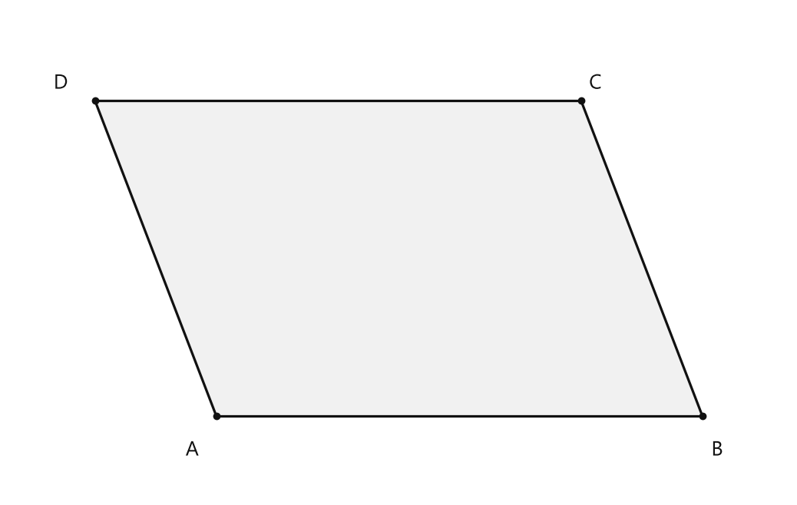
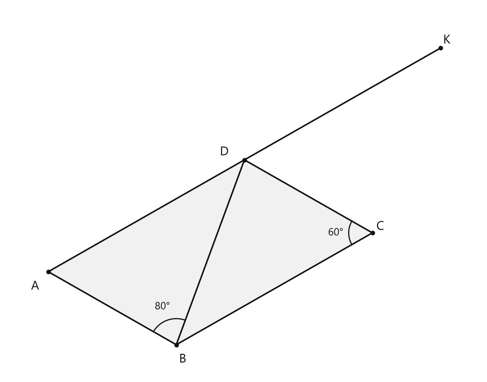
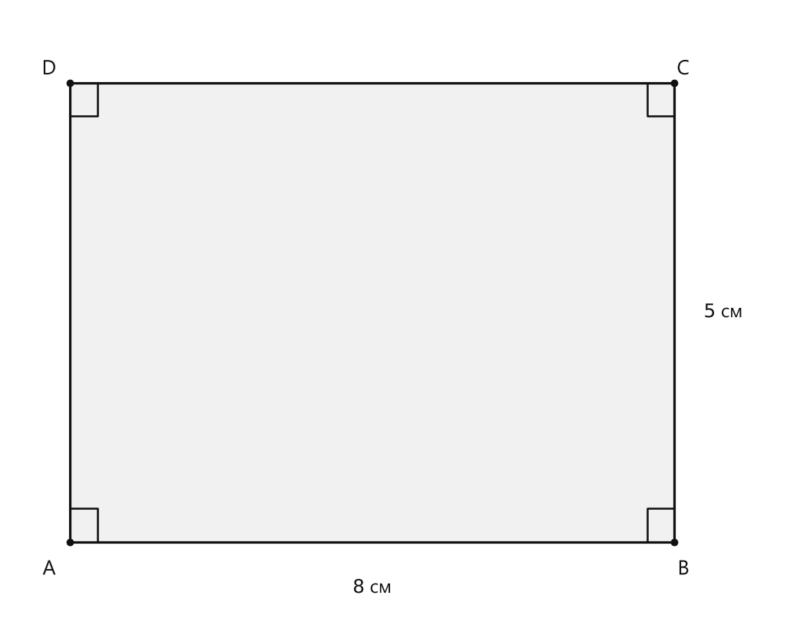
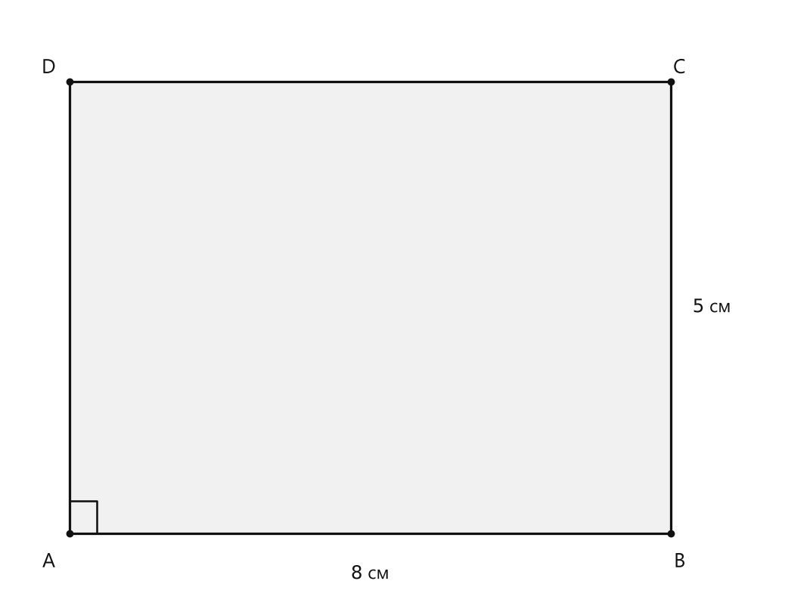
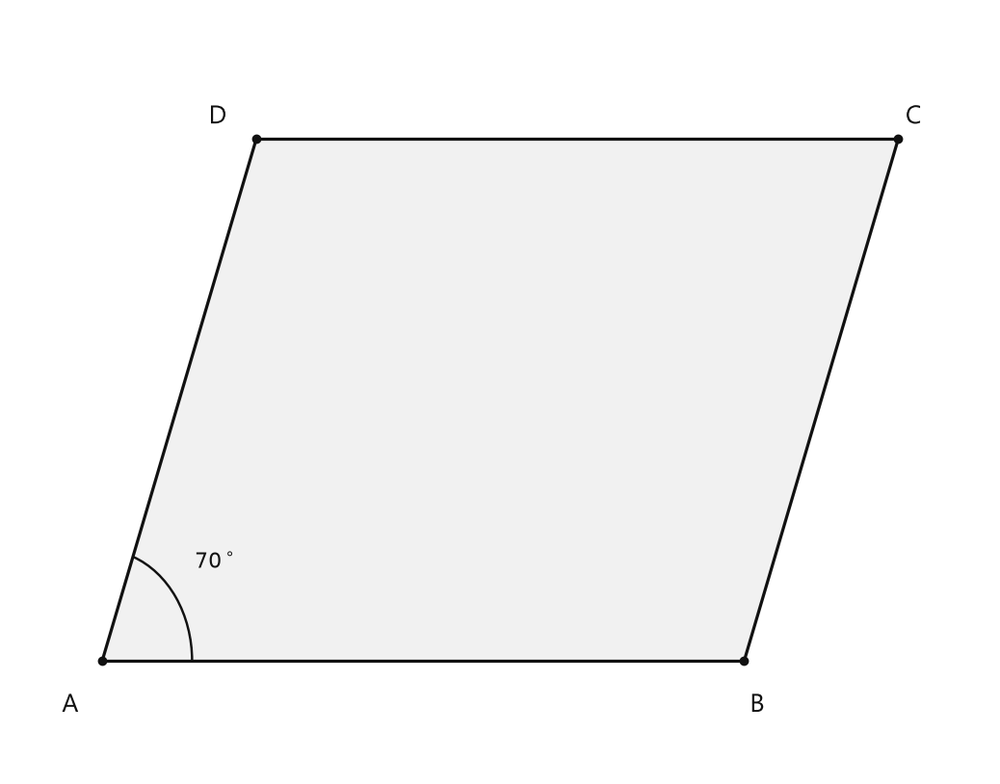
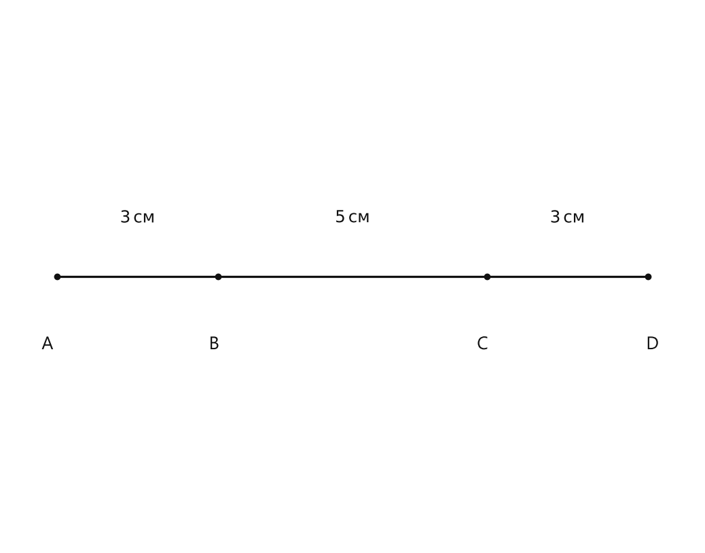
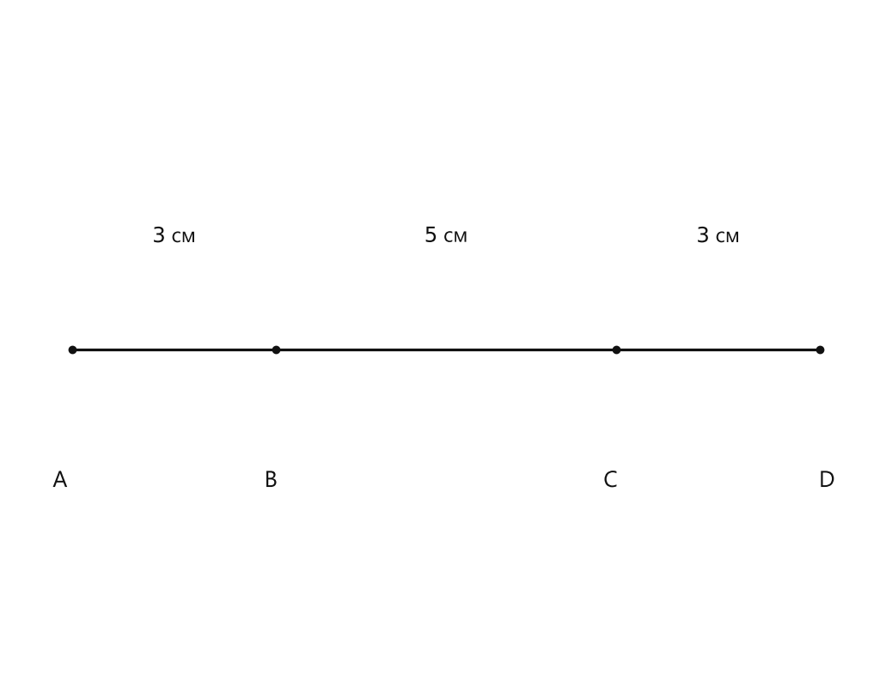
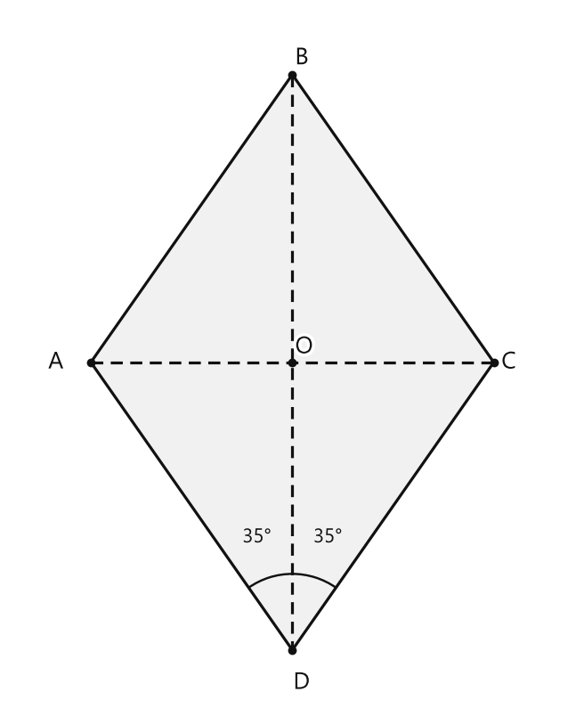
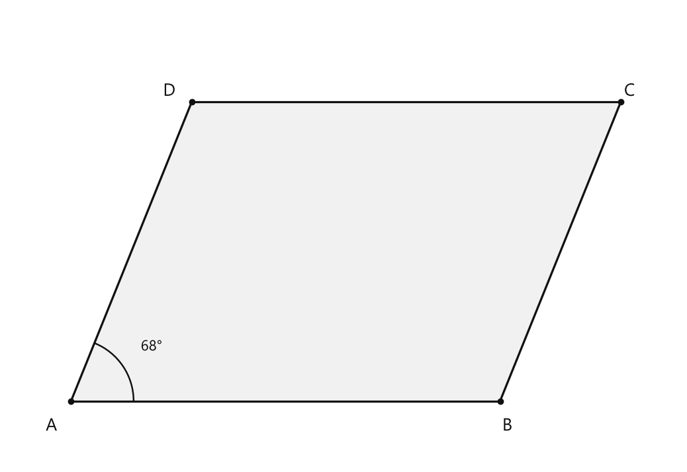

# Занятие 29. Вектор. Виды векторов

**Раздел:** Глава V. Векторы  
**Параграф учебника:** §21. Вектор. Виды векторов  
**Страницы:** 175–178

## Цели занятия

К концу занятия ученик умеет:

- распознавать вектор, его начало и конец;
- находить длину вектора и записывать её с помощью модуля;
- различать нулевые, коллинеарные, сонаправленные и противоположно направленные векторы;
- определять равные и противоположные векторы;
- находить угол между векторами;
- доказывать равенство векторов в параллелограмме.

Выбери блок своего уровня:

- **1–2 балла:** определения вектора и его длины;
- **3–4 балла:** виды векторов и обозначения;
- **5–6 баллов:** углы между векторами;
- **7–8 баллов:** задачи на равенство и противоположность векторов;
- **9–10 баллов:** полный разбор задачи с параллелограммом.

## Теория к занятию

### 1. Что такое вектор

#### Простыми словами

Вектор — это отрезок со стрелкой. У обычного отрезка важна длина, а у вектора важны сразу две вещи:

- длина;
- направление.

Например, $\vec{AB}$ начинается в точке $A$ и заканчивается в точке $B$. Первая буква — начало, вторая — конец. Если поменять буквы местами, получится другой вектор: $\vec{AB}$ и $\vec{BA}$ направлены в противоположные стороны.

#### Определение

**Вектором называется направленный отрезок, т. е. отрезок, один конец которого принимается за начало, а другой — за конец вектора.**

Вектор обозначается двумя большими латинскими буквами (первой записывается начало, а второй — конец вектора) либо одной малой латинской буквой, над которыми ставится стрелка: $\vec{AB}$ или $\vec{a}$, $\vec{NM}$ или $\vec{m}$.

#### Формулы и обозначения

Длина вектора обозначается так:

$$
|\vec{AB}|,\qquad |\vec{a}|.
$$

Здесь:

- $\vec{AB}$ — вектор из точки $A$ в точку $B$;
- $|\vec{AB}|$ — длина, или модуль, этого вектора;
- $\vec{a}$ — обозначение вектора одной малой буквой.

#### Правила

- Первая буква обозначает начало вектора.
- Вторая буква обозначает конец вектора.
- $\vec{AB}$ и $\vec{BA}$ — разные векторы.
- У векторов $\vec{AB}$ и $\vec{BA}$ одинаковая длина, но противоположные направления.

#### Ловушки

- $\vec{AB}$ нельзя читать просто как «отрезок $AB$»: у вектора есть направление.
- $|\vec{AB}|$ — это число, а $\vec{AB}$ — направленный отрезок.
- Длина вектора не бывает отрицательной.

---

### 2. Нулевой вектор

#### Простыми словами

Нулевой вектор начинается и заканчивается в одной и той же точке. Его длина равна нулю, поэтому направления у него нет: стрелке просто некуда «идти».

#### Определение

**Нулевым вектором (нуль-вектором) называется вектор, начало и конец которого совпадают.**

Нулевой вектор обозначается символом $\vec{0}$ или $\vec{AA}$, $\vec{BB}$ и т. д.

#### Формулы и обозначения

$$
|\vec{0}|=0.
$$

Также:

$$
\vec{AA}=\vec{0}.
$$

#### Свойства

* Длина нулевого вектора считается равной нулю, с ним не связывают никакого направления.
* Нулевой вектор перпендикулярен и коллинеарен любому вектору.

#### Правила

- Если начало и конец вектора совпадают, это нулевой вектор.
- Нулевой вектор можно обозначить $\vec{0}$ или вектором вида $\vec{AA}$.
- У нулевого вектора нет направления.

#### Ловушки

- $\vec{AA}$ — это нулевой вектор, а не «ничего».
- Нулевой вектор нельзя считать сонаправленным или противоположно направленным обычному вектору: у него нет направления.

---

### 3. Коллинеарные, сонаправленные и противоположно направленные векторы

#### Простыми словами

Представь несколько стрелок на одной дороге или на параллельных дорогах.

- Если стрелки лежат на одной прямой или на параллельных прямых, они коллинеарны.
- Если стрелки направлены в одну сторону, они сонаправлены.
- Если стрелки направлены в разные стороны, они противоположно направлены.

Длины стрелок при этом могут быть разными. Одна стрелка может быть короткой, другая — длинной, но это не мешает им быть сонаправленными.

#### Определения

**Коллинеарными векторами называются векторы, которые лежат на параллельных прямых или на одной прямой.**

**Коллинеарные векторы, которые одинаково направлены, называются сонаправленными.**

**Коллинеарные векторы, направленные в противоположные стороны, — противоположно направленными векторами.**

#### Обозначения

Если векторы $\vec{a}$ и $\vec{b}$ коллинеарны, то пишут:

$$
\vec{a}\parallel\vec{b}.
$$

Сонаправленные векторы:

$$
\vec{a}\uparrow\uparrow\vec{c}.
$$

Противоположно направленные векторы:

$$
\vec{a}\uparrow\downarrow\vec{b}.
$$

#### Правила

Чтобы определить вид векторов:

1. Проверь, лежат ли они на одной прямой или на параллельных прямых.
2. Если нет, векторы не являются коллинеарными.
3. Если да, сравни направления стрелок.
4. Одинаковое направление — векторы сонаправленные.
5. Разное направление — векторы противоположно направленные.

#### Ловушки

- Коллинеарные векторы могут иметь разные длины.
- Сонаправленные векторы не обязаны быть равными.
- Противоположно направленные векторы не обязаны быть противоположными: их длины могут различаться.

---

### 4. Равные и противоположные векторы

#### Простыми словами

Равные векторы должны совпадать сразу по двум признакам:

1. иметь одинаковую длину;
2. иметь одинаковое направление.

Если длины одинаковы, но направления противоположны, векторы называются противоположными.

#### Определения

**Равными векторами называются два вектора, которые равны по длине и совпадают по направлению.**

**Противоположными векторами называются два вектора, которые равны по длине, но противоположны по направлению.**

#### Обозначения

Вектор, противоположный вектору $\vec{a}$, обозначают $-\vec{a}$.

Например:

$$
\vec{BA}=-\vec{AB}.
$$

Если векторы равны:

$$
\vec{a}=\vec{b}.
$$

Если $\vec{c}$ противоположен $\vec{a}$:

$$
\vec{c}=-\vec{a}.
$$

#### Правила

Для доказательства равенства векторов нужно установить:

- равенство их длин;
- совпадение направлений.

Для доказательства противоположности нужно установить:

- равенство длин;
- противоположность направлений.

#### Ловушки

- «Равные по длине» не означает «равные».
- «Противоположно направленные» не означает «противоположные».
- У противоположных векторов длины обязательно одинаковы.

---

### 5. Отложенный от точки вектор

#### Простыми словами

Вектор можно перенести в другую точку параллельно самому себе. При этом его длина и направление сохраняются.

Получается такой же вектор: он равен исходному, хотя находится уже в другом месте. Это как перенести стрелку на другую дорожку, не поворачивая её и не растягивая.

#### Свойство

* От любой точки можно отложить вектор, равный данному, и притом только один.

#### Алгоритм откладывания равного вектора

1. Из выбранной точки проведи прямую, параллельную направлению данного вектора.
2. Отложи на этой прямой отрезок той же длины.
3. Поставь стрелку в том же направлении.
4. Полученный вектор будет равен данному.

#### Ловушки

- Нельзя менять направление.
- Нельзя менять длину.
- Параллельный перенос не превращает вектор в противоположный.

---

### 6. Угол между векторами

#### Простыми словами

Чтобы найти угол между векторами, удобно отложить их от одной точки. Тогда угол будет образован двумя лучами, направленными так же, как векторы.

Вектор можно перенести параллельно, поэтому место его расположения не меняет угол. Вектор переносится спокойно — главное, не изменить его направление и длину.

#### Определения

**Угол между ненулевыми векторами, отложенными от одной точки, равен углу между лучами, выходящими из общего начала векторов в направлениях, задаваемых каждым вектором, и имеет величину от $0^\circ$ до $180^\circ$.**

**Углом между векторами называется угол между векторами, коллинеарными данным и отложенными от одной точки.**

**Если угол между векторами $\vec{m}$ и $\vec{n}$ равен $90^\circ$, то векторы $\vec{m}$ и $\vec{n}$ называются перпендикулярными (или ортогональными).**

Если угол между векторами $\vec{m}$ и $\vec{n}$ равен $\alpha$, это записывают так:

$$
\angle(\vec{m};\vec{n})=\alpha.
$$

Перпендикулярные векторы обозначают так:

$$
\vec{m}\perp\vec{n}.
$$

#### Частные случаи

Если векторы сонаправленные:

$$
\angle(\vec{m};\vec{n})=0^\circ.
$$

Если векторы противоположно направленные:

$$
\angle(\vec{m};\vec{n})=180^\circ.
$$

Если векторы перпендикулярные:

$$
\angle(\vec{m};\vec{n})=90^\circ.
$$

#### Алгоритм нахождения угла

1. Отложи оба вектора от одной точки.
2. Проверь, какие лучи задают их направления.
3. Найди угол между этими лучами.
4. Запиши ответ в градусах.

#### Ловушки

- Угол между векторами выбирают от $0^\circ$ до $180^\circ$.
- Угол между противоположно направленными векторами равен $180^\circ$, а не $0^\circ$.
- Угол между перпендикулярными векторами равен $90^\circ$.
- Нулевой вектор не имеет направления.

## Сводка формул «выучить наизусть»

$$
|\vec{0}|=0.
$$

$$
\vec{BA}=-\vec{AB}.
$$

$$
\vec{a}=\vec{b}
$$

если векторы имеют одинаковую длину и одинаковое направление.

$$
\vec{c}=-\vec{a}
$$

если векторы имеют одинаковую длину и противоположные направления.

$$
\angle(\vec{m};\vec{n})=\alpha,\qquad 0^\circ\leqslant\alpha\leqslant180^\circ.
$$

Для сонаправленных векторов:

$$
\alpha=0^\circ.
$$

Для противоположно направленных векторов:

$$
\alpha=180^\circ.
$$

Для перпендикулярных векторов:

$$
\alpha=90^\circ.
$$

## Правила, которые нельзя путать

| Понятие | Что обязательно выполняется |
|---|---|
| Коллинеарные векторы | Лежат на одной прямой или на параллельных прямых |
| Сонаправленные векторы | Коллинеарны и направлены одинаково |
| Противоположно направленные векторы | Коллинеарны и направлены в разные стороны |
| Равные векторы | Одинаковая длина и одинаковое направление |
| Противоположные векторы | Одинаковая длина и противоположные направления |
| Перпендикулярные векторы | Угол между ними равен $90^\circ$ |

## Разбор ключевых заданий

### Р1. Запись векторов по началу и концу

**Условие.** Точки $A$, $B$ и $C$ не лежат на одной прямой. Изобразить два вектора с началом в точке $C$ и концами в точках $A$ и $B$. Изобразить вектор с началом в точке $B$ и концом в точке $A$. Записать полученные векторы.

**Дано:**

- начало первого вектора — $C$, конец — $A$;
- начало второго вектора — $C$, конец — $B$;
- начало третьего вектора — $B$, конец — $A$.

**Решение:**

1. У первого вектора начало в точке $C$, конец в точке $A$:

$$
\vec{CA}.
$$

2. У второго вектора начало в точке $C$, конец в точке $B$:

$$
\vec{CB}.
$$

3. У третьего вектора начало в точке $B$, конец в точке $A$:

$$
\vec{BA}.
$$

**Ответ:**

$$
\vec{CA},\qquad \vec{CB},\qquad \vec{BA}.
$$

---

### Р2. Виды векторов

**Условие.** Векторы $\vec{a}$ и $\vec{b}$ лежат на параллельных прямых и направлены в одну сторону. Длина $\vec{a}$ равна $4$ см, длина $\vec{b}$ равна $4$ см. Определить, являются ли эти векторы коллинеарными, сонаправленными и равными.

**Дано:**

$$
\vec{a}\parallel\vec{b},\qquad |\vec{a}|=|\vec{b}|=4\text{ см}.
$$

Векторы направлены в одну сторону.

**Решение:**

1. Векторы лежат на параллельных прямых.

По определению, они коллинеарны:

$$
\vec{a}\parallel\vec{b}.
$$

2. Векторы направлены в одну сторону.

Значит, они сонаправлены:

$$
\vec{a}\uparrow\uparrow\vec{b}.
$$

3. Их длины равны:

$$
|\vec{a}|=|\vec{b}|.
$$

4. Их направления совпадают.

По определению равных векторов:

$$
\vec{a}=\vec{b}.
$$

Здесь сработали оба условия равенства: и длина, и направление. Векторы прошли проверку без единого лишнего поворота.

**Ответ:** векторы коллинеарны, сонаправлены и равны.

---

### Р3. Равные по длине, но не равные векторы

**Условие.** Векторы $\vec{m}$ и $\vec{n}$ имеют длины $6$ см, но направлены в противоположные стороны. Определить, являются ли они равными и являются ли они противоположными.

**Дано:**

$$
|\vec{m}|=|\vec{n}|=6\text{ см}.
$$

Векторы направлены в противоположные стороны.

**Решение:**

1. Длины векторов равны:

$$
|\vec{m}|=|\vec{n}|.
$$

2. Их направления противоположны.

3. Для равенства векторов направления должны совпадать.

Здесь направления не совпадают, поэтому:

$$
\vec{m}\neq\vec{n}.
$$

4. Для противоположных векторов нужны два условия:

- длины должны быть равны;
- направления должны быть противоположными.

Оба условия выполнены.

Следовательно:

$$
\vec{n}=-\vec{m}.
$$

**Ответ:** векторы не равны, но являются противоположными.

### Р4. Угол между векторами

**Условие.** Векторы $\vec{p}$ и $\vec{q}$ сонаправлены. Найти угол между ними.

**Дано:**

$$
\vec{p}\uparrow\uparrow\vec{q}.
$$

**Решение:**

1. Сонаправленные векторы идут в одну и ту же сторону.

2. Если отложить их от одной точки, лучи совпадут.

3. Поэтому угол между ними равен $0^\circ$:

$$
\angle(\vec{p};\vec{q})=0^\circ.
$$

**Ответ:**

$$
0^\circ.
$$

---

### Р5. Угол между противоположно направленными векторами

**Условие.** Векторы $\vec{u}$ и $\vec{v}$ коллинеарны и направлены в противоположные стороны. Найти угол между ними.

**Дано:**

$$
\vec{u}\uparrow\downarrow\vec{v}.
$$

**Решение:**

1. Векторы лежат на одной прямой или на параллельных прямых.

2. Их стрелки направлены в противоположные стороны.

3. Поэтому угол между ними развёрнутый:

$$
\angle(\vec{u};\vec{v})=180^\circ.
$$

Минус направления здесь не прячется: он честно показывает разворот на пол-оборота.

**Ответ:**

$$
180^\circ.
$$

---

### Р6. Параллелограмм: доказательство равенства векторов

**Условие.** $ABCD$ — параллелограмм. Доказать, что векторы $\vec{AD}$ и $\vec{BC}$ равны.

**Дано:**

- $ABCD$ — параллелограмм;
- противоположные стороны $AD$ и $BC$ равны и параллельны.

<!--geo-figure-spec
{
  "needed": true,
  "kind": "plane",
  "caption": "Параллелограмм $ABCD$",
  "equal": true,
  "axis": false,
  "xlim": [
    -1.7,
    4.7
  ],
  "ylim": [
    -0.65,
    3.35
  ],
  "points": {
    "A": [
      0,
      0
    ],
    "B": [
      4,
      0
    ],
    "C": [
      3,
      2.6
    ],
    "D": [
      -1,
      2.6
    ]
  },
  "segments": [
    [
      "A",
      "B"
    ],
    [
      "B",
      "C"
    ],
    [
      "C",
      "D"
    ],
    [
      "D",
      "A"
    ]
  ],
  "polygons": [
    {
      "vertices": [
        "A",
        "B",
        "C",
        "D"
      ],
      "fill": 0.06
    }
  ],
  "labels": {
    "A": {
      "dx": -0.2,
      "dy": -0.28
    },
    "B": {
      "dx": 0.12,
      "dy": -0.28
    },
    "C": {
      "dx": 0.12,
      "dy": 0.14
    },
    "D": {
      "dx": -0.28,
      "dy": 0.14
    }
  },
  "texts": []
}
-->

*Параллелограмм ABCD*

**Решение:**

1. В параллелограмме противоположные стороны равны:

$$
AD=BC.
$$

2. Значит, векторы $\vec{AD}$ и $\vec{BC}$ имеют одинаковую длину:

$$
|\vec{AD}|=|\vec{BC}|.
$$

3. Противоположные стороны параллелограмма параллельны:

$$
AD\parallel BC.
$$

4. Направления векторов $\vec{AD}$ и $\vec{BC}$ совпадают.

Значит, векторы сонаправлены:

$$
\vec{AD}\uparrow\uparrow\vec{BC}.
$$

5. Мы установили два условия равенства векторов:

- векторы равны по длине;
- векторы совпадают по направлению.

6. Следовательно,

$$
\vec{AD}=\vec{BC}.
$$

Важно не остановиться на словах «стороны параллельны». Параллельность ещё не делает векторы равными: стрелки могут смотреть в разные стороны.

**Ответ:**

$$
\vec{AD}=\vec{BC}.
$$

---

### Р7. Параллелограмм: нахождение угла между векторами

**Условие.** $ABCD$ — параллелограмм. Известно, что $\angle ABD=80^\circ$ и $\angle C=60^\circ$. Найти угол между векторами $\vec{DB}$ и $\vec{BC}$.

**Дано:**

- $ABCD$ — параллелограмм;
- $\angle ABD=80^\circ$;
- $\angle C=60^\circ$;
- требуется найти угол между векторами $\vec{DB}$ и $\vec{BC}$.

Для построения используем точку $K$ так, чтобы $\vec{DK}=\vec{BC}$. Тогда вектор $\vec{DK}$ равен вектору $\vec{BC}$ и направлен параллельно ему.

<!--geo-figure-spec
{
  "needed": true,
  "kind": "plane",
  "caption": "Параллелограмм $ABCD$ и вектор $\\vec{DK}=\\vec{BC}$",
  "equal": false,
  "axis": false,
  "xlim": [
    -0.8,
    8.2
  ],
  "ylim": [
    -2.0,
    5.1
  ],
  "points": {
    "A": [
      0,
      0
    ],
    "B": [
      2.4249,
      -1.4
    ],
    "C": [
      6.14,
      0.7449
    ],
    "D": [
      3.7151,
      2.1449
    ],
    "K": [
      7.4302,
      4.2898
    ]
  },
  "segments": [
    [
      "A",
      "B"
    ],
    [
      "B",
      "C"
    ],
    [
      "C",
      "D"
    ],
    [
      "D",
      "A"
    ],
    [
      "B",
      "D"
    ],
    [
      "D",
      "K"
    ]
  ],
  "polygons": [
    {
      "vertices": [
        "A",
        "B",
        "C",
        "D"
      ],
      "fill": 0.06
    }
  ],
  "labels": {
    "A": {
      "dx": -0.25,
      "dy": -0.28
    },
    "B": {
      "dx": 0.12,
      "dy": -0.28
    },
    "C": {
      "dx": 0.15,
      "dy": 0.12
    },
    "D": {
      "dx": -0.38,
      "dy": 0.15
    },
    "K": {
      "dx": 0.12,
      "dy": 0.15
    }
  },
  "angle_marks": [
    {
      "vertex": "B",
      "from": "A",
      "to": "D",
      "text": "80°",
      "radius": 0.5
    },
    {
      "vertex": "C",
      "from": "B",
      "to": "D",
      "text": "60°",
      "radius": 0.45
    }
  ],
  "texts": []
}
-->

*Параллелограмм ABCD и вектор \vec{DK}=\vec{BC}*

**Решение:**

1. Отложим от точки $D$ вектор, равный $\vec{BC}$:

$$
\vec{DK}=\vec{BC}.
$$

2. Равные векторы имеют одинаковое направление и одинаковую длину.

3. Поэтому векторы $\vec{DK}$ и $\vec{BC}$ коллинеарны:

$$
DK\parallel BC.
$$

4. Угол между векторами можно искать после того, как оба вектора отложены от одной точки.

Значит,

$$
\angle(\vec{DB};\vec{BC})=\angle(\vec{DB};\vec{DK})=\angle BDK.
$$

5. В параллелограмме $ABCD$ стороны $AB$ и $DC$ параллельны:

$$
AB\parallel DC.
$$

6. Прямая $BD$ пересекает эти параллельные прямые, поэтому накрест лежащие углы равны:

$$
\angle BDC=\angle ABD=80^\circ.
$$

7. Угол при вершине $C$ равен $60^\circ$:

$$
\angle BCD=60^\circ.
$$

8. Так как $DK\parallel BC$, угол между лучами $DC$ и $DK$ равен углу при вершине $C$:

$$
\angle CDK=\angle BCD=60^\circ.
$$

9. Луч $DC$ находится внутри угла $BDK$.

Поэтому этот угол состоит из двух углов:

$$
\angle BDK=\angle BDC+\angle CDK.
$$

10. Подставим известные значения:

$$
\angle BDK=80^\circ+60^\circ.
$$

11. Вычислим:

$$
\angle BDK=140^\circ.
$$

12. Следовательно,

$$
\angle(\vec{DB};\vec{BC})=140^\circ.
$$

Не измеряй такой угол «примерно по рисунку»: рисунок может быть не в масштабе, а геометрия любит точные факты.

**Ответ:**

$$
140^\circ.
$$

---

### Р8. Построение коллинеарных векторов разной длины

**Условие.** Начертить векторы $\vec{AB}$, $\vec{CD}$ и $\vec{EG}$ так, чтобы они были коллинеарными и выполнялись условия:

$$
|\vec{AB}|=2\text{ см},\qquad
|\vec{CD}|=3\text{ см},\qquad
|\vec{EG}|=3{,}5\text{ см}.
$$

**Решение:**

1. Проведём три прямые, параллельные друг другу.

2. На первой прямой отметим точки $A$ и $B$ так, чтобы длина отрезка $AB$ была равна $2$ см.

3. На второй прямой отметим точки $C$ и $D$ так, чтобы длина отрезка $CD$ была равна $3$ см.

4. На третьей прямой отметим точки $E$ и $G$ так, чтобы длина отрезка $EG$ была равна $3{,}5$ см.

5. На каждом отрезке поставим стрелку в одном и том же направлении.

Тогда длины векторов будут такими:

$$
|\vec{AB}|=2\text{ см},
$$

$$
|\vec{CD}|=3\text{ см},
$$

$$
|\vec{EG}|=3{,}5\text{ см}.
$$

6. Векторы лежат на параллельных прямых.

Поэтому они коллинеарны:

$$
\vec{AB}\parallel\vec{CD}\parallel\vec{EG}.
$$

7. Стрелки направлены одинаково.

Значит, векторы сонаправлены:

$$
\vec{AB}\uparrow\uparrow\vec{CD}\uparrow\uparrow\vec{EG}.
$$

8. Но равными эти векторы не являются, потому что их длины различны:

$$
2\text{ см}\ne3\text{ см}\ne3{,}5\text{ см}.
$$

Коллинеарность отвечает за расположение, а равенство векторов требует ещё и одинаковой длины. Одной параллельностью тут не отделаться.

**Ответ:** построить три вектора на параллельных прямых длиной $2$ см, $3$ см и $3{,}5$ см; направить их в одну сторону. Векторы коллинеарны и сонаправлены, но не равны.

## Практические задания

Выбери свой уровень и решай только этот блок. В блоке должна закрепиться вся тема параграфа. Ответы не приводятся.

### Уровень 1–2 балла

**С1.** Какой из записей обозначен вектор?

1) $AB$ 2) $\vec{AB}$ 3) $|AB|$ 4) $\angle AB$ 5) $AB^2$

**С2.** Вектор $\vec{MN}$ задан направленным отрезком. Какая точка является его началом?

1) $M$ 2) $N$ 3) середина $MN$ 4) любая точка плоскости 5) начало координат

**С3.** Как обозначают длину вектора $\vec{a}$?

1) $\vec{a}$ 2) $-\vec{a}$ 3) $|\vec{a}|$ 4) $\angle\vec{a}$ 5) $\vec{a}\parallel$

**С4.** Какой вектор является нулевым?

1) $\vec{AB}$ при $A\ne B$ 2) $\vec{AB}$ при $AB=1$ см 3) $\vec{AA}$ 4) $\vec{AB}$ и $\vec{BA}$ 5) любой вектор длины $1$ см

**С5.** Векторы $\vec{a}$ и $\vec{b}$ лежат на одной прямой и направлены в одну сторону. Как они называются?

1) перпендикулярными 2) сонаправленными 3) противоположными 4) равными 5) нулевыми

**С6.** Векторы $\vec{p}$ и $\vec{q}$ лежат на параллельных прямых. Какое утверждение верно?

1) $\vec{p}\perp\vec{q}$ 2) $\vec{p}=\vec{q}$ 3) $\vec{p}\parallel\vec{q}$ 4) $\vec{p}=-\vec{q}$ 5) $|\vec{p}|=|\vec{q}|$

**С7.** Векторы $\vec{u}$ и $\vec{v}$ имеют одинаковую длину и противоположные направления. Как они называются?

1) равными 2) сонаправленными 3) противоположными 4) перпендикулярными 5) нулевыми

**С8.** Векторы $\vec{a}$ и $\vec{b}$ равны по длине и совпадают по направлению. Какое равенство верно?

1) $\vec{a}=-\vec{b}$ 2) $\vec{a}=\vec{b}$ 3) $\vec{a}\perp\vec{b}$ 4) $\vec{a}\uparrow\downarrow\vec{b}$ 5) $\vec{a}=\vec{0}$

**С9.** Угол между ненулевыми векторами равен $90^\circ$. Как называются эти векторы?

1) равными 2) противоположными 3) сонаправленными 4) перпендикулярными 5) нулевыми

**С10.** Выберите запись угла между векторами $\vec{m}$ и $\vec{n}$.

1) $|\vec{m};\vec{n}|$ 2) $\angle(\vec{m};\vec{n})$ 3) $\vec{m}\parallel\vec{n}$ 4) $\vec{m}\uparrow\uparrow\vec{n}$ 5) $\vec{m}+\vec{n}$

**С11.** Как обозначают вектор, противоположный вектору $\vec{a}$?

1) $\vec{a}$ 2) $|\vec{a}|$ 3) $\vec{0}$ 4) $-\vec{a}$ 5) $\vec{a}^{\,2}$

**С12.** Вектор $\vec{AB}$ имеет длину $5$ см. Вектор $\vec{CD}$ равен ему. Чему равна длина вектора $\vec{CD}$?

1) $0$ см 2) $2{,}5$ см 3) $5$ см 4) $10$ см 5) определить невозможно

**С13.** Какой из записей обозначен нулевой вектор?

1) $\vec{AB}$, где $A\ne B$  
2) $\vec{AA}$  
3) $\vec{AB}$ и $\vec{BA}$  
4) $\vec{a}$, если $|\vec a|=1$  
5) $\vec{AB}$, если $AB\parallel CD$

**С14.** Выберите запись вектора, начало которого находится в точке $M$, а конец — в точке $N$.

1) $\vec{NM}$  
2) $\vec{MN}$  
3) $\vec{MM}$  
4) $\vec{NN}$  
5) $\vec{m}$

**С15.** Длина вектора $\vec{a}$ равна $7$ см. Как записывается это условие?

1) $\vec a=7$ см  
2) $|\vec a|=7$ см  
3) $\vec a\parallel 7$ см  
4) $|\vec a|=0$  
5) $\vec a\uparrow\uparrow 7$ см

**С16.** Векторы $\vec a$ и $\vec b$ лежат на одной прямой и направлены в одну сторону. Как они называются?

1) равными  
2) противоположными  
3) сонаправленными  
4) перпендикулярными  
5) нулевыми

**С17.** Векторы $\vec m$ и $\vec n$ лежат на параллельных прямых. Какое утверждение верно?

1) $\vec m=\vec n$  
2) $\vec m\parallel\vec n$  
3) $\vec m\perp\vec n$  
4) $\vec m=-\vec n$  
5) $|\vec m|=|\vec n|$

**С18.** Векторы $\vec p$ и $\vec q$ имеют одинаковую длину, но направлены в противоположные стороны. Как они называются?

1) равными  
2) сонаправленными  
3) противоположными  
4) нулевыми  
5) перпендикулярными

**С19.** Векторы $\vec u$ и $\vec v$ направлены в противоположные стороны, но имеют разные длины. Как они называются?

1) противоположными  
2) противоположно направленными  
3) равными  
4) сонаправленными  
5) перпендикулярными

**С20.** Угол между ненулевыми векторами равен $90^\circ$. Выберите верную запись.

1) $\vec a\parallel\vec b$  
2) $\vec a\uparrow\uparrow\vec b$  
3) $\vec a\uparrow\downarrow\vec b$  
4) $\vec a\perp\vec b$  
5) $\vec a=-\vec b$

**С21.** Вектор $\vec c$ имеет длину $4$ см и направлен вправо. Какой вектор является противоположным ему?

1) вектор длиной $2$ см, направленный влево  
2) вектор длиной $4$ см, направленный вправо  
3) вектор длиной $4$ см, направленный влево  
4) нулевой вектор  
5) любой вектор, направленный влево

**С22.** Точки $A$, $B$ и $C$ не лежат на одной прямой. Какие два вектора имеют начало в точке $C$?

1) $\vec{AB}$ и $\vec{BA}$  
2) $\vec{CA}$ и $\vec{CB}$  
3) $\vec{AC}$ и $\vec{BC}$  
4) $\vec{AA}$ и $\vec{BB}$  
5) $\vec{AB}$ и $\vec{CA}$

**С23.** Векторы $\vec a$ и $\vec b$ равны. Известно, что $|\vec a|=5$ см. Чему равна длина вектора $\vec b$?

1) $0$ см  
2) $2{,}5$ см  
3) $5$ см  
4) $10$ см  
5) определить невозможно

**С24.** От точки $O$ отложены два вектора $\vec m$ и $\vec n$. Угол между ними равен $180^\circ$. Как направлены эти векторы?

1) сонаправлены  
2) перпендикулярны  
3) противоположно направлены  
4) равны по длине  
5) оба являются нулевыми векторами

**С25.** Какой из записей обозначает вектор с началом в точке $A$ и концом в точке $B$?

1) $\vec{BA}$ 2) $\vec{AB}$ 3) $\vec{a}$ 4) $\vec{0}$ 5) $|\vec{AB}|$

**С26.** Выберите запись длины вектора $\vec{MN}$.

1) $\vec{MN}$ 2) $\vec{NM}$ 3) $|\vec{MN}|$ 4) $-\vec{MN}$ 5) $\vec{0}$

**С27.** Какой вектор является нулевым?

1) $\vec{AB}$, где $A\ne B$ 2) $\vec{BA}$, где $A\ne B$ 3) $\vec{AA}$ 4) $\vec{AB}$ и $\vec{BA}$ 5) $\vec{a}$

**С28.** Длина вектора $\vec{a}$ равна $7$ см. Как обозначается это утверждение?

1) $\vec{a}=7$ см 2) $|\vec{a}|=7$ см 3) $-\vec{a}=7$ см 4) $\vec{a}\parallel 7$ см 5) $\vec{a}\perp 7$ см

**С29.** Векторы $\vec{a}$ и $\vec{b}$ лежат на одной прямой. Как называются такие векторы?

1) равными 2) противоположными 3) коллинеарными 4) перпендикулярными 5) нулевыми

**С30.** Векторы $\vec{a}$ и $\vec{b}$ коллинеарны и направлены в одну сторону. Как называются эти векторы?

1) сонаправленными 2) противоположными 3) перпендикулярными 4) неравными 5) нулевыми

**С31.** Векторы $\vec{m}$ и $\vec{n}$ коллинеарны и направлены в противоположные стороны. Как называются эти векторы?

1) равными 2) сонаправленными 3) противоположно направленными 4) перпендикулярными 5) нулевыми

**С32.** Векторы $\vec{p}$ и $\vec{q}$ имеют одинаковую длину и одинаковое направление. Как называются эти векторы?

1) коллинеарными 2) равными 3) противоположными 4) перпендикулярными 5) нулевыми

**С33.** Векторы $\vec{u}$ и $\vec{v}$ имеют одинаковую длину, но направлены в противоположные стороны. Как называются эти векторы?

1) равными 2) сонаправленными 3) противоположными 4) перпендикулярными 5) нулевыми

**С34.** Как обозначается вектор, противоположный вектору $\vec{a}$?

1) $\vec{a}$ 2) $|\vec{a}|$ 3) $-\vec{a}$ 4) $\vec{0}$ 5) $\vec{a}\parallel\vec{a}$

**С35.** Угол между ненулевыми векторами $\vec{m}$ и $\vec{n}$ равен $90^\circ$. Как называются эти векторы?

1) равными 2) коллинеарными 3) сонаправленными 4) перпендикулярными 5) противоположными

**С36.** Какое утверждение верно?

1) Длина нулевого вектора равна $1$.
2) Нулевой вектор имеет определённое направление.
3) Нулевой вектор коллинеарен любому вектору.
4) Равные векторы обязательно имеют разные длины.
5) Противоположные векторы не имеют одинаковой длины.

### Уровень 3–4 балла

**С1.** Запишите вектор, начало которого находится в точке $M$, а конец — в точке $N$. Как обозначается длина этого вектора?

**С2.** Точки $A$, $B$ и $C$ не лежат на одной прямой. Запишите векторы с началом в точке $C$ и концами в точках $A$ и $B$, а также вектор с началом в точке $B$ и концом в точке $A$.

**С3.** Определите, какой из векторов является нулевым: $\vec{AB}$, $\vec{CC}$, $\vec{MN}$, если точки $A$ и $B$ различны, а точки $M$ и $N$ различны.

**С4.** Вектор $\vec a$ имеет длину $7$ см. Чему равна длина вектора $-\vec a$?

**С5.** Векторы $\vec b$ и $\vec c$ коллинеарны, имеют одинаковую длину и направлены в одну сторону. Как называются такие векторы?

**С6.** Векторы $\vec m$ и $\vec n$ коллинеарны и направлены в противоположные стороны. Длина вектора $\vec m$ равна $4$ см, а длина вектора $\vec n$ равна $6$ см. Являются ли эти векторы противоположными? Обоснуйте ответ определением.

**С7.** Векторы $\vec p$ и $\vec q$ имеют длины $5$ см и $5$ см соответственно и совпадают по направлению. Как соотносятся эти векторы?

**С8.** Векторы $\vec u$ и $\vec v$ равны. Длина вектора $\vec u$ равна $8$ см. Чему равна длина вектора $\vec v$?

**С9.** Векторы $\vec r$ и $\vec s$ имеют длину $3$ см каждый и направлены в противоположные стороны. Как называются эти векторы? Запишите вектор, противоположный вектору $\vec r$.

**С10.** Угол между ненулевыми векторами $\vec a$ и $\vec b$ равен $90^\circ$. Как называются такие векторы? Запишите обозначение этого факта.

**С11.** Угол между ненулевыми векторами $\vec c$ и $\vec d$ равен $0^\circ$. Являются ли эти векторы сонаправленными или противоположно направленными?

**С12.** Нулевой вектор $\vec 0$ и ненулевой вектор $\vec k$ заданы произвольно. Укажите, какими свойствами обладает нулевой вектор относительно вектора $\vec k$: сравните их по коллинеарности и перпендикулярности.

**С13.** Даны точки $A$, $B$ и $C$, не лежащие на одной прямой. Запишите вектор с началом в точке $A$ и концом в точке $C$, а также вектор с началом в точке $C$ и концом в точке $B$.

**С14.** Начертите вектор $\vec{AB}$ длиной $4$ см и вектор $\vec{CD}$ длиной $4$ см так, чтобы они были сонаправленными. Запишите, какое соотношение между направлениями этих векторов выполняется.

**С15.** Начертите векторы $\vec{MN}$ и $\vec{PQ}$, которые лежат на параллельных прямых, имеют длины $3$ см и $5$ см соответственно и направлены в противоположные стороны. Являются ли эти векторы противоположными? Обоснуйте ответ по определению.

**С16.** Вектор $\vec{a}$ имеет длину $7$ см. Найдите длину вектора $-\vec{a}$.

**С17.** Запишите нулевой вектор, начало и конец которого находятся в точке $K$. Укажите его длину.

**С18.** Векторы $\vec{a}$ и $\vec{b}$ имеют одинаковую длину и одинаковое направление. Как называются такие векторы? Запишите соотношение между ними.

**С19.** Векторы $\vec{p}$ и $\vec{q}$ имеют одинаковую длину $6$ см, но направлены в противоположные стороны. Как называются такие векторы?

**С20.** Векторы $\vec{u}$ и $\vec{v}$ лежат на одной прямой и направлены в одну сторону. Длины векторов равны $4$ см и $9$ см. Являются ли они равными? Являются ли они сонаправленными?

**С21.** Векторы $\vec{m}$ и $\vec{n}$ отложены от одной точки. Угол между ними равен $90^\circ$. Как называются эти векторы? Запишите обозначение их взаимного положения.

**С22.** Векторы $\vec{r}$ и $\vec{s}$ лежат на параллельных прямых и направлены в противоположные стороны. Угол между ними равен $180^\circ$. Как называются эти векторы по направлению?

**С23.** В параллелограмме $ABCD$ противоположные стороны $AD$ и $BC$ равны и параллельны. Векторы $\vec{AD}$ и $\vec{BC}$ направлены в одну сторону. Сравните длины и направления этих векторов. Являются ли они равными?

**С24.** От точки $O$ отложены два вектора $\vec{a}$ и $\vec{b}$, угол между которыми равен $0^\circ$. Длины векторов равны $5$ см и $8$ см. Являются ли они равными? Как называются эти векторы по направлению?

**С25.** Точки $A$, $B$ и $C$ не лежат на одной прямой. Запишите вектор с началом в точке $A$ и концом в точке $C$, а также вектор с началом в точке $C$ и концом в точке $B$.

**С26.** Вектор $\vec a$ имеет длину $6$ см. Какова длина вектора $-\vec a$? Запишите ответ.

**С27.** Векторы $\vec a$ и $\vec b$ имеют равные длины и одинаковое направление. Как называются эти векторы? Запишите определение равных векторов.

**С28.** Векторы $\vec m$ и $\vec n$ лежат на одной прямой, имеют длины $4$ см и $7$ см и направлены в противоположные стороны. Являются ли они противоположными векторами? Ответ обоснуйте одним предложением.

**С29.** Векторы $\vec p$ и $\vec q$ лежат на параллельных прямых и направлены в одну сторону. Как называются такие векторы?

**С30.** Векторы $\vec u$ и $\vec v$ лежат на параллельных прямых и направлены в противоположные стороны. Запишите, как обозначается их взаимное направление.

**С31.** От точки $O$ отложены два ненулевых вектора $\vec a$ и $\vec b$. Угол между ними равен $90^\circ$. Как называются эти векторы? Запишите обозначение их перпендикулярности.

**С32.** Определите, какие из утверждений верны. Выберите все верные утверждения.
    
1) Нулевой вектор имеет длину $1$ см.  
2) Нулевой вектор имеет длину $0$.  
3) Нулевой вектору приписывают определённое направление.  
4) Нулевой вектор коллинеарен любому вектору.  
5) Нулевой вектор перпендикулярен любому вектору.

**С33.** Векторы $\vec a$ и $\vec b$ равны. Известно, что $|\vec a|=5$ см. Найдите $|\vec b|$.

**С34.** Векторы $\vec c$ и $\vec d$ равны по длине, но направлены в противоположные стороны. Как называются такие векторы? Запишите их связь с помощью обозначения противоположного вектора.

**С35.** В параллелограмме $ABCD$ стороны $AD$ и $BC$ параллельны, равны по длине, а векторы $\vec{AD}$ и $\vec{BC}$ направлены в одну сторону. Являются ли эти векторы равными? Ответ обоснуйте свойствами равных векторов.

**С36.** Векторы $\vec r$ и $\vec s$ отложены от одной точки. Вектор $\vec r$ направлен горизонтально вправо, а вектор $\vec s$ — вертикально вверх. Найдите угол между векторами $\vec r$ и $\vec s$ и укажите, как называются эти векторы.

### Уровень 5–6 баллов

**С1.** Запишите вектор, начало которого находится в точке $A$, а конец — в точке $B$. Запишите также вектор, начало которого находится в точке $B$, а конец — в точке $A$.

**С2.** Начертите точки $A$, $B$ и $C$, не лежащие на одной прямой. Изобразите векторы $\vec{CA}$, $\vec{CB}$ и $\vec{BA}$.

**С3.** Определите начало и конец каждого вектора: $\vec{MN}$, $\vec{PQ}$, $\vec{RS}$. Для каждого вектора укажите, какая точка является началом, а какая — концом.

**С4.** Длина отрезка $AB$ равна $6$ см. Чему равна длина вектора $\vec{AB}$? Чему равна длина вектора $\vec{BA}$?

**С5.** Точки $A$ и $B$ совпадают. Какой вектор $\vec{AB}$ образуется? Укажите его длину и запишите другое обозначение этого вектора.

**С6.** Векторы $\vec a$ и $\vec b$ лежат на одной прямой и направлены в одну сторону. Как называются такие векторы? Запишите соответствующее обозначение их взаимного направления.

**С7.** Векторы $\vec m$ и $\vec n$ лежат на параллельных прямых и направлены в противоположные стороны. Как называются такие векторы? Запишите соответствующее обозначение их взаимного направления.

**С8.** Векторы $\vec p$ и $\vec q$ имеют одинаковую длину $5$ см и совпадают по направлению. Как называются такие векторы? Запишите условие их равенства.

**С9.** Векторы $\vec u$ и $\vec v$ имеют одинаковую длину $7$ см, но направлены в противоположные стороны. Как называются такие векторы? Как обозначается вектор, противоположный вектору $\vec u$?

**С10.** Векторы $\vec a$ и $\vec b$ имеют длины $4$ см и $9$ см соответственно и лежат на параллельных прямых, направленных в одну сторону. Являются ли они равными? Являются ли они сонаправленными?

**С11.** Векторы $\vec m$ и $\vec n$ отложены от одной точки. Угол между ними равен $90^\circ$. Как называются такие векторы? Запишите обозначение их взаимного положения.

**С12.** Векторы $\vec r$ и $\vec s$ отложены от одной точки, причём угол между ними равен $140^\circ$. Определите, являются ли они перпендикулярными. Какой угол между ними образуется после построения векторов, коллинеарных данным и отложенных от одной точки?

**С13.** Отметьте три точки $A$, $B$ и $C$, не лежащие на одной прямой. Изобразите векторы $\vec{CA}$, $\vec{CB}$ и $\vec{BA}$. Запишите начало и конец каждого изображённого вектора.

**С14.** Начертите два вектора $\vec{a}$ и $\vec{b}$ длиной $4$ см каждый так, чтобы они были сонаправленными. Начертите третий вектор $\vec{c}$ длиной $4$ см, противоположно направленный вектору $\vec{a}$. Какие из векторов являются равными? Какие являются противоположными?

**С15.** Векторы $\vec{p}$ и $\vec{q}$ имеют длины $5$ см и $3$ см соответственно и лежат на параллельных прямых. Векторы направлены в одну сторону. Являются ли они коллинеарными? Являются ли они равными? Запишите ответы с кратким обоснованием.

**С16.** Векторы $\vec{m}$ и $\vec{n}$ лежат на одной прямой, имеют одинаковую длину $6$ см и направлены в противоположные стороны. Определите, являются ли эти векторы коллинеарными, противоположно направленными и противоположными.

**С17.** Даны точки $A$, $B$ и $C$, причём точки $A$ и $B$ различны. Известно, что $\vec{AB}=\vec{AC}$. Как расположены точки $A$, $B$ и $C$? Сравните длины векторов $\vec{AB}$ и $\vec{AC}$ и их направления.

**С18.** На одной прямой расположены точки $A$, $B$, $C$ и $D$ в указанном порядке. Известно, что $AB=CD=3$ см и $BC=2$ см. Определите, какие из векторов $\vec{AB}$, $\vec{CD}$, $\vec{BA}$ и $\vec{DC}$ являются сонаправленными, а какие — противоположно направленными.

**С19.** В параллелограмме $ABCD$ укажите все пары равных векторов, составленных из его вершин. Для каждой пары назовите признаки равенства векторов, использованные при ответе.

**С20.** В параллелограмме $ABCD$ угол $DAB$ равен $70^\circ$. Найдите угол между векторами $\vec{AB}$ и $\vec{AD}$, а также угол между векторами $\vec{BA}$ и $\vec{AD}$.

**С21.** В треугольнике $ABC$ угол $A$ равен $90^\circ$. Найдите угол между векторами $\vec{AB}$ и $\vec{AC}$. Запишите, перпендикулярны ли эти векторы.

**С22.** Векторы $\vec{a}$ и $\vec{b}$ ненулевые, причём угол между ними равен $125^\circ$. Найдите угол между векторами $-\vec{a}$ и $\vec{b}$.

**С23.** Точка $M$ является серединой отрезка $AB$. Сравните векторы $\vec{AM}$ и $\vec{MB}$, а также векторы $\vec{AM}$ и $\vec{BM}$. Укажите, какие пары являются равными, а какие — противоположными.

**С24.** Даны ненулевые векторы $\vec{a}$ и $\vec{b}$, причём $\vec{a}\parallel\vec{b}$ и $|\vec{a}|=|\vec{b}|$. Может ли угол между ними быть равен $60^\circ$? Перечислите все возможные значения угла между этими векторами и объясните ответ.

**С25.** Даны точки $A$, $B$ и $C$, не лежащие на одной прямой. Запишите:
а) вектор с началом в точке $C$ и концом в точке $A$;  
б) вектор с началом в точке $A$ и концом в точке $B$;  
в) нулевой вектор, начало и конец которого находятся в точке $C$.

**С26.** Начертите вектор $\vec{AB}$ длиной $4$ см. От точки $C$, не лежащей на прямой $AB$, отложите вектор $\vec{CD}$, равный вектору $\vec{AB}$. Укажите длину вектора $\vec{CD}$ и направление вектора $\vec{CD}$ относительно вектора $\vec{AB}$.

**С27.** На одной прямой расположены точки $A$, $B$, $C$ и $D$ именно в таком порядке. Определите, какие пары векторов являются сонаправленными, а какие — противоположно направленными: $\vec{AB}$ и $\vec{CD}$; $\vec{AC}$ и $\vec{DB}$; $\vec{BA}$ и $\vec{DC}$.

**С28.** Даны векторы $\vec{a}$ и $\vec{b}$, для которых $|\vec{a}|=5$ см и $|\vec{b}|=5$ см. Векторы $\vec{a}$ и $\vec{b}$ сонаправлены. Можно ли утверждать, что $\vec{a}=\vec{b}$? Ответ обоснуйте определением равных векторов.

**С29.** Векторы $\vec{m}$ и $\vec{n}$ отложены от одной точки. Угол между ними равен $90^\circ$. Как называются такие векторы? Запишите обозначение их перпендикулярности.

**С30.** Известно, что $\vec{AB}=\vec{CD}$ и $|\vec{AB}|=6$ см. Определите длину вектора $\vec{CD}$ и укажите, сонаправлены или противоположно направлены векторы $\vec{AB}$ и $\vec{CD}$.

### Уровень 7–8 баллов

**С1.** Даны точки $A$, $B$, $C$, не лежащие на одной прямой. Запишите все векторы, начало и конец которых являются двумя различными точками из множества $\{A,B,C\}$, и укажите, какие из них имеют общее начало в точке $A$.

**С2.** На одной прямой расположены точки $A$, $B$, $C$, причём точка $B$ находится между точками $A$ и $C$. Известно, что $AB=4$ см, $BC=7$ см. Для каждой пары векторов определите, являются ли они сонаправленными или противоположно направленными: $\vec{AB}$ и $\vec{BC}$; $\vec{BA}$ и $\vec{BC}$; $\vec{AC}$ и $\vec{CB}$.

**С3.** Даны векторы $\vec a$, $\vec b$ и $\vec c$, причём $|\vec a|=5$ см, $|\vec b|=5$ см, $|\vec c|=3$ см. Векторы $\vec a$ и $\vec b$ сонаправлены, а векторы $\vec b$ и $\vec c$ противоположно направлены. Определите, какие из утверждений верны. Выберите все верные утверждения.
  
1) Векторы $\vec a$ и $\vec b$ равны.  
2) Векторы $\vec b$ и $\vec c$ противоположны.  
3) Векторы $\vec a$ и $\vec c$ противоположно направлены.  
4) Векторы $\vec a$ и $\vec c$ равны по длине.  
5) Векторы $\vec a$ и $\vec b$ коллинеарны.

**С4.** Векторы $\vec p$ и $\vec q$ имеют одинаковую длину и лежат на параллельных прямых. Известно, что они сонаправлены. Можно ли утверждать, что $\vec p=\vec q$? Запишите обоснование, используя определение равных векторов.

**С5.** В параллелограмме $ABCD$ известно, что $AB=6$ см, $BC=4$ см. Определите длины векторов $\vec{AB}$, $\vec{DC}$, $\vec{AD}$ и $\vec{BC}$ и установите пары равных векторов. Ответ обоснуйте свойствами параллелограмма.

**С6.** В параллелограмме $KLMN$ угол между векторами $\vec{KL}$ и $\vec{KN}$ равен $70^\circ$. Найдите угол между векторами $\vec{LK}$ и $\vec{KN}$ и угол между векторами $\vec{KL}$ и $\vec{NK}$.

**С7.** Векторы $\vec a$ и $\vec b$ ненулевые, коллинеарные и имеют длины $8$ см и $3$ см соответственно. Векторы направлены в противоположные стороны. Найдите длину вектора $-\vec a$ и определите взаимное направление векторов $-\vec a$ и $\vec b$.

**С8.** Для каждой пары векторов установите, могут ли они быть перпендикулярными:
  
а) два ненулевых коллинеарных вектора;  
б) нулевой вектор и ненулевой вектор;  
в) два сонаправленных вектора;  
г) два противоположно направленных вектора.  
  
Ответ обоснуйте определениями и свойствами векторов.

**С9.** Из точки $O$ отложены векторы $\vec m$ и $\vec n$, причём $\angle(\vec m;\vec n)=90^\circ$, $|\vec m|=6$ см и $|\vec n|=6$ см. От точки $P$ отложены векторы $\vec p$ и $\vec q$, причём $\vec p=\vec m$, $\vec q=-\vec n$. Укажите длины векторов $\vec p$ и $\vec q$, угол между ними и обоснуйте ответ.

**С10.** Точки $A$, $B$, $C$, $D$ являются вершинами параллелограмма $ABCD$. Известно, что $\angle ABD=35^\circ$ и $\angle BAD=65^\circ$. Найдите угол между векторами $\vec{DB}$ и $\vec{BC}$, используя свойства параллельных прямых и углов. Запишите последовательность рассуждений.

**С11.** На прямой расположены точки $A$, $B$, $C$, причём $AB=5$ см, $BC=5$ см, а точка $B$ находится между $A$ и $C$. Точка $D$ не лежит на этой прямой. Определите, какие пары векторов являются равными, противоположными, сонаправленными или противоположно направленными: $\vec{AB}$ и $\vec{BC}$; $\vec{BA}$ и $\vec{CB}$; $\vec{AB}$ и $\vec{CB}$; $\vec{AA}$ и $\vec{BD}$.

**С12.** Векторы $\vec a$ и $\vec b$ ненулевые, имеют одинаковую длину, а угол между ними равен $180^\circ$. От точки $M$ отложены векторы $\vec c=\vec a$ и $\vec d=\vec b$. От точки $N$ отложены векторы $\vec e=-\vec a$ и $\vec f=-\vec b$. Определите взаимное расположение по направлению и длине для пар $\vec c$ и $\vec e$, $\vec d$ и $\vec f$, $\vec c$ и $\vec f$. Ответ обоснуйте.

**С13.** Точки $A$, $B$, $C$ и $D$ являются вершинами параллелограмма $ABCD$. Сравните векторы $\vec{AB}$ и $\vec{DC}$, а также векторы $\vec{AD}$ и $\vec{BC}$. Обоснуйте каждый вывод, используя длины и направления векторов.

**С14.** На координатной сетке заданы точки $A(-3;1)$, $B(2;1)$, $C(2;4)$ и $D(-3;4)$. Запишите все пары равных векторов, составленных из данных точек.

**С15.** Векторы $\vec a$ и $\vec b$ имеют одинаковую длину $6$ см. Угол между ними равен $0^\circ$. Векторы $\vec b$ и $\vec c$ также имеют одинаковую длину, а угол между ними равен $180^\circ$. Укажите, какие из векторов являются равными, а какие — противоположными.

**С16.** Даны векторы $\vec m$, $\vec n$ и $\vec p$, причём $\vec m \parallel \vec n$, $\vec n \parallel \vec p$, $|\vec m|=4$ см, $|\vec n|=4$ см, $|\vec p|=7$ см. Векторы $\vec m$ и $\vec n$ сонаправлены, а $\vec n$ и $\vec p$ противоположно направлены. Определите, какие пары векторов являются равными, какие — противоположно направленными, а какие — противоположными.

**С17.** В прямоугольнике $ABCD$ известно, что $AB=8$ см и $BC=5$ см. Найдите длины векторов $\vec{AB}$, $\vec{BC}$, $\vec{CD}$ и $\vec{DA}$. Определите пары противоположных векторов.

<!--geo-figure-spec
{
  "needed": true,
  "kind": "plane",
  "caption": "Прямоугольник $ABCD$",
  "equal": false,
  "axis": false,
  "xlim": [
    -0.8,
    9.5
  ],
  "ylim": [
    -0.8,
    5.8
  ],
  "points": {
    "A": [
      0,
      0
    ],
    "B": [
      8,
      0
    ],
    "C": [
      8,
      5
    ],
    "D": [
      0,
      5
    ]
  },
  "segments": [
    [
      "A",
      "B"
    ],
    [
      "B",
      "C"
    ],
    [
      "C",
      "D"
    ],
    [
      "D",
      "A"
    ]
  ],
  "polygons": [
    {
      "vertices": [
        "A",
        "B",
        "C",
        "D"
      ],
      "fill": 0.06
    }
  ],
  "right_angles": [
    {
      "vertex": "A",
      "from": "B",
      "to": "D"
    },
    {
      "vertex": "B",
      "from": "A",
      "to": "C"
    },
    {
      "vertex": "C",
      "from": "B",
      "to": "D"
    },
    {
      "vertex": "D",
      "from": "C",
      "to": "A"
    }
  ],
  "labels": {
    "A": {
      "dx": -0.28,
      "dy": -0.3
    },
    "B": {
      "dx": 0.12,
      "dy": -0.3
    },
    "C": {
      "dx": 0.12,
      "dy": 0.15
    },
    "D": {
      "dx": -0.28,
      "dy": 0.15
    }
  },
  "texts": [
    {
      "xy": [
        4,
        -0.5
      ],
      "text": "$8$ см"
    },
    {
      "xy": [
        8.65,
        2.5
      ],
      "text": "$5$ см"
    }
  ]
}
-->

*Прямоугольник ABCD*

**С18.** Из точки $O$ отложены ненулевые векторы $\vec a$, $\vec b$ и $\vec c$. Угол между $\vec a$ и $\vec b$ равен $90^\circ$, угол между $\vec b$ и $\vec c$ равен $90^\circ$, а угол между $\vec a$ и $\vec c$ равен $180^\circ$. Какие пары векторов являются перпендикулярными? Какие векторы противоположно направлены?

**С19.** В треугольнике $ABC$ точка $M$ — середина стороны $AB$, а точка $N$ — середина стороны $AC$. Векторы $\vec{AM}$ и $\vec{MB}$ сонаправлены, а векторы $\vec{AN}$ и $\vec{NC}$ сонаправлены. Сравните длины векторов в каждой паре и определите, являются ли пары $\vec{AM}$ и $\vec{MB}$, $\vec{AN}$ и $\vec{NC}$ равными.

<!--geo-figure-spec
{
  "needed": true,
  "kind": "plane",
  "caption": "Прямоугольник $ABCD$",
  "equal": false,
  "axis": false,
  "xlim": [
    -0.8,
    9.4
  ],
  "ylim": [
    -0.8,
    5.8
  ],
  "points": {
    "A": [
      0,
      0
    ],
    "B": [
      8,
      0
    ],
    "C": [
      8,
      5
    ],
    "D": [
      0,
      5
    ]
  },
  "segments": [
    [
      "A",
      "B"
    ],
    [
      "B",
      "C"
    ],
    [
      "C",
      "D"
    ],
    [
      "D",
      "A"
    ]
  ],
  "polygons": [
    {
      "vertices": [
        "A",
        "B",
        "C",
        "D"
      ],
      "fill": 0.06
    }
  ],
  "labels": {
    "A": {
      "dx": -0.28,
      "dy": -0.32
    },
    "B": {
      "dx": 0.12,
      "dy": -0.32
    },
    "C": {
      "dx": 0.12,
      "dy": 0.15
    },
    "D": {
      "dx": -0.28,
      "dy": 0.15
    }
  },
  "right_angles": [
    {
      "vertex": "A",
      "from": "B",
      "to": "D"
    }
  ],
  "texts": [
    {
      "xy": [
        4,
        -0.45
      ],
      "text": "$8$ см"
    },
    {
      "xy": [
        8.55,
        2.5
      ],
      "text": "$5$ см"
    }
  ]
}
-->

*Прямоугольник ABCD*

**С20.** Даны векторы $\vec u$ и $\vec v$, причём $|\vec u|=5$ см, $|\vec v|=5$ см, а угол между ними равен $180^\circ$. От точки $P$ отложен вектор $\vec u$, а от точки $Q$ — вектор $\vec v$. Можно ли утверждать, что полученные направленные отрезки являются противоположными векторами? Обоснуйте ответ, указав необходимые признаки противоположных векторов.

**С21.** В параллелограмме $ABCD$ угол $DAB$ равен $70^\circ$. Найдите углы между векторами $\vec{AB}$ и $\vec{AD}$, $\vec{BA}$ и $\vec{AD}$, $\vec{AB}$ и $\vec{DC}$.

<!--geo-figure-spec
{
  "needed": true,
  "kind": "plane",
  "caption": "Параллелограмм $ABCD$ с углом $DAB=70^\\circ$",
  "equal": false,
  "axis": false,
  "xlim": [
    -0.7,
    6.9
  ],
  "ylim": [
    -0.7,
    4.1
  ],
  "points": {
    "A": [
      0,
      0
    ],
    "B": [
      5,
      0
    ],
    "D": [
      1.2,
      3.297
    ],
    "C": [
      6.2,
      3.297
    ]
  },
  "segments": [
    [
      "A",
      "B"
    ],
    [
      "B",
      "C"
    ],
    [
      "C",
      "D"
    ],
    [
      "D",
      "A"
    ]
  ],
  "polygons": [
    {
      "vertices": [
        "A",
        "B",
        "C",
        "D"
      ],
      "fill": 0.06
    }
  ],
  "labels": {
    "A": {
      "dx": -0.25,
      "dy": -0.28
    },
    "B": {
      "dx": 0.1,
      "dy": -0.28
    },
    "C": {
      "dx": 0.12,
      "dy": 0.14
    },
    "D": {
      "dx": -0.3,
      "dy": 0.14
    }
  },
  "angle_marks": [
    {
      "vertex": "A",
      "from": "B",
      "to": "D",
      "text": "$70^\\circ$",
      "radius": 0.7
    }
  ]
}
-->

*Параллелограмм ABCD с углом DAB=70^\circ*

**С22.** Точка $O$ является началом трёх векторов $\vec a$, $\vec b$ и $\vec c$. Вектор $\vec a$ направлен вправо и имеет длину $4$ см, вектор $\vec b$ направлен влево и имеет длину $4$ см, а вектор $\vec c$ направлен вверх и имеет длину $3$ см. Запишите пары противоположных, перпендикулярных и коллинеарных векторов.

**С23.** На одной прямой расположены точки $A$, $B$, $C$, $D$ именно в указанном порядке. Известно, что $AB=3$ см, $BC=5$ см, $CD=3$ см. Запишите все равные векторы и все противоположные векторы, составленные из точек $A$, $B$, $C$, $D$.

<!--geo-figure-spec
{
  "needed": true,
  "kind": "plane",
  "caption": "Точки $A$, $B$, $C$, $D$ на одной прямой",
  "equal": false,
  "axis": false,
  "xlim": [
    -0.9,
    11.9
  ],
  "ylim": [
    -1.1,
    1.1
  ],
  "points": {
    "A": [
      0,
      0
    ],
    "B": [
      3,
      0
    ],
    "C": [
      8,
      0
    ],
    "D": [
      11,
      0
    ]
  },
  "segments": [
    [
      "A",
      "B"
    ],
    [
      "B",
      "C"
    ],
    [
      "C",
      "D"
    ]
  ],
  "labels": {
    "A": {
      "dx": -0.18,
      "dy": -0.28
    },
    "B": {
      "dx": -0.08,
      "dy": -0.28
    },
    "C": {
      "dx": -0.08,
      "dy": -0.28
    },
    "D": {
      "dx": 0.08,
      "dy": -0.28
    }
  },
  "texts": [
    {
      "xy": [
        1.5,
        0.24
      ],
      "text": "$3\\,\\text{см}$"
    },
    {
      "xy": [
        5.5,
        0.24
      ],
      "text": "$5\\,\\text{см}$"
    },
    {
      "xy": [
        9.5,
        0.24
      ],
      "text": "$3\\,\\text{см}$"
    }
  ]
}
-->

*Точки A, B, C, D на одной прямой*

**С24.** Векторы $\vec a$ и $\vec b$ перпендикулярны, причём $|\vec a|=7$ см. Вектор $\vec c$ противоположен вектору $\vec a$, а вектор $\vec d$ равен вектору $\vec b$. Определите длины векторов $\vec c$ и $\vec d$, а также углы $\angle(\vec a;\vec c)$ и $\angle(\vec b;\vec d)$. Обоснуйте каждый результат по определениям равных и противоположных векторов.

### Уровень 9–10 баллов

**С1.** В треугольнике $ABC$ точки $M$ и $N$ — середины сторон $AB$ и $AC$ соответственно. Сравните по направлению и длине векторы $\vec{MN}$ и $\vec{BC}$. Запишите соотношение между ними, используя слова «равные», «сонаправленные», «коллинеарные» или «противоположные».

**С2.** В параллелограмме $KLMN$ диагонали пересекаются в точке $O$. Укажите все пары равных векторов с началом и концом среди точек $K$, $L$, $M$, $N$, $O$. Обоснуйте каждое равенство свойствами параллелограмма или его диагоналей.

**С3.** Даны три точки $A$, $B$ и $C$, не лежащие на одной прямой. Постройте единственную точку $D$, для которой $\vec{AD}=\vec{BC}$. Опишите построение и назовите фигуру $ABCD$, если вершины записаны в указанном порядке.

<!--geo-figure-spec
{
  "needed": true,
  "kind": "plane",
  "caption": "Точки $A$, $B$, $C$, $D$ на одной прямой",
  "equal": false,
  "axis": false,
  "xlim": [
    -0.9,
    11.9
  ],
  "ylim": [
    -0.9,
    0.9
  ],
  "points": {
    "A": [
      0,
      0
    ],
    "B": [
      3,
      0
    ],
    "C": [
      8,
      0
    ],
    "D": [
      11,
      0
    ]
  },
  "segments": [
    [
      "A",
      "B"
    ],
    [
      "B",
      "C"
    ],
    [
      "C",
      "D"
    ]
  ],
  "polygons": [],
  "circles": [],
  "labels": {
    "A": {
      "dx": -0.18,
      "dy": -0.35
    },
    "B": {
      "dx": -0.08,
      "dy": -0.35
    },
    "C": {
      "dx": -0.08,
      "dy": -0.35
    },
    "D": {
      "dx": 0.1,
      "dy": -0.35
    }
  },
  "right_angles": [],
  "angle_marks": [],
  "texts": [
    {
      "xy": [
        1.5,
        0.3
      ],
      "text": "$3$ см"
    },
    {
      "xy": [
        5.5,
        0.3
      ],
      "text": "$5$ см"
    },
    {
      "xy": [
        9.5,
        0.3
      ],
      "text": "$3$ см"
    }
  ]
}
-->

*Точки A, B, C, D на одной прямой*

**С4.** Векторы $\vec a$ и $\vec b$ имеют длины $7$ см и $4$ см соответственно. Угол между ними равен $0^\circ$. Вектор $\vec c$ противоположен вектору $\vec a$, а вектор $\vec d$ равен вектору $\vec b$. Определите для каждой пары векторов $\vec a$ и $\vec c$, $\vec b$ и $\vec d$, $\vec c$ и $\vec d$, являются ли они равными, противоположными, сонаправленными, противоположно направленными или только коллинеарными.

**С5.** На одной прямой последовательно расположены точки $A$, $B$, $C$, $D$, причём $AB=3$ см, $BC=5$ см, $CD=3$ см. Выпишите все пары противоположных векторов, образованных этими точками. Затем выпишите все пары противоположно направленных векторов, которые имеют разные длины.

**С6.** В ромбе $ABCD$ диагонали $AC$ и $BD$ пересекаются в точке $O$. Известно, что $\angle ADB=35^\circ$ и $\angle BDC=35^\circ$. Найдите углы между векторами $\vec{DA}$ и $\vec{DB}$, $\vec{DB}$ и $\vec{DC}$, $\vec{DA}$ и $\vec{DC}$.

<!--geo-figure-spec
{
  "needed": true,
  "kind": "plane",
  "caption": "Ромб $ABCD$ с диагоналями $AC$ и $BD$",
  "equal": true,
  "axis": false,
  "xlim": [
    0.1,
    4.9
  ],
  "ylim": [
    -0.8,
    5.2
  ],
  "points": {
    "A": [
      0.779,
      2.2
    ],
    "B": [
      2.5,
      4.657
    ],
    "C": [
      4.221,
      2.2
    ],
    "D": [
      2.5,
      -0.257
    ],
    "O": [
      2.5,
      2.2
    ]
  },
  "segments": [
    [
      "A",
      "B"
    ],
    [
      "B",
      "C"
    ],
    [
      "C",
      "D"
    ],
    [
      "D",
      "A"
    ],
    {
      "points": [
        "A",
        "C"
      ],
      "dashed": true,
      "label": "",
      "t": 0.5
    },
    {
      "points": [
        "B",
        "D"
      ],
      "dashed": true,
      "label": "",
      "t": 0.5
    }
  ],
  "polygons": [
    {
      "vertices": [
        "A",
        "B",
        "C",
        "D"
      ],
      "fill": 0.06
    }
  ],
  "circles": [],
  "labels": {
    "A": {
      "dx": -0.3,
      "dy": 0
    },
    "B": {
      "dx": 0.08,
      "dy": 0.14
    },
    "C": {
      "dx": 0.13,
      "dy": 0
    },
    "D": {
      "dx": 0.08,
      "dy": -0.28
    },
    "O": {
      "dx": 0.1,
      "dy": 0.13
    }
  },
  "right_angles": [],
  "angle_marks": [
    {
      "vertex": "D",
      "from": "A",
      "to": "B",
      "text": "35°",
      "radius": 0.65
    },
    {
      "vertex": "D",
      "from": "B",
      "to": "C",
      "text": "35°",
      "radius": 0.65
    }
  ],
  "texts": []
}
-->

*Ромб ABCD с диагоналями AC и BD*

**С7.** В прямоугольнике $ABCD$ известно, что $AB=8$ см, $BC=5$ см. Среди векторов, заданных отрезками с концами в вершинах прямоугольника, выберите все векторы, которые равны вектору $\vec{AB}$: $\vec{BA}$, $\vec{CD}$, $\vec{DC}$, $\vec{BC}$, $\vec{AD}$, $\vec{CB}$.

**С8.** Нулевой вектор отложен из точки $P$. Среди записей выберите все верные: $\vec{PP}=\vec 0$, $|\vec{PP}|=1$, $\vec{PP}\parallel\vec{AB}$, $\vec{PP}\perp\vec{AB}$, нулевой вектор имеет направление, противоположное направлению $\vec{AB}$, если $\vec{AB}\ne\vec 0$.

**С9.** В параллелограмме $ABCD$ угол $BAD$ равен $68^\circ$. Найдите угол между векторами $\vec{AB}$ и $\vec{AD}$, угол между векторами $\vec{BA}$ и $\vec{AD}$, а также угол между векторами $\vec{AB}$ и $\vec{CD}$.

<!--geo-figure-spec
{
  "needed": true,
  "kind": "plane",
  "caption": "Параллелограмм $ABCD$, угол $BAD=68^\\circ$",
  "equal": true,
  "axis": false,
  "xlim": [
    -0.7,
    6.8
  ],
  "ylim": [
    -0.7,
    4.4
  ],
  "points": {
    "A": [
      0,
      0
    ],
    "B": [
      4.8,
      0
    ],
    "C": [
      6.15,
      3.35
    ],
    "D": [
      1.35,
      3.35
    ]
  },
  "segments": [
    [
      "A",
      "B"
    ],
    [
      "B",
      "C"
    ],
    [
      "C",
      "D"
    ],
    [
      "D",
      "A"
    ]
  ],
  "polygons": [
    {
      "vertices": [
        "A",
        "B",
        "C",
        "D"
      ],
      "fill": 0.06
    }
  ],
  "circles": [],
  "labels": {
    "A": {
      "dx": -0.22,
      "dy": -0.28
    },
    "B": {
      "dx": 0.08,
      "dy": -0.28
    },
    "C": {
      "dx": 0.1,
      "dy": 0.12
    },
    "D": {
      "dx": -0.25,
      "dy": 0.12
    }
  },
  "right_angles": [],
  "angle_marks": [
    {
      "vertex": "A",
      "from": "B",
      "to": "D",
      "text": "68°",
      "radius": 0.7
    }
  ],
  "texts": []
}
-->

*Параллелограмм ABCD, угол BAD=68^\circ*

**С10.** Точки $A$, $B$, $C$, $D$ образуют квадрат, а точка $O$ — точка пересечения его диагоналей. Выпишите все пары ненулевых перпендикулярных векторов, используя только векторы с началом и концом среди точек $A$, $B$, $C$, $D$, $O$. Не учитывайте пары, отличающиеся только перестановкой векторов.

**С11.** Векторы $\vec p$ и $\vec q$ коллинеарны, причём $|\vec p|=6$ см и $|\vec q|=10$ см. Вектор $\vec r$ равен вектору $\vec p$, а вектор $\vec s$ противоположен вектору $\vec q$. Известно, что $\vec p$ и $\vec q$ сонаправлены. Для каждой пары $\vec r$ и $\vec s$, $\vec p$ и $\vec s$ определите длины векторов и взаимное направление.

**С12.** В треугольнике $ABC$ медианы $AD$, $BE$ и $CF$ пересекаются в точке $G$. Известно, что $\vec{AG}$ и $\vec{GD}$ сонаправлены, а $\vec{BG}$ и $\vec{GE}$ сонаправлены. Определите, какие из следующих утверждений верны: $\vec{AG}\parallel\vec{GD}$, $\vec{BG}\parallel\vec{GE}$, $\vec{AG}$ и $\vec{GD}$ противоположно направлены, $\vec{BG}=\vec{GE}$, угол между $\vec{AG}$ и $\vec{GD}$ равен $0^\circ$. Длину каждого из векторов выразите через длину соответствующей медианы.

**С13.** На плоскости даны точки \(A(1;2)\), \(B(5;2)\), \(C(3;5)\) и \(D(-1;5)\). Установите, какие из векторов \(\vec{AB}\), \(\vec{DC}\), \(\vec{AD}\), \(\vec{BC}\) являются равными, какие — противоположными, а какие — только сонаправленными. Обоснуйте каждый вывод, сравнивая длины и направления векторов.

**С14.** В параллелограмме \(ABCD\) угол \(DAB\) равен \(68^\circ\). На стороне \(AB\) выбрана точка \(M\), а на стороне \(CD\) — точка \(N\) так, что \(AM=CN\) и отрезки \(AM\) и \(CN\) направлены от \(A\) к \(B\) и от \(C\) к \(D\) соответственно. Найдите угол между векторами \(\vec{AM}\) и \(\vec{CN}\), а также определите, являются ли эти векторы равными или противоположными.

**С15.** Даны ненулевые векторы \(\vec a\) и \(\vec b\), причём \(\vec a\parallel\vec b\), \(|\vec a|=7\) см, \(|\vec b|=4\) см. Вектор \(\vec c\) равен по длине вектору \(\vec a\) и противоположно направлен вектору \(\vec b\). Определите, какие пары векторов являются коллинеарными, сонаправленными, противоположно направленными, равными или противоположными: \(\vec a\) и \(\vec b\); \(\vec a\) и \(\vec c\); \(\vec b\) и \(\vec c\). Ответ обоснуйте с использованием определений.

**С16.** В треугольнике \(ABC\) медианы \(AM\) и \(BN\) пересекаются в точке \(O\), где \(M\) — середина \(BC\), а \(N\) — середина \(AC\). Известно, что \(AM=12\) см, \(AO=8\) см, \(BO=6\) см. Определите, какие из векторов \(\vec{AO}\), \(\vec{OM}\), \(\vec{BO}\), \(\vec{ON}\) являются коллинеарными. Для каждой коллинеарной пары укажите, являются ли векторы сонаправленными или противоположно направленными.

**С17.** Векторы \(\vec p\) и \(\vec q\) имеют общий начальный пункт \(O\), причём угол между ними равен \(120^\circ\). Вектор \(\vec r\) равен вектору \(\vec p\), а вектор \(\vec s\) противоположен вектору \(\vec q\). Найдите углы между парами векторов \(\vec r\) и \(\vec q\), \(\vec p\) и \(\vec s\), \(\vec r\) и \(\vec s\). Длины векторов \(\vec p\) и \(\vec q\) считать ненулевыми.

**С18.** На прямой \(l\) последовательно расположены точки \(A\), \(B\), \(C\), \(D\), причём \(AB=3\) см, \(BC=5\) см и \(CD=3\) см. Рассмотрите векторы \(\vec{AB}\), \(\vec{BC}\), \(\vec{CD}\), \(\vec{DA}\), \(\vec{AC}\) и \(\vec{BD}\). Выпишите все пары противоположных векторов и все пары равных векторов. Отдельно укажите пары векторов, которые являются противоположно направленными, но не являются противоположными.

## Чек-лист «ученик понял тему»

- Могу повторить определения и формулы параграфа своими словами и по учебнику.
- Решаю типовые задания своего уровня без подсказки.
- Вижу типичную ошибку и могу её объяснить.
