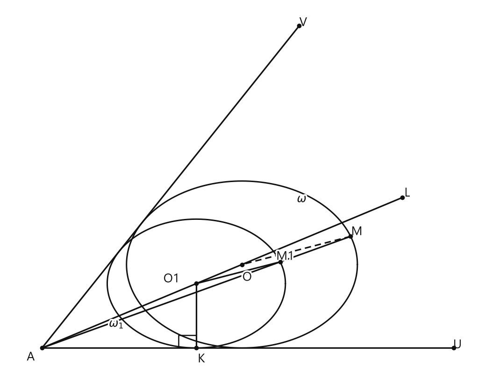

# Занятие 34. Преобразование фигур на плоскости

**Раздел:** Глава V. Векторы  
**Параграф учебника:** §26. Преобразование фигур на плоскости  
**Страницы:** 204–210

## Цели занятия

К концу занятия ученик умеет:

- различать центральную и осевую симметрию, параллельный перенос и поворот;
- объяснять, почему движения сохраняют расстояния и размеры фигур;
- выполнять параллельный перенос по заданному вектору;
- применять свойства движений, гомотетии и подобия;
- находить коэффициент гомотетии или подобия;
- описывать построение окружности, вписанной в угол и проходящей через заданную точку.

Выбери блок своего уровня:

- **1–2 балла:** распознаю виды преобразований и повторяю определения;
- **3–4 балла:** применяю формулы параллельного переноса и свойства движений;
- **5–6 баллов:** решаю задачи на гомотетию и подобие;
- **7–8 баллов:** выполняю доказательства и построения;
- **9–10 баллов:** связываю несколько преобразований в одну конструкцию.

---

## Теория к занятию

### 1. Преобразование фигуры

#### Простыми словами

Преобразование фигуры — это правило, по которому каждая точка фигуры переходит в другую точку. Так можно фигуру отразить, сдвинуть, повернуть, увеличить или уменьшить.

Правило должно быть одним и тем же для всех точек. Нельзя одну вершину передвинуть вправо, вторую — вверх, а третью оставить на месте: это уже не преобразование по единому правилу, а геометрическая импровизация.

#### Определение

Если каждую точку фигуры $F$ переместить по какому-то общему алгоритму, то получится новая фигура $F_1$. Говорят, что фигура $F_1$ получена преобразованием из фигуры $F$.

#### Правила

- Преобразование задаётся общим правилом для всех точек фигуры.
- Образ точки обычно обозначают той же буквой с индексом $1$: точка $A$ переходит в точку $A_1$.
- Если преобразуем многоугольник, сначала строим образы его вершин, а затем соединяем их в том же порядке.

#### Ловушки

- Фигура и её образ могут находиться в разных местах.
- При движении размеры фигуры не меняются.
- При подобии форма сохраняется, но размеры могут измениться.

---

### 2. Центральная и осевая симметрия

#### Простыми словами

При центральной симметрии точка $O$ является серединой отрезка, который соединяет точку и её образ.

При осевой симметрии прямая $l$ работает как зеркало. Отрезок, соединяющий точку и её образ, перпендикулярен оси симметрии, а ось делит этот отрезок пополам.

#### Определение. Центральная симметрия

**Центральная симметрия относительно некоторой точки $O$ (центра симметрии)** — это такое преобразование, при котором все точки фигуры $F$ переходят в симметричные им относительно точки $O$. В результате фигура $F$ переходит в симметричную ей фигуру $F_1$ относительно точки $O$ (рис. 301).

#### Определение. Осевая симметрия

**Осевая симметрия относительно некоторой прямой $l$ (оси симметрии)** — это такое преобразование, при котором все точки фигуры $F$ переходят в симметричные им относительно прямой $l$. В результате фигура $F$ переходит в симметричную ей фигуру $F_1$ относительно прямой $l$ (рис. 302).

#### Факты

При центральной и осевой симметрии расстояния между соответствующими точками сохраняются. Поэтому оба преобразования являются движениями.

Для симметрии относительно оси $Oy$ точка переходит по правилу

$$A(x_1;y_1)\longrightarrow A_1(-x_1;y_1).$$

Абсцисса меняет знак, а ордината остаётся прежней. Ось $Oy$ меняет левое на правое, но верх и низ не трогает.

#### Правила

- При симметрии относительно оси $Ox$ меняется знак ординаты:

$$A(x;y)\longrightarrow A_1(x;-y).$$

- При симметрии относительно оси $Oy$ меняется знак абсциссы:

$$A(x;y)\longrightarrow A_1(-x;y).$$

- При центральной симметрии относительно начала координат меняются оба знака:

$$A(x;y)\longrightarrow A_1(-x;-y).$$

#### Ловушки

- При симметрии относительно $Oy$ координата $y$ не меняется.
- При симметрии относительно $Ox$ координата $x$ не меняется.
- При центральной симметрии относительно начала координат меняются оба знака.
- Осевая симметрия относительно прямой — это отражение, а не поворот на случайный угол.

---

### 3. Параллельный перенос

#### Простыми словами

Параллельный перенос — это одинаковый сдвиг всей фигуры. Все точки перемещаются в одном направлении и на одно и то же расстояние.

Представь, что фигуру нарисовали на прозрачной плёнке и передвинули. Она не растянулась, не сжалась и не повернулась — просто сменила место.

#### Определение

**Параллельный перенос** — это такое преобразование, при котором все точки фигуры перемещаются в одном и том же направлении на одно и то же расстояние. Задается либо парой точек $M$ и $M_1$, либо вектором $\vec{m}$.

#### Теорема

**Теорема. Параллельный перенос сохраняет расстояние между точками.**

Если параллельный перенос задан вектором $\vec{k}(a;b)$, то точка $A(x_1;y_1)$ переходит в точку

$$A_1(x_1+a;y_1+b),$$

а точка $B(x_2;y_2)$ — в точку

$$B_1(x_2+a;y_2+b).$$

Расстояние между точками $A$ и $B$ равно

$$AB=\sqrt{(x_2-x_1)^2+(y_2-y_1)^2}.$$

Расстояние между их образами равно

$$A_1B_1=\sqrt{((x_2+a)-(x_1+a))^2+((y_2+b)-(y_1+b))^2}.$$

Упростим выражение внутри корня:

$$A_1B_1=\sqrt{(x_2-x_1)^2+(y_2-y_1)^2}=AB.$$

Расстояние не изменилось. Поэтому параллельный перенос является движением.

#### Следствия

1. Параллельный перенос, при котором точка $A(x;y)$ переходит в точку $A_1(x_1;y_1)$, можно задать системой

$$\begin{cases}
x_1=x+a,\\
y_1=y+b.
\end{cases}$$

2. Учитывая, что $\vec{k}(a;b)=\vec{m}(a;0)+\vec{n}(0;b)$, любой параллельный перенос на вектор $\vec{k}(a;b)$ можно представить как результат последовательного выполнения двух параллельных переносов вдоль осей координат: одного — вдоль оси $Ox$, другого — вдоль оси $Oy$.

#### Алгоритм переноса точки

Чтобы перенести точку $A$ на вектор $\vec{k}(a;b)$:

1. Запиши координаты точки $A$.
2. К абсциссе прибавь число $a$.
3. К ординате прибавь число $b$.
4. Получи координаты точки $A_1$.
5. Выполни те же действия для всех вершин фигуры.
6. Соедини полученные точки в том же порядке.

#### Ловушки

- Вектор $\vec{k}(-3;2)$ означает: на $3$ единицы влево и на $2$ единицы вверх.
- Прибавляются координаты вектора, а не его длина.
- Перенос действует на всю фигуру, поэтому нельзя передвигать только одну вершину.

---

### 4. Движение и его свойства

#### Простыми словами

Движение сохраняет расстояния между соответствующими точками. Поэтому после движения отрезок остаётся отрезком той же длины, треугольник — равным треугольником, а окружность — окружностью того же радиуса.

Фигура может поменять положение или направление, но её размеры останутся прежними.

#### Определение

Такие преобразования в геометрии называются *движениями*. Движение сохраняет размеры фигуры, т. е. переводит фигуру в равную ей фигуру.

#### Определение. Равные фигуры

Две фигуры называются равными, если они совмещаются движением.

#### Свойства движений

1) При движении точки прямой переходят в точки прямой в том же порядке.

2) Два движения, выполненные последовательно (композиция движений), дают снова движение.

3) Преобразование, обратное движению, является движением.

#### Следствие

При движении прямая переходит в прямую, луч — в луч, отрезок — в равный отрезок.

#### Правила

Чтобы доказать, что две фигуры равны, удобно действовать так:

1. Указать преобразование, которое переводит одну фигуру в другую.
2. Показать, что это преобразование является движением.
3. Сделать вывод: полученные фигуры равны.

Например, параллельный перенос сохраняет расстояния, значит, он является движением. Поэтому фигура и её образ при параллельном переносе равны.

#### Ловушки

- Последовательное выполнение двух движений снова даёт движение.
- Обратный перенос на вектор $\vec{k}(a;b)$ выполняется на вектор $\vec{k}(-a;-b)$.
- При движении сохраняются длины и порядок точек на прямой.

---

### 5. Поворот

#### Простыми словами

Поворот вращает каждую точку вокруг одного и того же центра, на один и тот же угол и в одном направлении.

Точка $A$ при этом движется по окружности с центром $O$. Расстояние до центра не меняется:

$$OA_1=OA.$$

#### Определение

**Поворот относительно некоторого центра поворота $O$ на заданный угол $\alpha$** — это такое преобразование, при котором все точки фигуры $F$ поворачиваются вокруг точки $O$ (центра поворота) в одном и том же направлении на один и тот же угол $\alpha$.

#### Факты

При повороте точка $A$ перемещается по дуге окружности с центром $O$ и радиусом $OA$ до положения $A_1$, где

$$\angle AOA_1=\alpha.$$

Так как расстояние от центра до точки сохраняется, а сам поворот сохраняет расстояния между любыми соответствующими точками, поворот является движением.

#### Алгоритм построения образа точки

1. Проведи отрезок $OA$.
2. От луча $OA$ отложи угол $\alpha$ в указанном направлении.
3. На новом луче отложи отрезок $OA_1=OA$.
4. Получи точку $A_1$ — образ точки $A$.
5. Повтори построение для остальных точек фигуры.
6. Соедини образы вершин в том же порядке.

#### Ловушки

- Поворот по часовой стрелке и поворот против часовой стрелки — разные преобразования.
- Расстояние от центра поворота до точки не изменяется.
- Центр поворота остаётся на месте.
- Угол поворота задаёт направление и величину поворота, а не длину отрезка.

---

### 6. Гомотетия

#### Простыми словами

Гомотетия увеличивает или уменьшает фигуру относительно центра $O$. Точка $X$ переходит в точку $X_1$, которая лежит на луче $OX$.

Расстояния от центра умножаются на одно и то же число $k$. Поэтому фигура увеличивается или уменьшается равномерно, без геометрических «перекосов».

#### Определение

Пусть $F$ — данная фигура, $O$ — фиксированная точка. Преобразование фигуры $F$, при котором каждая точка $X$ фигуры $F$ переходит в точку $X_1$ фигуры $F_1$ так, что точка $X_1$ лежит на луче $OX$ и $OX_1 = k \cdot OX$, где $k > 0$ (рис. 307), называется гомотетией относительно центра $O$. Число $k$ называется коэффициентом гомотетии, а фигуры $F$ и $F_1$ — гомотетичными.

#### Теорема

**Теорема. При гомотетии расстояния между точками изменяются в $k$ раз.**

Для соответствующих точек $A$, $B$ и их образов $A_1$, $B_1$ выполняется

$$A_1B_1=k\cdot AB.$$

Коэффициент гомотетии можно найти по соответствующим отрезкам:

$$k=\frac{A_1B_1}{AB}.$$

Также из определения гомотетии:

$$k=\frac{OA_1}{OA}.$$

#### Следствие

Гомотетия переводит прямые в параллельные им прямые.

Если прямая проходит через центр гомотетии, то она переходит сама в себя. В этом случае говорить о другой параллельной прямой не нужно: прямая уже «заняла нужное место».

#### Правила

- Если $k>1$, фигура увеличивается.
- Если $0<k<1$, фигура уменьшается.
- Если $k=1$, размеры фигуры не изменяются.
- Центр гомотетии и соответствующие точки лежат на одном луче.

#### Ловушки

- При гомотетии длины умножаются на $k$, а не прибавляются к нему.
- Коэффициент гомотетии положителен.
- При $k=1$ каждая точка остаётся на прежнем расстоянии от центра.
- Прямая, проходящая через центр гомотетии, переходит в себя, а не в параллельную ей прямую.

---

### 7. Подобие

#### Простыми словами

Подобие сохраняет форму фигуры, но позволяет изменить её размер. Все расстояния изменяются в одно и то же число раз.

Например, если $k=2$, каждая длина станет вдвое больше. Но углы не станут «вдвое угловее» — они сохранят свои значения.

#### Определение

**Подобие** — это такое преобразование, при котором расстояния между точками изменяются в одно и то же число раз. Иными словами, если $A$ и $B$ — произвольные точки фигуры $F$ — переходят в точки $A_1$ и $B_1$ фигуры $F_1$, то $A_1B_1 = k \cdot AB$, где $k > 0$ — одно и то же число для всех пар точек $A$ и $B$ (рис. 309). Число $k$ называется коэффициентом подобия.

#### Теорема

**Теорема. Преобразование подобия сохраняет углы между прямыми.**

#### Формулы

Для соответствующих отрезков:

$$A_1B_1=k\cdot AB,$$

коэффициент подобия равен

$$k=\frac{A_1B_1}{AB}.$$

При $k=1$ преобразование подобия является движением.

#### Факты

- Гомотетия является частным случаем подобия.
- Композиция движения и подобия является подобием.
- Преобразование подобия переводит прямые в прямые, лучи в лучи, отрезки в отрезки.
- При подобии углы сохраняются, а длины могут измениться.

#### Ловушки

- При подобии углы не умножаются на $k$.
- Если $k=2$, все длины увеличиваются вдвое, а углы остаются прежними.
- Подобные фигуры не обязаны быть равными.
- Равные фигуры можно считать подобными с коэффициентом $k=1$.

---

## Сводка формул «выучить наизусть»

Симметрия относительно оси $Ox$:

$$A(x;y)\longrightarrow A_1(x;-y).$$

Симметрия относительно оси $Oy$:

$$A(x;y)\longrightarrow A_1(-x;y).$$

Центральная симметрия относительно начала координат:

$$A(x;y)\longrightarrow A_1(-x;-y).$$

Параллельный перенос на вектор $\vec{k}(a;b)$:

$$A(x;y)\longrightarrow A_1(x+a;y+b).$$

Система параллельного переноса:

$$\begin{cases}
x_1=x+a,\\
y_1=y+b.
\end{cases}$$

Гомотетия и подобие:

$$A_1B_1=k\cdot AB,$$

$$k=\frac{A_1B_1}{AB}.$$

---

## Правила, которые нельзя путать

- Ось симметрии — прямая, центр симметрии — точка.
- При переносе к координатам точки прибавляют координаты вектора.
- При повороте сохраняется расстояние до центра.
- При гомотетии точка и её образ лежат на одном луче из центра.
- Движение сохраняет длины.
- Подобие сохраняет углы, но может изменять длины.
- При $k=1$ подобие становится движением.

---

## Разбор ключевых заданий

### Р1. Координаты точки после параллельного переноса

**Условие.** Точка $A(-2;4)$ перенесена параллельно на вектор $\vec{k}(5;-3)$. Найдите координаты точки $A_1$.

#### Решение

При параллельном переносе на вектор $\vec{k}(a;b)$ к первой координате прибавляется $a$, а ко второй — $b$:

$$x_1=x+a,$$

$$y_1=y+b.$$

Для точки $A(-2;4)$ и вектора $\vec{k}(5;-3)$ имеем:

$$x=-2,\qquad y=4,\qquad a=5,\qquad b=-3.$$

Находим первую координату:

$$x_1=-2+5=3.$$

Находим вторую координату:

$$y_1=4+(-3)=1.$$

Значит,

$$A_1(3;1).$$

Проверка по рисунку координат: точка сдвинулась на $5$ единиц вправо и на $3$ единицы вниз. Знаки не потерялись — уже победа над главной ловушкой переноса.

**Ответ: $A_1(3;1)$.**

---

### Р2. Образ треугольника при переносе

**Условие.** Треугольник имеет вершины $A(1;1)$, $B(4;1)$, $C(2;3)$. Постройте его образ при параллельном переносе на вектор $\vec{k}(-2;3)$ и запишите координаты вершин образа.

#### Решение

При переносе на вектор $\vec{k}(-2;3)$:

- к первой координате каждой точки прибавляем $-2$;
- ко второй координате каждой точки прибавляем $3$.

Для точки $A(1;1)$:

$$x_{A_1}=1+(-2)=-1,$$

$$y_{A_1}=1+3=4.$$

Получаем:

$$A_1(-1;4).$$

Для точки $B(4;1)$:

$$x_{B_1}=4+(-2)=2,$$

$$y_{B_1}=1+3=4.$$

Получаем:

$$B_1(2;4).$$

Для точки $C(2;3)$:

$$x_{C_1}=2+(-2)=0,$$

$$y_{C_1}=3+3=6.$$

Получаем:

$$C_1(0;6).$$

Чтобы построить образ треугольника, отмечаем точки $A_1$, $B_1$, $C_1$ и соединяем их в том же порядке.

Параллельный перенос является движением, поэтому длины сторон и углы треугольника не изменились. Треугольник просто «переехал» всем составом.

**Ответ: $A_1(-1;4)$, $B_1(2;4)$, $C_1(0;6)$.**

---

### Р3. Симметрия относительно оси

**Условие.** Точка $P(6;-2)$ отражена относительно оси $Oy$. Найдите координаты её образа.

#### Решение

При симметрии относительно оси $Oy$:

- абсцисса меняет знак;
- ордината остаётся прежней.

Поэтому:

$$P(x;y)\longrightarrow P_1(-x;y).$$

У точки $P(6;-2)$:

$$x=6,\qquad y=-2.$$

Меняем знак только у первой координаты:

$$x_1=-6,$$

$$y_1=-2.$$

Значит,

$$P_1(-6;-2).$$

Не меняем оба знака: это была бы симметрия относительно начала координат. Здесь ось $Oy$ меняет только $x$ — она строгая, но справедливая.

**Ответ: $P_1(-6;-2)$.**

---

### Р4. Доказательство при осевой симметрии

**Условие.** Докажите, что при симметрии относительно некоторой прямой — оси симметрии — треугольник переходит в равный ему треугольник.

#### Решение

Пусть треугольник $ABC$ при осевой симметрии переходит в треугольник $A_1B_1C_1$.

По теореме осевая симметрия сохраняет расстояние между точками.

Поэтому соответствующие стороны имеют равные длины:

$$AB=A_1B_1,$$

$$BC=B_1C_1,$$

$$AC=A_1C_1.$$

Получили, что у треугольников $ABC$ и $A_1B_1C_1$ равны три соответствующие стороны.

По третьему признаку равенства треугольников эти треугольники равны.

Следовательно, при осевой симметрии треугольник переходит в равный ему треугольник.

**Ответ: треугольники $ABC$ и $A_1B_1C_1$ равны по третьему признаку.**

---

### Р5. Коэффициент гомотетии

**Условие.** При гомотетии отрезок длиной $7$ см переходит в отрезок длиной $21$ см. Найдите коэффициент гомотетии.

#### Решение

При гомотетии расстояния между точками изменяются в $k$ раз:

$$A_1B_1=k\cdot AB.$$

В этой задаче:

$$AB=7\text{ см},$$

$$A_1B_1=21\text{ см}.$$

Подставляем эти значения в формулу:

$$21=7k.$$

Делим обе части равенства на $7$:

$$k=\frac{21}{7}=3.$$

Проверим результат:

$$7\cdot3=21.$$

Значит, отрезок увеличился в $3$ раза. Гомотетия не запуталась — она просто умножила длину на $3$.

**Ответ: $k=3$.**

---

### Р6. Нахождение длины после подобия

**Условие.** При преобразовании подобия коэффициент равен $0{,}4$. Отрезок $AB$ имеет длину $15$ см. Найдите длину его образа $A_1B_1$.

#### Решение

При преобразовании подобия длины изменяются по формуле:

$$A_1B_1=k\cdot AB.$$

Подставляем известные значения:

$$A_1B_1=0{,}4\cdot15.$$

Вычисляем:

$$0{,}4\cdot15=6.$$

Следовательно,

$$A_1B_1=6\text{ см}.$$

Коэффициент $0{,}4$ меньше $1$, поэтому отрезок должен стать короче. Было $15$ см, стало $6$ см — проверка здравого смысла сработала.

**Ответ: $6$ см.**

---

### Р7. Построение окружности в угле через заданную точку

**Условие.** Внутри угла $A$ дана точка $M$. Постройте окружность, касающуюся обеих сторон угла и проходящую через точку $M$.

<!--geo-figure-spec
{
  "needed": true,
  "kind": "plane",
  "caption": "Построение окружности в угле $A$ через точку $M$",
  "equal": false,
  "axis": false,
  "xlim": [
    -0.7,
    8.5
  ],
  "ylim": [
    -0.7,
    9.2
  ],
  "points": {
    "A": [
      0,
      0
    ],
    "L": [
      7,
      4.04145
    ],
    "O1": [
      3,
      1.73205
    ],
    "K": [
      3,
      0
    ],
    "M1": [
      4.63085,
      2.31543
    ],
    "M": [
      6,
      3
    ],
    "O": [
      3.88697,
      2.24415
    ],
    "U": [
      8,
      0
    ],
    "V": [
      5,
      8.66025
    ]
  },
  "segments": [
    [
      "A",
      "U"
    ],
    [
      "A",
      "V"
    ],
    [
      "A",
      "L"
    ],
    [
      "A",
      "M"
    ],
    [
      "O1",
      "K"
    ],
    {
      "points": [
        "O1",
        "M1"
      ],
      "dashed": false,
      "label": "",
      "t": 0.5
    },
    {
      "points": [
        "M",
        "O"
      ],
      "dashed": true,
      "label": "",
      "t": 0.5
    }
  ],
  "polygons": [],
  "circles": [
    {
      "center": "O1",
      "radius": 1.73205
    },
    {
      "center": "O",
      "radius": 2.24415
    }
  ],
  "labels": {
    "A": {
      "dx": -0.22,
      "dy": -0.25
    },
    "L": {
      "dx": 0.1,
      "dy": 0.12
    },
    "O1": {
      "dx": -0.48,
      "dy": 0.12
    },
    "K": {
      "dx": 0.1,
      "dy": -0.3
    },
    "M1": {
      "dx": 0.1,
      "dy": 0.14
    },
    "M": {
      "dx": 0.12,
      "dy": 0.12
    },
    "O": {
      "dx": 0.1,
      "dy": -0.35
    }
  },
  "right_angles": [
    {
      "vertex": "K",
      "from": "O1",
      "to": "A"
    }
  ],
  "angle_marks": [],
  "texts": [
    {
      "xy": [
        1.45,
        0.65
      ],
      "text": "$\\omega_1$"
    },
    {
      "xy": [
        5.05,
        4
      ],
      "text": "$\\omega$"
    }
  ]
}
-->

*Построение окружности в угле A через точку M*

#### Решение

Используем гомотетию с центром в вершине угла $A$.

1. Строим биссектрису $AL$ угла $A$.

2. Отмечаем на биссектрисе произвольную точку $O_1$.

3. Из точки $O_1$ проводим перпендикуляр $O_1K$ к одной из сторон угла.

4. Радиусом $O_1K$ строим окружность $\omega_1$ с центром $O_1$.

   Она касается обеих сторон угла, потому что её центр лежит на биссектрисе: расстояния от точки $O_1$ до сторон угла равны.

5. Проводим луч $AM$.

6. Обозначаем через $M_1$ точку пересечения луча $AM$ с окружностью $\omega_1$.

7. Соединяем точки $O_1$ и $M_1$.

8. Через точку $M$ проводим прямую, параллельную прямой $M_1O_1$.

9. Эта прямая пересекает биссектрису $AL$ в точке $O$.

10. Радиусом $OM$ строим окружность $\omega$.

Почему построение даёт нужную окружность:

- окружность $\omega$ получается из окружности $\omega_1$ гомотетией с центром $A$;
- точка $M_1$ переходит в точку $M$;
- центр $O_1$ переходит в центр $O$;
- коэффициент гомотетии равен

$$k=\frac{AM}{AM_1};$$

- гомотетия переводит прямые, не проходящие через центр, в параллельные прямые.

Поэтому окружность $\omega$ касается обеих сторон угла и проходит через точку $M$.

**Ответ: окружность $\omega$ с центром $O$ и радиусом $OM$.**

---

### Р8. Параллельный перенос квадрата

**Условие.** Квадрат $ABCD$ перенесён параллельно на вектор $\vec{AC}$. Постройте образ квадрата.

#### Решение

Вектор переноса — диагональ квадрата:

$$\vec{AC}.$$

Для каждой вершины квадрата строим отрезок, равный и сонаправленный вектору $\vec{AC}$:

$$\overrightarrow{AA_1}=\vec{AC},$$

$$\overrightarrow{BB_1}=\vec{AC},$$

$$\overrightarrow{CC_1}=\vec{AC},$$

$$\overrightarrow{DD_1}=\vec{AC}.$$

Значит:

- точка $A$ переходит в точку $A_1$;
- точка $B$ переходит в точку $B_1$;
- точка $C$ переходит в точку $C_1$;
- точка $D$ переходит в точку $D_1$.

Отмечаем точки $A_1$, $B_1$, $C_1$, $D_1$ и соединяем соседние точки.

Параллельный перенос является движением. Поэтому образ квадрата — равный ему квадрат. Все вершины сдвинулись одинаково, никто не решил «переехать отдельно».

**Ответ: образ — квадрат $A_1B_1C_1D_1$, для которого**

$$\overrightarrow{AA_1}
=\overrightarrow{BB_1}
=\overrightarrow{CC_1}
=\overrightarrow{DD_1}
=\vec{AC}.$$

---

### Р9. Поворот равностороннего треугольника

**Условие.** Равносторонний треугольник $ABC$ повернули на $60^\circ$ по часовой стрелке вокруг точки $A$. Постройте образ треугольника.

#### Решение

1. Точка $A$ является центром поворота, поэтому она остаётся на месте:

$$A\longrightarrow A_1=A.$$

2. Точка $B$ поворачивается вокруг точки $A$ на $60^\circ$ по часовой стрелке.

3. Так как треугольник $ABC$ равносторонний,

$$\angle BAC=60^\circ,$$

$$AB=AC.$$

При повороте точки $B$ на $60^\circ$ по часовой стрелке она попадает в точку $C$:

$$B\longrightarrow C.$$

4. Точка $C$ переходит в точку $C_1$. Для её построения:

- откладываем от луча $AC$ угол $60^\circ$ по часовой стрелке;
- на полученном луче отмечаем точку $C_1$ так, чтобы

$$AC_1=AC.$$

5. Соединяем точки $A$, $C$, $C_1$.

Образом треугольника $ABC$ является треугольник $ACC_1$.

Поворот сохраняет расстояния, поэтому образ равен исходному треугольнику.

**Ответ: $A_1=A$, $B_1=C$, а $C_1$ строится поворотом точки $C$ на $60^\circ$ по часовой стрелке вокруг $A$.**

---

### Р10. Окружность при движении

**Условие.** Докажите, что при движении окружность переходит в равную ей окружность.

#### Решение

Пусть дана окружность с центром $O$ и радиусом $r$.

При движении центр $O$ переходит в точку $O_1$.

Возьмём любую точку $A$ данной окружности. Для неё выполняется:

$$OA=r.$$

Движение сохраняет расстояния между точками. Поэтому для образов точек $O$ и $A$ имеем:

$$O_1A_1=OA.$$

Подставляем значение $OA$:

$$O_1A_1=r.$$

Это равенство выполняется для любой точки $A$ окружности. Значит, каждая точка образа находится на расстоянии $r$ от точки $O_1$.

По определению окружности образ является окружностью с центром $O_1$ и радиусом $r$.

Радиус остался тем же, поэтому новая окружность равна исходной.

**Ответ: окружность переходит в окружность с тем же радиусом, то есть в равную ей окружность.**

## Практические задания

Выбери свой уровень и решай только этот блок. В блоке должна закрепиться вся тема параграфа. Ответы не приводятся.

### Уровень 1–2 балла

**С1.** Какое преобразование задаётся точкой — центром симметрии?

1) осевая симметрия  
2) центральная симметрия  
3) параллельный перенос  
4) поворот  
5) гомотетия

**С2.** Какое преобразование задаётся прямой — осью симметрии?

1) центральная симметрия  
2) поворот  
3) осевая симметрия  
4) параллельный перенос  
5) подобие

**С3.** Выберите преобразование, при котором все точки фигуры перемещаются в одном и том же направлении на одно и то же расстояние.

1) поворот  
2) гомотетия  
3) осевая симметрия  
4) параллельный перенос  
5) центральная симметрия

**С4.** Точка $A(3; -2)$ переходит при параллельном переносе в точку $A_1(7; 1)$. Найдите координаты вектора переноса.

1) $(4; 3)$  
2) $(-4; -3)$  
3) $(10; -1)$  
4) $(4; -3)$  
5) $(-4; 3)$

**С5.** При гомотетии с центром $O$ и коэффициентом $k=3$ отрезок длиной $4$ см переходит в отрезок длиной

1) $1$ см  
2) $4$ см  
3) $7$ см  
4) $12$ см  
5) $16$ см

**С6.** Какое из перечисленных преобразований не обязательно сохраняет размеры фигуры?

1) центральная симметрия  
2) осевая симметрия  
3) параллельный перенос  
4) поворот  
5) гомотетия с коэффициентом $k=2$

**С7.** При параллельном переносе на вектор $\vec m(2; -4)$ точка $B(-1; 5)$ переходит в точку $B_1$. Запишите координаты точки $B_1$.

**С8.** При осевой симметрии относительно оси $Oy$ точка $C(6; -3)$ переходит в точку $C_1$. Запишите координаты точки $C_1$.

**С9.** При центральной симметрии относительно точки $O$ точка $A(2; 4)$ переходит в точку $A_1(-2; -4)$. Запишите координаты центра симметрии $O$.

**С10.** Отрезок $AB$ длиной $7$ см при некотором движении переходит в отрезок $A_1B_1$. Найдите длину отрезка $A_1B_1$.

**С11.** Прямая $a$ при гомотетии переходит в прямую $a_1$. Прямые $a$ и $a_1$ не совпадают. Каково взаимное расположение этих прямых?

1) перпендикулярны  
2) параллельны  
3) пересекаются под углом $45^\circ$  
4) совпадают  
5) не имеют общей плоскости

**С12.** Квадрат $ABCD$ поворачивают вокруг точки пересечения его диагоналей на угол $90^\circ$. Запишите название фигуры, в которую переходит квадрат.

**С13.** Какое преобразование задаётся точкой — центром симметрии?

1) осевая симметрия  
2) центральная симметрия  
3) параллельный перенос  
4) поворот  
5) гомотетия

**С14.** Какое преобразование задаётся прямой — осью симметрии?

1) центральная симметрия  
2) поворот  
3) осевая симметрия  
4) параллельный перенос  
5) гомотетия

**С15.** Выберите преобразование, при котором все точки фигуры перемещаются в одном и том же направлении на одно и то же расстояние.

1) поворот  
2) осевая симметрия  
3) гомотетия  
4) параллельный перенос  
5) центральная симметрия

**С16.** Точка $A(2; -1)$ при параллельном переносе переходит в точку $A_1(5; 3)$. Найдите координаты вектора переноса.

1) $(3; 4)$  
2) $(7; 2)$  
3) $(-3; -4)$  
4) $(4; 3)$  
5) $(2; 5)$

**С17.** При параллельном переносе на вектор $\vec m(-2; 4)$ точка $B(3; -1)$ переходит в точку $B_1$. Найдите координаты точки $B_1$.

1) $(1; 3)$  
2) $(5; -5)$  
3) $(-1; 3)$  
4) $(1; -5)$  
5) $(5; 3)$

**С18.** Точка $P(4; -2)$ отражается относительно оси $Ox$. Выберите координаты образа точки $P$.

1) $(-4; -2)$  
2) $(-4; 2)$  
3) $(4; 2)$  
4) $(2; 4)$  
5) $(4; -2)$

**С19.** Точка $Q(-3; 5)$ отражается относительно оси $Oy$. Выберите координаты образа точки $Q$.

1) $(3; 5)$  
2) $(-3; -5)$  
3) $(3; -5)$  
4) $(5; -3)$  
5) $(-5; 3)$

**С20.** При гомотетии с центром $O$ коэффициент равен $k=3$. Отрезок $AB$ имеет длину $4$ см. Найдите длину его образа.

1) $1$ см  
2) $4$ см  
3) $7$ см  
4) $12$ см  
5) $16$ см

**С21.** При гомотетии с центром $O$ точка $X$ переходит в точку $X_1$, причём $OX=5$ см и $OX_1=10$ см. Найдите коэффициент гомотетии.

1) $0{,}2$  
2) $0{,}5$  
3) $2$  
4) $5$  
5) $15$

**С22.** Какое преобразование переводит фигуру в равную ей фигуру?

1) любое подобие  
2) движение  
3) гомотетия с коэффициентом $2$  
4) гомотетия с коэффициентом $3$  
5) растяжение в два раза

**С23.** Квадрат поворачивают вокруг точки пересечения его диагоналей на угол $90^\circ$. Выберите верное утверждение.

1) квадрат переходит в прямоугольник  
2) квадрат переходит в треугольник  
3) квадрат переходит сам в себя  
4) квадрат исчезает  
5) квадрат переходит в окружность

**С24.** При подобии отрезок длиной $7$ см переходит в отрезок длиной $21$ см. Найдите коэффициент подобия.

1) $3$  
2) $14$  
3) $28$  
4) $\dfrac{1}{3}$  
5) $\dfrac{7}{21}$

**С25.** Какое преобразование переводит каждую точку фигуры в точку, симметричную ей относительно фиксированной точки $O$?  
1) осевая симметрия  
2) центральная симметрия  
3) параллельный перенос  
4) поворот  
5) гомотетия

**С26.** Какое преобразование задаётся вектором $\vec m$?  
1) центральная симметрия  
2) осевая симметрия  
3) параллельный перенос  
4) поворот  
5) гомотетия

**С27.** Точка $A(3; -2)$ отражена относительно оси $Oy$. Укажите координаты её образа $A_1$.  
1) $(-3; -2)$  
2) $(3; 2)$  
3) $(-3; 2)$  
4) $(2; -3)$  
5) $(3; -2)$

**С28.** Точка $B(-1; 4)$ отражена относительно начала координат. Укажите координаты её образа $B_1$.  
1) $(-1; -4)$  
2) $(1; 4)$  
3) $(1; -4)$  
4) $(-4; 1)$  
5) $(-1; 4)$

**С29.** При параллельном переносе точка $C(2; -1)$ переходит в точку $C_1(5; 3)$. Какими координатами задаётся вектор переноса?  
1) $(3; 4)$  
2) $(7; 2)$  
3) $(-3; -4)$  
4) $(4; 3)$  
5) $(3; -2)$

**С30.** При параллельном переносе на вектор $(2; -3)$ точка $D(-4; 5)$ переходит в точку $D_1$. Укажите координаты точки $D_1$.  
1) $(-6; 8)$  
2) $(-2; 2)$  
3) $(2; -8)$  
4) $(-4; 2)$  
5) $(-2; 8)$

**С31.** Какое преобразование сохраняет расстояния между точками и переводит фигуру в равную ей фигуру?  
1) гомотетия с коэффициентом $2$  
2) подобие с коэффициентом $\frac12$  
3) движение  
4) гомотетия с коэффициентом $\frac13$  
5) подобие с коэффициентом $3$

**С32.** При повороте вокруг точки $O$ на угол $90^\circ$ против часовой стрелки точка $A$ переходит в точку $A_1$. Как называют точку $O$?  
1) центром симметрии  
2) осью симметрии  
3) центром поворота  
4) центром гомотетии  
5) коэффициентом подобия

**С33.** При гомотетии с центром $O$ и коэффициентом $k=3$ отрезок длиной $4$ см переходит в отрезок длиной  
1) $1$ см  
2) $4$ см  
3) $7$ см  
4) $12$ см  
5) $16$ см

**С34.** Прямая $a$ при гомотетии с центром $O$ переходит в прямую $a_1$. Прямые $a$ и $a_1$ не проходят через точку $O$. Как расположены эти прямые?  
1) перпендикулярно  
2) параллельно  
3) совпадают обязательно  
4) пересекаются под углом $45^\circ$  
5) пересекаются под углом $90^\circ$

**С35.** Квадрат повернули вокруг точки пересечения его диагоналей на $90^\circ$. Во что перешёл квадрат?  
1) в прямоугольник, не являющийся квадратом  
2) в равносторонний треугольник  
3) в самого себя  
4) в отрезок  
5) в окружность

**С36.** Две фигуры имеют одинаковую форму, а все расстояния между соответствующими точками второй фигуры в $2$ раза больше расстояний между соответствующими точками первой фигуры. Как называется такое преобразование?  
1) движение с коэффициентом $2$  
2) подобие с коэффициентом $2$  
3) осевая симметрия  
4) центральная симметрия  
5) параллельный перенос

### Уровень 3–4 балла

**С1.** Точка $A(3;-2)$ переходит в точку $A_1(-3;-2)$ при симметрии относительно оси $Oy$. Найдите координаты точки $B_1$, в которую при этой симметрии переходит точка $B(-5;4)$.

**С2.** При центральной симметрии относительно точки $O(0;0)$ точка $A(4;-1)$ переходит в точку $A_1$. Найдите координаты точки $A_1$.

**С3.** Параллельный перенос задан вектором $\vec{k}(3;-4)$. Найдите координаты точки $B_1$, в которую переходит точка $B(-2;5)$.

**С4.** При параллельном переносе точка $M(-1;3)$ переходит в точку $M_1(4;1)$. В какую точку при этом переносе переходит точка $N(2;-3)$?

**С5.** Точка $A(2;1)$ повернута вокруг начала координат на $90^\circ$ против часовой стрелки. Найдите координаты полученной точки $A_1$.

**С6.** Точка $B(-3;4)$ повернута вокруг начала координат на $90^\circ$ по часовой стрелке. Найдите координаты полученной точки $B_1$.

**С7.** При движении отрезок $AB$ переходит в отрезок $A_1B_1$. Известно, что $AB=7$ см. Найдите длину отрезка $A_1B_1$.

**С8.** При параллельном переносе точка $A(1;2)$ переходит в точку $A_1(5;-1)$, а точка $B(-2;4)$ — в точку $B_1$. Найдите координаты точки $B_1$.

**С9.** При гомотетии с центром $O$ и коэффициентом $k=3$ отрезок $AB$ переходит в отрезок $A_1B_1$. Найдите длину отрезка $A_1B_1$, если $AB=4$ см.

**С10.** При гомотетии с центром $O$ точка $A$ переходит в точку $A_1$, причём $OA=6$ см и $OA_1=9$ см. Найдите коэффициент гомотетии.

**С11.** Два отрезка являются соответствующими при преобразовании подобия с коэффициентом $k=0{,}5$. Найдите длину второго отрезка, если длина первого отрезка равна $12$ см.

**С12.** Квадрат $ABCD$ последовательно подвергли двум движениям: сначала параллельному переносу, затем осевой симметрии. Сторона исходного квадрата равна $5$ см. Найдите длину стороны полученного квадрата.

**С13.** Точка $A(3;-2)$ при центральной симметрии относительно начала координат переходит в точку $A_1$. Укажите координаты точки $A_1$.

**С14.** Точка $B(-4;5)$ при осевой симметрии относительно оси $Ox$ переходит в точку $B_1$. Укажите координаты точки $B_1$.

**С15.** При параллельном переносе на вектор $\vec{m}(4;-3)$ точка $C(-2;6)$ переходит в точку $C_1$. Укажите координаты точки $C_1$.

**С16.** При параллельном переносе точка $D(5;-1)$ переходит в точку $D_1(2;4)$. Найдите координаты вектора переноса.

**С17.** Отрезок $AB$ имеет длину $7$ см. Какова длина его образа при осевой симметрии?

**С18.** Стороны прямоугольника равны $6$ см и $4$ см. Найдите площадь фигуры, полученной из него параллельным переносом.

**С19.** При гомотетии с центром $O$ и коэффициентом $k=3$ отрезок $AB$ переходит в отрезок $A_1B_1$. Найдите длину $A_1B_1$, если $AB=5$ см.

**С20.** При подобии отрезок длиной $8$ см переходит в отрезок длиной $12$ см. Найдите коэффициент подобия.

**С21.** Угол величиной $70^\circ$ подвергли преобразованию подобия. Найдите величину полученного угла.

**С22.** Точки $A(1;2)$ и $B(4;2)$ подвергли осевой симметрии относительно оси $Oy$. Найдите расстояние между образами этих точек.

**С23.** Квадрат $ABCD$ последовательно подвергли двум движениям: сначала параллельному переносу, затем повороту. Сторона исходного квадрата равна $5$ см. Найдите длину стороны полученного квадрата.

**С24.** Прямая $a$ при гомотетии с центром $O$, не лежащим на прямой $a$, перешла в прямую $a_1$. Прямая $a_1$ не совпадает с прямой $a$. Каково взаимное расположение прямых $a$ и $a_1$?

**С25.** Точка $A(3;-2)$ при осевой симметрии относительно оси $Oy$ переходит в точку $A_1$. Найдите координаты точки $A_1$.

**С26.** Точка $B(-4;5)$ при центральной симметрии относительно начала координат переходит в точку $B_1$. Найдите координаты точки $B_1$.

**С27.** При параллельном переносе на вектор $\vec{k}(3;-4)$ точка $C(-2;6)$ переходит в точку $C_1$. Найдите координаты точки $C_1$.

**С28.** При параллельном переносе точка $D(5;-1)$ переходит в точку $D_1(2;4)$. Запишите координаты вектора параллельного переноса.

**С29.** Отрезок $AB$ имеет длину $7$ см. При осевой симметрии относительно прямой $l$ его концы переходят в точки $A_1$ и $B_1$. Найдите длину отрезка $A_1B_1$.

**С30.** При параллельном переносе точка $A$ переходит в точку $A_1$, а точка $B$ — в точку $B_1$. Известно, что $AB=4{,}5$ см. Найдите $A_1B_1$.

**С31.** Отрезок $AB$ длиной $6$ см подвергли гомотетии с коэффициентом $k=2$. Найдите длину образа отрезка $A_1B_1$.

**С32.** При гомотетии с центром $O$ точка $A$ переходит в точку $A_1$, причём $OA=3$ см и $OA_1=12$ см. Найдите коэффициент гомотетии.

**С33.** Прямая $a$ не проходит через центр гомотетии $O$. При гомотетии с коэффициентом $k=3$ она переходит в прямую $a_1$. Как расположены прямые $a$ и $a_1$?

**С34.** Угол $ABC$ величиной $48^\circ$ при преобразовании подобия переходит в угол $A_1B_1C_1$. Найдите величину угла $A_1B_1C_1$.

**С35.** Квадрат $ABCD$ подвергли повороту вокруг точки пересечения его диагоналей на угол $90^\circ$ против часовой стрелки. В какую фигуру перейдёт квадрат? Укажите, перейдёт ли он сам в себя.

**С36.** Треугольник $ABC$ подвергли параллельному переносу на вектор $\vec{k}(2;-3)$. Запишите формулы, по которым координаты произвольной точки $P(x;y)$ этого треугольника переходят в координаты её образа $P_1(x_1;y_1)$.

### Уровень 5–6 баллов

**С1.** Точка $A(-3; 4)$ при осевой симметрии относительно оси $Ox$ переходит в точку $A_1$. Найдите координаты точки $A_1$.

**С2.** Точка $B(5; -2)$ при центральной симметрии относительно начала координат переходит в точку $B_1$. Найдите координаты точки $B_1$.

**С3.** Параллельный перенос задан вектором $\vec{k}(4; -3)$. Найдите координаты образа точки $C(-2; 5)$ при этом переносе.

**С4.** При параллельном переносе точка $D(3; -1)$ переходит в точку $D_1(-2; 4)$. Задайте этот перенос координатами вектора $\vec{k}$.

**С5.** Точки $A(1; 2)$ и $B(4; 6)$ при параллельном переносе переходят в точки $A_1(5; -1)$ и $B_1$. Найдите координаты точки $B_1$.

**С6.** Отрезок $AB$ имеет длину $7$ см. При каком из перечисленных преобразований длина его образа обязательно будет равна $7$ см: центральной симметрии, осевой симметрии, параллельном переносе, повороте, гомотетии с коэффициентом $k=2$? Запишите все подходящие преобразования.

**С7.** Отрезок $AB$ длиной $6$ см подвергли гомотетии с центром $O$ и коэффициентом $k=3$. Найдите длину образа отрезка $A_1B_1$.

**С8.** При гомотетии с центром $O$ точка $A$ переходит в точку $A_1$, причём $OA=4$ см, $OA_1=10$ см. Найдите коэффициент гомотетии.

**С9.** Прямая $a$ не проходит через центр гомотетии $O$. При гомотетии с центром $O$ и коэффициентом $k=2$ она переходит в прямую $a_1$. Расстояние от $O$ до прямой $a$ равно $3$ см. Найдите расстояние от $O$ до прямой $a_1$.

**С10.** Начертите треугольник $ABC$ и точку $O$, не лежащую на его сторонах. Постройте треугольник $A_1B_1C_1$, симметричный треугольнику $ABC$ относительно точки $O$.

**С11.** Начертите квадрат $ABCD$ и постройте квадрат $A_1B_1C_1D_1$, в который он переходит при параллельном переносе на вектор $\vec{AC}$. Опишите построение образов всех вершин.

**С12.** Начертите равносторонний треугольник $ABC$. Постройте треугольник $A_1B_1C_1$, в который он переходит при повороте на $60^\circ$ по часовой стрелке вокруг точки $A$. Укажите, какая вершина остаётся неподвижной при этом повороте.

**С13.** Точка $A(-3; 5)$ при осевой симметрии относительно оси $Oy$ переходит в точку $A_1$. Найдите координаты точки $A_1$.

**С14.** Точки $A(2; -1)$ и $B(-4; 3)$ при параллельном переносе переходят соответственно в точки $A_1(5; 2)$ и $B_1$. Найдите координаты точки $B_1$.

**С15.** При параллельном переносе на вектор $\vec{k}(-3; 4)$ точка $P(6; -2)$ переходит в точку $P_1$. Найдите координаты точки $P_1$.

**С16.** Отрезок $AB$ имеет длину $7$ см. Точки $A$ и $B$ подвергли центральной симметрии относительно точки $O$ и получили точки $A_1$ и $B_1$. Найдите длину отрезка $A_1B_1$.

**С17.** Отрезок $AB$ имеет длину $5$ см. При гомотетии с центром $O$ и коэффициентом $k=3$ его концы перешли в точки $A_1$ и $B_1$. Найдите длину отрезка $A_1B_1$.

**С18.** При гомотетии с центром $O$ точка $A$ перешла в точку $A_1$, причём $OA=4$ см, а $OA_1=10$ см. Найдите коэффициент гомотетии.

**С19.** При преобразовании подобия отрезок длиной $12$ см перешёл в отрезок длиной $9$ см. Найдите коэффициент подобия.

**С20.** Угол $ABC$ равен $68^\circ$. При движении его стороны перешли в лучи $B_1A_1$ и $B_1C_1$. Найдите величину угла $A_1B_1C_1$.

**С21.** Прямые $a$ и $b$ пересекаются в точке $O$. При повороте вокруг точки $O$ на $90^\circ$ против часовой стрелки прямая $a$ перешла в прямую $a_1$. Какой угол образуют прямые $a$ и $a_1$?

**С22.** Квадрат $ABCD$ подвергли повороту вокруг точки пересечения его диагоналей на $90^\circ$ по часовой стрелке. Укажите, в какую вершину перейдёт каждая из вершин: $A$, $B$, $C$, $D$.

**С23.** Равносторонний треугольник $ABC$ подвергли повороту вокруг точки пересечения его медиан на $120^\circ$ против часовой стрелки. Укажите, в какую вершину перейдёт каждая из вершин: $A$, $B$, $C$, если при таком направлении поворота вершина $A$ переходит в вершину $B$.

**С24.** При параллельном переносе точка $M(-2; 3)$ переходит в точку $M_1(4; -1)$. Треугольник с вершинами $A(1; 2)$, $B(-3; 0)$ и $C(2; -4)$ подвергли этому же параллельному переносу. Найдите координаты вершин полученного треугольника.

**С25.** Точка $A(-3; 5)$ при центральной симметрии относительно точки $O(1; 2)$ переходит в точку $A_1$. Найдите координаты точки $A_1$.

**С26.** Треугольник $ABC$ задан координатами $A(-4; 1)$, $B(-1; 1)$, $C(-2; 4)$. Постройте координаты вершин треугольника $A_1B_1C_1$, полученного отражением треугольника $ABC$ относительно оси $Oy$.

**С27.** Параллельный перенос задан вектором $\vec{k}(4; -3)$. Найдите координаты точки $M_1$, в которую переходит точка $M(-2; 6)$.

**С28.** Точка $A(3; 1)$ переходит в точку $A_1(-1; 3)$ при повороте вокруг начала координат против часовой стрелки на $90^\circ$. Найдите координаты точки $B_1$, в которую при этом повороте переходит точка $B(2; 4)$.

**С29.** При гомотетии с центром $O$ и коэффициентом $k=3$ отрезок $AB$ переходит в отрезок $A_1B_1$. Известно, что $AB=4{,}5$ см. Найдите длину отрезка $A_1B_1$.

**С30.** Прямоугольник $ABCD$ имеет стороны $AB=7$ см и $BC=4$ см. Он переходит в прямоугольник $A_1B_1C_1D_1$ при движении. Найдите длины сторон $A_1B_1$ и $B_1C_1$, а также периметр прямоугольника $A_1B_1C_1D_1$.

### Уровень 7–8 баллов

**С1.** Точка $A(-3;4)$ при параллельном переносе переходит в точку $A_1(2;-1)$. Найдите координаты точки $B_1$, в которую переходит точка $B(5;3)$ при том же переносе, и укажите вектор переноса.

**С2.** Треугольник $ABC$ задан координатами $A(-2;1)$, $B(3;1)$, $C(1;4)$. Постройте координатным способом треугольник $A_1B_1C_1$, симметричный треугольнику $ABC$ относительно оси $Ox$. Найдите координаты его вершин и обоснуйте, что треугольники равны.

**С3.** При центральной симметрии относительно точки $O(2;-1)$ точка $A(-4;3)$ переходит в точку $A_1$. Найдите координаты точки $A_1$. Затем проверьте, что точка $O$ является серединой отрезка $AA_1$.

**С4.** Даны точки $A(1;2)$, $B(5;2)$ и вектор переноса $\vec m(-3;4)$. Постройте отрезок $A_1B_1$, в который переходит отрезок $AB$, и вычислите длины отрезков $AB$ и $A_1B_1$. Объясните, почему полученные длины равны.

**С5.** Прямая $a$ не проходит через точку $O$. При повороте вокруг точки $O$ на $90^\circ$ против часовой стрелки она переходит в прямую $a_1$. Точка $A$ принадлежит прямой $a$ и $OA=6$ см. Определите расстояние от $O$ до прямой $a_1$, если расстояние от $O$ до прямой $a$ равно $4$ см. Обоснуйте ответ свойством движения.

**С6.** Квадрат $ABCD$ со стороной $6$ см подвергли повороту вокруг точки пересечения его диагоналей на $90^\circ$ по часовой стрелке. Докажите, что полученная фигура совпадает с исходным квадратом, и укажите, в какую точку переходит каждая вершина.

**С7.** Равносторонний треугольник $ABC$ подвергли повороту вокруг точки пересечения его медиан на $120^\circ$ против часовой стрелки. Докажите, что полученный треугольник совпадает с исходным. Какие вершины переходят друг в друга?

**С8.** Прямоугольник $ABCD$ имеет стороны $AB=8$ см и $BC=5$ см. Сначала его отразили относительно прямой $l$, а затем выполнили параллельный перенос на вектор $\vec v$. Докажите, что итоговая фигура является прямоугольником с теми же длинами сторон и той же площадью, что и исходный.

**С9.** При гомотетии с центром $O$ и коэффициентом $k=3$ точка $A$ переходит в точку $A_1$, причём $OA=4$ см. Точка $B$ также переходит в точку $B_1$, причём $AB=5$ см. Найдите $OA_1$, $OB_1$ и $A_1B_1$. Обоснуйте применение свойства гомотетии к каждой найденной величине.

**С10.** Прямая $a$ не проходит через центр гомотетии $O$. При гомотетии с коэффициентом $k=2$ она переходит в прямую $a_1$. Расстояние от $O$ до прямой $a$ равно $3$ см. Найдите расстояние между прямыми $a$ и $a_1$, если $a$ и $a_1$ лежат по одну сторону от точки $O$. Объясните, почему прямые $a$ и $a_1$ параллельны.

**С11.** Треугольник $ABC$ переходит в треугольник $A_1B_1C_1$ при преобразовании подобия с коэффициентом $k=1{,}5$. Известно, что $AB=8$ см, $BC=10$ см и $\angle ABC=52^\circ$. Найдите длины сторон $A_1B_1$ и $B_1C_1$, а также угол $\angle A_1B_1C_1$. Обоснуйте сохранение угла.

**С12.** Дан угол $AOB$ и точка $M$, расположенная внутри него. Требуется построить окружность, касающуюся обеих сторон угла и проходящую через точку $M$. Составьте последовательность действий с использованием гомотетии и укажите, где должен находиться центр искомой окружности.

**С13.** Точки $A(2; -1)$ и $B(5; 3)$ при параллельном переносе переходят в точки $A_1(-1; 4)$ и $B_1(2; 8)$. Найдите координаты вектора переноса и координаты точки $C_1$, в которую при этом переносе переходит точка $C(-3; 2)$.

**С14.** Треугольник $ABC$ с вершинами $A(-2; 1)$, $B(3; 1)$ и $C(1; 4)$ подвергли осевой симметрии относительно оси $Ox$. Запишите координаты вершин полученного треугольника $A_1B_1C_1$ и обоснуйте, что треугольники $ABC$ и $A_1B_1C_1$ равны.

**С15.** Точки $A(-4; 2)$ и $B(2; -3)$ симметричны относительно точки $O$. Найдите координаты точки $O$. Затем определите координаты точки $C_1$, симметричной относительно $O$ точке $C(5; 4)$.

**С16.** Прямая $a$ проходит через точки $A(1; 2)$ и $B(4; 5)$. При параллельном переносе на вектор $\vec m(-3; 2)$ она переходит в прямую $a_1$. Найдите координаты образов точек $A$ и $B$, а также составьте уравнение прямой $a_1$.

**С17.** Квадрат $ABCD$ имеет вершины $A(1; 1)$, $B(4; 1)$, $C(4; 4)$ и $D(1; 4)$. Выполнен поворот на $90^\circ$ против часовой стрелки относительно точки $O(2; 2)$. Найдите координаты образов всех вершин квадрата и установите, совпал ли полученный квадрат с исходным.

**С18.** Докажите, что при центральной симметрии относительно точки $O$ середина любого отрезка переходит в середину образа этого отрезка. Рассмотрите отрезок $AB$, его середину $M$, и обозначьте образы точек $A$, $B$ и $M$ через $A_1$, $B_1$ и $M_1$ соответственно.

**С19.** Окружность с центром $O(2; -1)$ и радиусом $3$ подвергли параллельному переносу на вектор $\vec k(4; 2)$. Найдите координаты центра и радиус образа окружности. Запишите уравнение полученной окружности и обоснуйте, почему окружности равны.

**С20.** Отрезок $AB$ длиной $8$ подвергли гомотетии с центром $O$ и коэффициентом $k=\frac{3}{2}$. Точка $O$ не лежит на прямой $AB$. Найдите длину образа отрезка $A_1B_1$. Как изменится длина отрезка при обратной гомотетии?

**С21.** Прямая $a$ не проходит через центр $O$ гомотетии. При гомотетии с коэффициентом $k=2$ она переходит в прямую $a_1$. Расстояние от точки $O$ до прямой $a$ равно $5$ см. Найдите расстояние от точки $O$ до прямой $a_1$ и объясните, почему прямые $a$ и $a_1$ параллельны.

**С22.** Треугольник $ABC$ имеет стороны $AB=6$ см, $BC=8$ см и $AC=10$ см. При преобразовании подобия сторона $AB$ перешла в сторону $A_1B_1$ длиной $9$ см. Найдите длины сторон $B_1C_1$ и $A_1C_1$. Обоснуйте, что угол $B_1$ равен углу $B$.

**С23.** Докажите, что последовательное выполнение осевой симметрии относительно оси $Ox$ и параллельного переноса на вектор $\vec m(3; -2)$ сохраняет расстояние между любыми двумя точками. Для точек $A(1; 4)$ и $B(5; 1)$ найдите их образы после обоих преобразований и проверьте равенство расстояний.

**С24.** Равносторонний треугольник $ABC$ имеет сторону $6$ см. Его подвергли повороту на $120^\circ$ против часовой стрелки относительно точки пересечения медиан. Докажите, что полученный треугольник совпадает с исходным, указав, в какие вершины переходят вершины $A$, $B$ и $C$.

### Уровень 9–10 баллов

**С1.** Точки $A(-3;4)$ и $B(5;-2)$ переходят в точки $A_1(3;4)$ и $B_1(-5;-2)$ соответственно. Определите преобразование, при котором выполнен переход, и найдите его неподвижные точки.

**С2.** Треугольник $ABC$ задан координатами $A(-2;1)$, $B(1;5)$, $C(4;1)$. Постройте координаты вершин треугольника $A_1B_1C_1$, полученного из $ABC$ центральной симметрией относительно точки $O(1;2)$. Докажите, что треугольники $ABC$ и $A_1B_1C_1$ равны.

**С3.** Прямоугольник $ABCD$ имеет вершины $A(-4;-1)$, $B(2;-1)$, $C(2;3)$, $D(-4;3)$. При осевой симметрии относительно прямой $l$ вершина $A$ переходит в точку $A_1(4;-1)$. Запишите уравнение прямой $l$ и найдите координаты образа прямоугольника.

**С4.** Параллельный перенос задан вектором $\vec m(-5;3)$. Треугольник $ABC$ с вершинами $A(2;-4)$, $B(6;-1)$, $C(1;2)$ переходит в треугольник $A_1B_1C_1$. Найдите координаты его вершин и длину стороны $A_1B_1$, если $AB=5$.

**С5.** Преобразование задано формулами
$$
\begin{cases}
x_1=-x+6,\\
y_1=-y+2.
\end{cases}
$$
Определите вид преобразования, его центр, а также образ прямой $2x-y+4=0$. Запишите уравнение образа.

**С6.** Точка $M(7;-1)$ получена из точки $N(1;3)$ поворотом вокруг точки $O(4;1)$ на некоторый угол. Определите угол поворота и направление вращения. Найдите образ точки $P(4;5)$ при том же повороте.

**С7.** Квадрат $ABCD$ со стороной $6$ и центром $O$ поворачивают вокруг точки $O$ на угол $90^\circ$ против часовой стрелки. Обозначьте вершины образа соответственно $A_1,B_1,C_1,D_1$. Докажите, что $A_1=B$, $B_1=C$, $C_1=D$, $D_1=A$, если вершины квадрата перечислены против часовой стрелки.

**С8.** Равносторонний треугольник $ABC$ со стороной $8$ подвергают последовательно двум преобразованиям: сначала повороту вокруг точки $A$ на $60^\circ$ по часовой стрелке, затем параллельному переносу на вектор $\vec v=\overrightarrow{BC}$. Определите, в какую фигуру перейдёт треугольник, и найдите длины всех сторон полученного треугольника.

**С9.** Прямая $a$ не проходит через точку $O$. При повороте вокруг $O$ на угол $60^\circ$ она переходит в прямую $a_1$, а при гомотетии с центром $O$ и коэффициентом $3$ — в прямую $a_2$. Докажите, что $a_1$ и $a_2$ пересекаются под тем же углом, что и исходная прямая $a$ и её образ при повороте. Укажите взаимное расположение прямых $a$ и $a_2$.

**С10.** Окружность с центром $O(2;-3)$ и радиусом $5$ подвергается преобразованию
$$
\begin{cases}
x_1=x-4,\\
y_1=y+7.
\end{cases}
$$
Найдите уравнение образа окружности и координаты точек пересечения образа с осью $Ox$, если они существуют.

**С11.** Даны две окружности с общим центром $O$ и радиусами $3$ и $12$. Постройте гомотетию с центром $O$, переводящую меньшую окружность в большую. Затем определите коэффициент гомотетии и опишите, как изменятся расстояния между любыми двумя точками меньшей окружности.

**С12.** Внутри угла $AOB$ дана точка $M$, причём расстояния от $M$ до сторон угла равны $3$. Угол $AOB$ равен $60^\circ$. Постройте окружность, касающуюся обеих сторон угла и проходящую через точку $M$, используя гомотетию. Опишите последовательность построения и обоснуйте, почему построенная окружность обладает требуемыми свойствами.

**С13.** Треугольник $ABC$ с вершинами $A(-2;1)$, $B(3;1)$ и $C(1;4)$ сначала подвергли центральной симметрии относительно точки $O(1;-1)$, а затем параллельному переносу на вектор $\vec m=(-3;2)$. Найдите координаты вершин треугольника, полученного в результате этих двух преобразований, и площадь исходного и полученного треугольников.

**С14.** При некотором движении точки $A$, $B$ и $C$ переходят соответственно в точки $A_1$, $B_1$ и $C_1$. Известно, что $AB=7$, $BC=9$, $AC=12$, а $A_1B_1=7$ и $\angle B_1=48^\circ$. Докажите, что $A_1C_1=12$, $B_1C_1=9$ и $\angle B=\angle B_1$, если $\angle B$ — угол треугольника $ABC$ с вершиной $B$.

**С15.** Прямая $a$ задана уравнением $y=2x-5$. Её подвергли гомотетии с центром $O(1;1)$ и коэффициентом $k=3$. Запишите уравнение прямой $a_1$, в которую переходит прямая $a$, и установите взаимное расположение прямых $a$ и $a_1$.

**С16.** Квадрат $ABCD$ со стороной $6$ подвергли повороту на $90^\circ$ против часовой стрелки относительно точки пересечения его диагоналей, а затем параллельному переносу на вектор $\vec m=(4;-2)$. Определите, в какую фигуру перешёл квадрат, и найдите расстояние между центрами исходного и полученного квадратов, если центр исходного квадрата обозначен точкой $O$.

**С17.** Докажите, что композиция двух центральных симметрий с центрами $O_1$ и $O_2$, где $O_1\ne O_2$, является параллельным переносом. Укажите направление и длину вектора этого параллельного переноса через вектор $\overrightarrow{O_1O_2}$.

**С18.** Дан треугольник $ABC$, точка $M$ лежит внутри него. Постройте циркулем и линейкой треугольник $A_1B_1C_1$, являющийся образом треугольника $ABC$ при гомотетии с центром $M$ и коэффициентом $k=\frac32$. Запишите последовательность построения и обоснуйте, что построенная фигура является искомым образом.

## Чек-лист «ученик понял тему»

- Могу повторить определения и формулы параграфа своими словами и по учебнику.
- Решаю типовые задания своего уровня без подсказки.
- Вижу типичную ошибку и могу её объяснить.
