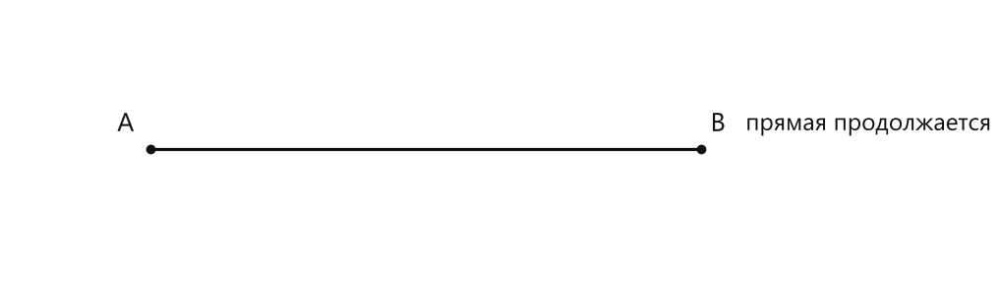
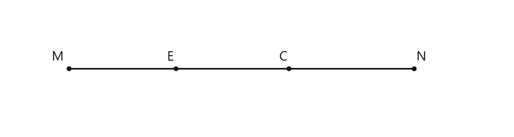
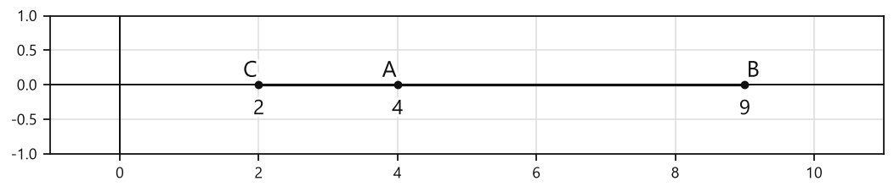

# Занятие 4. Точка, прямая, луч, отрезок, плоскость

**Раздел:** Глава 1. Натуральные числа  
**Параграф учебника:** §4. Точка, прямая, луч, отрезок, плоскость  
**Страницы:** 41–46

## Цели занятия

После занятия ты умеешь:

- различать точку, прямую, луч, отрезок и плоскость;
- правильно обозначать геометрические фигуры;
- понимать, сколько начал и концов имеет каждая фигура;
- применять аксиому о проведении прямой через две точки;
- считать отрезки и лучи систематическим перебором;
- сравнивать координаты точек на координатной прямой.

Выбирай блок по своему уровню:

- **1–2 балла:** узнаю и различаю основные фигуры;
- **3–4 балла:** обозначаю фигуры и применяю определения;
- **5–6 баллов:** решаю задачи на точки, прямые, лучи и отрезки;
- **7–8 баллов:** работаю с координатной прямой;
- **9–10 баллов:** решаю задачи на систематический перебор и объясняю ход решения.

## Теория к занятию

### 1. Точка

#### Простыми словами

Точка показывает положение, но сама «ширины» и «длины» не имеет. На рисунке её обычно изображают маленькой отметкой и обозначают заглавной буквой: $A$, $B$, $O$.

Точка — математический скромняга: места почти не занимает, но без неё остальные фигуры никуда не отправятся.

#### Определение

**Точка — это геометрическая фигура, которая не имеет размеров.**

#### Правила

- Точки обозначают заглавными латинскими буквами.
- Например: точка $A$, точка $M$, точка $O$.
- Не нужно изображать точку большим кружком: кружок может выглядеть как отдельная фигура.

#### Ловушки

- Точка не имеет длины, ширины и высоты.
- Буква обозначает точку, а не её размер.
- $A$ и $B$ — разные точки, если это специально не сказано иначе.

---

### 2. Прямая

#### Простыми словами

Прямая тянется бесконечно в обе стороны. На листе мы рисуем только её часть, а стрелки на концах напоминают: «продолжение следует».

#### Определение

**Прямая — это геометрическая фигура, которая не имеет ни начала, ни конца.**

#### Аксиома

**Через две различные точки можно провести только одну прямую.**

Это важное правило: если заданы две разные точки $A$ и $B$, то через них проходит единственная прямая. Две точки — и маршрут уже определён.

#### Правила

Прямую можно обозначить:

- одной строчной латинской буквой: прямая $a$;
- двумя заглавными буквами точек, лежащих на ней: прямая $AB$.

#### Ловушки

- Прямая не заканчивается на краях тетрадного листа.
- Через одну точку можно провести много прямых.
- Через две различные точки можно провести только одну прямую.

---

### 3. Луч

#### Простыми словами

Луч похож на прямую, у которой появился один старт. Из начальной точки он идёт бесконечно в одном направлении.

#### Определение

**Луч — это часть прямой, которая имеет начало, но не имеет конца.**

#### Правила обозначения

Луч обозначают двумя заглавными буквами:

- первая буква — начало луча;
- вторая буква — любая другая точка луча.

Например, в обозначении луча $AB$ точка $A$ — начало луча, а точка $B$ лежит на этом луче.

#### Ловушки

- В луче важен порядок букв: луч $AB$ и луч $BA$ обычно разные.
- У луча есть начало, но нет конца.
- Две противоположные части прямой с общей начальной точкой образуют разные лучи.

---

### 4. Отрезок

#### Простыми словами

Отрезок — это «кусочек» прямой, ограниченный с двух сторон. У него есть два конца, поэтому он не убегает в бесконечность.

#### Определение

**Отрезок — это часть прямой, которая имеет начало и конец.**

#### Правила

- Отрезок обозначают двумя заглавными буквами его концов: $AB$.
- Порядок букв здесь не меняет отрезок: $AB$ и $BA$ — один и тот же отрезок.
- На рисунке отрезок изображают без стрелок.

#### Ловушки

- Отрезок имеет два конца.
- Луч имеет только одно начало.
- Прямая не имеет ни начала, ни конца.
- Не ставь стрелки на концах отрезка: иначе отрезок превратится в луч или прямую.

---

### 5. Плоскость

#### Простыми словами

Плоскость можно представить как бесконечную ровную поверхность. Лист бумаги помогает её изобразить, но сам лист конечный, а плоскость продолжается за его краями.

#### Определение

**Плоскость — это геометрическая фигура, которая не имеет границ.**

#### Правила

- На рисунке плоскость можно изображать в виде части листа.
- Края рисунка не являются границами плоскости.
- Плоскость может содержать точки, прямые, лучи и отрезки.

#### Ловушки

- Прямоугольник на листе — только изображение части плоскости.
- Плоскость не заканчивается там, где заканчивается рисунок.
- У плоскости нет границ.

---

### 6. Координатная прямая

#### Простыми словами

На прямой можно отметить числа. Сначала отмечают $0$ и $1$, а затем откладывают одинаковые единичные отрезки вправо: получают точки с координатами $2$, $3$, $4$ и так далее.

#### Определение

**Прямую с отмеченными точками, которые изображают числа $0, 1, 2, 3, 4, \dots$, называют координатной прямой, а сами числа называют координатами отмеченных точек.**

Например, запись $M(8)$ означает, что координата точки $M$ равна $8$.

#### Свойство

**На координатной прямой большему числу соответствует точка, расположенная правее, а меньшему — точка, расположенная левее.**

#### Правила

- Сначала отмечают начало отсчёта $0$.
- Затем отмечают единицу $1$.
- Единичные отрезки должны быть одинаковыми.
- Направление от меньших чисел к большим показывают стрелкой.
- Чтобы сравнить точки, сравнивают их координаты.

#### Ловушки

- Правее — значит координата больше.
- Левее — значит координата меньше.
- Нельзя откладывать числа с разными «шагами».
- Точка $A(7)$ правее точки $B(3)$, потому что $7>3$.

---

### 7. Систематический перебор

#### Простыми словами

Если нужно посчитать все отрезки или все варианты, нельзя надеяться на память. Она иногда устраивает выходной именно в самый неподходящий момент. Нужно перебирать варианты по порядку.

#### Алгоритм подсчёта отрезков

1. Выбрать первую точку.
2. Соединить её с каждой из остальных точек.
3. Перейти к следующей точке.
4. Не считать повторно уже записанные отрезки.
5. Проверить, что ни одна пара точек не пропущена.

Например, для точек $A$, $B$, $C$, $D$:

- с точкой $A$: $AB$, $AC$, $AD$;
- с точкой $B$ новые отрезки: $BC$, $BD$;
- с точкой $C$ новый отрезок: $CD$.

Получились отрезки $AB$, $AC$, $AD$, $BC$, $BD$, $CD$.

#### Ловушки

- $AB$ и $BA$ — один и тот же отрезок.
- Нельзя считать один отрезок дважды.
- Если точки лежат на одной прямой, отрезки всё равно определяются любыми двумя точками.
- При подсчёте лучей порядок букв важен: лучи $AB$ и $BA$ различны.

## Сводка формул «выучить наизусть»

В этом параграфе формулы не вводятся.

Нужно помнить:

- точка — нет размеров;
- прямая — нет начала и конца;
- луч — есть начало, нет конца;
- отрезок — есть начало и конец;
- плоскость — нет границ;
- на координатной прямой большее число расположено правее.

## Правила, которые нельзя путать

| Фигура | Начало | Конец |
|---|---:|---:|
| Точка | нет | нет |
| Прямая | нет | нет |
| Луч | есть | нет |
| Отрезок | есть | есть |
| Плоскость | нет границ | нет границ |

- Через две различные точки можно провести только одну прямую.
- В луче первая буква обозначает начало.
- В отрезке порядок букв не важен.
- На координатной прямой правее расположено большее число.

## Разбор ключевых заданий

### Р1. Распознавание геометрических фигур

**Условие.** Определите, какая фигура:

а) не имеет размеров;  
б) не имеет ни начала, ни конца;  
в) имеет начало, но не имеет конца;  
г) имеет начало и конец;  
д) не имеет границ.

**Решение.**

а) Фигура, которая не имеет размеров, — точка.

б) Фигура, которая не имеет ни начала, ни конца, — прямая.

в) Фигура, которая имеет начало, но не имеет конца, — луч.

г) Фигура, которая имеет начало и конец, — отрезок.

д) Фигура, которая не имеет границ, — плоскость.

**Ответ:**  
а) точка;  
б) прямая;  
в) луч;  
г) отрезок;  
д) плоскость.

---

### Р2. Обозначение фигур

**Условие.** Запишите обозначения:

а) точки, названной буквой $M$;  
б) прямой, проходящей через точки $A$ и $B$;  
в) луча с началом в точке $C$, проходящего через точку $D$;  
г) отрезка с концами $K$ и $L$.

**Решение.**

а) Точка обозначается одной заглавной буквой:

$M$.

б) Прямую можно обозначить двумя точками, лежащими на ней:

$AB$.

в) В обозначении луча первой записывают его начало:

$CD$.

г) Отрезок обозначают буквами его концов:

$KL$.

**Ответ:**  
а) $M$;  
б) прямая $AB$;  
в) луч $CD$;  
г) отрезок $KL$.

---

### Р3. Прямые через точки

**Условие.** Даны две различные точки $A$ и $B$. Сколько прямых можно провести через эти точки?

<!--geo-figure-spec
{
  "needed": true,
  "kind": "plane",
  "caption": "Прямая через точки $A$ и $B$",
  "equal": true,
  "axis": false,
  "xlim": [
    -1,
    6
  ],
  "ylim": [
    -1,
    1
  ],
  "points": {
    "A": [
      0,
      0
    ],
    "B": [
      4,
      0
    ]
  },
  "segments": [
    {
      "points": [
        "A",
        "B"
      ],
      "dashed": false,
      "label": "",
      "t": 0.5
    }
  ],
  "polygons": [],
  "circles": [],
  "labels": {
    "A": {
      "dx": -0.18,
      "dy": 0.18
    },
    "B": {
      "dx": 0.12,
      "dy": 0.18
    }
  },
  "texts": [
    {
      "xy": [
        5.2,
        0.18
      ],
      "text": "прямая продолжается"
    }
  ]
}
-->

*Прямая через точки A и B*

**Дано:** точки $A$ и $B$ различны.

**Решение.**

Через две различные точки можно провести только одну прямую.

Следовательно, через точки $A$ и $B$ проходит одна прямая.

**Ответ:** одну прямую.

*Две точки — это уже не «куда угодно», а строгий математический маршрут.*

---

### Р4. Лучи, образованные прямыми

**Условие.** Через точку $O$ провели четыре различные прямые. Сколько лучей образовалось?

**Решение.**

Каждая прямая, проходящая через точку $O$, образует два луча с началом в точке $O$.

Для четырёх прямых получаем:

- первая прямая — $2$ луча;
- вторая прямая — ещё $2$ луча;
- третья прямая — ещё $2$ луча;
- четвёртая прямая — ещё $2$ луча.

Всего:

$2+2+2+2=8$ лучей.

**Ответ:** $8$ лучей.

---

### Р5. Отрезки между точками

**Условие.** На одной прямой отметили пять точек $A$, $B$, $C$, $D$ и $E$. Сколько получилось отрезков?

**Решение.**

Систематически переберём пары точек.

С точкой $A$:

$AB$, $AC$, $AD$, $AE$.

С точкой $B$ новые отрезки:

$BC$, $BD$, $BE$.

С точкой $C$ новые отрезки:

$CD$, $CE$.

С точкой $D$ новый отрезок:

$DE$.

Отрезки $BA$, $CA$, $DA$, $EA$ повторно не записываем: например, $AB$ и $BA$ — один отрезок.

Сосчитаем:

$4+3+2+1=10$.

**Ответ:** $10$ отрезков.

---

### Р6. Точка на отрезке

**Условие.** На отрезке $MN$ отметили две точки $E$ и $C$. Сколько отрезков получилось?

**Дано:** точки расположены на одном отрезке $MN$.

<!--geo-figure-spec
{
  "needed": true,
  "kind": "plane",
  "caption": "Точки на отрезке $MN$",
  "equal": true,
  "axis": false,
  "xlim": [
    -1,
    7
  ],
  "ylim": [
    -1,
    1
  ],
  "points": {
    "M": [
      0,
      0
    ],
    "E": [
      1.7,
      0
    ],
    "C": [
      3.5,
      0
    ],
    "N": [
      5.5,
      0
    ]
  },
  "segments": [
    [
      "M",
      "N"
    ]
  ],
  "polygons": [],
  "circles": [],
  "labels": {
    "M": {
      "dx": -0.18,
      "dy": 0.18
    },
    "E": {
      "dx": -0.08,
      "dy": 0.18
    },
    "C": {
      "dx": -0.08,
      "dy": 0.18
    },
    "N": {
      "dx": 0.12,
      "dy": 0.18
    }
  },
  "texts": []
}
-->

*Точки на отрезке MN*

**Решение.**

Всего отмечены четыре точки: $M$, $E$, $C$, $N$.

Переберём отрезки.

С точки $M$:

$ME$, $MC$, $MN$.

С точки $E$ новые отрезки:

$EC$, $EN$.

С точки $C$ новый отрезок:

$CN$.

Получили:

$ME$, $MC$, $MN$, $EC$, $EN$, $CN$.

Всего $6$ отрезков.

**Ответ:** $6$ отрезков.

---

### Р7. Координаты точек на координатной прямой

**Условие.** На координатной прямой отмечены точки $A(4)$, $B(9)$ и $C(2)$. Какая точка расположена левее всех, а какая — правее всех?

**Дано:**

- координата точки $A$ равна $4$;
- координата точки $B$ равна $9$;
- координата точки $C$ равна $2$.

<!--geo-figure-spec
{
  "needed": true,
  "kind": "plane",
  "caption": "Координатная прямая с точками $A(4)$, $B(9)$ и $C(2)$",
  "equal": true,
  "axis": true,
  "xlim": [
    -1,
    11
  ],
  "ylim": [
    -1,
    1
  ],
  "points": {
    "C": [
      2,
      0
    ],
    "A": [
      4,
      0
    ],
    "B": [
      9,
      0
    ]
  },
  "segments": [
    {
      "points": [
        "C",
        "B"
      ],
      "dashed": false,
      "label": "",
      "t": 0.5
    }
  ],
  "polygons": [],
  "circles": [],
  "labels": {
    "C": {
      "dx": -0.12,
      "dy": 0.2
    },
    "A": {
      "dx": -0.12,
      "dy": 0.2
    },
    "B": {
      "dx": 0.12,
      "dy": 0.2
    }
  },
  "texts": [
    {
      "xy": [
        2,
        -0.35
      ],
      "text": "2"
    },
    {
      "xy": [
        4,
        -0.35
      ],
      "text": "4"
    },
    {
      "xy": [
        9,
        -0.35
      ],
      "text": "9"
    }
  ]
}
-->

*Координатная прямая с точками A(4), B(9) и C(2)*

**Решение.**

Сравним координаты:

$2<4$.

Значит, точка $C(2)$ расположена левее точки $A(4)$.

Также:

$4<9$.

Значит, точка $A(4)$ расположена левее точки $B(9)$.

Получаем порядок слева направо:

$C(2)$, $A(4)$, $B(9)$.

**Ответ:** левее всех расположена точка $C(2)$, правее всех — точка $B(9)$.

---

### Р8. Отметка чисел на координатной прямой

**Условие.** Начертите координатную прямую, приняв за единичный отрезок одну клеточку. Отметьте точки:

$O(0)$, $K(1)$, $L(5)$, $M(8)$.

**Решение.**

1. Отметим точку $O$ с координатой $0$.
2. Справа от неё на расстоянии одной клеточки отметим точку $K(1)$.
3. От точки $K$ отсчитаем ещё четыре одинаковых шага и отметим точку $L(5)$.
4. От точки $O$ отсчитаем восемь одинаковых шагов и отметим точку $M(8)$.
5. Направление от меньших чисел к большим покажем стрелкой вправо.

На координатной прямой точки расположены слева направо так:

$O(0)$, $K(1)$, $L(5)$, $M(8)$.

**Ответ:** точки нужно отметить в порядке $O(0)$, $K(1)$, $L(5)$, $M(8)$; правее всех будет точка $M(8)$.

*Единичный отрезок должен быть одинаковым. Иначе координатная прямая превращается в «прямую с творческим подходом».*

---

### Р9. Сравнение точек на координатной прямой

**Условие.** Какая из точек $P(103)$, $K(101)$, $E(98)$ и $M(89)$ расположена правее других?

**Решение.**

На координатной прямой правее расположена точка с большей координатой.

Сравним координаты:

$89<98<101<103$.

Наибольшая координата — $103$.

Ей соответствует точка $P(103)$.

**Ответ:** точка $P(103)$.

---

### Р10. Перебор вариантов

**Условие.** Сколько двузначных чисел можно составить, используя только цифры $2$, $5$ и $8$? Цифры могут повторяться.

**Решение.**

Сначала выпишем числа, начинающиеся с цифры $2$:

$22$, $25$, $28$.

Затем числа, начинающиеся с цифры $5$:

$52$, $55$, $58$.

Затем числа, начинающиеся с цифры $8$:

$82$, $85$, $88$.

Всего записали:

$3+3+3=9$ чисел.

**Ответ:** $9$ двузначных чисел.

---

## Самопроверка

Проверь себя:

1. У прямой нет начала и конца.
2. У луча есть начало, но нет конца.
3. У отрезка есть два конца.
4. Через две различные точки проходит только одна прямая.
5. На координатной прямой большее число расположено правее.
6. При подсчёте отрезков каждую пару точек нужно учитывать один раз.
7. При подсчёте лучей порядок букв важен.

## Практические задания

Выбери свой уровень и решай только этот блок. В блоке должна закрепиться вся тема параграфа. Ответы не приводятся.

### Уровень 1–2 балла

**С1.** Выберите геометрическую фигуру, которая не имеет размеров:  
1) точка  2) прямая  3) луч  4) отрезок  5) плоскость

**С2.** Выберите геометрическую фигуру, которая имеет начало, но не имеет конца:  
1) точка  2) прямая  3) луч  4) отрезок  5) плоскость

**С3.** Выберите геометрическую фигуру, которая имеет начало и конец:  
1) точка  2) прямая  3) луч  4) отрезок  5) плоскость

**С4.** Выберите геометрическую фигуру, которая не имеет ни начала, ни конца:  
1) точка  2) прямая  3) луч  4) отрезок  5) плоскость

**С5.** Запишите обозначение луча с началом в точке $A$, проходящего через точку $B$.

**С6.** Запишите обозначение отрезка, концами которого являются точки $M$ и $N$.

**С7.** Через точки $A$ и $B$ проведена прямая. Запишите её обозначение.

**С8.** На прямой отмечены точки $A$, $B$ и $C$. Сколько отрезков с концами в этих точках можно составить?

**С9.** На прямой отмечены точки $K$, $L$, $M$ и $N$. Сколько отрезков с концами в этих точках можно составить?

**С10.** Точка $O$ — начало четырёх различных лучей. Сколько всего лучей образовалось?

**С11.** Даны точки $A$, $B$ и $C$, не лежащие на одной прямой. Через каждые две точки проведите прямую. Сколько различных прямых получится?

**С12.** На координатной прямой отмечены точки $A(7)$, $B(3)$ и $C(10)$. Запишите букву точки, расположенной левее двух других.

**С13.** Какая геометрическая фигура не имеет размеров?

1) точка  
2) отрезок  
3) луч  
4) прямая  
5) плоскость

**С14.** Какая геометрическая фигура имеет начало, но не имеет конца?

1) точка  
2) отрезок  
3) луч  
4) прямая  
5) плоскость

**С15.** Выберите все верные утверждения.

1) Прямая имеет начало и конец.  
2) Луч имеет начало, но не имеет конца.  
3) Отрезок имеет начало и конец.  
4) Плоскость имеет границы.  
5) Точка не имеет размеров.

**С16.** На рисунке мысленно отмечены точки $A$, $B$ и $C$, причём точки $A$ и $B$ лежат на одной прямой, а точка $C$ этой прямой не принадлежит. Какая запись верна?

1) $C$ лежит на прямой $AB$  
2) $A$ не лежит на прямой $AB$  
3) $B$ лежит на прямой $AB$  
4) точки $A$ и $B$ не лежат на одной прямой  
5) прямая через точки $A$ и $B$ не существует

**С17.** Сколько различных прямых можно провести через две различные точки $M$ и $N$?

**С18.** На одной прямой отмечены четыре точки $A$, $B$, $C$ и $D$. Сколько различных отрезков с концами в этих точках можно составить?

**С19.** На одной прямой отмечены пять точек $K$, $L$, $M$, $N$ и $P$. Сколько различных отрезков с концами в отмеченных точках можно составить?

**С20.** Из точки $O$ проведены три различные прямые. Сколько лучей с началом в точке $O$ образовалось?

**С21.** Из точки $P$ проведены четыре различные прямые. Сколько лучей с началом в точке $P$ образовалось?

**С22.** Запишите обозначение отрезка, если его концы — точки $A$ и $B$.

**С23.** На координатной прямой точки $K(7)$ и $M(12)$. Какая из точек расположена правее?

1) точка $K$  
2) точка $M$  
3) обе точки расположены в одной точке  
4) определить невозможно  
5) ни одна из точек не лежит на координатной прямой

**С24.** На координатной прямой отмечены точки $A(3)$, $B(9)$ и $C(5)$. Запишите название точки, которая расположена левее двух других.

**С25.** Выберите геометрическую фигуру, которая не имеет ни начала, ни конца:  
1) точка  2) прямая  3) луч  4) отрезок  5) плоскость

**С26.** Выберите геометрическую фигуру, которая имеет начало, но не имеет конца:  
1) точка  2) прямая  3) луч  4) отрезок  5) плоскость

**С27.** Выберите геометрическую фигуру, которая имеет начало и конец:  
1) точка  2) прямая  3) луч  4) отрезок  5) плоскость

**С28.** Запишите, какая геометрическая фигура обозначена двумя точками $A$ и $B$ и всеми точками, расположенными между ними.

**С29.** Запишите, какая геометрическая фигура обозначается одной точкой $O$ и стрелкой, направленной от этой точки.

**С30.** На прямой отмечены точки $A$, $B$, $C$ и $D$. Сколько различных отрезков с концами в этих точках можно составить?

**С31.** На прямой отмечены пять точек. Сколько различных отрезков с концами в этих точках можно составить?

**С32.** Через точку $O$ провели три различные прямые. Сколько лучей с началом в точке $O$ образовалось?

**С33.** Через две различные точки $A$ и $B$ проведены две прямые. Верно ли, что это возможно?

**С34.** Точки $A$, $B$ и $C$ не лежат на одной прямой. Через каждую пару точек проведите прямую. Сколько прямых получится?

**С35.** На координатной прямой отмечены точки $A(7)$, $B(3)$ и $C(10)$. Запишите имя точки, расположенной левее всех.

**С36.** На координатной прямой отмечены точки $K(14)$, $M(9)$ и $P(12)$. Запишите имя точки, расположенной правее всех.

### Уровень 3–4 балла

**С1.** Запишите, какие из названных геометрических фигур имеют начало и конец: точка, прямая, луч, отрезок, плоскость.

**С2.** Точки $A$ и $B$ различны. Сколько прямых можно провести через точки $A$ и $B$? Запишите название этой прямой двумя способами.

**С3.** Запишите, какая геометрическая фигура имеет начало, но не имеет конца: точка, прямая, луч или отрезок.

**С4.** На одной прямой отмечены точки $A$, $B$, $C$, $D$ и $E$. Сколько различных отрезков с концами в этих точках можно составить?

**С5.** Точки $M$ и $N$ лежат на прямой $a$, а точка $K$ не лежит на прямой $a$. Какие из записей верны: $M\in a$, $N\in a$, $K\in a$?

**С6.** Начертите отрезок $AB$. Отметьте точку $C$, не лежащую на прямой $AB$. Проведите через точку $C$ две прямые: одну, пересекающую отрезок $AB$, и другую, не пересекающую отрезок $AB$.

**С7.** На координатной прямой отмечены точки $A(7)$, $B(3)$, $C(10)$ и $D(5)$. Запишите точки в порядке их расположения слева направо.

**С8.** На координатной прямой отмечены точки $K(18)$, $M(12)$, $P(21)$ и $T(9)$. Какая точка расположена правее всех? Какая — левее всех?

**С9.** Начертите координатную прямую, приняв за единичный отрезок одну клеточку. Отметьте точки $O(0)$, $A(2)$, $B(6)$, $C(9)$ и $D(12)$.

**С10.** На координатной прямой точка $A$ имеет координату $14$, а точка $B$ — координату $9$. Какая из точек расположена правее? Запишите соответствующее неравенство для координат этих точек.

**С11.** Точки $A$, $B$ и $C$ не лежат на одной прямой. Через каждую пару этих точек проведите прямую. Сколько различных прямых получится? Запишите их названия.

**С12.** Прямая $a$ пересекает прямую $b$ в точке $O$. Отрезок $CD$ имеет с прямой $a$ общую точку $P$, а с прямой $b$ общих точек не имеет. Какие пары геометрических фигур пересекаются: прямая $a$ и прямая $b$; отрезок $CD$ и прямая $a$; отрезок $CD$ и прямая $b$?

**С13.** Начертите координатную прямую, приняв за единичный отрезок одну клеточку. Отметьте точки $O(0)$, $A(3)$, $B(7)$, $C(10)$ и $D(12)$.

**С14.** На координатной прямой отмечены точки $K(14)$, $L(9)$, $M(17)$ и $N(11)$. Какая из этих точек расположена левее всех, а какая — правее всех?

**С15.** Запишите, какая геометрическая фигура имеет начало, но не имеет конца: точка, прямая, луч, отрезок или плоскость.

**С16.** Запишите, какая геометрическая фигура имеет начало и конец: точка, прямая, луч, отрезок или плоскость.

**С17.** Запишите, какая геометрическая фигура не имеет ни начала, ни конца: точка, прямая, луч, отрезок или плоскость.

**С18.** Начертите точку $A$ и проведите через неё три различные прямые. Сколько лучей образуется с началом в точке $A$?

**С19.** На одной прямой отметьте четыре точки $A$, $B$, $C$ и $D$. Сколько различных отрезков можно получить, если концами отрезков служат отмеченные точки?

**С20.** На одной прямой отметьте пять точек $K$, $L$, $M$, $N$ и $P$. Сколько различных отрезков можно получить, если концами отрезков служат отмеченные точки?

**С21.** Начертите отрезок $AB$. Отметьте на нём точку $C$, расположенную между точками $A$ и $B$. Запишите все отрезки, получившиеся с концами в точках $A$, $B$ и $C$.

**С22.** Начертите отрезок $MN$. Отметьте на нём две точки $K$ и $P$, расположив их между точками $M$ и $N$. Запишите, сколько различных отрезков с концами в отмеченных точках можно получить.

**С23.** Точки $A$, $B$ и $C$ не лежат на одной прямой. Через каждые две из этих точек проведите прямую. Сколько различных прямых получится?

**С24.** Точка $O$ принадлежит прямой $a$. Запишите, сколько лучей с началом в точке $O$ определяет прямая $a$, и обозначьте их буквами $OA$ и $OB$, где точки $A$ и $B$ лежат на прямой $a$ по разные стороны от точки $O$.

**С25.** На координатной прямой отмечены точки $A(12)$, $B(7)$, $C(15)$ и $D(9)$. Запишите точки в порядке их расположения слева направо.

**С26.** На координатной прямой отмечены точки $K(18)$, $L(11)$, $M(20)$ и $N(14)$. Какая из этих точек расположена правее всех, а какая — левее всех?

**С27.** Отметьте точку $O$ и проведите через неё три различные прямые. Сколько лучей с началом в точке $O$ образовалось? Запишите их обозначения, используя для каждой прямой две дополнительные точки.

**С28.** На одной прямой отмечены пять точек $A$, $B$, $C$, $D$ и $E$. Сколько различных отрезков с концами в этих точках можно получить? Перечислите все отрезки.

**С29.** Начертите отрезок $MN$. Отметьте на нём точки $K$ и $P$ так, чтобы точка $K$ находилась между $M$ и $P$, а точка $P$ — между $K$ и $N$. Сколько различных отрезков с концами в точках $M$, $K$, $P$ и $N$ образовалось? Перечислите их.

**С30.** Точки $A$, $B$ и $C$ не лежат на одной прямой. Проведите прямые через каждые две из этих точек. Сколько различных прямых получится? Запишите их обозначения.

**С31.** Точка $K$ не принадлежит прямой $a$. Через точку $K$ проведите:  
1) прямую, пересекающую прямую $a$ в точке $M$;  
2) другую прямую, пересекающую прямую $a$ в точке $N$.  
Сколько различных точек пересечения с прямой $a$ получено?

**С32.** На плоскости отмечены три точки $A$, $B$ и $C$, не лежащие на одной прямой. Через каждые две точки проведите прямую. Сколько различных прямых получится?

**С33.** Начертите плоскость и отметьте на ней точку $A$. Проведите через точку $A$ две различные прямые $m$ и $n$. Отметьте на прямой $m$ точку $B$, отличную от $A$, а на прямой $n$ — точку $C$, отличную от $A$. Запишите названия всех лучей с началом в точке $A$, которые образованы точками $B$ и $C$.

**С34.** На координатной прямой отмечены точки $A(7)$, $B(3)$, $C(10)$ и $D(5)$. Расположите точки слева направо, начиная с самой левой.

**С35.** На координатной прямой отмечены точки $M(12)$, $N(8)$, $P(15)$ и $K(4)$. Какая из точек расположена левее точки $N$, а какая — правее точки $N$? Запишите все подходящие точки.

**С36.** Начертите координатную прямую, приняв за единичный отрезок одну клеточку. Отметьте на ней точки $O(0)$, $A(2)$, $B(6)$, $C(9)$ и $D(12)$. Запишите точки в порядке их расположения справа налево.

### Уровень 5–6 баллов

**С1.** Запишите, какие из перечисленных фигур имеют начало и конец: точка, прямая, луч, отрезок, плоскость.

**С2.** Запишите название геометрической фигуры по описанию:  
а) фигура, которая не имеет размеров;  
б) часть прямой, имеющая начало, но не имеющая конца;  
в) часть прямой, имеющая начало и конец.

**С3.** На одной прямой отмечены точки $A$, $B$, $C$, $D$ и $E$. Сколько различных отрезков можно получить, если любые две отмеченные точки считать концами отрезка?

**С4.** На прямой отмечены четыре точки $K$, $M$, $N$ и $P$. Запишите все отрезки, которые имеют концом точку $K$.

**С5.** Точки $A$, $B$ и $C$ не лежат на одной прямой. Через каждые две точки проведите прямую. Сколько различных прямых получится? Запишите их.

**С6.** Через точку $O$ проведены три различные прямые. Сколько лучей с началом в точке $O$ образовалось?

**С7.** Отметьте точку $O$ и проведите через неё три различные прямые. Сколько лучей с началом в точке $O$ образовалось?

**С8.** Точка $K$ не принадлежит прямой $MN$. Опишите построение прямой, проходящей через точки $K$ и $M$. Пересекает ли эта прямая отрезок $MN$?

**С9.** На координатной прямой отмечены точки $A(6)$, $B(2)$, $C(9)$ и $D(4)$. Запишите точки в порядке их расположения слева направо.

**С10.** На координатной прямой отмечены точки $K(105)$, $M(98)$, $N(101)$ и $P(110)$. Какая точка расположена правее всех? Какая точка расположена левее всех?

**С11.** Начертите координатную прямую, приняв за единичный отрезок одну клеточку. Отметьте на ней точки $O(0)$, $A(1)$, $B(5)$, $C(8)$ и $D(11)$. Запишите точки в порядке возрастания их координат.

**С12.** Выберите все верные утверждения:  
1) Через две различные точки можно провести только одну прямую.  
2) Луч имеет начало и конец.  
3) Отрезок имеет начало и конец.  
4) Прямая имеет начало, но не имеет конца.  
5) На координатной прямой большему числу соответствует точка, расположенная правее.

**С13.** Луч $OA$ и луч $OB$ имеют общее начало $O$ и являются противоположными. Точка $C$ лежит на луче $OA$, а точка $D$ — на луче $OB$. Какие из точек $A$, $B$, $C$, $D$ лежат на одной прямой?

**С14.** Запишите, какие геометрические фигуры имеют начало, но не имеют конца; имеют и начало, и конец; не имеют ни начала, ни конца: точка, прямая, луч, отрезок, плоскость.

**С15.** Точка $M$ лежит между точками $A$ и $B$ на отрезке $AB$. Верно ли утверждение: «Отрезок $AB$ и отрезок $MA$ имеют общую точку $M$»? Запишите правильное утверждение о расположении точки $M$ относительно отрезка $AB$.

**С16.** На координатной прямой отмечены точки $A(4)$, $B(9)$, $C(1)$ и $D(7)$. Запишите точки в порядке расположения слева направо.

**С17.** На координатной прямой отмечены точки $K(12)$, $L(5)$, $M(8)$ и $N(15)$. Какая точка расположена правее всех? Какая — левее всех?

**С18.** Точка $O$ имеет координату $0$, точка $A$ — координату $1$, точка $B$ — координату $6$, точка $C$ — координату $3$, точка $D$ — координату $9$. Запишите все точки, которые расположены правее точки $C$.

**С19.** Верно ли утверждение: «Любые две различные точки определяют единственную прямую»? Запишите ответ и кратко объясните его.

**С20.** Точки $A$ и $B$ лежат на отрезке $MN$, причём точки расположены в порядке $M$, $A$, $B$, $N$. Запишите все отрезки, концами которых являются две из точек $M$, $A$, $B$, $N$.

**С21.** На отрезке $AB$ отмечены точки $C$, $D$ и $E$. Точки расположены в порядке $A$, $C$, $D$, $E$, $B$. На сколько частей эти точки делят отрезок $AB$? Назовите получившиеся части.

**С22.** Укажите, какие из перечисленных объектов являются точками: $A$, $B$, $C$; прямая $m$; луч $CD$; отрезок $EF$; плоскость $\alpha$.

**С23.** Из точки $O$ проведены четыре различных луча: $OA$, $OB$, $OC$ и $OD$. Сколько различных пар лучей можно выбрать? Каждую пару запишите.

**С24.** Точки $P$, $Q$ и $R$ не лежат на одной прямой. Через каждые две из этих точек провели прямую. Сколько различных прямых проведено? Запишите их названия.

**С25.** Отметьте точку $O$. Проведите через неё три различные прямые. Обозначьте прямые $a$, $b$ и $c$. Сколько лучей образовалось? Запишите названия всех лучей, используя точки $A$, $B$, $C$, расположенные соответственно на прямых $a$, $b$, $c$ по одну сторону от точки $O$, и точки $D$, $E$, $F$, расположенные по другую сторону от точки $O$.

**С26.** На одной прямой отмечены пять различных точек $A$, $B$, $C$, $D$ и $E$. Сколько различных отрезков можно получить, если концами отрезка являются любые две из этих точек? Перечислите все отрезки.

**С27.** Определите, о какой геометрической фигуре идёт речь в каждом случае:  
а) фигура не имеет ни начала, ни конца;  
б) часть прямой, имеющая начало, но не имеющая конца;  
в) часть прямой, имеющая начало и конец;  
г) фигура, не имеющая размеров;  
д) фигура, не имеющая границ.

**С28.** На координатной прямой отмечены точки $A(37)$, $B(42)$, $C(29)$, $D(45)$ и $E(31)$.  
а) Какая точка расположена левее всех?  
б) Какая точка расположена правее всех?  
в) Запишите точки в порядке расположения слева направо.

**С29.** Постройте три точки $A$, $B$ и $C$, не лежащие на одной прямой. Через каждую пару точек проведите прямую.  
а) Сколько различных прямых получится?  
б) Сколько различных лучей с началами в точках $A$, $B$ и $C$ можно назвать, используя построенные прямые? Запишите их названия.

**С30.** Начертите координатную прямую, приняв отрезок между точками $O(0)$ и $E(1)$ за единичный. Отметьте на ней точки $A(3)$, $B(6)$, $C(2)$, $D(8)$ и $F(5)$. Запишите:  
а) координаты точек в порядке их расположения слева направо;  
б) точки, расположенные правее точки $C$;  
в) точки, расположенные левее точки $F$.

### Уровень 7–8 баллов

**С1.** Запишите названия всех геометрических фигур, изображённых в описании: точка $A$, прямая $b$, луч $CD$, отрезок $MN$, плоскость $\alpha$. Для каждой фигуры укажите, имеет ли она начало и конец.

**С2.** На одной прямой отмечены пять различных точек $A$, $B$, $C$, $D$ и $E$. Сколько различных отрезков можно получить, если концами отрезков служат отмеченные точки? Обоснуйте, что ни один отрезок не посчитан дважды.

**С3.** Отметьте точку $O$. Проведите через неё пять различных прямых. Сколько лучей образуется? Обозначьте все лучи, используя для каждой прямой свою дополнительную букву.

**С4.** Через три точки $A$, $B$ и $C$ проведены прямые $AB$, $AC$ и $BC$. Известно, что точки $A$, $B$ и $C$ не лежат на одной прямой. Сколько различных прямых проведено? Объясните, почему никакие две из них не совпадают.

**С5.** Точка $K$ не лежит на отрезке $MN$ и не лежит на прямой $MN$. Проведите через точку $K$ прямую, пересекающую отрезок $MN$, и другую прямую через точку $K$, не пересекающую отрезок $MN$. Опишите, чем отличаются положения этих двух прямых.

**С6.** Точки $A$, $B$ и $C$ лежат на одной прямой. Точка $B$ находится между точками $A$ и $C$. Назовите все отрезки, концами которых являются эти точки, и все лучи с началом в точке $B$.

**С7.** Точки $P$ и $Q$ принадлежат прямой $a$, а точка $R$ не принадлежит прямой $a$. Через точки $P$ и $R$ проведена прямая $b$, а через точки $Q$ и $R$ — прямая $c$. Укажите все пары пересекающихся прямых и назовите их точки пересечения.

**С8.** Даны точки $A(17)$, $B(9)$, $C(21)$ и $D(14)$ на координатной прямой. Расположите эти точки слева направо. Запишите получившуюся последовательность точек и обоснуйте порядок.

**С9.** На координатной прямой точки $M$, $N$, $P$ и $Q$ имеют координаты $6$, $15$, $2$ и $11$ соответственно. Какая точка расположена левее всех, какая — правее всех? Запишите точки в порядке возрастания их координат.

**С10.** Начертите координатную прямую, выбрав за единичный отрезок две клетки. Отметьте точки $O(0)$, $A(1)$, $B(4)$, $C(7)$ и $D(10)$. Какие из отмеченных точек находятся от точки $A$ правее неё? Какая из них расположена дальше всего вправо?

**С11.** На координатной прямой отмечены точки $E(35)$, $F(53)$, $G(48)$, $H(30)$ и $K(41)$. Выпишите точки, координаты которых больше координаты точки $G$, а затем точки, координаты которых меньше координаты точки $G$. Расположите все пять точек слева направо.

**С12.** На координатной прямой отмечены точки $K(7)$, $M(3)$, $P(10)$ и $T(5)$. Какая точка расположена левее всех, а какая — правее всех? Запишите точки в порядке расположения слева направо.

**С13.** Известно, что точка $A$ расположена на координатной прямой левее точки $B(8)$, но правее точки $C(3)$. Координата точки $A$ — натуральное число. Запишите все возможные координаты точки $A$.

**С14.** Отметьте точку $O$. Проведите через неё пять различных прямых. На каждой прямой выберите по одной точке, отличной от $O$. Сколько лучей с началом в точке $O$ образовалось? Обозначьте все лучи.

**С15.** На одной прямой отмечены шесть различных точек $A$, $B$, $C$, $D$, $E$, $F$. Сколько различных отрезков с концами в отмеченных точках можно получить? Запишите их количество и объясните способ подсчёта.

**С16.** Точки $A$, $B$ и $C$ не лежат на одной прямой. Через каждую пару этих точек провели прямую. Сколько различных прямых получилось? Назовите их.

**С17.** На плоскости отмечены три точки $A$, $B$ и $C$, не лежащие на одной прямой. Через каждую пару точек провели прямую. Для каждой проведённой прямой рассмотрели отрезок с концами в отмеченных точках и лучи, начало которых находится в одной из отмеченных точек, а другая отмеченная точка лежит на этом луче. Сколько всего получилось различных прямых, отрезков и лучей? Обоснуйте ответ.

**С18.** Изобразите плоскость и отметьте на ней точки $A$, $B$, $C$, $D$ так, чтобы точки $A$, $B$, $C$ лежали на одной прямой, а точка $D$ не лежала на этой прямой. Через каждые две из отмеченных точек проведите прямую. Сколько различных прямых должно получиться? Обоснуйте ответ.

**С19.** Точка $P$ принадлежит отрезку $AB$, но не совпадает с его концами. Запишите все отрезки, которые имеют концами две из точек $A$, $P$, $B$. Какие из записанных отрезков являются частями отрезка $AB$?

**С20.** Даны точки $A$, $B$, $C$, $D$, причём $A$, $B$, $C$ лежат на одной прямой, а точка $D$ не принадлежит этой прямой. Верно ли утверждение: «Через любые две из данных точек можно провести одну и только одну прямую»? Ответ обоснуйте.

**С21.** На координатной прямой отмечены точки $A(14)$, $B(9)$, $C(17)$ и $D(11)$. Запишите точки в порядке расположения слева направо.

**С22.** На координатной прямой отмечены точки $K(38)$, $M(41)$, $P(35)$ и $T(40)$. Какая точка расположена правее всех, а какая — левее всех? Запишите ответ и объясните, каким свойством координатной прямой вы воспользовались.

**С23.** Начертите координатную прямую, выбрав единичный отрезок длиной в одну клетку. Отметьте точки $O(0)$, $A(2)$, $B(5)$, $C(8)$ и $D(10)$. Запишите названия точек в порядке возрастания их координат.

**С24.** На прямой отмечены пять различных точек $A$, $B$, $C$, $D$, $E$. Точка $C$ находится между точками $A$ и $B$, а точка $D$ — между точками $B$ и $E$. Можно ли по этим данным однозначно установить порядок всех пяти точек на прямой? Ответ обоснуйте.

### Уровень 9–10 баллов

**С1.** На прямой отмечены семь различных точек $A$, $B$, $C$, $D$, $E$, $F$ и $G$. Сколько различных отрезков имеют концами эти точки? Запишите общий способ подсчёта, который позволяет не пропустить ни один отрезок и не посчитать один отрезок дважды.

**С2.** На прямой отмечены точки $A$, $B$, $C$, $D$ и $E$ в указанном порядке. Запишите все отрезки, которые содержат точку $C$ и концами которых являются отмеченные точки. Сколько таких отрезков получилось?

**С3.** На одной прямой отмечены семь различных точек $A$, $B$, $C$, $D$, $E$, $F$ и $G$. Точки расположены в порядке $A$, $B$, $C$, $D$, $E$, $F$, $G$. Сколько различных отрезков можно составить, используя эти точки в качестве концов? Сколько среди них отрезков, содержащих точку $D$?

**С4.** Точки $A$, $B$ и $C$ не лежат на одной прямой. Через каждую пару этих точек провели прямую. Сколько прямых проведено? Сколько лучей с началом в точках $A$, $B$ и $C$ образовалось, если на каждой из трёх прямых имеются только две отмеченные точки?

**С5.** Даны отрезок $MN$ и точка $K$, не принадлежащая прямой $MN$. Через точку $K$ проводят различные прямые. Определите, может ли одна из них пересекать отрезок $MN$ в двух различных точках. Ответ обоснуйте, используя определения прямой и отрезка.

**С6.** На плоскости отмечены четыре точки $A$, $B$, $C$ и $D$, причём никакие три из них не лежат на одной прямой. Через каждые две точки проводят прямую. Сколько различных прямых получится? Сколько различных лучей можно назвать, если началом луча является одна из отмеченных точек, а второй точкой задаётся направление луча?

**С7.** Ученик утверждает: «Если точка принадлежит отрезку, то она принадлежит и прямой, содержащей этот отрезок». Другой ученик утверждает: «Если точка принадлежит прямой, то она обязательно принадлежит любому отрезку, лежащему на этой прямой». Определите, какое из утверждений верно, а какое неверно. Для каждого ответа приведите пример или объяснение.

**С8.** Точки $A$, $B$, $C$, $D$ и $E$ расположены на одной прямой. Известно, что точка $C$ находится между точками $A$ и $E$, а точка $D$ — между точками $C$ и $E$. Точка $B$ не совпадает ни с одной из этих точек. Какие варианты расположения точки $B$ возможны относительно точек $A$, $C$, $D$ и $E$? Перечислите все варианты.

**С9.** На координатной прямой отмечены точки $A(17)$, $B(23)$, $C(9)$, $D(31)$ и $E(14)$. Расположите названия точек в порядке слева направо. Затем запишите названия точек в порядке удаления справа налево, начиная с самой правой точки.

**С10.** На координатной прямой отмечены точки $P$, $Q$, $R$, $S$ и $T$. Известно, что $P(28)$ расположена левее $Q$, точка $R$ расположена правее $Q$, точка $S(19)$ расположена левее $P$, а точка $T(35)$ расположена правее $R$. Запишите все координаты, которые могут иметь точки $Q$ и $R$, если их координаты являются натуральными числами, меньшими $35$.

**С11.** На координатной прямой точка $A$ имеет координату $12$, точка $B$ — координату $27$, а точка $C$ расположена правее $A$ и левее $B$. Координата точки $C$ является натуральным числом. Сколько различных положений может занимать точка $C$? Запишите все возможные координаты точки $C$.

**С12.** Используя цифры $2$, $5$ и $8$, составьте все трёхзначные числа, записывая каждую из данных цифр ровно один раз. Расположите полученные числа в порядке возрастания. Объясните, как связаны порядок записи чисел и расположение соответствующих им точек на координатной прямой.

**С13.** Точка $O$ является общей для пяти различных прямых. Сколько лучей образуется с началом в точке $O$? Запишите общее правило для случая, когда через одну точку проведено $n$ различных прямых.

**С14.** Три точки $A$, $B$ и $C$ не лежат на одной прямой. Через каждые две из них провели прямую. Сколько различных прямых и сколько различных лучей с началами в точках $A$, $B$ и $C$ получилось? Обоснуйте, почему при подсчёте лучи не повторяются.

**С15.** На одной прямой отмечены точки $A$, $B$, $C$, $D$, $E$, $F$ и $G$. Сколько различных отрезков можно получить, если концами отрезка являются любые две из отмеченных точек? Сколько среди них имеют концом точку $D$?

**С16.** На плоскости расположены четыре точки $A$, $B$, $C$, $D$, причём никакие три из них не лежат на одной прямой. Через каждые две точки провели прямую. Сколько различных прямых проведено? Сколько различных лучей имеют начало в точке $A$? Сколько отрезков с концами в отмеченных точках можно выделить?

**С17.** На координатной прямой отмечены точки $A(0)$ и $B(1)$. Справа от точки $B$ последовательно отложили ещё пять отрезков, каждый из которых равен отрезку $AB$, и получили точки $C$, $D$, $E$, $F$, $G$. Запишите координаты точек $C$, $D$, $E$, $F$, $G$ и укажите, какая из точек $A$, $D$, $F$ расположена левее двух остальных.

**С18.** На одной прямой отмечены $8$ точек. Из них точки $A$, $B$ и $C$ расположены левее всех остальных, причём $A$ левее $B$, а $B$ левее $C$. Сколько всего различных отрезков имеют концами отмеченные точки? Сколько из них имеют один конец в точке $B$? Сколько отрезков имеют оба конца правее точки $B$?

## Чек-лист «ученик понял тему»

- Могу повторить определения и формулы параграфа своими словами и по учебнику.
- Решаю типовые задания своего уровня без подсказки.
- Вижу типичную ошибку и могу её объяснить.
