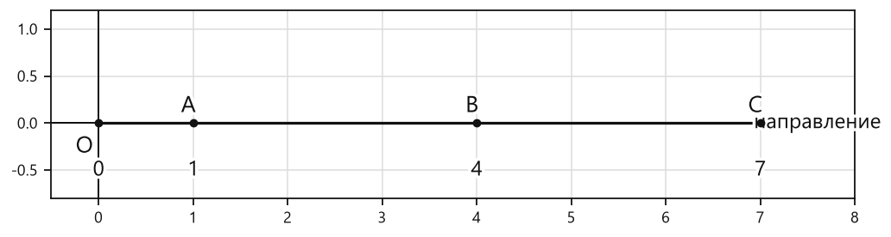
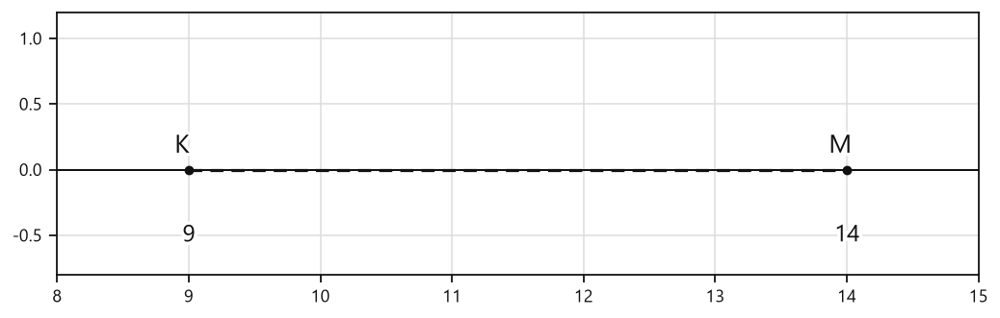
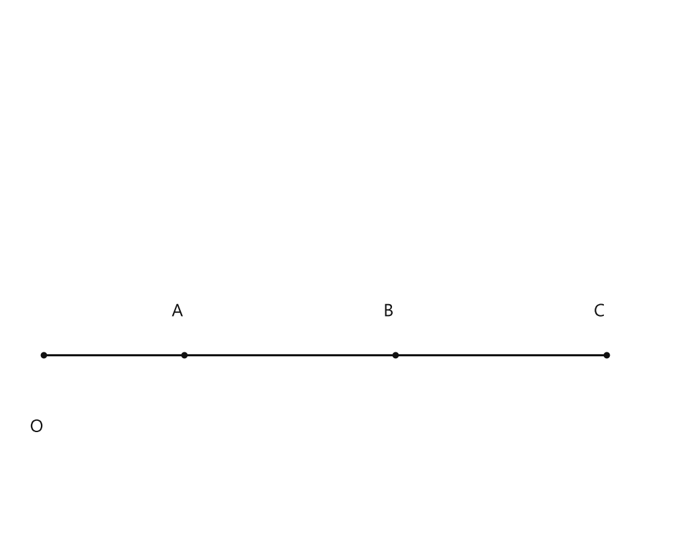
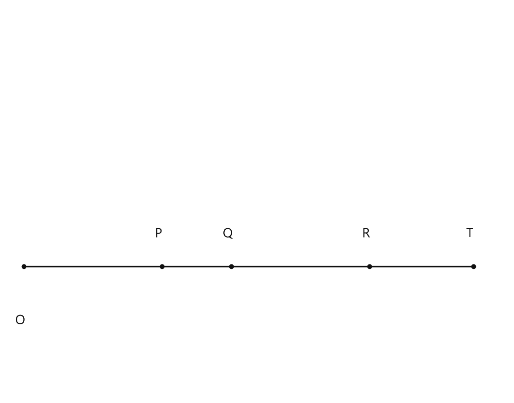
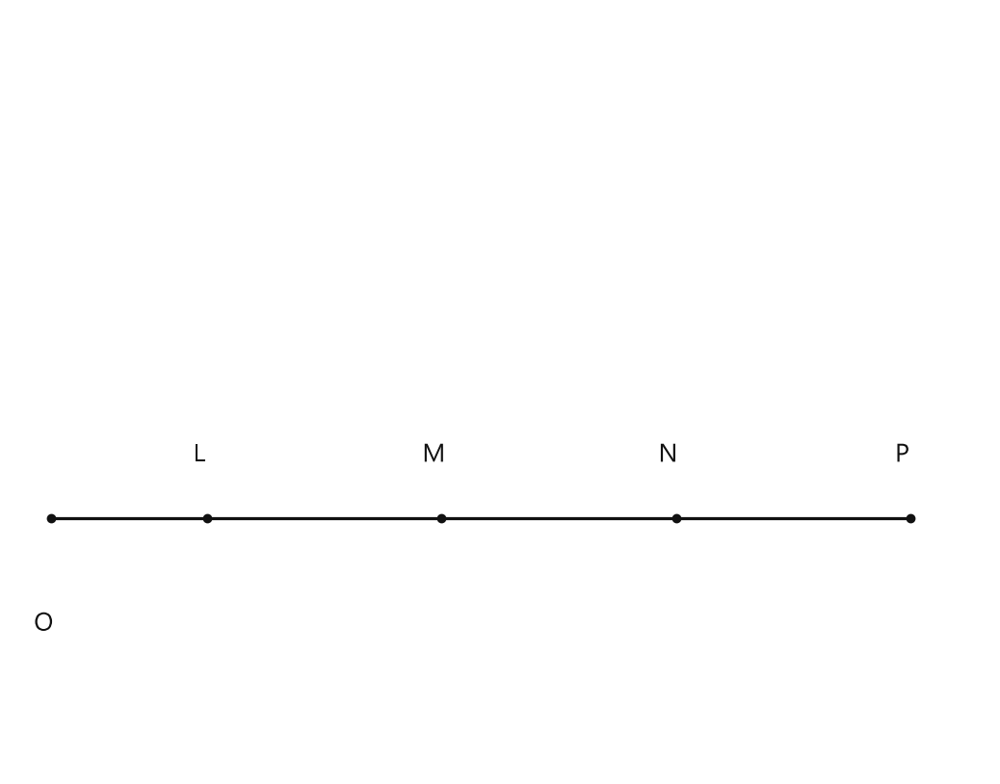
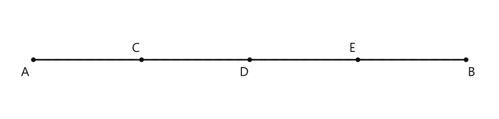

# Занятие 6. Изображение натуральных чисел на координатном луче

**Раздел:** Глава 1. Натуральные числа  
**Параграф учебника:** §6. Изображение натуральных чисел на координатном луче  
**Страницы:** 51–54

## Цели занятия

К концу занятия ученик умеет:

- объяснять, что такое координата точки;
- строить координатный луч;
- выбирать и отмечать единичный отрезок;
- изображать натуральные числа точками на координатном луче;
- находить координаты отмеченных точек;
- сравнивать числа по расположению точек на координатном луче.

Выбери блок своего уровня:

- **1–2 балла:** понять, что такое координатный луч и координата точки;
- **3–4 балла:** строить луч и отмечать на нём числа;
- **5–6 баллов:** находить координаты точек и сравнивать числа;
- **7–8 баллов:** решать задачи на расстояния между точками;
- **9–10 баллов:** уверенно выполнять смешанные задания и объяснять ход решения.

## Теория к занятию

### Координатный луч

#### 1. Простыми словами

Представим луч, который начинается в точке $O$ и направлен вправо. На нём выбираем небольшой отрезок — единичный. Затем откладываем такие отрезки один за другим.

Точка $O$ изображает число $0$, конец первого единичного отрезка — число $1$, следующая точка — число $2$, затем $3$ и так далее.

Получается числовая дорожка. Чем дальше точка от начала вправо, тем больше её число.

#### 2. Определение / факт

**Координата точки** — это число, которое соответствует положению точки на координатном луче. Точке $O$ соответствует число $0$.

Большему из двух чисел на координатном луче соответствует точка, расположенная правее.

#### 3. Формулы

Если единичный отрезок выбран длиной $u$, то точка с координатой $n$ находится на расстоянии

$$n \cdot u$$

от точки $O$.

Здесь:

- $n$ — координата точки;
- $u$ — длина единичного отрезка;
- $n \cdot u$ — расстояние от начала луча до точки.

Например, если одна единица — это две клетки, то точка $7$ находится от начала луча на расстоянии

$$7 \cdot 2 = 14$$

клеток.

Важно: число $7$ — это координата, а $14$ клеток — расстояние в клетках. Не смешиваем их, а то числа начнут жить своей жизнью.

#### 4. Правила

- Точка $O$ имеет координату $0$.
- Чтобы отметить число $1$, нужно отложить один единичный отрезок.
- Чтобы отметить число $n$, нужно отложить $n$ единичных отрезков.
- Если единичный отрезок занимает две клетки, то число $5$ отмечают через $5 \cdot 2=10$ клеток.
- Чем больше координата, тем правее расположена точка.
- Координаты точек записывают в скобках: $A(6)$.

#### 5. Алгоритм построения координатного луча

Чтобы изобразить координатный луч, нужно:

1) построить луч;

2) отметить начало отсчёта (точку $O$) и направление;

3) выбрать единичный отрезок и отметить число $1$.

#### 6. Алгоритм изображения натурального числа

Чтобы отметить на координатном луче какое-либо натуральное число, нужно:

1) от начала отсчёта отложить соответствующее число единичных отрезков;

2) в конце последнего отложенного отрезка поставить заданное число.

#### 7. Ловушки

- **Ловушка 1.** Если единичный отрезок равен двум клеткам, число $4$ ставят не на четвёртой клетке, а на $4\cdot2=8$-й.
- **Ловушка 2.** Точка правее имеет большую координату, а не меньшую.
- **Ловушка 3.** Координата точки $A(7)$ — это $7$, а не количество клеток на рисунке.
- **Ловушка 4.** Точку $O$ не забываем: она соответствует числу $0$. Ноль не убежал, он просто стоит в начале.

### Сравнение чисел на координатном луче

#### 1. Простыми словами

На координатном луче числа выстроены слева направо: $0,1,2,3,\ldots$

Поэтому сравнивать числа можно буквально взглядом:

- точка правее соответствует большему числу;
- точка левее соответствует меньшему числу.

#### 2. Свойство

**Большему из двух чисел на координатном луче соответствует точка, расположенная правее.**

#### 3. Правила

Если точка $A$ расположена левее точки $B$, то её координата меньше:

$$A<B.$$

Если точка $A$ расположена правее точки $B$, то её координата больше:

$$A>B.$$

Если две точки совпадают, их координаты равны.

#### 4. Ловушки

- Неважно, как называются точки: $K$, $M$ или $Z$. Смотрим на их положение.
- Направление луча обязательно указывают стрелкой.
- Если луч направлен вправо, движение вправо означает увеличение чисел.
- Чем длиннее рисунок, тем больше может быть координата, но размер клеток сам по себе число не меняет.

### Расстояние между точками на координатном луче

#### 1. Простыми словами

Если точки имеют координаты $a$ и $b$, то расстояние между ними можно найти подсчётом единичных отрезков.

Например, между точками с координатами $3$ и $8$ помещается:

$$8-3=5$$

единичных отрезков.

#### 2. Правило

Чтобы найти расстояние между точками, нужно из большей координаты вычесть меньшую.

#### 3. Формула

Если $a>b$, то расстояние между точками с координатами $a$ и $b$ равно

$$a-b.$$

#### 4. Ловушки

- Сначала определяем, какая координата больше.
- Расстояние не бывает отрицательным.
- Если единичный отрезок занимает несколько клеток, количество клеток и количество единичных отрезков — разные вещи.

## Сводка формул «выучить наизусть»

Координатная запись точки:

$$A(n).$$

Расстояние от начала луча до точки при длине единичного отрезка $u$:

$$n\cdot u.$$

Расстояние между точками с координатами $a$ и $b$, если $a>b$:

$$a-b.$$

## Правила, которые нельзя путать

- Координата точки — это число, а не название точки.
- Точке $O$ соответствует число $0$.
- Большему числу соответствует точка правее.
- Для изображения числа $n$ откладывают $n$ единичных отрезков.
- Единичный отрезок может занимать одну, две, три и больше клеток.
- Если единичный отрезок занимает две клетки, координата $6$ всё равно остаётся числом $6$, а не $12$.

## Разбор ключевых заданий

### Р1. Построение координатного луча

**Условие.** Начертите координатный луч, приняв за единичный отрезок одну клетку. Отметьте точки $O(0)$, $A(1)$, $B(4)$ и $C(7)$.


<!--geo-figure-spec
{
  "needed": true,
  "kind": "plane",
  "caption": "Координатный луч с точками O(0), A(1), B(4), C(7)",
  "equal": true,
  "axis": true,
  "xlim": [
    -0.5,
    8
  ],
  "ylim": [
    -0.8,
    1.2
  ],
  "points": {
    "O": [
      0,
      0
    ],
    "A": [
      1,
      0
    ],
    "B": [
      4,
      0
    ],
    "C": [
      7,
      0
    ]
  },
  "segments": [
    {
      "points": [
        "O",
        "C"
      ],
      "dashed": false,
      "label": "",
      "t": 0.5
    }
  ],
  "polygons": [],
  "circles": [],
  "labels": {
    "O": {
      "dx": -0.15,
      "dy": -0.25
    },
    "A": {
      "dx": -0.05,
      "dy": 0.18
    },
    "B": {
      "dx": -0.05,
      "dy": 0.18
    },
    "C": {
      "dx": -0.05,
      "dy": 0.18
    }
  },
  "right_angles": [],
  "angle_marks": [],
  "texts": [
    {
      "xy": [
        0,
        -0.5
      ],
      "text": "0"
    },
    {
      "xy": [
        1,
        -0.5
      ],
      "text": "1"
    },
    {
      "xy": [
        4,
        -0.5
      ],
      "text": "4"
    },
    {
      "xy": [
        7,
        -0.5
      ],
      "text": "7"
    },
    {
      "xy": [
        7.6,
        0
      ],
      "text": "направление"
    }
  ]
}
-->


*Координатный луч с точками O(0), A(1), B(4), C(7)*


**Решение.**

1. Строим луч с началом в точке $O$.

2. Ставим стрелку вправо.

3. Так как единичный отрезок равен одной клетке, откладываем по одной клетке.

4. Точке $O$ ставим координату $0$.

5. Через одну клетку отмечаем точку $A(1)$.

6. Через четыре клетки отмечаем точку $B(4)$.

7. Через семь клеток отмечаем точку $C(7)$.

**Ответ:** точки расположены так: $O(0)$, $A(1)$, $B(4)$, $C(7)$.

---

### Р2. Единичный отрезок длиной две клетки

**Условие.** На координатном луче единичный отрезок занимает две клетки. На каком расстоянии от точки $O$ в клетках расположена точка $M(6)$?

**Решение.**

1. Координата точки $M$ равна $6$.

2. Один единичный отрезок занимает $2$ клетки.

3. До точки $M$ нужно отложить $6$ единичных отрезков.

4. Найдём количество клеток:

$$6\cdot2=12.$$

5. Значит, точка $M(6)$ расположена на расстоянии $12$ клеток от точки $O$.

**Ответ:** $12$ клеток.

> Координата равна $6$, а клеток получилось $12$. Это не ошибка, а единичный отрезок решил стать длиннее.

---

### Р3. Нахождение координат точек

**Условие.** Единичный отрезок координатного луча занимает три клетки. От точки $O$ до точки $A$ отложено четыре единичных отрезка, а до точки $B$ — семь единичных отрезков. Запишите координаты точек $A$ и $B$.

**Решение.**

1. Координата точки равна числу отложенных единичных отрезков.

2. До точки $A$ отложено четыре единичных отрезка.

$$A(4).$$

3. До точки $B$ отложено семь единичных отрезков.

$$B(7).$$

4. Длина единичного отрезка здесь не изменяет координаты. Она только влияет на расстояние в клетках.

**Ответ:** $A(4)$, $B(7)$.

---

### Р4. Какая точка расположена правее?

**Условие.** Даны точки $A(7)$, $B(200)$ и $C(49)$. Какая точка расположена на координатном луче правее других? Какая — левее других?

**Решение.**

1. Сравним координаты точек:

$$7<49<200.$$

2. Точке с большей координатой соответствует более правое положение.

3. Наибольшая координата — $200$.

4. Значит, правее всех расположена точка $B(200)$.

5. Наименьшая координата — $7$.

6. Значит, левее всех расположена точка $A(7)$.

**Ответ:** правее всех — $B(200)$; левее всех — $A(7)$.

---

### Р5. Числа справа и слева от точки

**Условие.** Назовите два натуральных числа, расположенных на координатном луче правее точки с координатой $17$, и два натуральных числа, расположенных левее этой точки.

**Решение.**

1. Числа правее $17$ должны быть больше $17$.

2. Подойдут числа $18$ и $19$:

$$18>17,\qquad 19>17.$$

3. Числа левее $17$ должны быть меньше $17$.

4. Подойдут числа $15$ и $16$:

$$15<17,\qquad 16<17.$$

**Ответ:** правее — $18$ и $19$; левее — $15$ и $16$.

---

### Р6. Число между двумя данными числами

**Условие.** Назовите натуральное число, которое находится между числами $30$ и $40$ и расположено ближе к числу $40$.

**Решение.**

1. Искомое число должно быть больше $30$ и меньше $40$.

2. Рассмотрим число $37$:

$$30<37<40.$$

3. Найдём расстояния до концов промежутка:

$$37-30=7,$$

$$40-37=3.$$

4. Так как $3<7$, число $37$ ближе к $40$.

**Ответ:** например, $37$.

---

### Р7. Сравнение чисел по координатному лучу

**Условие.** На координатном луче точка $P$ расположена левее точки $Q$. Координата точки $Q$ равна $12$. Координата точки $P$ — натуральное число. Сравните координаты точек $P$ и $Q$.

**Решение.**

1. Точка $P$ расположена левее точки $Q$.

2. Большему числу соответствует точка правее.

3. Значит, координата точки $P$ меньше координаты точки $Q$.

4. Координата точки $Q$ равна $12$.

5. Поэтому:

$$P<12.$$

**Ответ:** координата точки $P$ меньше $12$.

---

### Р8. Расстояние между точками

**Условие.** На координатном луче отмечены точки $K(9)$ и $M(14)$. Найдите расстояние между ними в единичных отрезках.


<!--geo-figure-spec
{
  "needed": true,
  "kind": "plane",
  "caption": "Координатный луч с точками K(9) и M(14)",
  "equal": true,
  "axis": true,
  "xlim": [
    8,
    15
  ],
  "ylim": [
    -0.8,
    1.2
  ],
  "points": {
    "K": [
      9,
      0
    ],
    "M": [
      14,
      0
    ]
  },
  "segments": [
    {
      "points": [
        "K",
        "M"
      ],
      "dashed": true,
      "label": "",
      "t": 0.5
    }
  ],
  "polygons": [],
  "circles": [],
  "labels": {
    "K": {
      "dx": -0.05,
      "dy": 0.18
    },
    "M": {
      "dx": -0.05,
      "dy": 0.18
    }
  },
  "right_angles": [],
  "angle_marks": [],
  "texts": [
    {
      "xy": [
        9,
        -0.5
      ],
      "text": "9"
    },
    {
      "xy": [
        14,
        -0.5
      ],
      "text": "14"
    }
  ]
}
-->


*Координатный луч с точками K(9) и M(14)*


**Решение.**

1. Большая координата равна $14$.

2. Меньшая координата равна $9$.

3. Вычитаем меньшую координату из большей:

$$14-9=5.$$

4. Между точками $K$ и $M$ помещается $5$ единичных отрезков.

**Ответ:** $5$ единичных отрезков.

---

### Р9. Смешанное задание

**Условие.** На координатном луче единичный отрезок занимает четыре клетки. Отметьте точки $K(1)$, $M(3)$, $C(4)$, $N(5)$ и $A(6)$. Какая точка будет расположена правее всех? На каком расстоянии в клетках от точки $O$ находится точка $A$?

**Решение.**

1. Самая большая координата среди данных точек:

$$6.$$

2. Поэтому правее всех расположена точка $A(6)$.

3. Один единичный отрезок занимает $4$ клетки.

4. До точки $A$ нужно отложить $6$ единичных отрезков.

5. Найдём расстояние в клетках:

$$6\cdot4=24.$$

6. Значит, точка $A$ находится на расстоянии $24$ клеток от точки $O$.

**Ответ:** правее всех расположена точка $A(6)$; расстояние до неё — $24$ клетки.

## Самопроверка

1. Какую координату имеет точка $O$?

2. Какая точка расположена правее: $A(18)$ или $B(13)$?

3. Единичный отрезок занимает две клетки. На каком расстоянии в клетках находится точка $C(8)$?

4. Найдите расстояние между точками с координатами $6$ и $15$.

5. Назовите число между $50$ и $60$, которое ближе к $50$.

### Ответы для самопроверки

1. $0$.

2. $A(18)$.

3. $8\cdot2=16$ клеток.

4. $15-6=9$ единичных отрезков.

5. Например, $53$: до $50$ — $3$, до $60$ — $7$.

## Практические задания

Выбери свой уровень и решай только этот блок. В блоке должна закрепиться вся тема параграфа. Ответы не приводятся.

### Уровень 1–2 балла

**С1.** Начертите координатный луч: отметьте начало отсчёта $O$, направление и единичный отрезок. Отметьте на луче точки $A(2)$, $B(5)$ и $C(8)$.

**С2.** На координатном луче единичный отрезок равен одной клетке. Отметьте точки $M(1)$, $N(4)$, $K(7)$ и $P(10)$.

**С3.** На координатном луче единичный отрезок равен двум клеткам. Отметьте точки $D(3)$, $E(6)$ и $F(9)$.

**С4.** Какая из точек расположена правее: $A(6)$ или $B(9)$?

**С5.** Какая из точек расположена левее: $C(12)$ или $D(7)$?

**С6.** Выберите верное утверждение.

1) Точка с координатой $4$ расположена правее точки с координатой $9$.  
2) Точка с координатой $8$ расположена левее точки с координатой $3$.  
3) Точка с координатой $6$ расположена правее точки с координатой $2$.  
4) Точка с координатой $5$ совпадает с точкой с координатой $7$.  
5) Точка с координатой $1$ расположена правее точки с координатой $10$.

**С7.** Запишите координаты точек в порядке возрастания: $A(11)$, $B(4)$, $C(8)$, $D(2)$.

**С8.** Запишите координаты точек в порядке убывания: $K(3)$, $L(9)$, $M(6)$, $N(12)$.

**С9.** На координатном луче отмечены точки $P(5)$ и $Q(10)$. Назовите любое натуральное число, которое соответствует точке, расположенной между точками $P$ и $Q$.

**С10.** На координатном луче отмечены точки $A(7)$, $B(2)$ и $C(11)$. Какая точка расположена левее всех, а какая — правее всех?

**С11.** На координатном луче единичный отрезок равен трём клеткам. Начертите луч и отметьте точки $R(2)$, $S(5)$ и $T(8)$.

**С12.** Установите соответствие между точкой и её положением на координатном луче.

1. $A(3)$  
2. $B(9)$  
3. $C(6)$  

а) между точками с координатами $2$ и $4$;  
б) между точками с координатами $8$ и $10$;  
в) между точками с координатами $5$ и $7$.

**С13.** На координатном луче точка $A$ имеет координату $7$, а точка $B$ — координату $12$. Какая точка расположена правее?

1) $A$  
2) $B$  
3) точки расположены в одной точке  
4) определить невозможно  
5) точка $O$

**С14.** Какая координата соответствует началу отсчёта на координатном луче?

1) $1$  
2) $0$  
3) $10$  
4) $100$  
5) $-1$

**С15.** На координатном луче единичный отрезок равен $1$ см. На каком расстоянии от начала отсчёта находится точка $C(9)$?

1) $1$ см  
2) $8$ см  
3) $9$ см  
4) $10$ см  
5) $18$ см

**С16.** Выберите точку, которая расположена левее точки $M(15)$.

1) $A(18)$  
2) $B(20)$  
3) $C(15)$  
4) $D(12)$  
5) $E(17)$

**С17.** На координатном луче отмечены точки $P(4)$, $Q(9)$ и $R(6)$. Какая точка расположена между двумя другими?

1) $P$  
2) $Q$  
3) $R$  
4) все три точки  
5) определить невозможно

**С18.** Какое из чисел расположено на координатном луче правее числа $38$?

1) $28$  
2) $18$  
3) $37$  
4) $39$  
5) $8$

**С19.** Запишите координаты точек в порядке возрастания: $A(16)$, $B(5)$, $C(11)$, $D(2)$.

**С20.** Назовите два натуральных числа, которые на координатном луче расположены левее точки с координатой $10$.

**С21.** Назовите два натуральных числа, которые на координатном луче расположены правее точки с координатой $24$.

**С22.** Точка $K$ расположена левее точки $L$, а точка $L$ — левее точки $N$. Запишите точки в порядке расположения слева направо.

**С23.** На координатном луче отмечены точки $A(3)$ и $B(8)$. Какая из них находится ближе к началу отсчёта?

**С24.** Единичный отрезок координатного луча равен $2$ см. На каком расстоянии от начала отсчёта должна быть отмечена точка $T(6)$?

**С25.** Какая точка расположена правее на координатном луче: $A(8)$ или $B(5)$?  
1) $A$ 2) $B$ 3) точки совпадают 4) определить нельзя 5) обе левее точки $O$

**С26.** Какая координата соответствует началу координатного луча?  
1) $1$ 2) $2$ 3) $0$ 4) $10$ 5) $100$

**С27.** Запишите координаты точек $M$, $N$ и $K$, если точка $M$ находится на отметке $3$, точка $N$ — на отметке $7$, а точка $K$ — на отметке $10$.

**С28.** Изобразите координатный луч, приняв за единичный отрезок одну клетку, и отметьте на нём точки $A(2)$, $B(6)$ и $C(9)$.

**С29.** Какая из точек расположена левее других: $P(12)$, $Q(4)$ или $R(9)$?  
1) $P$ 2) $Q$ 3) $R$ 4) точки $P$ и $R$ 5) определить нельзя

**С30.** Запишите любые два натуральных числа, которые на координатном луче расположены правее точки $T(6)$.

**С31.** Запишите любые два натуральных числа, которые на координатном луче расположены левее точки $K(9)$.

**С32.** Точка $A$ имеет координату $4$, а точка $B$ — координату $11$. Какая точка расположена правее и почему?

**С33.** На координатном луче отмечены точки $C(3)$, $D(5)$ и $E(8)$. Какая точка находится между двумя другими?  
1) $C$ 2) $D$ 3) $E$ 4) все три точки 5) определить нельзя

**С34.** Изобразите координатный луч, приняв за единичный отрезок две клетки, и отметьте точки $M(1)$, $N(4)$ и $P(7)$.

**С35.** На координатном луче точка $B$ расположена правее точки $A$, а точка $C$ — правее точки $B$. Сравните координаты точек $A$ и $C$.

**С36.** На координатном луче точка $F(6)$ находится на расстоянии трёх единичных отрезков от точки $G$ слева от неё. Запишите координату точки $G$.

### Уровень 3–4 балла

**С1.** Начертите координатный луч, выбрав единичный отрезок длиной $1$ см. Обозначьте на нём точку $O(0)$ и точки $A(2)$, $B(5)$, $C(8)$.


<!--geo-figure-spec
{
  "needed": true,
  "kind": "plane",
  "caption": "Координатный луч с точками $O(0)$, $A(2)$, $B(5)$, $C(8)$",
  "equal": false,
  "axis": false,
  "xlim": [
    -0.5,
    9
  ],
  "ylim": [
    -0.6,
    1.2
  ],
  "points": {
    "O": [
      0,
      0
    ],
    "A": [
      2,
      0
    ],
    "B": [
      5,
      0
    ],
    "C": [
      8,
      0
    ]
  },
  "segments": [
    {
      "points": [
        "O",
        "C"
      ],
      "dashed": false,
      "label": "",
      "t": 0.5
    }
  ],
  "polygons": [],
  "circles": [],
  "labels": {
    "O": {
      "dx": -0.1,
      "dy": -0.25
    },
    "A": {
      "dx": -0.1,
      "dy": 0.15
    },
    "B": {
      "dx": -0.1,
      "dy": 0.15
    },
    "C": {
      "dx": -0.1,
      "dy": 0.15
    }
  },
  "texts": []
}
-->


*Координатный луч с точками O(0), A(2), B(5), C(8)*


**С2.** Начертите координатный луч и отметьте на нём точки $D(1)$, $E(4)$, $F(7)$, приняв за единичный отрезок отрезок длиной $2$ клетки.

**С3.** На координатном луче отмечены точки $A(6)$, $B(9)$ и $C(3)$. Запишите названия точек в порядке их расположения слева направо.

**С4.** Какая из точек расположена правее на координатном луче: $M(18)$ или $N(15)$? Какая из них расположена левее?

**С5.** Запишите любые два натуральных числа, которые на координатном луче расположены правее точки $K(12)$, и любые два натуральных числа, расположенные левее точки $K(12)$.

**С6.** Начертите координатный луч, выбрав единичный отрезок длиной $1$ см. Отметьте точки $P(4)$, $Q(6)$, $R(10)$ и $T(13)$.


<!--geo-figure-spec
{
  "needed": true,
  "kind": "plane",
  "caption": "Координатный луч с точками $P(4)$, $Q(6)$, $R(10)$, $T(13)$",
  "equal": false,
  "axis": false,
  "xlim": [
    -0.5,
    14
  ],
  "ylim": [
    -0.6,
    1.2
  ],
  "points": {
    "O": [
      0,
      0
    ],
    "P": [
      4,
      0
    ],
    "Q": [
      6,
      0
    ],
    "R": [
      10,
      0
    ],
    "T": [
      13,
      0
    ]
  },
  "segments": [
    {
      "points": [
        "O",
        "T"
      ],
      "dashed": false,
      "label": "",
      "t": 0.5
    }
  ],
  "polygons": [],
  "circles": [],
  "labels": {
    "O": {
      "dx": -0.1,
      "dy": -0.25
    },
    "P": {
      "dx": -0.1,
      "dy": 0.15
    },
    "Q": {
      "dx": -0.1,
      "dy": 0.15
    },
    "R": {
      "dx": -0.1,
      "dy": 0.15
    },
    "T": {
      "dx": -0.1,
      "dy": 0.15
    }
  },
  "texts": []
}
-->


*Координатный луч с точками P(4), Q(6), R(10), T(13)*


**С7.** Назовите любое число, которое на координатном луче расположено между числами $20$ и $30$ и ближе к числу $30$.

**С8.** Назовите любое число, которое на координатном луче расположено между числами $400$ и $500$ и ближе к числу $400$.

**С9.** На координатном луче точка $A$ расположена левее точки $B$, а точка $B$ — левее точки $C$. Сравните координаты точек $A$ и $C$.

**С10.** На координатном луче точка $M$ имеет координату $7$, а точка $N$ расположена правее точки $M$. Запишите два возможных значения координаты точки $N$.

**С11.** Начертите координатный луч, приняв за единичный отрезок отрезок длиной $3$ клетки. Отметьте точки $L(2)$, $M(5)$, $N(8)$ и $P(11)$.


<!--geo-figure-spec
{
  "needed": true,
  "kind": "plane",
  "caption": "Координатный луч с точками $L(2)$, $M(5)$, $N(8)$, $P(11)$",
  "equal": false,
  "axis": false,
  "xlim": [
    -0.5,
    12
  ],
  "ylim": [
    -0.6,
    1.2
  ],
  "points": {
    "O": [
      0,
      0
    ],
    "L": [
      2,
      0
    ],
    "M": [
      5,
      0
    ],
    "N": [
      8,
      0
    ],
    "P": [
      11,
      0
    ]
  },
  "segments": [
    {
      "points": [
        "O",
        "P"
      ],
      "dashed": false,
      "label": "",
      "t": 0.5
    }
  ],
  "polygons": [],
  "circles": [],
  "labels": {
    "O": {
      "dx": -0.1,
      "dy": -0.25
    },
    "L": {
      "dx": -0.1,
      "dy": 0.15
    },
    "M": {
      "dx": -0.1,
      "dy": 0.15
    },
    "N": {
      "dx": -0.1,
      "dy": 0.15
    },
    "P": {
      "dx": -0.1,
      "dy": 0.15
    }
  },
  "texts": []
}
-->


*Координатный луч с точками L(2), M(5), N(8), P(11)*


**С12.** На координатном луче отмечены точки $A(25)$, $B(52)$, $C(18)$, $D(40)$ и $E(7)$. Запишите координаты этих точек в порядке убывания.

**С13.** Начертите координатный луч, выберите единичный отрезок длиной $1$ см и отметьте на нём точки $A(2)$, $B(5)$, $C(8)$ и $D(10)$.

**С14.** Начертите координатный луч, приняв за единичный отрезок $2$ клетки. Отметьте точки $M(1)$, $N(4)$, $K(6)$ и $P(9)$.

**С15.** Начертите координатный луч, приняв за единичный отрезок $3$ клетки. Отметьте точки $E(3)$, $F(5)$, $G(7)$ и $H(10)$.

**С16.** Точки $A$, $B$ и $C$ имеют координаты соответственно $14$, $6$ и $19$. Какая точка расположена на координатном луче правее всех? Какая — левее всех?

**С17.** Сравните числа $28$ и $35$, используя их расположение на координатном луче.

**С18.** На координатном луче точка $M(17)$ расположена левее точки $N$. Координата точки $N$ равна $23$. Какая из точек расположена правее: $M$ или $N$?

**С19.** Назовите два натуральных числа, которые на координатном луче расположены левее точки $K(12)$, и два натуральных числа, расположенных правее этой точки.

**С20.** Назовите какое-нибудь натуральное число, расположенное на координатном луче между числами $24$ и $30$.

**С21.** Назовите какое-нибудь натуральное число, которое на координатном луче расположено между числами $70$ и $80$ и ближе к числу $80$.

**С22.** Точки $A$, $B$ и $C$ расположены на координатном луче так: точка $A$ находится левее точки $B$, а точка $B$ — левее точки $C$. Запишите координаты точек в порядке возрастания, если $A(9)$, $B(15)$ и $C(21)$.

**С23.** На координатном луче отмечены точки $P(4)$, $Q(9)$ и $R(13)$. Какая точка расположена ближе всего к началу отсчёта $O$?

**С24.** На координатном луче отмечены точки $A(3)$, $B(7)$, $C(11)$ и $D(15)$. Запишите координаты двух точек, которые расположены на одинаковом расстоянии от точки $B(7)$.

**С25.** Начертите координатный луч, приняв за единичный отрезок отрезок длиной 1 см. Отметьте на нём точки $A(2)$, $B(5)$, $C(8)$ и $D(10)$.

**С26.** Начертите координатный луч, приняв за единичный отрезок 2 клетки тетради. Отметьте точки $K(1)$, $M(4)$, $P(6)$ и $T(9)$.

**С27.** На координатном луче отмечены точки $A(14)$, $B(9)$ и $C(17)$. Какая из этих точек расположена правее всех? Какая — левее всех?

**С28.** Запишите в порядке возрастания координаты точек: $M(23)$, $N(7)$, $K(15)$, $P(31)$, $T(4)$.

**С29.** Запишите в порядке убывания числа: $18$, $6$, $25$, $11$, $30$.

**С30.** Назовите два натуральных числа, которые на координатном луче расположены левее точки с координатой $8$, и два натуральных числа, расположенных правее этой точки.

**С31.** Назовите какое-нибудь натуральное число, которое на координатном луче расположено между числами $24$ и $30$.

**С32.** Назовите какое-нибудь натуральное число, которое на координатном луче расположено между числами $56$ и $63$ и ближе к числу $63$.

**С33.** На координатном луче точки $A$, $B$ и $C$ расположены так: точка $A$ находится левее точки $B$, а точка $B$ — левее точки $C$. Сравните координаты точек $A$ и $C$.

**С34.** Выберите верное утверждение о координатном луче.  
1) Точке $O$ соответствует число $1$. 2) Большему числу соответствует точка, расположенная левее. 3) Точке $O$ соответствует число $0$. 4) Координатный луч не имеет направления. 5) Единичный отрезок не используют при изображении чисел.

**С35.** На координатном луче отмечены точки $K(3)$, $L(7)$, $M(12)$ и $N(15)$. Какая точка расположена между точками $L$ и $N$? Запишите её координату.

**С36.** Начертите координатный луч, выбрав единичный отрезок длиной 1 см. Отметьте точки $E(4)$, $F(9)$, $H(13)$ и $R(16)$. Запишите координаты точек в порядке их расположения слева направо.

### Уровень 5–6 баллов

**С1.** Начертите координатный луч: отметьте начало отсчёта $O$, направление луча и единичный отрезок длиной $1$ см. Отметьте на луче точки $A(3)$, $B(6)$, $C(9)$ и $D(12)$.

**С2.** Начертите координатный луч, приняв за единичный отрезок две клетки тетради. Отметьте точки $K(2)$, $M(5)$, $N(8)$ и $P(11)$.

**С3.** На координатном луче единичный отрезок равен трём клеткам тетради. Отметьте точки $E(1)$, $F(4)$, $G(7)$ и $H(10)$.

**С4.** Расположите числа $14$, $3$, $21$, $8$, $17$ в порядке возрастания. Запишите координаты точек на координатном луче, расположенных слева направо в таком порядке.

**С5.** Какие из точек расположены правее точки $T(25)$: $A(19)$, $B(30)$, $C(25)$, $D(27)$? Запишите буквы всех подходящих точек.

**С6.** Какие из точек расположены левее точки $K(48)$: $M(50)$, $N(41)$, $P(48)$, $R(36)$? Запишите буквы всех подходящих точек.

**С7.** На координатном луче отмечены точки $A$, $B$ и $C. Точка $A$ имеет координату $16$, точка $B$ расположена правее точки $A$, а точка $C$ — левее точки $A$. Запишите неравенства, связывающие координаты точек $A$, $B$ и $C$.

**С8.** Запишите по два натуральных числа, которые на координатном луче расположены левее числа $12$, и по два натуральных числа, которые расположены правее числа $12$.

**С9.** Запишите по одному натуральному числу, расположенному на координатном луче между числами $7$ и $13$, между числами $24$ и $31$, между числами $105$ и $112$.

**С10.** На координатном луче отмечены точки $P(5)$, $Q(10)$, $R(15)$ и $S(20)$. Какая точка расположена правее всех? Какая точка расположена левее всех? Запишите названия точек и их координаты.

**С11.** Начертите координатный луч и выберите единичный отрезок самостоятельно. Отметьте на нём точки $L(4)$, $M(8)$, $N(12)$ и $P(16)$ так, чтобы все подписи были хорошо видны.

**С12.** На координатном луче точки $A$, $B$, $C$ и $D$ расположены слева направо именно в таком порядке. Координаты точек равны $9$, $14$, $6$ и $18$, но неизвестно, какая координата принадлежит каждой точке. Определите координаты точек $A$, $B$, $C$ и $D$.

**С13.** Начертите координатный луч, приняв за единичный отрезок $1$ клетку. Отметьте на нём точки $A(4)$, $B(8)$, $C(11)$ и $D(15)$.

**С14.** Начертите координатный луч, приняв за единичный отрезок $2$ клетки. Отметьте точки $K(2)$, $L(5)$, $M(7)$ и $N(10)$.

**С15.** Запишите координаты точек в порядке их расположения слева направо на координатном луче: $P(16)$, $Q(3)$, $R(12)$, $S(7)$.

**С16.** Какая из точек расположена правее остальных на координатном луче: $A(205)$, $B(250)$, $C(199)$, $D(225)$?

**С17.** Какая из точек расположена левее остальных на координатном луче: $K(408)$, $L(480)$, $M(84)$, $N(148)$?

**С18.** Запишите два натуральных числа, которые на координатном луче расположены левее точки с координатой $12$, и два натуральных числа, расположенных правее этой точки.

**С19.** Запишите какое-нибудь натуральное число, расположенное на координатном луче между числами $24$ и $31$ и ближе к числу $24$, чем к числу $31$.

**С20.** Запишите какое-нибудь натуральное число, расположенное на координатном луче между числами $70$ и $80$ и ближе к числу $80$, чем к числу $70$.

**С21.** Точки $A$, $B$ и $C$ имеют координаты соответственно $18$, $25$ и $32$. Какая точка расположена между двумя другими? Запишите координату этой точки.

**С22.** На координатном луче точка $M(14)$ расположена левее точки $N$, а точка $N$ расположена левее точки $P(23)$. Запишите возможные координаты точки $N$, если её координата является натуральным числом.

**С23.** На координатном луче отмечены точки $A(6)$, $B(10)$, $C(14)$ и $D(18)$. Назовите две пары точек, удалённых друг от друга на одинаковое расстояние.

**С24.** Начертите координатный луч, выбрав единичный отрезок самостоятельно. Отметьте на нём точки $E(3)$, $F(9)$, $G(12)$ и $H(15)$. Запишите координаты точек в порядке возрастания.

**С25.** Начертите координатный луч, выбрав за единичный отрезок отрезок длиной $1$ см. Отметьте на нём точки $A(3)$, $B(7)$, $C(10)$ и $D(12)$.

**С26.** На координатном луче отмечены точки $K(18)$, $M(5)$ и $P(21)$. Какая из этих точек расположена левее всех, а какая — правее всех?

**С27.** Запишите любые два натуральных числа, которые на координатном луче расположены левее точки $T(9)$, и любые два натуральных числа, расположенные правее точки $T(9)$.

**С28.** На координатном луче отмечены точки $A(4)$ и $B(11)$. Назовите три натуральных числа, координаты точек которых находятся между координатами точек $A$ и $B$.

**С29.** На координатном луче единичный отрезок равен $2$ см. На каком расстоянии от начала отсчёта $O$ расположена точка $C(6)$? Ответ запишите в сантиметрах.

**С30.** Точка $M$ расположена на координатном луче левее точки $N(8)$, а точка $K$ — правее точки $N$. Известно, что координата точки $M$ равна $5$, а координата точки $K$ равна $12$. Запишите точки $M$, $N$, $K$ в порядке их расположения слева направо.

### Уровень 7–8 баллов

**С1.** Начертите координатный луч, выбрав единичный отрезок длиной 8 мм. Отметьте на нём точки $A(3)$, $B(7)$, $C(11)$ и $D(14)$. Запишите координаты точек в порядке их расположения слева направо.

**С2.** Начертите координатный луч, приняв за единичный отрезок 3 клетки. Отметьте точки $M(2)$, $N(5)$, $P(8)$ и $K(12)$. Какие из отмеченных точек находятся правее точки $N$?

**С3.** На координатном луче отмечены точки $A(48)$, $B(305)$, $C(84)$ и $D(150)$. Запишите названия точек:
а) в порядке расположения слева направо;
б) в порядке расположения справа налево.

**С4.** На координатном луче точка $K$ имеет координату $9$. Назовите:
а) два натуральных числа, координаты точек которых расположены левее точки $K$;
б) два натуральных числа, координаты точек которых расположены правее точки $K$;
в) натуральное число, координата которого расположена между координатами чисел $6$ и $9$.

**С5.** Точка $A$ расположена на координатном луче левее точки $B$, а точка $B$ — левее точки $C$. Запишите все возможные знаки сравнения, которые можно поставить вместо пропусков:  
$A\ \square\ B$, $B\ \square\ C$, $A\ \square\ C$.

**С6.** На координатном луче отмечены точки $P(17)$, $Q(23)$ и $R(31)$. Между какими двумя из этих точек можно отметить точку с координатой $26$? Обоснуйте ответ сравнением координат.

**С7.** Единичный отрезок координатного луча равен 2 см. Точка $A$ имеет координату $4$, а точка $B$ — координату $10$. Начертите часть координатного луча от точки $O$ до точки $B$ и укажите длину отрезка $AB$ в сантиметрах.

**С8.** На координатном луче точка $M$ имеет координату $6$, а точка $N$ — координату $14$. Единичный отрезок равен 5 мм. На каком расстоянии друг от друга находятся точки $M$ и $N$? Запишите решение с указанием единиц измерения.

**С9.** Начертите координатный луч, приняв за единичный отрезок отрезок длиной $1$ см. Отметьте на нём точки $A(4)$, $B(9)$, $C(13)$ и $D(17)$. Запишите точки в порядке их расположения слева направо.

**С10.** На координатном луче отмечены точки $K(5)$ и $L(17)$. Точка $M$ расположена между ними и находится от точки $K$ на таком же расстоянии, как точка $L$ от $M$. Найдите координату точки $M$ и объясните, почему она единственная.

**С11.** Ученик начертил координатный луч с единичным отрезком 1 см и отметил точки $A(4)$, $B(9)$ и $C(13)$. Затем он утверждал: «Точка $B$ находится ближе к точке $C$, чем к точке $A$». Верно ли это утверждение? Обоснуйте ответ, сравнив соответствующие расстояния на координатном луче.

**С12.** На координатном луче отмечены точки $A$, $B$, $C$ и $D$. Известно, что $A$ расположена левее $B$, $B$ — левее $C$, а $C$ — левее $D$. Координата точки $A$ равна $7$, координата точки $D$ равна $19$, а расстояния между соседними отмеченными точками равны. Найдите координаты точек $B$ и $C$.

**С13.** На координатном луче точка $A$ расположена левее точки $B$, точка $B$ — левее точки $C$, а точка $C$ — левее точки $D$. Известно, что координата точки $B$ равна $12$, а координата точки $D$ равна $20$. Запишите все возможные натуральные координаты точек $A$ и $C$, если координата точки $A$ меньше координаты точки $C$.

**С14.** На координатном луче отмечены точки $R(7)$ и $S(19)$. Между ними нужно отметить точку с натуральной координатой, которая расположена ближе к точке $S$, чем к точке $R$. Назовите любые три подходящие координаты.

**С15.** Запишите координаты точек $A$, $B$, $C$, $D$ и $E$, если они расположены на координатном луче слева направо, а координата точки $C$ равна $15$. Известно, что соседние точки удалены друг от друга на $4$ единичных отрезка.

**С16.** На координатном луче отмечены точки \(X(3)\), \(Y(11)\) и \(Z(18)\). Точка \(T\) расположена правее точки \(X\), левее точки \(Y\) и имеет натуральную координату. Назовите все возможные координаты точки \(T\).

**С17.** Единичный отрезок координатного луча имеет длину $5$ мм. Точка $H$ имеет координату $16, а точка $K$ — координату $21$. Найдите длину отрезка $HK$ в миллиметрах. Обоснуйте, почему выбранное число единичных отрезков соответствует координатам точек.

**С18.** На координатном луче отмечены точки \(A(5)\), \(B(12)\), \(C(19)\) и \(D(27)\). Какие две точки расположены на одинаковом расстоянии от точки \(B\)? Запишите это расстояние в единичных отрезках.

**С19.** Начертите координатный луч и отметьте точки $F(1)$, $G(6)$, $H(10)$ и $K(15)$, выбрав единичный отрезок самостоятельно. Затем выберите точку с натуральной координатой, которая расположена правее $H$, но левее $K$, и запишите её координату. Назовите все возможные варианты.

**С20.** На координатном луче отмечены точки $A$, $B$, $C$ и $D$ с координатами $8$, $14$, $23$ и $31$ соответственно. Точка $M$ расположена между $B$ и $C$ и находится от точки $B$ на таком же расстоянии, на каком точка $D$ находится от точки $C$. Определите координату точки $M$ и объясните, почему она единственна.

**С21.** Начертите координатный луч, приняв за единичный отрезок отрезок длиной $1$ см. Отметьте на нём точки $A(4)$, $B(11)$, $C(7)$, $D(1)$ и $E(9)$. Запишите координаты этих точек в порядке их расположения слева направо. Укажите, какие из точек находятся правее точки $C$ и какая точка расположена ближе всего к началу отсчёта.

**С22.** На координатном луче единичный отрезок имеет длину $2$ см. Точка $M$ удалена от начала отсчёта на $14$ см, а точка $N$ — на $20$ см. Найдите координаты точек $M$ и $N$. Какая из них расположена правее? Обоснуйте ответ, используя свойство координатного луча.

**С23.** На координатном луче отмечены точки $P(18)$ и $Q(31)$. Назовите все натуральные числа, которые могут быть координатами точки, расположенной между $P$ и $Q$ и ближе к точке $P$, чем к точке $Q$. Объясните, почему других подходящих координат нет.

**С24.** На координатном луче отмечена точка $K(12)$. Найдите координаты двух различных точек, расположенных от точки $K$ на одинаковом расстоянии: одна точка должна находиться левее $K$, а другая — правее $K$. Запишите ещё одну такую пару координат и объясните, как проверить равенство расстояний по единичным отрезкам.

### Уровень 9–10 баллов

**С1.** На координатном луче единичный отрезок имеет длину $2$ см. Точка $A$ расположена на расстоянии $14$ см от начала отсчёта, а точка $B$ — на расстоянии $20$ см от начала отсчёта. Запишите координаты точек $A$ и $B$ и укажите, какая из них расположена правее.

**С2.** На координатном луче отмечены точки $K(4)$, $M(9)$ и $P(15)$. Единичный отрезок равен $3$ клеткам. Сколько клеток содержится между точками $K$ и $P$? Сколько клеток содержится между точками $M$ и $P$?

**С3.** Постройте координатный луч, выбрав единичный отрезок длиной $1$ см. Отметьте на нём точки $A(2)$, $B(5)$, $C(8)$ и $D(11)$. Назовите все пары точек, расстояние между которыми равно $3$ см.

**С4.** На координатном луче точка $T$ расположена левее точки $R$, а точка $R$ — левее точки $S$. Координаты точек $T$ и $S$ — натуральные числа, причём координата точки $T$ равна $17$, а координата точки $S$ равна $23$. Назовите все натуральные числа, которые могут быть координатой точки $R$, если точка $R$ находится между $T$ и $S$.

**С5.** На координатном луче отмечены точки $A(6)$ и $B(14)$. Точка $C$ находится между ними и удалена от точки $A$ на столько же единичных отрезков, на сколько точка $B$ удалена от точки $C$. Определите координату точки $C$.

**С6.** На координатном луче единичный отрезок имеет длину $4$ см. Точка $P$ имеет координату $3$, а точка $Q$ — координату $10$. Найдите расстояние между точками $P$ и $Q$ в сантиметрах.

**С7.** Точка $A$ расположена на координатном луче правее точки $B$ на $5$ единичных отрезков. Координата точки $B$ равна $7$. Какой координатой может обладать точка $A$? Запишите все возможные варианты, если координата точки $A$ — натуральное число, не превосходящее $15$.

**С8.** На координатном луче отмечены точки $M(2)$, $N(6)$, $P(10)$ и $R(14)$. Единичный отрезок равен $5$ мм. Определите, какие из следующих утверждений верны:  
1) расстояние между $M$ и $N$ равно расстоянию между $P$ и $R$;  
2) точка $N$ расположена ближе к точке $R$, чем точка $M$;  
3) расстояние между $M$ и $P$ равно $40$ мм;  
4) точка $P$ расположена левее точки $N$;  
5) расстояние между $N$ и $R$ равно $40$ мм.

**С9.** На координатном луче отмечены точки $A$, $B$, $C$ и $D. Известно, что точка $A$ расположена левее точки $B$, точка $B$ — левее точки $C$, а точка $C$ — левее точки $D$. Координата точки $A$ равна $3$, а координата точки $D$ равна $18$. Назовите три различных варианта координат точек $B$ и $C$, при которых все условия выполняются.

**С10.** На координатном луче единичный отрезок имеет длину $2$ см. Точка $A(4)$ отмечена на луче. Точка $B$ расположена правее точки $A$ на расстоянии $10$ см, а точка $C$ — левее точки $A$ на расстоянии $6$ см. Запишите координаты точек $B$ и $C$.

**С11.** На координатном луче точки $A(6)$ и $B(14)$ отмечены так, что отрезок $AB$ разделён на четыре равных отрезка точками $C$, $D$ и $E$, расположенными в указанном порядке от $A$ к $B$. Запишите координаты точек $C$, $D$ и $E$.


<!--geo-figure-spec
{
  "needed": true,
  "kind": "plane",
  "caption": "Часть координатного луча с точками $A$, $C$, $D$, $E$, $B$",
  "equal": true,
  "axis": false,
  "xlim": [
    -0.5,
    8.5
  ],
  "ylim": [
    -1,
    1
  ],
  "points": {
    "A": [
      0,
      0
    ],
    "C": [
      2,
      0
    ],
    "D": [
      4,
      0
    ],
    "E": [
      6,
      0
    ],
    "B": [
      8,
      0
    ]
  },
  "segments": [
    [
      "A",
      "B"
    ],
    {
      "points": [
        "A",
        "C"
      ],
      "dashed": true,
      "label": "",
      "t": 0.5
    },
    {
      "points": [
        "C",
        "D"
      ],
      "dashed": true,
      "label": "",
      "t": 0.5
    },
    {
      "points": [
        "D",
        "E"
      ],
      "dashed": true,
      "label": "",
      "t": 0.5
    },
    {
      "points": [
        "E",
        "B"
      ],
      "dashed": true,
      "label": "",
      "t": 0.5
    }
  ],
  "polygons": [],
  "circles": [],
  "labels": {
    "A": {
      "dx": -0.15,
      "dy": -0.25
    },
    "C": {
      "dx": -0.1,
      "dy": 0.2
    },
    "D": {
      "dx": -0.1,
      "dy": -0.25
    },
    "E": {
      "dx": -0.1,
      "dy": 0.2
    },
    "B": {
      "dx": 0.1,
      "dy": -0.25
    }
  },
  "right_angles": [],
  "angle_marks": [],
  "texts": []
}
-->


*Часть координатного луча с точками A, C, D, E, B*


**С12.** На координатном луче отмечены точки $A(4)$, $B(9)$, $C(16)$ и $D(21)$. Известно, что единичный отрезок имеет длину $3$ см. Среди отрезков $AB$, $BC$, $CD$ и $AD$ выберите все те, длина которых является целым числом сантиметров и не превышает $25$ см.

**С13.** На координатном луче отмечены точки $K(8)$, $L(13)$, $M(21)$ и $N(34)$. Запишите названия точек в порядке их расположения слева направо. Затем назовите точку, наиболее удалённую от точки $K$.

**С14.** На координатном луче отмечены точки $A(11)$ и $B(25)$. Между ними нужно отметить точку $M$ с натуральной координатой так, чтобы отрезки $AM$ и $MB$ состояли из одинакового числа единичных отрезков. Определите координату точки $M$ и объясните, почему такая точка единственна.

**С15.** На координатном луче точки $A(3)$ и $B(15)$ являются концами отрезка. Точка $C$ расположена между ними и делит отрезок $AB$ на две части так, что расстояние от $A$ до $C$ в два раза меньше расстояния от $C$ до $B$. Найдите координату точки $C$.

**С16.** Для каждого пункта укажите все натуральные числа, координаты которых удовлетворяют условию:

а) число расположено правее точки $A(12)$ и левее точки $B(17)$;

б) число расположено левее точки $C(5)$;

в) число расположено правее точки $D(9)$, но левее точки $E(10)$.

**С17.** На координатном луче отмечены точки $A$, $B$, $C$ и $D$. Точка $A$ имеет координату $4$. Отрезки $AB$, $BC$ и $CD$ равны, а точка $D$ имеет координату $19$. Запишите координаты точек $B$ и $C$. Укажите единичный отрезок, если длина отрезка $AD$ на рисунке равна $15$ см.

```geo-figure
{
  "needed": true,
  "kind": "plane",
  "caption": "Часть координатного луча с равными отрезками $AB$, $BC$ и $CD$",
  "equal": true,
  "axis": false,
  "xlim": [-0.5, 8.5],
  "ylim": [-1, 1],
  "points": {
    "A": [0, 0],
    "B": [2.5, 0],
    "C": [5, 0],
    "D": [7.5, 0]
  },
  "segments": [
    ["A", "B"],
    ["B", "C"],
    ["C", "D"]
  ],
  "polygons": [],
  "circles": [],
  "labels": {
    "A": {"dx": -0.15, "dy": -0.25},
    "B": {"dx": -0.1, "dy": 0.2},
    "C": {"dx": -0.1, "dy": -0.25},
    "D": {"dx": 0.1, "dy": 0.2}
  },
  "right_angles": [],
  "angle_marks": [],
  "texts": []
}

**С18.** На координатном луче единичный отрезок имеет длину $3$ см. Точка $A$ имеет координату $6$, а точка $B$ расположена правее точки $A$ и имеет координату $14$. На этом же луче отметьте точку $C$, расположенную правее точки $B$, так, чтобы отрезок $BC$ состоял из двух отрезков, равных $AB$. Найдите координату точки $C$ и укажите, какая из точек $A$, $B$, $C$ расположена между двумя другими.

## Чек-лист «ученик понял тему»

- Могу повторить определения и формулы параграфа своими словами и по учебнику.
- Решаю типовые задания своего уровня без подсказки.
- Вижу типичную ошибку и могу её объяснить.
