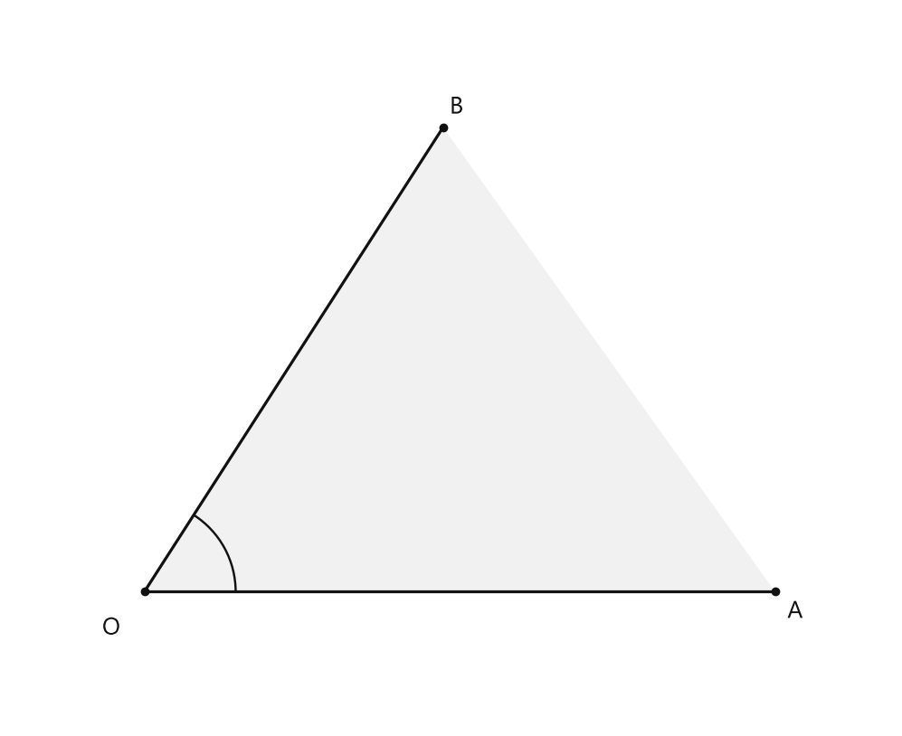
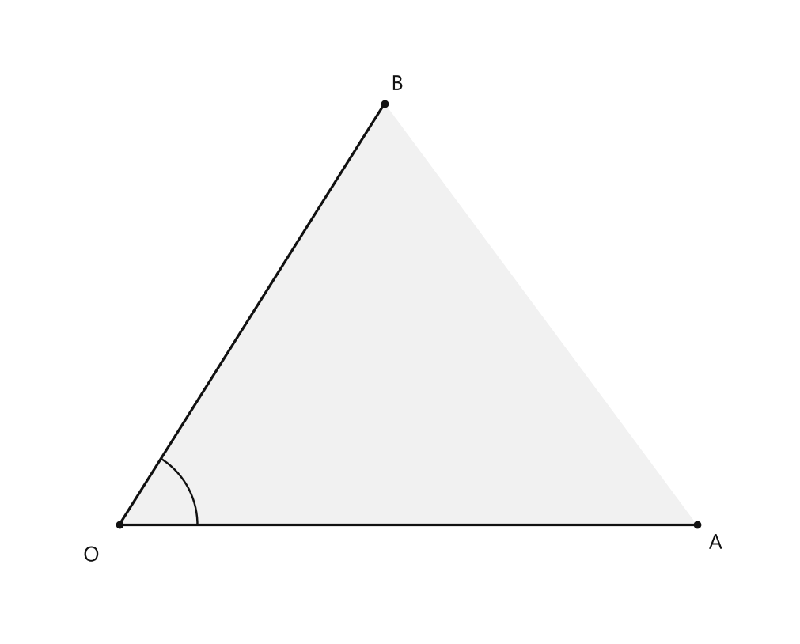
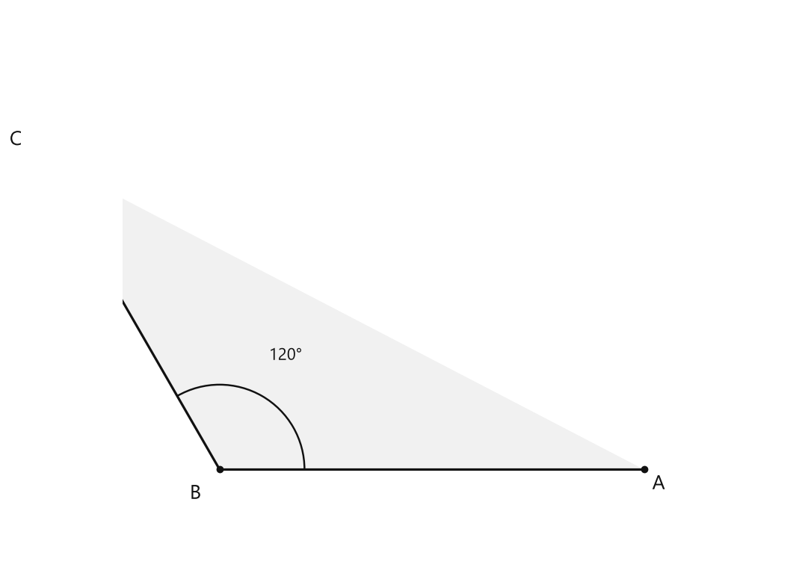
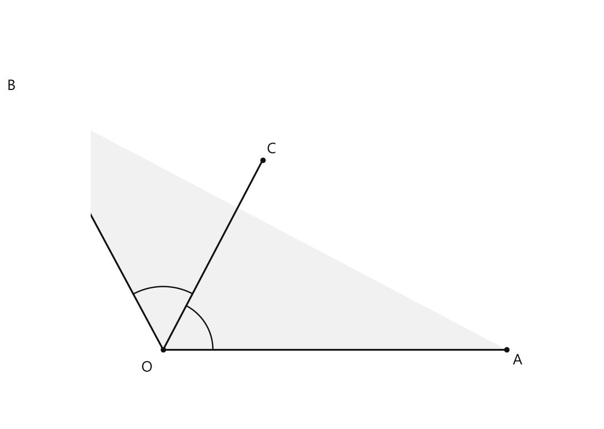

# Занятие 22. Угол. Измерение и построение углов

**Раздел:** Глава 2. Выражения. Уравнения  
**Параграф учебника:** §20. Угол. Измерение и построение углов  
**Страницы:** 141–149

## Цели занятия

После занятия ты умеешь:

- распознавать угол, называть его вершину и стороны;
- различать развёрнутый, прямой, острый и тупой углы;
- измерять углы транспортиром;
- строить углы заданной величины;
- находить градусные меры частей прямого и развёрнутого углов;
- строить и распознавать биссектрису угла.

Выбирай блок по силам:

- **1–2 балла:** узнать виды углов и назвать элементы угла;
- **3–4 балла:** измерить и построить углы;
- **5–6 баллов:** применить свойства углов;
- **7–8 баллов:** решить задачи с уравнениями;
- **9–10 баллов:** уверенно выполнить все типы заданий и объяснить решение.

---

## Теория к занятию

### 1. Что такое угол

#### Простыми словами

Смотри: два луча выходят из одной точки. Общая точка — вершина, сами лучи — стороны. Вместе с частью плоскости между ними они образуют угол. Угол — это не только «галочка» из двух линий, а фигура целиком. Геометрия любит считать всё, даже пространство между лучами.

#### Определение

**Фигура, образованная двумя лучами с общим началом и частью плоскости, которую они ограничивают, называется углом.**

Угол с вершиной $O$ и сторонами $OA$ и $OB$ обозначают так:

$$\angle AOB$$

или

$$\angle BOA$$

Вершина всегда записывается **в середине обозначения**.

<!--geo-figure-spec
{
  "needed": true,
  "kind": "plane",
  "caption": "Угол $AOB$",
  "equal": true,
  "axis": false,
  "xlim": [
    -0.8,
    4.5
  ],
  "ylim": [
    -0.8,
    3.5
  ],
  "points": {
    "O": [
      0,
      0
    ],
    "A": [
      3.8,
      0
    ],
    "B": [
      1.8,
      2.8
    ]
  },
  "segments": [
    {
      "points": [
        "O",
        "A"
      ],
      "dashed": false,
      "label": "",
      "t": 0.55
    },
    {
      "points": [
        "O",
        "B"
      ],
      "dashed": false,
      "label": "",
      "t": 0.55
    }
  ],
  "polygons": [
    {
      "vertices": [
        "O",
        "A",
        "B"
      ],
      "fill": 0.06
    }
  ],
  "circles": [],
  "labels": {
    "O": {
      "dx": -0.2,
      "dy": -0.22
    },
    "A": {
      "dx": 0.12,
      "dy": -0.12
    },
    "B": {
      "dx": 0.08,
      "dy": 0.12
    }
  },
  "right_angles": [],
  "angle_marks": [
    {
      "vertex": "O",
      "from": "A",
      "to": "B",
      "text": "",
      "radius": 0.55
    }
  ],
  "texts": []
}
-->

*Угол AOB*

#### Правила

- Вершина угла — общая точка двух лучей.
- Стороны угла — лучи, выходящие из вершины.
- В обозначении угла вершина стоит **посередине**.
- $\angle AOB$ и $\angle BOA$ — один и тот же угол.
- Запись $\angle AOB$ нельзя читать как «угол $A$» или «угол $B$»: вершина здесь $O$.

#### Ловушки

- Перепутать вершину и точку на стороне.
- Записать вершину не в середине.
- Назвать углом только два луча, забыв часть плоскости между ними.

---

### 2. Развёрнутый угол и градус

#### Простыми словами

Если стороны угла лежат на одной прямой и направлены в противоположные стороны, угол как будто «раскрылся на максимум». Это развёрнутый угол.

#### Определение

**Угол, стороны которого образуют прямую, называется развёрнутым.**

Развёрнутый угол содержит:

$$180^\circ$$

Градус — единица измерения углов. Развёрнутый угол мысленно разделён на $180$ равных частей, каждая часть равна $1^\circ$.

#### Правила

- Развёрнутый угол равен $180^\circ$.
- Если развёрнутый угол разделён на части, сумма их градусных мер равна $180^\circ$.
- Лучи, образующие развёрнутый угол, являются противоположными лучами.

#### Ловушки

- Развёрнутый угол — не $360^\circ$. $360^\circ$ соответствует полному обороту, а это сейчас не требуется.
- Не путай развёрнутый угол с прямым: развёрнутый — $180^\circ$, прямой — $90^\circ$.

---

### 3. Биссектриса и прямой угол

#### Простыми словами

Биссектриса — это луч, который делит угол пополам. Не «примерно пополам», а на два равных угла. Геометрия здесь строгая: половинка должна быть настоящей половинкой.

#### Определение

**Биссектрисой угла называют луч, который:**
1) выходит из вершины угла;
2) делит его на два равных угла.

Если угол равен $80^\circ$, то его биссектриса делит его на два угла:

$$80^\circ : 2 = 40^\circ$$

#### Определение

**Каждый из углов, на которые биссектриса развёрнутого угла делит его, называется прямым углом.**

#### Замечание

**Прямой угол содержит $90^\circ$.**

#### Свойства

- Биссектриса развёрнутого угла делит его на два прямых угла.
- Развёрнутый угол состоит из двух прямых углов:

$$180^\circ = 90^\circ + 90^\circ$$

- Если луч делит угол на два равных угла, этот луч является биссектрисой.

#### Ловушки

- Биссектриса выходит именно из вершины.
- Она делит угол на равные углы, а не стороны на равные отрезки.
- Половина развёрнутого угла — $90^\circ$, а не $100^\circ$. Тут калькулятор не виноват, виновата спешка.

---

### 4. Виды углов

#### Простыми словами

Вид угла определяют сравнением с прямым и развёрнутым углами.

#### Определение

**Угол, который меньше прямого, называется острым.**

**Угол, который больше прямого, но меньше развёрнутого, называется тупым.**

#### Таблица видов углов

| Вид угла | Градусная мера |
|---|---:|
| Острый | меньше $90^\circ$ |
| Прямой | $90^\circ$ |
| Тупой | больше $90^\circ$, но меньше $180^\circ$ |
| Развёрнутый | $180^\circ$ |

#### Правила

Чтобы определить вид угла:

1. Узнай его градусную меру.
2. Сравни её с $90^\circ$ и $180^\circ$.
3. Назови вид угла.

Например:

- $35^\circ < 90^\circ$ — угол острый;
- $90^\circ$ — угол прямой;
- $125^\circ$ больше $90^\circ$, но меньше $180^\circ$ — угол тупой;
- $180^\circ$ — угол развёрнутый.

#### Ловушки

- Угол $90^\circ$ не острый и не тупой, а прямой.
- Угол $180^\circ$ не тупой, а развёрнутый.
- Угол $0^\circ$ в этом параграфе не относят к основным четырём видам.

---

### 5. Измерение угла транспортиром

#### Простыми словами

Транспортир — это линейка для углов. У него две шкалы, поэтому главное — начать отсчёт с правильного нуля. Иначе можно получить не угол, а математический сюрприз.

#### Правило

**Чтобы измерить угол с помощью транспортира, нужно:**
1. Совместить вершину транспортира с вершиной угла, а сторону транспортира — с одной из сторон угла.
2. Вторая сторона покажет величину угла. Назвать его величину, отсчитав количество градусов от нуля.

#### Алгоритм измерения

1. Найди вершину угла.
2. Поставь центр транспортира на вершину.
3. Совмести одну сторону угла с линией $0^\circ$.
4. Выбери шкалу, которая начинается с этого нуля.
5. Посмотри, на какой отметке находится вторая сторона.
6. Запиши градусную меру угла.

#### Ловушки

- Если сторона угла совпала с нулём внутренней шкалы, считай по внутренней шкале.
- Если сторона совпала с нулём внешней шкалы, считай по внешней шкале.
- Не начинай отсчёт с $180^\circ$ только потому, что другая шкала красиво под рукой.
- Центр транспортира должен совпадать с вершиной угла.

---

### 6. Построение угла транспортиром

#### Простыми словами

Чтобы построить угол, сначала рисуем одну сторону, затем откладываем нужное количество градусов и проводим вторую сторону.

#### Правило

**Чтобы построить угол, нужно:**
1. Провести луч (сторону угла).
2. Совместить начало луча с вершиной транспортира.
3. Совместить сторону транспортира со стороной угла.
4. Отсчитать по транспортиру нужное число градусов, поставить точку.
5. Соединить вершину угла с отмеченной точкой.

#### Алгоритм

Построим угол $ABC$, равный $70^\circ$.

1. Проведём луч $BA$.
2. Совместим вершину транспортира с точкой $B$.
3. Совместим луч $BA$ с отметкой $0^\circ$.
4. На шкале отметим точку $C$ напротив $70^\circ$.
5. Проведём луч $BC$.

Получили:

$$\angle ABC = 70^\circ$$

#### Ловушки

- Отметку нужно ставить на нужной шкале.
- Второй луч проводят именно из вершины.
- Если нужно построить $130^\circ$, нельзя поставить точку на $50^\circ$: это другой угол.

---

## Сводка формул «выучить наизусть»

$$180^\circ \text{ — развёрнутый угол}$$

$$90^\circ \text{ — прямой угол}$$

$$\text{половина развёрнутого угла}=180^\circ:2=90^\circ$$

Если угол разделён на части:

$$\text{весь угол}=\text{сумма его частей}$$

Если угол разделён биссектрисой:

$$\text{каждая часть}=\text{весь угол}:2$$

---

## Правила, которые нельзя путать

- Вершина угла записывается в середине обозначения.
- Острый угол меньше $90^\circ$.
- Прямой угол равен $90^\circ$.
- Тупой угол больше $90^\circ$, но меньше $180^\circ$.
- Развёрнутый угол равен $180^\circ$.
- Биссектриса выходит из вершины и делит угол на два равных угла.
- При измерении транспортиром отсчёт начинают от нулевой отметки, совпавшей со стороной угла.

---

# Разбор ключевых заданий

## Р1. Название угла и его элементы

**Условие.** Лучи $OA$ и $OB$ имеют общее начало в точке $O$ и образуют угол. Назовите угол, его вершину и стороны.

<!--geo-figure-spec
{
  "needed": true,
  "kind": "plane",
  "caption": "Угол $AOB$",
  "equal": true,
  "axis": false,
  "xlim": [
    -0.7,
    4.3
  ],
  "ylim": [
    -0.7,
    3.3
  ],
  "points": {
    "O": [
      0,
      0
    ],
    "A": [
      3.7,
      0
    ],
    "B": [
      1.7,
      2.7
    ]
  },
  "segments": [
    [
      "O",
      "A"
    ],
    [
      "O",
      "B"
    ]
  ],
  "polygons": [
    {
      "vertices": [
        "O",
        "A",
        "B"
      ],
      "fill": 0.06
    }
  ],
  "circles": [],
  "labels": {
    "O": {
      "dx": -0.18,
      "dy": -0.2
    },
    "A": {
      "dx": 0.12,
      "dy": -0.12
    },
    "B": {
      "dx": 0.08,
      "dy": 0.12
    }
  },
  "right_angles": [],
  "angle_marks": [
    {
      "vertex": "O",
      "from": "A",
      "to": "B",
      "text": "",
      "radius": 0.5
    }
  ],
  "texts": []
}
-->

*Угол AOB*

**Решение.**

1. Общая точка лучей $OA$ и $OB$ — точка $O$.
2. Значит, точка $O$ — вершина угла.
3. Стороны угла — лучи $OA$ и $OB$.
4. Вершину записываем в середине обозначения.

$$\angle AOB=\angle BOA$$

**Ответ:** угол $AOB$; вершина — $O$; стороны — лучи $OA$ и $OB$.

---

## Р2. Определение вида угла

**Условие.** Определите вид углов, величины которых равны $25^\circ$, $90^\circ$, $146^\circ$ и $180^\circ$.

**Решение.**

### Угол $25^\circ$

$$25^\circ<90^\circ$$

Значит, угол острый.

### Угол $90^\circ$

Угол, равный $90^\circ$, является прямым.

### Угол $146^\circ$

$$90^\circ<146^\circ<180^\circ$$

Значит, угол тупой.

### Угол $180^\circ$

Угол, равный $180^\circ$, является развёрнутым.

**Ответ:** $25^\circ$ — острый угол; $90^\circ$ — прямой угол; $146^\circ$ — тупой угол; $180^\circ$ — развёрнутый угол.

---

## Р3. Измерение угла транспортиром

**Условие.** При измерении угла вершина совпала с центром транспортира, одна сторона — с нулевой отметкой, а вторая сторона прошла через отметку $65^\circ$. Найдите градусную меру угла и определите его вид.

**Решение.**

1. Одна сторона угла совмещена с нулевой отметкой транспортира.
2. Вторая сторона показывает отметку:

$$65^\circ$$

3. Следовательно, градусная мера угла равна $65^\circ$.
4. Сравним:

$$65^\circ<90^\circ$$

5. Значит, угол острый.

**Ответ:** $65^\circ$; угол острый.

> Главное — не считать с противоположного нуля. У транспортира две шкалы, и обе уверены, что именно они главные.

---

## Р4. Построение угла

**Условие.** Постройте угол $ABC$, равный $120^\circ$, с помощью транспортира. Определите его вид.

<!--geo-figure-spec
{
  "needed": true,
  "kind": "plane",
  "caption": "Угол $ABC=120^\\circ$",
  "equal": true,
  "axis": false,
  "xlim": [
    -0.8,
    4.8
  ],
  "ylim": [
    -0.8,
    3.8
  ],
  "points": {
    "B": [
      0,
      0
    ],
    "A": [
      3.5,
      0
    ],
    "C": [
      -1.5,
      2.6
    ]
  },
  "segments": [
    [
      "B",
      "A"
    ],
    [
      "B",
      "C"
    ]
  ],
  "polygons": [
    {
      "vertices": [
        "B",
        "A",
        "C"
      ],
      "fill": 0.06
    }
  ],
  "circles": [],
  "labels": {
    "A": {
      "dx": 0.12,
      "dy": -0.12
    },
    "B": {
      "dx": -0.2,
      "dy": -0.2
    },
    "C": {
      "dx": -0.18,
      "dy": 0.12
    }
  },
  "right_angles": [],
  "angle_marks": [
    {
      "vertex": "B",
      "from": "A",
      "to": "C",
      "text": "120°",
      "radius": 0.7
    }
  ],
  "texts": []
}
-->

*Угол ABC=120^\circ*

**Решение.**

1. Проведём луч $BA$.
2. Совместим вершину транспортира с точкой $B$.
3. Совместим луч $BA$ с нулевой отметкой транспортира.
4. Отметим на шкале точку напротив $120^\circ$.
5. Проведём из точки $B$ луч $BC$ через отмеченную точку.
6. Получим:

$$\angle ABC=120^\circ$$

7. Определим вид угла:

$$90^\circ<120^\circ<180^\circ$$

8. Значит, угол тупой.

**Ответ:** построен угол $ABC=120^\circ$; угол тупой.

---

## Р5. Биссектриса угла

**Условие.** Угол $AOB$ равен $130^\circ$. Луч $OC$ — его биссектриса. Найдите величины углов $AOC$ и $COB$.

<!--geo-figure-spec
{
  "needed": true,
  "kind": "plane",
  "caption": "Биссектриса $OC$ угла $AOB$",
  "equal": true,
  "axis": false,
  "xlim": [
    -0.8,
    4.8
  ],
  "ylim": [
    -0.8,
    3.8
  ],
  "points": {
    "O": [
      0,
      0
    ],
    "A": [
      3.8,
      0
    ],
    "B": [
      -1.5,
      2.8
    ],
    "C": [
      1.1,
      2.1
    ]
  },
  "segments": [
    [
      "O",
      "A"
    ],
    [
      "O",
      "B"
    ],
    [
      "O",
      "C"
    ]
  ],
  "polygons": [
    {
      "vertices": [
        "O",
        "A",
        "B"
      ],
      "fill": 0.06
    }
  ],
  "circles": [],
  "labels": {
    "O": {
      "dx": -0.18,
      "dy": -0.2
    },
    "A": {
      "dx": 0.12,
      "dy": -0.12
    },
    "B": {
      "dx": -0.18,
      "dy": 0.12
    },
    "C": {
      "dx": 0.1,
      "dy": 0.12
    }
  },
  "right_angles": [],
  "angle_marks": [
    {
      "vertex": "O",
      "from": "A",
      "to": "C",
      "text": "",
      "radius": 0.55
    },
    {
      "vertex": "O",
      "from": "C",
      "to": "B",
      "text": "",
      "radius": 0.7
    }
  ],
  "texts": []
}
-->

*Биссектриса OC угла AOB*

**Решение.**

1. Луч $OC$ — биссектриса угла $AOB$.
2. Значит, он делит угол на два равных угла.
3. Весь угол равен:

$$130^\circ$$

4. Каждый из двух равных углов равен:

$$130^\circ:2=65^\circ$$

5. Следовательно:

$$\angle AOC=65^\circ$$

$$\angle COB=65^\circ$$

**Ответ:** $\angle AOC=65^\circ$, $\angle COB=65^\circ$.

---

## Р6. Части прямого угла

**Условие.** Прямой угол разделён на два угла. Первый угол на $40^\circ$ больше второго. Найдите величины этих углов.

**Решение.**

1. Прямой угол содержит:

$$90^\circ$$

2. Обозначим величину второго угла через $x^\circ$.
3. Тогда первый угол равен:

$$x+40^\circ$$

4. Сумма двух частей равна $90^\circ$:

$$x+(x+40)=90$$

5. Раскроем скобки:

$$x+x+40=90$$

6. Сложим подобные слагаемые:

$$2x+40=90$$

7. Вычтем $40$ из обеих частей:

$$2x=50$$

8. Разделим обе части на $2$:

$$x=25$$

9. Второй угол равен $25^\circ$.
10. Первый угол равен:

$$25^\circ+40^\circ=65^\circ$$

11. Проверка:

$$25^\circ+65^\circ=90^\circ$$

Равенство верное.

**Ответ:** $25^\circ$ и $65^\circ$.

---

## Р7. Части развёрнутого угла

**Условие.** Развёрнутый угол разделён на два угла так, что один угол в $5$ раз меньше другого. Найдите величины углов.

**Решение.**

1. Развёрнутый угол содержит:

$$180^\circ$$

2. Обозначим меньший угол через $x^\circ$.
3. Тогда больший угол равен:

$$5x^\circ$$

4. Сумма углов равна $180^\circ$:

$$x+5x=180$$

5. Сложим подобные слагаемые:

$$6x=180$$

6. Разделим обе части на $6$:

$$x=30$$

7. Меньший угол равен $30^\circ$.
8. Больший угол равен:

$$5\cdot30^\circ=150^\circ$$

9. Проверка:

$$30^\circ+150^\circ=180^\circ$$

Равенство верное.

**Ответ:** $30^\circ$ и $150^\circ$.

---

## Р8. Развёрнутый угол разделён на три части

**Условие.** Развёрнутый угол разделён на три угла. Первый угол в $3$ раза меньше второго и в $2$ раза больше третьего. Найдите величины всех трёх углов.

**Решение.**

1. Развёрнутый угол содержит:

$$180^\circ$$

2. Обозначим третий угол через $x^\circ$.
3. Первый угол в $2$ раза больше третьего:

$$2x^\circ$$

4. Первый угол в $3$ раза меньше второго, значит второй угол в $3$ раза больше первого:

$$3\cdot2x=6x^\circ$$

5. Составим уравнение по сумме трёх частей:

$$2x+6x+x=180$$

6. Сложим подобные слагаемые:

$$9x=180$$

7. Разделим обе части на $9$:

$$x=20$$

8. Третий угол равен:

$$20^\circ$$

9. Первый угол равен:

$$2\cdot20^\circ=40^\circ$$

10. Второй угол равен:

$$6\cdot20^\circ=120^\circ$$

11. Проверка:

$$40^\circ+120^\circ+20^\circ=180^\circ$$

Равенство верное.

**Ответ:** первый угол — $40^\circ$, второй — $120^\circ$, третий — $20^\circ$.

---

## Р9. Углы на часах

**Условие.** Укажите вид и величину меньшего угла между часовой и минутной стрелками:

а) в $6$ часов;  
б) в $1$ час;  
в) в $5$ часов;  
г) в $3$ часа.

**Решение.**

Циферблат разделён на $12$ равных промежутков.

1. Полный круг содержит $360^\circ$.
2. Между соседними цифрами:

$$360^\circ:12=30^\circ$$

### а) $6$ часов

Между стрелками $6$ промежутков:

$$6\cdot30^\circ=180^\circ$$

Угол развёрнутый.

### б) $1$ час

Между стрелками один промежуток:

$$1\cdot30^\circ=30^\circ$$

Так как $30^\circ<90^\circ$, угол острый.

### в) $5$ часов

Между стрелками пять промежутков:

$$5\cdot30^\circ=150^\circ$$

Так как $90^\circ<150^\circ<180^\circ$, угол тупой.

### г) $3$ часа

Между стрелками три промежутка:

$$3\cdot30^\circ=90^\circ$$

Угол прямой.

**Ответ:**  
а) $180^\circ$, развёрнутый;  
б) $30^\circ$, острый;  
в) $150^\circ$, тупой;  
г) $90^\circ$, прямой.

---

## Короткая самопроверка

1. Как называется общая точка двух лучей?
2. Сколько градусов содержит прямой угол?
3. Сколько градусов содержит развёрнутый угол?
4. Какой угол называют острым?
5. Какой угол называют тупым?
6. Что делает биссектриса?
7. С какого значения начинают отсчёт при измерении угла транспортиром?

### Ответы

1. Вершина угла.
2. $90^\circ$.
3. $180^\circ$.
4. Угол, который меньше прямого.
5. Угол, который больше прямого, но меньше развёрнутого.
6. Делит угол на два равных угла.
7. С нулевой отметки, совпадающей со стороной угла.

## Практические задания

Выбери свой уровень и решай только этот блок. В блоке должна закрепиться вся тема параграфа. Ответы не приводятся.

### Уровень 1–2 балла

**С1.** Выберите фигуру, которая является углом:  
1) две пересекающиеся прямые; 2) два луча с общей начальной точкой; 3) два отрезка без общей точки; 4) окружность; 5) один луч.

**С2.** Как называется точка, из которой выходят стороны угла?  
1) центр; 2) начало; 3) вершина; 4) середина; 5) конец.

**С3.** Выберите обозначение угла с вершиной в точке $O$:  
1) $\angle ABC$; 2) $\angle AOB$; 3) $\angle OAB$; 4) $\angle ABO$; 5) $\angle A$.

**С4.** Какой угол содержит $90^\circ$?  
1) острый; 2) тупой; 3) развёрнутый; 4) прямой; 5) нулевой.

**С5.** Выберите все острые углы:  
1) $20^\circ$; 2) $90^\circ$; 3) $75^\circ$; 4) $120^\circ$; 5) $180^\circ$.

**С6.** Как называется угол, который больше прямого, но меньше развёрнутого?  
1) острый; 2) прямой; 3) тупой; 4) развёрнутый; 5) нулевой.

**С7.** Начертите угол $ABC$ так, чтобы его величина была равна $60^\circ$. Используйте транспортир.

**С8.** Определите вид угла: $35^\circ$.

**С9.** Определите вид угла: $90^\circ$.

**С10.** Определите вид угла: $145^\circ$.

**С11.** Начертите развёрнутый угол $MON$ и обозначьте его стороны.

**С12.** Начертите угол $AOB$, равный $100^\circ$. Проведите внутри него луч $OC$, который является биссектрисой этого угла.

**С13.** Лучи $OA$ и $OB$ имеют общее начало $O$. Как обозначают образованный ими угол?

1) $\angle AB$  
2) $\angle OAB$  
3) $\angle AOB$  
4) $\angle O$  
5) $\angle A$

**С14.** Определите вид угла, величина которого равна $75^\circ$.

1) острый  
2) прямой  
3) тупой  
4) развёрнутый  
5) невозможно определить

**С15.** Выберите величину развёрнутого угла.

1) $45^\circ$  
2) $90^\circ$  
3) $120^\circ$  
4) $180^\circ$  
5) $360^\circ$

**С16.** Луч $OB$ — биссектриса угла $AOC$. Угол $AOB$ равен $35^\circ$. Найдите величину угла $BOC$.

**С17.** Угол $MON$ равен $90^\circ$. Луч $OK$ делит его на два равных угла. Найдите величину каждого из полученных углов.

**С18.** Определите вид угла величиной $128^\circ$.

1) острый  
2) прямой  
3) тупой  
4) развёрнутый  
5) нулевой

**С19.** Начертите с помощью транспортира угол $ABC$, равный $60^\circ$.

**С20.** Начертите угол $KLM$, равный $145^\circ$, и укажите его вид.

**С21.** Прямой угол разделён на два угла. Один из них равен $30^\circ$. Найдите величину второго угла.

**С22.** Развёрнутый угол разделён на два угла. Один из них в 2 раза больше другого. Найдите величину каждого угла.

**С23.** Часовая стрелка показывает 3 ч. Какой угол образуют часовая и минутная стрелки? Укажите вид и величину угла.

**С24.** Начертите угол $DEF$, равный $130^\circ$. С помощью транспортира проведите его биссектрису и укажите величину каждого из двух полученных углов.

**С25.** Выберите обозначение угла с вершиной $O$ и сторонами $OA$ и $OB$:

1) $\angle AOB$  
2) $\angle OAB$  
3) $\angle ABO$  
4) $\angle AOB$ и $\angle OAB$  
5) $OA$

**С26.** Определите вид угла величиной $35^\circ$: острый, прямой, тупой или развёрнутый.

**С27.** Определите вид угла величиной $90^\circ$.

**С28.** Определите вид угла величиной $125^\circ$.

**С29.** Определите вид угла величиной $180^\circ$.

**С30.** Угол $AOB$ равен $48^\circ$. Запишите величину угла $AOB$ с обозначением градусов.

**С31.** Развёрнутый угол разделён на два равных угла. Сколько градусов содержит каждый из них?

**С32.** Прямой угол разделён на два равных угла. Сколько градусов содержит каждый из них?

**С33.** Прямой угол разделён на два угла. Один из них равен $30^\circ$. Найдите величину второго угла.

**С34.** Развёрнутый угол разделён на два угла. Один из них равен $75^\circ$. Найдите величину второго угла.

**С35.** Угол $ABC$ равен $64^\circ$. Луч $BD$ является его биссектрисой. Найдите величину каждого из двух углов, на которые луч $BD$ делит угол $ABC$.

**С36.** Постройте с помощью транспортира угол $ABC$, равный $110^\circ$, и определите его вид.

### Уровень 3–4 балла

**С1.** Из точки $O$ исходят три луча: $OA$, $OB$ и $OC$. Луч $OB$ расположен внутри угла $AOC$. Запишите обозначения всех углов, образованных этими лучами.

**С2.** Определите вид каждого угла: $35^\circ$, $90^\circ$, $124^\circ$, $180^\circ$, $89^\circ$.

**С3.** Запишите величину развёрнутого угла и величину прямого угла.

**С4.** Постройте с помощью транспортира угол $ABC$, равный $65^\circ$. Укажите вид построенного угла.

**С5.** Постройте с помощью транспортира угол $KLM$, равный $135^\circ$. Укажите вид построенного угла.

**С6.** Начертите прямой угол $MON$ с помощью угольника. Обозначьте его стороны и запишите величину угла $MON$.

**С7.** Постройте развёрнутый угол $AOB$. Проведите внутри него луч $OC$, который делит развёрнутый угол на два равных угла. Запишите величину каждого получившегося угла.

**С8.** Угол $ABC$ равен $48^\circ$. Луч $BD$ является его биссектрисой. Найдите величину каждого из двух углов, на которые луч $BD$ делит угол $ABC$.

**С9.** Прямой угол разделён лучом на два угла. Один из них на $18^\circ$ больше другого. Найдите величину каждого угла.

**С10.** Развёрнутый угол разделён лучом на два угла, причём один угол в 2 раза больше другого. Найдите величину каждого угла.

**С11.** Часовая и минутная стрелки показывают ровно $3$ часа. Какой угол они образуют? Укажите вид и величину этого угла.

**С12.** Определите вид угла и постройте его с помощью транспортира: угол $RST$, равный $90^\circ$, и угол $XYZ$, равный $25^\circ$. Затем укажите, какой из двух построенных углов больше и на сколько градусов.

**С13.** Запишите все углы с вершиной $O$, образованные лучами $OA$, $OB$ и $OC$, если луч $OB$ расположен внутри угла $AOC$.

**С14.** Начертите две пересекающиеся прямые $AB$ и $CD$, пересекающиеся в точке $O$. Запишите все образовавшиеся развёрнутые углы.

**С15.** Определите вид углов: $35^\circ$, $90^\circ$, $124^\circ$, $180^\circ$.

**С16.** Постройте с помощью транспортира угол $ABC$, равный $65^\circ$. Запишите, каким является этот угол.

**С17.** Постройте угол $KLM$, равный $90^\circ$, и проведите его биссектрису. Укажите градусную меру каждого из получившихся углов.

**С18.** Постройте угол $PQR$, равный $140^\circ$, и проведите его биссектрису. Укажите градусную меру каждого из получившихся углов.

**С19.** Развёрнутый угол разделён на два угла. Один из них равен $70^\circ$. Найдите градусную меру второго угла и определите его вид.

**С20.** Прямой угол разделён на два угла. Один из них равен $38^\circ$. Найдите градусную меру второго угла и определите его вид.

**С21.** Прямой угол разделён на два угла, причём один из них на $20^\circ$ больше другого. Найдите градусную меру каждого угла.

**С22.** Развёрнутый угол разделён на два угла, причём один из них в 5 раз больше другого. Найдите градусную меру каждого угла.

**С23.** Часовая и минутная стрелки часов показывают ровно 3 часа. Какой угол они образуют? Укажите вид и градусную меру угла.

**С24.** Часовая и минутная стрелки часов показывают ровно 5 часов. Какой угол они образуют? Укажите вид и градусную меру угла.

**С25.** Запишите все углы, образованные тремя лучами $OA$, $OB$ и $OC$, исходящими из точки $O$, если луч $OB$ расположен внутри угла $AOC$.

**С26.** Начертите угол $MON$, проведите внутри него лучи $OK$ и $OL$. Запишите все углы с вершиной $O$, которые образовались.

**С27.** Начертите две пересекающиеся прямые $AB$ и $CD$ с точкой пересечения $O$. Запишите все развёрнутые углы, образованные этими прямыми.

**С28.** Определите вид каждого угла: $35^\circ$, $90^\circ$, $116^\circ$, $180^\circ$, $89^\circ$.

**С29.** Начертите с помощью транспортира угол $25^\circ$. Обозначьте его вершину $O$ и стороны $OA$ и $OB$.

**С30.** Начертите с помощью транспортира угол $90^\circ$. Обозначьте его вершину $K$ и стороны $KL$ и $KM$.

**С31.** Начертите с помощью транспортира угол $145^\circ$. Обозначьте его вершину $P$ и стороны $PQ$ и $PR$.

**С32.** Угол $AOB$ равен $130^\circ$. С помощью транспортира проведите его биссектрису $OC$.

**С33.** Прямой угол разделён лучом на два угла. Один из них равен $35^\circ$. Найдите величину другого угла и укажите вид обоих углов.

**С34.** Развёрнутый угол разделён лучом на два угла. Один из них равен $72^\circ$. Найдите величину другого угла и укажите вид обоих углов.

**С35.** Прямой угол разделён на два угла так, что один из них на $20^\circ$ больше другого. Найдите величину каждого угла.

**С36.** Развёрнутый угол разделён на два угла так, что один из них в $5$ раз больше другого. Найдите величину каждого угла.

### Уровень 5–6 баллов

**С1.** Запишите все углы, образованные лучами $OA$, $OB$ и $OC$, выходящими из точки $O$, если луч $OB$ расположен внутри угла $AOC$.

**С2.** Начертите угол $ABC$, равный $48^\circ$. Укажите его вид.

**С3.** Определите вид углов: $35^\circ$, $90^\circ$, $126^\circ$, $180^\circ$.

**С4.** Начертите с помощью угольника два прямых угла с общей вершиной и одной общей стороной. Обозначьте все лучи и запишите обозначение образовавшегося развёрнутого угла.

**С5.** Угол $KLM$ равен $72^\circ$. С помощью транспортира постройте этот угол и проведите его биссектрису. Укажите величины углов, на которые биссектриса делит угол $KLM$.

**С6.** Запишите обозначения всех углов с вершиной $O$, образованных лучами $OA$, $OB$ и $OC$, если луч $OB$ расположен внутри угла $AOC$.

**С7.** Прямой угол разделён на два угла. Первый угол на $18^\circ$ больше второго. Найдите величину каждого угла.

**С8.** Развёрнутый угол разделён на два угла так, что один из них в 5 раз больше другого. Найдите величину каждого угла и укажите их виды.

**С9.** Угол $AOB$ равен $84^\circ$. Луч $OC$ является его биссектрисой. Найдите величину углов $\angle AOC$ и $\angle COB$.

**С10.** Начертите угол $MNP$, равный $156^\circ$. Проведите его биссектрису $NQ$. Запишите величину каждого из двух получившихся углов и укажите их вид.

**С11.** Часовая и минутная стрелки часов показывают 3 часа. Какой угол они образуют? Укажите величину и вид этого угла.

**С12.** Прямой угол $AOC$ разделён лучом $OB$ на два угла. Угол $AOB$ на $26^\circ$ больше угла $BOC$. Найдите величину каждого из двух углов.

**С13.** Развёрнутый угол $AOC$ разделён лучом $OB$ на два угла. Угол $AOB$ в 2 раза больше угла $BOC$. Найдите величину каждого из двух углов.

**С14.** Развёрнутый угол разделён на три угла. Первый угол равен $40^\circ$, второй на $15^\circ$ больше первого. Найдите величину третьего угла.

**С15.** Постройте угол $ABC$ величиной $72^\circ$. Проведите его биссектрису $BD$ и запишите величины углов $ABD$ и $DBC$.

**С16.** Определите вид и величину угла, который образуют часовая и минутная стрелки часов: а) в $3$ часа; б) в $6$ часов; в) в $1$ час; г) в $5$ часов.

**С17.** Угол $AOB$ равен $156^\circ$. Луч $OC$ делит его на два угла так, что угол $AOC$ на $24^\circ$ меньше угла $COB$. Найдите величины углов $AOC$ и $COB$.

**С18.** Начертите угол $ABC$, равный $35^\circ$. Укажите, каким является этот угол.

**С19.** Начертите угол $KLM$, равный $90^\circ$. Обозначьте его стороны и вершину.

**С20.** Определите вид углов: $24^\circ$, $90^\circ$, $136^\circ$, $180^\circ$.

**С21.** Угол $AOB$ равен $68^\circ$. Найдите градусную меру угла, который образует с ним развёрнутый угол, если эти углы имеют общую сторону.

**С22.** Прямой угол $MON$ разделён лучом $OK$ на два угла. Первый угол равен $37^\circ$. Найдите градусную меру второго угла и укажите его вид.

**С23.** Развёрнутый угол $ABC$ разделён лучом $BD$ на два угла. Один из них в 4 раза больше другого. Найдите градусную меру каждого угла.

**С24.** Прямой угол $COD$ разделён лучом $OE$ на два угла. Один угол на $26^\circ$ больше другого. Найдите градусную меру каждого угла.

**С25.** Развёрнутый угол $KLM$ разделён двумя лучами $LN$ и $LP$ на три угла. Первый угол равен $45^\circ$, второй — $70^\circ$. Найдите градусную меру третьего угла и укажите его вид.

**С26.** Начертите угол $RST$, равный $124^\circ$. С помощью транспортира проведите его биссектрису. Запишите градусную меру каждого из двух получившихся углов.

**С27.** Постройте прямой угол $ABC$. С помощью транспортира проведите его биссектрису. Запишите градусную меру каждого из двух получившихся углов.

**С28.** Часовая и минутная стрелки часов показывают ровно $3$ часа. Какой угол они образуют? Укажите его вид и градусную меру.

**С29.** На циферблате часов часовая и минутная стрелки показывают ровно $5$ часов. Какой угол меньшей величины они образуют? Укажите его вид и градусную меру.

**С30.** Постройте с помощью транспортира угол $ABC$, равный $130^\circ$. Проведите его биссектрису $BD$. Укажите величины двух получившихся углов и определите их вид.

### Уровень 7–8 баллов

**С1.** Даны три луча $OA$, $OB$ и $OC$, причём луч $OB$ расположен внутри угла $AOC$. Запишите все углы, образованные этими лучами, используя обозначения с вершиной $O$. Укажите, какие из записанных углов являются частями угла $AOC$.

**С2.** Определите вид каждого угла: $18^\circ$, $90^\circ$, $127^\circ$, $180^\circ$, $89^\circ$, $176^\circ$. Обоснуйте ответ сравнением величины каждого угла с $90^\circ$ и $180^\circ$.

**С3.** Начертите угол $MON$. Внутри него проведите лучи $OB$ и $OC$ так, чтобы луч $OB$ находился между $OM$ и $OC$, а луч $OC$ — между $OB$ и $ON$. Запишите все углы, которые образовались.

**С4.** Постройте угол $ABC$ величиной $68^\circ$. Затем внутри него проведите луч $BD$, который делит угол $ABC$ на два равных угла. Запишите величины получившихся углов и укажите, является ли луч $BD$ биссектрисой угла $ABC$.

**С5.** Прямой угол $AOC$ разделён лучом $OB$ на два угла. Угол $AOB$ на $26^\circ$ больше угла $BOC$. Найдите величину каждого из двух углов. Выполните проверку сложением найденных величин.

**С6.** Развёрнутый угол $MON$ разделён лучами $OB$ и $OC$ на три угла. Первый угол в 2 раза больше второго, а третий угол на $20^\circ$ меньше второго. Найдите величины всех трёх углов.

**С7.** Один из двух смежных углов в 5 раз больше другого. Известно, что эти углы составляют развёрнутый угол. Найдите величину каждого угла и определите вид каждого из них.

**С8.** Постройте угол $DEF$ величиной $142^\circ$. С помощью транспортира проведите его биссектрису $EG$. Запишите величины углов $DEG$ и $GEF$ и укажите их вид.

**С9.** Луч $OB$ делит развёрнутый угол $AOC$ на два угла. Угол $AOB$ является тупым и на $34^\circ$ больше угла $BOC$. Найдите величины углов $AOB$ и $BOC$. Объясните, почему найденные углы имеют указанные виды.

**С10.** Начертите два угла с общей вершиной $O$: острый угол $AOB$ величиной $35^\circ$ и тупой угол $BOC$ величиной $125^\circ$, имеющие общую сторону $OB$. Определите величину угла $AOC$ в каждом из двух возможных случаев: когда лучи $OA$ и $OC$ расположены по одну сторону от луча $OB$ и когда они расположены по разные стороны от луча $OB$. Для каждого случая выполните построение.

**С11.** Ученик утверждает: «Если угол больше $90^\circ$, то он является развёрнутым». Верно ли это утверждение? Запишите определение тупого и развёрнутого углов и приведите пример, опровергающий утверждение.

**С12.** Развёрнутый угол $AOC$ разделён лучами $OB$ и $OD$ на три угла. Угол $AOB$ в 3 раза меньше угла $BOD$, а угол $DOC$ на $30^\circ$ больше угла $AOB$. Найдите величины всех трёх углов, определите их виды и укажите, какие из лучей $OB$ и $OD$ являются биссектрисами каких-либо углов.

**С13.** Начертите угол $ABC$ величиной $68^\circ$. Постройте его биссектрису и запишите величину каждого из получившихся углов.

**С14.** Определите вид угла, величина которого равна $37^\circ$, и постройте этот угол с помощью транспортира.

**С15.** Определите вид угла, величина которого равна $146^\circ$, и постройте этот угол с помощью транспортира. Отметьте его биссектрису.

**С16.** Прямой угол $AOC$ разделён лучом $OB$ на два угла. Угол $AOB$ на $26^\circ$ больше угла $BOC$. Найдите величину каждого угла и укажите их вид.

**С17.** Развёрнутый угол $AOC$ разделён лучами $OB$ и $OD$ на три угла. Первый угол в два раза больше второго, а третий угол на $20^\circ$ меньше второго. Найдите величину каждого из трёх углов.

**С18.** Часовая и минутная стрелки часов показывают ровно $4$ часа. Определите величину меньшего угла между стрелками и укажите его вид. Обоснуйте вычисление.

**С19.** Часовая стрелка переместилась от отметки $2$ до отметки $5$. На какой угол она повернулась? Укажите вид этого угла. На какой угол она повернётся от отметки $5$ до отметки $11$, если рассматривать меньшее вращение?

**С20.** Начертите два угла с общей вершиной $O$ и общей стороной $OB$, которые составляют развёрнутый угол. Один из них равен $72^\circ$. Найдите величину другого угла и укажите его вид.

**С21.** Луч $OC$ является биссектрисой угла $AOB$. Величина угла $AOC$ равна $43^\circ$. Найдите величину угла $AOB$ и укажите его вид.

**С22.** Угол $AOB$ равен $124^\circ$. Луч $OC$ делит его на два угла так, что угол $AOC$ на $18^\circ$ больше угла $COB$. Найдите величину каждого угла и определите их виды.

**С23.** Постройте угол $AOB$ величиной $150^\circ$. Проведите внутри него луч $OC$ так, чтобы угол $AOC$ был равен $90^\circ$. Найдите величину угла $COB$ и определите его вид.

**С24.** Из точки $O$ выходят четыре луча $OA$, $OB$, $OC$ и $OD$, расположенные по порядку внутри развёрнутого угла $AOD$. Известно, что $\angle AOB=35^\circ$, $\angle BOC=70^\circ$, а луч $OC$ является биссектрисой угла $BOD$. Найдите величины углов $COD$ и $AOD$.

### Уровень 9–10 баллов

**С1.** Угол $AOB$ равен $146^\circ$. Луч $OC$ лежит внутри угла $AOB$ и является его биссектрисой. Найдите градусные меры углов $AOC$ и $COB$, укажите вид каждого из них.

**С2.** Развёрнутый угол $AOB$ разделён лучами $OC$ и $OD$ на три угла. Известно, что $\angle AOC$ в 2 раза меньше $\angle COD$, а $\angle DOB$ на $20^\circ$ больше $\angle AOC$. Найдите градусную меру каждого из трёх углов.

**С3.** Постройте угол $AOB$ величиной $146^\circ$. С помощью транспортира проведите его биссектрису $OC$. Запишите величины углов $AOC$ и $COB$ и определите вид каждого из них.

**С4.** Развёрнутый угол разделён на три угла. Первый угол равен $x^\circ$, второй — $(x+35)^\circ$, третий — $(2x-15)^\circ$. Найдите $x$ и градусную меру каждого угла. Укажите вид каждого угла.

**С5.** Постройте угол $AOB$, равный $124^\circ$. С помощью транспортира постройте его биссектрису $OC$. Обозначьте получившиеся углы и запишите их градусные меры. Укажите вид угла $AOB$ и каждого из углов, на которые он разделён.

**С6.** Два угла имеют общую вершину и одну общую сторону, а две другие стороны являются противоположными лучами. Один из углов в 3 раза больше другого. Постройте эти углы и найдите их градусные меры.

**С7.** Луч $OC$ делит угол $AOB$ на два угла. Известно, что $\angle AOC=4x^\circ$, $\angle COB=(2x+24)^\circ$, а $\angle AOB=90^\circ$. Найдите $x$ и градусные меры углов $AOC$ и $COB$.

**С8.** На циферблате часов стрелки показывают ровно 5 часов. Определите меньший угол между стрелками, его градусную меру и вид. Затем определите, на какой угол повернётся минутная стрелка за 10 минут, и укажите вид этого угла.

**С9.** Постройте угол $AOB$, равный $158^\circ$. Внутри него проведите лучи $OC$ и $OD$ так, чтобы $\angle AOC=35^\circ$, $\angle COD=47^\circ$. Найдите градусную меру угла $DOB$ и запишите обозначения всех углов, образованных лучами $OA$, $OC$, $OD$, $OB$.

**С10.** Четыре луча $OA$, $OB$, $OC$, $OD$ имеют общую вершину и расположены вокруг неё так, что лучи $OA$ и $OC$ являются противоположными, а лучи $OB$ и $OD$ — противоположными. Известно, что $\angle AOB=68^\circ$. Найдите градусные меры всех четырёх углов, образованных соседними лучами, и запишите обозначения всех развёрнутых углов.

**С11.** Угол $AOB$ разделён лучами $OC$ и $OD$ на три угла. Средний угол равен $48^\circ$, первый угол в 2 раза меньше третьего, а весь угол $AOB$ является прямым. Найдите градусные меры трёх частей и определите их вид.

**С12.** Постройте развёрнутый угол $AOB$ и проведите внутри него лучи $OC$ и $OD$ так, чтобы $\angle AOC=27^\circ$, $\angle COD=81^\circ$. Проведите биссектрису угла $DOB$. Запишите градусные меры всех четырёх углов, получившихся после проведения биссектрисы, и укажите вид каждого из них.

**С13.** Внутри развёрнутого угла $AOC$ проведены три луча $OB$, $OD$ и $OE$ в порядке $OA$, $OB$, $OD$, $OE$, $OC$. Они разделили развёрнутый угол на четыре части, величины которых относятся как $1:2:3:4$. Найдите величину каждой части и запишите величины всех углов, образованных любыми двумя из пяти лучей. Укажите среди них острые, прямые и тупые углы.

**С14.** Две прямые $AB$ и $CD$ пересекаются в точке $O$. Известно, что $\angle AOC=37^\circ$. Найдите величины всех четырёх углов, образованных этими прямыми, и укажите, какие из них являются острыми, а какие — тупыми.

**С15.** В угле $AOC$ величиной $132^\circ$ проведены лучи $OB$ и $OD$ в порядке $OA$, $OD$, $OB$, $OC$. Луч $OB$ является биссектрисой угла $AOC$, а луч $OD$ — биссектрисой угла $AOB$. Найдите величины углов $AOD$, $DOB$, $BOC$ и $DOC$.

**С16.** Постройте угол $AOB$ величиной $146^\circ$ и проведите его биссектрису $OC$. Затем постройте луч $OD$, противоположный лучу $OA$. Найдите величину угла $COD$ и укажите его вид.

**С17.** Определите вид и величину меньшего угла между часовой и минутной стрелками:
1) в $2$ ч $40$ мин;
2) в $4$ ч $30$ мин.

**С18.** Развёрнутый угол $AOC$ разделён лучами $OB$ и $OD$ на три угла: $\angle AOB=x^\circ$, $\angle BOD=(2x+15)^\circ$, $\angle DOC=(3x-15)^\circ$. Найдите $x$ и величину каждого из трёх углов. Укажите вид каждого угла.

## Чек-лист «ученик понял тему»

- Могу повторить определения и формулы параграфа своими словами и по учебнику.
- Решаю типовые задания своего уровня без подсказки.
- Вижу типичную ошибку и могу её объяснить.
