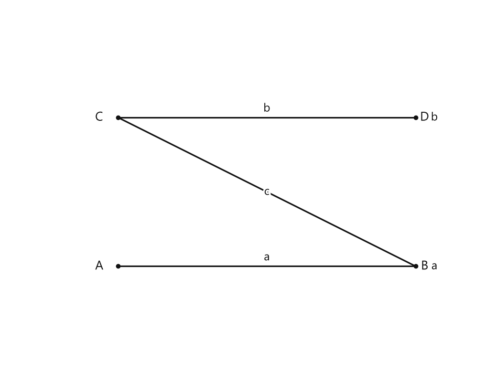

# Занятие 33. Параллельные и перпендикулярные прямые

**Раздел:** Глава 3. Обыкновенные дроби  
**Параграф учебника:** §11. Параллельные и перпендикулярные прямые  
**Страницы:** 243–247

## Цели занятия

После занятия ты умеешь:

- отличать параллельные прямые от пересекающихся;
- распознавать перпендикулярные прямые;
- правильно записывать обозначения $a \parallel b$ и $a \perp b$;
- строить параллельные прямые с помощью линейки и чертёжного треугольника;
- строить перпендикулярные прямые;
- объяснять, сколько углов образуется при пересечении прямых.

Выбери блок по силам:

- **1–2 балла:** узнать параллельные и перпендикулярные прямые;
- **3–4 балла:** выполнить простые построения;
- **5–6 баллов:** объяснить свойства прямых и решить задания по чертежу;
- **7–8 баллов:** выполнить комбинированные построения;
- **9–10 баллов:** уверенно применять все правила и объяснять каждый шаг.

## Теория к занятию

### Параллельные прямые

#### Простыми словами

Представь рельсы: они идут рядом и не встречаются, даже если мысленно продолжить их далеко-далеко. Такие прямые называют параллельными.

На рисунке параллельные прямые могут быть наклонными, вертикальными или горизонтальными. Главное не направление «на глаз», а то, что прямые не пересекаются.

#### Определение

$a \parallel b$ Читается: «прямая $a$ параллельна прямой $b$»

#### Правила

Чтобы построить прямую, параллельную данной прямой, используют линейку и чертёжный треугольник:

1. одну сторону чертёжного треугольника расположить вдоль прямой $m$;
2. положение чертёжного треугольника зафиксировать линейкой;
3. передвинуть чертёжный треугольник вдоль линейки и провести новую прямую $b$.

Линейка здесь работает как «рельс» для треугольника. Если рельс убрать, треугольник может отправиться в свободное плавание — и параллельность тоже.

#### Алгоритм построения

1. Проведи прямую $m$.
2. Приложи к ней сторону чертёжного треугольника.
3. Прижми треугольник линейкой.
4. Передвинь треугольник вдоль линейки.
5. Проведи новую прямую $b$.
6. Запиши: $m \parallel b$.

#### Ловушки

- Две прямые, которые просто идут в одном направлении на маленьком рисунке, ещё не обязательно параллельны.
- Параллельные прямые не пересекаются.
- Не путай обозначения: знак $\parallel$ означает параллельность, а не перпендикулярность.
- Для точного построения одной линейки недостаточно: нужен способ сохранить направление.

---

### Перпендикулярные прямые

#### Простыми словами

Перпендикулярные прямые пересекаются под прямым углом. Такой угол равен $90^\circ$.

Примеры — угол листа бумаги, пересечение горизонтальной и вертикальной линий в тетради, обычный крестик. Но аккуратно: если крестик нарисован «примерно», это ещё не доказательство. Геометрия любит точность больше, чем уверенный вид.

#### Определение

$a \perp b$ Читается: «прямая $a$ перпендикулярна прямой $b$»

#### Факт

При пересечении двух перпендикулярных прямых образуется четыре прямых угла.

#### Правила

Перпендикулярную прямую можно построить двумя способами.

**Первый способ:**

1. приложить прямой угол чертёжного треугольника к прямой $a$;
2. обвести вторую сторону прямого угла чертёжного треугольника;
3. продолжить построенную прямую $b$.

**Второй способ:**

1. приложить прямой угол чертёжного треугольника к прямой $a$;
2. зафиксировать его положение линейкой;
3. обвести край линейки и продолжить сторону прямого угла.

#### Алгоритм построения

1. Проведи прямую $a$.
2. Приложи к ней прямой угол треугольника.
3. Проведи по второй стороне треугольника прямую $b$.
4. Продолжи прямую в обе стороны.
5. Запиши: $a \perp b$.

#### Ловушки

- Перпендикулярные прямые обязательно пересекаются.
- Острый угол — не прямой, даже если очень старается.
- Один прямой угол при пересечении означает, что остальные три угла тоже прямые.
- Нельзя определять перпендикулярность только «на глаз». Проверяй треугольником или транспортиром.

---

### Две прямые, перпендикулярные третьей

#### Простыми словами

Если две прямые образуют прямой угол с одной и той же прямой, они идут в одном направлении и не пересекаются. Значит, они параллельны.

Например, если $a \perp c$ и $b \perp c$, то прямые $a$ и $b$ параллельны.

#### Свойство

Две прямые, перпендикулярные третьей, параллельны друг другу.

#### Формула-запись

Если

$$
a \perp c
$$

и

$$
b \perp c,
$$

то

$$
a \parallel b.
$$

#### Ловушки

- Общая третья прямая должна быть одной и той же.
- Из того, что две прямые перпендикулярны, нельзя сразу сделать вывод, что они параллельны: нужно знать, что они обе перпендикулярны именно третьей прямой.
- Не перепутай направление записи: $a \parallel b$ означает то же самое, что $b \parallel a$.

---

### Пересечение двух параллельных прямых третьей прямой

#### Простыми словами

Если третья прямая пересекает две параллельные прямые, в каждой точке пересечения образуется по четыре угла.

Всего:

$$
4+4=8
$$

углов.

#### Факт

При пересечении двух параллельных прямых третьей образуется 8 углов.

#### Ловушки

- Считаем все углы в двух точках пересечения.
- В одной точке пересечения — 4 угла, а не 2.
- Прямая должна пересекать обе параллельные прямые.

---

## Сводка формул «выучить наизусть»

$$
a \parallel b
$$

Прямая $a$ параллельна прямой $b$.

$$
a \perp b
$$

Прямая $a$ перпендикулярна прямой $b$.

Если

$$
a \perp c,\qquad b \perp c,
$$

то

$$
a \parallel b.
$$

При пересечении двух перпендикулярных прямых образуется $4$ прямых угла.

При пересечении двух параллельных прямых третьей образуется $8$ углов.

## Правила, которые нельзя путать

| Параллельные прямые | Перпендикулярные прямые |
|---|---|
| Не пересекаются | Пересекаются |
| Обозначение: $\parallel$ | Обозначение: $\perp$ |
| Идут рядом в одном направлении | Образуют прямые углы |
| Пример — рельсы | Пример — стороны клеточки |

# Разбор ключевых заданий

## Р1. Определение перпендикулярных прямых

**Условие.** Прямые $a$ и $b$ пересекаются под прямым углом. Как обозначить их взаимное расположение?

### Решение

Прямые пересекаются под прямым углом.

Прямые, пересекающиеся под прямым углом, являются перпендикулярными.

Перпендикулярность обозначают знаком $\perp$.

Записываем:

$$
a \perp b.
$$

Читаем: «прямая $a$ перпендикулярна прямой $b$».

**Ответ:** $a \perp b$.

> Если угол похож на прямой, это ещё не повод выдавать ему паспорт $90^\circ$. Проверяем инструментом.

---

## Р2. Определение параллельных прямых

**Условие.** Прямые $m$ и $n$ не пересекаются при продолжении в обе стороны. Как обозначить их взаимное расположение?

### Решение

Прямые не пересекаются.

Такие прямые являются параллельными.

Параллельность обозначают знаком $\parallel$.

Записываем:

$$
m \parallel n.
$$

Читаем: «прямая $m$ параллельна прямой $n$».

**Ответ:** $m \parallel n$.

---

## Р3. Сколько прямых углов образуют две перпендикулярные прямые?

**Условие.** Построены две перпендикулярные прямые $a$ и $b$. Сколько прямых углов образовалось?

### Решение

По условию:

$$
a \perp b.
$$

При пересечении двух перпендикулярных прямых образуется четыре прямых угла.

Можно проверить подсчётом: вокруг точки пересечения расположены четыре угла.

**Ответ:** $4$ прямых угла.

---

## Р4. Две прямые перпендикулярны третьей

**Условие.** Известно, что $a \perp c$ и $b \perp c$. Как расположены прямые $a$ и $b$?

### Решение

Даны две прямые:

$$
a \perp c,
$$

$$
b \perp c.
$$

Обе прямые перпендикулярны одной и той же прямой $c$.

По свойству две прямые, перпендикулярные третьей, параллельны друг другу.

Следовательно:

$$
a \parallel b.
$$

**Ответ:** $a \parallel b$.

---

## Р5. Построение параллельной прямой

**Условие.** Проведена прямая $m$. Постройте с помощью линейки и чертёжного треугольника прямую $b$, параллельную прямой $m$.

### Решение

1. Одну сторону чертёжного треугольника располагаем вдоль прямой $m$.
2. Положение чертёжного треугольника фиксируем линейкой.
3. Передвигаем чертёжный треугольник вдоль линейки.
4. Проводим новую прямую $b$.
5. Новая прямая сохраняет направление прямой $m$.
6. Записываем:

$$
m \parallel b.
$$

**Ответ:** построена прямая $b$, для которой $m \parallel b$.

---

## Р6. Построение перпендикулярной прямой

**Условие.** Проведена прямая $a$. Постройте с помощью чертёжного треугольника прямую $b$, перпендикулярную прямой $a$.

### Решение

1. Прямой угол чертёжного треугольника прикладываем к прямой $a$.
2. Вторую сторону прямого угла располагаем поперёк прямой $a$.
3. Обводим эту сторону треугольника.
4. Полученную прямую продолжаем в обе стороны.
5. В точке пересечения прямые образуют прямой угол.
6. Записываем:

$$
a \perp b.
$$

**Ответ:** построена прямая $b$, для которой $a \perp b$.

---

## Р7. Сколько углов образуется при пересечении параллельных прямых третьей?

**Условие.** Две параллельные прямые $a$ и $b$ пересечены прямой $c$. Сколько углов образовалось?

<!--geo-figure-spec
{
  "needed": true,
  "kind": "plane",
  "caption": "Две параллельные прямые $a$ и $b$, пересечённые прямой $c$",
  "equal": true,
  "axis": false,
  "xlim": [
    -0.5,
    6
  ],
  "ylim": [
    -0.5,
    4.5
  ],
  "points": {
    "A": [
      1,
      1
    ],
    "B": [
      5,
      1
    ],
    "C": [
      1,
      3
    ],
    "D": [
      5,
      3
    ]
  },
  "segments": [
    {
      "points": [
        "A",
        "B"
      ],
      "label": "a",
      "t": 0.5
    },
    {
      "points": [
        "C",
        "D"
      ],
      "label": "b",
      "t": 0.5
    },
    [
      "B",
      "C"
    ]
  ],
  "polygons": [],
  "circles": [],
  "labels": {
    "A": {
      "dx": -0.25,
      "dy": 0
    },
    "B": {
      "dx": 0.12,
      "dy": 0
    },
    "C": {
      "dx": -0.25,
      "dy": 0
    },
    "D": {
      "dx": 0.12,
      "dy": 0
    }
  },
  "right_angles": [],
  "angle_marks": [],
  "texts": [
    {
      "xy": [
        5.25,
        1
      ],
      "text": "a"
    },
    {
      "xy": [
        5.25,
        3
      ],
      "text": "b"
    },
    {
      "xy": [
        3,
        2
      ],
      "text": "c"
    }
  ]
}
-->

*Две параллельные прямые a и b, пересечённые прямой c*

### Решение

В первой точке пересечения образуется $4$ угла.

Во второй точке пересечения образуется ещё $4$ угла.

Всего:

$$
4+4=8.
$$

**Ответ:** $8$ углов.

> Здесь углы не исчезают при подсчёте. Они просто стоят компактно, как пассажиры в автобусе.

---

## Р8. Определение взаимного расположения прямых

**Условие.** Прямые $p$ и $q$ пересекаются, причём один из образовавшихся углов равен $90^\circ$. Как расположены прямые $p$ и $q$?

### Решение

Прямые $p$ и $q$ пересекаются.

Один из углов при пересечении равен $90^\circ$.

Значит, прямые пересекаются под прямым углом.

Следовательно, прямые перпендикулярны:

$$
p \perp q.
$$

При этом образуется четыре прямых угла.

**Ответ:** $p \perp q$.

---

## Р9. Комбинированное построение

**Условие.** Дана прямая $k$ и точка $T$, не лежащая на ней. Через точку $T$ постройте прямую $r$, параллельную прямой $k$.

### Решение

1. Прикладываем одну сторону чертёжного треугольника к прямой $k$.
2. Фиксируем положение треугольника линейкой.
3. Передвигаем треугольник вдоль линейки так, чтобы его сторона прошла через точку $T$.
4. Через точку $T$ проводим прямую $r$.
5. Направление прямой $r$ совпадает с направлением прямой $k$.
6. Записываем:

$$
r \parallel k.
$$

**Ответ:** через точку $T$ построена прямая $r$, параллельная прямой $k$.

---

## Р10. Две прямые через точки одной прямой

**Условие.** На прямой $k$ отмечены точки $T$ и $M$. Через точку $T$ и через точку $M$ построены прямые, перпендикулярные прямой $k$. Как расположены построенные прямые?

### Решение

Пусть через точку $T$ проведена прямая $a$.

Пусть через точку $M$ проведена прямая $b$.

По условию:

$$
a \perp k,
$$

$$
b \perp k.
$$

Обе прямые перпендикулярны одной и той же прямой $k$.

По свойству две прямые, перпендикулярные третьей, параллельны друг другу.

Следовательно:

$$
a \parallel b.
$$

**Ответ:** построенные прямые параллельны.

---

# Самопроверка

1. Какой знак используют для параллельных прямых?
2. Какой знак используют для перпендикулярных прямых?
3. Сколько прямых углов образуется при пересечении перпендикулярных прямых?
4. Как построить прямую, параллельную данной?
5. Что можно сказать о двух прямых, перпендикулярных одной и той же прямой?
6. Сколько углов образуется при пересечении двух параллельных прямых третьей?

## Ответы

1. $\parallel$.
2. $\perp$.
3. Четыре.
4. Зафиксировать треугольник линейкой, передвинуть его вдоль линейки и провести новую прямую.
5. Они параллельны.
6. Восемь.

## Практические задания

Выбери свой уровень и решай только этот блок. В блоке должна закрепиться вся тема параграфа. Ответы не приводятся.

### Уровень 1–2 балла

**С1.** Выберите запись, которая означает: «прямая $a$ параллельна прямой $b$».

1) $a \perp b$  
2) $a \parallel b$  
3) $a=b$  
4) $a+b$  
5) $a-b$

**С2.** Выберите запись, которая означает: «прямая $c$ перпендикулярна прямой $d$».

1) $c \parallel d$  
2) $c=d$  
3) $c \perp d$  
4) $c+d$  
5) $c-d$

**С3.** Выберите верное утверждение.

1) Перпендикулярные прямые не пересекаются.  
2) Параллельные прямые пересекаются под прямым углом.  
3) Перпендикулярные прямые пересекаются под прямым углом.  
4) Любые две пересекающиеся прямые параллельны.  
5) Параллельные прямые всегда имеют общую точку.

**С4.** Прямые $m$ и $n$ не имеют общих точек и лежат в одной плоскости. Как расположены эти прямые?

1) Перпендикулярно  
2) Параллельно  
3) Под углом $45^\circ$  
4) Совпадают  
5) Обязательно образуют прямой угол

**С5.** Две перпендикулярные прямые пересекаются. Сколько прямых углов образуется?

1) 1  
2) 2  
3) 3  
4) 4  
5) 8

**С6.** Прямые $a$ и $b$ перпендикулярны, а прямые $b$ и $c$ также перпендикулярны. Как расположены прямые $a$ и $c$, если они не совпадают?

1) Параллельно  
2) Перпендикулярно  
3) Не имеют общей плоскости  
4) Обязательно образуют угол $45^\circ$  
5) Определить невозможно

**С7.** Проведите в тетради прямую $a$. С помощью линейки и чертёжного треугольника постройте две прямые, параллельные прямой $a$. Обозначьте их $b$ и $c$.

**С8.** Проведите в тетради прямую $m$ и отметьте точку $A$, не лежащую на этой прямой. С помощью линейки и чертёжного треугольника проведите через точку $A$ прямую, параллельную прямой $m$.

**С9.** Проведите в тетради прямую $p$ и отметьте на ней точку $B$. С помощью чертёжного треугольника проведите через точку $B$ прямую, перпендикулярную прямой $p$.

**С10.** Начертите две пересекающиеся прямые $r$ и $s$ так, чтобы они были перпендикулярны. Обозначьте точку их пересечения буквой $O$. Сколько прямых углов образовалось?

**С11.** Начертите прямую $k$ и отметьте на ней точки $C$ и $D$. Через точку $C$ проведите прямую, перпендикулярную прямой $k$, а через точку $D$ — ещё одну прямую, перпендикулярную прямой $k$. Как расположены построенные прямые по отношению друг к другу?

**С12.** Начертите произвольный угол $ABC$. Через точку $A$ проведите прямую, перпендикулярную стороне $BC$, а через точку $C$ — прямую, параллельную стороне $BA$.

**С13.** Выберите запись, которая означает: «прямая $a$ параллельна прямой $b$».

1) $a \perp b$  
2) $a \parallel b$  
3) $a = b$  
4) $a > b$  
5) $a < b$

**С14.** Выберите запись, которая означает: «прямая $c$ перпендикулярна прямой $d$».

1) $c \parallel d$  
2) $c = d$  
3) $c \perp d$  
4) $c > d$  
5) $c < d$

**С15.** Начертите прямую $a$. С помощью линейки и чертёжного треугольника проведите прямую $b$, параллельную прямой $a$.

**С16.** Начертите прямую $m$. С помощью линейки и чертёжного треугольника проведите прямую $n$, перпендикулярную прямой $m$.

**С17.** Прямые $a$ и $b$ пересекаются под прямым углом. Запишите их взаимное расположение с помощью знака $\parallel$ или $\perp$.

**С18.** Прямые $c$ и $d$ не пересекаются и лежат в одной плоскости. Запишите их взаимное расположение с помощью знака $\parallel$ или $\perp$.

**С19.** Начертите две перпендикулярные прямые $p$ и $q$. Сколько прямых углов образуется при их пересечении?

**С20.** Начертите прямую $r$. Отметьте точку $A$, не лежащую на прямой $r$. Проведите через точку $A$ прямую, перпендикулярную прямой $r$.

**С21.** Начертите прямую $s$. Отметьте точку $B$, не лежащую на прямой $s$. Проведите через точку $B$ прямую, параллельную прямой $s$.

**С22.** Прямые $a$ и $b$ перпендикулярны прямой $c$. Выберите верное утверждение.

1) Прямые $a$ и $b$ перпендикулярны друг другу.  
2) Прямые $a$ и $b$ параллельны друг другу.  
3) Прямые $a$ и $b$ совпадают с прямой $c$.  
4) Прямые $a$, $b$ и $c$ не имеют общих точек.  
5) Прямые $a$ и $b$ образуют угол $45^\circ$.

**С23.** Начертите две параллельные прямые $a$ и $b$. Проведите третью прямую $c$, пересекающую обе параллельные прямые.

**С24.** Начертите угол, равный $60^\circ$. Отметьте на одной его стороне точку $C$, отличную от вершины угла. Проведите через точку $C$ прямую, параллельную другой стороне угла.

**С25.** Выберите обозначение, которое означает: прямая $a$ параллельна прямой $b$.

1) $a\perp b$ 2) $a\parallel b$ 3) $a=b$ 4) $a\cap b$ 5) $a\in b$

**С26.** Выберите обозначение, которое означает: прямая $m$ перпендикулярна прямой $n$.

1) $m\parallel n$ 2) $m=n$ 3) $m\perp n$ 4) $m\in n$ 5) $m\cap n$

**С27.** Две прямые пересекаются под прямым углом. Как они расположены друг относительно друга?

1) параллельно 2) перпендикулярно 3) совпадают 4) не имеют общей точки 5) образуют развернутый угол

**С28.** Сколько прямых углов образуется при пересечении двух перпендикулярных прямых?

1) один 2) два 3) три 4) четыре 5) восемь

**С29.** Прямая $a$ перпендикулярна прямой $c$, а прямая $b$ также перпендикулярна прямой $c$. Как расположены прямые $a$ и $b$?

1) перпендикулярно 2) параллельно 3) пересекаются под острым углом 4) совпадают обязательно 5) не имеют общего направления

**С30.** Две параллельные прямые пересечены третьей прямой. Сколько углов образовалось?

1) два 2) четыре 3) шесть 4) восемь 5) десять

**С31.** Проведите прямую $a$. С помощью линейки и чертёжного треугольника постройте две прямые, параллельные прямой $a$.

**С32.** Проведите прямую $b$ и отметьте на ней точку $T$. С помощью линейки и чертёжного треугольника постройте через точку $T$ прямую, перпендикулярную прямой $b$.

**С33.** Проведите прямую $c$ и отметьте точку $A$, не лежащую на этой прямой. Постройте через точку $A$ прямую, параллельную прямой $c$.

**С34.** Проведите прямую $d$ и отметьте на ней точки $M$ и $N$. Через каждую из этих точек постройте прямую, перпендикулярную прямой $d$.

**С35.** Начертите две прямые $p$ и $q$, перпендикулярные одной и той же прямой $r$. Запишите, как расположены прямые $p$ и $q$ относительно друг друга.

**С36.** Начертите две параллельные прямые $a$ и $b$. Проведите третью прямую $c$, пересекающую обе параллельные прямые. Отметьте все точки пересечения прямых.

### Уровень 3–4 балла

**С1.** Начертите произвольную прямую $a$. С помощью линейки и чертёжного треугольника постройте две прямые, параллельные прямой $a$. Обозначьте их $b$ и $c$.

**С2.** Начертите прямую $m$ и отметьте точку $A$, не лежащую на этой прямой. Проведите через точку $A$ прямую $n$, перпендикулярную прямой $m$.

**С3.** Начертите прямую $p$ и отметьте на ней точки $B$ и $C$. Через каждую из этих точек проведите прямую, перпендикулярную прямой $p$. Обозначьте построенные прямые $q$ и $r$.

**С4.** Начертите две пересекающиеся прямые $a$ и $b$. Проверьте с помощью чертёжного треугольника, являются ли они перпендикулярными. Если прямые не перпендикулярны, перестройте одну из них так, чтобы прямые стали перпендикулярными.

**С5.** Прямые $a$ и $b$ перпендикулярны. Сколько прямых углов образуется при их пересечении?

**С6.** Прямые $m$ и $n$ перпендикулярны прямой $k$. Как расположены прямые $m$ и $n$ по отношению друг к другу? Запишите ответ с помощью знака $\parallel$ или $\perp$.

**С7.** Начертите угол $ABC$, равный $60^\circ$. На стороне $AB$ отметьте точку $D$, отличную от точек $A$ и $B$. Проведите через точку $D$ прямую, параллельную стороне $BC$.

**С8.** Начертите две параллельные прямые $a$ и $b$. Проведите третью прямую $c$, пересекающую обе данные прямые. Сколько углов образуется при пересечении прямых $a$, $b$ и $c$?

**С9.** Даны прямая $a$ и точка $M$, не лежащая на ней. Постройте через точку $M$ прямую $b$, параллельную прямой $a$, а затем через точку $M$ прямую $c$, перпендикулярную прямой $a$.

**С10.** Запишите обозначение и прочитайте его: прямая $a$ параллельна прямой $b$.

**С11.** Начертите прямую $t$ и отметьте точку $P$ на этой прямой. Постройте через точку $P$ прямую $s$, перпендикулярную прямой $t$. Отметьте на прямой $s$ точку $Q$, отличную от точки $P$.

**С12.** Начертите треугольник $ABC$. Через вершину $A$ проведите прямую, параллельную стороне $BC$. Через вершину $B$ проведите прямую, перпендикулярную стороне $AC$. Через вершину $C$ проведите прямую, перпендикулярную стороне $AB$.

**С13.** Начертите прямую $a$ и отметьте точку $A$, не лежащую на этой прямой. Проведите через точку $A$ прямую $b$, перпендикулярную прямой $a$.

**С14.** Начертите две перпендикулярные прямые. Отметьте точку их пересечения. Сколько прямых углов образовалось?

**С15.** Начертите прямую $p$. Проведите две различные прямые $a$ и $b$, перпендикулярные прямой $p$. Как расположены прямые $a$ и $b$ по отношению друг к другу? Запишите обозначение.

**С16.** Начертите две параллельные прямые $a$ и $b$. Проведите третью прямую $c$, пересекающую обе данные прямые. Сколько углов образовалось?

**С17.** Начертите угол $ABC$, равный $70^\circ$. На стороне $AB$ отметьте точку $D$, не совпадающую с точками $A$ и $B$. Проведите через точку $D$ прямую, параллельную стороне $BC$.

**С18.** Начертите прямую $k$ и отметьте на ней точки $M$ и $N$. Через точку $M$ проведите прямую $p$, перпендикулярную прямой $k$, а через точку $N$ — прямую $q$, перпендикулярную прямой $k$. Запишите, как расположены прямые $p$ и $q$.

**С19.** Начертите треугольник $ABC$. Через вершину $A$ проведите прямую, параллельную стороне $BC$, а через вершину $B$ — прямую, перпендикулярную стороне $AC$.

**С20.** Верно ли утверждение: если две прямые перпендикулярны одной и той же прямой, то они параллельны? Запишите ответ и кратко объясните его с помощью обозначений.

**С21.** Начертите прямую $r$ и отметьте точку $P$, не лежащую на ней. Постройте через точку $P$ прямую $s$, параллельную прямой $r$, и прямую $t$, перпендикулярную прямой $r$. Каким является угол между прямыми $s$ и $t$?

**С22.** Начертите прямую $a$. С помощью линейки и чертёжного треугольника постройте прямую $b$, параллельную прямой $a$, и прямую $c$, параллельную прямой $a$, так, чтобы прямые $b$ и $c$ не совпадали.

**С23.** Начертите прямую $m$ и отметьте точку $A$, не лежащую на этой прямой. С помощью линейки и чертёжного треугольника проведите через точку $A$ прямую $n$, перпендикулярную прямой $m$.

**С24.** Начертите прямую $k$ и отметьте на ней точки $B$ и $C$. Через точку $B$ постройте прямую $p$, перпендикулярную прямой $k$, а через точку $C$ — прямую $q$, перпендикулярную прямой $k$.

**С25.** Начертите две пересекающиеся перпендикулярные прямые $a$ и $b$. Обозначьте точку их пересечения буквой $O$. Сколько прямых углов образовалось? Запишите их количество.

**С26.** Запишите с помощью знаков $\parallel$ или $\perp$ утверждения:  
а) прямая $a$ параллельна прямой $b$;  
б) прямая $c$ перпендикулярна прямой $d$;  
в) прямая $m$ параллельна прямой $n$.

**С27.** Запишите словами, как читаются записи:  
а) $r\parallel s$;  
б) $u\perp v$.

**С28.** Начертите угол $ABC$, равный $60^\circ$. На стороне $AB$ отметьте точку $D$, отличную от точек $A$ и $B$. Через точку $D$ проведите прямую, параллельную стороне $BC$.

**С29.** Начертите прямую $a$ и отметьте точку $M$, не лежащую на ней. Проведите через точку $M$ прямую $b$, параллельную прямой $a$. Затем через точку $M$ проведите прямую $c$, перпендикулярную прямой $a$.

**С30.** Прямая $p$ перпендикулярна прямой $q$, а прямая $r$ также перпендикулярна прямой $q$. Как расположены прямые $p$ и $r$ по отношению друг к другу? Запишите ответ с помощью знака $\parallel$.

**С31.** Начертите две параллельные прямые $a$ и $b$. Проведите третью прямую $c$, пересекающую обе параллельные прямые. Сколько углов образовалось при пересечении прямой $c$ с прямыми $a$ и $b$?

**С32.** Начертите прямую $t$ и отметьте на ней точки $P$ и $Q$. Через точку $P$ проведите прямую $p$, перпендикулярную прямой $t$, а через точку $Q$ — прямую $q$, параллельную прямой $p$.

**С33.** Начертите треугольник $ABC$. Через вершину $A$ проведите прямую, параллельную стороне $BC$, а через вершину $B$ — прямую, перпендикулярную стороне $AC$.

**С34.** Проведите прямую $a$. С помощью линейки и чертёжного треугольника постройте две прямые, параллельные прямой $a$.

**С35.** Проведите прямую $b$ и отметьте точку $C$, не лежащую на этой прямой. С помощью линейки и чертёжного треугольника проведите через точку $C$ прямую, перпендикулярную прямой $b$.

**С36.** Прямые $m$ и $n$ перпендикулярны прямой $k$. Как расположены прямые $m$ и $n$ по отношению друг к другу? Запишите ответ с помощью знака $ \parallel $.

### Уровень 5–6 баллов

**С1.** Начертите прямую $a$. С помощью линейки и чертёжного треугольника постройте две прямые, параллельные прямой $a$.

**С2.** Начертите прямую $b$ и отметьте точку $A$, не лежащую на этой прямой. Проведите через точку $A$ прямую, перпендикулярную прямой $b$.

**С3.** Начертите прямую $c$ и отметьте на ней точки $M$ и $N$. Через каждую из этих точек проведите прямую, перпендикулярную прямой $c$.

**С4.** Начертите две перпендикулярные прямые $a$ и $b$. Отметьте точку их пересечения. Сколько прямых углов образуется при пересечении этих прямых?

**С5.** Начертите прямую $m$ и отметьте точку $B$, не лежащую на ней. Проведите через точку $B$ прямую $n$, параллельную прямой $m$. Запишите обозначение получившихся параллельных прямых.

**С6.** Прямые $p$ и $q$ пересекаются. Один из образовавшихся углов является прямым. Как называются прямые $p$ и $q$? Сколько прямых углов образуется при их пересечении?

**С7.** Начертите угол $ABC$, равный $60^\circ$. На стороне $AB$ отметьте точку $D$, отличную от точек $A$ и $B$. Проведите через точку $D$ прямую, параллельную стороне $BC$.

**С8.** Начертите две параллельные прямые $a$ и $b$. Проведите третью прямую $c$, пересекающую обе параллельные прямые. Сколько углов образуется в точках пересечения прямой $c$ с прямыми $a$ и $b$?

**С9.** Начертите прямую $r$. Отметьте точку $C$, не лежащую на прямой $r$, и точку $D$, лежащую на прямой $r$. Проведите через точку $C$ прямую, параллельную прямой $r$, а через точку $D$ — прямую, перпендикулярную прямой $r$.

**С10.** Прямые $u$ и $v$ перпендикулярны прямой $w$. Как расположены прямые $u$ и $v$ по отношению друг к другу? Начертите такой пример и запишите обозначения всех трёх взаимосвязей между прямыми.

**С11.** Начертите прямую $s$ и отметьте на ней точки $P$ и $Q$. Через точку $P$ проведите прямую $p$, перпендикулярную прямой $s$, а через точку $Q$ — прямую $q$, параллельную прямой $p$. Как расположены прямые $q$ и $s$? Запишите обозначение.

**С12.** Начертите треугольник $ABC$. Через вершину $A$ проведите прямую, параллельную стороне $BC$, через вершину $B$ — прямую, перпендикулярную стороне $AC$, а через вершину $C$ — прямую, параллельную стороне $AB$.

**С13.** Начертите прямую $a$. Проведите с помощью линейки и чертёжного треугольника три прямые, параллельные прямой $a$. Обозначьте их $b$, $c$ и $d$.

**С14.** Начертите прямую $m$ и отметьте на ней точки $A$ и $B$. С помощью чертёжного треугольника проведите через точку $A$ прямую $p$, перпендикулярную прямой $m$, а через точку $B$ — прямую $q$, перпендикулярную прямой $m$.

**С15.** Начертите две перпендикулярные прямые $a$ и $b$. Обозначьте точку их пересечения буквой $O$. Сколько прямых углов образовалось? Запишите величину каждого из них.

**С16.** Начертите прямую $c$. Отметьте точку $D$, не лежащую на прямой $c$. Постройте через точку $D$ прямую $e$, перпендикулярную прямой $c$.

**С17.** Начертите прямую $r$. Отметьте точку $K$, не лежащую на этой прямой. Постройте через точку $K$ прямую $s$, параллельную прямой $r$.

**С18.** Прямые $a$ и $b$ перпендикулярны прямой $c$. Как расположены прямые $a$ и $b$ по отношению друг к другу? Запишите ответ с помощью знака $\parallel$ или $\perp$.

**С19.** Прямые $p$ и $q$ параллельны. Прямая $r$ пересекает обе эти прямые и не проходит через одну и ту же точку пересечения с ними. Сколько углов образуется при пересечении прямой $r$ с прямыми $p$ и $q$?

**С20.** Начертите угол $ABC$ величиной $60^\circ$. На стороне $AB$ отметьте точку $D$, отличную от точек $A$ и $B$. Проведите через точку $D$ прямую, параллельную стороне $BC$.

**С21.** Начертите прямую $t$ и отметьте на ней точки $M$ и $N$. Через точку $M$ проведите прямую $u$, перпендикулярную прямой $t$, а через точку $N$ — прямую $v$, параллельную прямой $u$. Как расположены прямые $v$ и $t$?

**С22.** Даны прямые $a$, $b$ и $c$. Известно, что $a\parallel b$ и $b\perp c$. Как расположены прямые $a$ и $c$? Запишите ответ с помощью знака $\parallel$ или $\perp$.

**С23.** Начертите две параллельные прямые $m$ и $n$. Проведите прямую $k$, перпендикулярную прямой $m$. Как расположена прямая $k$ относительно прямой $n$? Проверьте построение чертёжным треугольником.

**С24.** Начертите прямую $l$ и отметьте точку $P$, не лежащую на ней. Постройте через точку $P$ две прямые: прямую $q$, параллельную прямой $l$, и прямую $r$, перпендикулярную прямой $l$. Запишите, как расположены прямые $q$ и $r$.

**С25.** Проведите произвольную прямую $a$. С помощью линейки и чертёжного треугольника постройте две прямые $b$ и $c$, параллельные прямой $a$. Обозначьте полученные отношения с помощью знака $\parallel$.

**С26.** Проведите прямую $k$ и отметьте на ней точку $A$. С помощью линейки и чертёжного треугольника проведите через точку $A$ прямую $m$, перпендикулярную прямой $k$. Проверьте построение с помощью транспортира.

**С27.** Постройте две перпендикулярные прямые $p$ и $q$. Обозначьте точку их пересечения буквой $O$. Сколько прямых углов образовалось? Запишите величину каждого из них.

**С28.** Проведите прямую $r$. Отметьте две точки $A$ и $B$, не лежащие на прямой $r$. Через каждую из этих точек постройте прямые $a$ и $b$, перпендикулярные прямой $r$. Как расположены прямые $a$ и $b$ относительно друг друга? Запишите соответствующее обозначение.

**С29.** Начертите угол $ABC$, равный $60^\circ$. На луче $BA$ отметьте точку $D$, отличную от точки $B$. Через точку $D$ с помощью линейки и чертёжного треугольника проведите прямую $d$, параллельную лучу $BC$. Запишите, какая сторона угла и построенная прямая являются параллельными.

**С30.** Постройте треугольник $ABC$. Через вершину $A$ проведите прямую, перпендикулярную стороне $BC$, а через вершину $B$ — прямую, параллельную стороне $AC$. Обозначьте построенные прямые буквами $m$ и $n$ соответственно. Запишите отношения между $m$ и $BC$, а также между $n$ и $AC$.

### Уровень 7–8 баллов

**С1.** Начертите прямую $a$. С помощью линейки и чертёжного треугольника постройте три различные прямые, параллельные прямой $a$. Обозначьте их $b$, $c$ и $d$.

**С2.** Начертите прямую $m$ и отметьте точку $A$, не лежащую на ней. С помощью линейки и чертёжного треугольника проведите через точку $A$ прямую $p$, перпендикулярную прямой $m$. Обозначьте точку пересечения прямых $m$ и $p$ буквой $B$.

**С3.** Начертите прямую $k$ и отметьте на ней точки $M$ и $N$. Через каждую из этих точек проведите прямую, перпендикулярную прямой $k$. Как расположены проведённые прямые по отношению друг к другу? Запишите ответ с помощью символа $||$ или $\perp$ и обоснуйте его.

**С4.** Начертите угол $ABC$, равный $60^\circ$. На луче $BA$ отметьте точку $D$, отличную от точки $B$. Через точку $D$ постройте прямую, параллельную лучу $BC$. Обозначьте её буквой $d$.

**С5.** Прямые $a$ и $b$ пересекаются в точке $O$ и перпендикулярны. Сколько прямых углов образуется при их пересечении? Запишите величину каждого образовавшегося угла.

**С6.** Прямая $c$ пересекает две параллельные прямые $a$ и $b$. На пересечении прямых $a$ и $c$ образовалось $4$ угла, а на пересечении прямых $b$ и $c$ — ещё $4$ угла. Сколько всего углов образовалось? Объясните, почему при этом не возникают дополнительные углы между уже построенными прямыми.

**С7.** Верно ли утверждение: «Если две прямые перпендикулярны одной и той же прямой, то они параллельны»? Начертите соответствующую схему и обоснуйте ответ.

**С8.** Начертите две параллельные прямые $a$ и $b$. Проведите прямую $c$, перпендикулярную прямой $a$. Как расположена прямая $c$ по отношению к прямой $b$? Запишите это с помощью символа $||$ или $\perp$ и обоснуйте ответ.

**С9.** Прямые $p$ и $q$ перпендикулярны. Луч $r$ расположен внутри одного из прямых углов, образованных этими прямыми, и делит этот угол на два угла. Один из них равен $35^\circ$. Найдите величину другого угла.

**С10.** Угол $MON$ равен $90^\circ$. Внутри него проведён луч $OK$. Угол $MOK$ в два раза больше угла $KON$. Найдите величины углов $MOK$ и $KON$.

**С11.** На рисунке мысленно изображены три прямые: $a$ и $b$ параллельны, а прямая $c$ пересекает каждую из них. Один из восьми образовавшихся углов равен $120^\circ$. Найдите величины остальных углов, не используя транспортир. Объясните, сколько углов имеют величину $120^\circ$ и сколько — величину $60^\circ$.

**С12.** Начертите треугольник $ABC$. Через вершину $A$ проведите прямую, параллельную стороне $BC$, через вершину $B$ — прямую, перпендикулярную стороне $AC$, а через вершину $C$ — прямую, перпендикулярную стороне $AB$. Обозначьте все построенные прямые и укажите, какие пары прямых параллельны, а какие пары — перпендикулярны.

**С13.** Начертите прямую $a$. С помощью линейки и чертёжного треугольника постройте три различные прямые, параллельные прямой $a$. Обозначьте их $b$, $c$ и $d$. Запишите все пары параллельных прямых.

**С14.** Начертите прямую $m$ и отметьте точку $A$, не лежащую на ней. С помощью линейки и чертёжного треугольника проведите через точку $A$ прямую $b$, параллельную прямой $m$, и прямую $c$, перпендикулярную прямой $m$.

**С15.** Начертите прямую $k$ и отметьте на ней точки $B$ и $C$. Через точку $B$ постройте прямую $p$, перпендикулярную прямой $k$, а через точку $C$ — прямую $q$, перпендикулярную прямой $k$. Объясните, как расположены прямые $p$ и $q$ относительно друг друга.

**С16.** Начертите угол $AOB$, равный $60^\circ$. На луче $OA$ отметьте точку $C$, не совпадающую с точкой $O$. Через точку $C$ проведите прямую, параллельную лучу $OB$. Укажите угол, образованный этой прямой и лучом $OA$, который равен $60^\circ$.

**С17.** Начертите две параллельные прямые $a$ и $b$. Проведите прямую $c$, пересекающую обе параллельные прямые. Обозначьте все точки пересечения. Сколько углов образовалось? Сколько из них являются прямыми, если прямая $c$ перпендикулярна прямой $a$?

**С18.** Прямые $a$ и $b$ пересекаются под прямым углом. Прямая $c$ параллельна прямой $a$. Определите, как расположены прямые $b$ и $c$ относительно друг друга. Обоснуйте ответ построением или рассуждением.

**С19.** Начертите прямую $r$ и отметьте точку $D$, не лежащую на ней. Постройте через точку $D$ прямую $s$, перпендикулярную прямой $r$. На прямой $s$ отметьте точку $E$, отличную от $D$. Через точку $E$ постройте прямую $t$, параллельную прямой $r$. Запишите, какие пары прямых являются параллельными и какие — перпендикулярными.

**С20.** На клетчатой бумаге начертите прямую $a$, проходящую через две точки клетчатой сетки. Отметьте точку $M$, не лежащую на прямой $a$. Проведите через точку $M$ прямую $b$, параллельную прямой $a$, и прямую $c$, перпендикулярную прямой $a$. Проверьте с помощью угольника, что построение выполнено верно.

**С21.** Начертите прямую $l$ и отметьте на ней точки $P$ и $Q$. Через точку $P$ проведите прямую $m$, перпендикулярную прямой $l$. Через точку $Q$ проведите прямую $n$, параллельную прямой $m$. Определите, как расположены прямые $l$ и $n$. Запишите обоснование.

**С22.** Начертите две пересекающиеся прямые $a$ и $b$, образующие один угол величиной $60^\circ$. Через точку их пересечения проведите прямую $c$, перпендикулярную прямой $a$. Определите величины углов между прямыми $b$ и $c$. Проверьте построение транспортиром.

**С23.** Начертите треугольник $ABC$. Через вершину $A$ проведите прямую, параллельную стороне $BC$, через вершину $B$ — прямую, параллельную стороне $AC$, а через вершину $C$ — прямую, параллельную стороне $AB$. Обозначьте построенные прямые и укажите пары параллельных прямых.

**С24.** Начертите прямую $a$ и отметьте точку $K$, не лежащую на ней. Постройте через точку $K$ прямую $b$, перпендикулярную прямой $a$. Затем постройте через точку $K$ прямую $c$, перпендикулярную прямой $b$. Как расположены прямые $a$ и $c$? Обоснуйте ответ и проверьте результат чертёжным треугольником.

### Уровень 9–10 баллов

**С1.** Проведите прямую $a$. Отметьте вне её три точки $A$, $B$ и $C$. С помощью линейки и чертёжного треугольника проведите через каждую из этих точек прямую, параллельную прямой $a$. Обозначьте построенные прямые $b$, $c$ и $d$.

**С2.** Проведите прямую $m$ и отметьте на ней точки $P$ и $Q$. С помощью линейки и чертёжного треугольника постройте через точку $P$ прямую $p$, перпендикулярную прямой $m$, а через точку $Q$ — прямую $q$, перпендикулярную прямой $m$. Укажите, как расположены прямые $p$ и $q$ относительно друг друга.

**С3.** Начертите угол $ABC$, равный $70^\circ$. На стороне $BA$ отметьте точку $D$, отличную от точек $A$ и $B$. Через точку $D$ проведите прямую, параллельную стороне $BC$. Затем через точку $C$ проведите прямую, перпендикулярную стороне $BA$. Обозначьте точку пересечения построенных прямых буквой $E$.

**С4.** Прямая $r$ пересекает две прямые $a$ и $b$. Известно, что $a\perp r$ и $b\perp r$. Верно ли утверждение: «Прямые $a$ и $b$ перпендикулярны друг другу»? Обоснуйте ответ построением чертежа и свойством прямых, изученным в параграфе.

**С5.** Проведите две параллельные прямые $a$ и $b$. Проведите прямую $c$, пересекающую обе прямые. Сколько углов образуется в точках пересечения прямой $c$ с прямыми $a$ и $b$? Все точки пересечения и образовавшиеся углы обозначьте на чертеже.

**С6.** Проведите прямую $a$ и отметьте вне неё точку $M$. Постройте через точку $M$ прямую $b$, параллельную прямой $a$. Не меняя положения точки $M$, постройте через неё прямую $c$, перпендикулярную прямой $a$. Запишите с помощью знаков $\parallel$ и $\perp$ взаимное расположение прямых $a$, $b$ и $c$.

**С7.** Начертите произвольный треугольник $ABC$. Через вершину $A$ проведите прямую, параллельную стороне $BC$. Через вершину $B$ проведите прямую, перпендикулярную стороне $AC$. Через вершину $C$ проведите прямую, перпендикулярную стороне $AB$. Все построенные прямые обозначьте различными маленькими буквами.

**С8.** Две прямые $p$ и $q$ пересекаются. Через точку их пересечения проведена третья прямая $r$. Известно, что $r\perp p$ и $r\perp q$. Может ли такое расположение прямых быть изображено без совпадения прямых $p$ и $q$? Ответ обоснуйте, используя свойства перпендикулярных прямых.

**С9.** Проведите прямую $k$ и отметьте вне неё точки $A$ и $B$. Постройте через точку $A$ прямую $a$, перпендикулярную $k$, а через точку $B$ — прямую $b$, параллельную $k$. Затем через точку пересечения прямых $a$ и $b$ проведите прямую $c$, перпендикулярную $a$. Запишите, параллельна ли прямая $c$ прямой $k$, и объясните почему.

**С10.** Начертите две пересекающиеся прямые $a$ и $b$. Через точку их пересечения проведите прямую $c$, перпендикулярную $a$. Через другую точку прямой $a$, не являющуюся точкой пересечения с $b$, проведите прямую $d$, перпендикулярную $a$. Сравните прямые $c$ и $d$ и запишите знак их взаимного расположения.

**С11.** Проведите прямую $m$ и отметьте вне неё точку $P$. Постройте через точку $P$ прямую $p$, параллельную $m$. На прямой $p$ отметьте две различные точки $Q$ и $R$. Через точку $Q$ постройте прямую, перпендикулярную $p$, а через точку $R$ — прямую, параллельную $m$. Сколько из построенных прямых параллельны прямой $m$? Назовите их.

**С12.** Начертите произвольный угол $ABC$. На луче $BA$ отметьте точку $D$, не совпадающую с точкой $B$. Через точку $D$ проведите прямую $d$, перпендикулярную лучу $BA$. Через точку $C$ проведите прямую $c$, перпендикулярную лучу $BA$. Докажите построением, что прямые $c$ и $d$ параллельны.

**С13.** На листе проведена прямая $a$ и отмечена точка $A$, не принадлежащая этой прямой. С помощью линейки и чертёжного треугольника постройте через точку $A$ прямую $b$, перпендикулярную прямой $a$, а затем через точку $A$ постройте прямую $c$, параллельную прямой $a$. Запишите обозначения полученных взаимных отношений между прямыми $a$, $b$ и $c$.

**С14.** Проведите прямую $m$ и отметьте на ней точки $A$, $B$ и $C$, причём точка $B$ находится между точками $A$ и $C$. Через точки $A$ и $C$ постройте прямые, перпендикулярные прямой $m$. Как расположены эти две построенные прямые относительно друг друга? Обоснуйте ответ.

**С15.** Прямые $a$ и $b$ пересекаются в точке $O$ и перпендикулярны. На прямой $a$ по одну сторону от точки $O$ отмечена точка $A$, а по другую сторону — точка $B$. На прямой $b$ отмечены точки $C$ и $D$, лежащие по разные стороны от точки $O$. Сколько прямых углов образуется при пересечении прямых $a$ и $b$? Назовите все пары лучей, образующие прямые углы.

**С16.** Дана прямая $a$ и две точки $B$ и $C$, не лежащие на ней. Известно, что точки $B$ и $C$ расположены так, что прямые, перпендикулярные прямой $a$ и проходящие через эти точки, различны, а прямые, параллельные прямой $a$ и проходящие через эти точки, также различны.

С помощью линейки и чертёжного треугольника:

1. проведите через точку $B$ прямую $p$, перпендикулярную прямой $a$;
2. проведите через точку $C$ прямую $q$, перпендикулярную прямой $a$;
3. проведите через точку $B$ прямую $r$, параллельную прямой $a$;
4. проведите через точку $C$ прямую $s$, параллельную прямой $a$.

Затем определите:

а) какие из прямых $a$, $p$, $q$, $r$, $s$ параллельны друг другу;

б) какие пары этих прямых перпендикулярны;

в) сколько всего точек пересечения имеют эти пять прямых;

г) сколько прямых углов образуется в каждой точке пересечения.

**С17.** Даны три прямые $a$, $b$ и $c$. Известно, что $a \perp c$ и $b \perp c$. Прямая $a$ проходит через точку $A$, а прямая $b$ — через точку $B$, причём точки $A$ и $B$ не лежат на прямой $c$. Верно ли утверждение: «Прямые $a$ и $b$ параллельны»? Ответ обоснуйте построением или рассуждением.

**С18.** Проведите произвольную прямую $p$ и отметьте точки $M$ и $N$, не лежащие на ней. Постройте через точку $M$ прямую $m$, перпендикулярную прямой $p$, а через точку $N$ — прямую $n$, параллельную прямой $p$. Затем постройте через точку пересечения прямых $m$ и $n$ прямую, перпендикулярную прямой $m$. Как расположена последняя построенная прямая относительно прямой $p$? Запишите все перпендикулярные и параллельные пары прямых, которые можно установить на чертеже.

## Чек-лист «ученик понял тему»

- Могу повторить определения и формулы параграфа своими словами и по учебнику.
- Решаю типовые задания своего уровня без подсказки.
- Вижу типичную ошибку и могу её объяснить.
