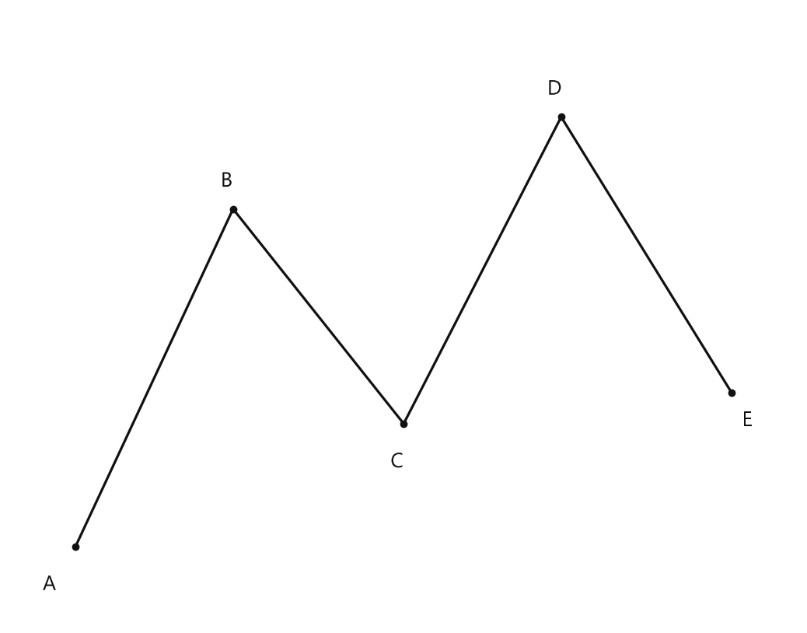
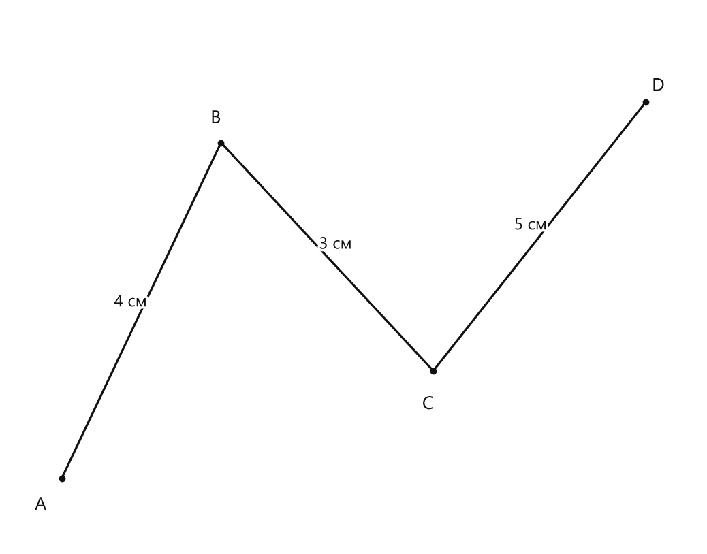
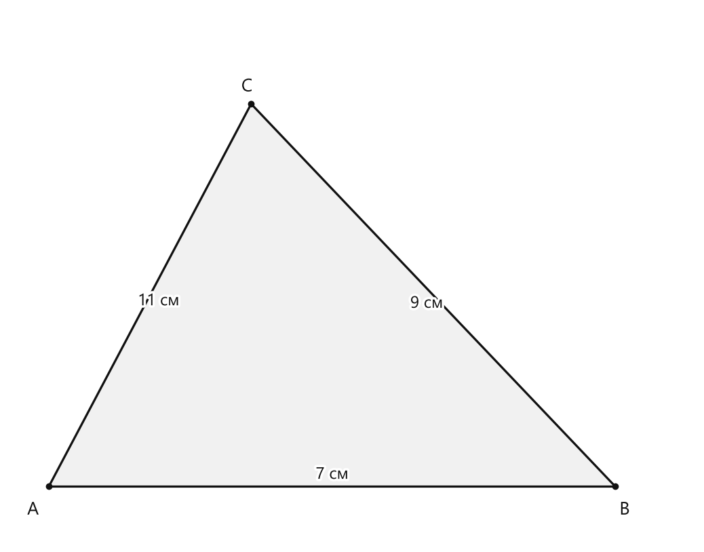
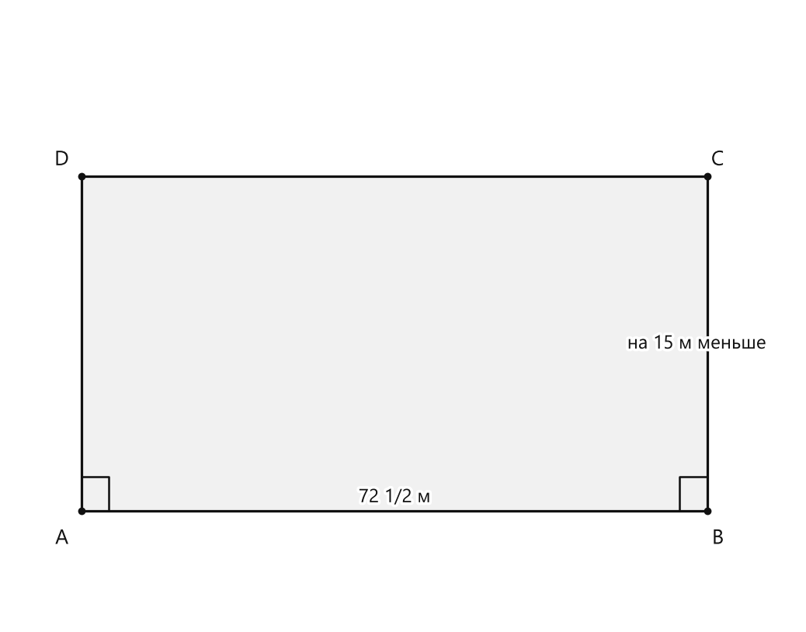
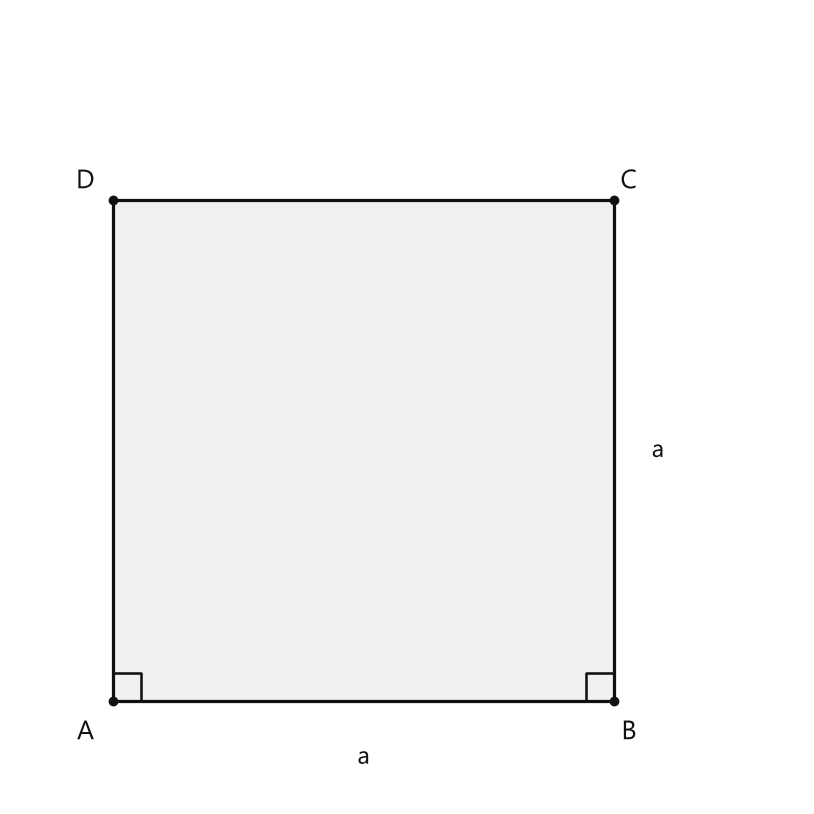

# Занятие 34. Ломаная. Многоугольник. Периметр многоугольника

**Раздел:** Глава 3  
**Параграф учебника:** §12. Ломаная. Многоугольник. Периметр многоугольника  
**Страницы:** 248–252

## Цели занятия

После занятия вы сможете:

- отличать ломаную от многоугольника;
- называть вершины и звенья ломаной;
- различать замкнутую и незамкнутую ломаную;
- находить длину ломаной;
- находить периметр треугольника, прямоугольника, квадрата и других многоугольников;
- решать задачи, где периметр связан с длиной и шириной фигуры.

Выберите блок по силам:

- **1–2 балла:** распознать ломаную и многоугольник, назвать вершины и звенья;
- **3–4 балла:** найти длину ломаной и периметр простого многоугольника;
- **5–6 баллов:** решать задачи на прямоугольник и квадрат;
- **7–8 баллов:** составлять план решения задачи по периметру;
- **9–10 баллов:** решать комбинированные задачи и объяснять каждый шаг.

## Теория к занятию

### 1. Ломаная и её элементы

#### Простыми словами

Ломаная получается, когда несколько отрезков соединяют «уголками». Каждый отрезок — отдельное звено, а место соединения двух соседних звеньев — вершина.

Например, если последовательно соединить точки $A$, $B$, $C$, $D$, то получится ломаная $ABCD$. В ней три звена: $AB$, $BC$, $CD$.

Ломаная — это не обязательно замкнутая фигура. Она может начинаться в одной точке, погулять по плоскости и закончиться в другой. Геометрический маршрут без обратного билета.

#### Определение

Чтобы построить ломаную, нужно отметить на плоскости несколько точек, из которых каждые три соседние не лежат на одной прямой, и последовательно соединить их отрезками. Точки называют **вершинами ломаной**, а отрезки — **звеньями ломаной**.

При обозначении ломаной указывают названия её вершин.

#### Виды ломаных

- **Незамкнутая ломаная** — её начало и конец не совпадают.
- **Замкнутая ломаная** — её начало и конец совпадают.

Замкнутую ломаную можно называть, начиная с любой вершины.

#### Длина ломаной

**Длиной ломаной называется сумма длин её звеньев.**

Если ломаная состоит из звеньев длиной $a$, $b$ и $c$, то её длина равна:

$$l=a+b+c.$$

Здесь $l$ — длина ломаной, а $a$, $b$, $c$ — длины её звеньев.

#### Правило

Чтобы найти длину ломаной:

1. измерьте длину каждого звена;
2. сложите полученные длины;
3. запишите единицу измерения.

#### Ловушки

- Не путайте **число вершин** и **число звеньев** незамкнутой ломаной: звеньев на одно меньше, чем вершин.
- В замкнутой ломаной число вершин и звеньев одинаково.
- Нельзя считать расстояние «по прямой» между началом и концом вместо суммы звеньев.
- Единицы длины должны быть одинаковыми перед сложением.

---

### 2. Многоугольник

#### Простыми словами

Если замкнутая ломаная не пересекает сама себя, она ограничивает часть плоскости. Эта часть вместе с границей и называется многоугольником.

Треугольник, четырёхугольник и пятиугольник — всё это многоугольники. Название показывает число сторон.

#### Определение

**Часть плоскости, ограниченную замкнутой ломаной, вместе с ломаной называют многоугольником.**

Чтобы построить многоугольник, нужно построить замкнутую ломаную.

Вершины ломаной называют **вершинами многоугольника**, а звенья ломаной — **сторонами многоугольника**.

При обозначении многоугольника указывают названия его вершин, начиная с любой из них.

#### Как обозначают многоугольник

Если вершины идут по порядку $A$, $B$, $C$, $D$, то многоугольник можно обозначить $ABCD$.

Стороны этого многоугольника:

$$AB,\ BC,\ CD,\ DA.$$

Начать обозначение можно с любой вершины, но порядок обхода должен сохраняться.

#### Ловушки

- Одна сторона многоугольника не должна «перепрыгивать» через вершины.
- Нельзя менять порядок вершин как попало: запись должна идти по границе фигуры.
- Самопересекающаяся ломаная не ограничивает обычную часть плоскости, поэтому многоугольник так не строят.
- У многоугольника число вершин равно числу сторон.

---

### 3. Периметр многоугольника

#### Простыми словами

Периметр — это длина всей границы фигуры. Представьте, что нужно огородить участок: забор пойдёт по всем сторонам, а не по диагонали через грядки.

#### Определение

**Периметром многоугольника называют сумму длин его сторон.**

Периметр многоугольника часто обозначается прописной латинской буквой $P$.

#### Формулы

Если длины сторон треугольника равны $a$, $b$ и $c$, то:

$$P=a+b+c.$$

Для многоугольника с шестью сторонами:

$$P=a+b+c+d+e+f.$$

Для прямоугольника со сторонами $a$ и $b$:

$$P=a+b+a+b.$$

После группировки одинаковых слагаемых:

$$P=2a+2b.$$

Для квадрата со стороной $a$:

$$P=a+a+a+a,$$

или

$$P=4a.$$

#### Как найти сторону квадрата по периметру

Если известен периметр квадрата, длину стороны находят делением:

$$a=P:4.$$

#### Алгоритм нахождения периметра

1. Определите, какие стороны образуют границу фигуры.
2. Узнайте длину каждой стороны.
3. Приведите длины к одинаковым единицам.
4. Сложите длины всех сторон.
5. Запишите ответ с единицей длины.

#### Ловушки

- Периметр — это **длина**, поэтому ответ записывают в сантиметрах, метрах, дециметрах и так далее.
- Не надо умножать стороны прямоугольника: умножение связано с площадью, а площадь будет изучаться позже.
- У квадрата четыре равные стороны, поэтому достаточно умножить сторону на $4$.
- Если дана ширина и сказано, что длина на несколько сантиметров больше, сначала найдите длину, а уже потом периметр.

## Сводка формул «выучить наизусть»

Длина ломаной:

$$l=\text{сумма длин всех звеньев}.$$

Периметр треугольника:

$$P=a+b+c.$$

Периметр прямоугольника:

$$P=2a+2b.$$

Периметр квадрата:

$$P=4a.$$

Сторона квадрата по периметру:

$$a=P:4.$$

## Правила, которые нельзя путать

- **Звенья** относятся к ломаной, **стороны** — к многоугольнику.
- **Длина ломаной** — сумма длин звеньев.
- **Периметр** — сумма длин сторон многоугольника.
- Периметр измеряется единицами длины, а не квадратными единицами.
- У прямоугольника противоположные стороны равны.
- У квадрата все четыре стороны равны.

# Разбор ключевых заданий

## Р1. Название ломаной и её звенья

**Условие.** Точки $A$, $B$, $C$, $D$, $E$ последовательно соединены отрезками. Назовите ломаную, её вершины и звенья.

<!--geo-figure-spec
{
  "needed": true,
  "kind": "plane",
  "caption": "Ломаная ABCDE",
  "equal": false,
  "axis": false,
  "xlim": [
    -0.5,
    5.5
  ],
  "ylim": [
    -0.5,
    3.5
  ],
  "points": {
    "A": [
      0,
      0
    ],
    "B": [
      1.2,
      2.2
    ],
    "C": [
      2.5,
      0.8
    ],
    "D": [
      3.7,
      2.8
    ],
    "E": [
      5,
      1
    ]
  },
  "segments": [
    [
      "A",
      "B"
    ],
    [
      "B",
      "C"
    ],
    [
      "C",
      "D"
    ],
    [
      "D",
      "E"
    ]
  ],
  "polygons": [],
  "circles": [],
  "labels": {
    "A": {
      "dx": -0.2,
      "dy": -0.25
    },
    "B": {
      "dx": -0.05,
      "dy": 0.18
    },
    "C": {
      "dx": -0.05,
      "dy": -0.25
    },
    "D": {
      "dx": -0.05,
      "dy": 0.18
    },
    "E": {
      "dx": 0.12,
      "dy": -0.18
    }
  },
  "right_angles": [],
  "angle_marks": [],
  "texts": []
}
-->

*Ломаная ABCDE*

**Решение.**

1. Точки соединены последовательно: $A$, $B$, $C$, $D$, $E$.
2. Поэтому ломаная обозначается $ABCDE$.
3. Её вершины:

$$A,\ B,\ C,\ D,\ E.$$

4. Звенья — отрезки между соседними вершинами:

$$AB,\ BC,\ CD,\ DE.$$

**Ответ:** ломаная $ABCDE$; вершины $A$, $B$, $C$, $D$, $E$; звенья $AB$, $BC$, $CD$, $DE$.

---

## Р2. Длина ломаной

**Условие.** Ломаная $ABCD$ состоит из трёх звеньев: $AB=4$ см, $BC=3$ см, $CD=5$ см. Найдите длину ломаной.

<!--geo-figure-spec
{
  "needed": true,
  "kind": "plane",
  "caption": "Ломаная ABCD",
  "equal": false,
  "axis": false,
  "xlim": [
    -0.5,
    6
  ],
  "ylim": [
    -0.5,
    3.5
  ],
  "points": {
    "A": [
      0,
      0
    ],
    "B": [
      1.5,
      2.5
    ],
    "C": [
      3.5,
      0.8
    ],
    "D": [
      5.5,
      2.8
    ]
  },
  "segments": [
    {
      "points": [
        "A",
        "B"
      ],
      "dashed": false,
      "label": "4 см",
      "t": 0.5
    },
    {
      "points": [
        "B",
        "C"
      ],
      "dashed": false,
      "label": "3 см",
      "t": 0.5
    },
    {
      "points": [
        "C",
        "D"
      ],
      "dashed": false,
      "label": "5 см",
      "t": 0.5
    }
  ],
  "polygons": [],
  "circles": [],
  "labels": {
    "A": {
      "dx": -0.2,
      "dy": -0.2
    },
    "B": {
      "dx": -0.05,
      "dy": 0.18
    },
    "C": {
      "dx": -0.05,
      "dy": -0.25
    },
    "D": {
      "dx": 0.12,
      "dy": 0.12
    }
  },
  "right_angles": [],
  "angle_marks": [],
  "texts": []
}
-->

*Ломаная ABCD*

**Решение.**

1. По определению длина ломаной равна сумме длин её звеньев.
2. Складываем длины звеньев:

$$l=AB+BC+CD.$$

3. Подставляем данные:

$$l=4+3+5.$$

4. Выполняем сложение:

$$4+3=7.$$

$$7+5=12.$$

**Ответ:** длина ломаной равна $12$ см.

---

## Р3. Периметр треугольника

**Условие.** Длины сторон треугольника равны $7$ см, $9$ см и $11$ см. Найдите его периметр.

<!--geo-figure-spec
{
  "needed": true,
  "kind": "plane",
  "caption": "Треугольник ABC",
  "equal": false,
  "axis": false,
  "xlim": [
    -0.5,
    8
  ],
  "ylim": [
    -0.6,
    5
  ],
  "points": {
    "A": [
      0,
      0
    ],
    "B": [
      7,
      0
    ],
    "C": [
      2.5,
      4
    ]
  },
  "segments": [
    {
      "points": [
        "A",
        "B"
      ],
      "dashed": false,
      "label": "7 см",
      "t": 0.5
    },
    {
      "points": [
        "B",
        "C"
      ],
      "dashed": false,
      "label": "9 см",
      "t": 0.5
    },
    {
      "points": [
        "C",
        "A"
      ],
      "dashed": false,
      "label": "11 см",
      "t": 0.5
    }
  ],
  "polygons": [
    {
      "vertices": [
        "A",
        "B",
        "C"
      ],
      "fill": 0.06
    }
  ],
  "circles": [],
  "labels": {
    "A": {
      "dx": -0.2,
      "dy": -0.25
    },
    "B": {
      "dx": 0.12,
      "dy": -0.25
    },
    "C": {
      "dx": -0.05,
      "dy": 0.18
    }
  },
  "right_angles": [],
  "angle_marks": [],
  "texts": []
}
-->

*Треугольник ABC*

**Решение.**

1. Периметр треугольника равен сумме длин его сторон:

$$P=a+b+c.$$

2. Подставляем длины сторон:

$$P=7+9+11.$$

3. Складываем первые два числа:

$$7+9=16.$$

4. Прибавляем третью сторону:

$$16+11=27.$$

**Ответ:** периметр треугольника равен $27$ см.

---

## Р4. Периметр прямоугольного участка

**Условие.** Длина прямоугольного садового участка равна $72\frac{1}{2}$ м, а ширина на $15$ м меньше длины. Найдите длину забора вокруг участка.

<!--geo-figure-spec
{
  "needed": true,
  "kind": "plane",
  "caption": "Прямоугольный участок ABCD",
  "equal": false,
  "axis": false,
  "xlim": [
    -0.8,
    8
  ],
  "ylim": [
    -1,
    4.5
  ],
  "points": {
    "A": [
      0,
      0
    ],
    "B": [
      7,
      0
    ],
    "C": [
      7,
      3
    ],
    "D": [
      0,
      3
    ]
  },
  "segments": [
    {
      "points": [
        "A",
        "B"
      ],
      "dashed": false,
      "label": "72 1/2 м",
      "t": 0.5
    },
    {
      "points": [
        "B",
        "C"
      ],
      "dashed": false,
      "label": "на 15 м меньше",
      "t": 0.5
    },
    [
      "C",
      "D"
    ],
    [
      "D",
      "A"
    ]
  ],
  "polygons": [
    {
      "vertices": [
        "A",
        "B",
        "C",
        "D"
      ],
      "fill": 0.06
    }
  ],
  "circles": [],
  "labels": {
    "A": {
      "dx": -0.22,
      "dy": -0.25
    },
    "B": {
      "dx": 0.12,
      "dy": -0.25
    },
    "C": {
      "dx": 0.12,
      "dy": 0.15
    },
    "D": {
      "dx": -0.22,
      "dy": 0.15
    }
  },
  "right_angles": [
    {
      "vertex": "A",
      "from": "B",
      "to": "D"
    },
    {
      "vertex": "B",
      "from": "A",
      "to": "C"
    }
  ],
  "angle_marks": [],
  "texts": []
}
-->

*Прямоугольный участок ABCD*

**Решение.**

1. Найдём ширину участка:

$$72\frac{1}{2}-15=57\frac{1}{2}\text{ м}.$$

2. Периметр прямоугольника равен сумме длин всех его сторон:

$$P=2a+2b.$$

3. Подставим длину и ширину:

$$P=2\cdot72\frac{1}{2}+2\cdot57\frac{1}{2}.$$

4. Найдём удвоенную длину:

$$2\cdot72\frac{1}{2}=145\text{ м}.$$

5. Найдём удвоенную ширину:

$$2\cdot57\frac{1}{2}=115\text{ м}.$$

6. Найдём периметр:

$$P=145+115=260\text{ м}.$$

Проверка: можно сложить стороны по одной:

$$72\frac{1}{2}+57\frac{1}{2}+72\frac{1}{2}+57\frac{1}{2}=260.$$

**Ответ:** длина забора равна $260$ м.

---

## Р5. Сторона квадрата по периметру

**Условие.** Периметр квадратной площадки равен $36\frac{1}{2}$ м. Найдите длину её стороны.

<!--geo-figure-spec
{
  "needed": true,
  "kind": "plane",
  "caption": "Квадрат ABCD",
  "equal": true,
  "axis": false,
  "xlim": [
    -0.8,
    5.5
  ],
  "ylim": [
    -0.8,
    5.5
  ],
  "points": {
    "A": [
      0,
      0
    ],
    "B": [
      4,
      0
    ],
    "C": [
      4,
      4
    ],
    "D": [
      0,
      4
    ]
  },
  "segments": [
    [
      "A",
      "B"
    ],
    [
      "B",
      "C"
    ],
    [
      "C",
      "D"
    ],
    [
      "D",
      "A"
    ]
  ],
  "polygons": [
    {
      "vertices": [
        "A",
        "B",
        "C",
        "D"
      ],
      "fill": 0.06
    }
  ],
  "circles": [],
  "labels": {
    "A": {
      "dx": -0.22,
      "dy": -0.25
    },
    "B": {
      "dx": 0.12,
      "dy": -0.25
    },
    "C": {
      "dx": 0.12,
      "dy": 0.15
    },
    "D": {
      "dx": -0.22,
      "dy": 0.15
    }
  },
  "right_angles": [
    {
      "vertex": "A",
      "from": "B",
      "to": "D"
    },
    {
      "vertex": "B",
      "from": "A",
      "to": "C"
    }
  ],
  "angle_marks": [],
  "texts": [
    {
      "xy": [
        2,
        -0.45
      ],
      "text": "a"
    },
    {
      "xy": [
        4.35,
        2
      ],
      "text": "a"
    }
  ]
}
-->

*Квадрат ABCD*

**Решение.**

1. У квадрата четыре равные стороны.
2. Поэтому периметр квадрата находят по формуле:

$$P=4a.$$

3. Чтобы найти сторону, разделим периметр на $4$:

$$a=P:4.$$

4. Подставим значение периметра:

$$a=36\frac{1}{2}:4.$$

5. Запишем смешанное число неправильной дробью:

$$36\frac{1}{2}=\frac{73}{2}.$$

6. Выполним деление:

$$\frac{73}{2}:4=\frac{73}{2}\cdot\frac{1}{4}=\frac{73}{8}.$$

7. Выделим целую часть:

$$\frac{73}{8}=9\frac{1}{8}.$$

**Ответ:** длина стороны площадки равна $9\frac{1}{8}$ м.

---

## Р6. Задача на равные периметры

**Условие.** Длина стороны квадрата равна $15$ дм. Прямоугольник имеет ширину $12$ дм и такой же периметр, как у квадрата. Найдите длину прямоугольника.

**Решение.**

1. Найдём периметр квадрата:

$$P=4a.$$

$$P=4\cdot15=60\text{ дм}.$$

2. У прямоугольника периметр равен:

$$P=2a+2b.$$

3. Пусть длина прямоугольника равна $x$ дм, а ширина равна $12$ дм.

4. Так как периметры одинаковые, составим уравнение:

$$2x+2\cdot12=60.$$

5. Выполним умножение:

$$2x+24=60.$$

6. Вычтем $24$ из обеих частей уравнения:

$$2x=36.$$

7. Разделим обе части на $2$:

$$x=18.$$

8. Проверим периметр прямоугольника:

$$2\cdot18+2\cdot12=36+24=60\text{ дм}.$$

Периметр совпал. Математический детектор лжи сработал.

**Ответ:** длина прямоугольника равна $18$ дм.

## Практические задания

Выбери свой уровень и решай только этот блок. В блоке должна закрепиться вся тема параграфа. Ответы не приводятся.

### Уровень 1–2 балла

**С1.** Выберите верное утверждение.

1) Ломаная состоит только из одной точки.  
2) Ломаная состоит из последовательно соединённых отрезков.  
3) Ломаная всегда является замкнутой.  
4) Ломаная не имеет вершин.  
5) Ломаная состоит только из лучей.

**С2.** Выберите верное утверждение о многоугольнике.

1) Многоугольник ограничен замкнутой ломаной.  
2) Многоугольник ограничен одной прямой.  
3) Многоугольник не имеет вершин.  
4) Многоугольник всегда имеет только три стороны.  
5) Многоугольник состоит только из лучей.

**С3.** Незамкнутая ломаная состоит из пяти звеньев. Сколько вершин у этой ломаной?

**С4.** Замкнутая ломаная имеет семь звеньев. Сколько сторон имеет образованный ею многоугольник?

**С5.** Длины звеньев ломаной равны $4$ см, $7$ см и $5$ см. Найдите длину ломаной.

**С6.** Длины сторон четырёхугольника равны $6$ см, $8$ см, $5$ см и $9$ см. Найдите его периметр.

**С7.** Выберите запись, которая выражает периметр пятиугольника со сторонами $a$, $b$, $c$, $d$ и $e$.

1) $P=a+b+c+d+e$  
2) $P=abcde$  
3) $P=2(a+b+c+d+e)$  
4) $P=a+b+c+d-e$  
5) $P=a+b+c+d$

**С8.** Периметр треугольника равен $27$ см. Длины двух его сторон равны $8$ см и $11$ см. Найдите длину третьей стороны.

**С9.** Сторона квадрата равна $9$ дм. Найдите его периметр.

**С10.** Длина прямоугольника равна $14$ см, а ширина — $6$ см. Найдите периметр прямоугольника.

**С11.** Периметр прямоугольника равен $46$ см, а одна его сторона равна $15$ см. Найдите длину другой стороны.

**С12.** Начертите незамкнутую ломаную, состоящую из четырёх звеньев. Обозначьте её вершины латинскими буквами и запишите обозначение ломаной.

**С13.** Выберите замкнутую ломаную.

1) Ломаная из трёх звеньев, у которой начальная и конечная вершины совпадают.  
2) Ломаная из четырёх звеньев, у которой начальная и конечная вершины различны.  
3) Отрезок.  
4) Луч.  
5) Прямая.

**С14.** Как называют отрезки, из которых состоит ломаная?

1) Вершинами  
2) Звеньями  
3) Углами  
4) Диагоналями  
5) Радиусами

**С15.** Как называют точки, последовательно соединённые отрезками при построении ломаной?

1) Звеньями  
2) Сторонами  
3) Вершинами  
4) Диагоналями  
5) Периметрами

**С16.** Выберите многоугольник.

1) Часть плоскости, ограниченная замкнутой ломаной, вместе с этой ломаной  
2) Любой отрезок  
3) Любая незамкнутая ломаная  
4) Только круг  
5) Только луч

**С17.** Сколько сторон имеет пятиугольник?

1) 3  
2) 4  
3) 5  
4) 6  
5) 7

**С18.** Найдите длину ломаной, состоящей из звеньев длиной 4 см, 7 см и 5 см.

**С19.** Найдите периметр треугольника, стороны которого равны 6 см, 8 см и 9 см.

**С20.** Найдите периметр четырёхугольника со сторонами 5 см, 7 см, 6 см и 8 см.

**С21.** Найдите периметр шестиугольника, стороны которого равны 3 см, 4 см, 5 см, 6 см, 7 см и 8 см.

**С22.** Сторона квадрата равна 9 см. Найдите его периметр.

**С23.** Длина прямоугольника равна 14 см, ширина — 6 см. Найдите периметр прямоугольника.

**С24.** Периметр прямоугольника равен 30 см, а его длина — 9 см. Найдите ширину прямоугольника.

**С25.** Выберите замкнутую ломаную:  
1) ломаная, у которой первый и последний отрезки не соединены; 2) ломаная, у которой первый и последний концы соединены; 3) один отрезок; 4) луч; 5) прямая.

**С26.** Сколько звеньев имеет ломаная $ABCDЕ$, записанная последовательно по вершинам?

**С27.** Выберите фигуру, которая является многоугольником:  
1) окружность; 2) незамкнутая ломаная; 3) область, ограниченная замкнутой ломаной; 4) луч; 5) прямая.

**С28.** Сколько сторон имеет пятиугольник?

**С29.** Длины звеньев ломаной равны $4$ см, $7$ см и $5$ см. Найдите длину ломаной.

**С30.** Длины сторон четырёхугольника равны $6$ см, $8$ см, $5$ см и $9$ см. Найдите его периметр.

**С31.** Выберите верную формулу периметра треугольника со сторонами $a$, $b$ и $c$:  
1) $P=abc$; 2) $P=a+b+c$; 3) $P=2a+2b+2c$; 4) $P=a-b-c$; 5) $P=a+b-c$.

**С32.** Периметр треугольника равен $27$ см. Длины двух его сторон равны $8$ см и $9$ см. Найдите длину третьей стороны.

**С33.** Сторона квадрата равна $7$ см. Найдите его периметр.

**С34.** Периметр прямоугольника равен $34$ см, а одна его сторона равна $10$ см. Найдите длину другой стороны.

**С35.** Длина прямоугольного участка равна $24$ м, а ширина — $9$ м. Сколько метров забора потребуется для ограждения участка по границе?

**С36.** Длины сторон шестиугольника равны $3$ см, $5$ см, $4$ см, $6$ см, $2$ см и $7$ см. Найдите периметр шестиугольника.

### Уровень 3–4 балла

**С1.** Начертите незамкнутую ломаную, состоящую из пяти звеньев. Обозначьте её вершины буквами $A$, $B$, $C$, $D$, $E$, $F$ и запишите обозначение ломаной.

**С2.** Начертите замкнутую ломаную, состоящую из четырёх звеньев. Обозначьте её вершины буквами $K$, $L$, $M$, $N$ и запишите два возможных обозначения образованного многоугольника.

**С3.** Длины звеньев ломаной равны $4$ см, $7$ см, $5$ см и $8$ см. Найдите длину ломаной.

**С4.** Длина ломаной, состоящей из трёх звеньев, равна $25$ см. Длины двух её звеньев равны $6$ см и $9$ см. Найдите длину третьего звена.

**С5.** Стороны треугольника имеют длины $8$ см, $11$ см и $13$ см. Найдите его периметр.

**С6.** Стороны пятиугольника имеют длины $6$ см, $9$ см, $7$ см, $5$ см и $8$ см. Найдите его периметр.

**С7.** Периметр прямоугольника равен $46$ см, а его длина равна $15$ см. Найдите ширину прямоугольника.

**С8.** Периметр квадрата равен $52$ см. Найдите длину его стороны.

**С9.** Длина прямоугольного участка равна $24$ м, а ширина — на $9$ м меньше длины. Сколько метров ограды потребуется, чтобы огородить участок по границе?

**С10.** Периметр прямоугольника равен $64$ см. Его длина в $3$ раза больше ширины. Найдите длину и ширину прямоугольника.

**С11.** Периметр четырёхугольника равен $38$ см. Три его стороны имеют длины $7$ см, $12$ см и $9$ см. Найдите длину четвёртой стороны.

**С12.** Периметр шестиугольника равен $54$ см. Пять его сторон имеют длины $7$ см, $8$ см, $9$ см, $6$ см и $11$ см. Найдите длину шестой стороны.

**С13.** Начертите незамкнутую ломаную $ABCDЕ$, состоящую из четырёх звеньев. Обозначьте её вершины и запишите длину ломаной, если длины звеньев равны $3$ см, $5$ см, $4$ см и $6$ см.

**С14.** Начертите замкнутую ломаную $KLMNP$, состоящую из пяти звеньев. Как называется многоугольник, который она ограничивает?

**С15.** Длины звеньев ломаной равны $7$ см, $9$ см, $5$ см и $8$ см. Найдите длину ломаной.

**С16.** Периметр треугольника равен $38$ см. Длины двух его сторон равны $12$ см и $15$ см. Найдите длину третьей стороны.

**С17.** Стороны четырёхугольника имеют длины $8$ см, $11$ см, $7$ см и $14$ см. Найдите его периметр.

**С18.** Длины сторон пятиугольника равны $6$ см, $9$ см, $12$ см, $8$ см и $10$ см. Найдите периметр пятиугольника.

**С19.** Длина прямоугольника равна $18$ см, а ширина — $7$ см. Найдите периметр прямоугольника.

**С20.** Периметр прямоугольника равен $46$ см, а его длина равна $15$ см. Найдите ширину прямоугольника.

**С21.** Периметр квадрата равен $52$ см. Найдите длину его стороны.

**С22.** Длина стороны квадрата равна $13$ дм. Найдите периметр квадрата.

**С23.** Прямоугольная клумба имеет длину $24$ м и ширину $9$ м. Сколько метров ограды потребуется, чтобы огородить её по границе?

**С24.** Периметр шестиугольника равен $64$ см. Длины пяти его сторон равны $8$ см, $11$ см, $13$ см, $9$ см и $7$ см. Найдите длину шестой стороны.

**С25.** Начертите незамкнутую ломаную $ABCDE$, состоящую из четырёх звеньев. Запишите названия её вершин и звеньев.

**С26.** Длины звеньев ломаной равны $6$ см, $9$ см, $4$ см и $7$ см. Найдите длину ломаной.

**С27.** Ломаная состоит из пяти звеньев. Длины четырёх звеньев равны $3$ см, $8$ см, $6$ см и $5$ см, а длина всей ломаной равна $29$ см. Найдите длину пятого звена.

**С28.** Начертите замкнутую ломаную $KLMN$, состоящую из четырёх звеньев. Как называется многоугольник, ограниченный этой ломаной?

**С29.** Стороны треугольника имеют длины $8$ см, $11$ см и $13$ см. Найдите его периметр.

**С30.** Длины сторон пятиугольника равны $4$ см, $7$ см, $6$ см, $9$ см и $5$ см. Найдите периметр пятиугольника.

**С31.** Периметр шестиугольника равен $48$ см. Длины пяти его сторон равны $6$ см, $8$ см, $7$ см, $9$ см и $5$ см. Найдите длину шестой стороны.

**С32.** Прямоугольник имеет длину $18$ см и ширину $7$ см. Найдите его периметр.

**С33.** Длина прямоугольного участка равна $24$ м, а ширина — на $9$ м меньше длины. Найдите длину изгороди, необходимой для ограждения участка.

**С34.** Периметр квадрата равен $52$ см. Найдите длину его стороны.

**С35.** Сторона квадрата равна $14$ дм. Прямоугольник имеет такую же длину периметра, как этот квадрат, а его ширина равна $10$ дм. Найдите длину прямоугольника.

**С36.** Периметр прямоугольника равен $64$ см. Его длина на $6$ см больше ширины. Найдите длину и ширину прямоугольника.

### Уровень 5–6 баллов

**С1.** Начертите незамкнутую ломаную $ABCDE$, состоящую из четырёх звеньев. Обозначьте её вершины и назовите звенья этой ломаной.

**С2.** Начертите замкнутую ломаную $ABCDE$, состоящую из пяти звеньев. Какой многоугольник образовался? Назовите его вершины и стороны.

**С3.** Определите, является ли многоугольником фигура, ограниченная замкнутой ломаной с вершинами $A$, $B$, $C$, $D$, $E$, если звенья этой ломаной не пересекаются, кроме соседних звеньев в общих вершинах.

**С4.** Найдите длину ломаной, состоящей из звеньев длиной $7$ см, $12$ см, $9$ см и $15$ см.

**С5.** Длины сторон четырёхугольника равны $8$ см, $13$ см, $11$ см и $6$ см. Найдите его периметр.

**С6.** Длины сторон пятиугольника равны $4\frac{1}{2}$ см, $6$ см, $7\frac{1}{2}$ см, $5$ см и $8$ см. Найдите его периметр.

**С7.** Периметр треугольника равен $48$ см. Длины двух его сторон равны $15$ см и $17$ см. Найдите длину третьей стороны.

**С8.** Периметр прямоугольника равен $74$ м, а его длина равна $23$ м. Найдите ширину прямоугольника.

**С9.** Длина стороны квадрата равна $9\frac{1}{2}$ дм. Найдите его периметр.

**С10.** Периметр квадрата равен $42$ см. Найдите длину его стороны.

**С11.** Ширина прямоугольной клумбы равна $8$ м, а длина в 3 раза больше ширины. Сколько метров ограждения потребуется, чтобы огородить клумбу по границе?

**С12.** Периметр пятиугольника равен $56$ см. Длины четырёх его сторон равны $9$ см, $12$ см, $14$ см и $11$ см. Найдите длину пятой стороны.

**С13.** Начертите незамкнутую ломаную $ABCDE$, состоящую из четырёх звеньев. Измерьте длины её звеньев и вычислите длину ломаной.

**С14.** Начертите замкнутую ломаную $ABCDE$, то есть пятиугольник. Обозначьте его вершины и измерьте длины всех сторон. Вычислите периметр пятиугольника.

**С15.** Длины звеньев ломаной равны $7$ см, $4$ см, $9$ см и $6$ см. Найдите длину ломаной.

**С16.** Стороны треугольника имеют длины $8$ см, $11$ см и $13$ см. Найдите его периметр.

**С17.** Периметр четырёхугольника равен $46$ см. Длины трёх его сторон равны $9$ см, $12$ см и $15$ см. Найдите длину четвёртой стороны.

**С18.** Длина прямоугольного участка равна $28$ м, а ширина — на $9$ м меньше. Сколько метров изгороди потребуется, чтобы огородить участок по периметру?

**С19.** Периметр квадратной площадки равен $52$ м. Найдите длину её стороны.

**С20.** Длина стороны квадрата равна $18$ дм. Прямоугольник имеет такую же длину периметра, его ширина равна $10$ дм. Найдите длину прямоугольника.

**С21.** Периметр прямоугольника равен $64$ см, а его длина на $8$ см больше ширины. Найдите длину и ширину прямоугольника.

**С22.** Ширина прямоугольника в $3$ раза меньше его длины. Периметр прямоугольника равен $64$ см. Найдите длину и ширину прямоугольника.

**С23.** Периметр шестиугольника равен $75\frac{1}{2}$ см. Длины пяти его сторон равны $12$ см, $9\frac{1}{2}$ см, $14$ см, $11$ см и $16$ см. Найдите длину шестой стороны.

**С24.** Верно ли утверждение: «Если длины всех сторон многоугольника увеличить на $3$ см, то его периметр увеличится на $3$ см»? Обоснуйте ответ на примере пятиугольника.

**С25.** Определите, является ли каждая из фигур многоугольником:  
а) замкнутая ломаная без самопересечений;  
б) незамкнутая ломаная;  
в) замкнутая самопересекающаяся ломаная.  
Запишите названия всех фигур, которые являются многоугольниками.

**С26.** Ломаная состоит из пяти звеньев длиной $3\frac{1}{2}$ см, $4\frac{1}{4}$ см, $2\frac{3}{4}$ см, $5$ см и $1\frac{1}{2}$ см. Найдите длину ломаной.

**С27.** Стороны пятиугольника имеют длины $7$ см, $9$ см, $6$ см, $8$ см и $10$ см. Найдите его периметр.

**С28.** Длина прямоугольного участка равна $24$ м, а ширина — на $7$ м меньше длины. Сколько метров изгороди потребуется, чтобы огородить участок по всему периметру?

**С29.** Периметр квадрата равен $52$ см. Найдите длину прямоугольника, если его ширина равна $9$ см, а периметр равен периметру этого квадрата.

**С30.** Периметр шестиугольника равен $54$ см. Длины пяти его сторон равны $7$ см, $8$ см, $9$ см, $10$ см и $11$ см. Найдите длину шестой стороны.

### Уровень 7–8 баллов

**С1.** Начертите незамкнутую ломаную, состоящую из семи звеньев. Обозначьте её вершины буквами $A$, $B$, $C$, $D$, $E$, $F$, $G$, $H$ и запишите обозначение ломаной.

**С2.** Длины звеньев незамкнутой ломаной равны $3\frac{1}{2}$ см, $4\frac{3}{4}$ см, $2\frac{1}{4}$ см, $5$ см и $1\frac{1}{2}$ см. Найдите длину ломаной.

**С3.** Начертите пятиугольник $ABCDE$, измерьте его стороны с точностью до миллиметра и вычислите его периметр. Запишите результат в сантиметрах.

**С4.** Длина прямоугольного участка равна $48\frac{1}{2}$ м, а ширина на $13\frac{1}{2}$ м меньше длины. Сколько метров ограждения необходимо для участка?

**С5.** Периметр квадратной клумбы равен $42\frac{2}{5}$ м. Найдите длину её стороны.

**С6.** Периметр прямоугольника равен $76$ см. Его длина на $8$ см больше ширины. Найдите длины сторон прямоугольника.

**С7.** Стороны шестиугольника имеют длины $7$ см, $5\frac{1}{2}$ см, $8$ см, $6\frac{1}{2}$ см, $4$ см и $9$ см. Найдите периметр шестиугольника.

**С8.** Длина одной ломаной равна $3\frac{3}{4}$ м, а длина другой — $2\frac{5}{6}$ м. На сколько метров первая ломаная длиннее второй?

**С9.** Пятиугольник имеет четыре стороны одинаковой длины, по $6\frac{1}{2}$ см каждая. Его пятая сторона на $3\frac{1}{4}$ см короче каждой из этих сторон. Найдите периметр пятиугольника.

**С10.** Периметр прямоугольника равен периметру квадрата со стороной $13$ см. Длина прямоугольника равна $18$ см. Найдите ширину прямоугольника.

**С11.** Верно ли утверждение: «Если замкнутая ломаная состоит из шести звеньев, то ограниченная ею фигура является шестиугольником»? Обоснуйте ответ, указав необходимое условие для многоугольника.

**С12.** Вокруг прямоугольной площадки длиной $35$ м и шириной $24$ м устанавливают ограждение. В ограждении оставляют проём для ворот шириной $4\frac{1}{2}$ м. Сколько метров ограждения потребуется установить?

**С13.** Начертите незамкнутую ломаную $ABCDE$, состоящую из четырёх звеньев. Измерьте длины её звеньев и вычислите длину ломаной. Запишите обозначение ломаной и укажите её концевые вершины.

**С14.** Начертите замкнутую ломаную $ABCDEF$, не имеющую самопересечений. Измерьте длины всех её звеньев и вычислите периметр образовавшегося многоугольника. Объясните, почему длина замкнутой ломаной равна периметру этого многоугольника.

**С15.** Длины пяти последовательных звеньев незамкнутой ломаной равны $3\frac{1}{2}$ см, $4\frac{3}{4}$ см, $2\frac{1}{4}$ см, $5\frac{1}{2}$ см и $3\frac{1}{4}$ см. Найдите длину ломаной.

**С16.** Периметр треугольника равен $48\frac{1}{2}$ см. Две его стороны равны $15\frac{3}{4}$ см и $17\frac{1}{2}$ см. Найдите длину третьей стороны.

**С17.** Периметр четырёхугольника равен $76$ см. Длины трёх его сторон равны $18\frac{1}{2}$ см, $21\frac{3}{4}$ см и $16\frac{1}{4}$ см. Найдите длину четвёртой стороны.

**С18.** Длина прямоугольного участка равна $42\frac{1}{2}$ м, а ширина на $13\frac{3}{4}$ м меньше длины. Сколько метров ограждения потребуется, чтобы огородить участок по всей границе?

**С19.** Периметр квадратной площадки равен $58\frac{2}{3}$ м. Найдите длину её стороны.

**С20.** Периметр прямоугольника равен $91$ см, а его длина на $7$ см больше ширины. Найдите длину и ширину прямоугольника.

**С21.** Ширина прямоугольной клумбы в $3$ раза меньше её длины, а периметр клумбы равен $64$ м. Найдите длину и ширину клумбы.

**С22.** Периметр прямоугольника равен периметру квадрата со стороной $13\frac{1}{2}$ см. Длина прямоугольника равна $19\frac{1}{4}$ см. Найдите ширину прямоугольника.

**С23.** Длина забора вокруг прямоугольной спортивной площадки равна $180$ м. Длина площадки на $20$ м больше ширины. За сколько минут можно обойти площадку по границе, двигаясь со скоростью $80$ м/мин? Ответ обоснуйте.

**С24.** Периметр шестиугольника равен $94\frac{1}{2}$ см. Длины пяти его сторон равны $12\frac{1}{4}$ см, $18\frac{1}{2}$ см, $14\frac{3}{4}$ см, $16\frac{1}{4}$ см и $11\frac{1}{2}$ см. Найдите длину шестой стороны. Затем проверьте, что найденная длина меньше суммы длин остальных пяти сторон.

### Уровень 9–10 баллов

**С1.** Постройте незамкнутую ломаную $ABCDE...$ из восьми звеньев так, чтобы длины её звеньев последовательно были равны $3$ см, $5$ см, $4$ см, $6$ см, $2$ см, $7$ см, $5$ см и $4$ см. Обозначьте все вершины и вычислите длину ломаной.

**С2.** Замкнутая ломаная имеет семь звеньев. Длины шести её звеньев равны $3\frac{1}{2}$ см, $4\frac{3}{4}$ см, $2\frac{1}{4}$ см, $5$ см, $3\frac{1}{4}$ см и $4\frac{1}{2}$ см, а длина седьмого звена на $1\frac{1}{2}$ см больше длины второго звена. Найдите периметр образованного многоугольника.

**С3.** Периметр пятиугольника равен $42\frac{1}{2}$ см. Четыре его стороны имеют длины $7\frac{1}{4}$ см, $8\frac{1}{2}$ см, $6\frac{3}{4}$ см и $9$ см. Найдите длину пятой стороны.

**С4.** Стороны треугольника имеют длины $12\frac{2}{3}$ см, $15\frac{1}{6}$ см и $9\frac{1}{2}$ см. Найдите его периметр и запишите ответ в виде смешанного числа.

**С5.** Периметр прямоугольника равен $58$ см. Его длина на $7$ см больше ширины. Найдите длины сторон прямоугольника.

**С6.** Незамкнутая ломаная состоит из пяти звеньев. Длины первых двух звеньев равны $3\frac{1}{4}$ м и $2\frac{5}{6}$ м, третье звено на $1\frac{1}{3}$ м длиннее второго, четвёртое в $2$ раза короче первого, а пятое на $\frac{7}{12}$ м короче третьего. Найдите длину ломаной.

**С7.** Периметр квадрата равен $27\frac{1}{2}$ дм. Найдите длину его стороны. Ответ запишите в сантиметрах.

**С8.** Прямоугольный участок имеет длину $48$ м и ширину $35$ м. Вдоль всего участка устанавливают ограждение, но в нём оставляют ворота шириной $4\frac{1}{2}$ м. Сколько метров ограждения понадобится?

**С9.** Замкнутая ломаная состоит из шести звеньев. Длины трёх последовательных звеньев равны $8$ см, $11$ см и $7$ см. Длины следующих двух звеньев на $2$ см и на $3$ см меньше длины первого звена соответственно, а шестое звено в $2$ раза длиннее третьего. Найдите периметр многоугольника.

**С10.** Периметр четырёхугольника равен $74$ см. Вторая сторона на $4$ см длиннее первой, третья в $2$ раза длиннее первой, а четвёртая на $5$ см короче третьей. Найдите длины всех сторон.

**С11.** Из проволоки длиной $2$ м сделали замкнутую ломаную в форме правильного шестиугольника, то есть все её шесть звеньев имеют одинаковую длину. Сколько сантиметров составляет длина одного звена?

**С12.** Определите, какие из утверждений верны, а какие неверны. Для каждого неверного утверждения приведите контрпример.
  
1. Длина ломаной равна длине самого короткого звена.  
2. Периметр многоугольника равен сумме длин всех его сторон.  
3. Любая замкнутая ломаная ограничивает многоугольник.  
4. У многоугольника число вершин равно числу его сторон.  
5. Если одну сторону многоугольника увеличить на $3$ см, а остальные стороны оставить без изменения, то его периметр увеличится на $3$ см.

**С13.** Замкнутая ломаная имеет семь звеньев. Длины пяти её звеньев равны соответственно $3\frac{1}{2}$ см, $4\frac{1}{4}$ см, $2\frac{3}{4}$ см, $5\frac{1}{2}$ см и $3\frac{1}{4}$ см, а длины двух оставшихся звеньев равны. Найдите длину каждого из оставшихся звеньев, если длина всей ломаной равна $28\frac{1}{2}$ см.

**С14.** Периметр шестиугольника равен $45\frac{1}{2}$ см. Длины пяти его сторон равны $6\frac{1}{4}$ см, $8\frac{1}{2}$ см, $7\frac{3}{4}$ см, $5\frac{1}{2}$ см и $9\frac{1}{4}$ см. Найдите длину шестой стороны.

**С15.** Прямоугольный участок имеет длину $38\frac{1}{2}$ м, а ширину, которая на $12\frac{3}{4}$ м меньше длины. Вокруг участка проложили дорожку по границе участка. Сколько метров составляет длина этой границы?

**С16.** Периметр квадратной клумбы равен периметру прямоугольной клумбы. Сторона квадратной клумбы равна $12\frac{1}{2}$ м, а длина прямоугольной клумбы на $4\frac{1}{2}$ м больше её ширины. Найдите длину и ширину прямоугольной клумбы.

**С17.** Периметр пятиугольника равен $52$ см. Длины его сторон, взятые в порядке обхода, образуют последовательность: каждая следующая сторона на $2$ см длиннее предыдущей. Найдите длины всех сторон пятиугольника.

**С18.** Из проволоки длиной $74$ см изготовили замкнутую ломаную в форме прямоугольника. Длину одной стороны увеличили на $5$ см, а противоположную ей сторону уменьшили на $5$ см; две другие стороны оставили без изменения. Как изменился периметр получившегося многоугольника?

## Чек-лист «ученик понял тему»

- Могу повторить определения и формулы параграфа своими словами и по учебнику.
- Решаю типовые задания своего уровня без подсказки.
- Вижу типичную ошибку и могу её объяснить.
