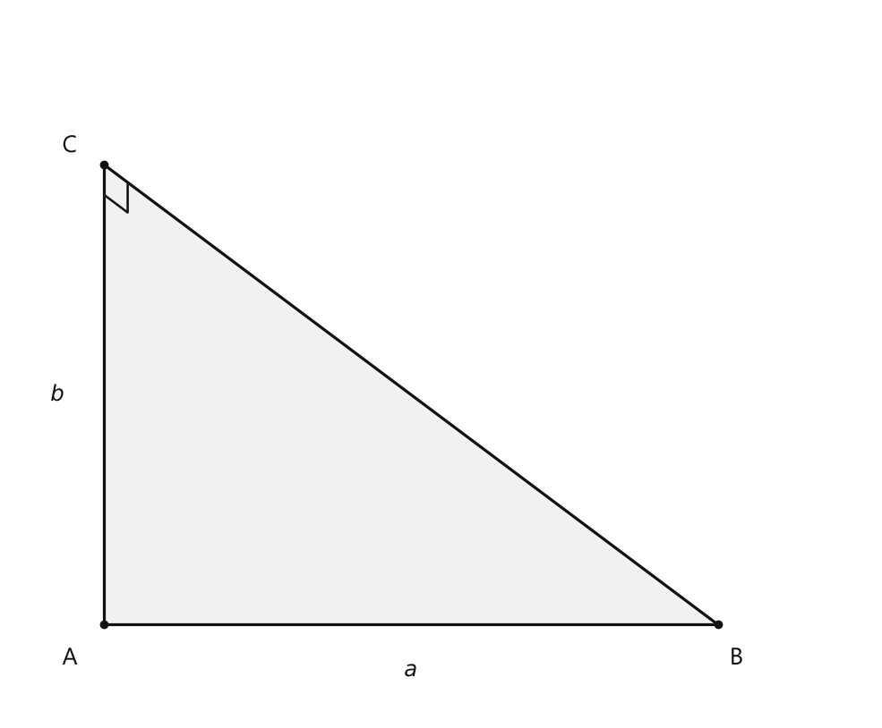
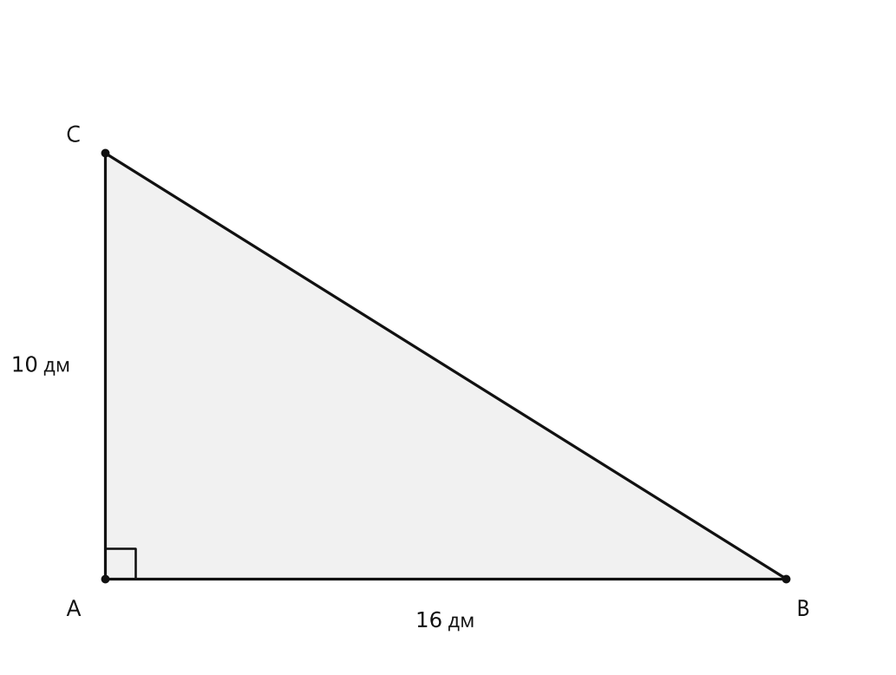
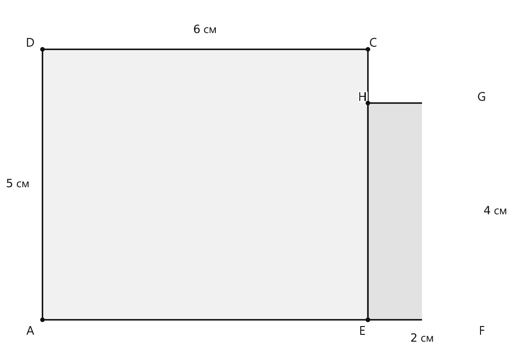
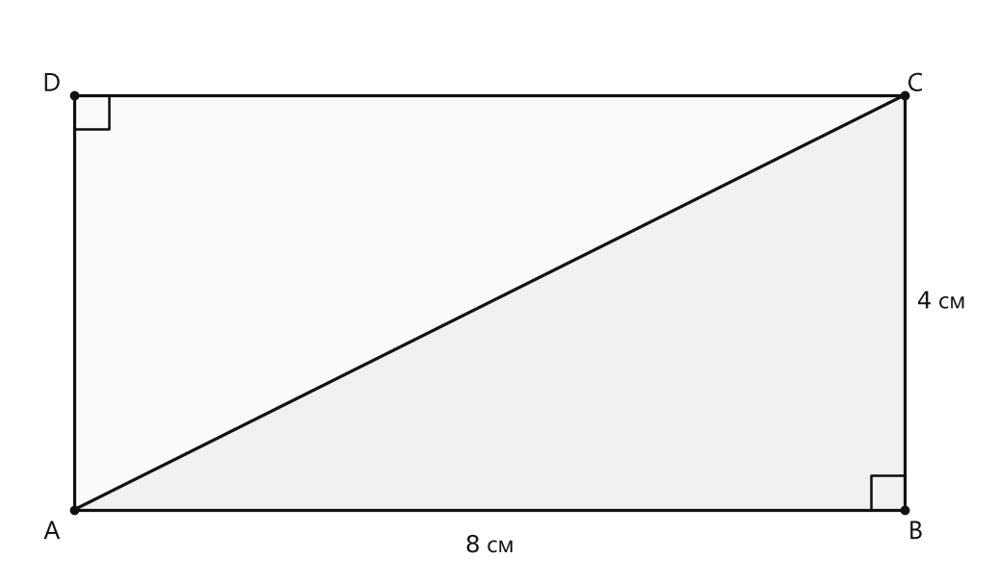

# Занятие 37. Площадь прямоугольного треугольника

**Раздел:** Глава 2  
**Параграф учебника:** §14. Площадь прямоугольного треугольника  
**Страницы:** 259–260

## Цели занятия

После занятия ученик умеет:

- распознавать прямоугольный треугольник;
- находить его площадь по длинам сторон, образующих прямой угол;
- не путать катеты с третьей стороной треугольника;
- находить неизвестную сторону прямоугольного треугольника по его площади;
- разбивать некоторые многоугольники на прямоугольники и складывать их площади;
- записывать ответ с правильной единицей площади.

Выбери блок своего уровня:

- **1–2 балла:** понять правило и решить одну простую задачу;
- **3–4 балла:** находить площадь прямоугольного треугольника;
- **5–6 баллов:** находить неизвестную сторону и работать с единицами;
- **7–8 баллов:** находить площадь составной фигуры;
- **9–10 баллов:** решать комбинированные задачи и объяснять каждый шаг.

## Теория к занятию

### 1. Площадь многоугольника

#### Простыми словами

Измерить площадь многоугольника — значит узнать, сколько единиц площади в нём содержится. Например, если фигуру можно покрыть 20 квадратами со стороной 1 см без промежутков и наложений, её площадь равна $20\text{ см}^2$.

Прямоугольник уже умеет считать площадь по формуле. А прямоугольный треугольник можно представить как половину подходящего прямоугольника. То есть треугольник здесь не хитрит — он просто делит прямоугольник пополам.

#### Факт

Измерить площадь любого многоугольника — значит узнать, сколько единиц площади (единичных квадратов) в нём содержится.

#### Формулы

Площадь прямоугольника:

$$S=a\cdot b,$$

где $a$ и $b$ — длины смежных сторон прямоугольника, $S$ — его площадь.

Площадь квадрата:

$$S=a^2,$$

где $a$ — длина стороны квадрата, $S$ — его площадь.

#### Правила

- Длины должны быть выражены в одинаковых единицах.
- Площадь записывают в квадратных единицах: $\text{см}^2$, $\text{м}^2$, $\text{дм}^2$.
- Длину записывают в сантиметрах, метрах и других единицах длины, но не в квадратных.

#### Ловушки

- $8\text{ см}\cdot 5\text{ см}=40\text{ см}^2$, а не $40\text{ см}$.
- Если одна длина дана в метрах, а другая в дециметрах, сначала нужно привести их к одной единице.
- Площадь — это не периметр. Периметр складывает длины сторон, площадь считает «сколько места внутри».

---

### 2. Площадь прямоугольного треугольника

#### Простыми словами

У прямоугольного треугольника есть прямой угол. Две стороны, образующие этот угол, можно достроить до прямоугольника. Треугольник занимает ровно половину этого прямоугольника.

Если стороны, образующие прямой угол, равны $a$ и $b$, то площадь прямоугольника равна $a\cdot b$, а площадь треугольника — в два раза меньше.

На рисунке прямой угол находится в точке $C$, поэтому стороны $AC$ и $BC$ образуют прямой угол.

<!--geo-figure-spec
{
  "needed": true,
  "kind": "plane",
  "caption": "Прямоугольный треугольник $ABC$",
  "equal": true,
  "axis": false,
  "xlim": [
    -0.6,
    5
  ],
  "ylim": [
    -0.6,
    4
  ],
  "points": {
    "A": [
      0,
      0
    ],
    "B": [
      4,
      0
    ],
    "C": [
      0,
      3
    ]
  },
  "segments": [
    [
      "A",
      "B"
    ],
    [
      "B",
      "C"
    ],
    [
      "C",
      "A"
    ]
  ],
  "polygons": [
    {
      "vertices": [
        "A",
        "B",
        "C"
      ],
      "fill": 0.06
    }
  ],
  "circles": [],
  "labels": {
    "A": {
      "dx": -0.22,
      "dy": -0.22
    },
    "B": {
      "dx": 0.12,
      "dy": -0.22
    },
    "C": {
      "dx": -0.22,
      "dy": 0.12
    }
  },
  "right_angles": [
    {
      "vertex": "C",
      "from": "A",
      "to": "B"
    }
  ],
  "angle_marks": [],
  "texts": [
    {
      "xy": [
        2,
        -0.3
      ],
      "text": "$a$"
    },
    {
      "xy": [
        -0.3,
        1.5
      ],
      "text": "$b$"
    }
  ]
}
-->

*Прямоугольный треугольник ABC*

#### Правило

Площадь прямоугольного треугольника равна половине произведения длин сторон, образующих прямой угол.

#### Формула

$$S=\frac{a\cdot b}{2},$$

где $a$ и $b$ — длины сторон, образующих прямой угол, $S$ — площадь прямоугольного треугольника.

Можно записывать и так:

$$S=(a\cdot b):2.$$

#### Алгоритм нахождения площади прямоугольного треугольника

1. Найти прямой угол.
2. Определить две стороны, образующие этот угол.
3. Обозначить их длины $a$ и $b$.
4. Перемножить эти длины.
5. Полученное произведение разделить на $2$.
6. Записать единицу площади.

#### Пример

Стороны, образующие прямой угол, равны $8\text{ см}$ и $12\text{ см}$.

$$S=(8\cdot 12):2$$

$$S=96:2$$

$$S=48\text{ см}^2$$

Треугольник получил половину площади прямоугольника $8\text{ см}\times12\text{ см}$. Всё честно: прямоугольник — $96\text{ см}^2$, половина — $48\text{ см}^2$.

#### Ловушки

- Нельзя брать для формулы любые две стороны. Нужны именно стороны, образующие прямой угол.
- Нельзя забывать деление на $2$.
- Если получилось $a\cdot b$, это площадь прямоугольника, а не прямоугольного треугольника.
- Прямой угол — $90^\circ$. Угол «похож на прямой» — не математическое доказательство.

---

### 3. Площадь многоугольника, составленного из прямоугольников

#### Простыми словами

Некоторые многоугольники неудобно считать одной формулой. Тогда их разбивают на прямоугольники, находят площадь каждого прямоугольника и складывают результаты.

Фигура может выглядеть как ступенька, буква «Г» или деталь конструктора. Не пугайся: если её можно разложить на прямоугольники, задача превращается в несколько обычных умножений.

#### Факт

Для нахождения площадей некоторых многоугольников их разбивают на прямоугольники. Тогда площадь многоугольника равна сумме площадей соответствующих прямоугольников.

#### Алгоритм

1. Разбить многоугольник на прямоугольники.
2. Найти длины сторон каждого прямоугольника.
3. Найти площадь каждого прямоугольника по формуле $S=a\cdot b$.
4. Сложить полученные площади.
5. Записать ответ в квадратных единицах.

#### Ловушки

- Не складывай длины, если спрашивают площадь.
- Не умножай размеры всей внешней рамки, если часть фигуры вырезана.
- Проверь, что все прямоугольники действительно покрывают фигуру без промежутков и перекрытий.
- Сумма площадей частей должна быть не больше площади внешнего прямоугольника.

---

## Сводка формул «выучить наизусть»

Площадь прямоугольника:

$$S=a\cdot b.$$

Площадь квадрата:

$$S=a^2.$$

Площадь прямоугольного треугольника:

$$S=\frac{a\cdot b}{2}.$$

Стороны $a$ и $b$ в последней формуле — стороны, образующие прямой угол.

## Правила, которые нельзя путать

- Для прямоугольника: умножаем длины двух смежных сторон.
- Для прямоугольного треугольника: умножаем длины сторон, образующих прямой угол, и делим на $2$.
- Площадь записываем в квадратных единицах.
- Сначала приводим длины к одинаковым единицам.
- В прямоугольном треугольнике прямой угол подсказывает, какие стороны использовать.

# Разбор ключевых заданий

## Р1. Площадь прямоугольного треугольника

**Условие:** стороны прямоугольного треугольника, образующие прямой угол, равны $10\text{ дм}$ и $16\text{ дм}$. Найдите площадь треугольника.

<!--geo-figure-spec
{
  "needed": true,
  "kind": "plane",
  "caption": "Прямоугольный треугольник $ABC$ с катетами $10$ дм и $16$ дм",
  "equal": true,
  "axis": false,
  "xlim": [
    -0.6,
    5.5
  ],
  "ylim": [
    -0.6,
    4
  ],
  "points": {
    "A": [
      0,
      0
    ],
    "B": [
      4.8,
      0
    ],
    "C": [
      0,
      3
    ]
  },
  "segments": [
    [
      "A",
      "B"
    ],
    [
      "B",
      "C"
    ],
    [
      "C",
      "A"
    ]
  ],
  "polygons": [
    {
      "vertices": [
        "A",
        "B",
        "C"
      ],
      "fill": 0.06
    }
  ],
  "circles": [],
  "labels": {
    "A": {
      "dx": -0.22,
      "dy": -0.22
    },
    "B": {
      "dx": 0.12,
      "dy": -0.22
    },
    "C": {
      "dx": -0.22,
      "dy": 0.12
    }
  },
  "right_angles": [
    {
      "vertex": "A",
      "from": "B",
      "to": "C"
    }
  ],
  "angle_marks": [],
  "texts": [
    {
      "xy": [
        2.4,
        -0.3
      ],
      "text": "$16$ дм"
    },
    {
      "xy": [
        -0.45,
        1.5
      ],
      "text": "$10$ дм"
    }
  ]
}
-->

*Прямоугольный треугольник ABC с катетами 10 дм и 16 дм*

**Решение:**

Стороны, образующие прямой угол, равны:

$$a=10\text{ дм},\qquad b=16\text{ дм}.$$

Используем правило площади прямоугольного треугольника:

$$S=\frac{a\cdot b}{2}.$$

Подставим значения:

$$S=\frac{10\cdot16}{2}.$$

Выполним умножение:

$$10\cdot16=160.$$

Разделим на $2$:

$$160:2=80.$$

Запишем единицу площади:

$$S=80\text{ дм}^2.$$

**Ответ:** $80\text{ дм}^2$.

> Типичная ошибка: получить $160\text{ дм}^2$ и забыть, что треугольник занимает только половину прямоугольника.

---

## Р2. Разные единицы длины

**Условие:** стороны прямоугольного треугольника, образующие прямой угол, равны $3\text{ м}$ и $24\text{ дм}$. Найдите площадь треугольника в квадратных дециметрах.

**Решение:**

Приведём длины к дециметрам:

$$3\text{ м}=30\text{ дм}.$$

Теперь стороны равны:

$$a=30\text{ дм},\qquad b=24\text{ дм}.$$

Применим формулу:

$$S=\frac{a\cdot b}{2}.$$

Подставим значения:

$$S=\frac{30\cdot24}{2}.$$

Выполним умножение:

$$30\cdot24=720.$$

Разделим на $2$:

$$720:2=360.$$

Единица площади — квадратный дециметр:

$$S=360\text{ дм}^2.$$

Проверка: прямоугольник со сторонами $30\text{ дм}$ и $24\text{ дм}$ имеет площадь $720\text{ дм}^2$, а треугольник — половину, то есть $360\text{ дм}^2$.

**Ответ:** $360\text{ дм}^2$.

> Метры и дециметры в одной формуле не живут мирно. Сначала переводим, потом считаем.

---

## Р3. Нахождение неизвестной стороны

**Условие:** площадь прямоугольного треугольника равна $40\text{ см}^2$. Одна из сторон, образующих прямой угол, равна $8\text{ см}$. Найдите длину второй стороны, образующей прямой угол.

**Решение:**

Обозначим неизвестную сторону через $b$.

По формуле площади прямоугольного треугольника:

$$S=\frac{a\cdot b}{2}.$$

Подставим известные значения:

$$40=\frac{8\cdot b}{2}.$$

Умножим обе части равенства на $2$:

$$80=8\cdot b.$$

Найдём неизвестный множитель:

$$b=80:8.$$

Выполним деление:

$$b=10.$$

Запишем единицу длины:

$$b=10\text{ см}.$$

Проверим найденную сторону:

$$S=\frac{8\cdot10}{2}.$$

$$S=\frac{80}{2}=40\text{ см}^2.$$

Площадь совпала с условием.

**Ответ:** $10\text{ см}$.

---

## Р4. Площадь фигуры, составленной из двух прямоугольников

**Условие:** Фигура состоит из двух прямоугольников, расположенных без перекрытия. Первый прямоугольник имеет длину $6\text{ см}$ и ширину $5\text{ см}$, второй — длину $2\text{ см}$ и ширину $4\text{ см}$. Найдите площадь всей фигуры.

<!--geo-figure-spec
{
  "needed": true,
  "kind": "plane",
  "caption": "Фигура, составленная из двух прямоугольников",
  "equal": true,
  "axis": false,
  "xlim": [
    -0.6,
    7
  ],
  "ylim": [
    -0.6,
    5.8
  ],
  "points": {
    "A": [
      0,
      0
    ],
    "B": [
      6,
      0
    ],
    "C": [
      6,
      5
    ],
    "D": [
      0,
      5
    ],
    "E": [
      6,
      0
    ],
    "F": [
      8,
      0
    ],
    "G": [
      8,
      4
    ],
    "H": [
      6,
      4
    ]
  },
  "segments": [
    [
      "A",
      "B"
    ],
    [
      "B",
      "C"
    ],
    [
      "C",
      "D"
    ],
    [
      "D",
      "A"
    ],
    [
      "E",
      "F"
    ],
    [
      "F",
      "G"
    ],
    [
      "G",
      "H"
    ],
    [
      "H",
      "E"
    ]
  ],
  "polygons": [
    {
      "vertices": [
        "A",
        "B",
        "C",
        "D"
      ],
      "fill": 0.06
    },
    {
      "vertices": [
        "E",
        "F",
        "G",
        "H"
      ],
      "fill": 0.12
    }
  ],
  "circles": [],
  "labels": {
    "A": {
      "dx": -0.22,
      "dy": -0.22
    },
    "B": {
      "dx": -0.1,
      "dy": -0.22
    },
    "C": {
      "dx": 0.1,
      "dy": 0.1
    },
    "D": {
      "dx": -0.22,
      "dy": 0.1
    },
    "E": {
      "dx": -0.1,
      "dy": -0.22
    },
    "F": {
      "dx": 0.1,
      "dy": -0.22
    },
    "G": {
      "dx": 0.1,
      "dy": 0.1
    },
    "H": {
      "dx": -0.1,
      "dy": 0.1
    }
  },
  "right_angles": [],
  "angle_marks": [],
  "texts": [
    {
      "xy": [
        3,
        5.35
      ],
      "text": "$6$ см"
    },
    {
      "xy": [
        -0.45,
        2.5
      ],
      "text": "$5$ см"
    },
    {
      "xy": [
        7,
        -0.35
      ],
      "text": "$2$ см"
    },
    {
      "xy": [
        8.35,
        2
      ],
      "text": "$4$ см"
    }
  ]
}
-->

*Фигура, составленная из двух прямоугольников*

**Решение:**

Разобьём фигуру на два прямоугольника.

Площадь первого прямоугольника:

$$S_1=6\cdot5.$$

$$S_1=30\text{ см}^2.$$

Площадь второго прямоугольника:

$$S_2=2\cdot4.$$

$$S_2=8\text{ см}^2.$$

Площадь всей фигуры равна сумме площадей частей:

$$S=S_1+S_2.$$

Подставим найденные значения:

$$S=30+8.$$

$$S=38\text{ см}^2.$$

**Ответ:** $38\text{ см}^2$.

> Здесь ничего не вырезали и не потеряли: две части просто складываются. Математический конструктор собран.

---

## Р5. Прямоугольный треугольник внутри прямоугольника

**Условие:** Прямоугольник $ABCD$ имеет стороны $AB=8\text{ см}$ и $BC=4\text{ см}$. Диагональ $AC$ делит прямоугольник на два равных прямоугольных треугольника. Найдите площадь одного из этих треугольников.

<!--geo-figure-spec
{
  "needed": true,
  "kind": "plane",
  "caption": "Прямоугольник $ABCD$, разделённый диагональю $AC$",
  "equal": true,
  "axis": false,
  "xlim": [
    -0.6,
    8.8
  ],
  "ylim": [
    -0.6,
    4.8
  ],
  "points": {
    "A": [
      0,
      0
    ],
    "B": [
      8,
      0
    ],
    "C": [
      8,
      4
    ],
    "D": [
      0,
      4
    ]
  },
  "segments": [
    [
      "A",
      "B"
    ],
    [
      "B",
      "C"
    ],
    [
      "C",
      "D"
    ],
    [
      "D",
      "A"
    ],
    [
      "A",
      "C"
    ]
  ],
  "polygons": [
    {
      "vertices": [
        "A",
        "B",
        "C"
      ],
      "fill": 0.06
    },
    {
      "vertices": [
        "A",
        "C",
        "D"
      ],
      "fill": 0.02
    }
  ],
  "circles": [],
  "labels": {
    "A": {
      "dx": -0.22,
      "dy": -0.22
    },
    "B": {
      "dx": 0.1,
      "dy": -0.22
    },
    "C": {
      "dx": 0.1,
      "dy": 0.1
    },
    "D": {
      "dx": -0.22,
      "dy": 0.1
    }
  },
  "right_angles": [
    {
      "vertex": "B",
      "from": "A",
      "to": "C"
    },
    {
      "vertex": "D",
      "from": "A",
      "to": "C"
    }
  ],
  "angle_marks": [],
  "texts": [
    {
      "xy": [
        4,
        -0.35
      ],
      "text": "$8$ см"
    },
    {
      "xy": [
        8.35,
        2
      ],
      "text": "$4$ см"
    }
  ]
}
-->

*Прямоугольник ABCD, разделённый диагональю AC*

**Решение:**

Рассмотрим один из получившихся треугольников.

Его стороны, образующие прямой угол, равны $8\text{ см}$ и $4\text{ см}$.

Используем формулу:

$$S=\frac{a\cdot b}{2}.$$

Подставим значения:

$$S=\frac{8\cdot4}{2}.$$

Выполним умножение:

$$8\cdot4=32.$$

Разделим на $2$:

$$32:2=16.$$

Запишем единицу площади:

$$S=16\text{ см}^2.$$

Проверка через площадь прямоугольника:

$$S_{\text{прямоугольника}}=8\cdot4=32\text{ см}^2.$$

Один треугольник составляет половину прямоугольника:

$$32:2=16\text{ см}^2.$$

**Ответ:** $16\text{ см}^2$.

## Практические задания

Выбери свой уровень и решай только этот блок. В блоке должна закрепиться вся тема параграфа. Ответы не приводятся.

### Уровень 1–2 балла

**С1.** Найдите площадь прямоугольного треугольника, если длины сторон, образующих прямой угол, равны $6\text{ см}$ и $8\text{ см}$.

**С2.** Найдите площадь прямоугольного треугольника, если длины сторон, образующих прямой угол, равны $10\text{ дм}$ и $14\text{ дм}$.

**С3.** Выберите формулу для нахождения площади прямоугольного треугольника, если $a$ и $b$ — длины сторон, образующих прямой угол.  
1) $S=ab$  
2) $S=2ab$  
3) $S=\dfrac{ab}{2}$  
4) $S=a+b$  
5) $S=\dfrac{a+b}{2}$

**С4.** Площадь прямоугольного треугольника равна $36\text{ см}^2$. Одна из сторон, образующих прямой угол, равна $9\text{ см}$. Найдите длину второй стороны, образующей прямой угол.

**С5.** Найдите площадь прямоугольного треугольника, если длины сторон, образующих прямой угол, равны $4\text{ м}$ и $30\text{ дм}$. Ответ запишите в квадратных дециметрах.

**С6.** Выберите верное утверждение о прямоугольном треугольнике.  
1) Его площадь равна произведению всех трёх сторон.  
2) Его площадь равна половине произведения сторон, образующих прямой угол.  
3) Его площадь равна сумме сторон, образующих прямой угол.  
4) Его площадь всегда равна площади квадрата.  
5) Его площадь равна удвоенному произведению сторон, образующих прямой угол.

**С7.** Прямоугольник имеет длины сторон $12\text{ см}$ и $7\text{ см}$. Его разделили диагональю на два равных прямоугольных треугольника. Найдите площадь одного из получившихся треугольников.

**С8.** Найдите площадь прямоугольного треугольника, если длины сторон, образующих прямой угол, равны $3\text{ м}$ и $8\text{ м}$.

**С9.** Площадь прямоугольного треугольника равна $45\text{ дм}^2$, а одна из сторон, образующих прямой угол, равна $10\text{ дм}$. Найдите длину второй стороны, образующей прямой угол.

**С10.** Выберите площадь прямоугольного треугольника со сторонами, образующими прямой угол, $5\text{ см}$ и $12\text{ см}$.  
1) $17\text{ см}^2$  
2) $30\text{ см}^2$  
3) $34\text{ см}^2$  
4) $60\text{ см}^2$  
5) $120\text{ см}^2$

**С11.** В прямоугольнике со сторонами $16\text{ см}$ и $5\text{ см}$ проведена диагональ. Найдите площадь одного из двух получившихся прямоугольных треугольников.

**С12.** Найдите площадь прямоугольного треугольника, если длины сторон, образующих прямой угол, равны $24\text{ см}$ и $15\text{ см}$.

**С13.** Найдите площадь прямоугольного треугольника, если длины сторон, образующих прямой угол, равны $8$ см и $5$ см.

**С14.** Найдите площадь прямоугольного треугольника, если длины сторон, образующих прямой угол, равны $12$ дм и $7$ дм.

**С15.** Выберите формулу площади прямоугольного треугольника, если $a$ и $b$ — длины сторон, образующих прямой угол.

1) $S=ab$  
2) $S=2ab$  
3) $S=\dfrac{ab}{2}$  
4) $S=a+b$  
5) $S=\dfrac{a+b}{2}$

**С16.** Площадь прямоугольного треугольника равна $36$ см$^2$, а одна из сторон, образующих прямой угол, равна $9$ см. Найдите длину второй стороны, образующей прямой угол.

**С17.** Площадь прямоугольного треугольника равна $45$ дм$^2$, а одна из сторон, образующих прямой угол, равна $10$ дм. Найдите длину второй стороны, образующей прямой угол.

**С18.** Найдите площадь прямоугольного треугольника, если длины сторон, образующих прямой угол, равны $3$ м и $20$ дм. Ответ запишите в квадратных дециметрах.

**С19.** Найдите площадь прямоугольного треугольника, если длины сторон, образующих прямой угол, равны $40$ см и $6$ дм. Ответ запишите в квадратных сантиметрах.

**С20.** Прямоугольник имеет длины сторон $10$ см и $6$ см. Его диагональ делит прямоугольник на два равных прямоугольных треугольника. Найдите площадь одного из этих треугольников.

**С21.** Выберите формулу площади прямоугольного треугольника, если длины сторон, образующих прямой угол, равны $a$ и $b$.

1) $S=ab$  
2) $S=2ab$  
3) $S=\dfrac{ab}{2}$  
4) $S=a+b$  
5) $S=\dfrac{a+b}{2}$

**С22.** Фигура состоит из прямоугольника со сторонами $8$ см и $5$ см и прилегающего к нему прямоугольного треугольника. Стороны треугольника, образующие прямой угол, равны $8$ см и $4$ см. Найдите площадь всей фигуры.

**С23.** Из прямоугольника со сторонами $14$ см и $10$ см вырезали прямоугольный треугольник, стороны которого, образующие прямой угол, равны $6$ см и $10$ см. Найдите площадь оставшейся части прямоугольника.

**С24.** Выберите верное утверждение о площади прямоугольного треугольника.

1) Она равна произведению двух сторон, образующих прямой угол.  
2) Она равна сумме двух сторон, образующих прямой угол.  
3) Она равна половине произведения двух сторон, образующих прямой угол.  
4) Она равна удвоенному произведению двух сторон, образующих прямой угол.  
5) Она равна произведению всех трёх сторон.

**С25.** Стороны, образующие прямой угол в прямоугольном треугольнике, равны $4$ м и $12$ дм. Найдите площадь треугольника в квадратных дециметрах.

**С26.** Выберите верное утверждение.

1) Площадь прямоугольного треугольника равна произведению его катетов.  
2) Площадь прямоугольного треугольника равна половине произведения его катетов.  
3) Площадь прямоугольного треугольника равна сумме его катетов.  
4) Площадь прямоугольного треугольника равна удвоенной сумме его катетов.  
5) Площадь прямоугольного треугольника равна половине суммы его катетов.

**С27.** Найдите площадь прямоугольного треугольника, если его катеты равны $15$ см и $8$ см.

**С28.** Один катет прямоугольного треугольника равен $7$ дм, а площадь треугольника равна $28$ дм$^2$. Найдите длину второго катета.

**С29.** Выберите площадь прямоугольного треугольника с катетами $3$ м и $4$ м.

1) $6$ м$^2$  
2) $7$ м$^2$  
3) $12$ м$^2$  
4) $24$ м$^2$  
5) $14$ м$^2$

**С30.** Прямоугольник имеет длину $12$ см и ширину $7$ см. Его разделили диагональю на два равных прямоугольных треугольника. Найдите площадь одного из этих треугольников.

**С31.** Стороны, образующие прямой угол в прямоугольном треугольнике, равны $2$ м и $5$ дм. Найдите площадь треугольника в квадратных дециметрах.

**С32.** Выберите длину второго катета прямоугольного треугольника, если площадь треугольника равна $45$ см$^2$, а первый катет равен $10$ см.

1) $4{,}5$ см  
2) $5$ см  
3) $9$ см  
4) $18$ см  
5) $90$ см

**С33.** Найдите площадь прямоугольного треугольника, если стороны, образующие прямой угол, равны $9$ см и $14$ см.

**С34.** Площадь прямоугольного треугольника равна $36\text{ см}^2$. Одна из сторон, образующих прямой угол, равна $8$ см. Найдите длину второй стороны, образующей прямой угол.

**С35.** Найдите площадь прямоугольного треугольника, если стороны, образующие прямой угол, равны $2$ м и $30$ дм. Ответ запишите в квадратных дециметрах.

**С36.** Стороны $AB$ и $BC$ прямоугольного треугольника $ABC$ образуют прямой угол. $AB=12$ см, $BC=5$ см. Выберите верное значение площади треугольника.

1) $17\text{ см}^2$  
2) $30\text{ см}^2$  
3) $60\text{ см}^2$  
4) $120\text{ см}^2$  
5) $144\text{ см}^2$

### Уровень 3–4 балла

**С1.** Найдите площадь прямоугольного треугольника, если длины его сторон, образующих прямой угол, равны $8$ см и $14$ см.

**С2.** Найдите площадь прямоугольного треугольника, если длины его сторон, образующих прямой угол, равны $3$ м и $20$ дм. Ответ выразите в квадратных метрах.

**С3.** Найдите площадь прямоугольного треугольника с катетами $18$ см и $7$ см.

**С4.** Площадь прямоугольного треугольника равна $54$ см$^2$. Одна из сторон, образующих прямой угол, равна $9$ см. Найдите длину второй стороны, образующей прямой угол.

**С5.** Площадь прямоугольного треугольника равна $96$ дм$^2$, а длина одной из сторон, образующих прямой угол, равна $16$ дм. Найдите длину второй стороны, образующей прямой угол.

**С6.** Сравните площади двух прямоугольных треугольников: у первого стороны, образующие прямой угол, равны $10$ см и $12$ см, а у второго — $8$ см и $15$ см.

**С7.** Прямоугольник имеет длину $12$ см и ширину $9$ см. Его диагональ делит прямоугольник на два равных прямоугольных треугольника. Найдите площадь одного из получившихся треугольников.

**С8.** Один из катетов прямоугольного треугольника равен $15$ см, а площадь треугольника — $90$ см$^2$. Найдите длину второго катета.

**С9.** Участок земли имеет форму прямоугольного треугольника. Длины его сторон, образующих прямой угол, равны $20$ м и $15$ м. Найдите площадь участка.

**С10.** Из прямоугольника длиной $10$ см и шириной $8$ см вырезали прямоугольный треугольник, стороны которого, образующие прямой угол, равны $4$ см и $6$ см. Найдите площадь оставшейся части прямоугольника.

**С11.** Стороны, образующие прямой угол в прямоугольном треугольнике, имеют длины $2$ м и $50$ см. Найдите площадь треугольника в квадратных сантиметрах.

**С12.** Верно ли утверждение: если стороны, образующие прямой угол в прямоугольном треугольнике, равны $10$ см и $6$ см, то площадь треугольника равна $60$ см$^2$? Обоснуйте ответ вычислением.

**С13.** Найдите площадь прямоугольного треугольника, если длины сторон, образующих прямой угол, равны $12$ см и $7$ см.

**С14.** Найдите площадь прямоугольного треугольника, если длины сторон, образующих прямой угол, равны $9$ дм и $14$ дм.

**С15.** Найдите площадь прямоугольного треугольника, если длины сторон, образующих прямой угол, равны $4$ м и $18$ дм. Ответ выразите в квадратных дециметрах.

**С16.** Найдите площадь прямоугольного треугольника, если длины сторон, образующих прямой угол, равны $25$ см и $8$ дм. Ответ выразите в квадратных сантиметрах.

**С17.** Площадь прямоугольного треугольника равна $36\text{ см}^2$. Одна из сторон, образующих прямой угол, равна $9$ см. Найдите длину второй стороны, образующей прямой угол.

**С18.** Площадь прямоугольного треугольника равна $54\text{ дм}^2$, а одна из сторон, образующих прямой угол, равна $12$ дм. Найдите длину второй стороны, образующей прямой угол.

**С19.** Один катет прямоугольного треугольника равен $6$ см, а второй катет в 3 раза длиннее. Найдите площадь треугольника.

**С20.** Один катет прямоугольного треугольника равен $16$ м, а второй катет на $5$ м короче. Найдите площадь треугольника.

**С21.** Прямоугольный треугольник имеет катеты длиной $10$ см и $12$ см. На сколько квадратных сантиметров площадь прямоугольника со сторонами $10$ см и $12$ см больше площади этого треугольника?

**С22.** Прямоугольник со сторонами $8$ см и $15$ см разделили диагональю на два равных прямоугольных треугольника. Найдите площадь одного из получившихся треугольников.

**С23.** Прямоугольный треугольник имеет катеты длиной $14$ см и $10$ см. Из двух таких одинаковых треугольников составили прямоугольник. Найдите площадь составленного прямоугольника.

**С24.** Прямоугольный треугольник имеет катеты длиной $6$ дм и $8$ дм. К нему присоединили прямоугольник со сторонами $8$ дм и $5$ дм так, что фигуры не перекрываются. Найдите площадь получившейся фигуры.

**С25.** Найдите площадь прямоугольного треугольника, если длины сторон, образующих прямой угол, равны $14$ см и $9$ см.

**С26.** Найдите площадь прямоугольного треугольника, если длины сторон, образующих прямой угол, равны $2$ м и $35$ дм. Ответ выразите в квадратных дециметрах.

**С27.** Площадь прямоугольного треугольника равна $54$ см$^2$. Одна из сторон, образующих прямой угол, равна $9$ см. Найдите длину второй стороны, образующей прямой угол.

**С28.** Площадь прямоугольного треугольника равна $72$ дм$^2$, а одна из сторон, образующих прямой угол, равна $12$ дм. Найдите длину второй стороны, образующей прямой угол.

**С29.** Выберите верное утверждение. Площадь прямоугольного треугольника со сторонами, образующими прямой угол, $8$ см и $5$ см равна:

1) $13$ см$^2$  
2) $20$ см$^2$  
3) $40$ см$^2$  
4) $26$ см$^2$  
5) $10$ см$^2$

**С30.** Прямоугольник имеет длину $16$ см и ширину $7$ см. Его разделили диагональю на два равных прямоугольных треугольника. Найдите площадь одного из получившихся треугольников.

**С31.** Из прямоугольника со сторонами $15$ см и $10$ см вырезали прямоугольный треугольник, стороны которого, образующие прямой угол, равны $6$ см и $5$ см. Найдите площадь оставшейся части прямоугольника.

**С32.** Фигура состоит из прямоугольника со сторонами $12$ м и $8$ м и примыкающего к нему прямоугольного треугольника. Стороны треугольника, образующие прямой угол, равны $8$ м и $5$ м. Найдите площадь всей фигуры.

**С33.** Стороны, образующие прямой угол в прямоугольном треугольнике, относятся как $2:3$. Меньшая из них равна $8$ см. Найдите площадь треугольника.

**С34.** Участок имеет форму прямоугольного треугольника. Его стороны, образующие прямой угол, равны $30$ м и $24$ м. Сколько квадратных метров занимает этот участок?

**С35.** Верно ли утверждение: если одну из сторон, образующих прямой угол в прямоугольном треугольнике, увеличить в 2 раза, а вторую не изменять, то площадь треугольника увеличится в 2 раза? Запишите ответ «да» или «нет».

**С36.** Прямоугольник со сторонами $18$ см и $12$ см разделён диагональю на два прямоугольных треугольника. От одного из треугольников отрезали прямоугольный треугольник, стороны которого, образующие прямой угол, равны $6$ см и $4$ см. Найдите площадь оставшейся части этого треугольника.

### Уровень 5–6 баллов

**С1.** Найдите площадь прямоугольного треугольника, если длины сторон, образующих прямой угол, равны $14$ см и $9$ см.

**С2.** Найдите площадь прямоугольного треугольника, если длины сторон, образующих прямой угол, равны $6$ дм и $15$ см. Ответ выразите в квадратных сантиметрах.

**С3.** Площадь прямоугольного треугольника равна $54\text{ см}^2$. Одна из сторон, образующих прямой угол, равна $9$ см. Найдите длину второй стороны.

**С4.** Площадь прямоугольного треугольника равна $2\text{ м}^2$. Одна из сторон, образующих прямой угол, равна $1$ м. Найдите длину второй стороны в метрах.

**С5.** Катеты прямоугольного треугольника имеют длины $8$ м и $25$ дм. Найдите его площадь в квадратных дециметрах.

**С6.** Прямоугольник имеет длины сторон $12$ см и $7$ см. Его диагональ делит прямоугольник на два прямоугольных треугольника. Найдите площадь одного из получившихся треугольников.

**С7.** Из прямоугольной картонной заготовки длиной $18$ см и шириной $10$ см вырезали прямоугольный треугольник с катетами $6$ см и $8$ см. Найдите площадь оставшейся части заготовки.

**С8.** Прямоугольный треугольник имеет площадь $84\text{ дм}^2$, а одна из его сторон, образующих прямой угол, равна $12$ дм. Найдите длину второй стороны в дециметрах.

**С9.** Сравните площади двух прямоугольных треугольников. У первого катеты равны $10$ см и $16$ см, у второго — $12$ см и $14$ см. На сколько квадратных сантиметров площадь одного треугольника больше площади другого?

**С10.** Верно ли утверждение: если один катет прямоугольного треугольника увеличить в 2 раза, а второй оставить без изменения, то площадь треугольника увеличится в 2 раза? Обоснуйте ответ вычислением для треугольника с катетами $5$ см и $8$ см.

**С11.** Прямоугольная клумба имеет длины сторон $16$ м и $9$ м. В одном из её углов выделили прямоугольный треугольник с катетами $6$ м и $9$ м под дорожку. Какую площадь занимает оставшаяся часть клумбы?

**С12.** Фигура состоит из прямоугольника со сторонами $20$ м и $12$ м и примыкающего к его стороне прямоугольного треугольника. Сторона треугольника, совпадающая со стороной прямоугольника, равна $12$ м, а другая сторона, образующая с ней прямой угол, равна $15$ м. Найдите площадь всей фигуры.

**С13.** Найдите площадь прямоугольного треугольника, если длины его катетов равны $14$ см и $9$ см.

**С14.** Найдите площадь прямоугольного треугольника, если его катеты имеют длины $2$ м и $35$ дм. Ответ выразите в квадратных дециметрах.

**С15.** Площадь прямоугольного треугольника равна $54\text{ см}^2$, а длина одного из катетов равна $12$ см. Найдите длину второго катета.

**С16.** Площадь прямоугольного треугольника равна $84\text{ дм}^2$, а длина одного из катетов равна $14$ дм. Найдите длину второго катета.

**С17.** Один из катетов прямоугольного треугольника в $3$ раза длиннее другого. Найдите длины катетов, если площадь треугольника равна $24\text{ см}^2$.

**С18.** Катеты прямоугольного треугольника равны $8$ см и $15$ см. Найдите площадь прямоугольника, стороны которого равны этим катетам, и сравните её с площадью треугольника.

**С19.** Прямоугольник имеет длину $18$ см и ширину $10$ см. Его разделили диагональю на два равных прямоугольных треугольника. Найдите площадь каждого треугольника.

**С20.** Из прямоугольной пластины длиной $20$ см и шириной $12$ см вырезали прямоугольный треугольник с катетами $20$ см и $12$ см. Найдите площадь оставшейся части пластины.

**С21.** Фигура состоит из прямоугольника длиной $16$ м и шириной $9$ м и прилегающего к нему прямоугольного треугольника с катетами $9$ м и $8$ м. Найдите площадь всей фигуры.

**С22.** От прямоугольника длиной $25$ см и шириной $16$ см отрезали прямоугольный треугольник с катетами $10$ см и $16$ см. Найдите площадь оставшейся части прямоугольника.

**С23.** Верно ли утверждение: если один катет прямоугольного треугольника увеличить в $2$ раза, а второй не изменять, то площадь треугольника увеличится в $2$ раза? Обоснуйте ответ на примере треугольника с катетами $6$ см и $10$ см.

**С24.** Площадь прямоугольного треугольника равна площади квадрата со стороной $6$ см. Один из катетов треугольника равен $9$ см. Найдите длину второго катета.

**С25.** Найдите площадь прямоугольного треугольника, если длины сторон, образующих прямой угол, равны $14$ см и $9$ см. Ответ запишите в квадратных сантиметрах.

**С26.** Площадь прямоугольного треугольника равна $54$ см$^2$. Длина одной из сторон, образующих прямой угол, равна $12$ см. Найдите длину второй стороны, образующей прямой угол.

**С27.** Стороны прямоугольного треугольника, образующие прямой угол, равны $2$ м и $35$ дм. Найдите площадь треугольника в квадратных дециметрах.

**С28.** Прямоугольник имеет длину $18$ см и ширину $10$ см. Его диагональ делит прямоугольник на два равных прямоугольных треугольника. Найдите площадь одного из этих треугольников.

**С29.** Фигура составлена из прямоугольника со сторонами $12$ см и $8$ см и прямоугольного треугольника, присоединённого к одной из его сторон. Стороны треугольника, образующие прямой угол, равны $12$ см и $5$ см. Найдите площадь всей фигуры.

**С30.** Участок имеет форму прямоугольного треугольника. Его площадь равна $3$ а, а длина одного катета — $20$ м. Найдите длину другого катета в метрах.

### Уровень 7–8 баллов

**С1.** Найдите площадь прямоугольного треугольника, катеты которого равны $14$ см и $9$ см. Ответ запишите в квадратных сантиметрах.

**С2.** Катеты прямоугольного треугольника равны $2$ м и $35$ дм. Найдите его площадь и выразите результат в квадратных дециметрах.

**С3.** Площадь прямоугольного треугольника равна $84\text{ см}^2$, а один из его катетов равен $12$ см. Найдите длину другого катета.

**С4.** Один катет прямоугольного треугольника в 3 раза длиннее другого. Площадь треугольника равна $54\text{ см}^2$. Найдите длины его катетов.

**С5.** Сравните площади двух прямоугольных треугольников. Катеты первого треугольника равны $16$ см и $15$ см, а катеты второго — $20$ см и $12$ см. На сколько квадратных сантиметров площадь одного треугольника больше площади другого?

**С6.** Прямоугольник со сторонами $18$ см и $10$ см разделили диагональю на два прямоугольных треугольника. Найдите площадь каждого треугольника и объясните, почему полученные площади равны.

**С7.** Из прямоугольной пластины со сторонами $24$ см и $15$ см вырезали прямоугольный треугольник, катеты которого равны $10$ см и $12$ см. Найдите площадь оставшейся части пластины.

**С8.** Фигура состоит из прямоугольника со сторонами $20$ м и $12$ м и пристроенного к одной из его сторон прямоугольного треугольника. Катет треугольника, совпадающий со стороной прямоугольника, равен $12$ м, а второй катет равен $9$ м. Найдите площадь всей фигуры.

**С9.** Земельный участок имеет форму прямоугольного треугольника. Его катеты равны $40$ м и $25$ м. Для посадки овощей использовали $\dfrac{3}{5}$ площади участка, а оставшуюся часть заняли цветами. Какую площадь заняли цветами?

**С10.** Из квадратного листа со стороной $16$ см вырезали два одинаковых прямоугольных треугольника. Катеты каждого треугольника равны $16$ см и $8$ см. Найдите площадь оставшейся части листа.

**С11.** Верно ли утверждение: если один катет прямоугольного треугольника увеличить в 2 раза, а второй оставить без изменения, то площадь треугольника увеличится в 2 раза? Обоснуйте ответ на примере треугольника с катетами $6$ см и $10$ см.

**С12.** Прямоугольник со сторонами $18$ см и $12$ см разделён двумя отрезками на четыре фигуры: два прямоугольника и два прямоугольных треугольника. Каждый из треугольников имеет катеты $6$ см и $12$ см, а каждый из прямоугольников имеет стороны $6$ см и $12$ см. Найдите площадь всей фигуры как сумму площадей получившихся частей и проверьте результат по формуле площади исходного прямоугольника.

**С13.** Найдите площадь прямоугольного треугольника, если стороны, образующие прямой угол, равны $2\text{ м }4\text{ дм}$ и $35\text{ дм}$. Ответ выразите в квадратных дециметрах.

**С14.** Площадь прямоугольного треугольника равна $84\text{ см}^2$, а одна из сторон, образующих прямой угол, равна $12\text{ см}$. Найдите длину второй стороны.

**С15.** Сравните площади двух прямоугольных треугольников. У первого треугольника стороны, образующие прямой угол, равны $18\text{ см}$ и $14\text{ см}$, а у второго — $21\text{ см}$ и $12\text{ см}$. На сколько квадратных сантиметров площадь одного треугольника больше площади другого?

**С16.** Прямоугольник со сторонами $16\text{ см}$ и $9\text{ см}$ разделили диагональю на два треугольника. Найдите площадь каждого треугольника и объясните, почему получившиеся треугольники имеют равные площади.

**С17.** Из прямоугольного листа картона длиной $30\text{ см}$ и шириной $18\text{ см}$ вырезали прямоугольный треугольник, стороны которого, образующие прямой угол, равны $12\text{ см}$ и $18\text{ см}$. Найдите площадь оставшейся части картона.

**С18.** Фигура составлена из прямоугольника со сторонами $14\text{ см}$ и $8\text{ см}$ и прилегающего к его стороне прямоугольного треугольника. Стороны треугольника, образующие прямой угол, равны $14\text{ см}$ и $6\text{ см}$. Найдите площадь всей фигуры.

**С19.** У прямоугольного треугольника площадь равна $54\text{ дм}^2$. Одну из сторон, образующих прямой угол, увеличили в $2$ раза, а вторую оставили без изменения. Во сколько раз изменилась площадь треугольника? Обоснуйте ответ вычислениями.

**С20.** Найдите площадь прямоугольного треугольника, если одна сторона, образующая прямой угол, равна $1\text{ м }8\text{ см}$, а вторая сторона в $3$ раза короче первой. Ответ выразите в квадратных сантиметрах.

**С21.** Периметр прямоугольника равен $34\text{ см}$, одна из его сторон равна $7\text{ см}$. Прямоугольник разделили диагональю на два прямоугольных треугольника. Найдите площадь каждого треугольника.

**С22.** Верно ли утверждение: если одну из сторон, образующих прямой угол у прямоугольного треугольника, увеличить в $4$ раза, а вторую уменьшить в $2$ раза, то площадь треугольника увеличится в $2$ раза? Ответ обоснуйте, используя формулу площади.

**С23.** На прямоугольном участке размером $25\text{ м}\times16\text{ м}$ устроили клумбу в форме прямоугольного треугольника. Стороны клумбы, образующие прямой угол, равны $10\text{ м}$ и $16\text{ м}$. Остальную часть участка засеяли травой. Найдите площадь части, занятой травой, в квадратных метрах.

**С24.** Составьте два различных прямоугольных треугольника, площадь каждого из которых равна $60\text{ см}^2$, причём длины сторон, образующих прямой угол, должны быть натуральными числами. Запишите длины этих сторон и объясните, почему площади треугольников равны.

### Уровень 9–10 баллов

**С1.** Площадь прямоугольного треугольника равна $84\ \text{см}^2$, а одна из сторон, образующих прямой угол, на $5\ \text{см}$ меньше другой. Найдите длины этих сторон.

**С2.** Катеты прямоугольного треугольника относятся как $3:4$, а его площадь равна $96\ \text{см}^2$. Найдите длины катетов.

**С3.** У прямоугольника со сторонами $18\ \text{см}$ и $12\ \text{см}$ отрезали прямоугольный треугольник, один из катетов которого совпадает со стороной прямоугольника длиной $12\ \text{см}$, а второй катет равен $10\ \text{см}$. Найдите площадь оставшейся части прямоугольника.

**С4.** Прямоугольный лист бумаги имеет размеры $24\ \text{см}$ и $18\ \text{см}.$ Из него вырезали два прямоугольных треугольника с катетами $6\ \text{см}$ и $8\ \text{см}$ каждый. Найдите площадь оставшейся части листа.

**С5.** У прямоугольного треугольника один катет равен $2\ \text{дм}\ 5\ \text{см}$, а второй катет в $4$ раза длиннее. Найдите площадь треугольника в квадратных сантиметрах.

**С6.** Площадь одного прямоугольного треугольника равна площади прямоугольника со сторонами $9\ \text{см}$ и $8\ \text{см}$. Один из катетов треугольника равен $12\ \text{см}$. Найдите второй катет.

**С7.** Квадрат со стороной $16\ \text{см}$ разделили диагональю на два равных прямоугольных треугольника. К каждому из них присоединили по прямоугольному треугольнику с катетами $4\ \text{см}$ и $6\ \text{см}$. Найдите общую площадь двух присоединённых треугольников и сравните её с площадью одного треугольника, полученного при делении квадрата.

**С8.** Участок имеет форму прямоугольника длиной $30\ \text{м}$ и шириной $18\ \text{м}$. Из него выделили треугольную клумбу, ограниченную диагональю участка и двумя его сторонами. Остаток участка разделили на две равные прямоугольные треугольные грядки. Найдите площадь каждой грядки.

**С9.** Из прямоугольника со сторонами $20\ \text{см}$ и $15\ \text{см}$ вырезали прямоугольный треугольник площадью $90\ \text{см}^2$. Один из его катетов равен $12\ \text{см}$, а второй катет совпадает с частью стороны прямоугольника. Найдите площадь оставшейся части прямоугольника и длину второго катета треугольника.

**С10.** Два прямоугольных треугольника имеют равные площади. Катеты первого треугольника равны $10\ \text{см}$ и $18\ \text{см}$, а один из катетов второго равен $12\ \text{см}$. Найдите второй катет второго треугольника.

**С11.** Прямоугольный треугольник имеет катеты $1\ \text{м}\ 2\ \text{дм}$ и $75\ \text{см}$. Найдите его площадь в квадратных сантиметрах и квадратных дециметрах.

**С12.** Периметр прямоугольника равен $56\ \text{см}$, а длина одной стороны на $6\ \text{см}$ больше ширины. Диагональ делит прямоугольник на два равных прямоугольных треугольника. Найдите площадь одного из этих треугольников.

**С13.** Прямоугольный треугольник имеет катеты длиной $3$ м $60$ см и $2$ м $40$ см. Найдите его площадь в квадратных метрах.

**С14.** Площадь прямоугольного треугольника равна $84\text{ дм}^2$, а один из катетов имеет длину $12$ дм. Найдите длину второго катета. Затем определите, во сколько раз площадь этого треугольника меньше площади прямоугольника со сторонами $12$ дм и $14$ дм.

**С15.** Прямоугольник со сторонами $7$ м $50$ см и $4$ м разделён диагональю на два равных прямоугольных треугольника. Найдите площадь каждого треугольника в квадратных дециметрах.

**С16.** Из прямоугольной пластины длиной $12$ см и шириной $9$ см вырезали прямоугольный треугольник с катетами $4$ см и $6$ см. Найдите площадь оставшейся части пластины.

**С17.** Два прямоугольных треугольника имеют равные площади. Катеты первого треугольника равны $8$ см и $15$ см, а один из катетов второго треугольника равен $10$ см. Найдите длину второго катета второго треугольника. Известно, что длины всех катетов выражаются целым числом сантиметров.

**С18.** Участок имеет форму прямоугольника со сторонами $20$ м и $14$ м, к одной из его сторон пристроен прямоугольный треугольник с катетами $8$ м и $5$ м. Найдите площадь всего участка. Во сколько раз площадь прямоугольной части больше площади пристроенной треугольной части?

## Чек-лист «ученик понял тему»

- Могу повторить определения и формулы параграфа своими словами и по учебнику.
- Решаю типовые задания своего уровня без подсказки.
- Вижу типичную ошибку и могу её объяснить.
