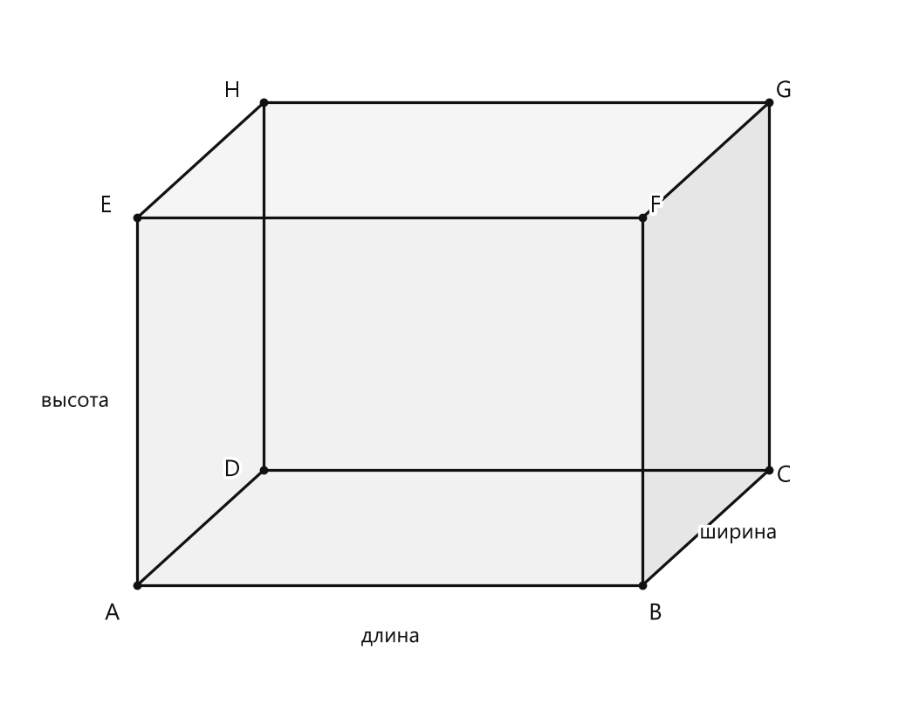

# Занятие 40. Прямоугольный параллелепипед. Куб

**Раздел:** Глава 3. Обыкновенные дроби  
**Параграф учебника:** §17. Прямоугольный параллелепипед. Куб  
**Страницы:** 273–276

## Цели занятия

К концу занятия ученик умеет:

- узнавать прямоугольный параллелепипед и куб среди предметов окружающего мира;
- называть грани, рёбра и вершины;
- находить сумму длин всех рёбер параллелепипеда;
- находить площадь поверхности параллелепипеда и куба;
- переводить единицы длины перед вычислениями;
- решать задачи о распиле куба на маленькие кубики.

Выбери свой блок:

- **1–2 балла:** распознаю фигуры, называю грани, рёбра, вершины;
- **3–4 балла:** применяю формулы для рёбер и площади поверхности;
- **5–6 баллов:** решаю задачи с разными единицами измерения;
- **7–8 баллов:** решаю задачи о кубе, разделённом на маленькие кубики;
- **9–10 баллов:** объясняю решение несколькими способами и проверяю результат.

## Теория к занятию

### 1. Прямоугольный параллелепипед и его элементы

Посмотри на книгу, коробку или кирпич. У них есть длина, ширина и высота, а поверхность состоит из прямоугольников. Это и есть привычная модель прямоугольного параллелепипеда. Коробка — не просто коробка, а геометрический объект с паспортом: 6 граней, 12 рёбер и 8 вершин.

**Определение. Грань**

> Поверхность прямоугольного параллелепипеда состоит из прямоугольников, каждый из которых называют **гранью** параллелепипеда.

**Определение. Ребро**

> Стороны прямоугольников (граней параллелепипеда) называют **рёбрами**.

**Определение. Вершина**

> Вершины прямоугольников (граней параллелепипеда) — **вершинами** параллелепипеда.

**Свойства**

- Противоположные грани параллелепипеда равны.
- У прямоугольного параллелепипеда 6 граней.
- У прямоугольного параллелепипеда 12 рёбер.
- У прямоугольного параллелепипеда 8 вершин.

<!--geo-figure-spec
{
  "needed": true,
  "kind": "plane",
  "caption": "Прямоугольный параллелепипед",
  "equal": false,
  "axis": false,
  "xlim": [
    -1,
    6
  ],
  "ylim": [
    -1,
    5
  ],
  "points": {
    "A": [
      0,
      0
    ],
    "B": [
      4,
      0
    ],
    "C": [
      5,
      1
    ],
    "D": [
      1,
      1
    ],
    "E": [
      0,
      3.2
    ],
    "F": [
      4,
      3.2
    ],
    "G": [
      5,
      4.2
    ],
    "H": [
      1,
      4.2
    ]
  },
  "segments": [
    [
      "A",
      "B"
    ],
    [
      "B",
      "C"
    ],
    [
      "C",
      "D"
    ],
    [
      "D",
      "A"
    ],
    [
      "E",
      "F"
    ],
    [
      "F",
      "G"
    ],
    [
      "G",
      "H"
    ],
    [
      "H",
      "E"
    ],
    [
      "A",
      "E"
    ],
    [
      "B",
      "F"
    ],
    [
      "C",
      "G"
    ],
    [
      "D",
      "H"
    ]
  ],
  "polygons": [
    {
      "vertices": [
        "A",
        "B",
        "F",
        "E"
      ],
      "fill": 0.06
    },
    {
      "vertices": [
        "B",
        "C",
        "G",
        "F"
      ],
      "fill": 0.1
    },
    {
      "vertices": [
        "E",
        "F",
        "G",
        "H"
      ],
      "fill": 0.04
    }
  ],
  "labels": {
    "A": {
      "dx": -0.2,
      "dy": -0.25
    },
    "B": {
      "dx": 0.1,
      "dy": -0.25
    },
    "C": {
      "dx": 0.12,
      "dy": -0.05
    },
    "D": {
      "dx": -0.25,
      "dy": 0
    },
    "E": {
      "dx": -0.25,
      "dy": 0.1
    },
    "F": {
      "dx": 0.1,
      "dy": 0.1
    },
    "G": {
      "dx": 0.12,
      "dy": 0.1
    },
    "H": {
      "dx": -0.25,
      "dy": 0.1
    }
  },
  "texts": [
    {
      "xy": [
        2,
        -0.45
      ],
      "text": "длина"
    },
    {
      "xy": [
        4.75,
        0.45
      ],
      "text": "ширина"
    },
    {
      "xy": [
        -0.5,
        1.6
      ],
      "text": "высота"
    }
  ]
}
-->

*Прямоугольный параллелепипед*

### 2. Измерения параллелепипеда

В каждой вершине сходятся три ребра. Их длины могут быть разными.

**Определение. Измерения параллелепипеда**

> В каждой вершине прямоугольного параллелепипеда сходятся три ребра. Их длины называют измерениями параллелепипеда: **длиной, шириной и высотой**.

Обозначим:

- $a$ — длина;
- $b$ — ширина;
- $c$ — высота.

Все рёбра, направленные одинаково, имеют одну и ту же длину. Поэтому рёбер длины $a$ — четыре, длины $b$ — четыре, длины $c$ — тоже четыре.

### 3. Сумма длин всех рёбер

Если из параллелепипеда сделали проволочный каркас, проволока проходит по всем 12 рёбрам.

**Формулы**

$$
l=4\cdot a+4\cdot b+4\cdot c
$$

или

$$
l=4\cdot(a+b+c),
$$

где $a$, $b$ и $c$ — длины рёбер.

**Алгоритм**

1. Привести все длины к одной единице измерения.
2. Сложить три измерения.
3. Умножить сумму на $4$.
4. Записать ответ с единицей длины.

**Ловушки**

- Не надо складывать только $a+b+c$: это длины трёх рёбер, а не всех двенадцати.
- Нельзя смешивать сантиметры, дециметры и метры.
- $l$ — длина проволоки, поэтому ответ измеряется в единицах длины, а не площади.
- Число $4$ появляется потому, что каждое измерение встречается у четырёх рёбер.

### 4. Куб

У кубика все рёбра одинаковые. Такой параллелепипед особенно дисциплинирован: у него одна длина ребра, зато повторяется много раз.

**Определение. Куб**

> На практике и при решении задач часто используется прямоугольный параллелепипед, у которого все измерения равны. Он называется **кубом**.

**Свойство**

> Грани куба — это квадраты.

Если ребро куба равно $a$, то сумма длин всех его рёбер:

$$
l=12\cdot a.
$$

### 5. Площадь поверхности прямоугольного параллелепипеда

Поверхность состоит из трёх пар равных прямоугольников:

- две грани площадью $ab$;
- две грани площадью $ac$;
- две грани площадью $bc$.

**Формула**

$$
S=2\cdot(ab+ac+bc),
$$

где $a$, $b$ и $c$ — измерения параллелепипеда.

**Алгоритм**

1. Привести измерения к одной единице длины.
2. Найти $ab$, $ac$ и $bc$.
3. Сложить полученные площади.
4. Умножить сумму на $2$.
5. Записать ответ в квадратных единицах.

### 6. Площадь поверхности куба

У куба 6 одинаковых граней. Площадь одной грани равна $a^2$.

**Формула**

$$
S=6\cdot a^2,
$$

где $a$ — длина ребра куба.

**Ловушки**

- Площадь поверхности измеряется в квадратных единицах: $\text{см}^2$, $\text{дм}^2$, $\text{м}^2$.
- Сначала возводим длину ребра в квадрат, затем умножаем на $6$.
- Не путай $12a$ и $6a^2$: первое — сумма длин рёбер, второе — площадь поверхности. Один ответ «линейный», другой «квадратный».

## Сводка формул «выучить наизусть»

Для прямоугольного параллелепипеда:

$$
l=4\cdot(a+b+c)
$$

$$
S=2\cdot(ab+ac+bc)
$$

Для куба:

$$
l=12\cdot a
$$

$$
S=6\cdot a^2
$$

## Правила, которые нельзя путать

- **Ребро** — отрезок, поэтому его длина измеряется в сантиметрах, дециметрах, метрах.
- **Грань** — прямоугольник или квадрат, поэтому её площадь измеряется в квадратных единицах.
- В формуле $l=4(a+b+c)$ ищем длину всех рёбер.
- В формуле $S=2(ab+ac+bc)$ ищем площадь всей поверхности.
- В кубе все три измерения равны одному ребру $a$.

# Разбор ключевых заданий

## Р1. Элементы прямоугольного параллелепипеда

**Условие.** Прямоугольный параллелепипед имеет длину $9$ см, ширину $6$ см и высоту $4$ см. Сколько у него граней, рёбер и вершин?

**Решение**

У любого прямоугольного параллелепипеда:

1. Количество граней равно $6$.
2. Количество рёбер равно $12$.
3. Количество вершин равно $8$.

Размеры фигуры на это не влияют. Хоть параллелепипед размером с коробку, хоть размером с шкаф — «команда» та же.

**Ответ:** $6$ граней, $12$ рёбер, $8$ вершин.

## Р2. Площади граней

**Условие.** Измерения прямоугольного параллелепипеда равны $9$ см, $6$ см и $4$ см. Найдите площадь грани со сторонами $9$ см и $6$ см и площадь грани со сторонами $6$ см и $4$ см.

**Решение**

Площадь прямоугольника равна произведению длин его сторон.

Площадь первой грани:

$$
S_1=9\cdot6
$$

$$
S_1=54\text{ см}^2
$$

Площадь второй грани:

$$
S_2=6\cdot4
$$

$$
S_2=24\text{ см}^2
$$

**Ответ:** $54\text{ см}^2$ и $24\text{ см}^2$.

## Р3. Каркас прямоугольного параллелепипеда

**Условие.** Из проволоки сделали каркас прямоугольного параллелепипеда с измерениями $14$ см, $20$ см и $9$ см. Сколько сантиметров проволоки израсходовали?

**Решение**

Используем формулу суммы длин всех рёбер:

$$
l=4\cdot(a+b+c)
$$

Подставим значения:

$$
l=4\cdot(14+20+9)
$$

Сначала найдём сумму измерений:

$$
14+20=34
$$

$$
34+9=43
$$

Умножим на $4$:

$$
l=4\cdot43
$$

$$
l=172\text{ см}
$$

Проверка: четыре ребра длиной $14$ см дают $56$ см, четыре ребра длиной $20$ см дают $80$ см, четыре ребра длиной $9$ см дают $36$ см.

$$
56+80+36=172\text{ см}
$$

**Ответ:** $172$ см.

## Р4. Каркас с переводом единиц

**Условие.** Из проволоки сделали каркас прямоугольного параллелепипеда с измерениями $120$ мм, $18$ см и $3$ дм. Сколько сантиметров проволоки израсходовали?

**Решение**

Приведём все измерения к сантиметрам:

$$
120\text{ мм}=12\text{ см}
$$

$$
3\text{ дм}=30\text{ см}
$$

Теперь измерения равны $12$ см, $18$ см и $30$ см.

Используем формулу:

$$
l=4\cdot(a+b+c)
$$

$$
l=4\cdot(12+18+30)
$$

$$
12+18=30
$$

$$
30+30=60
$$

$$
l=4\cdot60
$$

$$
l=240\text{ см}
$$

Проверка:

$$
4\cdot12+4\cdot18+4\cdot30
=48+72+120
=240\text{ см}
$$

**Ответ:** $240$ см.

## Р5. Площадь поверхности прямоугольного параллелепипеда

**Условие.** Найдите площадь поверхности прямоугольного параллелепипеда с измерениями $8$ см, $6$ см и $5$ см.

**Решение**

Используем формулу:

$$
S=2\cdot(ab+ac+bc)
$$

Подставим значения:

$$
S=2\cdot(8\cdot6+8\cdot5+6\cdot5)
$$

Найдём площади трёх разных граней:

$$
8\cdot6=48\text{ см}^2
$$

$$
8\cdot5=40\text{ см}^2
$$

$$
6\cdot5=30\text{ см}^2
$$

Сложим их:

$$
48+40+30=118\text{ см}^2
$$

Так как каждая такая грань встречается дважды:

$$
S=2\cdot118
$$

$$
S=236\text{ см}^2
$$

**Ответ:** $236\text{ см}^2$.

## Р6. Площадь поверхности куба

**Условие.** Найдите площадь поверхности куба, если длина его ребра равна $8$ см.

**Решение**

Используем формулу площади поверхности куба:

$$
S=6\cdot a^2
$$

Подставим $a=8$ см:

$$
S=6\cdot8^2
$$

Сначала найдём квадрат ребра:

$$
8^2=8\cdot8=64
$$

Теперь умножим на $6$:

$$
S=6\cdot64
$$

$$
S=384\text{ см}^2
$$

Проверка: одна грань имеет площадь $64\text{ см}^2$, а граней шесть:

$$
64+64+64+64+64+64=384\text{ см}^2
$$

**Ответ:** $384\text{ см}^2$.

## Р7. Сумма длин рёбер куба

**Условие.** Найдите сумму длин всех рёбер куба, если длина одного ребра равна $2$ м $6$ см.

**Решение**

Переведём длину ребра в сантиметры:

$$
2\text{ м}=200\text{ см}
$$

$$
2\text{ м }6\text{ см}=206\text{ см}
$$

У куба $12$ рёбер одинаковой длины.

$$
l=12\cdot a
$$

$$
l=12\cdot206
$$

Разложим вычисление:

$$
206\cdot12=206\cdot(10+2)
$$

$$
206\cdot10=2060
$$

$$
206\cdot2=412
$$

$$
2060+412=2472
$$

Значит,

$$
l=2472\text{ см}
$$

Переведём в метры и сантиметры:

$$
2472\text{ см}=24\text{ м }72\text{ см}
$$

**Ответ:** $2472$ см, или $24$ м $72$ см.

## Р8. Куб, распиленный на маленькие кубики

**Условие.** Куб с ребром $3$ дм распилили на кубики с ребром $1$ дм. Сколько всего получилось кубиков? Сколько из них имеют одну, две и три окрашенные грани, если большой куб был окрашен снаружи? Есть ли неокрашенные кубики?

**Решение**

На каждом ребре помещается:

$$
3:1=3
$$

маленьких кубика.

Всего кубиков:

$$
3\cdot3\cdot3=27
$$

Теперь рассмотрим положение кубиков.

Кубики с тремя окрашенными гранями находятся в вершинах большого куба:

$$
8
$$

Кубики с двумя окрашенными гранями находятся на рёбрах, но не в вершинах. На каждом ребре:

$$
3-2=1
$$

такой кубик.

Рёбер $12$, значит:

$$
12\cdot1=12
$$

Кубики с одной окрашенной гранью находятся в центре каждой грани. На каждой грани:

$$
(3-2)^2=1
$$

такой кубик.

Граней $6$, значит:

$$
6\cdot1=6
$$

Неокрашенные кубики находятся внутри большого куба. Их количество:

$$
(3-2)^3=1
$$

Проверим общее количество:

$$
8+12+6+1=27
$$

Проверка совпала.

**Ответ:** всего $27$ кубиков; с одной окрашенной гранью — $6$, с двумя — $12$, с тремя — $8$, неокрашенных — $1$.

## Р9. Составная задача с единицами измерения

**Условие.** Найдите площадь поверхности прямоугольного параллелепипеда с измерениями $3$ дм, $17$ см и $24$ см.

**Решение**

Переведём $3$ дм в сантиметры:

$$
3\text{ дм}=30\text{ см}
$$

Теперь измерения равны $30$ см, $17$ см и $24$ см.

Используем формулу:

$$
S=2\cdot(ab+ac+bc)
$$

Подставим значения:

$$
S=2\cdot(30\cdot17+30\cdot24+17\cdot24)
$$

Найдём произведения:

$$
30\cdot17=510
$$

$$
30\cdot24=720
$$

$$
17\cdot24=408
$$

Сложим:

$$
510+720=1230
$$

$$
1230+408=1638
$$

Умножим на $2$:

$$
S=2\cdot1638
$$

$$
S=3276\text{ см}^2
$$

Проверка единиц: все измерения были в сантиметрах, поэтому площадь получилась в квадратных сантиметрах.

**Ответ:** $3276\text{ см}^2$.

## Р10. Сравнение суммы рёбер и площади поверхности куба

**Условие.** Ребро куба равно $5$ см. Найдите сумму длин всех рёбер и площадь поверхности куба.

**Решение**

Сумма длин всех рёбер:

$$
l=12\cdot a
$$

$$
l=12\cdot5
$$

$$
l=60\text{ см}
$$

Площадь поверхности:

$$
S=6\cdot a^2
$$

$$
S=6\cdot5^2
$$

$$
5^2=25
$$

$$
S=6\cdot25
$$

$$
S=150\text{ см}^2
$$

Здесь ответы имеют разные единицы: $60$ см — длина, $150\text{ см}^2$ — площадь. Сравнивать их как обычные числа нельзя: сантиметр и квадратный сантиметр — не одно и то же.

**Ответ:** сумма длин рёбер — $60$ см; площадь поверхности — $150\text{ см}^2$.

## Практические задания

Выбери свой уровень и решай только этот блок. В блоке должна закрепиться вся тема параграфа. Ответы не приводятся.

### Уровень 1–2 балла

**С1.** Выберите верное утверждение о прямоугольном параллелепипеде:  
1) у него 4 грани; 2) у него 6 граней; 3) у него 8 граней; 4) у него 10 граней; 5) у него 12 граней.

**С2.** Выберите верное утверждение о прямоугольном параллелепипеде:  
1) у него 6 рёбер; 2) у него 8 рёбер; 3) у него 10 рёбер; 4) у него 12 рёбер; 5) у него 14 рёбер.

**С3.** Выберите верное утверждение о прямоугольном параллелепипеде:  
1) у него 4 вершины; 2) у него 6 вершин; 3) у него 8 вершин; 4) у него 10 вершин; 5) у него 12 вершин.

**С4.** Выберите верное утверждение о кубе:  
1) все его грани — треугольники; 2) все его грани — прямоугольники, но не квадраты; 3) все его грани — квадраты; 4) у куба только четыре грани; 5) у куба нет рёбер.

**С5.** В каждой вершине прямоугольного параллелепипеда сходятся три ребра. Как называют длины этих рёбер?  
1) диагоналями; 2) измерениями; 3) периметрами; 4) площадями; 5) углами.

**С6.** Прямоугольный параллелепипед имеет длину $8$ см, ширину $5$ см и высоту $3$ см. Найдите сумму длин всех его рёбер.

**С7.** Ребро куба имеет длину $4$ см. Найдите сумму длин всех рёбер куба.

**С8.** Прямоугольный параллелепипед имеет измерения $6$ см, $4$ см и $2$ см. Найдите площадь его поверхности.

**С9.** Ребро куба имеет длину $5$ см. Найдите площадь его поверхности.

**С10.** Прямоугольный параллелепипед имеет длину $9$ дм, ширину $4$ дм и высоту $2$ дм. Запишите длины его трёх измерений в порядке возрастания.

**С11.** Длина, ширина и высота прямоугольного параллелепипеда равны соответственно $7$ см, $3$ см и $5$ см. Сколько граней этого параллелепипеда имеют форму прямоугольника со сторонами $7$ см и $3$ см?

**С12.** Ребро куба равно $2$ дм. Найдите площадь одной его грани.

**С13.** Выберите фигуру, которая является кубом:  
1) прямоугольный параллелепипед с измерениями 3 см, 4 см и 5 см; 2) прямоугольный параллелепипед с измерениями 6 см, 6 см и 6 см; 3) прямоугольник со сторонами 6 см и 6 см; 4) прямоугольный параллелепипед с измерениями 2 см, 2 см и 5 см; 5) треугольник со сторонами 4 см, 4 см и 4 см.

**С14.** Сколько граней имеет прямоугольный параллелепипед?  
1) 4; 2) 6; 3) 8; 4) 10; 5) 12.

**С15.** Сколько рёбер имеет куб?  
1) 6; 2) 8; 3) 10; 4) 12; 5) 14.

**С16.** Прямоугольный параллелепипед имеет длину 7 см, ширину 4 см и высоту 3 см. Найдите сумму длин всех его рёбер.  
1) 14 см; 2) 28 см; 3) 42 см; 4) 56 см; 5) 84 см.

**С17.** Ребро куба равно 5 дм. Найдите сумму длин всех его рёбер.  
1) 30 дм; 2) 40 дм; 3) 50 дм; 4) 60 дм; 5) 75 дм.

**С18.** Найдите площадь поверхности куба с ребром 4 см.  
1) 16 см²; 2) 24 см²; 3) 64 см²; 4) 96 см²; 5) 128 см².

**С19.** Измерения прямоугольного параллелепипеда равны 8 см, 5 см и 2 см. Найдите площадь его поверхности.  
1) 80 см²; 2) 100 см²; 3) 132 см²; 4) 160 см²; 5) 200 см².

**С20.** Ребро куба равно 3 дм. Найдите площадь его поверхности. Ответ запишите в квадратных дециметрах.

**С21.** Укажите формулу суммы длин всех рёбер прямоугольного параллелепипеда с измерениями $a$, $b$ и $c$:  
1) $a+b+c$; 2) $2(a+b+c)$; 3) $3(a+b+c)$; 4) $4(a+b+c)$; 5) $abc$.

**С22.** Укажите формулу площади поверхности прямоугольного параллелепипеда с измерениями $a$, $b$ и $c$:  
1) $abc$; 2) $2(ab+ac+bc)$; 3) $ab+ac+bc$; 4) $4(a+b+c)$; 5) $6a^2$.

**С23.** Прямоугольный параллелепипед имеет длину 9 см, ширину 3 см и высоту 2 см. Запишите длины трёх рёбер, сходящихся в одной вершине.

**С24.** Площадь поверхности куба равна $150$ см². Найдите площадь одной его грани.

**С25.** Сколько граней имеет прямоугольный параллелепипед?  
1) 4  2) 6  3) 8  4) 10  5) 12

**С26.** Сколько рёбер имеет прямоугольный параллелепипед?  
1) 6  2) 8  3) 10  4) 12  5) 14

**С27.** Сколько вершин имеет прямоугольный параллелепипед?  
1) 4  2) 6  3) 8  4) 10  5) 12

**С28.** Выберите верное утверждение.  
1) У куба все грани — прямоугольники, но не квадраты.  
2) Куб — это прямоугольный параллелепипед, у которого все измерения равны.  
3) У прямоугольного параллелепипеда 8 граней.  
4) У куба 10 рёбер.  
5) У прямоугольного параллелепипеда 6 вершин.

**С29.** Длины трёх измерений прямоугольного параллелепипеда равны 5 см, 3 см и 2 см. Чему равна сумма длин всех его рёбер?  
1) 10 см  2) 20 см  3) 30 см  4) 40 см  5) 60 см

**С30.** Длина ребра куба равна 7 см. Найдите сумму длин всех его рёбер.  
1) 28 см  2) 42 см  3) 56 см  4) 84 см  5) 98 см

**С31.** Найдите площадь поверхности прямоугольного параллелепипеда с измерениями 4 см, 3 см и 2 см. Ответ запишите в квадратных сантиметрах.

**С32.** Найдите площадь поверхности куба, длина ребра которого равна 5 дм. Ответ запишите в квадратных дециметрах.

**С33.** Длины измерений прямоугольного параллелепипеда равны 6 см, 4 см и 3 см. Найдите площадь грани, стороны которой имеют длины 6 см и 4 см.  
1) 10 см²  2) 18 см²  3) 24 см²  4) 36 см²  5) 48 см²

**С34.** Ребро куба имеет длину 2 м 5 см. Найдите длину ребра в сантиметрах.

**С35.** Прямоугольный параллелепипед имеет измерения 8 см, 5 см и 2 см. Найдите площадь его поверхности. Ответ запишите в квадратных сантиметрах.

**С36.** Куб с ребром 3 дм распилили на кубики с ребром 1 дм. Сколько кубиков имеют три окрашенные грани, если первоначально весь куб был окрашен снаружи?  
1) 1  2) 4  3) 6  4) 8  5) 12

### Уровень 3–4 балла

**С1.** Запишите, сколько граней, рёбер и вершин имеет прямоугольный параллелепипед.

**С2.** Прямоугольный параллелепипед имеет длину $8$ см, ширину $5$ см и высоту $3$ см. Запишите длины всех рёбер, параллельных ребру длиной $8$ см.

**С3.** Из проволоки изготовили каркас прямоугольного параллелепипеда с измерениями $7$ см, $4$ см и $5$ см. Сколько сантиметров проволоки потребовалось?

**С4.** Найдите сумму длин всех рёбер куба, если длина его ребра равна $9$ см.

**С5.** Найдите сумму длин всех рёбер прямоугольного параллелепипеда с измерениями $12$ дм, $8$ дм и $5$ дм.

**С6.** Найдите площадь грани прямоугольного параллелепипеда, стороны которой имеют длины $9$ см и $6$ см.

**С7.** Найдите площадь поверхности прямоугольного параллелепипеда с измерениями $6$ см, $4$ см и $3$ см.

**С8.** Найдите площадь поверхности куба, длина ребра которого равна $7$ см.

**С9.** Измерения прямоугольного параллелепипеда равны $5$ дм, $3$ дм и $2$ дм. Найдите площадь его поверхности.

**С10.** Длина ребра куба равна $2$ дм $5$ см. Найдите сумму длин всех его рёбер, выразив ответ в сантиметрах.

**С11.** Прямоугольный параллелепипед имеет измерения $8$ см, $5$ см и $4$ см. Найдите площадь его поверхности, если площадь каждой грани вычислять отдельно и затем сложить площади всех шести граней.

**С12.** Куб с ребром $4$ см распилили на кубики с ребром $1$ см. Сколько маленьких кубиков имеют три окрашенные грани, если перед распиливанием поверхность большого куба была полностью окрашена?

**С13.** Сколько граней, рёбер и вершин имеет прямоугольный параллелепипед?

**С14.** У прямоугольного параллелепипеда длина равна $8$ см, ширина — $5$ см, высота — $3$ см. Запишите длины всех рёбер, параллельных ребру длиной $8$ см.

**С15.** Найдите сумму длин всех рёбер прямоугольного параллелепипеда с измерениями $7$ см, $4$ см и $6$ см.

**С16.** Из проволоки изготовили каркас прямоугольного параллелепипеда с измерениями $12$ см, $9$ см и $5$ см. Сколько сантиметров проволоки израсходовали?

**С17.** Найдите сумму длин всех рёбер куба, если длина его ребра равна $6$ см.

**С18.** Ребро куба равно $4$ дм. Найдите площадь его поверхности.

**С19.** Площадь одной грани куба равна $49$ см². Найдите площадь поверхности куба.

**С20.** Найдите площадь поверхности прямоугольного параллелепипеда с измерениями $6$ см, $4$ см и $3$ см.

**С21.** Найдите площадь поверхности прямоугольного параллелепипеда с измерениями $2$ дм, $5$ дм и $7$ дм.

**С22.** Измерения прямоугольного параллелепипеда равны $10$ см, $6$ см и $4$ см. Найдите площадь грани, имеющей измерения $10$ см и $6$ см.

**С23.** Прямоугольный параллелепипед имеет измерения $8$ см, $5$ см и $3$ см. На сколько квадратных сантиметров площадь грани с измерениями $8$ см и $5$ см больше площади грани с измерениями $5$ см и $3$ см?

**С24.** Куб с ребром $3$ дм распилили на кубики с ребром $1$ дм. Сколько маленьких кубиков получилось? Сколько из них имеют три окрашенные грани, если большой куб был окрашен со всех сторон до распиливания?

**С25.** Сколько граней, рёбер и вершин имеет прямоугольный параллелепипед?

**С26.** У прямоугольного параллелепипеда длина равна $8$ см, ширина — $5$ см, высота — $3$ см. Запишите длины трёх рёбер, выходящих из одной вершины.

**С27.** Найдите сумму длин всех рёбер прямоугольного параллелепипеда с измерениями $7$ см, $4$ см и $6$ см.

**С28.** Из проволоки изготовили каркас прямоугольного параллелепипеда с измерениями $12$ см, $9$ см и $5$ см. Сколько сантиметров проволоки потребовалось?

**С29.** Длина ребра куба равна $6$ см. Найдите сумму длин всех его рёбер.

**С30.** Длина ребра куба равна $4$ дм. Найдите площадь его поверхности.

**С31.** Найдите площадь поверхности куба с ребром $9$ см.

**С32.** Измерения прямоугольного параллелепипеда равны $6$ см, $4$ см и $3$ см. Найдите площадь его поверхности.

**С33.** Найдите площадь поверхности прямоугольного параллелепипеда с измерениями $10$ дм, $7$ дм и $2$ дм.

**С34.** Длина прямоугольного параллелепипеда равна $8$ см, ширина — $5$ см, высота — $4$ см. Найдите площадь грани, имеющей стороны длиной $8$ см и $4$ см.

**С35.** У прямоугольного параллелепипеда длина равна $9$ см, ширина — $6$ см, высота — $4$ см. Найдите площадь двух противоположных граней, имеющих стороны длиной $9$ см и $6$ см.

**С36.** Ребро куба равно $2\frac{1}{2}$ дм. Найдите площадь его поверхности.

### Уровень 5–6 баллов

**С1.** Прямоугольный параллелепипед имеет длину $8$ см, ширину $5$ см и высоту $3$ см. Сколько у него граней, рёбер и вершин? Найдите сумму длин всех его рёбер.

**С2.** Из проволоки изготовили каркас прямоугольного параллелепипеда с измерениями $14$ см, $8$ см и $5$ см. Сколько сантиметров проволоки израсходовали?

**С3.** Длина ребра куба равна $2\frac{1}{2}$ см. Найдите сумму длин всех рёбер куба.

**С4.** Найдите площадь поверхности куба, если длина его ребра равна $2$ дм $5$ см. Ответ выразите в квадратных сантиметрах.

**С5.** Найдите площадь поверхности прямоугольного параллелепипеда с измерениями $7$ см, $4$ см и $3$ см.

**С6.** Найдите площадь поверхности прямоугольного параллелепипеда, длина которого равна $2$ дм, ширина — $15$ см, а высота — $4$ дм. Ответ выразите в квадратных сантиметрах.

**С7.** Измерения прямоугольного параллелепипеда равны $\frac{1}{2}$ м, $\frac{2}{3}$ м и $1$ м. Найдите площадь его поверхности.

**С8.** Два прямоугольных параллелепипеда имеют соответственно измерения $3$ см, $5$ см, $8$ см и $8$ см, $5$ см, $3$ см. Сравните площади их поверхностей.

**С9.** Куб с ребром $4$ дм распилили на кубики с ребром $1$ дм. Сколько получилось кубиков? Сколько из них имеют одну окрашенную грань, если первоначально все грани большого куба были окрашены? Сколько кубиков имеют две окрашенные грани, три окрашенные грани и ни одной окрашенной грани?

**С10.** Прямоугольный лист картона имеет размеры $8$ см и $7$ см. Достаточно ли этого картона, чтобы полностью оклеить куб с ребром $3$ см? Для сравнения площадей выразите их в квадратных сантиметрах.

**С11.** Четыре одинаковых прямоугольных бруска имеют длину $6$ см, ширину $3$ см и высоту $2$ см. Бруски уложили в один ряд так, что длина каждого следующего бруска продолжает длину предыдущего. Найдите измерения получившегося прямоугольного параллелепипеда и сумму длин всех его рёбер.

**С12.** Площадь поверхности прямоугольного параллелепипеда равна $94$ см², его длина равна $3$ см, а ширина — $4$ см. Найдите высоту параллелепипеда.

**С13.** Прямоугольный параллелепипед имеет измерения $9$ см, $6$ см и $4$ см. Найдите длины всех его рёбер и сумму длин всех рёбер.

**С14.** Из проволоки изготовили каркас прямоугольного параллелепипеда с измерениями $15$ см, $8$ см и $7$ см. Сколько сантиметров проволоки потребовалось?

**С15.** Длина одного ребра куба равна $13$ см. Найдите сумму длин всех рёбер куба.

**С16.** Ребро куба имеет длину $2$ дм $5$ см. Найдите сумму длин всех рёбер куба, выразив ответ в дециметрах.

**С17.** Найдите площадь поверхности прямоугольного параллелепипеда с измерениями $7$ см, $5$ см и $3$ см.

**С18.** Измерения прямоугольного параллелепипеда равны $4$ дм, $25$ см и $6$ дм. Найдите площадь его поверхности в квадратных дециметрах.

**С19.** Найдите площадь поверхности куба, ребро которого равно $9$ см.

**С20.** Ребро куба имеет длину $1$ м $20$ см. Найдите площадь поверхности куба, выразив ответ в квадратных дециметрах.

**С21.** Прямоугольный параллелепипед имеет длину $12$ см, ширину $8$ см и высоту $5$ см. На сколько квадратных сантиметров площадь его поверхности больше площади поверхности куба с ребром $6$ см?

**С22.** Площадь одной грани прямоугольного параллелепипеда равна $48$ см². Эта грань имеет стороны $8$ см и $6$ см. Третье измерение параллелепипеда равно $5$ см. Найдите площадь его поверхности.

**С23.** У прямоугольного параллелепипеда длина равна $10$ см, ширина — $6$ см, а высота на $2$ см меньше ширины. Найдите сумму длин всех рёбер и площадь поверхности параллелепипеда.

**С24.** Прямоугольный параллелепипед имеет измерения $1\frac{1}{2}$ м, $1$ м и $2$ м. Найдите сумму длин всех рёбер и площадь его поверхности. Ответ выразите в метрах и квадратных метрах соответственно.

**С25.** Прямоугольный параллелепипед имеет длину $12$ см, ширину $7$ см и высоту $5$ см. Найдите сумму длин всех его рёбер.

**С26.** Найдите площадь поверхности прямоугольного параллелепипеда, измерения которого равны $8$ см, $5$ см и $3$ см.

**С27.** Длина ребра куба равна $4$ дм. Найдите сумму длин всех его рёбер и площадь его поверхности.

**С28.** Площадь поверхности прямоугольного параллелепипеда равна $94$ см$^2$. Его длина равна $5$ см, ширина — $3$ см. Найдите высоту параллелепипеда.

**С29.** Сравните площади поверхностей двух прямоугольных параллелепипедов. Размеры первого параллелепипеда: $6$ см, $4$ см и $3$ см. Размеры второго: $5$ см, $4$ см и $4$ см. На сколько квадратных сантиметров площадь поверхности одного из них больше площади поверхности другого?

**С30.** Куб с ребром $4$ дм покрасили со всех сторон и распилили на кубики с ребром $1$ дм. Сколько получилось кубиков, имеющих одну окрашенную грань, две окрашенные грани и три окрашенные грани? Сколько получилось кубиков без окрашенных граней?

### Уровень 7–8 баллов

**С1.** Прямоугольный параллелепипед имеет измерения $8$ см, $5$ см и $3$ см. Запишите длины всех его рёбер и укажите, сколько рёбер имеют длину $8$ см, сколько — $5$ см и сколько — $3$ см.

**С2.** Деревянный каркас прямоугольного параллелепипеда имеет измерения $14$ см, $9$ см и $6$ см. Сколько сантиметров проволоки потребуется для изготовления каркаса? Запишите используемую формулу и вычисления.

**С3.** Для изготовления каркаса прямоугольного параллелепипеда использовали $176$ см проволоки. Длина параллелепипеда равна $18$ см, ширина — $12$ см. Найдите его высоту. Проверьте полученный результат подстановкой в формулу суммы длин всех рёбер.

**С4.** Измерения прямоугольного параллелепипеда равны $7$ см, $4$ см и $3$ см. Найдите площади трёх различных граней и объясните, почему площадь каждой из них встречается на поверхности параллелепипеда дважды.

**С5.** Найдите площадь поверхности прямоугольного параллелепипеда с измерениями $9$ см, $6$ см и $4$ см. Решите задачу двумя способами: через площади граней и по формуле $S=2(ab+ac+bc)$.

**С6.** Прямоугольный параллелепипед имеет измерения $12$ см, $8$ см и $5$ см. На окрашивание всей его поверхности израсходовали $1$ условную единицу краски на каждые $10\ \text{см}^2$. Сколько таких условных единиц краски потребовалось? Считайте, что краска покрывает поверхность равномерно.

**С7.** Площадь поверхности прямоугольного параллелепипеда с измерениями 10 см, 6 см и 3 см равна площади поверхности куба. Найдите длину ребра куба. Обоснуйте, что найденное значение удовлетворяет условию.

**С8.** Ребро куба равно $7$ см. Найдите сумму длин всех его рёбер и площадь его поверхности. Во сколько раз численное значение площади поверхности больше численного значения суммы длин рёбер?

**С9.** Площадь поверхности куба равна $864\ \text{см}^2$. Найдите длину его ребра и сумму длин всех рёбер. Выполните проверку найденного ребра по формуле площади поверхности куба.

**С10.** Ребро куба имеет длину $2\ \text{дм}\ 5\ \text{см}$. Найдите площадь поверхности куба в квадратных сантиметрах и сумму длин всех рёбер в сантиметрах. Перед вычислениями выразите длину ребра в сантиметрах.

**С11.** Куб с ребром $4$ дм покрасили со всех сторон и распилили на кубики с ребром $1$ дм. Сколько получилось кубиков, имеющих:  
а) три окрашенные грани;  
б) две окрашенные грани;  
в) одну окрашенную грань;  
г) ни одной окрашенной грани?  
Обоснуйте способ подсчёта и проверьте, что сумма найденных количеств равна общему числу маленьких кубиков.

**С12.** Из трёх одинаковых прямоугольных брусков с измерениями $8$ см, $4$ см и $2$ см составили прямоугольный параллелепипед, приложив бруски друг к другу длинными гранями так, чтобы их размеры $8$ см и $4$ см оставались неизменными, а размер $2$ см складывался. Найдите измерения получившегося параллелепипеда, сумму длин всех его рёбер и площадь его поверхности.

**С13.** Прямоугольный параллелепипед имеет измерения $8$ см, $5$ см и $3$ см. Найдите сумму длин всех его рёбер и площадь его поверхности.

**С14.** Сумма длин всех рёбер прямоугольного параллелепипеда равна $96$ см. Длина параллелепипеда на $4$ см больше ширины, а высота равна ширине. Найдите его измерения.

**С15.** Из проволоки длиной $2$ м $40$ см изготовили каркас прямоугольного параллелепипеда. Его длина равна $35$ см, ширина — $18$ см. Найдите высоту параллелепипеда.

**С16.** Измерения прямоугольного параллелепипеда равны $1\frac{1}{2}$ м, $80$ см и $2$ м. Найдите площадь его поверхности в квадратных дециметрах.

**С17.** Площадь поверхности прямоугольного параллелепипеда с измерениями $6$ см, $8$ см и $x$ см равна $208$ см$^2$. Найдите $x$ и сумму длин всех рёбер этого параллелепипеда.

**С18.** Длина прямоугольного параллелепипеда равна $12$ см, ширина составляет $\frac{2}{3}$ длины, а высота на $3$ см меньше ширины. Найдите площадь поверхности параллелепипеда.

**С19.** Площадь поверхности куба равна $294$ см$^2$. Найдите длину его ребра и сумму длин всех рёбер.

**С20.** Ребро одного куба в $2$ раза длиннее ребра другого куба. Во сколько раз площадь поверхности первого куба больше площади поверхности второго? Обоснуйте ответ вычислениями по формуле площади поверхности куба.

**С21.** Прямоугольный параллелепипед имеет измерения $4$ см, $6$ см и $9$ см. Из него вырезали два одинаковых прямоугольных параллелепипеда с измерениями $4$ см, $3$ см и $2$ см. Найдите площадь поверхности каждого вырезанного параллелепипеда и сравните её с площадью поверхности исходного параллелепипеда.

**С22.** Деревянный куб с ребром $4$ дм покрасили со всех сторон и распилили на кубики с ребром $1$ дм. Сколько получилось кубиков, имеющих ровно одну окрашенную грань, и сколько кубиков не имеют окрашенных граней?

**С23.** Куб с ребром $3$ см распилили на кубики с ребром $1$ см. Все полученные кубики выложили в один ряд вплотную друг к другу. Найдите длину ряда и площадь поверхности одного маленького кубика.

**С24.** Сумма длин всех рёбер прямоугольного параллелепипеда равна $36$ дм. Его высота равна $4$ дм, а ширина на $1$ дм больше длины. Найдите площадь поверхности этого параллелепипеда.

### Уровень 9–10 баллов

**С1.** Сумма длин всех рёбер прямоугольного параллелепипеда равна $156$ см. Длина параллелепипеда равна $7$ см, ширина — $11$ см. Найдите его высоту.

**С2.** Площадь поверхности прямоугольного параллелепипеда с измерениями $3$ см, $4$ см и $x$ см равна $94$ см$^2$. Найдите $x$.

**С3.** Площадь поверхности куба равна $864$ см$^2$. Найдите длину его ребра.

**С4.** Площадь поверхности прямоугольного параллелепипеда равна $188\text{ см}^2$. Его длина равна $7\text{ см}$, ширина — $4\text{ см}$. Найдите высоту параллелепипеда и сумму длин всех его рёбер.

**С5.** Найдите площадь поверхности прямоугольного параллелепипеда, измерения которого равны $1\frac12$ м, $2\frac13$ м и $\frac34$ м. Ответ выразите в квадратных метрах.

**С6.** Площадь поверхности прямоугольного параллелепипеда равна $334$ см$^2$, а два его измерения равны $5$ см и $8$ см. Найдите третье измерение.

**С7.** Сумма длин всех рёбер куба равна $18$ м $72$ см. Найдите длину ребра куба в сантиметрах.

**С8.** Куб с ребром $4$ дм полностью покрыли краской, а затем распилили на кубики с ребром $1$ дм. Сколько получилось кубиков, имеющих ровно одну окрашенную грань, ровно две окрашенные грани и ровно три окрашенные грани? Сколько кубиков не имеет окрашенных граней?

**С9.** Прямоугольный лист картона имеет размеры $20$ см и $15$ см. Из него хотят вырезать детали, которыми можно полностью покрыть поверхность прямоугольного параллелепипеда с измерениями $4$ см, $5$ см и $6$ см. Детали разрешается вырезать любой формы, без учёта толщины разрезов и отходов. Достаточно ли площади листа картона?

**С10.** Шесть одинаковых кубиков с ребром $2$ см складывают вплотную в форме прямоугольного параллелепипеда. Рассмотрите все различные варианты его измерений, если кубики не перекрываются и образуют один прямоугольный параллелепипед. Для каждого варианта найдите площадь поверхности получившегося параллелепипеда.

**С11.** Площадь поверхности прямоугольного параллелепипеда с измерениями $2$ см, $3$ см и $x$ см равна площади поверхности куба с ребром $5$ см. Найдите $x$, а затем определите, у какого из этих тел сумма длин всех рёбер больше.

**С12.** Длины измерений прямоугольного параллелепипеда выражены натуральными числами и в сумме равны $12$ см. Каковы должны быть его измерения, чтобы площадь поверхности была наибольшей? Найдите эту наибольшую площадь поверхности.

**С13.** Сумма длин всех рёбер прямоугольного параллелепипеда равна $96$ см. Два его измерения равны $5$ см и $7$ см. Найдите площадь поверхности этого параллелепипеда.

**С14.** Из одной и той же проволоки изготовили каркас прямоугольного параллелепипеда и каркас куба. У прямоугольного параллелепипеда ширина на $4$ см меньше длины, а высота на $2$ см меньше ширины. Длина всей проволоки равна $104$ см. Определите измерения прямоугольного параллелепипеда и длину ребра куба. Какая из двух фигур имеет большую площадь поверхности и на сколько квадратных сантиметров?

**С15.** Куб с ребром $5$ дм полностью окрашенный распилили на кубики с ребром $1$ дм. На сколько больше получилось кубиков с одной окрашенной гранью, чем кубиков с тремя окрашенными гранями?

**С16.** Одно измерение прямоугольного параллелепипеда равно $4$ см, сумма длин всех его рёбер равна $80$ см, а площадь поверхности — $248$ см². Найдите два других измерения параллелепипеда.

**С17.** Измерения прямоугольного параллелепипеда равны $1\frac{1}{2}$ м, $1\frac{2}{3}$ м и $2$ м. Найдите площадь его поверхности. Ответ запишите в квадратных метрах в виде неправильной дроби.

**С18.** У двух прямоугольных параллелепипедов сумма длин всех рёбер одинакова и равна $48$ см. Измерения первого параллелепипеда равны $2$ см, $4$ см и $6$ см. Одно измерение второго параллелепипеда равно $3$ см, а площадь его поверхности — $94$ см². Найдите разность площадей поверхностей этих параллелепипедов.

## Чек-лист «ученик понял тему»

- Могу повторить определения и формулы параграфа своими словами и по учебнику.
- Решаю типовые задания своего уровня без подсказки.
- Вижу типичную ошибку и могу её объяснить.
